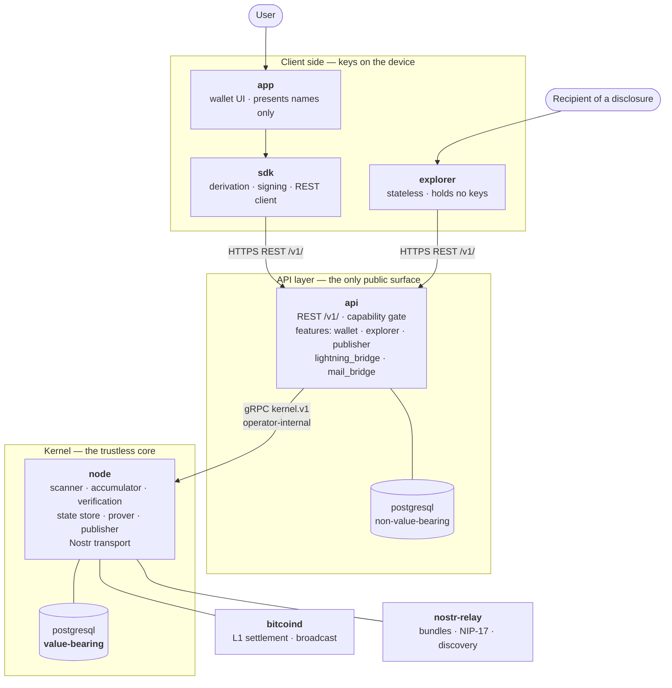

# Architecture

The components zkCoins is built from, which repository each lives in, and the boundaries between them. Every rule here is normative in [Specification §6](/specification#6--system-architecture); this page is the map.

## The picture

## Repositories

| Repository | What it is |
|---|---|
| [`node`](https://github.com/zk-coins/node) | The trustless kernel. Bitcoin scanner, nullifier accumulator, proof verification, state store, prover, publisher, Nostr transport. Speaks `kernel.v1` gRPC on an operator-internal channel. Owns the value-bearing database. |
| [`api`](https://github.com/zk-coins/api) | The public REST surface. Consumes the kernel RPC, enforces the capability gate, owns a non-value-bearing database. Its operator enables features individually. |
| [`sdk`](https://github.com/zk-coins/sdk) | TypeScript client: BIP-39/32 derivation, Schnorr signing, typed REST client, account adapter. Keys stay on the device. |
| [`app`](https://github.com/zk-coins/app) | The end-user wallet. Holds the seed, presents receive identities, payees, and contacts only as names ([Implementation Mandate](/implementation-mandate#app-layer-identity-and-contacts-normative)). |
| [`explorer`](https://github.com/zk-coins/explorer) | Stateless frontend that renders a disclosed view. Holds no keys. |
| [`docs`](https://github.com/zk-coins/docs) | This site, including the normative [Specification](/specification). |
| [`research`](https://github.com/zk-coins/research) · [`plonky2`](https://github.com/zk-coins/plonky2) | Protocol research and upstream references · the proving stack. |

`bitcoind` and the Nostr relay are upstream software, run by the operator or reached externally.

## The four boundaries

**Custody sits in the app.** The key that authorises spending exists only on the user's device and reaches no node and no server ([Requirement 5](/requirements#5-custody-only-in-the-wallet)). The kernel holds viewing keys and the account's Nostr key; it detects, decrypts, proves, and transports, and it cannot spend.

**The kernel speaks gRPC, the API speaks REST.** `kernel.v1` runs on loopback, a private container network, or mTLS between containers. Every public request — wallet, SDK, app, explorer — arrives at the API layer, which terminates it and enforces the capability gate. The kernel remains the sole reader and writer of the value-bearing store, so an API layer that is compromised can refuse and mislead its own users while forging, moving, and double-spending nothing ([§6.1](/specification#61-components-and-responsibilities), [§7.8](/specification#78-kernel-rpc--the-internal-interface-normative)).

**Names live above the kernel.** The app and API layers resolve an account's email-style NIP-05 name, and an API running `wallet` issues names for the accounts it serves. The kernel works from `op_pubkey`, `nprofile`, and `addr_sig`-carrying objects, which keeps DNS and certificate authorities out of the trustless core and lets a publisher back end run on a key and a relay ([§4.3](/specification#43-addressing-for-delivery)).

**The explorer reads, it is not privileged.** It fetches the public chain projection and encrypted blobs, then applies a bearer view secret — `zkview` for one transaction, `zkavk` for a history — in the browser. Bearer secrets are not node authorisations; they widen only what their holder can already decrypt ([§5.1](/specification#51-capability-gated-pull), [§6.4](/specification#64-external-interfaces-abstract)).

## API features

Each feature is off until the operator enables it, and `GET /v1/info` advertises exactly the enabled set. A client treats anything absent from that array as absent, and a request against a disabled feature is answered `404 feature_disabled`.

| Feature | What it opens |
|---|---|
| `wallet` | Proving, submission, and capability-gated pull for the accounts this API serves, plus their NIP-05 names |
| `explorer` | The public read surface: chain projection, accumulator, inclusion proofs, blob fetch |
| `publisher` | The [§7.6](/specification#76-publisher-interface-normative) hand-off, forwarded to a kernel whose publisher part is on |
| `lightning_bridge` | Lightning ⇄ zkCoins swaps at the operator edge ([Lightning bridge](/lightning-bridge)) |
| `mail_bridge` | SMTP interop for the account's NIP-05 identifier ([Mail bridge](/mail-bridge)) |

Publishing and proving are kernel work in every case; the feature opens the door, the kernel does the job and owns the state.

## Deployments

| Deployment | Kernel | API | Serves |
|---|---|---|---|
| **Sovereign personal** | prover on | `wallet`, own account only | its owner |
| **Public service** | prover on, publisher optional | `wallet` for delegating accounts, plus whatever else the operator chooses | its users |
| **Validating node** | verification and accumulator only | none | nobody — it follows and checks the chain |
| **Publisher back end** | publisher on | `publisher` alone | spenders handing over nullifiers |
| **Explorer host** | verification and accumulator | `explorer` alone | the explorer frontend |

The boundary is between **components**, not processes. A small deployment runs kernel and API as one binary against one database process, provided each component owns only its own schema and the public listener is the API's. A public service splits them into separate repositories, containers, and instances — the arrangement [§6.1](/specification#61-components-and-responsibilities) *Running a node* describes.

## Where to read further

- [Requirements](/requirements) — the eleven properties the design exists to satisfy
- [Specification §6](/specification#6--system-architecture) — the normative component, seam, and deployment rules
- [Specification §7](/specification#7--wire-formats--node-interfaces) — REST, kernel RPC, Nostr kinds, Blossom
- [Implementation Mandate](/implementation-mandate) — what each layer must implement before it counts as done
