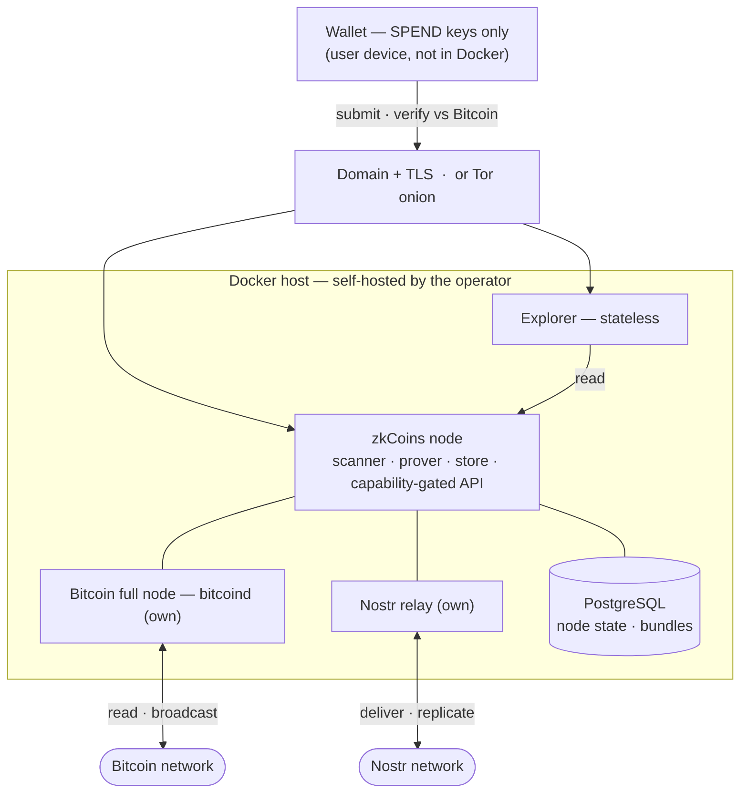

# zkCoins Protocol Specification

This document is **a possible** technical specification of the **zkCoins protocol** — one concrete, buildable realization of the zkCoins concept (Robin Linus) and the **Shielded CSV** construction (Jonas Nick, Liam Eagen, Robin Linus), designed around a single principle: **the full self-sovereignty of every participant, with no central element anywhere in the system.**

> Private payments on Bitcoin — no new chain, no token, no consensus change, no trusted operator. Only Bitcoin, zero-knowledge proofs, and the user's own keys.

:::tip In one paragraph (plain language)
zkCoins lets you send value on Bitcoin without anyone seeing the amount, the asset, who paid, or who received. Bitcoin stores only **opaque markers** that a spend happened — *not* the coin's contents, which travel privately between sender and receiver as a small encrypted bundle. **Double-spend protection** is the chain's job: each spent coin publishes a one-time random-looking *nullifier* on Bitcoin, and any second appearance is rejected. Your **seed phrase** derives every key, your **wallet** is the only thing that can spend, **any node** can serve you, and you check every figure against Bitcoin yourself.
:::

:::info What this is — and what it isn't
This is **one** concrete realization, not the only one possible: wherever the source papers leave a choice open, this specification takes the established, Bitcoin-consistent option and defines it exactly. It builds faithfully on the whitepapers' core and carries their philosophy into every layer they did not formalize — delivery, recovery, access, and operation. It describes the **target design** and is intentionally independent of any current implementation.
:::

## One principle, carried all the way

Every decision below follows from one idea — **complete self-sovereignty, zero central elements** — applied without exception:

| Design decision | follows from the principle |
|---|---|
| Settles only on Bitcoin L1 — no own chain, token, or consensus | inherit the most decentralized base; build no new one |
| Client-side validation; constant-size ZK proofs | each participant verifies for themselves, trusting no one |
| Spend key lives only in the wallet | the participant alone holds custody |
| Off-chain delivery over a node-as-relay mesh | no central delivery service |
| Recovery from seed + Bitcoin + the network | no central backup custodian |
| Capability-gated disclosure; self-hostable, verifiable explorer | the owner alone decides who sees what; no trusted authority |
| Any node — switchable, several at once | no lock-in to any operator |
| Permissionless asset creation | anyone can create their own asset; each asset's minter is its creator |

These are not features bolted on. They are the same principle, followed to its conclusion.

## The triad it guarantees

- **Bitcoin-anchored** — settled on Bitcoin L1, exactly as it exists today.
- **Shielded** — amounts, sender, receiver, and the transaction graph are hidden, behind a global anonymity set.
- **Trustless** — correctness is enforced by cryptography and Bitcoin alone.

Each is rare on its own elsewhere; here they hold **together** — see [Comparisons](/comparisons).

## How the data moves

**What lives where.** Bitcoin holds only opaque markers; everything that says *which coin, how much, between whom* lives off-chain and is encrypted to the recipient:

```
    BITCOIN L1 (Public)                  OFF-CHAIN (Private — wallet + node)
    ────────────────────                 ───────────────────────────────────

    ┌──────────────────┐                 ┌───────────────────────────────┐
    │   SpendRecord    │   sign-to-      │  AccountState                 │
    │   ────────────   │   contract      │   balances · keys · counters  │
    │   Pkᵢ            │   binds         │   coin_history_root           │
    │   nullifiers     │ ◀ H(ProofData)─ ├───────────────────────────────┤
    │   signature      │                 │  Recursive validity proof     │
    │   inr ‖ ocr      │ ◀── attests ─── │   (constant-size · ZK)        │
    └──────────────────┘                 ├───────────────────────────────┤
            ▲                            │  Coin plaintext               │
            │ inscribed in a             │   amount · asset · recipient  │
            │ Taproot reveal-tx          ├───────────────────────────────┤
            │ envelope                   │  CoinProof bundle  ──▶ to B   │
            │                            │   (coin + proof + envelope)   │
            └────────────────────────────┴───────────────────────────────┘
```

**A payment, end to end.** A pays B; both run their own wallet+node; only Bitcoin is shared:

```
    Alice                 Nostr relay         Bitcoin              Bob
      │                       │                  │                  │
      │ 1. build SpendRecord  │                  │                  │
      │    + recursive proof  │                  │                  │
      │                       │                  │                  │
      │ 2. publish encrypted CoinProof bundle (NIP-44 / NIP-59)     │
      ├──────────────────────▶│                  │                  │
      │                       │                  │                  │
      │ 3. inscribe SpendRecord (nullifiers in the clear)           │
      ├──────────────────────────────────────────▶                  │
      │                       │                  │                  │
      │                       │  every node folds the new nfs into  │
      │                       │  its nullifier accumulator          │
      │                       │                  │                  │
      │                       │ 4. scan candidates · match          │
      │                       │    detect_tag (1 Poseidon hash/evt) │
      │                       ◀───────────────────────────────────┤
      │                       │                  │                  │
      │                       │ 5. gift-wrapped bundle blob         │
      │                       ├──────────────────────────────────▶│
      │                       │                  │                  │
      │                       │            6. decrypt with K_tx     │
      │                       │               verify recursive proof│
      │                       │               check nf non-member.  │
      │                       │               of accumulator at tip │
      │                       │                  │                  │
      │                       │            7. credit coin (trustless)
      │                       │                  │                  │
      │ 8. encrypted ACK · A may now drop her retained copy         │
      ◀──────────────────────────────────────────────────────────┤
      │                       │                  │                  │
```

## Scope

The specification covers every component that will exist: the **node** (validator · prover · relay · data store), the **wallet** (thin key-holder), and the **explorer** (public and authorised views) — together with the cryptography that binds them. For every key, hash, and identifier it states exactly **how it is derived**; for every requirement, **how it is met**.

## The ten requirements

The whole specification exists to satisfy these (in full on the [Requirements](/requirements) page):

1. Bitcoin L1 as the only base · 2. Private · 3. Trustless · 4. Client-side validation · 5. Custody only in the wallet · 6. Recovery · 7. Self-hostable · 8. Multi-asset · 9. Selective disclosure · 10. Node portability.

## Contents

| # | Section | What it gives you |
|---|---|---|
| 1 | [Foundations](#1--foundations-normative) | The single source of truth: primitives, the full key hierarchy and exact derivations, every identifier, the data structures and the global nullifier accumulator |
| 2 | [Proofs & State Transitions](#2--proofs--state-transitions) | The compliance predicate, recursion, and the mint / send / receive algorithms |
| 3 | [On-chain Layer](#3--on-chain-layer) | The `SpendRecord`, signing, half-aggregation, the publisher, and the nullifier accumulator |
| 4 | [Transport & Recovery](#4--transport--recovery) | Off-chain delivery, note discovery, seed recovery, data availability |
| 5 | [Access & Explorer](#5--access--explorer) | Capability-gated pull, view grants, and the disclosure spectrum: per-transaction links, balance attestations, full-account views |
| 6 | [System Architecture](#6--system-architecture) | Node, wallet, explorer; portability, multi-node, issuance, threat model |
| — | [Glossary](#glossary) | Every term, identifier, and notation, alphabetical, one line each |
| — | [Test vectors](#test-vectors-conformance-harness) | Worked-example values and a conformance harness for implementations |

New here? Read **Foundations** first — everything else builds on it. Stuck on a term? Jump to the **Glossary**.

## Requirements traceability

Where each requirement is satisfied:

| Requirement | Satisfied by |
|---|---|
| **1 · Bitcoin-only base** | §1 (no native token; secp256k1/BIP-340), §3 (a single `SpendRecord` inscribed; no chain/consensus change) |
| **2 · Private** | §1.3 (per-coin encryption), §1.4 (opaque `SpendRecord` carries only hashes and unlinkable nullifiers), §2 (ZK proof hides amounts/parties/graph) |
| **3 · Trustless** | §2 (proof soundness ⇒ no forgery), §3 (nullifier accumulator ⇒ no double-spend), §1.2 (no key a node holds can spend), §6 (threat model) |
| **4 · Client-side validation** | §2 (receiver re-verifies the full recursive proof), §4 (receive flow) |
| **5 · Custody only in wallet** | §1.2 (SPEND branch is wallet-only; hardened separation) |
| **6 · Recovery** | §1.3 (seed-derived detection/scan keys), §4 (seed reconstruction, replication, data availability) |
| **7 · Self-hostable** | §6 (node ships self-contained, no operator-specific dependencies), §4 (node-as-relay) |
| **8 · Multi-asset** | §1.4 (`asset_id`), §1.5 (per-asset balances), §2 (per-asset conservation), §6 (issuance) |
| **9 · Explorer** | §5 (capability-gated authorised view; per-coin view capability; verifiable confirmation links) |
| **10 · Node portability** | §1.2 (everything derives from the seed ⇒ no node-specific state), §6 (switch / multi-node) |

## Conventions

Normative keywords (**MUST**, **MUST NOT**, **SHOULD**, **MAY**) follow RFC 2119. All notation, primitives, and domain-separation tags are defined once in [Foundations](#1--foundations-normative) and used unchanged throughout; sizes, encodings, and input orderings are exact.


## 1 · Foundations (normative)

> *In one sentence: every key, hash, identifier, and byte-level rule the rest of the spec uses, defined exactly once here.*

This page is the **single source of truth** for the zkCoins specification. Every other spec page builds on the primitives, keys, identifiers, and structures defined here. It is written against the **target design** (the [Requirements](/requirements)), not against any current implementation.

Normative keywords (**MUST**, **MUST NOT**, **SHOULD**, **MAY**) are used per RFC 2119.

### 1.1 Cryptographic primitives

The protocol fixes one concrete instantiation. Where a choice was open, the established, Bitcoin-consistent option is taken.

| Role | Primitive |
|---|---|
| Signature curve & scheme | **secp256k1**, **BIP-340 Schnorr** (x-only public keys, 32-byte) |
| On-chain / signature hash | **SHA-256** (BIP-340 uses tagged SHA-256 internally) |
| In-circuit hash | **Poseidon** over the proof field `𝔽` (Goldilocks, `p = 2^64 − 2^32 + 1`); reference instance: Plonky2 `PoseidonGoldilocksConfig` — state width 12, rate 8, capacity 4, 8 full + 22 partial rounds, round constants and MDS as in `plonky2/src/hash/poseidon.rs`. Parameters and absorption MUST match this instance (§1.7) |
| General hash (addresses, off-circuit ids) | **SHA-256** |
| Recursive proof system | A **proof-carrying-data (PCD)** scheme via **cyclic recursion**; reference instantiation: a FRI-based recursive proof (Plonky-style) over Goldilocks with Poseidon |
| Key derivation | **BIP-32** (secp256k1) for the key tree; **HKDF-SHA256** for symmetric/derived secrets |
| Transport encryption | **NIP-44 v2** (ECDH-secp256k1 → HKDF-SHA256 → ChaCha20 + HMAC-SHA256) |
| Metadata privacy | **NIP-59** gift-wrap |
| Text encoding | **Bech32m** for the address (HRP `zk`); transport identifiers as `bech32m` with role HRPs |

Notation:

- `H(x)` — SHA-256 of byte string `x`.
- `Hc(tag, a, b, …)` — Poseidon over `𝔽`, **domain-separated** by `tag`, applied to the field-encoded inputs.
- `P = k·G` — secp256k1 scalar multiplication; `G` the generator.
- `ECDH(k, P) = x(k·P)` — the x-coordinate of the shared point.
- `a ‖ b` — byte concatenation.
- **Secret vs. public.** A lowercase key name (`skᵢ`, `ivk`, `ovk`, `op`, `nk`) denotes the **secret scalar**; its public point is written `<name>·G` or a named pubkey (e.g. `Pkᵢ = skᵢ·G`, `IVPK = ivk·G`, `op_pubkey = op·G`). BIP-340 public keys are **x-only** (32 bytes).

**Domain separation.** Every `Hc`, `HKDF`, and `H` call that takes a literal context string **MUST** use the prefix form `"zkCoins/v1/<context>"`. The contexts reserved by this spec are:

- **Identifiers and per-coin derivations** — `AssetId`, `Coin`, `AccountState`, `Nullifier`, `NoteKey`, `DetectKey`, `DetectTag`.
- **Per-transition Merkle roots** — `CoinsRoot`, `CoinsRoot/Leaf`, `CoinsRoot/Node`, `NullifiersRoot`, `NullifiersRoot/Leaf`, `NullifiersRoot/Node`.
- **Sparse Merkle accumulators** — `NfAcc/Leaf`, `NfAcc/Node` (global nullifier accumulator, §1.7.6); `CoinHist/Leaf`, `CoinHist/Node` (per-account coin-history SMT, §1.7.6).
- **On-chain / off-chain protocol messages** — `Grant`, `Invoice`, `PullChallenge`, `PullHost` (channel binding, [Access & Explorer §5.1](#5--access--explorer)), `IssuanceTerms`, `HalfAgg`, `BalanceProof`, `Ack` (delivery acknowledgement, §4.2).

Reusing a context for two purposes is forbidden. Where a later section writes shorthand such as `Hc("Coin", …)` or `H("Invoice" ‖ …)`, this is equivalent to the full prefixed form `Hc("zkCoins/v1/Coin", …)` / `H("zkCoins/v1/Invoice" ‖ …)`; **implementations MUST use the full prefixed string**, the shorthand is a notation convenience. The address derivation `address = H(Pk₀)` ([§1.4](#14-identifiers-and-hashes)) is the one identifier with no context prefix — by design, since `Pk₀` itself is its input and the value is already SHA-256-collision-bound.

### 1.2 Key hierarchy

All key material descends deterministically from a single 256-bit **seed**. The seed is the only thing a user backs up ([Requirement 6](/requirements)).

```
seed  (256-bit; BIP-39 mnemonic, or Passkey PRF → HKDF)
  └─ BIP-32 ─▶ m  (master)
        └─ m / 1798' / account'                              = A   (per-account root; 1798' = zkCoins purpose)
              ├─ A / 0'        = SPEND branch   (wallet only)
              │     ├─ A/0'/0'            = sk₀   → Pk₀   (initial signing key; fixes the address)
              │     ├─ A/0'/i'            = skᵢ   → Pkᵢ   (rotating per-transition signing key)
              │     └─ A/0'/n'            = nk            (account-level nullifier key)
              ├─ A / 1'        = VIEW branch    (delegable to a node)
              │     ├─ A/1'/0'            = ivk           (incoming viewing key)
              │     └─ A/1'/1'            = ovk           (outgoing viewing key)
              └─ A / 2'        = op            (operational / Nostr identity key)
```

`1798'` is the chosen BIP-43 purpose index for zkCoins (hardened). All branch separations are **hardened**: the VIEW and `op` branches are hardened children of `A`, so a party holding them **cannot** derive the SPEND branch.

**Who holds what** (this table is the cryptographic basis of the [Trust Model](/architecture/trust-model)):

| Key | Held by | Can do | Cannot do |
|---|---|---|---|
| `skᵢ`, `nk` (SPEND branch) | wallet only | authorise spends, compute nullifiers | — |
| `ivk` | wallet, and any node the wallet delegates to | detect & decrypt **incoming** coins | spend |
| `ovk` | same | recover **outgoing** coin plaintext | spend |
| `op` | the node | publish/receive on Nostr, sign view grants & acknowledgements | spend, decrypt others' coins |
| `K_tx` (per-coin note key, §1.3) | derived per coin; shareable | decrypt **exactly one** coin | spend, see any other coin |

The **operational bundle** `{ivk, ovk, op}` is what a wallet entrusts to a node so the node can receive and serve on its behalf 24/7. None of it can spend. A *foreign* node never receives these directly; the wallet instead issues that node a scoped, `op`-signed **view grant** (§ Access model).

**Spend-key model (account-level).** The keys `skᵢ` are rotating **per-transition** signing keys — there is **no** per-coin signing key. Transition `i` (where `i = send_counter` at entry) is authorised by `skᵢ`, whose public key `Pkᵢ` is the account's `current_pubkey` and is published in that transition's `SpendRecord` (§1.4); the transition rotates `current_pubkey` to `Pk_{i+1}`. `Pk₀` fixes the address and appears on-chain only in the **first** transition. `nk` is account-level. Coin ownership is by the account (a coin's `recipient = address`); a receiver therefore never needs a per-coin key.

**Accounts and addresses are one-to-one.** An account `A` has **exactly one** address, `address = H(Pk₀)` (§1.4). The protocol defines **no** diversified addresses, sub-addresses, or change addresses: there is no way to derive a second, separately-disclosable or separately-unlinkable receiving address under the same account. The **account is therefore the sole unit** of every isolation boundary in the system — privacy domain, selective disclosure ([Access & Explorer](#5--access--explorer)), recovery ([Transport & Recovery](#4--transport--recovery)), and node portability ([Requirement 10](/requirements)). A wallet derives further accounts at `m/1798'/account'`; it **MUST NOT** present multiple receiving addresses within one account. Consequences a wallet **MUST** surface to the user:

- To keep two activities unlinkable toward the counterparties they are shared with, or to disclose one independently of the other ([Access & Explorer §5.8](#5--access--explorer)), each **MUST** live in its **own account**, chosen deliberately — never as an implicit sub-address of a shared account.
- Each additional account is an independent scan and recovery scope (its own `ivk` / `detect_tag` lineage) and adds backup and scanning cost. This cost is the deliberate, accepted price of compartmentalisation; it is the reason the default is **one account reused**, not many accounts.
- Reusing one address toward many counterparties reveals nothing on-chain — [Requirement 2](/requirements) is unaffected — but lets those counterparties correlate one another **off-chain** through the shared address string. Per-relationship unlinkability therefore requires per-relationship accounts, never extra addresses on one account.

### 1.3 Per-coin keys (note encryption & detection)

Each output coin carries an ephemeral key and is individually encrypted, so that a single per-coin capability discloses one coin and nothing else.

```
Per output coin:
  esk           = random scalar                          (sender, fresh per coin)
  epk           = esk·G                                   (published with the coin)
  IVPK          = ivk·G                                   (recipient incoming-view pubkey)
  ss            = ECDH(esk, IVPK)  = ECDH(ivk, epk)       (shared secret; both sides derive it)
  K_tx          = HKDF("zkCoins/v1/NoteKey",  ss ‖ epk)   (per-coin symmetric note key)
  detect_tag    = Hc("zkCoins/v1/DetectTag",  dk ‖ epk)   (per-coin detection tag)
      where dk  = HKDF("zkCoins/v1/DetectKey", ivk)       (detection key, from ivk)
```

- The coin plaintext is encrypted under `K_tx` (NIP-44 v2). Only a holder of `ivk` (the recipient, or its node) can re-derive `K_tx` and decrypt.
- `detect_tag` lets a recipient/node find its own coins **without trial-decrypting every event**. Holding `ivk` (hence `dk`), the recipient recomputes `Hc("zkCoins/v1/DetectTag", dk ‖ event.epk)` per candidate event and matches against the published `detect_tag` — one cheap Poseidon hash per scanned event, in place of one AEAD attempt. Because every coin uses a fresh `epk`, each recipient's events carry **all-distinct** tags: a tag does **not** link two of one recipient's coins, and a relay that lacks `dk` can **neither** pre-filter for the recipient **nor** correlate the recipient's events. Detection is therefore cheap on the CPU but does not reduce the *count* of candidates the recipient pulls. `dk` itself is **seed-derivable**, so detection doubles as the recovery scan key ([Requirement 6](/requirements)).
- **Fuzzy message detection (OPTIONAL).** A relay-side probabilistic pre-filter (tunable false-positive rate) reduces the candidate count the recipient downloads, at no linkability cost. It changes only the tag computation, leaves every other interface unchanged, and is a **scan-efficiency upgrade** — not a fix for a linkability the deterministic scheme does not have.
- The **per-coin view capability** placed in an explorer link (§ Explorer) is `K_tx` for that one coin. It decrypts that coin only.

### 1.4 Identifiers and hashes

Exact derivations. Every value here is reproducible from its inputs.

| Identifier | Definition | Size / type |
|---|---|---|
| **Address** | `address = H(Pk₀)` — SHA-256 of the **initial** spend public key; fixed at account creation; the protocol's only identity | 32 bytes (Bech32m, HRP `zk`) |
| **AssetId** | `asset_id = Hc("AssetId", genesis_tag ‖ creator_pubkey ‖ name_hash ‖ decimals ‖ issuance_version)` at asset creation, where `creator_pubkey ≜ Pk₀` of the issuing account (its initial spend public key — the same key that fixes the account `address`), `name_hash = H(name)`, `genesis_tag` is the fixed constant ASCII string `zkCoins/v1/genesis`, and `issuance_version` is the **issuance-schema version** the asset is created under (a `u8`; currently `1`, see [Architecture §6.5](#65-issuance--versioned-schemas-v1-minimal)). The human-readable `name` is **never** on-chain. Every input is derived from stated values, so `asset_id` is fully reproducible | 256-bit digest (32-byte canonical) |
| **Coin identifier** | `coin.identifier = Hc("Coin", prev_account_state_hash ‖ asset_id ‖ coin_index)`. The `prev_account_state_hash` is the `ash` of the **prior** account state — the state *before* the transition that creates the coin — so the identifier is a well-defined function of inputs known at creation time and is **not** recursively dependent on the transition's own `new_account_state_hash` (which itself folds in `coin_history_root`, §1.7.4–§1.7.6). A coin's identifier is fixed at creation and recomputed with that same `prev_ash` when later spent. | 256-bit digest (32-byte canonical) |
| **account_state_hash** (`ash`) | `ash = Hc("AccountState", serialize(AccountState))` | 32-byte canonical |
| **output_coins_root** (`ocr`) | Poseidon Merkle root over the transaction's output `coin.identifier`s, tag `CoinsRoot` | 32-byte canonical |
| **input_nullifiers_root** (`inr`) | Poseidon Merkle root over the transition's spent `nf`s, tag `NullifiersRoot` | 32-byte canonical |
| **SpendRecord message** | `message = inr ‖ ocr` — binds the spent nullifier set and the produced output coins | 64 bytes |
| **SpendRecord** | `{ public_key: Pkᵢ (32B x-only), nullifiers: [nf]ⱼ (32B each — the coins spent in this transition, **published in the clear**), signature: BIP-340(skᵢ, message) (64B), message (64B) }` — the **only** object written to Bitcoin. The published `nf`s are exactly what every node folds into the global nullifier accumulator (§1.6); a mint, which spends no coin, publishes an empty `nullifiers` list | `~160 + 32·\|nf\|` bytes inscribed |
| **Nullifier** | `nf = Hc("Nullifier", nk ‖ coin.identifier)` — revealed (in the `SpendRecord`) when a coin is spent; unlinkable to the coin without `nk` | 256-bit digest (32-byte canonical) |
| **ProofData** (public inputs) | `{ new_account_state_hash, output_coins_root, input_nullifiers_root, coin_history_root }` — note there is **no** accumulator root here: global double-spend is enforced by the published `nf`s on-chain (§1.6), not by an in-circuit membership proof against a global root | hashes/roots only |

The BIP-340 signature over `message` additionally uses **sign-to-contract**: it embeds the digest of the transition's off-chain validity proof (`H(ProofData)`) in the nonce, anchoring that proof to this exact on-chain `SpendRecord` without spending any extra bytes on-chain (see [On-chain layer §3.2](#3--on-chain-layer)). This is a real binding to data that is **not** otherwise on-chain — the message itself carries only `inr ‖ ocr`.

### 1.5 Core data structures

```
AccountState = {
  owner             : address,                 // fixed identity
  balances          : map<asset_id, amount>,   // private bookkeeping, multi-asset
  current_pubkey    : Pkᵢ,                      // rotates each send
  send_counter      : i,                        // monotonic
  coin_history_root : root                      // Poseidon SMT root over the account's coin history (§1.6)
}

Coin         = { identifier, recipient: address, amount, asset_id }
CoinTemplate = { recipient: address, amount, asset_id }

CoinProof    = {                            // the value-bearing off-chain bundle (bearer)
  coin,                                      // plaintext coin
  proof,                                     // recursive validity proof
  inclusion_proof,                           // membership of coin in output_coins_root
  creating_prev_ash,                         // PRIOR account_state_hash of the transition that
                                             // created this coin; needed by the spender to
                                             // recompute coin.identifier in-circuit (§1.4, §2.1)
  epk, ciphertext, detect_tag                // encryption envelope (§1.3)
}

Invoice      = { amount, recipient: address, asset_id, memo? }     // shareable, off-chain
```

### 1.6 Trees: one global structure, one per-account structure

| Structure | Scope | Contents | Built from |
|---|---|---|---|
| **Coin-history SMT** | per account | coins the account has received/spent (for in-circuit non-inclusion) | the account's own coins; root folded into `ash` lineage (Private) |
| **Nullifier accumulator** | global | every published `nf` (sorted Merkle / SMT, supports membership + non-membership) | the `nf`s **published in the clear** in every on-chain `SpendRecord` (§1.4) |

There is **exactly one** global structure — the nullifier accumulator — and it is the only thing the protocol relies on Bitcoin to order. zkCoins defines **no** global, account-keyed commitment tree: an account's latest state is carried by its own constant-size recursive proof ([Proofs §2.2](#2--proofs--state-transitions)), never by a global per-account on-chain index. This is deliberate. A global structure keyed by a stable account identifier would have to be **either** rebuildable by every node from the chain (which requires the identifier on-chain) **or** privacy-preserving (which requires it hidden) — never both. The protocol keeps privacy ([Requirement 2](/requirements)) and rebuildability ([Requirement 10](/requirements)) at once by removing that structure entirely and anchoring double-spend protection in the **nullifier accumulator** alone.

Because the spent `nf`s are published verbatim on Bitcoin, **any node rebuilds the nullifier accumulator directly from the chain** — a pure function of confirmed Bitcoin data, identical for every honest node, requiring **no** trust in any peer and **no** foreign off-chain data ([On-chain §3.6](#3--on-chain-layer)). The per-account coin-history SMT is Private (its leaves are the account's own coins) and never leaves the account's own proving context; only its root appears, hashed, inside `ash`.

### 1.7 Encoding, serialization, and the reference instantiation

Every value defined in §1.4 is reproducible bit-for-bit when the rules below are followed. They pin one concrete, implementable convention for every otherwise-ambiguous detail (sponge layout, byte→field packing, `serialize`, Merkle and SMT constructions). They are **normative for protocol version v1** — a conforming implementation **MUST** match them bit-for-bit — **and** the explicit **reference instantiation pending cryptographic review** before any mainnet deployment.

#### 1.7.1 Poseidon instance and digest encoding

The reference Poseidon instance is **Plonky2's `PoseidonGoldilocksConfig`** (state width 12, rate `r = 8`, capacity `c = 4`; 8 full + 22 partial rounds; round constants and MDS as in `plonky2/src/hash/poseidon.rs`). All in-circuit Poseidon operations and every use of `Hc` MUST use exactly this instance. `Hc(tag, x₁, …, xₙ)` is computed as

```
Hc(tag, x₁, …, xₙ) := PoseidonSponge( E(tag) ‖ E(x₁) ‖ … ‖ E(xₙ) )
```

where `E(·)` is the field-encoding of §1.7.2, the concatenated sequence of field elements is absorbed by the Plonky2 rate-8/capacity-4 sponge in its standard `hash_n_to_hash` layout, and the result is the first 4 squeezed rate elements.

A **Poseidon digest** is those 4 field elements, canonically encoded as **32 bytes**: each element is reduced mod `p` and emitted as **8 bytes big-endian**, in order. Each digest element is `< p ≤ 2^64`, so 8 bytes always suffice. SHA-256 outputs are 32 bytes as-is.

A single 64-bit Goldilocks element **MUST NOT** be used as a nullifier, identifier, or root: 64-bit collision resistance is insufficient.

#### 1.7.2 Field-encoding `E(·)` of `Hc` inputs

Each input has a categorical type and is encoded as a fixed sequence of field elements; concatenation of those sequences is what the sponge absorbs.

- **Tag.** The literal byte string `"zkCoins/v1/<context>"` (UTF-8, ASCII-only by construction) is encoded by the byte-string rule below. Distinct tags therefore prefix the absorption with distinct element sequences and provide the required domain separation.
- **Byte-string input** (raw bytes, SHA-256 hash, secp256k1 x-only pubkey, secp256k1 scalar, an asset's `name`, a `serialize(...)` output, NIP-44 ciphertext, etc.): encode as
  - **one length element** holding the byte length `L` as an unsigned integer (`L < 2^56`); then
  - the bytes packed into **7-byte big-endian chunks**, each interpreted as a 56-bit unsigned integer and emitted as one field element; the final chunk is right-padded with zero bytes to 7 bytes.

  Total elements: `1 + ⌈L / 7⌉`. Every chunk is `< 2^56 < p`, so every emitted element is a valid reduced Goldilocks element.
- **Digest input** (any 256-bit value already produced by `Hc`): encode as its **4 field elements**, in order, with **no** length prefix — its width is fixed by type.
- **Small numeric input** (a declared-width unsigned integer of `≤ 56` bits): encode as **one field element** equal to the unsigned value. Because the value is `< 2^56 < p`, the element is canonical with no `mod p` ambiguity.
- **Wide numeric input** (`u64`, `u128`): encode as the value's fixed-width **big-endian byte representation** (8 bytes for `u64`, 16 bytes for `u128`) absorbed via the **byte-string** rule above. This avoids the mod-`p` collision that a 64-bit numeric element would have (`p ≈ 2^64 − 2^32`, so distinct `u64` values can reduce to the same field element).

The same `x` always produces the same `E(x)`, regardless of which call uses it. Combined with the **per-tag fixed input schema** (the §1.7.3 widths together with the input list written at every `Hc` call site), no two distinct `Hc` invocations produce the same element sequence: per-input length prefixes on byte strings, fixed widths on digests and small numerics, and the prefix-tag domain together fix an unambiguous absorption per tag.

#### 1.7.3 Fixed widths

| Field | Width (bits) | Notes |
|---|---|---|
| `amount` | 128 (u128) | Encoded as **16-byte big-endian** byte-string input per §1.7.2 (1 length element + 3 limbs of 7 bytes = 4 absorbed elements); same 16 bytes big-endian in `serialize`. Range-checked in-circuit to `[0, 2^128 − 1]` |
| `decimals` | 8 (u8) | One small-numeric element (value `< 2^8`, trivially `< p`) |
| `issuance_version` | 8 (u8) | One small-numeric element; bound into `asset_id` (§1.4) and `IssuanceTerms.terms_hash` ([Architecture §6.5](#65-issuance--versioned-schemas-v1-minimal)) |
| `coin_index` | 32 (u32) | One small-numeric element |
| `send_counter` | 64 (u64) | Encoded as **8-byte big-endian** byte-string input per §1.7.2 (1 length element + 2 limbs of 7 bytes = 3 absorbed elements); same 8 bytes big-endian in `serialize` |
| `block_anchor.height` | 32 (u32) | One small-numeric element; 4 bytes big-endian on-chain (§3.5) |
| `name_hash`, `address`, `nk`, `epk`, `Pkᵢ` | 256 | Byte-string input, encoded per §1.7.2 (length prefix + 5 chunks) |
| `Hc` digest (`asset_id`, `coin.identifier`, `nf`, `ash`, `ocr`, `inr`, any root) | 256 (4 limbs) | Digest input, encoded per §1.7.2 |

`amount` MUST be range-checked in-circuit to `[0, 2^128 − 1]` so balance arithmetic never wraps the field; an out-of-range amount invalidates the proof.

#### 1.7.4 `serialize(AccountState)`

`AccountState` (§1.5) is canonically serialized as a fixed-format byte string before being absorbed into `ash = Hc("AccountState", serialize(AccountState))`:

```
serialize(AccountState) :=
   owner                       (32 bytes — the address)
‖ current_pubkey               (32 bytes — Pkᵢ, x-only)
‖ send_counter                 ( 8 bytes — u64 big-endian)
‖ coin_history_root            (32 bytes — Poseidon digest, §1.6)
‖ balances_count               ( 4 bytes — u32 big-endian, the number of non-zero entries)
‖ for each (asset_id, amount) in balances, sorted ASCENDING by asset_id (byte order):
     asset_id                  (32 bytes)
     amount                    (16 bytes — u128 big-endian)
```

Entries with `amount == 0` MUST be omitted; duplicate `asset_id`s MUST NOT appear; the ascending sort is total over the 32-byte canonical encoding. This fixes a canonical preimage for `ash`. (`balances` and `coin_history_root` are the §1.5 fields; the byte string is then absorbed by `Hc` as one byte-string input per §1.7.2.)

#### 1.7.5 Poseidon Merkle tree (used for `ocr` and `inr`)

A Poseidon Merkle root with tag `T ∈ { "CoinsRoot", "NullifiersRoot" }` over a list `L = (v₁, …, vₘ)` of 256-bit digest values is computed as:

1. **Leaf hash.** `Lᵢ = Hc("<T>/Leaf", vᵢ)` for each `i` (each `vᵢ` is a digest input, so its 4 elements are absorbed directly).
2. **Pad.** Extend `L` with the **empty-leaf hash** `L_⊥ = Hc("<T>/Leaf", 0₂₅₆)` (the digest of the all-zero 256-bit value) until the list length is a power of two (at least 1). An empty list (`m = 0`) has root `L_⊥`.
3. **Combine.** For each adjacent pair `(L₂ⱼ₋₁, L₂ⱼ)`, compute `Pⱼ = Hc("<T>/Node", L₂ⱼ₋₁, L₂ⱼ)`. Repeat the pairwise combination on the resulting list until one element remains: that is the **root**.

A membership proof is the standard sibling path against this construction; verifiers re-derive the root and reject on mismatch. The distinct `<T>/Leaf` and `<T>/Node` domain tags prevent second-preimage collisions across levels.

#### 1.7.6 Nullifier accumulator (sparse Merkle tree)

The global nullifier accumulator (§1.6, [On-chain §3.7](#3--on-chain-layer)) is a **256-bit-depth sparse Merkle tree** keyed by `nf` (each `nf` is a 256-bit Poseidon digest, used as the bit-string `nf₂₅₅ nf₂₅₄ … nf₀` to walk the tree from root to leaf). Each leaf holds either the **present marker** `1` (key in the set) or the **empty marker** `0`. Hashes:

- **Leaf:** `H_leaf(b) = Hc("NfAcc/Leaf", b)` with `b ∈ {0, 1}` encoded as one numeric element (per §1.7.2).
- **Internal node at level `i`** (level 0 = leaf, level 256 = root): `H_node(i, l, r) = Hc("NfAcc/Node", i, l, r)`, where the level index is one numeric element and `l, r` are digest inputs.
- **Empty subtree at level `i`** has the precomputed hash `Eᵢ` defined recursively by `E₀ = H_leaf(0)` and `Eᵢ = H_node(i, E_{i-1}, E_{i-1})`. The 257 values `E₀, …, E₂₅₆` are constants of the protocol and MUST be precomputed identically by every implementation; `E₂₅₆` is the **empty-tree root**.

Insertion of `nf` flips the leaf at key `nf` from `0` to `1` and recomputes the path of 256 internal hashes. Non-membership of `nf` at a stated tip is a path showing `H_leaf(0)` at key `nf`; membership is the analogous path with `H_leaf(1)`. Implementations MAY store only the populated subtrees (since empty subtrees collapse to their precomputed `Eᵢ`), but MUST NOT prune populated paths (see [On-chain §3.7](#3--on-chain-layer)).

**Coin-history SMT (per account).** The per-account coin-history (§1.5, §1.6) is a structurally identical **256-bit-depth sparse Merkle tree** with its own distinct domain tags. It is Private — its leaves are the account's own coins — and is used in-circuit by the compliance predicate ([Proofs §2.1](#2--proofs--state-transitions) clause 2(b) and clause 8); only its 32-byte `coin_history_root` ever leaves the proving context, hashed inside `ash`.

- **Key:** the coin's `coin.identifier` (a 256-bit Poseidon digest, §1.4), used as the bit-string `id₂₅₅ id₂₅₄ … id₀` to walk root → leaf.
- **Leaf state** `s ∈ {0, 1, 2}`: `0` = the account has never received this coin (key is absent); `1` = received-and-unspent (the coin is in the account's holdings); `2` = spent (the coin was received and has since been nullified by this account). Encoded as one numeric element.
- **Leaf:** `H'_leaf(s) = Hc("CoinHist/Leaf", s)`.
- **Internal node at level `i`** (level 0 = leaf, level 256 = root): `H'_node(i, l, r) = Hc("CoinHist/Node", i, l, r)`, level index as one numeric element and `l, r` as digest inputs.
- **Empty subtree at level `i`** has the precomputed hash `E'ᵢ` defined recursively by `E'₀ = H'_leaf(0)` and `E'ᵢ = H'_node(i, E'_{i-1}, E'_{i-1})`. The 257 values `E'₀, …, E'₂₅₆` are constants of the protocol; `E'₂₅₆` is the **empty coin-history root** (the `coin_history_root` of the canonical empty account, §2.2).

**Operations.** A transition that spends `input_coins[j]` proves in-circuit that `coin.identifier = input_coins[j].identifier` has leaf state `1` against the prior `coin_history_root` (clause 2(b)); the same transition flips that leaf from `1` to `2` (spent) and admits each newly received output template by flipping its key from `0` to `1` (received-unspent). `coin_history_root` after the transition is the recomputed root over these updates and is the value bound into the new `AccountState` (clause 8, §1.7.4). The distinct `CoinHist/Leaf` and `CoinHist/Node` tags — and the per-level domain separation in `H'_node` — make these constants distinct from the nullifier accumulator's `E_i` even though the SMT skeleton is the same.

#### 1.7.7 Bech32m and Bitcoin conventions

- Addresses, view grants, and bearer view capabilities use Bech32m with distinct HRPs so they are never confused: `zk` (address, 32-byte payload), `zkgrant` (view grant, full `ViewGrant` byte serialization), `zkview` (per-coin view capability, 32-byte payload), `zkavk` (bearer account view key, 64-byte `ivk ‖ ovk` payload; see [Access & Explorer §5.8](#5--access--explorer)), `zkbid` (confirmation-link bundle locator, 32-byte `blob_id = H(ciphertext)`; see [Access & Explorer §5.6](#5--access--explorer)). A node/explorer **MUST** reject a value presented under the wrong HRP.
- Bitcoin txids are stored internal-order and **displayed** byte-reversed (canonical Bitcoin convention).
- All multi-input hashes fix input order exactly as written in §1.4 and in this section; reordering changes the digest and is invalid.

#### 1.7.8 Reference-instantiation review status

This section pins one concrete, implementable convention for everything otherwise underspecified at the cryptographic-engineering level. It is normative for protocol version v1 — a conforming implementation MUST match it bit-for-bit — and is explicitly the **reference instantiation pending cryptographic review** prior to any mainnet deployment. Review may refine the Poseidon parameter choice, the byte→field encoding, the sponge variant, the `serialize(AccountState)` field ordering, and the in-circuit/out-of-circuit boundary. Any such refinement is a version bump (the tag prefix `"zkCoins/v1/…"` reserves the namespace).


## 2 · Proofs & State Transitions

> *In one sentence: what the zero-knowledge proof actually proves about each transition (mint, send, receive), and how the sender, the recipient, and the recursive proof plug together.*

This page defines the **proof system** and the **three state transitions** (mint, send, receive) of zkCoins. It builds strictly on [Foundations](#1--foundations-normative): every key, identifier, hash, tree, and structure is used exactly as defined there and never redefined here. Normative keywords (**MUST**, **MUST NOT**, **SHOULD**, **MAY**) follow RFC 2119.

The proof system is a **proof-carrying-data (PCD)** scheme realised by **cyclic recursion** (see [Foundations](#1--foundations-normative) §1.1): one circuit verifies a proof of itself. Each transition consumes the account's previous proof and emits a new one, so a coin that changed hands `N` times carries a **single constant-size proof**, verified in **constant time**, regardless of `N`.

### 2.1 The compliance predicate

Every transition is a single execution of one circuit, `C`. The circuit takes a **private witness** `w` and a set of **public inputs** equal to `ProofData` (see [Foundations](#1--foundations-normative) §1.4). A proof `π` is accepted only if `C(ProofData, w) = 1`, i.e. **all** of the following clauses hold. The clauses are normative: a conforming prover **MUST** enforce every one, and a conforming verifier **MUST** reject any proof for which the public inputs are not bound exactly as below.

Witness (private to the prover; never revealed):

```
w = {
  prev_proof,                 // the account's previous recursive proof (absent for InitialProof)
  prev_account_state,         // AccountState before this transition (Foundations §1.5)
  input_coins[],              // coins being spent (Foundations §1.5); empty for a pure mint
  input_auth[]   = {          // per input coin, membership evidence (NO per-coin key/signature)
    history_path,                                    // inclusion in prior coin-history SMT
    creating_prev_ash                                // the PRIOR account_state_hash of the transition that
                                                     // created this coin (delivered inside its CoinProof bundle);
                                                     // breaks the would-be coin.identifier ↔ new_ash recursion
  },
  txn_sig        = BIP-340(skᵢ, message),            // the account's single transition signature (SpendRecord)
  txn_pubkey     = Pkᵢ (x-only),                     // current_pubkey, authorises this whole transition
  output_templates[],         // CoinTemplate list (Foundations §1.5)
  nk,                         // nullifier key (SPEND branch, Foundations §1.2)
  next_pubkey   = Pkᵢ₊₁,      // rotated spend pubkey for the new state
  asset_issuance?             // present only for issuance: {asset_id, creator_pubkey = Pk₀, issuance_version, name_hash, amount, decimals}
}
```

**Predicate `C` — enumerated clauses.**

1. **Recursive verification (PCD).** Either this is an `InitialProof` and `w.prev_proof` is absent and `w.prev_account_state` is the canonical empty account for `owner = H(Pk₀)`; **or** `w.prev_proof` verifies under the circuit's own verifier data (cyclic recursion), and its public output `new_account_state_hash` equals the `ash` of `w.prev_account_state`, and its `coin_history_root` equals the coin-history root over which clause 2 proves inclusion. The verifier data **MUST** be fixed and identical in prover and verifier; a proof verified against any other verifier data is invalid.
   - **No global lineage anchor.** An account's latest state is attested **entirely** by its own constant-size recursive proof; the protocol defines no global, account-keyed commitment tree to bind to ([Foundations §1.6](#1--foundations-normative)). Anchoring to Bitcoin comes instead from the **published nullifiers**: a spend takes effect only once its `SpendRecord` is confirmed on-chain (§2.3.3), and equivocation between two forks of one account is caught because both forks reuse the same input-coin `nf`, which can enter the global nullifier set only once.

2. **Input authenticity.** The whole transition is authorised by the account's **single transition signature** — there is no per-coin key and no per-coin signature ([Foundations](#1--foundations-normative) §1.2). The circuit **MUST** check that `txn_sig` is a valid **BIP-340** signature (see [Foundations](#1--foundations-normative) §1.1) over `message = inr ‖ ocr` (the `SpendRecord` message of [Foundations §1.4](#1--foundations-normative): `input_nullifiers_root` from clause 4 ‖ `output_coins_root` from clause 6) by `txn_pubkey = Pkᵢ`, and that `Pkᵢ` is `prev_account_state.current_pubkey`. Then, for every `input_coins[j]`:
   a. `input_coins[j].recipient` equals `prev_account_state.owner`, i.e. the coin is owned by the spending account (`owner = address = H(Pk₀)`, [Foundations](#1--foundations-normative) §1.4) — ownership is by the account, so a receiver never needs a per-coin key index;
   b. `input_coins[j]` is included in the prior **coin-history SMT** (per-account, [Foundations](#1--foundations-normative) §1.6) via `input_auth[j].history_path` against the root referenced in clause 1;
   c. `input_coins[j].identifier` is recomputed in-circuit as `Hc("Coin", input_auth[j].creating_prev_ash ‖ asset_id ‖ coin_index)` — using the witnessed `creating_prev_ash` (the **prior** `account_state_hash` of the transition that produced this coin, i.e. the `ash` of the creating account *before* its creating transition, delivered to the spender inside the coin's `CoinProof` bundle) — and **MUST** match the supplied identifier. The per-input witness `input_auth[]` **MUST** therefore include each input coin's `creating_prev_ash`. This matches [Foundations](#1--foundations-normative) §1.4: a coin's identifier binds the creating account's **prior** state, breaking the would-be recursion between `coin.identifier` and `new_account_state_hash`.

3. **Per-asset balance conservation.** Let `In(a) = Σ { input_coins[j].amount : input_coins[j].asset_id = a }` and `Out(a) = Σ { output_templates[k].amount : output_templates[k].asset_id = a }`, plus `Mint(a)` from any `asset_issuance` for asset `a` (zero otherwise). For **every** `asset_id` `a` appearing in inputs or outputs: `In(a) + Mint(a) ≥ Out(a)`. All amounts are range-checked to a fixed non-negative integer width so no sum can wrap the field; any amount outside range invalidates the proof. The difference `In(a) + Mint(a) − Out(a)` is retained by the account (a change coin) — funds are conserved, never created except by an explicit, predicate-checked `Mint(a)`. When `asset_issuance` is present, the v1 mint clauses of [Architecture §6.5](#65-issuance--versioned-schemas-v1-minimal) **MUST** all hold — these are the normative content of the v1 mint circuit, and they hook §6.5 into the predicate enumerated here. In summary:

   - (a) `asset_issuance.issuance_version == 1` (the circuit accepts only v1 mints);
   - (b) `H(asset_issuance.creator_pubkey) == prev_account_state.owner` (binds the issuance to the asset's creator account; the witness carries `creator_pubkey = Pk₀` because the SPEND key rotates per transition and `Pk₀` is otherwise irrecoverable in-circuit from its SHA-256 image `owner`);
   - (c) `asset_issuance.asset_id == Hc("AssetId", genesis_tag ‖ asset_issuance.creator_pubkey ‖ asset_issuance.name_hash ‖ asset_issuance.decimals ‖ asset_issuance.issuance_version)` (the v1 `IssuanceTerms.asset_id` derivation of [Foundations §1.4](#14-identifiers-and-hashes));
   - (d) `terms_hash == Hc("IssuanceTerms", asset_issuance.asset_id ‖ asset_issuance.issuance_version)` (the v1 `IssuanceTerms.terms_hash` recomputation).

   Together with `Mint(asset_issuance.asset_id) = asset_issuance.amount` flowing into the `In(a) + Mint(a) ≥ Out(a)` check above, these complete the v1 issuance discipline.

4. **Nullifier derivation.** For every `input_coins[j]`, compute `nf_j = Hc("Nullifier", nk ‖ input_coins[j].identifier)` ([Foundations §1.4](#1--foundations-normative)) in-circuit from the witnessed `nk`. All `nf_j` within one transition **MUST** be pairwise distinct, and they form the leaves whose root is `ProofData.input_nullifiers_root`. These `nf_j` are the values published **in the clear** in this transition's `SpendRecord` ([On-chain §3.5](#3--on-chain-layer)); the proof binds them (through `input_nullifiers_root`, which the on-chain `message` and the sign-to-contract tweak both cover, [Foundations §1.4](#1--foundations-normative)), but the proof makes **no** in-circuit claim of global non-membership. Global double-spend protection is enforced **outside** the circuit, by the published nullifier set: a scanner rejects any `SpendRecord` reusing an `nf` already on-chain, and a receiver checks non-membership against the live on-chain accumulator (§2.3.3 step 5, [On-chain §3.7](#3--on-chain-layer)). Within the account, clause 2(b) together with the coin-history update (clause 8) prevent the account from spending the same coin twice along its own lineage.

5. **Output coin construction.** For each `output_templates[k]`, the new `coin.identifier` is computed as `Hc("Coin", prev_account_state_hash ‖ output_templates[k].asset_id ‖ coin_index_k)` ([Foundations](#1--foundations-normative) §1.4), with `coin_index_k` assigned monotonically within the transition. Using the **prior** state's `ash` here keeps the identifier non-circular with respect to `new_account_state_hash` (which itself folds in the post-transition `coin_history_root` covering these very output coins). The resulting `Coin` objects (`{identifier, recipient, amount, asset_id}`) are the transition's outputs.

6. **Output coins root.** `ProofData.output_coins_root` (`ocr`) **MUST** equal the Poseidon Merkle root over the output `coin.identifier`s under tag `CoinsRoot` ([Foundations](#1--foundations-normative) §1.4, §1.6).

7. **New account state.** `new_account_state` is `prev_account_state` with: `balances` updated per clause 3 (debit spent inputs, credit change and any issuance), `current_pubkey = next_pubkey = Pkᵢ₊₁`, `send_counter` incremented by one, and `coin_history_root` set to the value produced by clause 8 (the recomputed per-account coin-history SMT root, [Foundations §1.7.6](#176-nullifier-accumulator-sparse-merkle-tree)). `ProofData.new_account_state_hash` **MUST** equal `ash = Hc("AccountState", serialize(new_account_state))` ([Foundations §1.4, §1.7.4](#1--foundations-normative)). `new_account_state.owner` **MUST** be unchanged.

8. **Coin-history update.** The per-account coin-history SMT is updated to mark spent inputs and admit the change/issuance coins; `ProofData.coin_history_root` **MUST** equal the resulting root.

9. **Public-input binding.** All four `ProofData` fields — `new_account_state_hash`, `output_coins_root`, `input_nullifiers_root`, `coin_history_root` — **MUST** be the in-circuit-computed values above and are the proof's public inputs. Nothing else is public: amounts, asset ids, recipients, keys, and counts remain in the witness (zero-knowledge).

The signed on-chain **SpendRecord** (`message = inr ‖ ocr`, [Foundations](#1--foundations-normative) §1.4) binds this transition's spent nullifier set (`input_nullifiers_root`) and its produced coins (`output_coins_root`) to Bitcoin via a BIP-340 signature by `Pkᵢ`, and its sign-to-contract nonce binds `H(ProofData)` so the off-chain validity proof is anchored to this exact record; construction and publishing are specified in [On-chain Layer](#3--on-chain-layer).

### 2.2 Proof types

The **same** circuit `C` handles both proof types; they differ only in clause 1.

| Type | When | Clause 1 behaviour |
|---|---|---|
| `InitialProof` | first transition of an account (creation; optionally an issuance) | `prev_proof` absent; `prev_account_state` is the canonical empty account for `owner = H(Pk₀)` (defined below) |
| `AccountUpdateProof` | every subsequent transition | `prev_proof` present and verified recursively against the circuit's own verifier data |

**Canonical empty account (normative).** For any `address`, the **canonical empty `AccountState`** has these exact field values and **MUST** be reproducible bit-for-bit:

- `owner = address`
- `balances = {}` (the empty map; `balances_count = 0` in `serialize`, [§1.7.4](#174-serializeaccountstate))
- `current_pubkey = Pk₀` (the x-only initial spend pubkey whose hash is `address`)
- `send_counter = 0`
- `coin_history_root = E'₂₅₆` (the empty coin-history SMT root, [§1.7.6](#176-nullifier-accumulator-sparse-merkle-tree))

The InitialProof's `prev_account_state` is exactly this state; its `ash` (call it `ash_empty(address)`) is `Hc("AccountState", serialize(canonical_empty_account))`.

Because recursion is **cyclic** — one fixed circuit that verifies proofs of itself — the verifier data is constant, so **proof size and verification time are constant** and independent of an account's or a coin's history length. A conforming verifier **MUST NOT** require, fetch, or re-execute any prior transition: verifying the latest proof transitively attests every predecessor.

### 2.3 State transitions

The three operations are the only ways state changes. Each is one execution of `C` producing one `SpendRecord` (on-chain) and, for value delivered to a counterparty, one or more `CoinProof` bundles (off-chain, [Foundations](#1--foundations-normative) §1.5). The **wallet** holds the SPEND branch and signs; the **node/prover** holds the operational bundle, builds the witness, and runs the prover ([Foundations](#1--foundations-normative) §1.2). The spend key **MUST NOT** leave the wallet.

#### 2.3.1 Mint / issuance

Creates an account and/or issues coins of a newly-created asset. Issuance is **versioned and creator-bound**: each asset is created under a specific `IssuanceTerms` version ([System Architecture §6.5](#65-issuance--versioned-schemas-v1-minimal)), and the asset's identity binds to its creator's `Pk₀` *and* its `issuance_version` by construction ([Foundations §1.4](#14-identifiers-and-hashes)). *"Permissionless"* means anyone can create their own asset, not that anyone can mint someone else's: only the holder of `sk₀` of the issuing account can sign mint transitions for it. **v1 imposes no protocol-level supply cap, per-mint quantum, or time window** — within their own asset, the creator MAY mint any amount at any time; supply discipline is a creator's commitment, not a protocol guarantee (see [Architecture §6.5](#65-issuance--versioned-schemas-v1-minimal)).

```
Inputs (wallet → node):
  owner          = H(Pk₀)               // account identity, from the initial spend key
  name, decimals                        // human-readable; name is NEVER on-chain
  amount                                 // initial supply to emit to self

Wallet:
  1. derive Pk₀ = sk₀·G; sign the transition signature BIP-340(sk₀, message = inr ‖ ocr)
     (a mint spends no coin, so inr is the empty-set root; signed by Pk₀, i.e. sk₀; current_pubkey rotates to Pk₁)
  2. derive name_hash = H(name); asset_id = Hc("AssetId", genesis_tag ‖ Pk₀ ‖ name_hash ‖ decimals ‖ issuance_version=1)   (Foundations §1.4)
  3. provide nk and next_pubkey Pk₁ from the SPEND branch

Node / prover:
  4. build the witness with empty inputs, asset_issuance = {asset_id, creator_pubkey = Pk₀,
     issuance_version = 1, name_hash, amount, decimals}, and one output coin
     {recipient = owner, amount, asset_id}
  5. run C as an InitialProof (clause 1, InitialProof path): the v1 issuance circuit checks
     the four §6.5 mint clauses — issuance_version == 1, H(creator_pubkey) == owner,
     asset_id derivation, and terms_hash recomputation; Mint(asset_id) = amount,
     In(asset_id) = 0, so balance clause 3 admits exactly `amount` of the new asset
  6. obtain π, new ash, ocr, and ProofData

Becomes the SpendRecord (on-chain):  { Pk₀ (x-only), nullifiers = [] (a mint spends nothing),
  BIP-340(sk₀, inr ‖ ocr), message = inr ‖ ocr }
CoinProof produced:  for self-held supply, none is delivered; the node retains the coin,
  proof, and inclusion proof locally as spend credential.
```

`asset_id` is globally unique because it commits to the creator pubkey, `name_hash = H(name)`, `decimals`, and the `issuance_version`; two creators cannot collide, the same creator distinguishes assets by `name_hash`/`decimals`, and two assets created under different `IssuanceTerms` versions are also distinct. The human-readable `name` travels only inside bundles, never on-chain ([Foundations](#1--foundations-normative) §1.4).

#### 2.3.2 Send

Spends owned input coins and produces output coins (recipient coins plus a change coin), the corresponding nullifiers, a new account state, and a proof.

```
Inputs (wallet → node):
  input_coins[]                          // coins the account owns and will spend
  output_templates[] = CoinTemplate[]    // {recipient, amount, asset_id} per payee

Wallet:
  1. sign the single transition signature BIP-340(skᵢ, message = inr ‖ ocr) with the
     current per-transition signing key skᵢ (whose Pkᵢ is current_pubkey; no per-coin key)
  2. supply nk (for nullifiers) and the rotated next_pubkey Pkᵢ₊₁  (SPEND branch, Foundations §1.2)

Node / prover:
  3. for each input coin, derive nf = Hc("Nullifier", nk ‖ coin.identifier)
  4. assemble the witness; per asset, add a change CoinTemplate {recipient = owner,
     amount = In(a) − Out(a), asset_id = a} so clause 3 holds with equality
  5. for each output coin (Foundations §1.3): draw esk, compute epk = esk·G,
     ss = ECDH(esk, IVPK_recipient), K_tx = HKDF("zkCoins/v1/NoteKey", ss ‖ epk),
     detect_tag = Hc("zkCoins/v1/DetectTag", dk ‖ epk); encrypt the coin plaintext under K_tx
  6. run C as an AccountUpdateProof: recursive verify of prev_proof (clause 1), input
     authenticity (2), per-asset conservation (3), nullifier non-membership→insertion (4),
     output construction (5–6), new state/ash (7), coin-history update (8), binding (9)
  7. obtain π, ash, ocr, ProofData

Becomes the SpendRecord (on-chain):  { Pkᵢ (x-only), nullifiers = [nf for each input coin] (published in the clear),
  BIP-340(skᵢ, inr ‖ ocr), message = inr ‖ ocr }

CoinProof produced (per recipient coin, delivered off-chain):
  { coin, proof = π, inclusion_proof (membership in ocr), epk, ciphertext, detect_tag }
  (Foundations §1.5). The change coin's bundle is retained locally, not delivered.
```

The published nullifiers (folded by every node into the global accumulator, [On-chain §3.7](#3--on-chain-layer)) make the spent coins unspendable again; the rotated `current_pubkey` unlinks this `SpendRecord` from the account's prior records to any on-chain observer. Delivery of the `CoinProof` over Nostr is specified in [Transport & Recovery](#4--transport--recovery).

#### 2.3.3 Receive

The receiver (or its node, on its behalf) credits a coin **only after independent verification** — the trustless-receive norm ([Requirement 4](/requirements)). A conforming receiver **MUST NOT** credit a coin on the sender's or any third party's assertion.

```
Inputs:
  CoinProof bundle (off-chain, delivered to the recipient)   (Foundations §1.5)
  the receiver's own view of Bitcoin and the global roots

Receiver / node:
  1. discovery & decrypt: match detect_tag against the receiver's dk; re-derive
     ss = ECDH(ivk, epk), K_tx = HKDF("zkCoins/v1/NoteKey", ss ‖ epk); decrypt the coin
     (only a holder of ivk can; Foundations §1.3)
  2. RE-VERIFY THE FULL RECURSIVE PROOF: C.verify(proof) under the canonical verifier data.
     This transitively attests the entire provenance in constant time (§2.2). MUST pass.
  3. inclusion: verify inclusion_proof places coin.identifier in the committed output_coins_root.
  4. anchoring: verify that output_coins_root is bound by a SpendRecord in state completed
     (Onchain §3.10) — a BIP-340 signature over message = inr ‖ ocr whose published nullifiers
     hash to that inr. A SpendRecord in any other state (pending or failed) MUST be treated as not
     anchored. This proves the creating spend was actually admitted on Bitcoin, not merely inscribed.
  5. nullifier non-membership: rebuild the global nullifier accumulator from the nullifiers published
     on Bitcoin and verify the coin's own nf is NOT among them — i.e. the coin is unspent — computed
     from the chain, not asserted by any node.
  6. amount/asset sanity: confirm coin.recipient = receiver's address and asset_id is well-formed.

On all of 2–5 passing: credit coin.amount of coin.asset_id to the receiver's AccountState and
admit the coin to the receiver's coin-history SMT. The bundle is now the receiver's spend
credential for a future Send. The receiver MAY return an encrypted acknowledgement so the
sender can drop its copy (Transport & Recovery).
```

Steps 2 (recursive re-verification) and 5 (global nullifier non-membership against Bitcoin) are the two checks that make receipt fully trustless: the receiver depends on **Bitcoin and the proof, never on the courier**. A failed or malicious transport can **withhold** a bundle but can never make an invalid one verify.

### 2.4 Soundness summary

Each predicate property delivers a specific [Requirement](/requirements):

| Property (clause) | Guarantees | Requirement |
|---|---|---|
| Recursive verification + input authenticity (1, 2) | **No forgery** — a coin exists only as the signed, proven output of a valid prior transition; no party can fabricate a coin it was not entitled to | 3 · Trustless |
| Per-asset balance conservation (3) | **No inflation of others' assets** — for every `asset_id`, outputs never exceed inputs plus an explicit, creator-bound `Mint`; supply is auditable by every receiver | 3, 8 |
| Nullifier derivation (4) + receive check 5 | **No double-spend** — each coin's `nf` is published on-chain and can enter the global set only once; a reused `nf` is rejected by every scanner and fails the receiver's non-membership check, both computed directly from Bitcoin | 3 |
| Full re-verification on receipt (§2.3.3) | **Client-side validation** — correctness never depends on the sender, the node, or any third party | 4 |
| Public-input binding + ZK witness (9) | **Privacy** — only roots/hashes are public; amounts, assets, parties, and the graph stay hidden | 2 |
| Constant-size cyclic recursion (§2.2) | **Scalable trustlessness** — history of any length verifies in constant time, so re-verification is always feasible | 4 |

### Reading guide

- SpendRecord construction, signing, aggregation, publishing, scanning, and the global nullifier accumulator: [On-chain Layer](#3--on-chain-layer).
- `CoinProof` delivery, node-as-relay, note discovery, and recovery/data-availability: [Transport & Recovery](#4--transport--recovery).
- Viewing keys, view grants, and the public/authorised explorer: [Access & Explorer](#5--access--explorer).
- Node/wallet/explorer components, portability, and the open-mint issuance terms: [System Architecture](#6--system-architecture).


## 3 · On-chain Layer

> *In one sentence: the single object zkCoins writes to Bitcoin (the `SpendRecord`), how publishers batch many records into one Bitcoin transaction, and how every node rebuilds the global nullifier set from the chain alone.*

This page specifies the Bitcoin-facing layer of zkCoins: how a transition's `SpendRecord` ([Foundations §1.4](#1--foundations-normative)) is signed and embedded, how many records are aggregated and published in a single Bitcoin transaction, how any node rebuilds the global **nullifier accumulator** from the chain ([Foundations §1.6](#1--foundations-normative)), and how that accumulator provides trustless double-spend protection. It introduces **no** change to Bitcoin consensus and **no** native token ([Requirement 1](/requirements)).

Normative keywords (**MUST**, **MUST NOT**, **SHOULD**, **MAY**) are used per RFC 2119. All primitives, identifiers, and domain-separation tags are those defined in [Foundations](#1--foundations-normative) and are used unchanged.

### 3.1 The on-chain object

The **only** object zkCoins writes to Bitcoin is the `SpendRecord` of [Foundations §1.4](#1--foundations-normative):

```
SpendRecord = {
  public_key : Pkᵢ                    // 32 bytes, BIP-340 x-only
  nullifiers : [nf]                   // 32 bytes each — the coins SPENT, published in the clear
                                       //   (empty list for a mint, which spends nothing)
  signature  : BIP-340(skᵢ, message)  // 64 bytes  (sign-to-contract binds H(ProofData), §3.2)
  message    : inr ‖ ocr              // 64 bytes  (input_nullifiers_root ‖ output_coins_root)
}                                      // ~160 + 32·|nf| bytes inscribed (before aggregation)
```

`Pkᵢ` is the rotating per-send spend public key ([Foundations §1.2](#1--foundations-normative)); `message` binds the spent-nullifier root `inr` and the transaction's output-coins root `ocr` ([Foundations §1.4](#1--foundations-normative)); `nullifiers` lists those spent `nf`s **verbatim**. A `SpendRecord` contains only hashes, nullifiers, and a signature; it reveals no amount, asset, sender, or receiver, and its rotating `Pkᵢ` and unlinkable `nf`s tie it to no account ([Requirement 2](/requirements)). The proof that the record corresponds to a valid state transition is **off-chain** ([Proofs & State Transitions](#2--proofs--state-transitions)); Bitcoin verifies only that the records were published and ordered. The published `nf`s are exactly what every node folds into the global nullifier accumulator (§3.6) — so the one global structure zkCoins relies on is rebuilt from the chain alone, with no off-chain data.

### 3.2 SpendRecord signing (BIP-340 + sign-to-contract)

The signature in a `SpendRecord` is a BIP-340 Schnorr signature over `message = inr ‖ ocr` produced by the per-send spend key `skᵢ`. It additionally carries, **in its nonce** via **sign-to-contract**, a commitment to the transition's off-chain validity proof, so the proof is anchored to this exact record with no extra bytes on-chain (as stated in [Foundations §1.4](#1--foundations-normative)).

Let `H_tx = H(ProofData)` be the 32-byte digest of the transition's **off-chain** validity-proof public inputs (`H` = SHA-256, [Foundations §1.1, §1.4](#1--foundations-normative)). The canonical byte preimage is the concatenation of the four `ProofData` fields in the order listed in [Foundations §1.4](#1--foundations-normative), each encoded as its 32-byte canonical Poseidon digest (§1.7.1):

```
H_tx = SHA-256( new_account_state_hash  (32B)
              ‖ output_coins_root        (32B)
              ‖ input_nullifiers_root    (32B)
              ‖ coin_history_root        (32B) )
```

A conforming signer and a conforming verifier **MUST** use exactly this concatenation; any other order produces a different `H_tx` and a different on-chain signature. Because `ProofData` is **not** itself on-chain, this is a real, non-redundant binding — distinct from `message`, which carries only `inr ‖ ocr`. The signer MUST construct the nonce as:

```
1. R'  = k'·G                          // k' a fresh, uniformly random 256-bit nonce scalar
2. t   = H( bytes(R') ‖ H_tx )         // sign-to-contract tweak, SHA-256, 32 bytes
3. R   = R' + t·G                      // committed nonce point  (x-only, BIP-340 even-y)
4. e   = H_BIP340( bytes(R) ‖ bytes(Pkᵢ) ‖ message )   // BIP-340 challenge
5. s   = (k' + t + e·skᵢ) mod n        // n = secp256k1 group order
6. signature = bytes(R) ‖ bytes(s)     // 64 bytes
```

The published `signature` is an ordinary, standalone BIP-340 signature: any verifier checks `s·G == R + e·Pkᵢ` with no knowledge of `t`. A receiver who holds the `CoinProof` bundle — hence `ProofData` (so it can compute `H_tx`) and `R'` — can additionally recompute `t` and confirm `R = R' + t·G`, proving the on-chain record commits to **exactly that** off-chain proof. The signer MUST follow BIP-340 nonce hygiene (deterministic-plus-auxiliary-randomness derivation of `k'`) and MUST NOT reuse a nonce across two distinct messages. `Pkᵢ` MUST be the x-only key under which the spend is authorised; reusing `Pk₀` for a non-initial send is forbidden (keys rotate per send, [Foundations §1.2](#1--foundations-normative)).

### 3.3 Half-aggregation

Many independent `SpendRecord` signatures are compressed into one **half-aggregate** before publishing. Half-aggregation is **non-interactive**: it requires no coordination among signers and no secret keys — a publisher (§3.4) performs it on signatures it has merely collected. The published `nullifiers` of each record are carried alongside, unaggregated.

Given records `C₁ … C_m` with signatures `(Rⱼ, sⱼ)`, keys `Pkⱼ`, and messages `mⱼ`:

```
1. For each j:  eⱼ = H_BIP340( bytes(Rⱼ) ‖ bytes(Pkⱼ) ‖ mⱼ )
2. Derive aggregation coefficients:
      z  = H( "zkCoins/v1/HalfAgg" ‖ bytes(R₁) ‖ Pk₁ ‖ m₁ ‖ … ‖ bytes(R_m) ‖ Pk_m ‖ m_m )
      aⱼ = H( z ‖ le32(j) )  mod n          // distinct per index, binds the whole batch
3. s_agg = Σⱼ ( aⱼ · sⱼ )  mod n            // single 32-byte aggregate scalar
4. AggSig = ( R₁ … R_m , s_agg )            // m nonces (32B each) + one s_agg (32B)
```

The aggregate verifies with a single multi-scalar check:

```
s_agg·G  ==  Σⱼ aⱼ·( Rⱼ + eⱼ·Pkⱼ )
```

This replaces `m` independent `s` values (32 bytes each) with one, while each `Rⱼ` is retained — and each `Rⱼ` remains the sign-to-contract commitment to its transition's off-chain proof (§3.2). The coefficients `aⱼ` MUST be derived as above so the batch is non-malleable: a verifier MUST reject an `AggSig` whose multi-scalar check fails, and MUST treat every constituent `SpendRecord` of a failing batch as unconfirmed.

### 3.4 The publisher

A **publisher** is the permissionless agent that moves `SpendRecord`s from off-chain to Bitcoin. Its mapping is **many-to-one**: it collects records from many distinct zkCoins transitions — typically from many users — and inscribes them **together in a single Bitcoin transaction**.

- Running a publisher MUST be permissionless; any participant MAY run one, and a wallet/node MAY act as its own publisher.
- A publisher MUST NOT be trusted for **correctness**: it cannot forge, alter, reorder-to-steal, or drop-without-detection any record, because (a) each signature and each published `nf` is verified by every scanning node (§3.5–§3.6), and (b) the value-bearing proof and coin plaintext travel off-chain ([Transport & Recovery](#4--transport--recovery)), never through the publisher.
- A publisher MUST NOT be trusted for **custody**: it never holds a spend key, a coin, or a proof; the worst a faulty or malicious publisher can do is **censor** (refuse to inscribe) or **delay** — both mitigated because anyone else can publish the same record.
- A publisher SHOULD batch over a bounded interval (e.g. once per Bitcoin block) and SHOULD half-aggregate (§3.3) to minimise per-record cost. Records inscribed redundantly by two publishers are idempotent: a scanner inserts each unique `nf` into the accumulator once, and a second inscription of an already-seen `nf` is a no-op (§3.6).

### 3.5 Inscription format

`SpendRecord`s are carried in a Taproot **commit/reveal** inscription. The commit transaction pays to a Taproot output whose internal key is tweaked by a script-path leaf; the reveal transaction spends it, exposing the leaf script, whose witness contains the payload inside an `OP_FALSE OP_IF … OP_ENDIF` envelope (so the data is dropped by Bitcoin script and costs only witness weight).

Every zkCoins payload MUST begin with the fixed 2-byte **marker prefix** `0x42 0x42` (`"BB"`), which identifies the envelope as a zkCoins inscription and lets scanners skip all other inscriptions cheaply. The payload layout is:

```
offset  size  field
------  ----  -----------------------------------------------------------
  0       2   marker             = 0x42 0x42             (zkCoins prefix)
  2       1   version            = 0x01
  3       1   format             0x00 = raw records
                                 0x01 = half-aggregated (§3.3)
  4       2   count m            big-endian u16, number of records
  6      32   block_anchor.block_hash   Bitcoin block hash of the tip this batch is anchored to (§3.7)
 38       4   block_anchor.height       big-endian u32, height of that block (§3.7); cross-checked on acceptance
 42       …   body               m records, depends on `format` (below)

format 0x00 — raw, records concatenated:
   per record j:
      32      Pkⱼ          (x-only)
      64      signatureⱼ   (R ‖ s)
      64      messageⱼ     (inr ‖ ocr)
       1      kⱼ           u8, number of nullifiers spent in this record (0 for a mint)
   32·kⱼ      nullifiersⱼ  (kⱼ × 32B, each a published nf, ascending byte order)

format 0x01 — half-aggregated, records concatenated, then one shared scalar:
   per record j:
      32      Pkⱼ
      64      messageⱼ     (inr ‖ ocr)
      32      Rⱼ
       1      kⱼ
   32·kⱼ      nullifiersⱼ
      32      s_agg        (single shared aggregate scalar, §3.3 — appended once, after all m records)
```

The inscription carries the spent `nf`s **in the clear**, in the body of each record; there are **no** global tree roots in the header. The double-spend state is therefore not *asserted* by a root the publisher chose — it is *rebuilt* by every node directly from the published `nf`s (§3.6), so no off-chain data and no trust in the publisher is involved. A scanner MUST recompute each record's `inr` as the Poseidon root over its listed `nullifiersⱼ` ([Foundations §1.4](#1--foundations-normative)) and reject the record if that root does not equal the `inr` carried in `messageⱼ`; this binds the published nullifier list to the signed message.

The `block_anchor` is the pair `{ block_hash, height }` identifying the tip a proof is built against. An issuance validity-window height check ([System Architecture §6.5](#6--system-architecture)) is evaluated **in-circuit against `block_anchor.height`** — prover-supplied and provable in-circuit, the tip the proof is built against, known at proving time — **not** against the actual (later) Bitcoin inclusion height, which is unknown when the proof is produced. A scanner cross-checks on acceptance that `block_anchor.block_hash` is at `block_anchor.height` in its own Bitcoin chain view.

**`block_anchor` bound (normative).** Let `inclusion_height` be the height of the Bitcoin block that includes this batch's reveal transaction. A scanner MUST reject the batch unless **both**: (1) `block_anchor.height` is strictly less than `inclusion_height` and `block_anchor.block_hash` is a strict ancestor of the inclusion block (the anchor MUST NOT be the inclusion block itself, a forward block, or off the inclusion block's chain), and (2) the gap is bounded by `N = 100` blocks: `inclusion_height − block_anchor.height ≤ 100`. The first condition rejects forward anchoring; the second rejects stale anchoring. A batch whose `block_anchor` is not a strict ancestor of its inclusion block, or whose gap exceeds `N = 100`, MUST be treated as carrying **zero** valid records.

> Note on sizes: the fixed payload header is `2+1+1+2+32+4 = 42` bytes (marker, version, format, count, `block_anchor.block_hash`, `block_anchor.height`), amortised across the whole batch — the three global-root fields of earlier drafts are gone. A raw record adds `160 + 1 + 32·kⱼ` bytes of body (`Pkⱼ ‖ signatureⱼ ‖ messageⱼ ‖ kⱼ ‖ nullifiersⱼ`); a typical single-input spend (`kⱼ = 1`) is `193` bytes. Half-aggregation removes one 32-byte `s` per record and shares a single `s_agg`, so the marginal cost of an additional record falls to `128 + 1 + 32·kⱼ` bytes. A payload larger than the standardness limit MUST be split across multiple reveal inputs/transactions, each carrying its own marker and header.

Because records are variable-length (each carries its own `kⱼ`), a scanner MUST parse the body **sequentially**: read exactly `m` records by consuming `Pkⱼ`, then `signatureⱼ` (format 0x00) or `Rⱼ` (format 0x01), then `messageⱼ`, then `kⱼ`, then `32·kⱼ` nullifier bytes; for `format 0x01` a single 32-byte `s_agg` follows the last record. The parse MUST consume the body **exactly**: a payload that ends mid-record, declares a `kⱼ` overrunning the body, or leaves trailing bytes (other than the `s_agg` of `format 0x01`) is malformed. The §3.6 structural check (step 2) verifies that exactly `count == m` records parse with no bytes left over; a scanner MUST reject a malformed or truncated payload as carrying **zero** valid records.

**Metadata (normative note).** Publishing each record's nullifiers in the clear exposes one fact a fixed-size on-chain object would not: the **input count `kⱼ`** of each spend — and in particular `kⱼ = 0` marks a **mint** (or a transition that spends nothing). This is the deliberate price of a chain-rebuildable nullifier set (§3.6–§3.7). Amounts, assets, parties, and the transaction graph remain hidden, so [Requirement 2](/requirements) holds for them; the per-spend input count, however, is an **accepted, bounded leak** *outside* that guarantee, and a deployment MUST treat it as visible. A wallet that wants to blunt it MAY split a many-input spend across several transitions or pad to a fixed `k`, at additional on-chain cost; the protocol mandates no padding.

### 3.6 Chain scanning

Any node rebuilds the global **nullifier accumulator** from Bitcoin alone, trusting no peer ([Foundations §1.6](#1--foundations-normative), [Requirement 3](/requirements)). For each new Bitcoin block, in canonical order, a node MUST:

1. **Discover.** Identify reveal transactions whose witness contains an inscription envelope beginning with the marker `0x42 0x42` (§3.5). All non-marker inscriptions are ignored.
2. **Parse.** Decode header and body sequentially (§3.5). Reject any payload failing the structural checks of §3.5.
3. **Verify signatures.** For `format 0x00`, verify each BIP-340 signature `signatureⱼ` against `(Pkⱼ, messageⱼ)`. For `format 0x01`, verify the single multi-scalar aggregate check of §3.3. A record whose signature does not verify MUST be discarded.
4. **Verify the nullifier binding.** For each surviving record, recompute the Poseidon root over its published `nullifiersⱼ` and check it equals the `inr` half of `messageⱼ` (§3.5). A record failing this check MUST be discarded — its published list does not match what was signed.
5. **Order.** Establish a total order over surviving records: primary key = Bitcoin block height; secondary = index of the reveal transaction within the block; tertiary = the record's position `j` within its payload. This order is a deterministic function of the public chain, so every node processes nullifiers in the same sequence.
6. **Insert nullifiers (first-spend-wins).** In that order, for each record, insert each published `nf` into the global nullifier accumulator ([Foundations §1.6](#1--foundations-normative)). If, during a record's processing, an `nf` is found **already present** in the accumulator, that record is a double-spend attempt: the scanner MUST treat the whole record as **invalid**, MUST roll back any of this record's `nf`s that were inserted earlier within this same record's processing (so the accumulator state after the record is identical to its state immediately before), and MUST treat its output coins as never created. This rollback rule applies both to collisions against earlier-admitted records and to a record listing the same `nf` twice within its own `nullifiersⱼ` list. The first on-chain occurrence of an `nf`, in this canonical order, is the one and only spend of that coin.

Because steps 1–6 are a pure function of confirmed Bitcoin data, two honest nodes scanning the same chain MUST arrive at the **identical** nullifier accumulator — no node-supplied root, and no foreign off-chain data, is ever consulted. A wallet or explorer therefore computes the accumulator itself, or checks any served (non-)membership answer against its own copy, never by trusting the server ([Requirement 4](/requirements), [Requirement 10](/requirements)).

The operative double-spend check is **per-coin** (§3.7): a verifier checks a specific coin's `nf` for (non-)membership against the accumulator it rebuilt from the chain. There is no global root to fetch and no per-coin membership path needs to travel inside a `CoinProof` bundle, because the verifier holds the whole published `nf` set itself.

### 3.7 The nullifier accumulator

Double-spend protection is enforced **on-chain and trustlessly** by the global **nullifier accumulator** ([Foundations §1.6](#1--foundations-normative)): a sorted-key sparse Merkle tree (SMT) over every nullifier `nf = Hc("Nullifier", nk ‖ coin.identifier)` ([Foundations §1.4](#1--foundations-normative)) ever **published in a `SpendRecord`**, supporting both **membership** and **non-membership** proofs.

**Insertion.** When a coin is spent, its `nf` is published in the clear in the spending transition's `SpendRecord` (§3.1, §3.5). Every node folds the published `nf`s into the accumulator in the §3.6 canonical order (step 6, first-spend-wins). There is **no** inscribed accumulator root and **no** off-chain attestation of one: the accumulator is a deterministic function of the published `nf`s, so every honest node computes the same one directly from the chain. It is idempotent and order-independent across the *set* of confirmed nullifiers; the canonical order matters only to decide, between two records publishing the **same** `nf`, which is the valid spend (the earlier) and which the rejected double-spend (the later).

**Anchored value.** A non-membership answer is meaningful only **relative to a Bitcoin chain tip**: the canonical value is `NAV(tip) = (accumulator, tip_block_hash, tip_height)`. The `block_anchor = { block_hash, height }` field of every inscription (§3.5) records the tip the proof was built against. A verifier MUST evaluate any membership/non-membership claim **relative to a stated tip**; an answer quoted without its anchoring tip MUST be rejected as ambiguous.

**Double-spend check (per-coin).** To confirm a specific coin is unspent as of `tip`, a verifier checks that coin's `nf` against the accumulator it **rebuilt itself** from the chain at `NAV(tip)` (§3.6) — never against a root supplied by a node:

- `nf` **absent** ⇒ the coin is **unspent** at `tip`;
- `nf` **present** ⇒ the coin is **already spent**; a fresh spend of it MUST be rejected.

Because `nf` is unlinkable to the coin without `nk` ([Foundations §1.4](#1--foundations-normative)), the published nullifiers reveal that *some* coin was spent without revealing which coin or account ([Requirement 2](/requirements)).

**Light clients (cost of trustless non-membership).** Non-membership is checked against the accumulator, so a verifier that does not hold it has **no free shortcut** — this is the standing cost of nullifier-based double-spend protection, shared with the Shielded CSV paper and with Zcash, not specific to zkCoins. There is no compact on-chain root to verify against in 32 bytes; that earlier-draft shortcut was only ever as trustworthy as an off-chain attestation that this design removes. Two honest options remain:

- **(i) Maintain the accumulator itself**, by scanning only the marker inscriptions (§3.5) — far cheaper than full Bitcoin validation (on the order of tens of bytes per spend), but its state grows with the total number of spends ever made.
- **(ii) Delegate** the check to one or more nodes. Delegation has a sharp edge a membership check lacks: a dishonest node can falsely answer *unspent* for an already-spent coin and so trick a receiver into accepting a double-spend. A delegating wallet therefore **SHOULD** query several independent nodes — correctness holds as long as ≥1 is honest ([System Architecture §6.3](#6--system-architecture)) — and **SHOULD** fall back to (i) for high-value receipts.

A node **MAY** serve a **checkpoint accumulator root** to help an option-(i) client cross-check its own scan. Because that root is a **deterministic function of the on-chain nullifiers**, anyone who reconstructs the set recomputes and rejects a wrong one — unlike the publisher-asserted root of earlier drafts it carries **no** authority, and it does **not**, by itself, grant a zero-state client trustless non-membership. The protocol therefore inscribes no root and mandates none.

**Reorg handling.** If Bitcoin reorganises, every `nf` published only in orphaned blocks MUST be removed and the accumulator recomputed for the new canonical tip, yielding a fresh `NAV(tip')`. Because `NAV` is explicitly tied to a tip, a stale one is self-identifying: a verifier MUST recompute or re-fetch `NAV` for the current canonical tip before acting on a non-membership result, and SHOULD wait for finality (§3.9) so that the anchoring tip is reorg-stable. Storage MAY exploit the tree's sparseness — the never-occupied regions of the 256-bit key space are implicit default subtrees and need not be stored — but the accumulator **cannot** prune by age: nullifiers are uniformly distributed keys, so "old" does not map to a discardable region, and every inserted `nf` must stay represented to answer both membership and arbitrary non-membership against the current tip. Only never-occupied key-space is free; the set of inserted nullifiers itself is not prunable.

### 3.8 Fees and economics (brief)

Publishing a batch costs ordinary Bitcoin transaction fees, paid in BTC; zkCoins has no native token ([Requirement 1](/requirements)).

- The **publisher** pays the Bitcoin fee for the inscription it broadcasts (§3.4).
- A publisher **SHOULD** be reimbursable for that cost, and the spender **MAY** compensate the publisher **without revealing a funding UTXO** — a **broadcaster-paid** model in which the moved value covers the fee inside the off-chain settlement, so the spender's on-chain footprint stays limited to the opaque `SpendRecord`. Concretely, a wallet **MAY** include a publisher fee allowance in the off-chain bundle ([Transport & Recovery](#4--transport--recovery)) that the publisher claims as a zkCoins-native transfer; it **MUST NOT** require the spender to sign or expose a Bitcoin UTXO.
- Fee policy is **not** consensus: a publisher **MAY** set any fee, and a wallet that finds a publisher's fee unacceptable **MAY** use another publisher or self-publish (§3.4). No publisher can extract rent, because publishing is permissionless ([Requirement 7](/requirements)).

### 3.9 Finality

A `SpendRecord` is **published** the instant its reveal transaction enters a Bitcoin block. zkCoins fixes the finality threshold at **6 confirmations**: a record at fewer than 6 confirmations is in state `pending` (§3.10), and a receiver **MUST NOT** treat it as anchored. The protocol assumes Bitcoin has **no reorgs deeper than 5 blocks**; a deeper reorg is treated as a protocol-failure event, not a recoverable state transition.

- A double-spend non-membership result (§3.7) is only as final as the tip it is anchored to; a verifier **MUST** re-evaluate it on any reorg that displaces the inclusion block (§3.10).
- zkCoins adds no finality assumption beyond Bitcoin's: there is no separate consensus, validator set, or checkpoint ([Requirement 1](/requirements), [Requirement 3](/requirements)).
- Threat-model implications of the 5-block bound: see [Architecture §6.6](#66-threat-model-and-trust-configurations).

### 3.10 Transaction states

Every `SpendRecord` a verifier observes is classified into **exactly one** of three states. The state is a function of the verifier's own §3.5+§3.6 admission scan and the inclusion block's confirmation depth — **never** of any assertion by a node, courier, or sender. Two honest verifiers at the same canonical Bitcoin tip **MUST** classify every record identically.

| State | Defined as | Receiver MAY credit |
|---|---|---|
| **`completed`** | the record is **admitted** under §3.5+§3.6 by the verifier's own scan **AND** its inclusion block has **at least 6 confirmations** (§3.9) | **yes** |
| **`failed`** | the record is **rejected** by the verifier's scan — any single §3.5 or §3.6 admission rule violated (parser, `block_anchor` bounds, signature, nullifier-`inr` binding, canonical order, first-spend-wins) suffices | **no** (never) |
| **`pending`** | the record is in neither state — its bytes are inscribed but the inclusion block has fewer than 6 confirmations, or the record is still off-chain | **no** |

**Relationship to the nullifier accumulator.** The global nullifier accumulator (§3.7) absorbs the `nf`s of every **admitted** record (= `pending` ∪ `completed`), not only of `completed` records. Double-spend protection therefore takes effect **at admission**; the 6-confirmation threshold gates only the receiver's credit behaviour, not the accumulator update. Receive-side non-membership ([Proofs §2.3.3](#2--proofs--state-transitions) step 5) runs against this live accumulator, so a coin whose spend has been admitted at the verifier's tip is immediately unavailable for any further spend — even while that spending record is still `pending`.

**6 confirmations is a hard protocol constant**, not a parameter: zkCoins assumes Bitcoin has no reorgs deeper than 5 blocks (§3.9), and a deeper reorg is treated as a protocol-failure event — not a state transition under §3.10. Under this assumption, **`completed` is absolute**: a record once classified `completed` stays `completed`.

**`failed` is forward-sticky.** A rejection cannot become an admission by waiting. A reorg **MAY** change *which* of two conflicting records is rejected (e.g. if the canonical order shifts under first-spend-wins, §3.6 step 6), but the property of being rejected by some admission rule cannot be undone by passage of time alone.

**Receivers SHALL act only on `completed`.** The anchor / receive checks in [Proofs §2.3.3](#2--proofs--state-transitions), [Transport & Recovery §4.5](#4--transport--recovery), and [Access & Explorer §5.6 / §5.7](#5--access--explorer) all require the relevant `SpendRecord` to be in state `completed`; a record in any other state **MUST NOT** be treated as anchored. The user-facing **status** rendered by an explorer (e.g. Access & Explorer §5.6 step 3) **MUST** be the §3.10 state, not a node-asserted classification.


## 4 · Transport & Recovery

> *In one sentence: how the encrypted coin bundle gets from sender to recipient over Nostr, how the recipient finds its own coins on a relay, and how a wallet that lost everything rebuilds its state from seed + Bitcoin + the network.*

This page specifies the **off-chain layer**: how the value-bearing `CoinProof` bundle ([Foundations §1.5](#1--foundations-normative)) travels from sender to recipient, how a recipient discovers its own incoming bundles, how a node recovers its entire state from the **seed** plus Bitcoin, and the data-availability guarantees that make recovery possible. The on-chain layer carries only the opaque `SpendRecord` ([Foundations §1.4](#1--foundations-normative)); the bundle — which is simultaneously the recipient's receipt and its spend credential — never touches Bitcoin and **MUST** be delivered here.

Normative keywords (**MUST**, **MUST NOT**, **SHOULD**, **MAY**) are used per RFC 2119. All primitives, keys, and identifiers are defined in [Foundations](#1--foundations-normative) and used unchanged.

### 4.1 Roles and transport

Every zkCoins **node is itself a full Nostr relay**. One process performs Bitcoin validation, proof verification, state storage, the encrypted bundle relay/store, and the capability-gated pull endpoint ([Access & Explorer](#5--access--explorer)). There is no separate, mandatory courier.

The transport key is `op`, the operational / Nostr identity key ([Foundations §1.2](#1--foundations-normative)). It is a secp256k1 / BIP-340 key — the same family Nostr uses — so it doubles as the wallet's Nostr key with no separate keypair. The node holds `op` and runs the relay on the wallet's behalf; `op` **MUST NOT** be able to spend (it is a hardened sibling of the SPEND branch).

The transport is trusted only for **availability** and for **metadata minimisation** — never for correctness. A relay can **withhold** a bundle but can neither **forge** nor **alter** one, because the recipient verifies every bundle cryptographically (§4.5). This is the same trust spectrum as the node model: a compromised relay is a privacy/availability problem, never theft.

### 4.2 Bundle delivery

A bundle is delivered as a small Nostr control event that **references** the encrypted bundle, plus the bundle blob itself in content-addressed storage.

**Why split.** A recursive proof is large (on the order of 100 KB or more) — too big for an ordinary relay event. Therefore:

1. The sender encrypts the serialised `CoinProof` bundle under the per-coin note key `K_tx` ([Foundations §1.3](#1--foundations-normative)) using **NIP-44 v2**, producing `ciphertext`. (`K_tx` is re-derivable by the recipient from `ivk` and the coin's `epk`; no relay can derive it.)
2. The sender stores `ciphertext` in a content-addressed blob store (a Blossom-style store co-located with each node's relay). The store returns a content hash `blob_id = H(ciphertext)`.
3. The sender constructs a **delivery event**, an application-specific Nostr event whose plaintext payload is:

   ```
   DeliveryEvent.payload = {
     detect_tag,                 // per-coin detection tag (Foundations §1.3)
     epk,                        // ephemeral pubkey for the coin (Foundations §1.3)
     blob_id,                    // content hash of the encrypted bundle
     blob_locators,              // ordered hints to nodes/stores holding the blob
     ack_nonce                   // 32 random bytes, sender-chosen; binds the ACK to this
                                 //   delivery attempt (§4.2 ACK rule). Fresh per retry.
   }
   ```

   The payload carries **no** amount, asset, recipient address, or sender — those live only inside `ciphertext`. Note that `K_tx` itself is **never** placed in the delivery event; the recipient re-derives it from `ivk` and `epk`. The `ack_nonce` is generated fresh per delivery attempt and is what the recipient signs in the ACK (below); the sender therefore knows that a returned ACK corresponds to **this** delivery, not a captured-and-replayed ACK from an earlier round.

4. The sender encrypts the delivery event to the recipient's **incoming-view public key** `IVPK = ivk·G` ([Foundations §1.3](#1--foundations-normative)) with **NIP-44 v2**, then **NIP-59** gift-wraps the result under a fresh ephemeral key. The outer wrapped event is addressed to that ephemeral key, so a relay sees neither sender nor recipient — only an opaque blob stored at some time.
5. The sender publishes the gift-wrapped event to the recipient's advertised relay set (§4.3) and replicates per §4.6.

**Store-and-forward.** The recipient **MAY** be offline. Relays **MUST** retain a delivery event and its blob until either an explicit deletion is authorised or a relay's retention policy expires it; retention **MUST** be at least long enough to satisfy the acknowledgement rule below. Receiving therefore requires only that **one** holding relay is reachable when the recipient comes online — hence the multi-relay advertisement of §4.3.

**ACK + retry (normative).** Delivery is reliable, not best-effort:

- The sender **MUST** retain its own copy of the bundle (and `K_tx`) until it receives a valid acknowledgement.
- On successful receipt and verification (§4.5), the recipient's node **MUST** return an **acknowledgement**: a NIP-44-encrypted, NIP-59 gift-wrapped event addressed back to the sender, carrying `{detect_tag, blob_id, ack_nonce}` (echoing the `ack_nonce` from the delivery event's plaintext payload) and a BIP-340 signature by the recipient's `op` over `ack_message = H("zkCoins/v1/Ack" ‖ detect_tag ‖ blob_id ‖ ack_nonce)`. The sender verifies (i) the `op` signature against the recipient's published `op` pubkey **and** (ii) that the echoed `ack_nonce` matches the nonce the sender chose for this delivery attempt. The nonce binding ensures a captured ACK cannot be replayed against a later retry (a fresh attempt uses a fresh `ack_nonce`, so a stale ACK fails verification (ii)).
- Until a valid ACK arrives, the sender **MUST** re-publish the delivery event on an exponential-backoff schedule (RECOMMENDED: initial 30 s, doubling, capped at 1 h) to every relay in the recipient's set.
- After a valid ACK the sender **MAY** drop its retained copy. The sender **MUST NOT** drop the copy before both a valid ACK and the replication target `k` (§4.6) are confirmed.

**Self-delivery of change and account state (normative).** A transition almost always produces a **change coin** that returns value to the spender's *own* account, and it advances the account to a new state whose recursive proof is the credential the **next** spend must extend. The spender's node **MUST** deliver this self-addressed bundle to the spender's **own** advertised relay set under the identical rules above — encrypted to the spender's own `IVPK`, carrying its own `detect_tag` (§4.2), ACK-tracked where applicable, and replicated to `k` independent holders (§4.6). Self-delivery is not optional bookkeeping; it is what makes two situations work, and **without it neither does**:

- **Multiple devices / nodes on one seed.** The Bitcoin chain reveals only that the account **spent** — a `SpendRecord` carrying its rotating key and the spent nullifiers ([Foundations §1.4](#1--foundations-normative)), which only the owner can tie back to its own account — never the resulting state: not the new `ash`, not the **balance** (`AccountState.balances` is off-chain), and not the **recursive proof** the next spend must extend. A second device therefore learns of a spend made elsewhere **only** by discovering this self-addressed bundle on a shared relay (§4.4) and pulling its blob. Consequently, devices that must stay in sync **MUST** share at least one advertised relay, or one node **MUST** be reachable through the other's pull endpoint ([Access & Explorer §5.1](#5--access--explorer)); otherwise a second device can detect that the head advanced but **cannot reconstruct the spendable state**, and must fall back to emergency reconstruction (§4.5).
- **Emergency recovery.** Step 5 of §4.5 rebuilds `balances`, `current_pubkey`, and `send_counter` from exactly these self-addressed change/outgoing bundles; they are retrievable only because they were self-delivered and replicated here.

The chain guarantees the **integrity** of the head; self-delivery is what guarantees the **availability** of the content behind it. As with all transport, a relay can withhold this bundle but can never forge or alter it (§4.1) — so self-delivery is a liveness precondition, never a trust assumption.

### 4.3 Addressing for delivery

A sender starts from the recipient's `address` ([Foundations §1.4](#1--foundations-normative)) — the protocol's only public identity — and must obtain two things: the recipient's `IVPK` and a relay set to post to.

Addresses are minimal by design and carry no network routing, so resolution is explicit. The supported source, in order of preference, is the **`Invoice`** ([Foundations §1.5](#1--foundations-normative)), extended for transport with the recipient-published, `op`-signed fields:

```
Invoice = {
  amount, recipient: address, asset_id, memo?,   // Foundations §1.5
  pk0           : Pk₀,                             // recipient initial spend pubkey (x-only, 32B);
                                                   //   the preimage of `recipient`: H(pk0) == recipient
  ivpk          : IVPK,                            // recipient incoming-view pubkey = ivk·G
  op_pubkey     : op·G,                            // recipient operational/Nostr identity
  relays        : [relay_url, …],                  // recipient's advertised relay set (≥ 1)
  addr_sig      : BIP-340(sk₀, invoice_message),   // 64B; chains the address-holder to every field below
  sig           : BIP-340(op,  invoice_message)    // 64B; carries the per-issuance op authorisation
}

invoice_message = H( "zkCoins/v1/Invoice" ‖ amount ‖ recipient ‖ pk0 ‖ asset_id ‖ memo
                   ‖ ivpk ‖ op_pubkey ‖ relays )
```

The two signatures' preimage is a **fixed concatenation** in exactly the field order above (mirroring `grant_message`, [Access & Explorer §5.2](#5--access--explorer)); `H` and the input ordering are per [Foundations §1.4, §1.7](#1--foundations-normative). The optional `memo` contributes the empty byte string when absent, and `relays` is concatenated in its listed order. Reordering any field changes the digest and **MUST** be rejected. `serialize(fields)` is **not** used; only this explicit order is signed and verified.

The sender **MUST** verify, in order: (i) `H(pk0) == recipient` (so the named `pk0` is the actual address preimage); (ii) `addr_sig` valid under `pk0` over `invoice_message` (proves the address-holder authorised these exact contents — `ivpk`, `op_pubkey`, `relays`, amount, asset, memo); (iii) `sig` valid under `op_pubkey` over `invoice_message` (carries the per-issuance authorisation by the recipient's online `op`). Any of these checks failing **MUST** reject the `Invoice`. Check (ii) is the **address ↔ rest binding**: without it, a party that observes `Pk₀` from an on-chain `SpendRecord` could publish a malicious `Invoice` claiming the legitimate `recipient`/`pk0` but with **their own** `ivpk`/`op_pubkey`, and the sender would encrypt the bundle to the attacker. `addr_sig` makes that forgery infeasible under BIP-340 EUF-CMA. The operational consequence is that **issuing an `Invoice` requires the wallet** (`sk₀` is SPEND-branch, wallet-only) — the same custody boundary that already governs sending. The per-issuance `sig` remains because the recipient's `op` is the online actor that signs the wire-format event the relay sees; it is not redundant with `addr_sig` operationally (one offline, one online).

When no `Invoice` is available, a recipient **MAY** publish the same `{pk0, ivpk, op_pubkey, relays}` tuple as a **profile** event (a replaceable Nostr event) carrying the same `addr_sig` over the same `invoice_message` derived from a profile-specific fixed amount/asset/memo (typically zeros / empty) — discoverable on well-known relays by `op_pubkey`. The sender verifies the profile by the same three-check rule above. Resolution by `address` alone, with **no** recipient-published record carrying `addr_sig`, is **not** supported.

Each published delivery event carries the per-coin `detect_tag` (§4.2, [Foundations §1.3](#1--foundations-normative)) in its plaintext payload so the recipient can locate it by scan rather than by trial-decrypting every event.

### 4.4 Note discovery

A recipient (or its always-on node, holding `ivk`) finds its own incoming bundles as follows:

1. Derive the detection key `dk = HKDF("zkCoins/v1/DetectKey", ivk)` ([Foundations §1.3](#1--foundations-normative)).
2. Pull candidate delivery events from its relay set. The relay **cannot** pre-filter for the recipient (it lacks `dk`), so the recipient — having `dk` — performs the match itself: for each candidate's published `epk` it recomputes `Hc("zkCoins/v1/DetectTag", dk ‖ epk)` and checks it against the event's `detect_tag`. A match selects the event as the recipient's; a non-match is discarded after one Poseidon hash, with no AEAD attempt.
3. For each matched candidate, derive `K_tx = HKDF("zkCoins/v1/NoteKey", ss ‖ epk)` where `ss = ECDH(ivk, epk)` ([Foundations §1.3](#1--foundations-normative)), fetch the blob by `blob_id`, and **trial-decrypt** with `K_tx`. Successful NIP-44 authentication confirms the coin is the recipient's.
4. Verify the decrypted bundle against Bitcoin (§4.5) before accepting it.

**Privacy tradeoff (normative note).** Because every coin uses a fresh `epk`, each recipient's events carry **all-distinct** `detect_tag`s ([Foundations §1.3](#1--foundations-normative)): a tag does not link two of one recipient's coins, and a relay that lacks `dk` can **neither** filter for the recipient **nor** correlate the recipient's events. The residual cost is therefore not linkability but **bandwidth**: detection is not server-side filterable, so the recipient pulls the candidate set in full and pays one cheap Poseidon hash per scanned event. **Fuzzy message detection** (probabilistic per-coin tags with tunable false-positive rate) is an **OPTIONAL scan-efficiency upgrade** that lets a relay return a smaller candidate set without learning who the recipient is; it changes only the tag computation and the scan filter and **MUST** leave every other interface in this page unchanged. It does **not** repair a linkability the deterministic scheme does not introduce.

### 4.5 Recovery

The seed is the **only** required backup ([Requirement 6](/requirements)). Recovery has two paths, in strict priority order:

- **Primary — the node operator's own backup.** A node **SHOULD** maintain its own durable backup of its local state and bundle store; restoring from it is the normal path and requires no network and no re-verification beyond integrity checks.
- **Emergency fallback — network reconstruction.** After total loss of local data, the complete spendable state is rebuilt from the seed, the public Bitcoin chain, and the bundles replicated across other nodes (§4.6).

The fallback procedure is fully deterministic and trustless:

1. **Re-derive keys.** From the seed, re-derive the account root `A` and thereby `ivk`, `dk`, `ovk`, `op`, the nullifier key `nk`, and the spend keys ([Foundations §1.2](#1--foundations-normative)). This alone restores the address/identity, decryption ability, and the deterministic detection tags.
2. **Rebuild the public index from Bitcoin.** Scan Bitcoin for zkCoins `SpendRecord`s and rebuild the global **nullifier accumulator** from the published nullifiers ([Foundations §1.6](#1--foundations-normative)). It is derived from the chain and requires no trust. Because each record carries the signer's rotating public key, the operator can privately recognise its **own** records (its seed derives the keys; outsiders cannot link the rotating keys) and so reconstruct the skeleton of its own activity.
3. **Pull candidate bundles.** Query the network's capability-gated pull endpoints ([Access & Explorer](#5--access--explorer)) by proving ownership (sign a challenge with the identity key) or by presenting the deterministic `detect_tag` set from `dk`. Cooperating nodes return every bundle matching the proof/tags. The network here is an **untrusted blob cache**.
4. **Verify each bundle against Bitcoin.** For every returned bundle, the node **MUST** independently verify the recursive proof, the coin's inclusion in the committed `output_coins_root`, that the root is anchored in a `SpendRecord` in state `completed` ([On-chain §3.10](#3--on-chain-layer)), and that the coin is unspent against the nullifier accumulator it rebuilt from the chain ([Foundations §1.4](#1--foundations-normative), [Foundations §1.6](#1--foundations-normative)). A bundle failing any check **MUST** be discarded. A node can only **withhold**, never forge — correctness is guaranteed by the chain.
5. **Rebuild `AccountState` and balances.** From the accepted incoming and outgoing coins, reconstruct the per-asset `balances`, the coin-history SMT, `current_pubkey`, and `send_counter` ([Foundations §1.5](#1--foundations-normative), [Foundations §1.6](#1--foundations-normative)).

The coin **values** of incoming coins are choices others made; they exist only in the bundles and cannot be derived from the seed or a hash. They come back solely through step 3 — which is why the data-availability guarantee of §4.6 is a precondition for the emergency path. Asset ids fall out of the coins themselves; only the human-readable asset `name` is external and never recoverable from the chain.

### 4.6 Data availability — replication factor `k`

A bundle is custody. If every holder drops it before the recipient (or a recovering owner) fetches it, the coin becomes unspendable. The protocol therefore fixes a **replication factor `k`**:

- Before a delivery is considered **complete**, its encrypted bundle blob and delivery event **MUST** be replicated to at least `k` **independent** nodes/relays. "Independent" means distinct operators/hosts; `k` copies on one operator do not count.
- The default is **`k = 3`**. Rationale: `k = 3` survives the simultaneous loss of any two replicas — covering single-disk failure plus one node being offline during recovery — without imposing the storage and bandwidth cost of higher fan-out. It mirrors the de-facto three-way replication used by durable distributed stores. Deployments **MAY** raise `k` for higher durability; `k` **MUST NOT** be less than 2.
- The recommended replica set is: the recipient's own node, the sender's own node (retained until ACK, §4.2), and at least one additional relay from the recipient's advertised set — yielding `k = 3` from parties that each have an incentive to retain.
- A sender **MUST NOT** drop its retained copy until **both** a valid ACK (§4.2) and confirmation that the blob is held by at least `k` independent replicas.

**Safety invariant (normative).** Custody safety **MUST NOT** depend on availability. Losing availability impairs **recovery** (a bundle may be unrecoverable) but can **never** cause **theft**: an unavailable bundle cannot be spent by anyone else, and a returned bundle is only accepted after verification against Bitcoin (§4.5). Availability is therefore a liveness property, never a safety property.

### 4.7 Metadata and privacy tradeoffs

- **What a relay learns.** Only that an opaque, gift-wrapped, NIP-44-encrypted event was stored at some time — not sender, recipient, amount, asset, or proof (§4.1–§4.2). Because each node is a full relay, coin-delivery events blend into ordinary Nostr traffic (cover traffic).
- **Detection scan vs. linkability.** Per-coin `detect_tag`s are all-distinct (fresh `epk` per coin, §4.4), so a relay cannot link or filter for the recipient. The genuine residual cost is **bandwidth**: detection runs recipient-side over the candidate set. The OPTIONAL fuzzy-message-detection upgrade reduces that bandwidth.
- **Network presence.** Operating a relay exposes the operator's network address (IP) to peers. Operators that require location privacy **SHOULD** run the relay behind an anonymity network (e.g. a Tor hidden service).
- **Recovery disclosure.** Pulling by `detect_tag` reveals the tag-set to the serving node; pulling by ownership proof reveals the requester's identity to that node. Both are consensual, scoped to the requester's own data, and never expose spend authority.

Continue to [Access & Explorer](#5--access--explorer) for the capability-gated pull endpoint, view grants, and the shareable confirmation links that build on this transport layer.


## 5 · Access & Explorer

> *In one sentence: the three ways an account can disclose its data on purpose — one transaction, a balance, or the whole history — and the self-hostable explorer that renders each, always cryptographically verifiable against Bitcoin, never trust-based.*

This page specifies how Private data ([Foundations §1.6](#1--foundations-normative)) is released by a node, the structure of viewing capabilities, and the explorer that renders them. All primitives, keys, identifiers, and tags are defined in [Foundations](#1--foundations-normative) and used here unchanged. Normative keywords follow RFC 2119.

Recall the relevant key material from [Foundations §1.2](#1--foundations-normative): a subject's identity is its `address = H(Pk₀)` ([§1.4](#1--foundations-normative)); the **operational key** `op` is the node-held Nostr/identity key that signs grants and acknowledgements but cannot spend; `ivk`/`ovk` are the viewing keys; and `K_tx` ([§1.3](#1--foundations-normative)) is the per-coin note key that decrypts exactly one coin. The on-chain `SpendRecord` ([§1.4](#1--foundations-normative)) is the only object written to Bitcoin and the integrity anchor for everything below.

**Disclosure is holder-initiated and account-granular.** All disclosure is opt-in: absent one, [Requirement 2](/requirements) holds in full. Because accounts and addresses are one-to-one ([Foundations §1.2](#1--foundations-normative)), every account-level disclosure covers the **whole** account; there is no "one address out of many." To keep some activity outside a disclosure, it must live in a **separate account**. This page specifies the disclosure spectrum, narrowest first ([Requirement 9](/requirements)):

| Tier | Reveals | Mechanism | Section |
|---|---|---|---|
| One transaction | exactly 1 payment | bearer per-coin capability `zkview` | [§5.3](#53-per-coin-view-capability), [§5.6](#56-shareable-confirmation-links) |
| Balance (history-private) | one asset's balance, no history | ZK balance attestation (a proof, no key) | [§5.7](#57-balance-attestation-history-private) |
| Full account history | every transaction of the account | view grant `zkgrant` (revocable) **or** bearer account view key `zkavk` | [§5.8](#58-address-view-full-history) |

Every disclosure is **read-only** (never the spend branch) and every disclosed fact is **verifiable against Bitcoin**, never asserted by a node or explorer.

### 5.1 Capability-gated pull

Every node exposes exactly one endpoint for Private data — the **pull endpoint** — and it serves a record only after the requester demonstrates a cryptographic capability. The endpoint **MUST NOT** release any Private payload (coin plaintext, amounts, parties, balances, proofs, ciphertext) on an unauthenticated request, and **MUST** restrict the response to the data covered by the presented capability. The pull endpoint recognises exactly two **authorisation** capabilities — the **ownership proof** and the **view grant** — and **no others**.

The bearer view capabilities (`zkview`, [§5.3](#53-per-coin-view-capability); `zkavk`, [§5.8](#58-address-view-full-history)) and the balance attestation ([§5.7](#57-balance-attestation-history-private)) are **not** server authorisations: they are client-side decryption secrets, or a self-contained proof, that an explorer applies to bundles it obtains from the relay mesh ([Transport & Recovery](#4--transport--recovery)) or by self-hosted scanning. They never cause a node to release a Private record it would not otherwise serve; they widen what the *holder of the secret* can read from already-public, encrypted material.

The endpoint **MUST** be unauthenticated only for the Public projection of [§5.5](#55-two-explorer-modes) (on-chain `SpendRecord`s and the global nullifier set), which carry no Private data by construction.

A request proceeds as a challenge–response so that captured transcripts cannot be replayed:

```
1. Requester → Node :  PullRequest { subject: address, scope }
2. Node → Requester :  Challenge   { nonce: 32 random bytes,
                                     expiry: unix_seconds, // node MUST reject after expiry
                                     domain: "zkCoins/v1/PullChallenge" }
3. Requester → Node :  PullProof   { one of (a) OwnershipProof | (b) GrantProof }
4. Node → Requester :  the Private records matching `subject` within `scope`,
                       or an error (capability invalid / scope exceeded / challenge expired).
```

The signed challenge message is `chal = H(domain ‖ nonce ‖ chan_bind ‖ subject ‖ expiry)` (`H` and input ordering per [Foundations §1.4, §1.7](#1--foundations-normative)). `nonce`, `chan_bind`, and `subject` are **32 bytes** each, `expiry` is an **8-byte big-endian** Unix timestamp, and `domain` is the constant tag above — so the concatenation is unambiguous. A node **MUST** reject a `PullProof` whose `nonce` it did not issue or has already consumed, whose `expiry` has passed, or whose recomputed `chal` does not match, and it **MUST** compare `chal` in **constant time**.

**`chan_bind` — binding the proof to one server (normative).** `chan_bind` records *which server the requester authenticated*, so a captured proof cannot be replayed against a different node. It is a **fixed 32-byte** value the requester derives from the connection **it** established — **never** a value the node sends:

- **Clearnet (TLS):** `chan_bind = H("zkCoins/v1/PullHost" ‖ host)`. `host` is the **canonical authority** the requester connected to and whose TLS certificate it validated: lowercase ASCII, an internationalised name in its **A-label (punycode)** form, any trailing dot removed, and `":"port` appended **only** when the port is not the default 443. Requester and node **MUST** canonicalise identically.
- **Tor:** `chan_bind` is the **32-byte Ed25519 public key** of the node's **v3** onion service (the key the `.onion` address encodes, **not** the Base32 string). v2 onion services are insecure and **MUST NOT** be used.

To accept a proof, the node recomputes `chan_bind` for **each hostname it authoritatively serves** on that endpoint — the public names under which requesters reach it (and its onion key, if any) — and accepts only if the requester's `chan_bind` matches one of them. It **MUST NOT** derive `host` from attacker-influenceable request metadata such as a forwarded `Host` header. Because the binding is the **host the requester already verifies**, the protocol needs **no** node-specific key material and no node identity beyond the URL itself; node portability ([Requirement 10](/requirements)) is unaffected.

This is what lets a requester safely query a **foreign or public** node: a malicious node `X` cannot relay a requester's `OwnershipProof` to another node `Y` (a proof-forwarding / man-in-the-middle attack), because the requester binds to the host it dialed (`X`) and `Y` recomputes a different `chan_bind`. The only residual case — `X` and `Y` behind **one** hostname and certificate — is a single TLS terminator already serving both and already seeing their plaintext; a finer binding would not change that trust boundary.

**Transport (normative).** The pull endpoint **MUST** be served only over **TLS 1.3 or TLS 1.2** on a hostname the requester can verify, **or** as a **Tor v3 onion service**. Plain HTTP, and any transport that does not authenticate the host, **MUST NOT** be accepted, because `chan_bind` would then bind to nothing.

**Deployment note (non-normative).** Binding to the host rather than to a TLS session secret is deliberate: it survives **TLS-terminating reverse proxies and CDNs** — the node recomputes `chan_bind` from its own hostname regardless of who terminates TLS — and it is computable by **browser-based wallets**, which cannot read TLS session material such as an RFC 9266 `tls-exporter` value. A node that terminates TLS itself **MAY** additionally bind to the `tls-exporter` value (RFC 9266; TLS exporter label `EXPORTER-Channel-Binding`, empty context, 32 bytes) for a tighter, per-session binding; over TLS 1.2 it **MUST** negotiate the Extended Master Secret extension (RFC 7627), without which `tls-exporter` is unsound. This binding is an **optional** hardening and **MUST NOT** be required, because it is unavailable behind a TLS-terminating intermediary or to a browser client.

#### (a) Ownership proof

The requester proves it controls the subject's identity by signing the challenge with the subject's **initial spend key** `sk₀` (the key that fixes `address`, [Foundations §1.4](#1--foundations-normative)):

```
OwnershipProof = {
  subject    : address,
  public_key : Pk₀,                          // x-only, 32B
  signature  : BIP-340(sk₀, chal)            // 64B
}
```

The node **MUST** verify both `H(Pk₀) == subject` and the BIP-340 signature over `chal`, and only then release every Private record whose recipient is `subject`. This is also the **recovery** path; the requester **MAY** instead present its seed-derived `detect_tag` set ([Foundations §1.3](#1--foundations-normative)) to enumerate its own coins without revealing `Pk₀` (see [Transport & Recovery](#4--transport--recovery)). Ownership grants the **subject's full** Private view; it is the one self-disclosure that requires the spend branch.

#### (b) Delegated view grant

The requester presents an `op`-signed grant (the **view grant** of [§5.2](#52-view-grant)) authorising some grantee key `D`, and signs the challenge with `D`:

```
GrantProof = {
  grant      : ViewGrant,                     // Bech32m `zkgrant`, see §5.2
  grantee_pk : D,                             // x-only, 32B; equals grant.grantee
  signature  : BIP-340(d, chal)              // proves possession of D's secret d
}
```

The node **MUST** (1) verify the grant's `op` signature against the subject's published `op` pubkey, (2) verify `grantee_pk == grant.grantee` and the BIP-340 signature over `chal`, (3) confirm the grant has not expired and is not revoked, and (4) release **only** records inside the grant's scope. The node makes **no** policy decision: it enforces the subject's signed grant, which it verifies cryptographically, and **MUST NOT** broaden the disclosure beyond `scope`.

### 5.2 View grant

A view grant is a **delegated viewing key**: it permits *seeing, not spending*. It binds a grantee key to a scope and is signed by the subject's operational key `op`. The grant **MUST NOT** contain, and a node **MUST NOT** accept it as authority over, any spend key.

```
ViewGrant = {
  version    : 1,
  subject    : address,                       // whose data is disclosed
  grantee    : D,                             // x-only pubkey authorised to view (32B)
  scope      : {
    asset_ids  : [asset_id] | "*",            // exact AssetId set ([Foundations §1.4]); "*" = all assets
    not_before : unix_seconds,                // 0 = no lower bound
    not_after  : unix_seconds,                // inclusive upper bound on the data window
    expiry     : unix_seconds                 // grant unusable after this instant
  },
  nonce      : 16 random bytes,               // makes grant_id unique
  signature  : BIP-340(op, grant_message)     // 64B; binds all fields above
}

grant_message = H( "zkCoins/v1/Grant" ‖ version ‖ subject ‖ grantee
                 ‖ asset_ids ‖ not_before ‖ not_after ‖ expiry ‖ nonce )
grant_id      = H( grant_message )            // stable handle for revocation
```

The signing tag `"zkCoins/v1/Grant"` is the reserved `Grant` context from [Foundations §1.1](#1--foundations-normative); `H` and the input ordering are per [Foundations §1.4, §1.7](#1--foundations-normative).

**Encoding.** A `ViewGrant` is serialised in the field order above and encoded as **Bech32m** with HRP **`zkgrant`** ([Foundations §1.7](#1--foundations-normative)), so it is never confused with an `address` (`zk`) or a per-coin capability (`zkview`). A node **MUST** reject a grant under any other HRP.

**Revocation is forward-only.** A subject revokes a grant by instructing the node(s) it controls to refuse any `GrantProof` carrying that `grant_id`. Each node **MUST** maintain a revocation set and **MUST** reject a revoked grant at step (3) of [§5.1(b)](#b-delegated-view-grant). Revocation **MUST NOT** be claimed to undo prior disclosure: data already released under the grant, and any independent copy the grantee retained, is permanently outside the subject's control — **already-disclosed data cannot be un-seen**. A node a subject does not control cannot be compelled to honour a revocation; therefore grants **SHOULD** carry a short `expiry` rather than relying on revocation.

### 5.3 Per-coin view capability

The narrowest capability discloses a single coin. It is the per-coin note key `K_tx` from [Foundations §1.3](#1--foundations-normative), scoped to exactly one coin: it decrypts that coin's `ciphertext` and **nothing else**, and confers no spend authority and no view of any other coin, balance, or transaction.

A per-coin view capability is encoded as **Bech32m** with HRP **`zkview`** ([Foundations §1.7](#1--foundations-normative)):

```
zkview = Bech32m( HRP = "zkview", data = K_tx )      // 32-byte symmetric note key
```

Unlike a `ViewGrant`, a `zkview` carries no signature: it is a **bearer** secret whose mere possession authorises decryption of its one coin. It is the capability embedded in a shareable confirmation link ([§5.6](#56-shareable-confirmation-links)).

### 5.4 Capabilities at a glance

| Capability | Encoding (HRP) | Authorises | Scope | Bearer? | Revocable |
|---|---|---|---|---|---|
| Ownership proof | — (signed challenge) | full Private view of the subject | whole account | no — needs `sk₀` | n/a |
| View grant | Bech32m `zkgrant` | delegated viewing | `asset_ids` × time window | no — needs grantee key `D` | forward-only |
| Per-coin capability | Bech32m `zkview` | decrypt one coin | exactly one coin | **yes** — `K_tx` is the secret | no (forward-only by nature) |
| Account view key | Bech32m `zkavk` | read full history | whole account | **yes** — `ivk‖ovk` is the secret | no (forward-only by nature) |
| Balance attestation | — (self-contained proof) | confirm one balance | one asset, point-in-time | n/a — a proof, not a key | n/a |

The two **account-wide** capabilities — ownership proof and account view key — cover the whole account by construction ([Foundations §1.2](#1--foundations-normative)); there is no narrower address-level form. For an account-wide disclosure that is **retractable**, use a scoped `zkgrant` ([§5.2](#52-view-grant)) rather than the irrevocable bearer `zkavk`.

### 5.5 Two explorer modes

The same node data ([Foundations §1.6](#1--foundations-normative): plaintext leaves Private, roots Public) is presented in two modes that differ **only** in the capability supplied.

**Public mode.** No capability is presented. The explorer renders **only** Public on-chain data: the stream of `SpendRecord`s, the global nullifier set rebuilt from the chain ([Foundations §1.6](#1--foundations-normative)), and aggregate counts, with signature- and anchoring-checks against Bitcoin. It **MUST NOT** display amounts, `asset_id`s or asset names, balances, addresses, senders, or recipients — none of which are derivable from Public data. (A record's byte length **MAY** hint at the transaction *type* — e.g. a mint publishes no nullifier; never its content.)

**Authorised mode.** The viewer supplies the subject's signed **view grant** ([§5.2](#52-view-grant)) (or, for self-view, an ownership proof). The explorer then drives the pull endpoint of [§5.1](#51-capability-gated-pull) on the viewer's behalf and renders that subject's real transactions **within the grant's scope** — and nothing beyond it. Disclosure stays under the subject's control: the subject chooses the grantee, the asset set, and the time window. The explorer is a client of the capability model; it gains **no** privilege the presented capability does not already confer.

### 5.6 Shareable confirmation links

This is the case of [Requirement 9](/requirements): a sender (A) who paid a recipient (B) hands B — or a third party — a link that confirms exactly that one payment, *"here is verifiable proof I sent it."* The link carries just two things: **where to fetch** the one coin's bundle, and **the key to read it**. Everything else — which on-chain record, the amount, the proof — is recovered from the bundle and verified against Bitcoin.

**Carrying the link secret (normative — governs the shareable links of §5.6–§5.8).** Each shareable link carries a **bearer secret** (a `zkview` `K_tx`, a `zkavk`, or a balance proof). It **MUST** be transported so the secret never reaches a server:

- **Custom-scheme form (canonical, preferred):** a `zkcoins:…` URI is dispatched **locally** by a registered handler (wallet/explorer app); the secret never enters a network request. Carrying it in the URI path is therefore safe.
- **HTTPS fallback:** the secret — and **every** other link component after the app route (in §5.6 the bundle locator; in §5.7 the address, `asset_id` and proof; in §5.8 the address; plus any optional holder hint) — **MUST** be placed in the URL **fragment** (`#…`); the HTTPS path is only the app route (e.g. `/tx`) and the link **MUST** carry **no query string**. A browser never transmits the fragment to the server, so the secret appears in **no** server log, **no** proxy — including a TLS-terminating one — and **no** `Referer` header. The explorer **MUST** be a **client-side** application that reads the fragment, fetches the bundle from the relay mesh, and **decrypts and verifies entirely on the client**. The routes that serve shareable links **MUST NOT** be server-rendered from the link's contents; static assets plus client-side hydration is the conforming shape (the server cannot receive the fragment in any case). A conforming explorer **MUST NOT** transmit a `K_tx`, `zkavk`, or balance proof to any server. A conforming explorer **MUST** apply `Referrer-Policy: no-referrer` — via the HTTP response header, or the `<meta name="referrer" content="no-referrer">` fallback where header control is unavailable. Because the secret travels in the fragment — which is never included in a `Referer` regardless — this is defense-in-depth, not the primary protection.
- **Holder-hint parse rule (normative).** An optional holder hint, if present, is the **final** fragment component, written `;h=<locator>`; its `<locator>` value **MUST** be percent-encoded so it contains no `/`, `:`, or `;`. A parser splits the fragment on the first literal `;h=`: everything before is the link's components, everything after is the percent-encoded locator. The hint is an optimisation only and carries no secret.
- **Scope of "never reaches a server" (normative).** The fragment keeps the secret and all link components from the **explorer (app) host** and every HTTP intermediary (server logs, proxies, `Referer`). It does **not** hide (a) that the **relay serving the bundle learns `blob_id`** when the bundle is fetched, nor (b) the **DNS/SNI metadata** revealing which explorer host was contacted. Both are addressed only by self-hosting the explorer/relay or using Tor — so the "never reaches a server" guarantee is scoped to the **explorer/app host and HTTP intermediaries**, not the relay.
- An explorer **SHOULD** be self-hostable and **MAY** be served as a Tor onion service, so even the host metadata (DNS/SNI) is the operator's own.

**Residual (non-normative).** On an untrusted device the fragment still persists in local browser history and memory; no link scheme protects a compromised endpoint. A bearer link **SHOULD NOT** be opened on a device the holder does not trust; if unavoidable, use a private/ephemeral session and clear history afterward.

**Link grammar.** A confirmation link is two Bech32m values — a content **locator** and a per-coin **view capability** — under a host-independent URI:

```
zkcoins:tx/<bundle>/<view>

  <bundle> = Bech32m( HRP "zkbid",  blob_id )    ; blob_id = H(ciphertext) of the CoinProof bundle
                                                 ; ([Transport & Recovery §4.2](#4--transport--recovery));
                                                 ; content-addressed, so ANY relay holding the blob
                                                 ; serves it — no node-specific locator is needed
  <view>   = Bech32m( HRP "zkview", K_tx )       ; the per-coin note key ([§5.3](#53-per-coin-view-capability));
                                                 ; decrypts exactly one coin; the bearer secret of the link
```

The `/` delimiter is unambiguous: a Bech32m string contains neither `/` nor `:`. The two HRPs `zkbid` and `zkview` ([Foundations §1.7.7](#1--foundations-normative)) are distinct, so a viewer **MUST** reject a value presented under the wrong HRP and can never confuse the locator for the key.

An explorer **MAY** render the same pair as a clickable web URL — `https://<explorer-host>/tx#<bundle>/<view>` — where `/tx` is only the app route and the `<bundle>`/`<view>` pair lives in the URL **fragment** (per the link-transport rules above, so the secret never reaches the server). The host is only a renderer: any instance is equivalent and self-hostable, and a viewer **MUST** treat the `<bundle>`/`<view>` pair, not the host, as authoritative. A holder hint **MAY** be appended **inside the fragment** as `…#<bundle>/<view>;h=<locator>` (`op:<op-pubkey>` or `@<relay-url>`) to speed resolution, parsed per the holder-hint parse rule above; it travels in the fragment, **never** as a query or path component, so it is never sent to any server. It is an optimisation only and is never required.

**Flow.** The viewer (an explorer that is neither A nor B, or one the viewer self-hosts):

1. **Fetch** the `CoinProof` bundle by `blob_id` from the relay mesh ([Transport & Recovery §4.2, §4.6](#4--transport--recovery)) — any of the `k` replicas holding the blob answers — and verify `H(ciphertext) == blob_id` (content-addressed self-check).
2. **Decrypt** the coin with `<view>` (`K_tx`); render the single transaction — **amount, asset, time, status** (the [On-chain §3.10](#3--on-chain-layer) transaction state).
3. **Verify against Bitcoin.** Check the coin's inclusion in `output_coins_root`; locate the on-chain `SpendRecord` carrying that `ocr` and confirm it is in state **`completed`** ([On-chain §3.10](#3--on-chain-layer)); verify the recursive validity proof ([Foundations §1.4, §1.5](#1--foundations-normative)). The viewer trusts **Bitcoin and the proof — never the explorer's assertion**.

**Properties.**

- **Bearer.** Whoever holds the link can view that one transaction; `K_tx` is the secret. `blob_id` is a public locator that reveals nothing without `K_tx`. The link **MUST** travel over a channel the sender trusts.
- **Scoped.** It discloses that single transaction in full and **nothing else** — no other transactions, no balances, no counterparties beyond that payment, and no spend authority. It does reveal `coin.recipient` (B's address) for *this* payment; per-relationship unlinkability is an account choice ([Foundations §1.2](#1--foundations-normative)).
- **Availability.** Because the locator is `blob_id = H(ciphertext)`, **every** replica that holds the blob can serve it ([Transport & Recovery §4.6](#4--transport--recovery)); confirmation never hinges on A — or any specific node — being online.
- **On-chain privacy intact.** Neither `blob_id` nor `K_tx` ever appears on Bitcoin; [Requirement 2](/requirements) is unaffected.
- **Length.** Two 32-byte values in Bech32m make a fixed, compact link; the floor is the 256-bit `K_tx`, which is the access secret and cannot be shortened.

The explorer is a **self-hostable presentation layer** and **MUST NOT** be a trusted authority: every figure it shows is independently verifiable against Bitcoin and the proof by the viewer.

### 5.7 Balance attestation (history-private)

The narrowest *account-level* disclosure proves a balance **without exposing a single transaction**. The subject produces a zero-knowledge proof that its on-chain-committed account state holds a given balance of one asset, and hands over only that proof. It reveals the address, the asset, and the number — never any coin, counterparty, amount-flow, or history.

It re-uses the account's own recursive validity proof ([Proofs §2.2](#2--proofs--state-transitions)) as the anchor — there is no global account-keyed tree to point at ([Foundations §1.6](#1--foundations-normative)). That proof's public input `new_account_state_hash` is the hash of the very `AccountState` being attested, and the on-chain `SpendRecord` that settled the state binds that proof through its sign-to-contract nonce ([On-chain §3.2](#3--on-chain-layer)). The attestation therefore stands on the **real, Bitcoin-anchored** state; it cannot assert a false one.

```
BalanceAttestation:
  public inputs (revealed):
    { subject : address,
      asset_id,
      balance : B,
      anchor  : { txid, j, block_hash, height } }    // the on-chain SpendRecord that settled the state

  witness (hidden):
    { AccountState S,
      pi,                                             // the account's recursive validity proof for S
      R_prime }                                       // sign-to-contract opening of the anchor's signature

  statement (domain tag "zkCoins/v1/BalanceProof"):
    1. S.owner == subject
    2. S.balances[asset_id] == B
    3. pi verifies under the canonical verifier data, and pi.ProofData.new_account_state_hash == ash(S)
    4. the SpendRecord at `anchor` commits to pi: its signature nonce opens, with R_prime, to
       t = H(R_prime ‖ H(pi.ProofData))    (sign-to-contract, On-chain §3.2)
```

The verifier checks the proof and that the `SpendRecord` at `anchor` (`txid:j`) is in state `completed` ([On-chain §3.10](#3--on-chain-layer)) at `{block_hash, height}`. No node, relay, or explorer is trusted.

**Reference link** (any self-hostable instance is equivalent):

```
zkcoins:balance/<address>/<asset_id>?proof=<attestation>
  — an explorer MAY render it as https://<explorer-host>/balance#<address>/<asset_id>/<proof>
  — the <proof> (attestation) MAY instead be referenced by a content handle when too large for a URL
```

The secret/proof travels in the fragment per the link-transport rules in [§5.6](#56-shareable-confirmation-links).

**Properties.**

- **Reveals only the number.** No transaction, coin, counterparty, or history — by construction, the witness never leaves the proof.
- **Point-in-time.** It attests to the balance *as of `anchor`*. A later spend does not make the proof false (it remains true about that anchor) but no longer reflects the current balance; a fresh proof re-attests.
- **Unforgeable for a third party.** Producing it requires the account's Private `AccountState` (hence its view data); no one can attest a balance for an address whose state they cannot see, and the statement can only ever prove the true committed value.
- **Read-only.** It carries no key and no spend authority.

### 5.8 Address view (full history)

The broadest disclosure renders an account's **entire** transaction history. Because accounts and addresses are one-to-one ([Foundations §1.2](#1--foundations-normative)), this *is* an account-wide view — there is no "one address out of many." To keep some activity out of such a view, it must live in a separate account.

There are two forms, with the **same result** but different control. A subject **SHOULD** prefer (a) when the disclosure should be retractable or time-boxed, and use (b) only when a simple paste-able link outweighs irrevocability.

**(a) Revocable — view grant.** The subject issues a `ViewGrant` ([§5.2](#52-view-grant)) with `scope.asset_ids = "*"` and the desired time window to a grantee key `D`, and the viewer drives the Authorised explorer mode ([§5.5](#55-two-explorer-modes)). It is **non-bearer** (the viewer must hold `D`'s secret), scoped, and **forward-only revocable**.

**(b) Bearer — account view key.** The subject hands over a bearer link carrying the account viewing keys themselves:

```
zkavk = Bech32m( HRP = "zkavk", data = ivk ‖ ovk )    // 64B; ivk = incoming, ovk = outgoing
                                                       ; ivk alone (32B) = incoming-only variant

zkcoins:addr/<address>/<zkavk>
  <address> = Bech32m( HRP "zk", H(Pk₀) )   ; the account whose full history is disclosed
  — an explorer MAY render it as https://<explorer-host>/addr#<address>/<zkavk>
  — a holder hint MAY be appended INSIDE the fragment as …#<address>/<zkavk>;h=<locator>, parsed
    per the holder-hint parse rule in §5.6; it travels in the fragment, never as a query or path
    component, so it is never sent to any server. It is an optimisation only. The account's coins
    are found by deriving detect_tags from ivk and scanning the mesh, so no locator is required.
```

The secret travels in the fragment per the link-transport rules in [§5.6](#56-shareable-confirmation-links).

**Flow.** The explorer derives the detection key from `ivk` ([Foundations §1.3](#1--foundations-normative)), finds the account's coins by scanning the relay mesh ([Transport & Recovery](#4--transport--recovery)) for the derived `detect_tags` (a `;h=<locator>` fragment hint, if present, only speeds resolution), decrypts incoming coins with `ivk` and recovers outgoing-coin plaintext with `ovk`, and renders the full history — checking every transaction against Bitcoin (coin inclusion → `completed` SpendRecord ([On-chain §3.10](#3--on-chain-layer)) → recursive proof, as in [§5.6](#56-shareable-confirmation-links)). The explorer is never trusted.

**Properties.**

- **Bearer & irrevocable.** Whoever holds the link sees everything `ivk`/`ovk` unlock — past **and future** — until the account is abandoned. The viewing keys cannot be rotated without moving to a new account; there is no revocation. Use form (a) when retractability matters.
- **Account-granular.** It reveals the whole account, never a subset ([Foundations §1.2](#1--foundations-normative)). Compartmentalisation = separate accounts.
- **Read-only.** It carries no spend authority: the SPEND branch is a hardened sibling of the VIEW branch ([Foundations §1.2](#1--foundations-normative)) and cannot be derived from `ivk`/`ovk`.
- **Verifiable.** Every figure is independently checked against Bitcoin and the proof.


## 6 · System Architecture

> *In one sentence: how node, wallet, and explorer fit together, why running your own node is the trustless default, and how permissionless asset creation and node portability come out of the same design.*

This page specifies **how the parts fit together**: the three components (node, wallet, explorer), the wallet↔node relationship, node portability and multi-node operation ([Requirement 10](/requirements)), the node's external interfaces, versioned issuance ([Requirement 8](/requirements)), and the threat model. It builds strictly on [Foundations](#1--foundations-normative) — the key hierarchy (§1.2), per-coin keys (§1.3), identifiers (§1.4), and the nullifier accumulator (§1.6) — and references the sibling sections for the mechanisms they own rather than re-specifying them.

Normative keywords (**MUST**, **MUST NOT**, **SHOULD**, **MAY**) are used per RFC 2119.

### 6.1 Components and responsibilities

zkCoins is exactly three components. The split between them is **packaging, not a trust boundary**: it mirrors the Bitcoin full-node model (a validator plus a thin key-holder). The one line never crossed is the SPEND branch — it lives only in the wallet.

#### The node — validator, prover, relay, store

The node is the always-on workhorse. It **MUST** be runnable as a single self-contained container with no operator-specific dependencies ([Requirement 7](/requirements)). Its responsibilities:

- **Bitcoin scanner.** Reads Bitcoin L1, extracts inscribed `SpendRecord`s (Foundations §1.4), and rebuilds the global nullifier accumulator (Foundations §1.6) from the public chain **alone** — the spent nullifiers are published in the clear, so no off-chain data is needed. See [On-chain Layer](#3--on-chain-layer).
- **Prover.** Builds the recursive validity proofs for transactions it is asked to construct. See [Proofs & State Transitions](#2--proofs--state-transitions).
- **Nostr relay.** Stores and serves the off-chain `CoinProof` bundles, performs `detect_tag` discovery, and carries gift-wrapped transport. See [Transport & Recovery](#4--transport--recovery).
- **Data store.** Persists bundles and rebuilt tree state; provides the operator's own backup ([Requirement 6](/requirements)).
- **Capability-gated API.** Answers reads only against a valid ownership proof or view grant, and accepts transaction submissions. See [Access & Explorer](#5--access--explorer) and §6.4 below.

**Keys it holds.** For accounts that delegate to it, the node holds the **operational bundle** `{ivk, ovk, op}` (Foundations §1.2): `ivk` to detect and decrypt incoming coins, `ovk` to recover outgoing-coin plaintext, and `op` to act as the account's Nostr identity and to sign view grants and acknowledgements. For a *foreign* account it holds only an `op`-signed **view grant**, never the bundle directly.

**What it cannot do.** A node **MUST NOT** be able to spend, forge, or double-spend: it never holds any SPEND-branch key (`skᵢ`, `nk`), and value integrity is enforced by proof soundness and the nullifier accumulator, not by the node's honesty. A node **MAY** lie or withhold data, but it cannot make the wallet accept an unverifiable answer (§6.3).

#### The wallet — thin key-holder

The wallet holds the **seed** and is the sole custodian of the SPEND branch (`A/0'`, i.e. `skᵢ` and `nk`; Foundations §1.2). Its responsibilities:

- Derive all keys deterministically from the seed (Foundations §1.2); hold **no** node-specific state.
- Sign each transition — produce `BIP-340(skᵢ, message)` over `message = inr ‖ ocr` (Foundations §1.4) — and compute nullifiers `nf = Hc("Nullifier", nk ‖ coin.identifier)`.
- Delegate the operational bundle to its **own** node, or issue a scoped view grant to a **foreign** node (§6.2).
- Fetch authoritative state from its node(s) and **independently verify** it against Bitcoin before signing or accepting a received coin ([Requirement 4](/requirements)).

**What it cannot do.** The wallet **MUST NOT** be required to be online continuously: detection, decryption, and serving are delegated to the node so that liveness does not depend on the wallet. The wallet performs no relay duty itself.

#### The explorer — stateless presentation

The explorer is a **stateless** read surface over one or more nodes. It holds **no keys** and no private state of its own. Given a per-coin view capability `K_tx` (Foundations §1.3) — carried in a shareable link — it decrypts and presents exactly one transaction and verifies that confirmation against Bitcoin ([Requirement 9](/requirements)). It **MUST** be self-hostable and **MUST NOT** assert any fact it cannot derive verifiably from a node's data and the chain. See [Access & Explorer](#5--access--explorer).

#### Running a node — what an operator deploys

The logical roles above map onto a small, fully **self-hosted** stack. Every part is the operator's own; using a third party for any of them would reintroduce a central element and is therefore out of scope for a sovereign node.



- **Container runtime** (Docker or compatible) — the base; each part ships as a container.
- **Bitcoin full node** (`bitcoind`, the operator's own) — the source of truth for **reading** the chain (the scanner) and for **broadcasting** the publisher's Taproot reveal transactions. A third-party chain source (Electrum/Esplora/etc.) would reintroduce a trusted dependency and eclipse risk, and is not used.
- **Nostr relay** — stores and serves the off-chain `CoinProof` bundles and carries gift-wrapped transport. It **MAY** be embedded in the zkCoins-node image or run as a separate relay container; either way it is the operator's **own** relay.
- **Reachable address** — an internet domain with TLS so wallets, explorers, and peer nodes can reach the node's API and relay. A Tor onion service **MAY** be used instead for IP privacy.
- **zkCoins node** — the core software: Bitcoin scanner, prover, data store, and capability-gated API (and the relay role, if embedded).
- **PostgreSQL** — the node's database; persists the rebuilt nullifier set and the off-chain `CoinProof` bundles (the concrete backing of the data-store role).
- **Explorer** — the stateless presentation surface ([Access & Explorer](#5--access--explorer)), typically co-hosted as its own container reading the node; it holds no keys.

The only thing that is **never** part of a node deployment is the SPEND branch — those keys live solely in the wallet, on the user's device ([Foundations §1.2](#1--foundations-normative)).

### 6.2 Wallet ↔ node

The wallet is a **thin client**. It never delegates spend authority; it delegates only viewing and serving:

- **Own node.** The wallet entrusts its node with the full operational bundle `{ivk, ovk, op}` (Foundations §1.2) over an authenticated, encrypted channel. The node can then receive, decrypt, discover, and serve on the account's behalf 24/7. None of the bundle can spend.
- **Foreign node.** The wallet **MUST NOT** hand a foreign operator the bundle. Instead it issues that node a scoped, `op`-signed **view grant** (Bech32m HRP `zkgrant`, Foundations §1.7) that authorises a bounded read — defined in [Access & Explorer](#5--access--explorer).

Before it signs, the wallet **MUST** fetch the current authoritative state (the account's latest `AccountState`, the relevant nullifier-set state, and the input bundles) from its node(s) and verify it against Bitcoin. The wallet treats node-supplied data as *claims to be checked*, never as trusted truth.

### 6.3 Node portability and multi-node operation

[Requirement 10](/requirements) is met structurally: **a wallet depends on no node-specific state.** Every key, identifier, nullifier, and detection tag is derived from the seed (Foundations §1.2–§1.4), and the one global structure — the nullifier accumulator — is rebuildable by any node from the public chain alone (Foundations §1.6). Therefore:

- A wallet **MAY** switch nodes at any time, by configuration alone, with no migration step. No node can lock a wallet in.
- A wallet **MAY** use **multiple nodes simultaneously** — querying several, submitting through one or more.

**Why multi-node is safe.** The wallet verifies every answer against Bitcoin (§6.2, [Requirement 4](/requirements)). An honest node returns verifiable truth; a dishonest one cannot forge a valid proof or a valid on-chain `SpendRecord`. So when the wallet fans a query out to several nodes, it **MUST** keep the answer that verifies and **MAY** ignore all others. This is the **"at least one honest node"** property: correctness holds as long as ≥1 queried node is honest. It depends on client-side verification — without it, more nodes would not help. The configurations this yields are tabulated in the [Trust Model](/architecture/trust-model).

### 6.4 External interfaces (abstract)

The node exposes four interface families, specified here at an implementation-neutral level; the owning sections define their exact payloads.

| Interface | Direction | Capability required | Purpose | Specified in |
|---|---|---|---|---|
| **read.account** | wallet/node → node (pull) | an **ownership proof** (sign the challenge with `sk₀`) **or** an `op`-signed **view grant** | fetch `AccountState`, balances, owned coins, and their bundles | [Access & Explorer](#5--access--explorer) |
| **read.proof** | wallet → node (pull) | ownership proof | fetch a `CoinProof` and its `inclusion_proof` for re-verification | [Access & Explorer](#5--access--explorer) · [Proofs](#2--proofs--state-transitions) |
| **submit.tx** | wallet → node (push) | none (proof is self-authenticating) | submit a transition for proving and on-chain publication | [On-chain Layer](#3--on-chain-layer) |
| **relay.\*** | any ↔ node (Nostr) | NIP-44 / NIP-59 envelope; `detect_tag` for discovery | publish/fetch off-chain bundles, gift-wrapped delivery, note discovery | [Transport & Recovery](#4--transport--recovery) |
| **explorer.read** | explorer → mesh / node | a bearer view secret (`zkview` per coin, `zkavk` for full history) or a balance attestation, applied **client-side** | render a disclosed view: one transaction, full account history, or a balance | [Access & Explorer](#5--access--explorer) |

The `read.account` path is **capability-gated**: a node **MUST** reject a request that does not present a valid ownership proof or `op`-signed view grant. Bearer view secrets (`zkview`/`zkavk`) and balance attestations are **not** node authorisations — the explorer applies them client-side to bundles obtained from the relay mesh or a holder, so `explorer.read` widens only what the secret-holder can decrypt from already-public material ([Access & Explorer §5.1](#5--access--explorer)). The `submit.tx` path needs no capability because the submitted transition carries its own validity proof and self-authenticating `SpendRecord`; a node **MUST** verify that proof before publishing.

### 6.5 Issuance — versioned schemas, v1 (minimal)

A new asset is created by fixing its `asset_id` ([Foundations §1.4](#1--foundations-normative)) and binding **versioned issuance terms** into the mint circuit. Issuance is **schema-versioned**: each asset is created under one `IssuanceTerms` version, the version is bound into `asset_id` itself, and every coin minted under that asset inherits its version through `asset_id`. Versions are added over time; a coin's version determines which rule set governs its mints, and a coin minted under one version can never be misinterpreted under another.

**Single-issuer model (v1).** The asset's `asset_id` commits to `creator_pubkey = Pk₀` of the issuing account (Foundations §1.4). Only the holder of `sk₀` of that account can sign a transition for it; mint authority is therefore **monopolised on the creator** by construction. *"Permissionless issuance"* in this spec means **anyone can create their own asset** — not that anyone can mint someone else's. Within their own asset, the creator **MAY** mint any amount at any time; v1 imposes no protocol-level cap. Supply discipline is a **creator's commitment**, not a protocol guarantee — holders trust the creator the way they would any single-issuer asset. Account-level forks (a creator signing two parallel histories with the same `Pk₀`) are publicly observable on Bitcoin because the rotating per-transition pubkey `Pkᵢ` would appear in two distinct `SpendRecord`s, and that observability is the holders' detection point if a creator over-issues against an off-chain promise.

#### v1 issuance terms

```
IssuanceTerms_v1 = {
  asset_id          : field,        // = Hc("AssetId", genesis_tag ‖ creator_pubkey
                                    //         ‖ H(name) ‖ decimals ‖ issuance_version)
                                    //   (Foundations §1.4)
  creator_pubkey    : 32 bytes,     // = Pk₀ of the issuing account (x-only); the circuit
                                    //   verifies H(creator_pubkey) == prev_account_state.owner
                                    //   because the SPEND key rotates per transition and Pk₀
                                    //   is otherwise irrecoverable in-circuit from owner = H(Pk₀)
  issuance_version  : u8 = 1,       // the schema version this asset is created under
  name_hash         : digest,       // = H(name); the human-readable name is NEVER on-chain
  decimals          : u8,           // display precision; bound into asset_id, no in-circuit effect
  terms_hash        : field         // = Hc("IssuanceTerms", asset_id ‖ issuance_version)
                                    //   (v1 has no fields beyond what asset_id already binds;
                                    //   issuance_version is re-absorbed here as belt-and-
                                    //   suspenders explicit version-binding — redundant with
                                    //   asset_id but harmless; later versions extend this list)
}
```

The v1 mint proof (see [Proofs & State Transitions](#2--proofs--state-transitions)) **MUST** verify, in-circuit, that:

- (a) `issuance_version == 1` — this circuit accepts only v1 mints;
- (b) `H(creator_pubkey) == prev_account_state.owner` — binds the issuance to the asset's creator account (only the holder of `sk₀` can produce a witnessed `creator_pubkey` whose SHA-256 image matches `owner`, since SHA-256 is preimage-resistant in-circuit);
- (c) `asset_id == Hc("AssetId", genesis_tag ‖ creator_pubkey ‖ name_hash ‖ decimals ‖ issuance_version)` — the v1 `asset_id` derivation of [Foundations §1.4](#14-identifiers-and-hashes);
- (d) `terms_hash == Hc("IssuanceTerms", asset_id ‖ issuance_version)` — the `terms_hash` recomputation.

Mint clauses (a)–(d) are the entire v1 mint circuit: no protocol-enforced cap, no per-mint quantum, no time window, no signer set beyond the creator. Those are deliberately deferred to later versions. The `Mint(asset_id) = amount` flow into [Proofs §2.1 clause 3](#21-the-compliance-predicate) (per-asset balance conservation) is the only other constraint a v1 mint participates in.

#### Forward compatibility: future versions

Later issuance schemas — `IssuanceTerms_v2`, `v3`, … — **MAY** introduce protocol-enforced supply rules (cap_total, per-mint quantum, time windows, multi-signer mint authority, redemption mechanisms, etc.). Each new version is a separate `IssuanceTerms` schema with its own circuit-enforced rules; the version-binding through `asset_id` ([Foundations §1.4](#14-identifiers-and-hashes)) guarantees that a coin minted under one version cannot be misinterpreted under another.

The dispatch model is **fixed by the cyclic-recursion constraint** of [Proofs §2.1 clause 1](#21-the-compliance-predicate): the verifier data **MUST** be fixed and identical in prover and verifier, so a single account's recursive lineage cannot cross verifier-data boundaries. Adding a v2 schema therefore **MUST** take the form of an **in-circuit version branch within the same circuit** `C` — extending `C` to accept both `issuance_version == 1` and `issuance_version == 2` mints — *not* a separate per-version circuit, which would break cyclic recursion the moment an account that minted v1 attempts to mint v2 in the same lineage. The single-circuit-with-version-branching dispatch is therefore the only PCD-compatible option; the open question for v2 is the *contents* of the version branch (which protocol-enforced rules to add), not the dispatch.

The human-readable `name` is **never** placed on-chain (Foundations §1.4).

### 6.6 Threat model and trust configurations

Custody is **cryptographically safe in every configuration**: no node holds a SPEND-branch key (Foundations §1.2), value integrity is enforced by proof soundness and the nullifier accumulator, and every spend publishes its nullifier in an immutable on-chain `SpendRecord`. The three wallet–node configurations differ only in **privacy** and in **whom you trust for correctness and availability** — never in custody. The authoritative matrix lives in the [Trust Model](/architecture/trust-model); summarised:

- **Own wallet + own node.** Full privacy, trustless correctness, safe custody. The node sees your plaintext, but you are the operator, so nothing leaks.
- **Own wallet + multiple foreign nodes.** Plaintext is disclosed to all of them; correctness is safe **as long as ≥1 is honest** (§6.3); custody safe.
- **Own wallet + a single foreign node.** Plaintext disclosed to it; you trust it for correctness and liveness (it can lie or omit), but it **cannot** steal, forge, or double-spend; custody safe.

**Inherited assumption.** zkCoins anchors on Bitcoin and therefore inherits Bitcoin's network-liveness assumption: if **all** of a node's peers lie (an eclipse attack), even a self-hosted node can be fed a false view of the chain. zkCoins adds no new consensus and so neither weakens nor strengthens this "≥1 honest peer" assumption.

**Bitcoin reorg bound.** zkCoins assumes Bitcoin produces no canonical reorganisations deeper than **5 blocks** ([On-chain §3.9](#39-finality), [§3.10](#310-transaction-states)). A reorg of 6 blocks or more is treated as a **protocol-failure event** — outside the spec's guaranteed state machine. Under this assumption, a `SpendRecord` once classified `completed` stays `completed`. This is consistent with the Bitcoin-industry default of treating 6 confirmations as practical finality; deployments handling extreme value **MAY** adopt additional out-of-band confirmation policies, but the on-chain `completed` state remains defined at 6 confirmations.

### 6.7 Security-properties summary

How this architecture maps to the [Requirements](/requirements) at a glance:

| Requirement | How the architecture meets it |
|---|---|
| **1 · Bitcoin-only base** | One node component scans and inscribes to Bitcoin L1; no separate chain, token, or consensus. |
| **2 · Private** | Node serves only opaque `SpendRecord`s publicly; per-coin encryption (Foundations §1.3) gates plaintext to capability holders. |
| **3 · Trustless** | No component holds a spending key (§6.1); integrity from proofs + nullifier accumulator, not node honesty (§6.6). |
| **4 · Client-side validation** | Wallet re-verifies every node answer against Bitcoin before accepting (§6.2–§6.3). |
| **5 · Custody only in wallet** | SPEND branch never leaves the wallet; only the operational bundle / view grants are delegated (§6.2). |
| **6 · Recovery** | Node store is the normal backup; seed + chain + replicated bundles are the emergency fallback (§6.1). |
| **7 · Self-hostable** | Node ships as one self-contained container with no operator-specific dependencies (§6.1). |
| **8 · Multi-asset** | `asset_id` plus `issuance_version`-bound `IssuanceTerms_v1` lets anyone create their own asset; the creator is the sole minter of their asset (§6.5). |
| **9 · Explorer** | Stateless explorer resolves one transaction from a per-coin `K_tx`, verified against Bitcoin (§6.1). |
| **10 · Node portability** | No node-specific wallet state; switch and multi-node by configuration alone (§6.3). |


## Glossary

A short, scannable reference for the jargon, notation, and identifier names used throughout the specification. Each entry links back to its defining section. For the full reading order start at the [Contents](#contents).

### Notation

- **`H(x)`** — SHA-256 of the byte string `x`. ([§1.1](#11-cryptographic-primitives))
- **`Hc(tag, x₁, …)`** — Poseidon-over-Goldilocks hash, domain-separated by `tag`, of the field-encoded inputs. ([§1.1](#11-cryptographic-primitives), [§1.7](#17-encoding-serialization-and-the-reference-instantiation))
- **`a ‖ b`** — byte concatenation.
- **`P = k·G`** — secp256k1 scalar multiplication; `G` is the generator.
- **`ECDH(k, P) = x(k·P)`** — x-coordinate of the shared secp256k1 point.
- **Lowercase keys (`skᵢ`, `nk`, `ivk`, `ovk`, `op`)** — secret scalars; their public points are written `<name>·G` or as named pubkeys (`Pkᵢ`, `IVPK`, `op_pubkey`). BIP-340 public keys are x-only (32 bytes). ([§1.2](#12-key-hierarchy))

### A–Z

- **AccountState** — `{owner, balances, current_pubkey, send_counter, coin_history_root}`; private bookkeeping, never on-chain in plaintext. Its hash `ash` is bound by every transition's proof. ([§1.5](#15-core-data-structures))
- **AccountUpdateProof** — the proof type for any transition after the first; consumes the account's previous proof and emits a new one (PCD). ([§2.2](#22-proof-types))
- **`address`** — `H(Pk₀)`; the protocol's only identity, fixed at account creation, encoded as Bech32m `zk`. ([§1.4](#14-identifiers-and-hashes))
- **`ash` (account_state_hash)** — `Hc("AccountState", serialize(AccountState))`. ([§1.4](#14-identifiers-and-hashes), [§1.7.4](#174-serializeaccountstate))
- **`asset_id`** — `Hc("AssetId", genesis_tag ‖ Pk₀ ‖ H(name) ‖ decimals ‖ issuance_version)`; globally unique per asset, binds the creator's `Pk₀` and the issuance-schema version, never carries the human-readable name on-chain. ([§1.4](#14-identifiers-and-hashes), [§6.5](#65-issuance--versioned-schemas-v1-minimal))
- **`balances`** — `map<asset_id, amount>` in `AccountState`; the account's multi-asset bookkeeping. ([§1.5](#15-core-data-structures))
- **Bech32m** — text encoding used for addresses (`zk`), view grants (`zkgrant`), per-coin view caps (`zkview`), bearer account view keys (`zkavk`). ([§1.7.7](#177-bech32m-and-bitcoin-conventions))
- **`block_anchor`** — `{block_hash, height}` of the Bitcoin tip a batch's proofs are built against; bounded by `N = 100` blocks behind the inclusion block. ([§3.5](#35-inscription-format))
- **Bundle (CoinProof)** — `{coin, proof, inclusion_proof, creating_prev_ash, epk, ciphertext, detect_tag}`; the off-chain object that is *simultaneously* the recipient's receipt and its spend credential. ([§1.5](#15-core-data-structures))
- **Cap (per coin)** — see *capability*; the smallest is `zkview` per-coin. ([§5.3](#53-per-coin-view-capability))
- **Capability** — a cryptographic permission to view some Private record (ownership proof, view grant, bearer view key, per-coin view cap, balance attestation). ([§5.4](#54-capabilities-at-a-glance))
- **Capability-gated pull** — the node API serves Private records only after the requester presents a valid capability. ([§5.1](#51-capability-gated-pull))
- **`Coin`** — `{identifier, recipient, amount, asset_id}`; the off-chain value-carrying unit. ([§1.5](#15-core-data-structures))
- **Coin-history SMT** — per-account, Private; sparse Merkle tree keyed by `coin.identifier`, leaf state `{0=absent, 1=received-unspent, 2=spent}`; root folded into `ash`. ([§1.6](#16-trees-one-global-structure-one-per-account-structure), [§1.7.6](#176-nullifier-accumulator-sparse-merkle-tree))
- **`coin.identifier`** — `Hc("Coin", prev_account_state_hash ‖ asset_id ‖ coin_index)`; the `prev_account_state_hash` is the **prior** `ash` of the transition that creates the coin (breaks the would-be recursion with `new_ash`, see [§1.4](#14-identifiers-and-hashes)). Fixed at creation. ([§1.4](#14-identifiers-and-hashes))
- **CoinProof** — see *Bundle*.
- **CoinTemplate** — `{recipient, amount, asset_id}`; the sender's per-payee instruction inside a `Send`. ([§1.5](#15-core-data-structures))
- **`completed` (transaction state)** — `SpendRecord` is admitted under §3.5+§3.6 AND its inclusion block has ≥ 6 confirmations; the only state in which a receiver MAY credit; absolute under the "no reorgs deeper than 5 blocks" assumption. ([§3.10](#310-transaction-states))
- **Cyclic recursion** — one fixed circuit verifies proofs of itself; verifier data is constant, so proof size and verification time are constant. ([§2.2](#22-proof-types))
- **DeliveryEvent** — Nostr event carrying `{detect_tag, epk, blob_id, blob_locators, ack_nonce}` plaintext, NIP-44 encrypted to `IVPK`, NIP-59 gift-wrapped under an ephemeral key. The `ack_nonce` is a fresh sender-chosen 32-byte value the recipient echoes in the ACK signature, binding the ACK to this delivery attempt. ([§4.2](#42-bundle-delivery))
- **`detect_tag`** — `Hc("DetectTag", dk ‖ epk)`; per-coin, all-distinct, recipient-side scan only — no relay filter and no cross-coin linkability. ([§1.3](#13-per-coin-keys-note-encryption--detection), [§4.4](#44-note-discovery))
- **`dk` (detection key)** — `HKDF("DetectKey", ivk)`; lets a holder of `ivk` recognise its own incoming coins by recomputing `detect_tag` per candidate event. ([§1.3](#13-per-coin-keys-note-encryption--detection))
- **`epk` (ephemeral pubkey)** — `esk·G`, drawn fresh per output coin; the recipient's `K_tx` and `detect_tag` are derived from it. ([§1.3](#13-per-coin-keys-note-encryption--detection))
- **`failed` (transaction state)** — `SpendRecord` rejected by the scan (parser, `block_anchor` bounds, signature, `inr` binding, canonical order, or first-spend-wins violated); receiver MUST NOT credit; forward-sticky in time, can only flip via reorg. ([§3.10](#310-transaction-states))
- **Field, field element** — a value in 𝔽 (Goldilocks, `p = 2^64 − 2^32 + 1`); a Poseidon digest is **four** field elements (32 bytes). ([§1.1](#11-cryptographic-primitives), [§1.7.1](#171-poseidon-instance-and-digest-encoding))
- **Fuzzy message detection (FMD)** — OPTIONAL probabilistic relay-side pre-filter; reduces the recipient's download volume, not its linkability (the per-coin scheme already has none). ([§1.3](#13-per-coin-keys-note-encryption--detection), [§4.7](#47-metadata-and-privacy-tradeoffs))
- **Goldilocks** — the proof field `𝔽` with prime `p = 2^64 − 2^32 + 1`; pinned for Poseidon. ([§1.1](#11-cryptographic-primitives))
- **Half-aggregation** — non-interactive compression of many BIP-340 signatures into one shared aggregate scalar `s_agg`, retaining each `Rⱼ`. ([§3.3](#33-half-aggregation))
- **`Hc`** — see *Notation*.
- **HKDF** — HKDF-SHA-256, used for symmetric/derived secrets (`K_tx`, `dk`). ([§1.1](#11-cryptographic-primitives))
- **InitialProof** — the first transition of an account; `prev_proof` is absent and `prev_account_state` is the canonical empty account. ([§2.2](#22-proof-types))
- **`inr` (input_nullifiers_root)** — Poseidon Merkle root over a transition's spent `nf`s under tag `NullifiersRoot`. ([§1.4](#14-identifiers-and-hashes), [§1.7.5](#175-poseidon-merkle-tree-used-for-ocr-and-inr))
- **Inscription** — Taproot commit/reveal envelope whose witness payload starts with the 2-byte marker `0x42 0x42` and carries `SpendRecord`s. ([§3.5](#35-inscription-format))
- **Invoice** — `{amount, recipient, asset_id, memo?, pk0, ivpk, op_pubkey, relays, addr_sig, sig}`; the off-chain payer-facing addressing object. `addr_sig` is a BIP-340 signature by `sk₀` that chains the address-holder to every field, including the choice of `ivpk` and `op_pubkey`; `sig` is the per-issuance BIP-340 signature by `op` that the recipient's online relay applies. Both are required. ([§1.5](#15-core-data-structures), [§4.3](#43-addressing-for-delivery))
- **`IssuanceTerms`** — the versioned record bound to an `asset_id` that fixes its mint rules. v1 is creator-only with no protocol-enforced cap, quantum, or time window — `{asset_id, issuance_version=1, name_hash, decimals, terms_hash}`. Later versions MAY add protocol-enforced supply rules. ([§6.5](#65-issuance--versioned-schemas-v1-minimal))
- **`issuance_version`** — `u8` schema version under which an asset is created (`1` in this spec); bound into `asset_id` so coins minted under different versions are distinct. ([§1.4](#14-identifiers-and-hashes), [§6.5](#65-issuance--versioned-schemas-v1-minimal))
- **`ivk`** — incoming viewing key (VIEW branch); detects and decrypts incoming coins; cannot spend. ([§1.2](#12-key-hierarchy))
- **`IVPK`** — `ivk·G`; the recipient's incoming-view pubkey, used to encrypt delivery events and as the ECDH counterpart. ([§1.3](#13-per-coin-keys-note-encryption--detection))
- **`K_tx`** — `HKDF("NoteKey", ss ‖ epk)`; per-coin symmetric note key; decrypts exactly one coin's ciphertext. ([§1.3](#13-per-coin-keys-note-encryption--detection))
- **Lineage (account)** — the account's chain of recursive proofs, each consuming its predecessor; carried in constant size by PCD. ([§2.2](#22-proof-types))
- **`message`** — `inr ‖ ocr`; the BIP-340-signed payload of a `SpendRecord` (64 bytes). ([§1.4](#14-identifiers-and-hashes))
- **Mint** — the issuance transition; produces a creator-owned coin under the asset's `IssuanceTerms_v1` (the creator of the asset is its sole minter; anyone can create their own asset, no one can mint someone else's); publishes an empty `nullifiers` list on-chain. ([§2.3.1](#231-mint--issuance), [§6.5](#65-issuance--versioned-schemas-v1-minimal))
- **MMR** — *deprecated*; no Merkle Mountain Range is used in v1 (the v0 Commitment-MMR was removed; see [§1.6](#16-trees-one-global-structure-one-per-account-structure)).
- **`NAV(tip)`** — `(accumulator, tip_block_hash, tip_height)`; the accumulator's value at a stated Bitcoin tip; a non-membership answer is meaningful only relative to a `NAV`. ([§3.7](#37-the-nullifier-accumulator))
- **`nf` (nullifier)** — `Hc("Nullifier", nk ‖ coin.identifier)`; revealed in the clear when the coin is spent, unlinkable to the coin without `nk`. ([§1.4](#14-identifiers-and-hashes))
- **NIP-44 v2** — encrypted message format (ECDH-secp256k1 → HKDF-SHA-256 → ChaCha20 + HMAC-SHA-256); used for the delivery payload and acknowledgements. ([§1.1](#11-cryptographic-primitives), [§4.2](#42-bundle-delivery))
- **NIP-59** — Nostr gift-wrap; outer envelope under a fresh ephemeral key so a relay sees neither sender nor recipient. ([§1.1](#11-cryptographic-primitives), [§4.2](#42-bundle-delivery))
- **`nk`** — nullifier key (SPEND branch, account-level); used only in-circuit to compute `nf`s. ([§1.2](#12-key-hierarchy))
- **Nullifier accumulator** — global, sorted-key SMT over every published `nf`; rebuilt by every node directly from the chain; the only global structure. ([§1.6](#16-trees-one-global-structure-one-per-account-structure), [§3.7](#37-the-nullifier-accumulator), [§1.7.6](#176-nullifier-accumulator-sparse-merkle-tree))
- **`ocr` (output_coins_root)** — Poseidon Merkle root over a transition's output `coin.identifier`s under tag `CoinsRoot`. ([§1.4](#14-identifiers-and-hashes), [§1.7.5](#175-poseidon-merkle-tree-used-for-ocr-and-inr))
- **`op`** — operational/Nostr identity key; held by the node; signs view grants and acknowledgements; cannot spend. ([§1.2](#12-key-hierarchy))
- **`ovk`** — outgoing viewing key (VIEW branch); recovers outgoing-coin plaintext; cannot spend. ([§1.2](#12-key-hierarchy))
- **Ownership proof** — a BIP-340 signature by `sk₀` over a node-issued challenge; grants the subject's full Private view. ([§5.1(a)](#a-ownership-proof))
- **PCD (Proof-Carrying Data)** — a recursion-based proof system: each transition consumes a previous proof and emits a new one; one constant-size proof attests the entire history. ([§2](#2--proofs--state-transitions))
- **`pending` (transaction state)** — `SpendRecord` classified as neither `completed` nor `failed`: either still off-chain or inclusion block has < 6 confirmations; receiver MUST NOT credit, but its `nf`s are already in the nullifier accumulator (double-spend protection applies). ([§3.10](#310-transaction-states))
- **`Pkᵢ`** — `skᵢ·G`; the rotating per-transition signing pubkey (x-only); `Pk₀` fixes the address. ([§1.2](#12-key-hierarchy))
- **Poseidon** — algebraic hash over Goldilocks used inside the proof circuit; reference instance is Plonky2's `PoseidonGoldilocksConfig`. ([§1.1](#11-cryptographic-primitives), [§1.7.1](#171-poseidon-instance-and-digest-encoding))
- **`ProofData`** — `{new_account_state_hash, output_coins_root, input_nullifiers_root, coin_history_root}`; the proof's public inputs. ([§1.4](#14-identifiers-and-hashes), [§2.1 clause 9](#21-the-compliance-predicate))
- **Publisher** — permissionless agent that batches `SpendRecord`s into Bitcoin inscriptions; cannot forge, only censor or delay. ([§3.4](#34-the-publisher))
- **Recursive verification** — see *PCD*; clause 1 of the predicate. ([§2.1](#21-the-compliance-predicate))
- **`send_counter`** — monotonic counter inside `AccountState`; increments per transition. ([§1.5](#15-core-data-structures))
- **`serialize(AccountState)`** — canonical byte serialization; preimage for `ash`. ([§1.7.4](#174-serializeaccountstate))
- **Sign-to-contract (S2C)** — the BIP-340 signature's nonce is tweaked by `t = H(R' ‖ H(ProofData))`, anchoring the off-chain proof to this exact `SpendRecord` with no extra on-chain bytes. ([§3.2](#32-spendrecord-signing-bip-340--sign-to-contract))
- **`skᵢ`** — rotating per-transition signing key (SPEND branch); `sk₀` is the initial key that fixes the address. ([§1.2](#12-key-hierarchy))
- **SMT (Sparse Merkle Tree)** — 256-bit-depth Merkle tree with default-hashed empty subtrees; used for the coin-history root and the global nullifier accumulator. ([§1.6](#16-trees-one-global-structure-one-per-account-structure), [§1.7.6](#176-nullifier-accumulator-sparse-merkle-tree))
- **SpendRecord** — `{public_key, nullifiers, signature, message}`; the **only** object zkCoins writes to Bitcoin. ([§1.4](#14-identifiers-and-hashes), [§3.1](#31-the-on-chain-object))
- **`ss` (shared secret)** — `ECDH(esk, IVPK) = ECDH(ivk, epk)`; the input to `K_tx`. ([§1.3](#13-per-coin-keys-note-encryption--detection))
- **Tag (domain-separation tag)** — the string `"zkCoins/v1/<context>"` prefixed to every `Hc`/`HKDF` call; reusing a tag for two purposes is forbidden. ([§1.1](#11-cryptographic-primitives))
- **Transaction state** — see `completed`, `failed`, `pending` ([§3.10](#310-transaction-states)).
- **Transition** — one execution of the compliance predicate `C` (mint, send, or receive). ([§2.3](#23-state-transitions))
- **View grant** — `op`-signed delegated viewing key (Bech32m `zkgrant`), scoped by `asset_ids` and time. ([§5.2](#52-view-grant))
- **`zkavk`** — bearer account view key (Bech32m), payload `ivk ‖ ovk`; sees the full account history; non-revocable. ([§5.8](#58-address-view-full-history))
- **`zkbid`** — bearer confirmation-link locator (Bech32m), payload `blob_id = H(ciphertext)`; content-addresses the one coin's bundle so any replica can serve it. ([§5.6](#56-shareable-confirmation-links))
- **`zkgrant`** — see *View grant*.
- **`zkview`** — bearer per-coin view capability (Bech32m), payload `K_tx`; decrypts exactly one coin. ([§5.3](#53-per-coin-view-capability))

### See also

- [Contents](#contents) — the order to read the spec sections in.
- [Requirements](/requirements) — the ten non-negotiable properties this glossary's identifiers exist to satisfy.
- [Test vectors](#test-vectors-conformance-harness) — worked-example values for the identifiers above.


## Test vectors (conformance harness)

> *In one sentence: a fixed worked example with concrete hex values for every identifier defined by SHA-256/Bech32m (computed and pinned here) and an explicit conformance harness for the Poseidon-derived values, to be filled in by the reference implementation once §1.7 is implemented.*

This page exists so that two independent implementations can **bit-for-bit verify** they implement the spec identically. Where a value depends only on SHA-256 / Bech32m / byte serialization (per [§1.4](#14-identifiers-and-hashes) and [§1.7](#17-encoding-serialization-and-the-reference-instantiation)), it is pinned here. Where a value depends on Poseidon over Goldilocks ([§1.1](#11-cryptographic-primitives), [§1.7.1](#171-poseidon-instance-and-digest-encoding)) — and therefore on the reference instantiation pending cryptographic review — its **formula** is pinned but its **bytes** are marked **`<REGEN>`** and MUST be filled in by the reference implementation. No Poseidon byte values are guessed or fabricated here.

### V.1 Sample inputs

The sample keys are **illustrative**, not derived from a real BIP-32 path. Real wallets derive `Pk₀`, `Pk₁`, `nk` from the seed via [§1.2](#12-key-hierarchy); for the purpose of exercising the byte-level identifier derivations on this page, they are fixed deterministically as `SHA-256` of fixed ASCII strings:

| Symbol | Definition | Hex (32 bytes) |
|---|---|---|
| `Pk₀_sample` | `H("zkCoins/v1/test-vector/Pk0")` | `5dcffebb708081e3cc78b22f54d260467022c095a67da835f50713a36ee40746` |
| `Pk₁_sample` | `H("zkCoins/v1/test-vector/Pk1")` | `fba3ea150382de6f39a07348d327b1efa8c120da1ee599148ff6fed7803465fb` |
| `nk_sample` | `H("zkCoins/v1/test-vector/nk")` | `2dc00b27c0d2991514b1b997af97b0e12c5da159b5726481124032c1578115b2` |

Asset definition:

| Field | Value |
|---|---|
| `name` (UTF-8) | `USD-Demo` |
| `H(name)` | `aff024cf2705e0450bfb51b461a1ed90c125efe0e43554191380b69a6a6be313` |
| `decimals` | `0x02` (2) |
| `genesis_tag` | ASCII `zkCoins/v1/genesis` (18 bytes: `7a6b436f696e732f76312f67656e65736973`) |

`Pk₀_sample` is treated as an x-only 32-byte string for the purpose of `address = H(Pk₀)`; a real BIP-340 key must be a valid x-coordinate on secp256k1. This caveat does not affect the `address`/Bech32m derivation, which depends only on the 32-byte input.

### V.2 Address derivation (SHA-256 + Bech32m — pinned)

```
Pk₀_sample (32B) = 5dcffebb708081e3cc78b22f54d260467022c095a67da835f50713a36ee40746
address          = H(Pk₀_sample)
                 = fd201c457bddb7571cca1f8d63ad0a5630ceec4f77e238bbd61cc8bc26a03298
zk-bech32m       = zk1l5spc3tmmkm4w8x2r7xk8tg22ccvamz0wl3r3w7krnytcf4qx2vqujc5px
```

A conforming implementation **MUST** produce exactly these bytes and exactly this Bech32m string from the inputs above. The Bech32m HRP is `zk`; the encoding is per [§1.7.7](#177-bech32m-and-bitcoin-conventions). The Bech32m checksum constant is the BIP-350 value `0x2BC830A3`.

### V.3 `serialize(AccountState)` byte layout (pinned for the SHA-256 parts)

A worked example: an account holding 1 000 000 000 base units of `USD-Demo` after one transition, with an empty coin history.

```
Fixed fields  (pinned bytes):
   owner               (32B): fd201c457bddb7571cca1f8d63ad0a5630ceec4f77e238bbd61cc8bc26a03298
   current_pubkey      (32B): fba3ea150382de6f39a07348d327b1efa8c120da1ee599148ff6fed7803465fb
   send_counter        ( 8B): 0000000000000001
   coin_history_root   (32B): <REGEN — equals E'₂₅₆, the empty coin-history SMT root, see V.4>
   balances_count      ( 4B): 00000001
   [balances entry, sorted ascending by asset_id]:
       asset_id        (32B): <REGEN — see V.4>
       amount          (16B): 0000000000000000000000003b9aca00   ← u128 big-endian, 1 000 000 000

Sizes:
   prefix (without asset_id+amount): 108 bytes
   with one balance entry:           156 bytes
```

The conformance harness MUST construct the byte string in exactly this order and re-derive `ash = Hc("AccountState", <these bytes as a byte-string input>)` per [§1.7.2](#172-field-encoding-e-of-hc-inputs) and [§1.7.4](#174-serializeaccountstate).

`coin_history_root` for an empty account equals **`E'₂₅₆`**, the empty-tree root of the per-account coin-history SMT (distinct from the nullifier accumulator's `E₂₅₆` because the coin-history SMT uses different domain tags `CoinHist/Leaf`, `CoinHist/Node`; see [§1.7.6](#176-nullifier-accumulator-sparse-merkle-tree)). Both values are Poseidon-dependent and listed in V.4 as `<REGEN>`.

### V.4 Poseidon-derived values — `<REGEN>` table

For each value below, the formula is fixed; the bytes MUST be produced by the reference implementation conforming to [§1.7.1](#171-poseidon-instance-and-digest-encoding) and [§1.7.2](#172-field-encoding-e-of-hc-inputs), then pasted into the rightmost column.

| Symbol | Formula | Bytes (`<REGEN>`) |
|---|---|---|
| `E₂₅₆` (nullifier-accumulator empty root) | recursion from `E₀ = Hc("NfAcc/Leaf", 0)` and `Eᵢ = Hc("NfAcc/Node", i, E_{i-1}, E_{i-1})`; the empty root is `E₂₅₆ = Hc("NfAcc/Node", 256, E₂₅₅, E₂₅₅)` — [§1.7.6](#176-nullifier-accumulator-sparse-merkle-tree) | `<REGEN>` |
| `E'₂₅₆` (coin-history-SMT empty root) | same structure with the per-account tags: `E'₀ = Hc("CoinHist/Leaf", 0)` and `E'ᵢ = Hc("CoinHist/Node", i, E'_{i-1}, E'_{i-1})`; empty root `E'₂₅₆ = Hc("CoinHist/Node", 256, E'₂₅₅, E'₂₅₅)` — [§1.7.6](#176-nullifier-accumulator-sparse-merkle-tree) | `<REGEN>` |
| `asset_id` | `Hc("AssetId", "zkCoins/v1/genesis" ‖ Pk₀_sample ‖ H("USD-Demo") ‖ decimals=0x02 ‖ issuance_version=0x01)` | `<REGEN>` |
| `ash_empty` | `Hc("AccountState", serialize(canonical_empty_account_for(address)))` per [§2.2](#22-proof-types) — the InitialProof's `prev_account_state` digest; uses `coin_history_root = E'₂₅₆` | `<REGEN>` |
| `coin.identifier@0` | a coin minted to `address`, first output of the InitialProof: `Hc("Coin", ash_empty ‖ asset_id ‖ coin_index=0)` | `<REGEN>` |
| `coin_history_root@0` | the per-account coin-history SMT root after admitting `coin.identifier@0` as leaf state `1` (received-unspent), starting from `E'₂₅₆`; the result is a single populated path through 256 levels | `<REGEN>` |
| `ash@0` | `Hc("AccountState", serialize(<V.3 byte string with the regenerated asset_id and coin_history_root@0 substituted>))` | `<REGEN>` |
| `nf_sample` | `Hc("Nullifier", nk_sample ‖ coin.identifier@0)` | `<REGEN>` |
| `ocr@0` | Poseidon Merkle root over `[coin.identifier@0]`, tag `CoinsRoot` (one leaf, padded to one) per [§1.7.5](#175-poseidon-merkle-tree-used-for-ocr-and-inr) | `<REGEN>` |
| `inr@0` | Poseidon Merkle root over the empty list of nullifiers (a mint), tag `NullifiersRoot` — equals the `L_⊥` leaf-hash | `<REGEN>` |
| `message@0` | `inr@0 ‖ ocr@0` (concatenation of the two 32-byte values above) | derived from the two above |
| `H(ProofData@0)` | per [On-chain §3.2](#32-spendrecord-signing-bip-340--sign-to-contract): `SHA-256(ash@0 ‖ ocr@0 ‖ inr@0 ‖ coin_history_root@0)` | derived from the four above |

### V.5 `SpendRecord` byte layout (pinned for the SHA-256 / structural parts)

For the InitialProof (mint) using the values above, the on-chain `SpendRecord` (format `0x00`, raw, per [§3.5](#35-inscription-format)) per record:

```
Pkⱼ          (32B): 5dcffebb708081e3cc78b22f54d260467022c095a67da835f50713a36ee40746   ← Pk₀_sample
                                                                                     (initial transition signs with Pk₀)
signatureⱼ   (64B): <REGEN — BIP-340(skᵢ, message@0) with S2C tweak t = H(R' ‖ H(ProofData@0))>
messageⱼ     (64B): <message@0 = inr@0 ‖ ocr@0, both <REGEN>>
kⱼ           ( 1B): 00                                                                ← a mint spends 0 coins
nullifiersⱼ  ( 0B): (empty)                                                            ← kⱼ = 0
                                                                                     
Record size: 161 bytes for a raw mint (32 + 64 + 64 + 1 + 0).
```

For a send that spends one input coin (`kⱼ = 1`), the record additionally carries that single 32-byte `nf` after `kⱼ`, for **193 bytes** raw — consistent with [§3.5](#35-inscription-format).

### V.6 Inscription header (pinned)

A batch carrying `m = 1` raw record, anchored at Bitcoin block height `0x000A1234` (illustrative) with a fixed sample block hash:

```
Header (42 bytes):
   marker                    ( 2B): 4242
   version                   ( 1B): 01
   format                    ( 1B): 00
   count m                   ( 2B): 0001
   block_anchor.block_hash   (32B): <Bitcoin chain-specific; pinned per deployment, not by this spec>
   block_anchor.height       ( 4B): 000a1234

Body follows: m × <SpendRecord bytes> as in §V.5.
Total inscription = 42 + 161 = 203 bytes for a mint with one record.
```

This matches the size note in [§3.5](#35-inscription-format).

### V.7 How to use these vectors

1. Implement [§1.7.1](#171-poseidon-instance-and-digest-encoding) (Poseidon over Goldilocks, Plonky2 `PoseidonGoldilocksConfig`) and [§1.7.2](#172-field-encoding-e-of-hc-inputs) (`E(·)` byte-to-field encoding).
2. Compute each `<REGEN>` row of V.4, in order (later rows depend on earlier).
3. Substitute the regenerated values into V.3 (`asset_id`, `coin_history_root`) and V.5 (`message@0`).
4. Compute `ash@0` from the resulting `serialize(AccountState)` per [§1.7.4](#174-serializeaccountstate) and verify it matches the V.4 entry.
5. Compute the BIP-340 signature with sign-to-contract per [§3.2](#32-spendrecord-signing-bip-340--sign-to-contract) and fill in V.5's `signature`. The signing key is a real secp256k1 key derived from a real BIP-32 path; a separate test-key fixture is needed because the V.1 illustrative `Pk₀_sample` is a raw 32-byte string, not a curve point.
6. Submit the completed vectors back to the spec as a PR; once two independent implementations agree on the same hex, the reference is locked.

Until V.4 is filled in by a reference implementation, no `<REGEN>` row should be treated as authoritative. **Do not invent Poseidon digests.** A wrong vector is worse than no vector: it would lead two implementations to validate against each other's mistakes.
