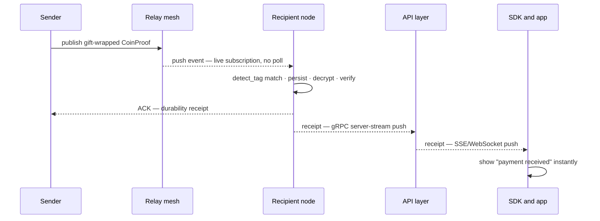
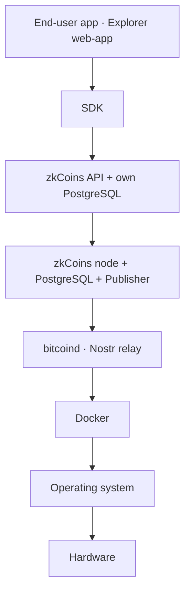
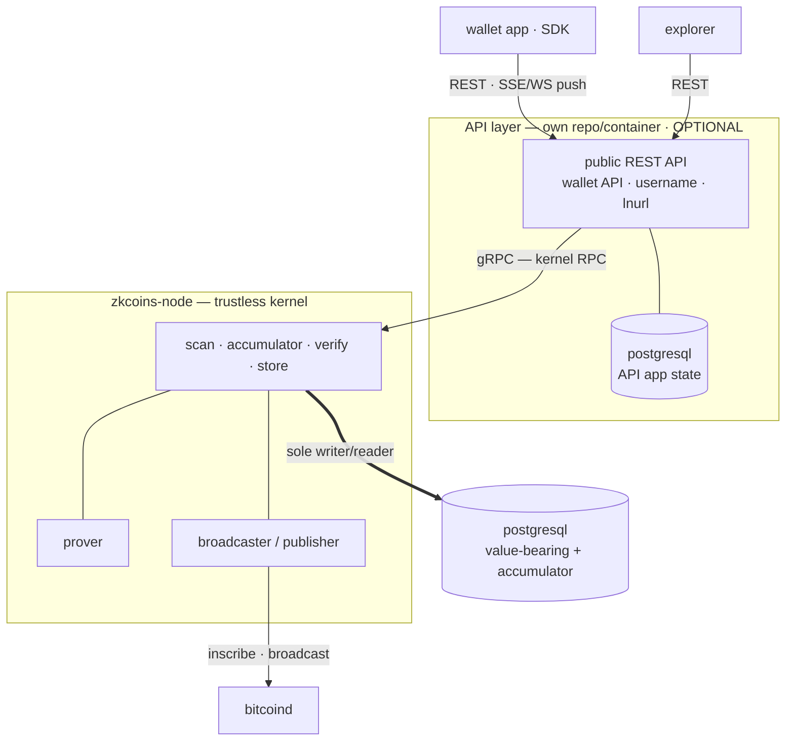
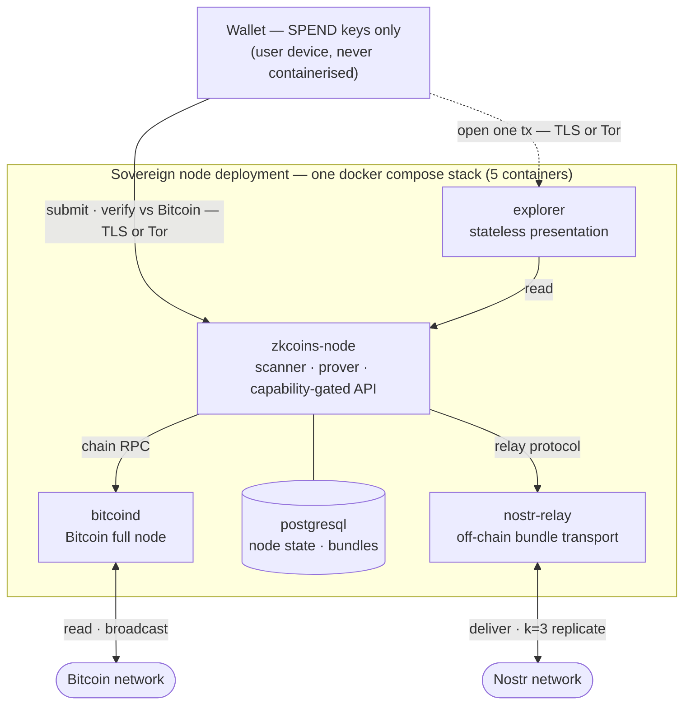
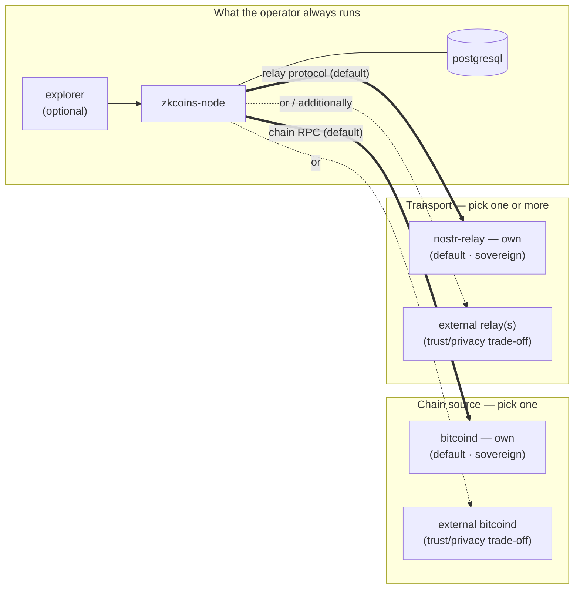

# zkCoins Protocol Specification

This document is **a possible** technical specification of the **zkCoins protocol** — one concrete, buildable realization of the zkCoins concept (Robin Linus) and the **Shielded CSV** construction (Jonas Nick, Liam Eagen, Robin Linus), designed around a single principle: **the full self-sovereignty of every participant, with no central element anywhere in the system.**

> Private payments on Bitcoin — no new chain, no token, no consensus change, no trusted operator. Only Bitcoin, zero-knowledge proofs, and the user's own keys.

:::tip In one paragraph (plain language)
zkCoins lets you send value on Bitcoin without anyone seeing the amount, the asset, who paid, or who received. Bitcoin stores only **opaque markers** that a spend happened — *not* the coin's contents, which travel privately between sender and receiver as a small encrypted bundle. **Double-spend protection** is the chain's job: each spent coin publishes a one-time random-looking *nullifier* on Bitcoin, and any second appearance is rejected. Your **seed phrase** derives every key, your **wallet** is the only thing that can spend, **any node** can serve you, and you check every figure against Bitcoin yourself.
:::

:::info What this is — and what it isn't
This is **one** concrete realization, not the only one possible: wherever the source papers leave a choice open, this specification takes the established, Bitcoin-consistent option and defines it exactly. It builds faithfully on the whitepapers' core and carries their philosophy into every layer they did not formalize — delivery, recovery, access, and operation. It describes the **target design** and is intentionally independent of any current implementation.
:::

## One principle, carried all the way

Every decision below follows from one idea — **complete self-sovereignty, zero central elements** — applied without exception:

| Design decision | follows from the principle |
|---|---|
| Settles only on Bitcoin L1 — no own chain, token, or consensus | inherit the most decentralized base; build no new one |
| Client-side validation; constant-size ZK proofs | each participant verifies for themselves, trusting no one |
| Spend key lives only in the wallet | the participant alone holds custody |
| Off-chain delivery over an operator-run relay mesh | no central delivery service |
| Recovery from seed + Bitcoin + the network | no central backup custodian |
| Capability-gated disclosure; self-hostable, verifiable explorer | the owner alone decides who sees what; no trusted authority |
| Any node — switchable, several at once | no lock-in to any operator |
| Permissionless asset creation | anyone can create their own asset; each asset's minter is its creator |

These are not features bolted on. They are the same principle, followed to its conclusion.

## The triad it guarantees

- **Bitcoin-anchored** — settled on Bitcoin L1, exactly as it exists today.
- **Shielded** — amounts, sender, receiver, and the transaction graph are hidden, behind a global anonymity set.
- **Trustless** — correctness is enforced by cryptography and Bitcoin alone.

Each is rare on its own elsewhere; here they hold **together** — see [Comparisons](/comparisons).

## How the data moves

**What lives where.** Bitcoin holds only opaque markers; everything that says *which coin, how much, between whom* lives off-chain and is encrypted to the recipient:

```
    BITCOIN L1 (Public)                  OFF-CHAIN (Private — wallet + node)
    ────────────────────                 ───────────────────────────────────

    ┌──────────────────┐                 ┌───────────────────────────────┐
    │ BatchInscription │  sign-to-       │  AccountState                 │
    │ ────────────     │  contract       │   balances · keys · counters  │
    │ publisher_pubkey │  binds          │   coin_history_root           │
    │ prev_root        │ ◀ H(AggProof)── ├───────────────────────────────┤
    │ new_root         │                 │  SpendRecord(s)               │
    │ bundle_locator   │ ◀── attests ─── │   per-spender, off-chain      │
    │ block_anchor     │                 │   recursive validity proofs   │
    │ signature        │                 ├───────────────────────────────┤
    └──────────────────┘                 │  AggregateBatchProof          │
            ▲   (231 bytes,              │   (publisher's recursive PCD) │
            │    CONSTANT per batch)     ├───────────────────────────────┤
            │ inscribed in a             │  BatchBundle ── relay mesh    │
            │ Taproot reveal-tx          │   (k=3 replicated)            │
            │ envelope                   ├───────────────────────────────┤
            │                            │  CoinProof bundle  ──▶ to B   │
            │                            │   (coin + proof + envelope)   │
            └────────────────────────────┴───────────────────────────────┘
```

**A payment, end to end.** A pays B; both run their own wallet+node; only Bitcoin is shared:

```
    Alice                 Nostr relay     Publisher       Bitcoin       Bob
      │                       │              │              │           │
      │ 1. build SpendRecord  │              │              │           │
      │    + recursive proof  │              │              │           │
      │                       │              │              │           │
      │ 2. publish encrypted CoinProof bundle (NIP-44 / NIP-59)         │
      ├──────────────────────▶│              │              │           │
      │                       │              │              │           │
      │ 3. hand SpendRecord to publisher (off-chain)                    │
      ├─────────────────────────────────────▶│              │           │
      │                       │              │              │           │
      │                       │              │ 4. aggregate │           │
      │                       │              │  many SpendRecords,      │
      │                       │              │  build AggregateBatchProof
      │                       │              │              │           │
      │                       │              │ 5. push BatchBundle      │
      │                       │              │  to k=3 replicas         │
      │                       │◀─────────────┤              │           │
      │                       │              │              │           │
      │                       │              │ 6. inscribe BatchInscription
      │                       │              │   (231 bytes, constant)  │
      │                       │              ├─────────────▶│           │
      │                       │              │              │           │
      │                       │  scanners fetch BatchBundle by locator, │
      │                       │  verify AggregateBatchProof, apply      │
      │                       │  prev_root → new_root to accumulator    │
      │                       │              │              │           │
      │                       │ 7. scan CoinProof candidates · match    │
      │                       │    detect_tag (1 ECDH+hash/evt)         │
      │                       ◀──────────────────────────────────────────
      │                       │              │              │           │
      │                       │ 8. gift-wrapped bundle blob             │
      │                       ├─────────────────────────────────────────▶
      │                       │              │              │           │
      │                       │            9. decrypt with K_tx         │
      │                       │              verify recursive proof     │
      │                       │              check nf non-member.       │
      │                       │              of accumulator at tip      │
      │                       │              │              │           │
      │                       │           10. credit coin (trustless)   │
      │                       │              │              │           │
      │11. encrypted ACK · A may now drop her retained copy             │
      ◀──────────────────────────────────────────────────────────────────
      │                       │              │              │           │
```

## Scope

The specification covers every component that will exist: the **node** (validator · prover · relay · data store), the **wallet** (thin key-holder), and the **explorer** (public and authorised views) — together with the cryptography that binds them. For every key, hash, and identifier it states exactly **how it is derived**; for every requirement, **how it is met**.

## The ten requirements

The whole specification exists to satisfy these (in full on the [Requirements](/requirements) page):

1. Bitcoin L1 as the only base · 2. Private · 3. Trustless · 4. Client-side validation · 5. Custody only in the wallet · 6. Recovery · 7. Self-hostable · 8. Multi-asset · 9. Selective disclosure · 10. Node portability.

## Contents

| # | Section | What it gives you |
|---|---|---|
| 1 | [Foundations](#1--foundations-normative) | The single source of truth: primitives, the full key hierarchy and exact derivations, every identifier, the data structures and the global nullifier accumulator |
| 2 | [Proofs & State Transitions](#2--proofs--state-transitions) | The compliance predicate, recursion, and the mint / send / receive algorithms |
| 3 | [On-chain Layer](#3--on-chain-layer) | The `BatchInscription` (constant 231 bytes per batch), publisher signing, the off-chain `BatchBundle` and its `AggregateBatchProof`, and the nullifier accumulator |
| 4 | [Transport & Recovery](#4--transport--recovery) | Off-chain delivery, note discovery, seed recovery, data availability |
| 5 | [Access & Explorer](#5--access--explorer) | Capability-gated pull, view grants, and the disclosure spectrum: per-transaction links, balance attestations, full-account views |
| 6 | [System Architecture](#6--system-architecture) | Node, wallet, explorer; portability, multi-node, issuance, threat model |
| 7 | [Wire Formats & Node Interfaces](#7--wire-formats--node-interfaces) | Concrete bytes: serialization, Nostr event kinds, Blossom blob store, the versioned `/v1/` REST API, publisher interface |
| — | [Glossary](#glossary) | Every term, identifier, and notation, alphabetical, one line each |
| — | [Test vectors](#test-vectors-conformance-harness) | Worked-example values and a conformance harness for implementations |

New here? Read **Foundations** first — everything else builds on it. Stuck on a term? Jump to the **Glossary**.

## Requirements traceability

Where each requirement is satisfied:

| Requirement | Satisfied by |
|---|---|
| **1 · Bitcoin-only base** | §1 (no native token; secp256k1/BIP-340), §3 (a single constant-size `BatchInscription` inscribed per publisher batch; no chain/consensus change) |
| **2 · Private** | §1.3 (per-coin encryption), §1.4 (opaque `BatchInscription` carries only roots, a publisher key, a locator hash, and a signature — no individual nullifiers, amounts, parties, or per-spender keys on chain), §2 (ZK proof hides amounts/parties/graph) |
| **3 · Trustless** | §2 (proof soundness ⇒ no forgery), §3 (nullifier accumulator ⇒ no double-spend), §1.2 (no key a node holds can spend), §6 (threat model) |
| **4 · Client-side validation** | §2 (receiver re-verifies the full recursive proof), §4 (receive flow) |
| **5 · Custody only in wallet** | §1.2 (SPEND branch is wallet-only; hardened separation) |
| **6 · Recovery** | §1.3 (seed-derived detection/scan keys), §4 (seed reconstruction, replication, data availability) |
| **7 · Self-hostable** | §6 (one `docker compose` stack — node · bitcoind · nostr-relay · PostgreSQL · explorer — each a pluggable, own-or-external building block, no operator-specific dependencies), §4 (paired Nostr relay) |
| **8 · Multi-asset** | §1.4 (`asset_id`), §1.5 (per-asset balances), §2 (per-asset conservation), §6 (issuance) |
| **9 · Selective disclosure** | §5 (three opt-in tiers — per-transaction §5.6, balance attestation §5.7, full-history view grant §5.8; each verifiable against Bitcoin, rendered by a self-hostable explorer) |
| **10 · Node portability** | §1.2 (everything derives from the seed ⇒ no node-specific state), §6 (switch / multi-node) |

## Conventions

Normative keywords (**MUST**, **MUST NOT**, **SHOULD**, **MAY**) follow RFC 2119. All notation, primitives, and domain-separation tags are defined once in [Foundations](#1--foundations-normative) and used unchanged throughout; sizes, encodings, and input orderings are exact.


## 1 · Foundations (normative)

> *In one sentence: every key, hash, identifier, and byte-level rule the rest of the spec uses, defined exactly once here.*

This page is the **single source of truth** for the zkCoins specification. Every other spec page builds on the primitives, keys, identifiers, and structures defined here. It is written against the **target design** (the [Requirements](/requirements)), not against any current implementation.

Normative keywords (**MUST**, **MUST NOT**, **SHOULD**, **MAY**) are used per RFC 2119.

### 1.1 Cryptographic primitives

The protocol fixes one concrete instantiation. Where a choice was open, the established, Bitcoin-consistent option is taken.

| Role | Primitive |
|---|---|
| Signature curve & scheme | **secp256k1**, **BIP-340 Schnorr** (x-only public keys, 32-byte) |
| On-chain / signature hash | **SHA-256** (BIP-340 uses tagged SHA-256 internally) |
| In-circuit hash | **Poseidon** over the proof field `𝔽` (Goldilocks, `p = 2^64 − 2^32 + 1`); reference instance: Plonky2 `PoseidonGoldilocksConfig` — state width 12, rate 8, capacity 4, 8 full + 22 partial rounds, round constants and MDS as in `plonky2/src/hash/poseidon.rs`. Parameters and absorption MUST match this instance (§1.7) |
| General hash (addresses, off-circuit ids) | **SHA-256** |
| Recursive proof system | A **proof-carrying-data (PCD)** scheme via **cyclic recursion**; reference instantiation: a FRI-based recursive proof (Plonky-style) over Goldilocks with Poseidon |
| Key derivation | **BIP-32** (secp256k1) for the key tree; **HKDF-SHA256** for symmetric/derived secrets |
| Transport encryption | **NIP-44 v2** (ECDH-secp256k1 → HKDF-SHA256 → ChaCha20 + HMAC-SHA256) |
| Metadata privacy | **NIP-59** gift-wrap |
| Text encoding | **Bech32m** for the address (HRP `zk`); transport identifiers as `bech32m` with role HRPs |

Notation:

- `H(x)` — SHA-256 of byte string `x`.
- `Hc(tag, a, b, …)` — Poseidon over `𝔽`, **domain-separated** by `tag`, applied to the field-encoded inputs.
- `P = k·G` — secp256k1 scalar multiplication; `G` the generator.
- `ECDH(k, P) = x(k·P)` — the x-coordinate of the shared point.
- `a ‖ b` — byte concatenation.
- **Secret vs. public.** A lowercase key name (`skᵢ`, `ivk`, `ovk`, `op`, `nk`) denotes the **secret scalar**; its public point is written `<name>·G` or a named pubkey (e.g. `Pkᵢ = skᵢ·G`, `IVPK = ivk·G`, `op_pubkey = op·G`). BIP-340 public keys are **x-only** (32 bytes).

**Domain separation.** Every `Hc`, `HKDF`, and `H` call that takes a literal context string **MUST** use the prefix form `"zkCoins/v1/<context>"`. The contexts reserved by this spec are:

- **Identifiers and per-coin derivations** — `AssetId`, `Coin`, `AccountState`, `Nullifier`, `NoteKey`, `DetectTag`.
- **Per-transition Merkle roots** — `CoinsRoot`, `CoinsRoot/Leaf`, `CoinsRoot/Node`, `NullifiersRoot`, `NullifiersRoot/Leaf`, `NullifiersRoot/Node`.
- **Sparse Merkle accumulators** — `NfAcc/Leaf`, `NfAcc/Node` (global nullifier accumulator, §1.7.6); `CoinHist/Leaf`, `CoinHist/Node` (per-account coin-history SMT, §1.7.6).
- **On-chain / off-chain protocol messages** — `Grant`, `Invoice`, `PullChallenge`, `PullHost` (channel binding, [Access & Explorer §5.1](#51-capability-gated-pull)), `IssuanceTerms`, `HalfAgg`, `BalanceProof`, `Ack` (delivery acknowledgement, §4.2).
- **Batching and transport** — `BatchBundle` (the `bundle_locator` content address, [§1.4](#14-identifiers-and-hashes)), `BatchMember`, `BatchMember/Node` (the batch `member_root` hash tree, [§2.5](#25-circuit-dimensioning-normative)), `BlobKey`, `Blob` (ZBE blob encryption key derivation and per-chunk AAD, [§4.2.1](#421-bundle-blob-encryption-zbe-normative)).

Reusing a context for two purposes is forbidden. Where a later section writes shorthand such as `Hc("Coin", …)` or `H("Invoice" ‖ …)`, this is equivalent to the full prefixed form `Hc("zkCoins/v1/Coin", …)` / `H("zkCoins/v1/Invoice" ‖ …)`; **implementations MUST use the full prefixed string**, the shorthand is a notation convenience. The address derivation `address = H(Pk₀)` ([§1.4](#14-identifiers-and-hashes)) is the one identifier with no context prefix — by design, since `Pk₀` itself is its input and the value is already SHA-256-collision-bound.

### 1.2 Key hierarchy

All key material descends deterministically from a single 256-bit **seed**. The seed is the only thing a user backs up ([Requirement 6](/requirements)).

```
seed  (256-bit; BIP-39 mnemonic, or Passkey PRF → HKDF)
  └─ BIP-32 ─▶ m  (master)
        └─ m / 1798' / account'                              = A   (per-account root; 1798' = zkCoins purpose)
              ├─ A / 0'        = SPEND branch   (wallet only)
              │     ├─ A/0'/0'            = sk₀   → Pk₀   (initial signing key; fixes the address)
              │     ├─ A/0'/i'            = skᵢ   → Pkᵢ   (rotating per-transition signing key)
              │     └─ A/0'/n'            = nk            (account-level nullifier key)
              ├─ A / 1'        = VIEW branch    (delegable to a node)
              │     ├─ A/1'/0'            = ivk           (incoming viewing key)
              │     └─ A/1'/1'            = ovk           (outgoing viewing key)
              └─ A / 2'        = op            (operational / Nostr identity key)
```

`1798'` is the chosen BIP-43 purpose index for zkCoins (hardened). All branch separations are **hardened**: the VIEW and `op` branches are hardened children of `A`, so a party holding them **cannot** derive the SPEND branch.

**Who holds what** (this table is the cryptographic basis of the trust model, [§6.6](#66-threat-model-and-trust-configurations)):

| Key | Held by | Can do | Cannot do |
|---|---|---|---|
| `skᵢ`, `nk` (SPEND branch) | wallet only | authorise spends, compute nullifiers | — |
| `ivk` | wallet, and any node the wallet delegates to | detect & decrypt **incoming** coins | spend |
| `ovk` | same | recover **outgoing** coin plaintext | spend |
| `op` | the node | publish/receive on Nostr, sign view grants & acknowledgements | spend, decrypt others' coins |
| `K_tx` (per-coin note key, §1.3) | derived per coin; shareable | decrypt **exactly one** coin | spend, see any other coin |

The **operational bundle** `{ivk, ovk, op}` is what a wallet entrusts to a node so the node can receive and serve on its behalf 24/7. None of it can spend. A *foreign* node never receives these directly; the wallet instead issues that node a scoped, `op`-signed **view grant** (§ Access model).

**Spend-key model (account-level).** The keys `skᵢ` are rotating **per-transition** signing keys — there is **no** per-coin signing key. Transition `i` (where `i = send_counter` at entry) is authorised by `skᵢ`, whose public key `Pkᵢ` is the account's `current_pubkey` and is carried in that transition's `SpendRecord` (§1.4) — the SpendRecord is handed to a publisher off-chain, so `Pkᵢ` never appears on Bitcoin directly; it is verified in-circuit by the publisher's `AggregateBatchProof` ([§2.2](#22-proof-types)). The transition rotates `current_pubkey` to `Pk_{i+1}`. `Pk₀` fixes the address. `nk` is account-level. Coin ownership is by the account (a coin's `recipient = address`); a receiver therefore never needs a per-coin key.

**Accounts and addresses are one-to-one.** An account `A` has **exactly one** address, `address = H(Pk₀)` (§1.4). The protocol defines **no** diversified addresses, sub-addresses, or change addresses: there is no way to derive a second, separately-disclosable or separately-unlinkable receiving address under the same account. The **account is therefore the sole unit** of every isolation boundary in the system — privacy domain, selective disclosure ([Access & Explorer](#5--access--explorer)), recovery ([Transport & Recovery](#4--transport--recovery)), and node portability ([Requirement 10](/requirements)). A wallet derives further accounts at `m/1798'/account'`; it **MUST NOT** present multiple receiving addresses within one account. Consequences a wallet **MUST** surface to the user:

- To keep two activities unlinkable toward the counterparties they are shared with, or to disclose one independently of the other ([Access & Explorer §5.8](#58-address-view-full-history)), each **MUST** live in its **own account**, chosen deliberately — never as an implicit sub-address of a shared account.
- Each additional account is an independent scan and recovery scope (its own `ivk` / `detect_tag` lineage) and adds backup and scanning cost. This cost is the deliberate, accepted price of compartmentalisation; it is the reason the default is **one account reused**, not many accounts.
- Reusing one address toward many counterparties reveals nothing on-chain — [Requirement 2](/requirements) is unaffected — but lets those counterparties correlate one another **off-chain** through the shared address string. Per-relationship unlinkability therefore requires per-relationship accounts, never extra addresses on one account.

### 1.3 Per-coin keys (note encryption & detection)

Each output coin carries an ephemeral key and is individually encrypted, so that a single per-coin capability discloses one coin and nothing else.

```
Per output coin:
  esk           = random scalar                          (sender, fresh per coin)
  epk           = esk·G                                   (published with the coin)
  IVPK          = ivk·G                                   (recipient incoming-view pubkey)
  ss            = ECDH(esk, IVPK)  = ECDH(ivk, epk)       (shared secret; both sides derive it)
  K_tx          = HKDF("zkCoins/v1/NoteKey",  ss ‖ epk)   (per-coin symmetric note key)
  detect_tag    = Hc("zkCoins/v1/DetectTag",  ss ‖ epk)   (per-coin detection tag; same ss as K_tx, distinct tag)
```

- The coin plaintext is encrypted under `K_tx` (NIP-44 v2). Only a holder of `ivk` (the recipient, or its node) can re-derive `K_tx` and decrypt.
- `detect_tag` lets a recipient/node find its own coins **without trial-decrypting every event**. The **sender** computes it from the shared secret `ss = ECDH(esk, IVPK)`; the **recipient**, holding `ivk`, recomputes `ss = ECDH(ivk, epk)` for each candidate's published `epk`, then `Hc("zkCoins/v1/DetectTag", ss ‖ epk)`, and matches against the published `detect_tag` — one ECDH plus one Poseidon hash per scanned event, replacing the full AEAD trial-decryption **and** the (≈100 KB) blob fetch for every non-matching event. Because every coin uses a fresh `epk`, each recipient's events carry **all-distinct** tags: a tag does **not** link two of one recipient's coins, and a relay that holds neither `ivk` nor the sender's `esk` can **neither** pre-filter for the recipient **nor** correlate the recipient's events. Detection does not reduce the *count* of candidates the recipient pulls. `ivk` is **seed-derivable**, so detection doubles as the recovery scan key ([Requirement 6](/requirements)).
- **Why the shared secret, not a recipient-only key (normative rationale).** The tag **MUST** derive from `ss` — not from a value bound to the recipient's secret `ivk` alone — because the **sender** sets the tag at send time and holds only the recipient's public `IVPK`. It can compute `ss = ECDH(esk, IVPK)`, but **cannot** compute any function of the recipient's secret key. A recipient-only detection key (e.g. `HKDF(ivk)`) would shrink the recipient's per-event check to a single hash, but is **unsatisfiable for an open, no-prior-interaction address**: a per-coin tag that is simultaneously (i) sender-computable from a static public key and (ii) unlinkable to outsiders must carry its per-coin entropy through a Diffie–Hellman with the fresh `epk`, so the recipient's check is inherently one ECDH per candidate, never a bare hash. The bandwidth lever is the optional Fuzzy message detection below, not a cheaper tag derivation.
- **Key-reuse safety (normative).** The same shared secret `ss` feeds both the **secret** note key `K_tx = HKDF("zkCoins/v1/NoteKey", ss ‖ epk)` and the **public** `detect_tag = Hc("zkCoins/v1/DetectTag", ss ‖ epk)`. The two are domain-separated outputs of `ss ‖ epk` under distinct context strings **and** distinct primitives (HKDF-SHA-256 vs Poseidon); modelling each primitive as an independent random oracle, neither value reveals the other. In particular the on-the-wire `detect_tag` does **not** leak `ss` (Poseidon preimage resistance, [§1.7.1](#171-poseidon-instance-and-digest-encoding)), so publishing the tag does **not** weaken `K_tx` or the coin's confidentiality.
- **Fuzzy message detection (OPTIONAL).** A relay-side probabilistic pre-filter (tunable false-positive rate) reduces the candidate count the recipient downloads, at no linkability cost. It changes only the tag computation, leaves every other interface unchanged, and is a **scan-efficiency upgrade** — not a fix for a linkability the deterministic scheme does not have.
- The **per-coin view capability** placed in an explorer link (§ Explorer) is `K_tx` for that one coin. It decrypts that coin only.

### 1.4 Identifiers and hashes

Exact derivations. Every value here is reproducible from its inputs.

| Identifier | Definition | Size / type |
|---|---|---|
| **Address** | `address = H(Pk₀)` — SHA-256 of the **initial** spend public key; fixed at account creation; the protocol's only identity | 32 bytes (Bech32m, HRP `zk`) |
| **AssetId** | `asset_id = Hc("AssetId", genesis_tag ‖ creator_pubkey ‖ name_hash ‖ decimals ‖ issuance_version)` at asset creation, where `creator_pubkey ≜ Pk₀` of the issuing account (its initial spend public key — the same key that fixes the account `address`), `name_hash = H(name)`, `genesis_tag` is the fixed constant ASCII string `zkCoins/v1/genesis`, and `issuance_version` is the **issuance-schema version** the asset is created under (a `u8`; currently `1`, see [Architecture §6.5](#65-issuance--versioned-schemas-v1-minimal)). The human-readable `name` is **never** on-chain. Every input is derived from stated values, so `asset_id` is fully reproducible | 256-bit digest (32-byte canonical) |
| **Coin identifier** | `coin.identifier = Hc("Coin", prev_account_state_hash ‖ asset_id ‖ coin_index)`. The `prev_account_state_hash` is the `ash` of the **prior** account state — the state *before* the transition that creates the coin — so the identifier is a well-defined function of inputs known at creation time and is **not** recursively dependent on the transition's own `new_account_state_hash` (which itself folds in `coin_history_root`, §1.7.4–§1.7.6). A coin's identifier is fixed at creation and recomputed with that same `prev_ash` when later spent. | 256-bit digest (32-byte canonical) |
| **account_state_hash** (`ash`) | `ash = Hc("AccountState", serialize(AccountState))` | 32-byte canonical |
| **output_coins_root** (`ocr`) | Poseidon Merkle root over the transaction's output `coin.identifier`s, tag `CoinsRoot` | 32-byte canonical |
| **input_nullifiers_root** (`inr`) | Poseidon Merkle root over the transition's spent `nf`s, tag `NullifiersRoot` | 32-byte canonical |
| **SpendRecord message** | `message = inr ‖ ocr` — binds the spent nullifier set and the produced output coins | 64 bytes |
| **SpendRecord** | `{ public_key: Pkᵢ (32B x-only), signature: BIP-340(skᵢ, message) (64B), message: inr ‖ ocr (64B), k: u8 (1B, the count of input nullifiers), nullifiers: [nf]ⱼ (32B each — the coins spent in this transition; exactly `k` entries) }` — an **off-chain** object: a spender produces one per transition and hands it to a publisher. The publisher aggregates many `SpendRecord`s into one `BatchBundle` ([§4.6](#46-data-availability--replication-factor-k)), builds the `AggregateBatchProof` over them, and anchors the batch with one constant-size `BatchInscription` on Bitcoin ([§3.1](#31-the-on-chain-object)). A mint, which spends no coin, has `k = 0` and need not be batched at all — its receiver verifies it directly against its `CoinProof` bundle | 161 + 32·\|nf\| bytes off-chain |
| **Nullifier** | `nf = Hc("Nullifier", nk ‖ coin.identifier)` — derived in-circuit by the spender; included in the `SpendRecord` handed to the publisher and folded into the global nullifier accumulator (§1.6) when the batch's `BatchInscription` is admitted; unlinkable to the coin without `nk` | 256-bit digest (32-byte canonical) |
| **ProofData** (public inputs) | `{ new_account_state_hash, output_coins_root, input_nullifiers_root, coin_history_root }` — there is **no** accumulator root here: a spender's per-account proof attests local soundness; global double-spend is enforced by the publisher's `AggregateBatchProof` ([§2.2](#22-proof-types)) when it inserts the batch's nullifiers into the on-chain-committed accumulator. **Canonical serialization** `serialize(ProofData) := new_account_state_hash ‖ output_coins_root ‖ input_nullifiers_root ‖ coin_history_root` (the four 32-byte digests in that exact order — **128 bytes**), and **`H(ProofData) := SHA-256(serialize(ProofData))`** is the single normative definition the **spender's** sign-to-contract tweak uses everywhere ([§2.1 clause 9](#21-the-compliance-predicate), [§2.2 clause 2](#22-proof-types), [§3.3](#33-off-chain-signature-handling), [§5.7](#57-balance-attestation-history-private), V.4). (The **publisher's** separate `BatchInscription` S2C binds `H_agg` over the proof bytes, not `H(ProofData)`, [§3.2](#32-batchinscription-signing-bip-340--sign-to-contract).) This digest order (`ash ‖ ocr ‖ inr ‖ chr`) is deliberately **not** the `SpendRecord` `message = inr ‖ ocr` order — they are distinct objects | hashes/roots only |
| **BatchInscription** | `{ publisher_pubkey: Pkₚ, prev_root, new_root, bundle_locator, block_anchor, signature }` — the **only** object written to Bitcoin; 231 bytes per batch, constant in batch size; commits the publisher's accumulator state transition `prev_root → new_root` and addresses the off-chain bundle by `bundle_locator = Hc("BatchBundle", prev_root ‖ new_root ‖ u32-be(m) ‖ member_root)` ([§3.1](#31-the-on-chain-object), [§3.5](#35-inscription-format)) | 231 bytes per batch |
| **BatchBundle** | `{ prev_root, new_root, spend_records: [SpendRecord], aggregate_proof: AggregateBatchProof, nullifiers: [nf] (derived view) }` — off-chain, content-addressed, `k = 3` replicated by the same DA discipline as `CoinProof` bundles ([§4.6](#46-data-availability--replication-factor-k)). Carries every member `SpendRecord` plus the recursive proof that attests the whole batch. The top-level `nullifiers` field is a **derived view** equal to the canonical multi-set concatenation of every member `SpendRecord`'s `nullifiers` in canonical bundle order — provided as a convenience for scanners that want the flat `nf` list without re-parsing every record. **Wire serialisation** `serialize(BatchBundle)` (what Blossom stores and ZBE encrypts, [§7.1](#71-serialization-conventions-normative)) is `prev_root ‖ new_root ‖ u32-be(m) ‖ SpendRecord₁ ‖ … ‖ SpendRecord_m ‖ <length-prefixed aggregate_proof>`. The **`bundle_locator`** is `Hc("BatchBundle", prev_root ‖ new_root ‖ u32-be(m) ‖ member_root)`, where **`member_root`** is a binary Poseidon hash tree over the ordered members, defined exactly as the recursive aggregator builds it ([§2.5](#25-circuit-dimensioning-normative), [§2.2 clause 6](#22-proof-types)): the active-member leaf value is `dⱼ = Hc("BatchMember", serialize(SpendRecordⱼ))`, an inactive (padding) leaf is `Hc("BatchMember", ∅)` (`∅` = the empty byte string), and an internal node is `Hc("BatchMember/Node", left, right)`; the canonical shape is the perfect binary tree over `2^⌈log₂ max(m,1)⌉` leaves with the `m` active members left-aligned and the remainder padded. The distinct `BatchMember` (leaf) and `BatchMember/Node` (internal) tags rule out leaf/node second-preimage collisions. The locator preimage is **fixed-size** (three digests + a `u32`), so it is computed bottom-up by the aggregator rather than by hashing every record at once; `member_root` binds both the exact member set **and** their order. The derived `nullifiers` field and the `aggregate_proof` are **excluded** from the locator preimage (the former is redundant under §2.2 clauses 3–4; the latter because a proof cannot commit to its own bytes, so it is bound separately by the publisher's sign-to-contract tweak, [§3.2](#32-batchinscription-signing-bip-340--sign-to-contract)). A scanner recomputes `member_root` from the wire `spend_records` and confirms `bundle_locator` matches the inscription ([§3.6 step 6](#36-chain-scanning)) | grows with member count + recursive-proof size (typically ~100 KB) |

The per-spender BIP-340 signature over `message` additionally uses **sign-to-contract**: it embeds the digest of that spender's off-chain validity proof (`H(ProofData)`) in the nonce, binding the proof to the spender's `SpendRecord` for in-circuit verification by the publisher's `AggregateBatchProof` (see [On-chain §3.3](#33-off-chain-signature-handling)). The publisher's separate signature on the `BatchInscription` (see [On-chain §3.2](#32-batchinscription-signing-bip-340--sign-to-contract)) is similarly sign-to-contract-bound to the off-chain `AggregateBatchProof`.

### 1.5 Core data structures

```
AccountState = {
  owner             : address,                 // fixed identity
  balances          : map<asset_id, amount>,   // private bookkeeping, multi-asset
  current_pubkey    : Pkᵢ,                      // rotates each send
  send_counter      : i,                        // monotonic
  coin_history_root : root                      // Poseidon SMT root over the account's coin history (§1.6)
}

Coin         = { identifier, recipient: address, amount, asset_id }
CoinTemplate = { recipient: address, amount, asset_id }

CoinProof    = {                            // the value-bearing off-chain bundle (bearer)
  coin,                                      // plaintext coin
  proof,                                     // recursive validity proof
  inclusion_proof,                           // membership of coin in output_coins_root
  creating_prev_ash,                         // PRIOR account_state_hash of the transition that
                                             // created this coin; needed by the spender to
                                             // recompute coin.identifier in-circuit (§1.4, §2.1)
  epk, ciphertext, detect_tag                // encryption envelope (§1.3)
}

Invoice      = { amount, recipient: address, asset_id, memo? }     // shareable, off-chain
```

### 1.6 Trees: one global structure, one per-account structure

| Structure | Scope | Contents | Built from |
|---|---|---|---|
| **Coin-history SMT** | per account | coins the account has received/spent (for in-circuit non-inclusion) | the account's own coins; root folded into `ash` lineage (Private) |
| **Nullifier accumulator** | global | every admitted `nf` (256-bit-depth SMT, supports membership + non-membership) | the `nf`s carried in every admitted `BatchBundle`, whose `prev_root → new_root` transitions are anchored by `BatchInscription`s on Bitcoin ([§3.7](#37-the-nullifier-accumulator)) |

There is **exactly one** global structure — the nullifier accumulator — and Bitcoin is the only ordering surface the protocol relies on. zkCoins defines **no** global, account-keyed commitment tree: an account's latest state is carried by its own constant-size recursive proof ([Proofs §2.2](#22-proof-types)), never by a global per-account on-chain index. This is deliberate. A global structure keyed by a stable account identifier would have to be **either** rebuildable from publicly verifiable data **or** privacy-preserving — never both. The protocol keeps privacy ([Requirement 2](/requirements)) and rebuildability ([Requirement 10](/requirements)) at once by removing that structure entirely and anchoring double-spend protection in the **nullifier accumulator** alone.

The accumulator's **state transitions** are anchored on Bitcoin (each `BatchInscription` commits `prev_root → new_root`) and its **per-transition validity** is attested by the publisher's `AggregateBatchProof` carried in the off-chain `BatchBundle` ([§3.7](#37-the-nullifier-accumulator)). Any node therefore tracks the accumulator by following the chain of inscribed roots and verifying each batch's recursive proof against its content-addressed bundle — a pure function of confirmed Bitcoin data plus publicly verifiable, `k = 3`-replicated bundles ([Transport & Recovery §4.6](#46-data-availability--replication-factor-k)), identical for every honest node, requiring **no** trust in any peer. The per-account coin-history SMT is Private (its leaves are the account's own coins) and never leaves the account's own proving context; only its root appears, hashed, inside `ash`.

### 1.7 Encoding, serialization, and the reference instantiation

Every value defined in §1.4 is reproducible bit-for-bit when the rules below are followed. They pin one concrete, implementable convention for every otherwise-ambiguous detail (sponge layout, byte→field packing, `serialize`, Merkle and SMT constructions). They are **normative for protocol version v1** — a conforming implementation **MUST** match them bit-for-bit — **and** the explicit **reference instantiation pending cryptographic review** before any mainnet deployment.

#### 1.7.1 Poseidon instance and digest encoding

The reference Poseidon instance is **Plonky2's `PoseidonGoldilocksConfig`** (state width 12, rate `r = 8`, capacity `c = 4`; 8 full + 22 partial rounds; round constants and MDS as in `plonky2/src/hash/poseidon.rs`). All in-circuit Poseidon operations and every use of `Hc` MUST use exactly this instance. `Hc(tag, x₁, …, xₙ)` is computed as

```
Hc(tag, x₁, …, xₙ) := PoseidonSponge( E(tag) ‖ E(x₁) ‖ … ‖ E(xₙ) )
```

where `E(·)` is the field-encoding of §1.7.2, the concatenated sequence of field elements is absorbed by the Plonky2 rate-8/capacity-4 sponge in its standard `hash_n_to_hash` layout, and the result is the first 4 squeezed rate elements.

A **Poseidon digest** is those 4 field elements, canonically encoded as **32 bytes**: each element is reduced mod `p` and emitted as **8 bytes big-endian**, in order. Each digest element is `< p ≤ 2^64`, so 8 bytes always suffice. SHA-256 outputs are 32 bytes as-is.

A single 64-bit Goldilocks element **MUST NOT** be used as a nullifier, identifier, or root: 64-bit collision resistance is insufficient.

#### 1.7.2 Field-encoding `E(·)` of `Hc` inputs

Each input has a categorical type and is encoded as a fixed sequence of field elements; concatenation of those sequences is what the sponge absorbs.

- **Tag.** The literal byte string `"zkCoins/v1/<context>"` (UTF-8, ASCII-only by construction) is encoded by the byte-string rule below. Distinct tags therefore prefix the absorption with distinct element sequences and provide the required domain separation.
- **Byte-string input** (raw bytes, SHA-256 hash, secp256k1 x-only pubkey, secp256k1 scalar, an asset's `name`, a `serialize(...)` output, NIP-44 ciphertext, etc.): encode as
  - **one length element** holding the byte length `L` as an unsigned integer (`L < 2^56`); then
  - the bytes packed into **7-byte big-endian chunks**, each interpreted as a 56-bit unsigned integer and emitted as one field element; the final chunk is right-padded with zero bytes to 7 bytes.

  Total elements: `1 + ⌈L / 7⌉`. Every chunk is `< 2^56 < p`, so every emitted element is a valid reduced Goldilocks element.
- **Digest input** (any 256-bit value already produced by `Hc`): encode as its **4 field elements**, in order, with **no** length prefix — its width is fixed by type.
- **Small numeric input** (a declared-width unsigned integer of `≤ 56` bits): encode as **one field element** equal to the unsigned value. Because the value is `< 2^56 < p`, the element is canonical with no `mod p` ambiguity.
- **Wide numeric input** (`u64`, `u128`): encode as the value's fixed-width **big-endian byte representation** (8 bytes for `u64`, 16 bytes for `u128`) absorbed via the **byte-string** rule above. This avoids the mod-`p` collision that a 64-bit numeric element would have (`p ≈ 2^64 − 2^32`, so distinct `u64` values can reduce to the same field element).

The same `x` always produces the same `E(x)`, regardless of which call uses it. Combined with the **per-tag fixed input schema** (the §1.7.3 widths together with the input list written at every `Hc` call site), no two distinct `Hc` invocations produce the same element sequence: per-input length prefixes on byte strings, fixed widths on digests and small numerics, and the prefix-tag domain together fix an unambiguous absorption per tag.

#### 1.7.3 Fixed widths

| Field | Width (bits) | Notes |
|---|---|---|
| `amount` | 128 (u128) | Encoded as **16-byte big-endian** byte-string input per §1.7.2 (1 length element + 3 limbs of 7 bytes = 4 absorbed elements); same 16 bytes big-endian in `serialize`. Range-checked in-circuit to `[0, 2^128 − 1]` |
| `decimals` | 8 (u8) | One small-numeric element (value `< 2^8`, trivially `< p`) |
| `issuance_version` | 8 (u8) | One small-numeric element; bound into `asset_id` (§1.4) and `IssuanceTerms.terms_hash` ([Architecture §6.5](#65-issuance--versioned-schemas-v1-minimal)) |
| `coin_index` | 32 (u32) | One small-numeric element |
| `send_counter` | 64 (u64) | Encoded as **8-byte big-endian** byte-string input per §1.7.2 (1 length element + 2 limbs of 7 bytes = 3 absorbed elements); same 8 bytes big-endian in `serialize` |
| `block_anchor.height` | 32 (u32) | One small-numeric element; 4 bytes big-endian on-chain (§3.5) |
| `name_hash`, `address`, `nk`, `epk`, `Pkᵢ` | 256 | Byte-string input, encoded per §1.7.2 (length prefix + 5 chunks) |
| `Hc` digest (`asset_id`, `coin.identifier`, `nf`, `ash`, `ocr`, `inr`, any root) | 256 (4 limbs) | Digest input, encoded per §1.7.2 |

`amount` MUST be range-checked in-circuit to `[0, 2^128 − 1]` so balance arithmetic never wraps the field; an out-of-range amount invalidates the proof.

#### 1.7.4 `serialize(AccountState)`

`AccountState` (§1.5) is canonically serialized as a fixed-format byte string before being absorbed into `ash = Hc("AccountState", serialize(AccountState))`:

```
serialize(AccountState) :=
   owner                       (32 bytes — the address)
‖ current_pubkey               (32 bytes — Pkᵢ, x-only)
‖ send_counter                 ( 8 bytes — u64 big-endian)
‖ coin_history_root            (32 bytes — Poseidon digest, §1.6)
‖ balances_count               ( 4 bytes — u32 big-endian, the number of non-zero entries)
‖ for each (asset_id, amount) in balances, sorted ASCENDING by asset_id (byte order):
     asset_id                  (32 bytes)
     amount                    (16 bytes — u128 big-endian)
```

Entries with `amount == 0` MUST be omitted; duplicate `asset_id`s MUST NOT appear; the ascending sort is total over the 32-byte canonical encoding. This fixes a canonical preimage for `ash`. (`balances` and `coin_history_root` are the §1.5 fields; the byte string is then absorbed by `Hc` as one byte-string input per §1.7.2.)

#### 1.7.5 Poseidon Merkle tree (used for `ocr` and `inr`)

A Poseidon Merkle root with tag `T ∈ { "CoinsRoot", "NullifiersRoot" }` over a list `L = (v₁, …, vₘ)` of 256-bit digest values is computed as:

1. **Leaf hash.** `Lᵢ = Hc("<T>/Leaf", vᵢ)` for each `i` (each `vᵢ` is a digest input, so its 4 elements are absorbed directly).
2. **Pad.** Extend `L` with the **empty-leaf hash** `L_⊥ = Hc("<T>/Leaf", 0₂₅₆)` (the digest of the all-zero 256-bit value) until the list length is a power of two (at least 1). An empty list (`m = 0`) has root `L_⊥`.
3. **Combine.** For each adjacent pair `(L₂ⱼ₋₁, L₂ⱼ)`, compute `Pⱼ = Hc("<T>/Node", L₂ⱼ₋₁, L₂ⱼ)`. Repeat the pairwise combination on the resulting list until one element remains: that is the **root**.

A membership proof (`inclusion_proof`, [§1.5](#15-core-data-structures)) is the sibling path against this construction. Its **canonical byte layout** (the form serialised inside a `CoinProof`, [§7.1](#71-serialization-conventions-normative)) is:

```
inclusion_proof :=
   leaf_index   ( 4 bytes — u32 big-endian; the 0-based position of the proven leaf vᵢ
                            among the m output-coin identifiers, before padding)
‖ depth        ( 1 byte  — u8; the number of sibling levels = log₂(padded leaf count),
                            0 for a single-leaf tree)
‖ for level = 0 (leaf level) up to depth−1, bottom-to-top:
     sibling   (32 bytes — the Poseidon digest of the sibling node at that level)
```

The verifier re-derives the root by hashing `Lᵢ = Hc("<T>/Leaf", vᵢ)` and folding in each `sibling` from the bottom up, choosing left/right order at level `k` from bit `k` of `leaf_index` (bit `0` = least-significant = leaf level; bit `=0` ⇒ the proven node is the left child, sibling on the right; bit `=1` ⇒ proven node is the right child, sibling on the left), then rejects on any mismatch with the committed root. `depth` follows the same `2^⌈log₂ max(m,1)⌉` canonical shape as the tree itself (each `sibling` is supplied explicitly as 32 bytes, whether it is a real node or a padding subtree — a padding sibling at the leaf level is `L_⊥`, at level `k>0` it is the `Hc("<T>/Node", …)` root of an all-padding subtree), so two implementations produce byte-identical `inclusion_proof`s. The distinct `<T>/Leaf` and `<T>/Node` domain tags prevent second-preimage collisions across levels.

#### 1.7.6 Nullifier accumulator (sparse Merkle tree)

The global nullifier accumulator (§1.6, [On-chain §3.7](#37-the-nullifier-accumulator)) is a **256-bit-depth sparse Merkle tree** keyed by `nf` (each `nf` is a 256-bit Poseidon digest, used as the bit-string `nf₂₅₅ nf₂₅₄ … nf₀` to walk the tree from root to leaf). Each leaf holds either the **present marker** `1` (key in the set) or the **empty marker** `0`. Hashes:

- **Leaf:** `H_leaf(b) = Hc("NfAcc/Leaf", b)` with `b ∈ {0, 1}` encoded as one numeric element (per §1.7.2).
- **Internal node at level `i`** (level 0 = leaf, level 256 = root): `H_node(i, l, r) = Hc("NfAcc/Node", i, l, r)`, where the level index is one numeric element and `l, r` are digest inputs.
- **Empty subtree at level `i`** has the precomputed hash `Eᵢ` defined recursively by `E₀ = H_leaf(0)` and `Eᵢ = H_node(i, E_{i-1}, E_{i-1})`. The 257 values `E₀, …, E₂₅₆` are constants of the protocol and MUST be precomputed identically by every implementation; `E₂₅₆` is the **empty-tree root**.

Insertion of `nf` flips the leaf at key `nf` from `0` to `1` and recomputes the path of 256 internal hashes. Non-membership of `nf` at a stated tip is a path showing `H_leaf(0)` at key `nf`; membership is the analogous path with `H_leaf(1)`. Implementations MAY store only the populated subtrees (since empty subtrees collapse to their precomputed `Eᵢ`), but MUST NOT prune populated paths (see [On-chain §3.7](#37-the-nullifier-accumulator)).

**Coin-history SMT (per account).** The per-account coin-history (§1.5, §1.6) is a structurally identical **256-bit-depth sparse Merkle tree** with its own distinct domain tags. It is Private — its leaves are the account's own coins — and is used in-circuit by the compliance predicate ([Proofs §2.1](#21-the-compliance-predicate) clause 2(b) and clause 8); only its 32-byte `coin_history_root` ever leaves the proving context, hashed inside `ash`.

- **Key:** the coin's `coin.identifier` (a 256-bit Poseidon digest, §1.4), used as the bit-string `id₂₅₅ id₂₅₄ … id₀` to walk root → leaf.
- **Leaf state** `s ∈ {0, 1, 2}`: `0` = the account has never received this coin (key is absent); `1` = received-and-unspent (the coin is in the account's holdings); `2` = spent (the coin was received and has since been nullified by this account). Encoded as one numeric element.
- **Leaf:** `H'_leaf(s) = Hc("CoinHist/Leaf", s)`.
- **Internal node at level `i`** (level 0 = leaf, level 256 = root): `H'_node(i, l, r) = Hc("CoinHist/Node", i, l, r)`, level index as one numeric element and `l, r` as digest inputs.
- **Empty subtree at level `i`** has the precomputed hash `E'ᵢ` defined recursively by `E'₀ = H'_leaf(0)` and `E'ᵢ = H'_node(i, E'_{i-1}, E'_{i-1})`. The 257 values `E'₀, …, E'₂₅₆` are constants of the protocol; `E'₂₅₆` is the **empty coin-history root** (the `coin_history_root` of the canonical empty account, §2.2).

**Operations.** A transition that spends `input_coins[j]` proves in-circuit that `coin.identifier = input_coins[j].identifier` has leaf state `1` against the prior `coin_history_root` (clause 2(b)); the same transition flips that leaf from `1` to `2` (spent) and admits each newly received output template by flipping its key from `0` to `1` (received-unspent). `coin_history_root` after the transition is the recomputed root over these updates and is the value bound into the new `AccountState` (clause 8, §1.7.4). The distinct `CoinHist/Leaf` and `CoinHist/Node` tags — and the per-level domain separation in `H'_node` — make these constants distinct from the nullifier accumulator's `E_i` even though the SMT skeleton is the same.

#### 1.7.7 Bech32m and Bitcoin conventions

- Addresses, view grants, and bearer view capabilities use Bech32m with distinct HRPs so they are never confused: `zk` (address, 32-byte payload), `zkgrant` (view grant, full `ViewGrant` byte serialization), `zkview` (per-coin view capability, 32-byte payload), `zkavk` (bearer account view key, 64-byte `ivk ‖ ovk` payload; see [Access & Explorer §5.8](#58-address-view-full-history)), `zkbid` (confirmation-link blob locator, 32-byte `blob_id = H(ciphertext)` — distinct from a `BatchBundle` `bundle_locator`; see [Access & Explorer §5.6](#56-shareable-confirmation-links)). A node/explorer **MUST** reject a value presented under the wrong HRP.
- Bitcoin txids are stored internal-order and **displayed** byte-reversed (canonical Bitcoin convention).
- All multi-input hashes fix input order exactly as written in §1.4 and in this section; reordering changes the digest and is invalid.

#### 1.7.8 Reference-instantiation review status

This section pins one concrete, implementable convention for everything otherwise underspecified at the cryptographic-engineering level. It is normative for protocol version v1 — a conforming implementation MUST match it bit-for-bit — and is explicitly the **reference instantiation pending cryptographic review** prior to any mainnet deployment. Review may refine the Poseidon parameter choice, the byte→field encoding, the sponge variant, the `serialize(AccountState)` field ordering, and the in-circuit/out-of-circuit boundary. Any such refinement is a version bump (the tag prefix `"zkCoins/v1/…"` reserves the namespace).

#### 1.7.9 Proof-system parameters (normative)

§1.1 names the proof system abstractly (a FRI-based PCD scheme over Goldilocks with Poseidon). This section fixes the **one concrete, conforming parameter set** for protocol version v1. Two independent implementations that follow it produce proofs that verify against each other's verifier data. Like the rest of §1.7 it is normative-for-v1 and a reference instantiation pending cryptographic review.

**Library and field.** The reference proving system is **Plonky2** at the crates.io release **`plonky2 = "1.1.0"`** (registry source, the published `1.1.0` artefact). The proof field is **Goldilocks** `𝔽`, `p = 2^64 − 2^32 + 1`; the extension degree used for FRI is **`D = 2`** (the quadratic extension). The hash/config is **`PoseidonGoldilocksConfig`** (the §1.7.1 Poseidon instance). A conforming implementation in another library MUST reproduce the same field, the same Poseidon instance, the same FRI parameters below, and the same recursion shape; it MAY use different code.

**Circuit configuration (normative).** Every production circuit (`C` and `C_batch`, §2) is built with Plonky2's **`CircuitConfig::standard_recursion_zk_config()`** — the standard recursion config **with zero-knowledge enabled**. The zero-knowledge variant is mandatory, not optional: a per-account proof travels to the receiver inside the `CoinProof` bundle (§2.3.3) and an `AggregateBatchProof` is `k`-replicated to scanners (§4.6), so the proof object itself is held by parties who must not learn its witness. A non-zero-knowledge FRI proof leaks *bounded* information about the witness through its query openings — and the witness here includes amounts, recipients, and the nullifier key `nk` (§2.1) — so any residual leakage is unacceptable. ZK blinding closes this; it is therefore required by [Requirement 2](/requirements). The resulting `FriConfig` is fixed at:

| Parameter | Value |
|---|---|
| `rate_bits` | `3` |
| `cap_height` | `4` |
| `proof_of_work_bits` | `16` |
| `num_query_rounds` | `28` |
| `reduction_strategy` | `ConstantArityBits(arity_bits = 4, final_poly_bits = 5)` |
| `security_bits` | `100` |
| `num_challenges` | `2` |
| `zero_knowledge` | `true` |

These are the Plonky2 `standard_recursion_zk_config()` values and **MUST NOT** be overridden per circuit. The conjectured security level is **100 bits** (FRI), independent of the Poseidon algebraic-attack margin (≈95 bits at the time of writing; both are subject to the §1.7.8 cryptographic review).

**Recursion shape (normative).** Recursion is **cyclic**: one fixed circuit verifies proofs of itself (§2.2). Each circuit adds its own verifier data to its public inputs and, in-circuit, checks the cyclic relationship (Plonky2's `conditionally_verify_cyclic_proof_or_dummy` against the circuit's own `VerifierCircuitData`). The fixed-point `CommonCircuitData` for a circuit is the deterministic result of building that circuit; it is **not** serialized into any artefact (§1.7.9 "serialization" below), it is rebuilt identically by every implementation at boot. Both `C` and `C_batch` have constant verifier data, parameterised by the network tag of [§2.2 clause 5](#22-proof-types).

**Circuit digest (normative, pinned constant).** Each circuit's identity is its **circuit digest** — the `verifier_only.circuit_digest` Poseidon `HashOut` produced when the circuit is built — encoded to 32 bytes per [§1.7.1](#171-poseidon-instance-and-digest-encoding). The two digests `circuit_digest(C)` and `circuit_digest(C_batch)`, one pair per network tag, are **protocol constants**: every node MUST pin them and MUST reject a proof whose embedded verifier-data digest does not match the pinned value for the network it operates on. The concrete byte values are produced by the reference implementation (they are Poseidon-dependent, so they are `<REGEN>` in the [test vectors](#test-vectors-conformance-harness) until generated, exactly like every other §1.7 Poseidon value).

**Canonical proof serialization (normative).** Wherever the protocol hashes or content-addresses a proof — `H_agg = H(serialize(AggregateBatchProof))` ([§3.2](#32-batchinscription-signing-bip-340--sign-to-contract)) and any `bundle_locator` preimage that embeds proof bytes — `serialize(·)` of a Plonky2 proof is its **native `ProofWithPublicInputs::to_bytes()`** encoding (the Plonky2 1.1.0 canonical byte layout: public inputs as 8-byte-LE field elements followed by the proof body). It is **not** a serde/`bincode` encoding (an implementation MAY use `bincode` or any other format for its own at-rest storage, but that form is never hashed or content-addressed). Because production proofs are zero-knowledge (randomised), `to_bytes()` differs run-to-run; this is harmless — the publisher fixes one concrete proof, publishes those exact bytes in the `BatchBundle`, and every verifier reads back the same bytes and recomputes the same `H_agg`. The `bundle_locator` preimage (`prev_root ‖ new_root ‖ u32-be(m) ‖ member_root`, [§1.4](#14-identifiers-and-hashes)) carries **no proof bytes at all**; the proof is bound separately by the S2C tweak over `H_agg`, so the non-determinism of ZK proof bytes never enters a content address. (The proof bytes do appear in the *wire* `serialize(BatchBundle)` that Blossom stores, but that byte string is never itself a hash preimage — only `member_root`, derived from the records, is.)


## 2 · Proofs & State Transitions

> *In one sentence: what the zero-knowledge proof actually proves about each transition (mint, send, receive), and how the sender, the recipient, and the recursive proof plug together.*

This page defines the **proof system** and the **three state transitions** (mint, send, receive) of zkCoins. It builds strictly on [Foundations](#1--foundations-normative): every key, identifier, hash, tree, and structure is used exactly as defined there and never redefined here. Normative keywords (**MUST**, **MUST NOT**, **SHOULD**, **MAY**) follow RFC 2119.

The proof system is a **proof-carrying-data (PCD)** scheme realised by **cyclic recursion** (see [Foundations §1.1](#11-cryptographic-primitives)): one circuit verifies a proof of itself. Each transition consumes the account's previous proof and emits a new one, so a coin that changed hands `N` times carries a **single constant-size proof**, verified in **constant time**, regardless of `N`.

### 2.1 The compliance predicate

Every transition is a single execution of one circuit, `C`. The circuit takes a **private witness** `w` and a set of **public inputs** equal to `ProofData` (see [Foundations §1.4](#14-identifiers-and-hashes)). A proof `π` is accepted only if `C(ProofData, w) = 1`, i.e. **all** of the following clauses hold. The clauses are normative: a conforming prover **MUST** enforce every one, and a conforming verifier **MUST** reject any proof for which the public inputs are not bound exactly as below.

Witness (private to the prover; never revealed):

```
w = {
  prev_proof,                 // the account's previous recursive proof (absent for InitialProof)
  prev_account_state,         // AccountState before this transition (Foundations §1.5)
  input_coins[],              // coins being spent (Foundations §1.5); empty for a pure mint
  input_auth[]   = {          // per input coin, membership evidence (NO per-coin key/signature)
    history_path,                                    // inclusion in prior coin-history SMT
    creating_prev_ash                                // the PRIOR account_state_hash of the transition that
                                                     // created this coin (delivered inside its CoinProof bundle);
                                                     // breaks the would-be coin.identifier ↔ new_ash recursion
  },
  txn_sig        = BIP-340(skᵢ, message),            // the account's single transition signature (SpendRecord)
  txn_pubkey     = Pkᵢ (x-only),                     // current_pubkey, authorises this whole transition
  output_templates[],         // CoinTemplate list (Foundations §1.5)
  nk,                         // nullifier key (SPEND branch, Foundations §1.2)
  next_pubkey   = Pkᵢ₊₁,      // rotated spend pubkey for the new state
  asset_issuance?             // present only for issuance: {asset_id, creator_pubkey = Pk₀, issuance_version, name_hash, amount, decimals}
}
```

**Predicate `C` — enumerated clauses.**

1. **Recursive verification (PCD).** Either this is an `InitialProof` and `w.prev_proof` is absent and `w.prev_account_state` is the canonical empty account for `owner = H(Pk₀)`; **or** `w.prev_proof` verifies under the circuit's own verifier data (cyclic recursion), and its public output `new_account_state_hash` equals the `ash` of `w.prev_account_state`, and its `coin_history_root` equals the coin-history root over which clause 2 proves inclusion. The verifier data **MUST** be fixed and identical in prover and verifier; a proof verified against any other verifier data is invalid.
   - **No global lineage anchor.** An account's latest state is attested **entirely** by its own constant-size recursive proof; the protocol defines no global, account-keyed commitment tree to bind to ([Foundations §1.6](#16-trees-one-global-structure-one-per-account-structure)). Anchoring to Bitcoin comes instead via the **publisher batching path**: a spend takes effect only once its `SpendRecord` is included in a `BatchBundle` whose `BatchInscription` is admitted on-chain (§2.3.3, [On-chain §3.6](#36-chain-scanning)), and equivocation between two forks of one account is caught because both forks reuse the same input-coin `nf`, which can enter the global nullifier accumulator only once — the publisher's `AggregateBatchProof` ([§2.2](#22-proof-types)) attests `new_root` as the deterministic SMT-insertion result, so an `nf` already in the accumulator at `prev_root` would make the proof unsatisfiable.

2. **Input authenticity.** The whole transition is authorised by the account's **single transition signature** — there is no per-coin key and no per-coin signature ([Foundations §1.2](#12-key-hierarchy)). The circuit **MUST** check that `txn_sig` is a valid **BIP-340** signature (see [Foundations §1.1](#11-cryptographic-primitives)) over `message = inr ‖ ocr` (the `SpendRecord` message of [Foundations §1.4](#14-identifiers-and-hashes): `input_nullifiers_root` from clause 4 ‖ `output_coins_root` from clause 6) by `txn_pubkey = Pkᵢ`, and that `Pkᵢ` is `prev_account_state.current_pubkey`. Then, for every `input_coins[j]`:
   a. `input_coins[j].recipient` equals `prev_account_state.owner`, i.e. the coin is owned by the spending account (`owner = address = H(Pk₀)`, [Foundations §1.4](#14-identifiers-and-hashes)) — ownership is by the account, so a receiver never needs a per-coin key index;
   b. `input_coins[j]` is included in the prior **coin-history SMT** (per-account, [Foundations §1.6](#16-trees-one-global-structure-one-per-account-structure)) via `input_auth[j].history_path` against the root referenced in clause 1;
   c. `input_coins[j].identifier` is recomputed in-circuit as `Hc("Coin", input_auth[j].creating_prev_ash ‖ asset_id ‖ coin_index)` — using the witnessed `creating_prev_ash` (the **prior** `account_state_hash` of the transition that produced this coin, i.e. the `ash` of the creating account *before* its creating transition, delivered to the spender inside the coin's `CoinProof` bundle) — and **MUST** match the supplied identifier. The per-input witness `input_auth[]` **MUST** therefore include each input coin's `creating_prev_ash`. This matches [Foundations §1.4](#14-identifiers-and-hashes): a coin's identifier binds the creating account's **prior** state, breaking the would-be recursion between `coin.identifier` and `new_account_state_hash`.

3. **Per-asset balance conservation.** Let `In(a) = Σ { input_coins[j].amount : input_coins[j].asset_id = a }` and `Out(a) = Σ { output_templates[k].amount : output_templates[k].asset_id = a }`, plus `Mint(a)` from any `asset_issuance` for asset `a` (zero otherwise). For **every** `asset_id` `a` appearing in inputs or outputs: `In(a) + Mint(a) ≥ Out(a)`. All amounts are range-checked to a fixed non-negative integer width so no sum can wrap the field; any amount outside range invalidates the proof. The difference `In(a) + Mint(a) − Out(a)` is retained by the account (a change coin) — funds are conserved, never created except by an explicit, predicate-checked `Mint(a)`. When `asset_issuance` is present, the v1 mint clauses of [Architecture §6.5](#65-issuance--versioned-schemas-v1-minimal) **MUST** all hold — these are the normative content of the v1 mint circuit, and they hook §6.5 into the predicate enumerated here. In summary:

   - (a) `asset_issuance.issuance_version == 1` (the circuit accepts only v1 mints);
   - (b) `H(asset_issuance.creator_pubkey) == prev_account_state.owner` (binds the issuance to the asset's creator account; the witness carries `creator_pubkey = Pk₀` because the SPEND key rotates per transition and `Pk₀` is otherwise irrecoverable in-circuit from its SHA-256 image `owner`);
   - (c) `asset_issuance.asset_id == Hc("AssetId", genesis_tag ‖ asset_issuance.creator_pubkey ‖ asset_issuance.name_hash ‖ asset_issuance.decimals ‖ asset_issuance.issuance_version)` (the v1 `IssuanceTerms.asset_id` derivation of [Foundations §1.4](#14-identifiers-and-hashes));
   - (d) `terms_hash == Hc("IssuanceTerms", asset_issuance.asset_id ‖ asset_issuance.issuance_version)` (the v1 `IssuanceTerms.terms_hash` recomputation).

   Together with `Mint(asset_issuance.asset_id) = asset_issuance.amount` flowing into the `In(a) + Mint(a) ≥ Out(a)` check above, these complete the v1 issuance discipline.

4. **Nullifier derivation.** For every `input_coins[j]`, compute `nf_j = Hc("Nullifier", nk ‖ input_coins[j].identifier)` ([Foundations §1.4](#14-identifiers-and-hashes)) in-circuit from the witnessed `nk`. All `nf_j` within one transition **MUST** be pairwise distinct, and they form the leaves whose root is `ProofData.input_nullifiers_root`. These `nf_j` are carried into the spender's `SpendRecord` (off-chain, [§1.5](#15-core-data-structures)) and are bound by the per-spender `message = inr ‖ ocr` plus the sign-to-contract tweak. The per-account proof makes **no** in-circuit claim of global non-membership. Global double-spend protection is enforced by the **publisher's** `AggregateBatchProof` ([§2.2](#22-proof-types)) when the batch is inscribed: it attests every member `nf` is correctly derived and that the new accumulator root is the SMT-insertion of every batch member into the previous root ([On-chain §3.7](#37-the-nullifier-accumulator)). A receiver checks non-membership against the live on-chain accumulator (§2.3.3 step 5) via Path A or Path B ([§3.7](#37-the-nullifier-accumulator)). Within the account, clause 2(b) together with the coin-history update (clause 8) prevent the account from spending the same coin twice along its own lineage.

5. **Output coin construction.** For each `output_templates[k]`, the new `coin.identifier` is computed as `Hc("Coin", prev_account_state_hash ‖ output_templates[k].asset_id ‖ coin_index_k)` ([Foundations §1.4](#14-identifiers-and-hashes)), with `coin_index_k` assigned monotonically within the transition. **Canonical output order (normative):** `coin_index` is assigned `0, 1, 2, …` over the outputs in this exact order — (i) the recipient coins in the caller's `output_templates[]` order, then (ii) the per-asset change coins in **ascending `asset_id`** order ([§2.3.2](#232-send) step 4), then (iii) the publisher-fee coin ([§3.8](#38-fees-and-economics)) last, if present. This fixes a single `ocr` for a given logical transaction so test vectors are reproducible and a wallet's own `ocr` is deterministic. Using the **prior** state's `ash` here keeps the identifier non-circular with respect to `new_account_state_hash` (which itself folds in the post-transition `coin_history_root` covering these very output coins). The resulting `Coin` objects (`{identifier, recipient, amount, asset_id}`) are the transition's outputs.

6. **Output coins root.** `ProofData.output_coins_root` (`ocr`) **MUST** equal the Poseidon Merkle root over the output `coin.identifier`s under tag `CoinsRoot` ([Foundations §1.4](#14-identifiers-and-hashes), §1.6).

7. **New account state.** `new_account_state` is `prev_account_state` with: `balances` updated per clause 3 (debit spent inputs, credit change and any issuance), `current_pubkey = next_pubkey = Pkᵢ₊₁`, `send_counter` incremented by one, and `coin_history_root` set to the value produced by clause 8 (the recomputed per-account coin-history SMT root, [Foundations §1.7.6](#176-nullifier-accumulator-sparse-merkle-tree)). `ProofData.new_account_state_hash` **MUST** equal `ash = Hc("AccountState", serialize(new_account_state))` ([Foundations §1.4, §1.7.4](#14-identifiers-and-hashes)). `new_account_state.owner` **MUST** be unchanged.

8. **Coin-history update.** The per-account coin-history SMT is updated to mark spent inputs and admit the change/issuance coins; `ProofData.coin_history_root` **MUST** equal the resulting root.

9. **Public-input binding.** All four `ProofData` fields — `new_account_state_hash`, `output_coins_root`, `input_nullifiers_root`, `coin_history_root` — **MUST** be the in-circuit-computed values above and are the proof's public inputs. Nothing else is public: amounts, asset ids, recipients, keys, and counts remain in the witness (zero-knowledge).

The spender's **SpendRecord** (`message = inr ‖ ocr`, [Foundations §1.4](#14-identifiers-and-hashes)) — an off-chain object — binds this transition's spent nullifier set (`input_nullifiers_root`) and its produced coins (`output_coins_root`) via a BIP-340 signature by `Pkᵢ`, and its sign-to-contract nonce binds `H(ProofData)` so the off-chain validity proof is anchored to this record. The publisher then aggregates many `SpendRecord`s into a `BatchBundle`, builds the `AggregateBatchProof` over them, and inscribes one constant-size `BatchInscription` on Bitcoin (committing `prev_root → new_root` and binding the bundle by content-address); construction and publishing are specified in [On-chain Layer](#3--on-chain-layer).

### 2.2 Proof types

Two PCD circuits are involved, each handling one role: the **per-account compliance circuit** `C` (which `InitialProof` and `AccountUpdateProof` are both produced by) and the **publisher's batch-aggregation circuit** `C_batch` (which the `AggregateBatchProof` is produced by, verifying many `C`-proofs and an SMT update inside one recursive proof).

| Type | Circuit | When | Clause 1 behaviour |
|---|---|---|---|
| `InitialProof` | `C` | first transition of an account (creation; optionally an issuance) | `prev_proof` absent; `prev_account_state` is the canonical empty account for `owner = H(Pk₀)` (defined below) |
| `AccountUpdateProof` | `C` | every subsequent transition | `prev_proof` present and verified recursively against the circuit's own verifier data |
| `AggregateBatchProof` | `C_batch` | one per `BatchBundle` ([On-chain §3.1, §3.5](#31-the-on-chain-object)) — built by the publisher, not the spender | aggregates `m` member `SpendRecord`s + their per-account proofs |

**Canonical empty account (normative).** For any `address`, the **canonical empty `AccountState`** has these exact field values and **MUST** be reproducible bit-for-bit:

- `owner = address`
- `balances = {}` (the empty map; `balances_count = 0` in `serialize`, [§1.7.4](#174-serializeaccountstate))
- `current_pubkey = Pk₀` (the x-only initial spend pubkey whose hash is `address`)
- `send_counter = 0`
- `coin_history_root = E'₂₅₆` (the empty coin-history SMT root, [§1.7.6](#176-nullifier-accumulator-sparse-merkle-tree))

The InitialProof's `prev_account_state` is exactly this state; its `ash` (call it `ash_empty(address)`) is `Hc("AccountState", serialize(canonical_empty_account))`.

Because recursion is **cyclic** — one fixed circuit that verifies proofs of itself — the verifier data of `C` is constant, so **per-account proof size and verification time are constant** and independent of an account's or a coin's history length. A conforming verifier **MUST NOT** require, fetch, or re-execute any prior transition: verifying the latest proof transitively attests every predecessor.

**AggregateBatchProof (normative).** The publisher's batch-aggregation circuit `C_batch` takes the following inputs and attests, in zero knowledge, the entire batch:

- **Public inputs (uniform across every `C_batch` node, leaf and inner — required for cyclic recursion, [§2.5](#25-circuit-dimensioning-normative)):** `prev_root` (the accumulator root before this sub-batch), `new_root` (the resulting accumulator root), `m` (the member count covered by this sub-tree, `u32`), and `member_root` (the Poseidon Merkle root over the sub-tree's per-member leaf digests `Hc("BatchMember", serialize(SpendRecordⱼ))` in canonical order). Binding `member_root` ties the proof to **exactly one ordered member set**; a publisher cannot serve two bundles with the same `(prev_root, new_root)` but different members or member order under the same proof. The 32-byte `bundle_locator = Hc("BatchBundle", prev_root ‖ new_root ‖ u32-be(m) ‖ member_root)` is a deterministic function of these public inputs; a scanner derives it and checks it against the inscription ([§3.6 step 6](#36-chain-scanning)) — it need not be a separate public input.
- **Private witness:** at a **leaf** node, one member `SpendRecord` and its per-account proof (`InitialProof` / `AccountUpdateProof` from `C`) plus the SMT insertion path from `prev_root` to `new_root` for that member's nullifier(s); at an **inner** node, the two child `AggregateBatchProof`s.

`C_batch` MUST enforce:

1. **Per-member soundness.** For each `j ∈ [1, m]`, the spender's per-account proof verifies under `C`'s verifier data, its public `ProofData` matches the member `SpendRecord`'s `message = inr ‖ ocr`, and the spender's BIP-340 signature verifies against `(Pkⱼ, messageⱼ)` (half-aggregated in-circuit is permissible — [On-chain §3.3](#33-off-chain-signature-handling)).
2. **Per-member sign-to-contract binding.** Each member's S2C tweak `t = H(R' ‖ H(ProofDataⱼ))` checks against the on-chain `Rⱼ`, binding the per-account proof to the SpendRecord that referenced it.
3. **Nullifier-set integrity.** The multi-set union of every member `SpendRecord`'s `nullifiers` equals exactly the batch's `batch_nullifiers` list, with no duplicates introduced (every `nf` appears at most once across all members of this batch — duplicates *across* batches are caught by the global accumulator at admission).
4. **Accumulator transition correctness.** Starting from `prev_root` and applying SMT-insertion of each member nullifier in the canonical **left-to-right member order** produces exactly `new_root`. That single order drives the SMT insertion sequence **and** the `member_root` Merkle leaf positions (clause 6), so insertion order and serialisation order are provably one and the same; at an inner node the left child's `new_root` MUST equal the right child's `prev_root` (§2.5), which chains the per-sub-tree transitions into one.
5. **Network/chain separation.** The verifier data of `C_batch` (and of `C`) is parameterised by a fixed network tag (`"zkCoins/v1/mainnet"`, `"zkCoins/v1/testnet"`, …), so a proof valid against one network's verifier data is unsatisfiable against another's. A conforming verifier MUST refuse a proof whose verifier data does not match the network it is operating on.
6. **Member-root binding.** `member_root` (public input) is accumulated bottom-up over a binary Poseidon hash tree: a **leaf** node sets `member_root = Hc("BatchMember", serialize(SpendRecordⱼ))` and `m = 1`; an **inner** node sets `member_root = Hc("BatchMember/Node", left.member_root, right.member_root)` and `m = left.m + right.m`, with the left sub-tree's members preceding the right's. The distinct `BatchMember` (leaf) and `BatchMember/Node` (internal) tags give the same leaf/node domain separation as the §1.7.5 Merkle construction; padding leaves use `Hc("BatchMember", ∅)` (`∅` = empty byte string, which no ≥161-byte `serialize(SpendRecord)` can equal). Each node updates `member_root` in `O(1)`, so it commits to the precise member set **and** order without re-hashing every record. The off-chain `bundle_locator = Hc("BatchBundle", prev_root ‖ new_root ‖ u32-be(m) ‖ member_root)` is therefore reproducible from the public inputs alone. The `aggregate_proof` bytes are **not** part of any preimage here (a proof cannot commit to its own bytes); they are bound separately by the sign-to-contract tweak of the publisher's BIP-340 signature ([§3.2](#32-batchinscription-signing-bip-340--sign-to-contract)).

Verifier data for `C_batch` is also fixed (under clause 5's network tag), so the `AggregateBatchProof` is **constant-size in `m`** (asymptotic to the recursion-overhead floor of ~100 KB; the marginal per-member contribution is in proving *time*, not in proof *size*). A scanner verifies one `AggregateBatchProof` per `BatchInscription` — never per member — and accepts the entire batch's accumulator transition on a single check.

### 2.3 State transitions

The three operations are the only ways state changes. Each is one execution of `C` producing one `SpendRecord` (off-chain, handed to a publisher for batching unless the transition is a mint that the issuer chooses not to anchor) and, for value delivered to a counterparty, one or more `CoinProof` bundles (off-chain, [Foundations §1.5](#15-core-data-structures)). The **wallet** holds the SPEND branch and signs; the **node/prover** holds the operational bundle, builds the witness, and runs the prover ([Foundations §1.2](#12-key-hierarchy)). The spend key **MUST NOT** leave the wallet.

#### 2.3.1 Mint / issuance

Creates an account and/or issues coins of a newly-created asset. Issuance is **versioned and creator-bound**: each asset is created under a specific `IssuanceTerms` version ([System Architecture §6.5](#65-issuance--versioned-schemas-v1-minimal)), and the asset's identity binds to its creator's `Pk₀` *and* its `issuance_version` by construction ([Foundations §1.4](#14-identifiers-and-hashes)). *"Permissionless"* means anyone can create their own asset, not that anyone can mint someone else's: only the holder of `sk₀` of the issuing account can sign mint transitions for it. **v1 imposes no protocol-level supply cap, per-mint quantum, or time window** — within their own asset, the creator MAY mint any amount at any time; supply discipline is a creator's commitment, not a protocol guarantee (see [Architecture §6.5](#65-issuance--versioned-schemas-v1-minimal)).

```
Inputs (wallet → node):
  owner          = H(Pk₀)               // account identity, from the initial spend key
  name, decimals                        // human-readable; name is NEVER on-chain
  amount                                 // initial supply to emit to self

Wallet:
  1. derive Pk₀ = sk₀·G; sign the transition signature BIP-340(sk₀, message = inr ‖ ocr)
     (a mint spends no coin, so inr is the empty-set root; signed by Pk₀, i.e. sk₀; current_pubkey rotates to Pk₁)
  2. derive name_hash = H(name); asset_id = Hc("AssetId", genesis_tag ‖ Pk₀ ‖ name_hash ‖ decimals ‖ issuance_version=1)   (Foundations §1.4)
  3. provide nk and next_pubkey Pk₁ from the SPEND branch

Node / prover:
  4. build the witness with empty inputs, asset_issuance = {asset_id, creator_pubkey = Pk₀,
     issuance_version = 1, name_hash, amount, decimals}, and one output coin
     {recipient = owner, amount, asset_id}
  5. run C as an InitialProof (clause 1, InitialProof path): the v1 issuance circuit checks
     the four §6.5 mint clauses — issuance_version == 1, H(creator_pubkey) == owner,
     asset_id derivation, and terms_hash recomputation; Mint(asset_id) = amount,
     In(asset_id) = 0, so balance clause 3 admits exactly `amount` of the new asset
  6. obtain π, new ash, ocr, and ProofData

Produces an off-chain mint object:  { Pk₀ (x-only), nullifiers = [] (a mint spends nothing),
  BIP-340(sk₀, inr ‖ ocr), message = inr ‖ ocr }
  A mint contributes no nullifiers to the accumulator and therefore does NOT require a
  BatchInscription. Its validity is established off-chain: the receiver of any subsequent
  CoinProof verifies the mint's recursive proof transitively (cyclic recursion, §2.2)
  along with every later transition in the coin's lineage.

CoinProof produced:  for self-held supply, none is delivered; the node retains the coin,
  proof, and inclusion proof locally as spend credential. A mint MAY be optionally batched
  into a BatchInscription by a publisher (with kⱼ = 0 contribution to the accumulator) if
  the issuer wants a publicly anchored "first appearance" of the asset; this is a publisher
  policy choice and not protocol-required.
```

`asset_id` is globally unique because it commits to the creator pubkey, `name_hash = H(name)`, `decimals`, and the `issuance_version`; two creators cannot collide, the same creator distinguishes assets by `name_hash`/`decimals`, and two assets created under different `IssuanceTerms` versions are also distinct. The human-readable `name` travels only inside bundles, never on-chain ([Foundations §1.4](#14-identifiers-and-hashes)).

#### 2.3.2 Send

Spends owned input coins and produces output coins (recipient coins plus a change coin), the corresponding nullifiers, a new account state, and a proof.

```
Inputs (wallet → node):
  input_coins[]                          // coins the account owns and will spend
  output_templates[] = CoinTemplate[]    // {recipient, amount, asset_id} per payee

Wallet:
  1. sign the single transition signature BIP-340(skᵢ, message = inr ‖ ocr) with the
     current per-transition signing key skᵢ (whose Pkᵢ is current_pubkey; no per-coin key)
  2. supply nk (for nullifiers) and the rotated next_pubkey Pkᵢ₊₁  (SPEND branch, Foundations §1.2)

Node / prover:
  3. for each input coin, derive nf = Hc("Nullifier", nk ‖ coin.identifier)
  4. assemble the witness; per asset, add a change CoinTemplate {recipient = owner,
     amount = In(a) − Out(a), asset_id = a} so clause 3 holds with equality
  5. for each output coin (Foundations §1.3): draw esk, compute epk = esk·G,
     ss = ECDH(esk, IVPK_recipient), K_tx = HKDF("zkCoins/v1/NoteKey", ss ‖ epk),
     detect_tag = Hc("zkCoins/v1/DetectTag", ss ‖ epk); encrypt the coin plaintext under K_tx
  6. run C as an AccountUpdateProof: recursive verify of prev_proof (clause 1), input
     authenticity (2), per-asset conservation (3), nullifier non-membership→insertion (4),
     output construction (5–6), new state/ash (7), coin-history update (8), binding (9)
  7. obtain π, ash, ocr, ProofData

Produces the SpendRecord (off-chain, handed to a publisher):
  { Pkᵢ (x-only), nullifiers = [nf for each input coin],
    BIP-340(skᵢ, inr ‖ ocr), message = inr ‖ ocr }
  The publisher batches this SpendRecord with others into a BatchBundle, builds the
  AggregateBatchProof, and inscribes one constant-size BatchInscription on Bitcoin
  (On-chain §3.1, §3.5).

CoinProof produced (per recipient coin, delivered off-chain):
  { coin, proof = π, inclusion_proof (membership in ocr), epk, ciphertext, detect_tag }
  (Foundations §1.5). The change coin's bundle is retained locally, not delivered.
```

When the publisher's `BatchInscription` is admitted ([On-chain §3.6](#36-chain-scanning)), its `AggregateBatchProof` inserts every member's nullifiers into the global accumulator and the spent coins become unspendable again ([§3.7](#37-the-nullifier-accumulator)). The rotated `current_pubkey` is bundle-only (the inscription itself reveals only the publisher's identity, not the spender's), so the publisher cannot link this `SpendRecord` to the account's prior records and a chain-only observer learns nothing about the spender. Delivery of the per-recipient `CoinProof` over Nostr is specified in [Transport & Recovery](#4--transport--recovery); delivery of the spender's `SpendRecord` to the publisher is specified in [Transport & Recovery §4.6](#46-data-availability--replication-factor-k).

#### 2.3.3 Receive

The receiver (or its node, on its behalf) credits a coin **only after independent verification** — the trustless-receive norm ([Requirement 4](/requirements)). A conforming receiver **MUST NOT** credit a coin on the sender's or any third party's assertion.

```
Inputs:
  CoinProof bundle (off-chain, delivered to the recipient)   (Foundations §1.5)
  the receiver's own view of Bitcoin and the global roots

Receiver / node:
  1. discovery & decrypt: re-derive ss = ECDH(ivk, epk), match detect_tag against
     Hc("zkCoins/v1/DetectTag", ss ‖ epk); then K_tx = HKDF("zkCoins/v1/NoteKey", ss ‖ epk); decrypt the coin
     (only a holder of ivk can; Foundations §1.3)
  2. RE-VERIFY THE FULL RECURSIVE PROOF: C.verify(proof) under the canonical verifier data.
     This transitively attests the entire provenance in constant time (§2.2). MUST pass.
  3. inclusion: verify inclusion_proof places coin.identifier in the committed output_coins_root.
  4. anchoring: verify that output_coins_root is bound by a SpendRecord whose containing
     BatchInscription is in state completed (Onchain §3.10) — the spender's BIP-340 signature
     over message = inr ‖ ocr verifies, the spender's nullifiers appear in the BatchBundle that
     the inscription anchors, and the publisher's AggregateBatchProof attests the batch.
     A BatchInscription in any other state (pending or failed) MUST be treated as not anchored.
     This proves the creating spend was actually admitted on Bitcoin, not merely off-chain-signed.
     (For a mint coin whose issuer chose not to anchor it on-chain, anchoring reduces to
     verifying the mint's recursive proof directly — there is no nullifier to check, since
     a mint produces none.)
  5. nullifier non-membership: against the live accumulator at NAV(tip) (Onchain §3.7), verify
     the coin's own nf is NOT in the set. The receiver MAY use Path A (maintain the accumulator
     locally by tracking BatchInscriptions and verifying each AggregateBatchProof) or Path B
     (hold only the inscribed roots and ask a Path-A node for a self-verifying SMT inclusion
     path against the on-chain new_root). Either is trustless: the answering node cannot lie,
     because a forged absent answer would require forging a Merkle path against a root the
     receiver already knows from Bitcoin.
  6. amount/asset sanity: confirm coin.recipient = receiver's address and asset_id is well-formed.

On all of 2–5 passing: credit coin.amount of coin.asset_id to the receiver's AccountState and
admit the coin to the receiver's coin-history SMT. The bundle is now the receiver's spend
credential for a future Send. The receiver MAY return an encrypted acknowledgement so the
sender can drop its copy (Transport & Recovery).
```

Steps 2 (recursive re-verification of the spender's per-account proof) and 5 (global nullifier non-membership against the accumulator anchored on Bitcoin) are the two checks that make receipt fully trustless: the receiver depends on **Bitcoin, the spender's recursive proof, and the publisher's AggregateBatchProof, never on the courier or any node's bare claim**. A failed or malicious transport can **withhold** a bundle but can never make an invalid one verify; a dishonest node can refuse to serve a Path-B Merkle path but cannot forge one against the on-chain root.

### 2.4 Soundness summary

Each predicate property delivers a specific [Requirement](/requirements):

| Property (clause) | Guarantees | Requirement |
|---|---|---|
| Recursive verification + input authenticity (1, 2) | **No forgery** — a coin exists only as the signed, proven output of a valid prior transition; no party can fabricate a coin it was not entitled to | 3 · Trustless |
| Per-asset balance conservation (3) | **No inflation of others' assets** — for every `asset_id`, outputs never exceed inputs plus an explicit, creator-bound `Mint`; supply is auditable by every receiver | 3, 8 |
| Nullifier derivation (4) + receive check 5 | **No double-spend** — each coin's `nf` is admitted into the global accumulator via a publisher's `AggregateBatchProof` and can enter the set only once; a reused `nf` is rejected (the `AggregateBatchProof`'s SMT-update would be inconsistent) and fails the receiver's non-membership check against the on-chain-anchored root | 3 |
| Full re-verification on receipt (§2.3.3) | **Client-side validation** — correctness never depends on the sender, the node, or any third party | 4 |
| Public-input binding + ZK witness (9) | **Privacy** — only roots/hashes are public; amounts, assets, parties, and the graph stay hidden | 2 |
| Constant-size cyclic recursion (§2.2) | **Scalable trustlessness** — history of any length verifies in constant time, so re-verification is always feasible | 4 |

### 2.5 Circuit dimensioning (normative)

A ZK circuit has a **fixed shape**: the number of inputs, outputs, and inner-proof verifications it can carry is wired in at build time and cannot vary per execution. This section fixes those bounds for v1. They are normative protocol constants — a proof built against different bounds verifies against different verifier data and is rejected ([§2.2 clause 5](#22-proof-types), [§1.7.9](#179-proof-system-parameters-normative)).

**Per-account circuit `C`.**

| Constant | Value | Meaning |
|---|---|---|
| `MAX_TX_INPUTS` | **8** | maximum `input_coins[]` spent in one transition |
| `MAX_TX_OUTPUTS` | **8** | maximum output coins produced in one transition, **counting** every recipient coin, the per-asset change coin, and the publisher-fee coin ([§3.8](#38-fees-and-economics)) |
| coin-history / nullifier SMT depth | **256** | [§1.7.6](#176-nullifier-accumulator-sparse-merkle-tree) |

Unused input/output slots are filled with a canonical **inactive** sentinel (an `active` BoolTarget per slot, gated so an inactive slot contributes `0` to every balance sum, no nullifier, and no output-coin leaf). The recipient coins, **one change coin per distinct asset** moved (§2.3.2 step 4), and — unless the wallet self-publishes (§3.4) — **one publisher-fee coin** (§3.8) all draw from the same `MAX_TX_OUTPUTS` slots. A wallet that needs more output slots than are available (or more than `MAX_TX_INPUTS` input coins) **MUST** split the payment across several sequential transitions; each is an ordinary `AccountUpdateProof` extending the previous one. (For the common single-asset, externally-published case this leaves `MAX_TX_OUTPUTS − 2 = 6` recipient slots: one reserved for change, one for the fee.) These bounds are an implementation parameter of the reference instantiation (§1.7.8) and MAY be revised by a version bump; they are **not** a privacy or correctness boundary (the anonymity set is global regardless of slot count).

`C`'s public inputs are the four `ProofData` fields (§2.1 clause 9) — four Poseidon digests = **16 field elements** — plus the cyclic verifier-data public inputs Plonky2 appends (`add_verifier_data_public_inputs`: the circuit digest, 4 elements, and the `constants_sigmas_cap`, `num_cap_elements()` digests at `cap_height = 4`). A conforming verifier reads `ProofData` from the first 16 public-input elements and checks the appended verifier-data elements against the pinned `circuit_digest(C)` (§1.7.9).

**Batch-aggregation circuit `C_batch`.** `C_batch` is the publisher's circuit (§2.2). To make the `AggregateBatchProof` **constant-size in the member count `m`**, `C_batch` is a **binary recursive aggregator** (arity 2), cyclic in its own verifier data, with two branches selected by an in-circuit `mode` BoolTarget. **Every** node — leaf or inner — exposes the **same** four public inputs `(prev_root, new_root, m, member_root)` (required for cyclic self-verification, [§2.2](#22-proof-types)):

- **Leaf mode** covers **one** member. It verifies that member's per-account proof under `C`'s verifier data (non-cyclically — different verifier data), checks its `SpendRecord` binding and sign-to-contract tweak ([§2.2 clauses 1–2](#22-proof-types)), applies that member's nullifier SMT insertion(s) advancing `prev_root → new_root`, sets `m = 1`, and sets `member_root = Hc("BatchMember", serialize(SpendRecord))`.
- **Inner mode** verifies **two** child `C_batch` proofs under `C_batch`'s **own** verifier data (cyclic) and connects them: the node's `prev_root` is the left child's `prev_root`, the left child's `new_root` MUST equal the right child's `prev_root`, the node's `new_root` is the right child's `new_root`, `m = left.m + right.m`, and `member_root = Hc("BatchMember/Node", left.member_root, right.member_root)` (left precedes right). This chaining makes the per-member transitions compose into one `prev_root → new_root` and the per-member leaves compose into one ordered Merkle root ([§2.2 clauses 4, 6](#22-proof-types)).

The whole batch is one binary tree of `C_batch` executions with `m` leaves and depth `⌈log₂ m⌉` (a single-member batch, `m = 1`, is a lone leaf proof — itself a valid `AggregateBatchProof`). The root proof is the published `AggregateBatchProof`; its public inputs `(prev_root, new_root, m, member_root)` are **four** field-element groups (two digests + one `u32` + one digest) plus the appended cyclic verifier-data elements checked against the pinned `circuit_digest(C_batch)` (§1.7.9). A scanner derives `bundle_locator = Hc("BatchBundle", prev_root ‖ new_root ‖ u32-be(m) ‖ member_root)` from these and checks it against the inscription ([§3.6 step 6](#36-chain-scanning)). Proving time grows ~linearly in `m` (the publisher's cost, §3.8); proof **size** and verifier time are constant, so a scanner verifies one proof per `BatchInscription` regardless of `m`.

| Constant | Value | Meaning |
|---|---|---|
| `BATCH_AGG_ARITY` | **2** | child `C_batch` proofs verified per inner node |
| `MAX_BATCH_MEMBERS` | **65536** (`2^16`) | upper bound on `m` per batch; a publisher with more pending records inscribes multiple batches |

The canonical member order — the order nullifiers are inserted into the accumulator, the leaf order of `member_root`, and the order of `SpendRecord`s in the wire `serialize(BatchBundle)` ([§1.4](#14-identifiers-and-hashes)) — is the **left-to-right leaf order** of this tree, so the in-circuit `SMT.insert_many(prev_root, batch_nullifiers)` ([§3.7](#37-the-nullifier-accumulator)) and the `member_root` are one and the same ordering. A tree whose leaf count is not a power of two is right-padded with **inactive leaves** (`m`-contribution `0`, `member_root` leaf `Hc("BatchMember", ∅)`, `new_root = prev_root` for the padded subtree). `member_root` is **deterministic given `m`**: because `m` is a committed public input and the canonical shape (perfect binary tree over `2^⌈log₂ max(m,1)⌉` leaves, active members left-aligned) is fixed, the in-circuit aggregator and the scanner derive the identical padded tree and therefore the identical `member_root`. Padding never changes the accumulator transition or the active member set. **Canonicity is enforced by the scanner**, not by `C_batch` alone: `C_batch` checks only `m = left.m + right.m` and the hash composition, so a non-canonical tree shape still yields a valid proof — but it produces a `member_root` (hence `bundle_locator`) that the scanner's canonical recompute ([§3.6 step 6](#36-chain-scanning)) rejects. A publisher therefore gains nothing from a non-canonical shape.

### 2.6 In-circuit non-native cryptography (normative)

Two operations the predicate mandates are **not** native to the proof field (Goldilocks, §1.1) and are the **dominant proving cost** of the whole system. This section fixes how they are realised so two implementations agree on feasibility and semantics; like §1.7, it is normative-for-v1 and a reference instantiation pending the §1.7.8 review.

**secp256k1 / BIP-340 Schnorr, in-circuit (foreign-field).** The compliance predicate verifies a spender's BIP-340 signature in-circuit ([§2.1 clause 2](#21-the-compliance-predicate)), and `C_batch` verifies every member's signature in-circuit ([§2.2 clause 1](#22-proof-types), optionally half-aggregated, [§3.3](#33-off-chain-signature-handling)). secp256k1's base and scalar fields are **not** Goldilocks, so this requires **non-native (foreign-field) arithmetic**: ~256-bit modular arithmetic and secp256k1 point operations emulated over Goldilocks. The reference instantiation uses the Plonky2 secp256k1/ECDSA gadget stack (the `plonky2-ecdsa`-style `nonnative` field + `curve` gadgets from the Plonky2 ecosystem, adapted to BIP-340 x-only keys and the §1.1 tagged-SHA-256 challenge). A conforming implementation MAY use any gadget that computes the identical BIP-340 verification relation; the *relation* is fixed (BIP-340), the *gadget* is not. **Half-aggregation** ([§3.3](#33-off-chain-signature-handling)) remains a `MAY` (a non-aggregating publisher is equally valid and produces the identical `BatchInscription`, §3.3), but it is the practical lever for large `C_batch` batches: folding the `m` per-member checks into one multi-scalar relation `s_agg·G == Σⱼ aⱼ·(Rⱼ + eⱼ·Pkⱼ)` amortises the foreign-field cost across the batch. The choice does not change any on-chain field, so it stays an optimisation, not a normative requirement.

**SHA-256, in-circuit.** SHA-256 (`H`, §1.1) appears in-circuit in three places: (a) **inside the BIP-340 verification itself** — BIP-340 uses tagged SHA-256 for its challenge `e = H_BIP340(R ‖ Pk ‖ message)` (§1.1), so every in-circuit signature check above already computes a tagged-SHA-256 once per signature (once per spender in `C`, once per member in `C_batch`); (b) the S2C tweak check `t = H(R' ‖ H(ProofData))` per member ([§2.2 clause 2](#22-proof-types)) — one `H(ProofData)` over the 128-byte `serialize(ProofData)` ([§1.4](#14-identifiers-and-hashes)) plus the tweak hash, per member; and (c) the mint-path binding `H(creator_pubkey) == owner` ([§2.1 clause 3(b)](#21-the-compliance-predicate), [§6.5](#65-issuance--versioned-schemas-v1-minimal)) — one SHA-256 per mint. The reference instantiation uses a standard Plonky2 SHA-256 gadget; (a) and (b) together mean SHA-256-in-circuit cost scales with the signature count (per member), which is the second-largest cost after the foreign-field EC arithmetic. **Every other hash in the protocol is Poseidon** (`Hc`), which is field-native and cheap; SHA-256-in-circuit is confined to these signature/identity checks where Bitcoin-key compatibility (§1.1) requires it. (ECDH, NIP-44, and `K_tx`/`detect_tag` derivation are **host-side** in the node, never in-circuit — [§1.3](#13-per-coin-keys-note-encryption--detection), §4 — so they impose no circuit cost.)

**Cost, feasibility, and the review gate (normative note).** The foreign-field Schnorr verification and the in-circuit SHA-256 dominate `C` and `C_batch` proving time; the recursion overhead (§1.7.9) and the Poseidon SMT updates are comparatively cheap. Concrete gate counts and proving times at the §2.5 bounds (`MAX_TX_INPUTS/OUTPUTS = 8`, `MAX_BATCH_MEMBERS = 2^16`) **MUST** be measured by the reference implementation and recorded alongside the §1.7.8 review; the in-circuit/out-of-circuit boundary fixed here is explicitly within that review's scope. Should foreign-field Schnorr prove impractical at these bounds, the resolution is a **version bump** (e.g. a Goldilocks-native signature scheme) — never a silent change; v1 fixes secp256k1/BIP-340 because address and key compatibility with Bitcoin ([Requirement 1](/requirements), §1.1) is a hard protocol requirement.

### Reading guide

- BatchInscription construction, publisher signing, batch aggregation via `AggregateBatchProof`, chain scanning, and the global nullifier accumulator: [On-chain Layer](#3--on-chain-layer).
- `CoinProof` delivery, paired-relay transport, note discovery, and recovery/data-availability: [Transport & Recovery](#4--transport--recovery).
- Viewing keys, view grants, and the public/authorised explorer: [Access & Explorer](#5--access--explorer).
- Node/wallet/explorer components, portability, and the open-mint issuance terms: [System Architecture](#6--system-architecture).


## 3 · On-chain Layer

> *In one sentence: the single constant-size object zkCoins writes to Bitcoin (the `BatchInscription`), how publishers aggregate many records into one off-chain `BatchBundle` attested by a recursive `AggregateBatchProof`, and how every node tracks the global nullifier accumulator by following the chain of inscribed `prev_root → new_root` transitions.*

This page specifies the Bitcoin-facing layer of zkCoins: how a publisher's `BatchInscription` ([§3.1](#31-the-on-chain-object)) is signed and embedded, how the corresponding off-chain `BatchBundle` ([Transport & Recovery §4.6](#46-data-availability--replication-factor-k)) carries the member `SpendRecord`s and the `AggregateBatchProof`, how any node tracks the global **nullifier accumulator** by verifying each batch's recursive proof and applying its `prev_root → new_root` transition ([Foundations §1.6](#16-trees-one-global-structure-one-per-account-structure)), and how that accumulator provides trustless double-spend protection. It introduces **no** change to Bitcoin consensus and **no** native token ([Requirement 1](/requirements)).

Normative keywords (**MUST**, **MUST NOT**, **SHOULD**, **MAY**) are used per RFC 2119. All primitives, identifiers, and domain-separation tags are those defined in [Foundations](#1--foundations-normative) and are used unchanged.

### 3.1 The on-chain object

The **only** object zkCoins writes to Bitcoin is the `BatchInscription` — a constant-size commitment that anchors one publisher batch:

```
BatchInscription = {
  publisher_pubkey : Pkₚ                    // 32 bytes, BIP-340 x-only — the publisher's identity
  prev_root        : root                   // 32 bytes — nullifier-accumulator root the batch builds on (§3.7)
  new_root         : root                   // 32 bytes — resulting accumulator root after this batch (§3.7)
  bundle_locator   : digest                 // 32 bytes — Hc("BatchBundle", prev_root ‖ new_root ‖ u32-be(m) ‖ member_root) (§3.5)
  block_anchor     : { block_hash, height } // 32 + 4 bytes (§3.5)
  signature        : BIP-340(skₚ, batch_message)  // 64 bytes — sign-to-contract binds the off-chain
                                                  //   AggregateBatchProof (§3.2)
}                                              // 231 bytes inscribed per batch, CONSTANT
```

The inscription is **constant-size per batch**, independent of the number of `SpendRecord`s the batch carries. The records themselves — and the recursive **`AggregateBatchProof`** ([Proofs §2.2](#22-proof-types)) attesting them — live off-chain inside a `BatchBundle` ([Transport & Recovery §4.6](#46-data-availability--replication-factor-k)), addressed by `bundle_locator`.

`prev_root` and `new_root` together commit, on-chain and ordered by Bitcoin, to one state transition of the global nullifier accumulator (§3.7). The `BatchBundle` carries the corresponding `AggregateBatchProof` that attests, in zero knowledge: (a) each member spender's `SpendRecord` ([Foundations §1.5](#15-core-data-structures)) verifies under its own per-account recursive proof, (b) `new_root` equals the ordered SMT-insertion of all member nullifiers into `prev_root`, and (c) `member_root` commits to exactly that ordered member set ([§2.2 clause 6](#22-proof-types)). A scanner accepts the inscription only after fetching the bundle by `bundle_locator`, recomputing `member_root` from the bundle's members, and verifying the aggregate proof against its public inputs `(prev_root, new_root, m, member_root)` — from which `bundle_locator` is re-derived and matched against the inscription (§3.6).

A `BatchInscription` contains only roots, a publisher key, a locator hash, and a signature; it reveals no amount, asset, sender, receiver, nor any individual nullifier. The per-batch Bitcoin footprint stays the same whether the bundle covers 1 record or 1 000.

The bundle's **data availability** is enforced by the same replication discipline as `CoinProof` bundles — `k = 3` independent holders by default ([Transport & Recovery §4.6](#46-data-availability--replication-factor-k)). A bundle that becomes unreachable does not break custody (the last `completed` accumulator root remains anchored on-chain), but it blocks any verifier from validating the corresponding `BatchInscription` until at least one replica is reached (§3.10).

### 3.2 BatchInscription signing (BIP-340 + sign-to-contract)

The signature in a `BatchInscription` is a BIP-340 Schnorr signature by the publisher's identity key `skₚ`. It signs the batch's message and additionally carries, **in its nonce** via **sign-to-contract**, a commitment to the off-chain `AggregateBatchProof` — anchoring the proof to this exact inscription with no extra bytes on-chain.

Let `H_agg = H(serialize(AggregateBatchProof))` be the 32-byte SHA-256 digest of the canonically-serialised aggregate proof (the prover's published bytes; `serialize(·)` is the native Plonky2 `ProofWithPublicInputs::to_bytes()` encoding fixed in [§1.7.9](#179-proof-system-parameters-normative)). The batch message is the fixed concatenation of every other on-chain field in inscription order:

```
batch_message = prev_root                 (32B)
              ‖ new_root                   (32B)
              ‖ bundle_locator             (32B)
              ‖ block_anchor.block_hash    (32B)
              ‖ block_anchor.height        ( 4B)        // u32 big-endian
```

A conforming signer and a conforming verifier **MUST** use exactly this concatenation; any other order produces a different challenge and a different on-chain signature. Because the `AggregateBatchProof` is **not** itself on-chain, the sign-to-contract tweak is a real, non-redundant binding distinct from `batch_message` (which already covers `bundle_locator` — but `bundle_locator = Hc("BatchBundle", prev_root ‖ new_root ‖ u32-be(m) ‖ member_root)` per [§1.4](#14-identifiers-and-hashes) carries no proof bytes, so the additional `H_agg` tweak gives a second, SHA-256-based commitment covering the proof bytes themselves for receivers that prefer to verify on standard cryptographic primitives without the Poseidon stack). The signer MUST construct the nonce as:

```
1. R'  = k'·G                          // k' a fresh, uniformly random 256-bit nonce scalar
2. t   = H( bytes(R') ‖ H_agg )        // sign-to-contract tweak, SHA-256, 32 bytes
3. R   = R' + t·G                      // committed nonce point  (x-only, BIP-340 even-y)
4. e   = H_BIP340( bytes(R) ‖ bytes(Pkₚ) ‖ batch_message )   // BIP-340 challenge
5. s   = (k' + t + e·skₚ) mod n        // n = secp256k1 group order
6. signature = bytes(R) ‖ bytes(s)     // 64 bytes
```

The published `signature` is an ordinary, standalone BIP-340 signature: any verifier checks `s·G == R + e·Pkₚ` with no knowledge of `t`. A verifier that has fetched the `BatchBundle` (hence the `AggregateBatchProof`) additionally recomputes `t` and confirms `R = R' + t·G`, proving the on-chain commit binds **exactly that** off-chain proof. The signer MUST follow BIP-340 nonce hygiene (deterministic-plus-auxiliary-randomness derivation of `k'`) and MUST NOT reuse a nonce across two distinct messages. `Pkₚ` is the publisher's long-lived identity key, not a rotating per-batch key: stable identity for fee accounting and DA peering is the design intent. A publisher MAY rotate `Pkₚ` between batches but is not required to.

### 3.3 Off-chain signature handling

Each member `SpendRecord` ([Foundations §1.5](#15-core-data-structures)) inside a `BatchBundle` ([Transport & Recovery §4.6](#46-data-availability--replication-factor-k)) carries its own spender's BIP-340 signature over `message = inr ‖ ocr`, sign-to-contract-bound to that spender's own off-chain validity proof via the S2C tweak `t = H(R' ‖ H(ProofData))` with the canonical `H(ProofData) = SHA-256(serialize(ProofData))` of [§1.4](#14-identifiers-and-hashes) and the standard `R = R' + t·G` tweak. The publisher's `AggregateBatchProof` ([Proofs §2.2](#22-proof-types)) verifies *every* member signature **in-circuit** — so the on-chain `BatchInscription` does not separately carry any spender signature.

Half-aggregation of those member signatures inside the aggregate-proof witness is an implementation-level optimisation: a publisher MAY batch `m` BIP-340 checks into one multi-scalar test, deriving aggregation coefficients `aⱼ = H( z ‖ le32(j) )` from a per-batch transcript `z = H("zkCoins/v1/HalfAgg" ‖ R₁ ‖ Pk₁ ‖ m₁ ‖ … ‖ R_m ‖ Pk_m ‖ m_m)`, computing `s_agg = Σⱼ aⱼ·sⱼ`, and proving in-circuit that `s_agg·G == Σⱼ aⱼ·(Rⱼ + eⱼ·Pkⱼ)`. This shrinks the aggregate-proof witness without changing any on-chain field. A non-aggregating publisher (verifying each `m` signature directly in-circuit) is equally valid and produces the same `BatchInscription`.

No individual spender signature, message, nullifier, or rotating spend key ever touches Bitcoin. The publisher's own signature and its sign-to-contract tweak (§3.2) are the only Schnorr objects that reach the chain. This is the principled separation: per-spender Schnorr-and-S2C objects stay inside the verifying recursion; the chain carries one publisher signature per batch.

### 3.4 The publisher

A **publisher** is the permissionless agent that aggregates many independent `SpendRecord`s into one `BatchBundle`, builds the `AggregateBatchProof`, and inscribes the corresponding `BatchInscription` on Bitcoin (§3.5). Its mapping is **many-to-one**: many spenders → one publisher inscription → one accumulator state transition.

- Running a publisher MUST be permissionless; any participant MAY run one, and a wallet/node MAY act as its own publisher.
- A publisher MUST NOT be trusted for **correctness**: it cannot forge, alter, reorder-to-steal, or include-without-verifying any record, because the on-chain `prev_root → new_root` transition is attested by the `AggregateBatchProof` and verifiable by every scanning node (§3.6). A publisher that signs an inscription whose bundle's aggregate proof does not check is producing nothing — the inscription is rejected.
- A publisher MUST NOT be trusted for **custody**: it never holds a spend key, a coin, or a per-account proof; the worst a faulty or malicious publisher can do is **censor** (refuse to include a particular SpendRecord) or **delay** (sit on it). Both are mitigated because anyone else can publish — and the censored spender can submit to a different publisher.
- A publisher SHOULD batch over a bounded interval and SHOULD fit as many member records into one bundle as proving cost and the publisher's own latency budget allow. Larger batches amortise the constant per-batch on-chain cost more aggressively (§3.8); the per-record on-chain footprint approaches zero as the batch grows.
- **Sequential commitment.** Each `BatchInscription` MUST declare a `prev_root` equal to the most recently admitted `new_root` at the time of publication. **Genesis:** the very first admitted `BatchInscription` on a network MUST declare `prev_root = E₂₅₆`, the empty nullifier-accumulator root ([§1.7.6](#176-nullifier-accumulator-sparse-merkle-tree)); a node bootstraps its accumulator at `E₂₅₆` and admits the first inscription whose `prev_root` equals it. Two publishers racing to inscribe on the same `prev_root` is normal; Bitcoin's transaction ordering decides which lands first, and the later inscription is rejected (its `prev_root` no longer matches the live state, §3.6 step 4).
- **Stale-bundle handling (normative).** A publisher whose `BatchInscription` is rejected as stale **MUST** within a bounded retry window (RECOMMENDED: 6 Bitcoin blocks) either (a) re-batch the member `SpendRecord`s onto the live tip and re-publish with a fresh inscription, or (b) release the member `SpendRecord`s back so each spender MAY submit to an alternative publisher. A spender whose `SpendRecord` has been with a stale publisher for longer than the retry window without admission **MAY** re-submit to any publisher (a `SpendRecord` is idempotent — admitting the same `nf` twice is impossible by §3.7's accumulator transition, so the spender's risk is duplicate effort, not double-spend). Stale `BatchBundle`s are **not** subject to the `k = 3` DA discipline of §4.6, which only applies to admitted bundles.

A publisher is computationally heavier than a plain broadcaster: it must build a recursive aggregate proof per batch (on the order of 100 KB, with proving time that scales sub-linearly in `m` thanks to recursion) and serve the resulting `BatchBundle` until at least `k = 3` independent replicas hold a copy ([Transport & Recovery §4.6](#46-data-availability--replication-factor-k)). It remains a stateless role in the cryptographic sense — every published artefact is publicly verifiable — and a publisher's "right to publish" rests entirely on its ability to (a) reach the bitcoind-broadcast surface and (b) produce a verifying aggregate proof.

### 3.5 Inscription format

A `BatchInscription` is carried in a Taproot **commit/reveal** inscription. The commit transaction pays to a Taproot output whose internal key is tweaked by a script-path leaf; the reveal transaction spends it, exposing the leaf script, whose witness contains the payload inside an `OP_FALSE OP_IF … OP_ENDIF` envelope (so the data is dropped by Bitcoin script and costs only witness weight).

Every zkCoins payload MUST begin with the fixed 2-byte **marker prefix** `0x42 0x42` (`"BB"`), identifying the envelope as a zkCoins inscription and letting scanners skip all other inscriptions cheaply. The payload layout is **fixed-size** — there is no record body, no variable-length section, and no count field:

```
offset  size  field
------  ----  -----------------------------------------------------------
  0       2   marker                    = 0x42 0x42                  (zkCoins prefix)
  2       1   version                   = 0x02                        (Variant-2 batch inscription)
  3      32   publisher_pubkey          BIP-340 x-only (Pkₚ, §3.2)
 35      32   prev_root                 accumulator root the batch builds on (§3.7)
 67      32   new_root                  resulting accumulator root after this batch (§3.7)
 99      32   bundle_locator            Hc("BatchBundle", prev_root ‖ new_root ‖ u32-be(m) ‖ member_root)
131      32   block_anchor.block_hash   Bitcoin block hash of the tip the proofs are built against
163       4   block_anchor.height       big-endian u32, height of that block
167      64   signature                 BIP-340(skₚ, batch_message) with S2C tweak (§3.2)

total: 231 bytes inscribed per batch, ENTIRELY in witness data.
```

The inscription is **constant-size**: a batch covering 1 `SpendRecord` and a batch covering 1 000 `SpendRecord`s cost the same Bitcoin footprint. The records themselves, their per-spender BIP-340 signatures, their nullifiers, and the `AggregateBatchProof` attesting them are entirely off-chain inside the `BatchBundle` ([Transport & Recovery §4.6](#46-data-availability--replication-factor-k)). The accumulator's state transition `prev_root → new_root` is *asserted* on-chain by the publisher's signed inscription and *verified* by every scanner against the bundle's recursive proof (§3.6).

The `block_anchor` is the pair `{ block_hash, height }` — the publisher's **batch reference tip**, the freshness anchor for the whole batch. Members are built independently and MAY each have been proved against a slightly different recent tip; the publisher chooses one `block_anchor` for the inscription that **MUST be an ancestor of, or equal to, the oldest member's own build tip** (so the on-chain anchor is never fresher than any member's view) **and** MUST satisfy the §3.5 bound below against the inclusion block. `block_anchor` is **not** a public input of the `AggregateBatchProof` (whose public inputs are `(prev_root, new_root, m, member_root)`, §2.2); it is verified by the scanner, not in-circuit. A scanner cross-checks on acceptance that `block_anchor.block_hash` is at `block_anchor.height` in its own Bitcoin chain view. *(Forward-compatibility note: a future `IssuanceTerms` version with a validity window would evaluate that window in-circuit against the **issuing member's own** proof-time height carried in that member's per-account proof — not against the batch `block_anchor`. v1 imposes no issuance window ([§6.5](#65-issuance--versioned-schemas-v1-minimal)), so `block_anchor` serves only the freshness/gap bound.)*

**`block_anchor` bound (normative).** Let `inclusion_height` be the height of the Bitcoin block that includes this batch's reveal transaction. A scanner MUST reject the inscription unless **both**: (1) `block_anchor.height` is strictly less than `inclusion_height` and `block_anchor.block_hash` is a strict ancestor of the inclusion block (the anchor MUST NOT be the inclusion block itself, a forward block, or off the inclusion block's chain), and (2) the gap is bounded by `N = 100` blocks: `inclusion_height − block_anchor.height ≤ 100`. The first condition rejects forward anchoring; the second rejects stale anchoring. A `BatchInscription` whose `block_anchor` is not a strict ancestor of its inclusion block, or whose gap exceeds `N = 100`, MUST be treated as carrying **no admitted state transition**.

> Note on sizes. The inscription **payload** is 231 bytes of witness data (~58 vBytes under Bitcoin's 1/4 witness-weighting). The full **reveal transaction** wrapping that payload (leaf-script envelope + Schnorr signature + control block + tx structure, with a 1-out P2WPKH postage sink) is ~176 vBytes. With the funding **commit transaction** added (a 1-in P2TR-keypath / 2-out (P2TR commit + P2WPKH change) funding tx ≈ 142 vBytes), the standard commit+reveal publishing pair lands at **~318 vBytes per batch**. (A P2TR sink on the reveal adds ~12 vBytes; a P2WPKH ECDSA funding input adds ~10 vBytes — the pair varies by roughly ±10–20 vBytes depending on the publisher's UTXO choices.) Marginal per-record on-chain cost is **zero** — additional records change nothing in either transaction, only in the off-chain bundle. A batch carrying 100 records amortises the ~318 vBytes pair across 100 spends — about **3 cents per record at 10 sat/vB and BTC at $100 000** (an order of magnitude lower at quiet-mempool rates of ~1 sat/vB). The cost equation has shifted from "per-record bytes on Bitcoin" to "per-batch publisher proving cost + bundle DA bandwidth".

Because the payload is fixed-size, parsing is trivial: a scanner reads exactly 231 bytes after the marker; any payload shorter, longer, or otherwise structurally invalid is malformed and MUST be treated as carrying no admitted state transition. The §3.6 structural check (step 2) verifies the length; subsequent steps verify the signature, the `prev_root` continuity, the bundle binding, and the aggregate proof.

**Metadata (normative note).** A `BatchInscription` reveals the publisher's identity `Pkₚ` (so fees can be paid and reputation can accrue), the previous and new accumulator roots, the bundle's content-address, and the anchoring Bitcoin tip — nothing more. The **record count is hidden on-chain**; only by fetching the bundle does a verifier learn `m`. The per-spender input count `kⱼ` is also bundle-only. Amounts, assets, parties, the transaction graph, and even the per-batch throughput remain invisible to a chain-only observer, so [Requirement 2](/requirements) holds for all of them; the publisher identity is the only on-chain link, and a publisher who values its own privacy MAY rotate `Pkₚ` per batch at a small operational cost.

### 3.6 Chain scanning

Any node tracks the global **nullifier accumulator** by following the chain of `BatchInscription`s, fetching each batch's `BatchBundle`, verifying its `AggregateBatchProof`, and applying the inscribed `prev_root → new_root` transition ([Foundations §1.6](#16-trees-one-global-structure-one-per-account-structure), [Requirement 3](/requirements)). For each new Bitcoin block, in canonical order, a node MUST:

1. **Discover.** Identify reveal transactions whose witness contains an inscription envelope beginning with the marker `0x42 0x42` (§3.5). All non-marker inscriptions are ignored.
2. **Parse.** Decode the 231-byte fixed-format payload (§3.5). Reject any payload failing the structural check.
3. **Verify publisher signature.** Check the BIP-340 signature against `(publisher_pubkey, batch_message)` (§3.2). A failure MUST cause the inscription to be discarded.
4. **Check `prev_root` continuity.** The inscribed `prev_root` MUST equal the node's current admitted accumulator root, ordered by Bitcoin canonical position (primary key = block height; secondary = reveal-tx index within the block). If `prev_root` does not match — because a competing publisher inscribed earlier in the same or a prior block — the inscription is **stale** and MUST be discarded; the affected records MAY be re-batched into a fresh `BatchInscription` whose `prev_root` matches the live tip.
5. **Fetch the bundle.** Query the relay mesh for the `BatchBundle` whose content-address equals `bundle_locator` ([Transport & Recovery §4.6](#46-data-availability--replication-factor-k)). The node MAY retry across replicas; the `k = 3` replication target makes one reachable holder sufficient. If no replica is reached within the node's bundle-fetch deadline, the inscription is left in state `pending` (§3.10) and re-tried on a back-off schedule.
6. **Verify bundle binding.** From the fetched bundle's ordered `spend_records`, recompute `member_root` (the binary `BatchMember` hash tree of [§1.4](#14-identifiers-and-hashes)/[§2.5](#25-circuit-dimensioning-normative)) and `m`, then `bundle_locator = Hc("BatchBundle", prev_root ‖ new_root ‖ u32-be(m) ‖ member_root)`, and check it equals the inscribed `bundle_locator` (this also fixes the canonical member set and order). Then recompute `H(serialize(AggregateBatchProof))` and check it equals the sign-to-contract tweak input (§3.2). A binding failure MUST cause the inscription to be discarded.
7. **Verify the aggregate proof.** Verify the `AggregateBatchProof` ([Proofs §2.2](#22-proof-types)) against its public inputs `(prev_root, new_root, m, member_root)` — `prev_root`/`new_root` are the inscribed roots, and `m`/`member_root` are the values recomputed from the bundle in step 6 (so `bundle_locator` re-derives to the inscribed value). Also check the proof's embedded verifier-data digest equals the pinned `circuit_digest(C_batch)` for this network (§1.7.9). The proof is a single recursive PCD attestation that every member spender's transition is valid under its own per-account recursive proof, every member nullifier is correctly derived (`nf = Hc("Nullifier", nk ‖ coin.identifier)`), `member_root` commits to exactly the ordered member set, and `new_root` equals the ordered SMT-insertion of all member nullifiers into `prev_root`. The `member_root` binding closes the gap a `(prev_root, new_root)`-only public input would leave: a publisher cannot present two distinct bundles with the same accumulator delta under the same proof. A proof-verification failure MUST cause the inscription to be discarded.
8. **Apply the transition.** Update the local accumulator from `prev_root` to `new_root`. The list of inserted nullifiers (carried in the bundle) is added to the node's per-`nf` index used to serve membership and non-membership queries (§3.7). The bundle's member `SpendRecord`s and `CoinProof`s are persisted to the node's data store for receiver lookup and for serving future verifiers fetching the same `bundle_locator`.

If any of steps 2–4, 6, or 7 fails, the inscription is **`failed`** (§3.10) and contributes no nullifiers and no root update. Two honest nodes scanning the same chain MUST arrive at the **identical** accumulator state, because every step is a deterministic function of confirmed Bitcoin data plus the publicly verifiable, content-addressed bundle.

**On bundle unavailability.** Step 5 may transiently return no holder, leaving the inscription in `pending` solely because of data-availability. The accumulator state remains at the last fully-verified `new_root`; the `BatchInscription` lingers in `pending` until the bundle reappears via a different replica, the operator's own backup, or — over a long enough timeline — via the publisher republishing. A `pending`-due-to-DA inscription is **never** silently admitted: verifier integrity strictly requires the aggregate proof to check. Restoring the bundle later lets the node retroactively complete the verification — exactly the same liveness/availability tradeoff as `CoinProof` bundles ([§4.5–§4.6](#46-data-availability--replication-factor-k)).

The operative double-spend check is **per-coin** (§3.7): a verifier checks a specific coin's `nf` for membership against the live accumulator at `NAV(tip)`. There is no per-coin membership path inside a `CoinProof` bundle: a verifier that has run steps 1–8 against every admitted `BatchInscription` holds the full `nf` set itself; a verifier that has not done so SHOULD query a node that does (§3.7) and check the served Merkle path against the on-chain `new_root`.

### 3.7 The nullifier accumulator

Double-spend protection is enforced **on-chain and trustlessly** by the global **nullifier accumulator** ([Foundations §1.6](#16-trees-one-global-structure-one-per-account-structure)): a 256-bit-depth sparse Merkle tree (SMT) over every nullifier `nf = Hc("Nullifier", nk ‖ coin.identifier)` ([Foundations §1.4](#14-identifiers-and-hashes)) ever **admitted via a `BatchBundle`** anchored by an admitted `BatchInscription`. It supports both **membership** and **non-membership** proofs.

**State transitions.** The accumulator advances exactly with each admitted `BatchInscription`: each inscription names a `prev_root` (the prior state) and a `new_root` (the resulting state), and the `BatchBundle`'s `AggregateBatchProof` attests in zero knowledge that `new_root = SMT.insert_many(prev_root, batch_nullifiers)` (§3.6 step 7). The accumulator's state at any Bitcoin tip is therefore **deterministically derivable** from the sequence of inscribed roots plus the corresponding bundles, and verifiable by every honest node — no node-asserted root is ever accepted on its own.

**Anchored value.** A non-membership answer is meaningful only **relative to a Bitcoin chain tip**: the canonical value is `NAV(tip) = (accumulator, tip_block_hash, tip_height)`. The latest admitted `new_root` at or before `tip` is the live accumulator root. The `block_anchor = { block_hash, height }` field of every inscription (§3.5) records the tip the batch's proofs were built against. A verifier MUST evaluate any membership/non-membership claim **relative to a stated tip**; an answer quoted without its anchoring tip MUST be rejected as ambiguous.

**Double-spend check (per-coin).** To confirm a specific coin is unspent as of `tip`, a verifier compares that coin's `nf` against the accumulator at `NAV(tip)`:

- `nf` **absent** ⇒ the coin is **unspent** at `tip`;
- `nf` **present** ⇒ the coin is **already spent**; a fresh spend of it MUST be rejected.

Because `nf` is unlinkable to the coin without `nk` ([Foundations §1.4](#14-identifiers-and-hashes)), the nullifier set reveals that *some* coin was spent without revealing which coin or account ([Requirement 2](/requirements)).

**Two equally-trustless verification paths.** There is no on-chain raw `nf` list anymore — the accumulator state on Bitcoin is the **inscribed sequence of roots**. A verifier can establish `(non-)membership` against `NAV(tip)` along either of two paths, both trustless:

- **Path A — maintain the accumulator itself.** Run §3.6 against every admitted `BatchInscription`, fetch each `BatchBundle`, verify each `AggregateBatchProof`, and apply the resulting `prev_root → new_root` transitions. The verifier then holds the full nullifier set locally and answers any `nf` query by direct lookup. Cost: ongoing bundle fetching plus aggregate-proof verification per batch; storage grows with the total number of admitted nullifiers (~32 bytes per `nf` plus indexing).
- **Path B — light-client: hold only the on-chain roots, delegate the lookup.** Follow the inscribed `new_root` sequence (231 bytes per batch on-chain), then ask any Path-A node for an SMT path of `nf` against the current `new_root`. The path is ~512 bytes (compressed empty subtrees) and self-verifying against the root the light client already knows from Bitcoin. The answering node may serve either an **inclusion path** (proving `nf` is present at the queried key, leaf hash `H_leaf(1)`) or a **non-inclusion path** (proving the queried key is empty, leaf hash `H_leaf(0)`); **both** hash up to the same on-chain `new_root` under the §1.7.6 SMT construction, so the light client's verification is identical in either direction — recompute the path and check equality with `new_root`. Forging either direction against a known root would require breaking the Poseidon hash assumption (second-preimage resistance on internal nodes plus per-level domain separation). Querying multiple independent nodes hardens against denial of service; the correctness check is single-node-honest.

A Path-B light client distinguishes the two `pending` sub-states of [§3.10](#310-transaction-states) — `pending` due to confirmations vs `pending` due to bundle DA — by querying its serving node for the latest *bundle-verified* `new_root` rather than the latest inscribed root. On-chain ordering plus the serving node's verification state yields the same `(completed, pending-DA, pending-confs)` classification a Path-A verifier derives directly. A light client **MUST NOT** accept a non-membership answer against an inscribed-but-not-bundle-verified root.

(The path that earlier drafts called "rebuild the accumulator from on-chain nullifiers" is retired in this design: nullifiers no longer appear on Bitcoin. The same trustless property is preserved by Path A — the bundles are content-addressed, recursively verifier-checkable, and `k = 3` replicated — and by the on-chain root commitment.)

**Reorg handling.** If Bitcoin reorganises, every admitted `BatchInscription` published only in orphaned blocks MUST be reverted — its `prev_root → new_root` transition is undone — and re-applied (if its bundle is still available and its `prev_root` still matches in the new canonical chain) under the new canonical tip. Because each batch chains its `prev_root` to the immediately prior admitted `new_root`, a revert of batch `N` invalidates every later batch whose `prev_root` was `N.new_root`: the canonical replay re-derives the entire post-`N` chain deterministically, and any batch whose `prev_root` no longer matches the replayed live root is stale and MUST be re-batched by its publisher onto the new tip (§3.4 sequential-commitment clause). The accumulator state at the new tip is therefore the deterministic replay of admissions in the new canonical order. Because `NAV` is explicitly tied to a tip, a stale one is self-identifying: a verifier MUST recompute or re-fetch `NAV` for the current canonical tip before acting on a non-membership result, and SHOULD wait for finality (§3.9) so that the anchoring tip is reorg-stable.

**Storage.** A Path-A node MAY exploit the tree's sparseness — the never-occupied regions of the 256-bit key space are implicit default subtrees and need not be stored — but the accumulator **cannot** prune by age: nullifiers are uniformly distributed keys, so "old" does not map to a discardable region, and every inserted `nf` must stay represented to answer both membership and arbitrary non-membership against the current tip. Only never-occupied key-space is free; the set of inserted nullifiers itself is not prunable.

### 3.8 Fees and economics

Publishing a batch costs ordinary Bitcoin transaction fees, paid in BTC by the publisher; zkCoins has no native token ([Requirement 1](/requirements)).

- **Per-batch on-chain cost is constant.** The inscription **payload** is 231 bytes of witness data (~58 vBytes). The full **reveal transaction** wrapping it is ~176 vBytes (1-in script-path / 1-out P2WPKH postage). The standard **commit + reveal publishing pair** lands at **~318 vBytes per batch** (commit ≈ 142 vBytes assuming a P2TR-keypath funding input + reveal ≈ 176 vBytes). At a fee rate of 10 sat/vB and a BTC price of $100 000, the publishing pair is **~$3.18 per batch** — regardless of whether the batch covers 1 `SpendRecord` or 1 000. Variant publisher UTXO choices (P2TR postage sink on the reveal; P2WPKH ECDSA funding input) shift the pair by ±10–20 vBytes (±~5%). The 231 / ~58 vBytes figure is the inscription payload alone — the right number for parsing and for the §3.5 size-note of the on-chain object, but understates the publisher's actual Bitcoin fee burden.
- **Per-record amortised cost** therefore approaches `(commit + reveal pair vBytes) / (records per batch)` plus the publisher's per-record proving contribution (one in-circuit signature check and one SMT-insertion step, both folded into the `AggregateBatchProof`). Worked examples at 10 sat/vB and BTC at $100 000: a **100-record** batch amortises to ~3.2 vBytes (~$0.032) per record; a **1 000-record** batch to ~0.32 vBytes (~$0.003) per record. For reference, a realistic Bitcoin SegWit payment (1-in / 2-out P2WPKH — recipient + change) is ~140 vBytes (~$1.40) — so a 100-record batch already lands roughly **~44× cheaper per spend** than a vanilla Bitcoin payment, and a 1 000-record batch **~440×** cheaper.
- The **publisher** pays the Bitcoin fee for the inscription it broadcasts (§3.4) and bears the cost of building and serving the `BatchBundle` (proving + DA). It is reimbursed **in zkCoins**, not in BTC, by the **fee-coin mechanism** below — so the spender never signs or exposes a Bitcoin UTXO and the spender's on-chain footprint stays limited to the opaque inscription.
- Fee policy is **not** consensus: a publisher **MAY** set any fee, and a wallet that finds a publisher's fee unacceptable **MAY** use another publisher or self-publish (§3.4). No publisher can extract rent, because publishing is permissionless ([Requirement 7](/requirements)).

**Fee-coin mechanism (normative, v1).** A spender compensates a publisher by adding one ordinary output coin to the very transition the publisher will anchor — no new on-chain field, no protocol-level fee output, no UTXO exposure. The mechanism's safety rests on one structural fact: a transition has **exactly one** `SpendRecord` binding **exactly one** `output_coins_root` (`ocr`, §1.4), and the fee coin is one of the outputs under that `ocr`. The fee coin and the recipient payment are therefore **atomically bound** — anchoring the `SpendRecord` admits *all* of the transition's outputs at once, or none. The mechanism reuses the coin model exactly:

1. **Publisher discovery.** A publisher advertises a signed **publisher profile** (a Nostr addressable event, [§7.3](#73-nostr-event-kinds-normative)) carrying `{ publisher_pubkey: Pkₚ, fee_address, fee_asset_id, fee, relays }`, where `fee_address` is a normal zkCoins `address` the publisher controls and `fee` is the flat price **per `SpendRecord`** quoted in `fee_asset_id` (any asset the publisher chooses to accept — there is no native token, [Requirement 1](/requirements)). The profile is `op`-signed by the publisher's node identity; the signature covers the whole content **including `publisher_pubkey`**, so a wallet that authenticates `op_pubkey` thereby binds the advertised `Pkₚ` (the key it will later see anchoring on-chain) to the same operator.
2. **Spender includes a fee coin.** When building the transition (§2.3.2) the spender adds one extra output `CoinTemplate { recipient = fee_address, amount ≥ fee, asset_id = fee_asset_id }`. This fee coin occupies one of the `MAX_TX_OUTPUTS` slots ([§2.5](#25-circuit-dimensioning-normative)) and is conserved by the balance predicate ([§2.1 clause 3](#21-the-compliance-predicate)) like any other output — it is indistinguishable on-chain from a payment, and it shares the transition's single `ocr`.
3. **Hand-off.** The spender hands the publisher its `SpendRecord` **and** the fee coin's `CoinProof` bundle (encrypted to `fee_address`'s `IVPK`, §4.2) — the publisher is just another recipient for that one coin. The publisher verifies, before batching, that the fee coin (a) is addressed to its `fee_address`, (b) is of `fee_asset_id`, (c) meets its quoted `fee`, and (d) is an output under the **same `ocr`** the `SpendRecord` signs; only then does it include the `SpendRecord` in a `BatchBundle`.
4. **Settlement is atomic with anchoring.** Because the fee coin and the recipient payment are outputs under the one `ocr` of the one `SpendRecord`, the publisher cannot anchor the fee while omitting the payment, and the fee coin only becomes a spendable (`completed`) coin once *this* `SpendRecord`'s `BatchInscription` reaches `completed` ([§3.10](#310-transaction-states)) — the same event that finalises the spender's payment. A publisher thus **cannot** collect a fee without delivering the anchoring it was paid for.
5. **Censorship / non-anchoring.** If the chosen publisher never anchors the `SpendRecord` within its retry window (§3.4), the spender re-builds the transition against a different publisher (a fresh fee coin to the new `fee_address`). This is safe: the input nullifiers are idempotent (§3.7), so at most one of the competing transitions can ever be admitted, and the **fee coin of an un-anchored transition never reaches `completed`**, so a censoring publisher collects **nothing** — the spender pays exactly one fee, to whichever publisher actually anchors. The risk is duplicate proving effort, never a lost or double-paid fee. The wallet **MUST** treat the first transition as abandoned only after confirming its nullifiers are not yet admitted at `NAV(tip)` (a late-anchoring first publisher simply wins the race, which is equally acceptable — the payment still goes through exactly once).

A publisher **MUST NOT** be trusted for correctness of this exchange: it cannot collect the fee without anchoring the spender's payment (they share one `ocr`), and cannot anchor a batch whose aggregate proof does not verify (§3.4). The paper's *first-to-publish-wins* fee design (a fee bound to "whichever publisher first inscribes this nullifier", removing the spender's need to pick a publisher up front) is a **forward-compatible privacy upgrade** for a later version; v1 fixes the simpler spender-picks-publisher model above because it needs no change to the nullifier or aggregate-proof structure.

### 3.9 Finality

A `BatchInscription` is **published** the instant its reveal transaction enters a Bitcoin block. zkCoins fixes the finality threshold at **6 confirmations**: an inscription at fewer than 6 confirmations is in state `pending` (§3.10), and a receiver **MUST NOT** treat its `new_root` as anchored for receive-side use. The protocol assumes Bitcoin has **no reorgs deeper than 5 blocks**; a deeper reorg is treated as a protocol-failure event, not a recoverable state transition.

- A double-spend non-membership result (§3.7) is only as final as the tip it is anchored to; a verifier **MUST** re-evaluate it on any reorg that displaces the inclusion block (§3.10).
- zkCoins adds no finality assumption beyond Bitcoin's: there is no separate consensus, validator set, or checkpoint ([Requirement 1](/requirements), [Requirement 3](/requirements)).
- Threat-model implications of the 5-block bound: see [Architecture §6.6](#66-threat-model-and-trust-configurations).

### 3.10 Transaction states

Every `BatchInscription` a verifier observes — and, transitively, every member `SpendRecord` it covers — is classified into **exactly one** of three states. The state is a function of the verifier's own §3.5+§3.6 admission scan and the inclusion block's confirmation depth — **never** of any assertion by a node, publisher, courier, or sender. Two honest verifiers at the same canonical Bitcoin tip **MUST** classify every inscription identically.

| State | Defined as | Receiver MAY credit |
|---|---|---|
| **`completed`** | the inscription is **admitted** under §3.5+§3.6 by the verifier's own scan (signature, `prev_root` continuity, bundle binding, and aggregate proof all verify) **AND** its inclusion block has **at least 6 confirmations** (§3.9) | **yes** |
| **`failed`** | the inscription is **rejected** by the verifier's scan — any single §3.5 or §3.6 admission rule violated (parser, `block_anchor` bounds, publisher signature, `prev_root` mismatch, bundle binding, aggregate proof) suffices | **no** (never) |
| **`pending`** | the inscription is in neither state — its bytes are inscribed but the inclusion block has fewer than 6 confirmations, or the bundle has not yet been fetched and verified (§3.6 step 5) | **no** |

**Per-member status.** A `SpendRecord` inherits the state of the `BatchInscription` that anchored its batch. There is no notion of one member admitting while its batch is rejected: the `AggregateBatchProof` is all-or-nothing — it attests every member, or it fails entirely.

**Relationship to the nullifier accumulator.** The global nullifier accumulator (§3.7) advances **only** with inscriptions that have reached at least state `pending`-with-bundle-verified — i.e., signature, `prev_root` continuity, bundle binding, and aggregate proof have all succeeded, but the 6-confirmation threshold may not yet be met. Double-spend protection therefore takes effect **at admission**, before final confirmation: a coin whose spend's bundle has verified at the verifier's tip is immediately unavailable for any further spend, even while the inscription is still `pending` purely on confirmation depth. An inscription that is `pending` solely because of bundle DA (its confirmations are sufficient but no replica of the bundle has been reached) is **not** treated as applied: until the aggregate proof verifies, no state transition is admitted.

**6 confirmations is a hard protocol constant**, not a parameter: zkCoins assumes Bitcoin has no reorgs deeper than 5 blocks (§3.9), and a deeper reorg is treated as a protocol-failure event — not a state transition under §3.10. Under this assumption, **`completed` is absolute**: an inscription once classified `completed` stays `completed`.

**`failed` is forward-sticky.** A rejection cannot become an admission by waiting. A reorg **MAY** change *which* of two inscriptions racing on the same `prev_root` is rejected (e.g. if canonical order shifts under §3.6 step 4), but the property of being rejected by some admission rule cannot be undone by passage of time alone.

**Receivers SHALL act only on `completed` (or `mint-verified` where applicable).** The anchor / receive checks in [Proofs §2.3.3](#233-receive), [Transport & Recovery §4.5](#45-recovery), and [Access & Explorer §5.6 / §5.7](#56-shareable-confirmation-links) all require the relevant `BatchInscription` (and hence its member `SpendRecord`) to be in state `completed`; an inscription in any other state **MUST NOT** be treated as anchored. The sole exception is the `mint-verified` status defined below for non-batched mints, which substitutes direct re-verification of the mint's `InitialProof` for the chain-anchor check. The user-facing **status** rendered by an explorer (e.g. Access & Explorer §5.6 step 3) **MUST** be the §3.10 state (one of `completed`, `failed`, `pending`, or `mint-verified`), not a node-asserted classification.

**Mints not anchored on-chain.** For a mint coin whose issuer chose not to anchor it ([§2.3.1](#231-mint--issuance)), no `BatchInscription` exists and the three §3.10 states do not apply. Such a coin is classified as **`mint-verified`** instead: the receiver re-verifies the mint's `InitialProof` directly and accepts on success; there is no double-spend protection to anchor (a mint introduces no nullifier) and the cryptographic safety of the credit is identical. Explorers and receivers **MUST** render the `mint-verified` status as distinct from `completed`/`pending`/`failed` so the user understands it has no on-chain anchor, and any subsequent spend of this mint coin is anchored normally — the spend's `SpendRecord` reaches the accumulator through a `BatchInscription` just like any other.


## 4 · Transport & Recovery

> *In one sentence: how the encrypted coin bundle gets from sender to recipient over Nostr, how the recipient finds its own coins on a relay, and how a wallet that lost everything rebuilds its state from seed + Bitcoin + the network.*

This page specifies the **off-chain layer**: how the value-bearing `CoinProof` bundle ([Foundations §1.5](#15-core-data-structures)) travels from sender to recipient, how the spender's `SpendRecord` reaches a publisher, how the publisher's `BatchBundle` is `k`-replicated to peer nodes, how a recipient discovers its own incoming coins, how a node recovers its entire state from the **seed** plus Bitcoin, and the data-availability guarantees that make recovery possible. The on-chain layer carries only the constant-size opaque `BatchInscription` ([Foundations §1.4](#14-identifiers-and-hashes)); every value-bearing or accumulator-bearing object — the per-coin `CoinProof` bundle and the per-batch `BatchBundle` — lives here and **MUST** be delivered with `k`-fold replication (§4.6).

Normative keywords (**MUST**, **MUST NOT**, **SHOULD**, **MAY**) are used per RFC 2119. All primitives, keys, and identifiers are defined in [Foundations](#1--foundations-normative) and used unchanged.

### 4.1 Roles and transport

Every zkCoins **node is paired with a full Nostr relay** for transport. In the reference deployment that relay runs as its **own container** (`nostr-relay`), reached over the relay protocol; it **MAY** be the operator's own (the default) or an external relay ([§6.1](#61-components-and-responsibilities)). The node performs Bitcoin validation, proof verification, state storage, and the capability-gated pull endpoint ([Access & Explorer](#5--access--explorer)); the paired relay performs the encrypted bundle relay/store. There is no separate, mandatory third-party courier — by default transport is part of the operator's own stack.

The transport key is `op`, the operational / Nostr identity key ([Foundations §1.2](#12-key-hierarchy)). It is a secp256k1 / BIP-340 key — the same family Nostr uses — so it doubles as the wallet's Nostr key with no separate keypair. The node holds `op` and drives transport on the wallet's behalf, publishing to and reading from its relay; `op` **MUST NOT** be able to spend (it is a hardened sibling of the SPEND branch).

The transport is trusted only for **availability** and for **metadata minimisation** — never for correctness. A relay can **withhold** a bundle but can neither **forge** nor **alter** one, because the recipient verifies every bundle cryptographically (§4.5). This is the same trust spectrum as the node model: a compromised relay is a privacy/availability problem, never theft.

### 4.2 Bundle delivery

A bundle is delivered as a small Nostr control event that **references** the encrypted bundle, plus the bundle blob itself in content-addressed storage.

**Why split.** A recursive proof is large (on the order of 100 KB or more) — too big for an ordinary relay event. Therefore:

1. The sender encrypts the serialised `CoinProof` bundle under the per-coin note key `K_tx` ([Foundations §1.3](#13-per-coin-keys-note-encryption--detection)) using the **zkCoins Bundle Encryption (ZBE)** scheme of [§4.2.1](#421-bundle-blob-encryption-zbe-normative), producing `ciphertext`. (`K_tx` is re-derivable by the recipient from `ivk` and the coin's `epk`; no relay can derive it.) NIP-44 v2 itself caps plaintext at 65 535 bytes and so cannot carry a ~100 KB proof bundle directly — ZBE is a thin, same-primitive chunked framing over it (§4.2.1); the small control event in step 3 *is* a plain NIP-44 v2 message.
2. The sender stores `ciphertext` in a content-addressed blob store (a Blossom store, [§7.4](#74-blossom-blob-store-normative), co-located with each node's relay). The store key is the content hash `blob_id = H(ciphertext)` (Blossom serves blobs by their SHA-256, matching [§5.6](#56-shareable-confirmation-links)).
3. The sender constructs a **delivery event**, an application-specific Nostr event whose plaintext payload is:

   ```
   DeliveryEvent.payload = {
     detect_tag,                 // per-coin detection tag (Foundations §1.3)
     epk,                        // ephemeral pubkey for the coin (Foundations §1.3)
     blob_id,                    // content hash of the encrypted bundle
     blob_locators,              // ordered hints to nodes/stores holding the blob
     ack_nonce                   // 32 random bytes, sender-chosen; binds the ACK to this
                                 //   delivery attempt (§4.2 ACK rule). Fresh per retry.
   }
   ```

   The payload carries **no** amount, asset, recipient address, or sender — those live only inside `ciphertext`. Note that `K_tx` itself is **never** placed in the delivery event; the recipient re-derives it from `ivk` and `epk`. The `ack_nonce` is generated fresh per delivery attempt and is what the recipient signs in the ACK (below); the sender therefore knows that a returned ACK corresponds to **this** delivery, not a captured-and-replayed ACK from an earlier round.

4. The sender encrypts the delivery event to the recipient's **incoming-view public key** `IVPK = ivk·G` ([Foundations §1.3](#13-per-coin-keys-note-encryption--detection)) with **NIP-44 v2**, then **NIP-59** gift-wraps the result under a fresh ephemeral key. The outer wrapped event is addressed to that ephemeral key, so a relay sees neither sender nor recipient — only an opaque blob stored at some time.
5. The sender publishes the gift-wrapped event to the recipient's advertised relay set (§4.3) and replicates per §4.6.

**Store-and-forward.** The recipient **MAY** be offline. Relays **MUST** retain a delivery event and its blob until either an explicit deletion is authorised or a relay's retention policy expires it; retention **MUST** be at least long enough to satisfy the acknowledgement rule below. Receiving therefore requires only that **one** holding relay is reachable when the recipient comes online — hence the multi-relay advertisement of §4.3.

**ACK + retry (normative).** Delivery is reliable, not best-effort:

- The sender **MUST** retain its own copy of the bundle (and `K_tx`) until it receives a valid acknowledgement.
- On successful receipt and verification (§4.5), the recipient's node **MUST** return an **acknowledgement**: a NIP-44-encrypted, NIP-59 gift-wrapped event addressed back to the sender, carrying `{detect_tag, blob_id, ack_nonce}` (echoing the `ack_nonce` from the delivery event's plaintext payload) and a BIP-340 signature by the recipient's `op` over `ack_message = H("zkCoins/v1/Ack" ‖ detect_tag ‖ blob_id ‖ ack_nonce)`. The sender verifies (i) the `op` signature against the recipient's published `op` pubkey **and** (ii) that the echoed `ack_nonce` matches the nonce the sender chose for this delivery attempt. The nonce binding ensures a captured ACK cannot be replayed against a later retry (a fresh attempt uses a fresh `ack_nonce`, so a stale ACK fails verification (ii)).
- Until a valid ACK arrives, the sender **MUST** re-publish the delivery event on an exponential-backoff schedule (RECOMMENDED: initial 30 s, doubling, capped at 1 h) to every relay in the recipient's set.
- After a valid ACK the sender **MAY** drop its retained copy. The sender **MUST NOT** drop the copy before both a valid ACK and the replication target `k` (§4.6) are confirmed.

**Self-delivery of change and account state (normative).** A transition almost always produces a **change coin** that returns value to the spender's *own* account, and it advances the account to a new state whose recursive proof is the credential the **next** spend must extend. The spender's node **MUST** deliver this self-addressed bundle to the spender's **own** advertised relay set under the identical rules above — encrypted to the spender's own `IVPK`, carrying its own `detect_tag` (§4.2), ACK-tracked where applicable, and replicated to `k` independent holders (§4.6). Self-delivery is not optional bookkeeping; it is what makes two situations work, and **without it neither does**:

- **Multiple devices / nodes on one seed.** The Bitcoin chain reveals only `BatchInscription`s — publisher identities and accumulator roots — never anything per-spender; even the per-spender `SpendRecord` lives in the publisher's `BatchBundle` off-chain, and even there the spender's rotating key only privately ties back to its own account via the owner's seed. The chain reveals nothing about the resulting state of any individual account: not the new `ash`, not the **balance** (`AccountState.balances` is off-chain), and not the **recursive proof** the next spend must extend. A second device therefore learns of a spend made elsewhere **only** by discovering this self-addressed bundle on a shared relay (§4.4) and pulling its blob. Consequently, devices that must stay in sync **MUST** share at least one advertised relay, or one node **MUST** be reachable through the other's pull endpoint ([Access & Explorer §5.1](#51-capability-gated-pull)); otherwise a second device can detect that an accumulator transition occurred but **cannot reconstruct the spendable state**, and must fall back to emergency reconstruction (§4.5).
- **Emergency recovery.** Step 5 of §4.5 rebuilds `balances`, `current_pubkey`, and `send_counter` from exactly these self-addressed change/outgoing bundles; they are retrievable only because they were self-delivered and replicated here.

The chain guarantees the **integrity** of the head; self-delivery is what guarantees the **availability** of the content behind it. As with all transport, a relay can withhold this bundle but can never forge or alter it (§4.1) — so self-delivery is a liveness precondition, never a trust assumption.

#### 4.2.1 Bundle blob encryption (ZBE, normative)

The control event (step 3) and the acknowledgement are small and use **NIP-44 v2** directly. The **bundle blob** (a serialised `CoinProof` or `BatchBundle`, typically ~100 KB) exceeds NIP-44 v2's 65 535-byte plaintext limit, so it is encrypted with **zkCoins Bundle Encryption (ZBE)** — a chunked AEAD framing over **ChaCha20-Poly1305** (the same AEAD NIP-44 v2 is built on, so no new cryptographic assumption). ZBE is its own on-wire format, **not** a sequence of NIP-44 v2 messages.

```
Inputs:  K_tx  (32-byte per-coin/per-bundle note key, §1.3; for a BatchBundle the
                publisher uses its own delivery key per §4.6, not a coin K_tx)
         P     (plaintext blob = serialize(bundle))

1. kb   = HKDF-SHA256(IKM = K_tx, salt = 32 zero bytes,     // 32-byte AEAD key
                      info = "zkCoins/v1/BlobKey", L = 32)   //   (RFC 5869; empty salt = 32 zero bytes)
2. split P into chunks P_0 .. P_{N-1} of CHUNK = 65536 bytes each
   (the final chunk P_{N-1} MAY be shorter; N = ceil(len(P)/CHUNK), N >= 1;
    an empty blob has N = 1 with a zero-length final chunk)
3. for each i in 0..N:
     nonce_i = 0x00000000 ‖ u64_be(i)                         // 12 bytes (4 zero ‖ 8-byte BE counter)
     aad_i   = "zkCoins/v1/Blob" ‖ u32_be(N) ‖ u32_be(i)      // binds total count and index
     C_i     = ChaCha20Poly1305_Seal(key = kb, nonce = nonce_i, aad = aad_i, plaintext = P_i)
              // C_i is P_i length + 16-byte Poly1305 tag
4. ciphertext = ZBE_MAGIC ‖ u32_be(N) ‖ (u32_be(len C_0) ‖ C_0) ‖ … ‖ (u32_be(len C_{N-1}) ‖ C_{N-1})
   where ZBE_MAGIC = ASCII "ZBE1" (4 bytes)
5. blob_id = H(ciphertext)                                    // SHA-256, the Blossom content address
```

Decryption reverses this: re-derive `kb`, parse `N` and the length-prefixed chunks, and `Open` each with the matching `nonce_i`/`aad_i`; **any** authentication-tag failure, a chunk count mismatch, or a missing magic **MUST** abort decryption (the blob is rejected, not partially accepted). The per-chunk AAD binds both the chunk's position and the total count, so a truncated or reordered ciphertext fails to authenticate. Because the same `kb` is used across a blob's chunks with a strictly increasing counter nonce, no `(key, nonce)` pair repeats within a blob; `K_tx` (hence `kb`) is unique per coin (fresh `epk`, §1.3), so it never repeats across blobs either. ZBE is deterministic given `(K_tx, P)`, so two honest senders of the identical bundle under the identical key produce the identical `blob_id` (content-addressing is stable).

### 4.3 Addressing for delivery

A sender starts from the recipient's `address` ([Foundations §1.4](#14-identifiers-and-hashes)) — the protocol's only public identity — and must obtain two things: the recipient's `IVPK` and a relay set to post to.

Addresses are minimal by design and carry no network routing, so resolution is explicit. The supported source, in order of preference, is the **`Invoice`** ([Foundations §1.5](#15-core-data-structures)), extended for transport with the recipient-published, `op`-signed fields:

```
Invoice = {
  amount, recipient: address, asset_id, memo?,   // Foundations §1.5
  pk0           : Pk₀,                             // recipient initial spend pubkey (x-only, 32B);
                                                   //   the preimage of `recipient`: H(pk0) == recipient
  ivpk          : IVPK,                            // recipient incoming-view pubkey = ivk·G
  op_pubkey     : op·G,                            // recipient operational/Nostr identity
  relays        : [relay_url, …],                  // recipient's advertised relay set (≥ 1)
  addr_sig      : BIP-340(sk₀, invoice_message),   // 64B; chains the address-holder to every field below
  sig           : BIP-340(op,  invoice_message)    // 64B; carries the per-issuance op authorisation
}

invoice_message = H( "zkCoins/v1/Invoice" ‖ amount ‖ recipient ‖ pk0 ‖ asset_id ‖ memo
                   ‖ ivpk ‖ op_pubkey ‖ relays )
```

The two signatures' preimage is a **fixed concatenation** in exactly the field order above (mirroring `grant_message`, [Access & Explorer §5.2](#52-view-grant)); `H` and the input ordering are per [Foundations §1.4, §1.7](#14-identifiers-and-hashes). The optional `memo` contributes the empty byte string when absent, and `relays` is concatenated in its listed order. Reordering any field changes the digest and **MUST** be rejected. `serialize(fields)` is **not** used; only this explicit order is signed and verified.

The sender **MUST** verify, in order: (i) `H(pk0) == recipient` (so the named `pk0` is the actual address preimage); (ii) `addr_sig` valid under `pk0` over `invoice_message` (proves the address-holder authorised these exact contents — `ivpk`, `op_pubkey`, `relays`, amount, asset, memo); (iii) `sig` valid under `op_pubkey` over `invoice_message` (carries the per-issuance authorisation by the recipient's online `op`). Any of these checks failing **MUST** reject the `Invoice`. Check (ii) is the **address ↔ rest binding**: without it, a party that observes `Pk₀` from a publicly-served member `SpendRecord` inside a `BatchBundle` (bundles are content-addressed and `k = 3`-replicated by §4.6, so `Pk₀` is publicly observable to anyone fetching them) could publish a malicious `Invoice` claiming the legitimate `recipient`/`pk0` but with **their own** `ivpk`/`op_pubkey`, and the sender would encrypt the bundle to the attacker. `addr_sig` makes that forgery infeasible under BIP-340 EUF-CMA. The operational consequence is that **issuing an `Invoice` requires the wallet** (`sk₀` is SPEND-branch, wallet-only) — the same custody boundary that already governs sending. The per-issuance `sig` remains because the recipient's `op` is the online actor that signs the wire-format event the relay sees; it is not redundant with `addr_sig` operationally (one offline, one online).

When no `Invoice` is available, a recipient **MAY** publish the same `{pk0, ivpk, op_pubkey, relays}` tuple as a **profile** event (a replaceable Nostr event) carrying the same `addr_sig` over an `invoice_message` computed with the **profile-fixed values** `amount = 0`, `asset_id` = the all-zero 32-byte value, and `memo` = empty — so the sender and recipient derive a **bit-identical** preimage and the signature verifies; any other values for these three fields **MUST NOT** be used in a profile event — discoverable on well-known relays by `op_pubkey`. The sender verifies the profile by the same three-check rule above. Resolution by `address` alone, with **no** recipient-published record carrying `addr_sig`, is **not** supported.

Each published delivery event carries the per-coin `detect_tag` (§4.2, [Foundations §1.3](#13-per-coin-keys-note-encryption--detection)) in its plaintext payload so the recipient can locate it by scan rather than by trial-decrypting every event.

#### End-user addressing — LNURL

The protocol identity is `address = H(Pk₀)` (a Bech32m `zk1…` string), and the deliverable target is the signed `Invoice`/profile above. That raw form is correct but is **not** what an end user sees: the end-user app presents the receive address as an **LNURL** — a `lnurl1…` Bech32 string and/or its QR (LNURL-pay-style) — **never** a raw `zk1…`/`0x…` string and **never** an email-style `user@domain`.

This resolution layers cleanly on top of §4.3 and adds **no** new trust:

1. The recipient's app/SDK registers an **LNURL-pay-style endpoint** with its **API layer** (the optional LNURL/aliasing role, [§6.1](#61-components-and-responsibilities)). A sovereign node without that role simply hands out the raw `Invoice`/profile directly — LNURL is an opt-in convenience, not part of the trustless core.
2. The receive screen shows the resulting `lnurl1…` (and QR). A human-readable username (the aliasing role) **MAY** front it, shown in a non-email form (e.g. `@alice`), but the canonical wire identifier is the LNURL.
3. The sender's app decodes the LNURL, calls the endpoint, and receives the recipient's `addr_sig`-signed `Invoice` (or profile tuple). It then **MUST** run the same three-check verification of §4.3 — `H(pk0) == recipient`, `addr_sig` under `pk0`, `sig` under `op_pubkey` — before encrypting anything.
4. The sender proceeds with delivery (§4.2) and real-time push (§4.9).

**Trust is unchanged.** The LNURL is a resolution/UX layer only; the trust anchor remains the `addr_sig` binding (§4.3). A malicious or lying LNURL endpoint can at most refuse, or return an `Invoice` whose `addr_sig` the sender **rejects** — it can **never** redirect funds, because the sender encrypts only to an `addr_sig`-verified `ivpk`. Resolving an LNURL discloses the handle → `Invoice` mapping to the serving API, the same disclosure as publishing a profile.

**Why LNURL — one address for Lightning and zkCoins (forward-looking).** LNURL is chosen precisely because it is Lightning-native: it lets a **future** app version serve **both rails from the same LNURL and the same QR code**. The resolver returns the appropriate payment parameters per rail — a standard LNURL-pay response for Lightning, the `addr_sig`-signed `Invoice` above for zkCoins — and the sender's wallet selects the rail. A user therefore shares **one** receive address/QR and can be paid in either Lightning or zkCoins, without ever exposing a raw `zk1…` string. This dual-rail capability is a **planned future version**; the zkCoins resolution defined here stands on its own today.

### 4.4 Note discovery

A recipient (or its always-on node, holding `ivk`) finds its own incoming bundles as follows:

1. The recipient (or its always-on node) holds `ivk` ([Foundations §1.2](#12-key-hierarchy)); `ivk` itself is the detection capability — there is no separate detection key.
2. Pull candidate delivery events from its relay set. The relay **cannot** pre-filter for the recipient (it holds neither `ivk` nor the sender's `esk`), so the recipient — holding `ivk` — performs the match itself: for each candidate's published `epk` it computes `ss = ECDH(ivk, epk)`, then `Hc("zkCoins/v1/DetectTag", ss ‖ epk)`, and checks it against the event's `detect_tag`. A match selects the event as the recipient's; a non-match is discarded after one ECDH and one Poseidon hash, with no AEAD attempt and no blob fetch.
3. For each matched candidate, derive `K_tx = HKDF("zkCoins/v1/NoteKey", ss ‖ epk)` where `ss = ECDH(ivk, epk)` ([Foundations §1.3](#13-per-coin-keys-note-encryption--detection)), fetch the blob by `blob_id`, and **trial-decrypt** with `K_tx`. Successful NIP-44 authentication confirms the coin is the recipient's.
4. Verify the decrypted bundle against Bitcoin (§4.5) before accepting it.

**Privacy tradeoff (normative note).** Because every coin uses a fresh `epk`, each recipient's events carry **all-distinct** `detect_tag`s ([Foundations §1.3](#13-per-coin-keys-note-encryption--detection)): a tag does not link two of one recipient's coins, and a relay that holds neither `ivk` nor the sender's `esk` can **neither** filter for the recipient **nor** correlate the recipient's events. The residual cost is therefore not linkability but **bandwidth and per-event work**: detection is not server-side filterable, so the recipient pulls the candidate set in full and pays one ECDH plus one Poseidon hash per scanned event (the full AEAD decryption and the blob fetch are incurred only on a match). **Fuzzy message detection** (probabilistic per-coin tags with tunable false-positive rate) is an **OPTIONAL scan-efficiency upgrade** that lets a relay return a smaller candidate set without learning who the recipient is; it changes only the tag computation and the scan filter and **MUST** leave every other interface in this page unchanged. It does **not** repair a linkability the deterministic scheme does not introduce.

### 4.5 Recovery

The seed is the **only** required backup ([Requirement 6](/requirements)). Recovery has two paths, in strict priority order:

- **Primary — the node operator's own backup.** A node **SHOULD** maintain its own durable backup of its local state and bundle store; restoring from it is the normal path and requires no network and no re-verification beyond integrity checks.
- **Emergency fallback — network reconstruction.** After total loss of local data, the complete spendable state is rebuilt from the seed, the public Bitcoin chain, and the bundles replicated across other nodes (§4.6).

The fallback procedure is fully deterministic and trustless:

1. **Re-derive keys.** From the seed, re-derive the account root `A` and thereby `ivk`, `ovk`, `op`, the nullifier key `nk`, and the spend keys ([Foundations §1.2](#12-key-hierarchy)). This alone restores the address/identity, decryption ability, and the deterministic detection tags.
2. **Rebuild the public index from Bitcoin + bundles.** Scan Bitcoin for zkCoins `BatchInscription`s, fetch each batch's `BatchBundle` from the relay mesh ([§4.6](#46-data-availability--replication-factor-k)) by its `bundle_locator`, verify the publisher's `AggregateBatchProof`, and apply the inscribed `prev_root → new_root` transition. The resulting global **nullifier accumulator** ([Foundations §1.6](#16-trees-one-global-structure-one-per-account-structure)) is derived from confirmed Bitcoin data plus content-addressed, recursively verifier-checkable bundles, and requires no trust in any peer. Because each member `SpendRecord` inside a bundle carries the spender's rotating public key `Pkᵢ` and the operator's seed re-derives the spender side of all its own past transitions, the operator can privately recognise its **own** member SpendRecords (the publisher and any third party cannot link them — they see only the publisher's identity on-chain) and so reconstruct the skeleton of its own activity. Recovery is therefore conditional on bundle DA: if every replica of a past `BatchBundle` has been lost, the operator can still verify the on-chain root continuity but cannot reconstruct the member set of that batch on its own — in practice the `k = 3` replication and operator backups ([§4.6](#46-data-availability--replication-factor-k)) make this a rare degraded case.
3. **Pull candidate bundles.** Query the network's capability-gated pull endpoints ([Access & Explorer](#5--access--explorer)) by proving ownership (sign a challenge with the identity key). A `detect_tag` set **cannot** be presented instead: tags are not precomputable from the seed — each `detect_tag` depends on its delivery event's fresh `epk` ([Foundations §1.3](#13-per-coin-keys-note-encryption--detection)) — so tag-based discovery is always the [§4.4](#44-note-discovery) scan: pull the candidate delivery events from the relay mesh and match each one locally with `ivk`. Cooperating nodes return every bundle matching the ownership proof. The network here is an **untrusted blob cache**.
4. **Verify each bundle against Bitcoin.** For every returned bundle, the node **MUST** independently verify the recursive per-account proof, the coin's inclusion in the committed `output_coins_root`, that the root is anchored in a `SpendRecord` whose containing `BatchInscription` is in state `completed` ([On-chain §3.10](#310-transaction-states)) (for a non-batched mint, that the mint's recursive proof verifies directly), and that the coin is unspent against the nullifier accumulator at `NAV(tip)` per [On-chain §3.7](#37-the-nullifier-accumulator) ([Foundations §1.4](#14-identifiers-and-hashes), [Foundations §1.6](#16-trees-one-global-structure-one-per-account-structure)). A bundle failing any check **MUST** be discarded. A node can only **withhold**, never forge — correctness is guaranteed by the chain, the per-spender recursive proofs, and the publisher's `AggregateBatchProof`s.
5. **Rebuild `AccountState` and balances.** From the accepted incoming and outgoing coins, reconstruct the per-asset `balances`, the coin-history SMT, `current_pubkey`, and `send_counter` ([Foundations §1.5](#15-core-data-structures), [Foundations §1.6](#16-trees-one-global-structure-one-per-account-structure)).

The coin **values** of incoming coins are choices others made; they exist only in the `CoinProof` bundles and cannot be derived from the seed or a hash. They come back solely through step 3 — which is why the data-availability guarantee of §4.6 is a precondition for the emergency path. Likewise, the **member identity** of a past batch (which spenders' SpendRecords were aggregated) exists only inside the `BatchBundle`, so accumulator reconstruction beyond the on-chain root chain depends on the same DA guarantee. Asset ids fall out of the coins themselves; only the human-readable asset `name` is external and never recoverable from the chain.

### 4.6 Data availability — replication factor `k`

Two off-chain object classes carry the bulk of zkCoins data — `CoinProof` bundles (per coin, value-bearing) and `BatchBundle`s (per publisher batch, accumulator-update-bearing) — and both are protected by the **same** replication discipline.

#### CoinProof bundles

A `CoinProof` bundle is custody. If every holder drops it before the recipient (or a recovering owner) fetches it, the coin becomes unspendable.

#### BatchBundles

A `BatchBundle` carries the publisher's `AggregateBatchProof` and the member `SpendRecord`s for one inscribed batch. The on-chain `BatchInscription`'s `prev_root → new_root` transition is unverifiable without the bundle: a scanner that cannot reach any replica cannot admit the batch and the inscription lingers in state `pending` ([On-chain §3.10](#310-transaction-states)). Universal long-term unavailability of a `BatchBundle` would leave its accumulator transition forever unconfirmable — a soft fork of the network into "nodes that admitted it before DA loss" and "nodes that never could". The replication regime below makes that outcome economically and operationally unlikely.

#### Replication factor `k` (normative)

- Before a delivery is considered **complete**, the relevant blob (encrypted `CoinProof` bundle and its delivery event, or a `BatchBundle` and its serialised `AggregateBatchProof`) **MUST** be replicated to at least `k` **independent** nodes/relays. "Independent" means distinct operators/hosts; `k` copies on one operator do not count.
- The default is **`k = 3`**. Rationale: `k = 3` survives the simultaneous loss of any two replicas — covering single-disk failure plus one node being offline during recovery — without imposing the storage and bandwidth cost of higher fan-out. It mirrors the de-facto three-way replication used by durable distributed stores. Deployments **MAY** raise `k` for higher durability; `k` **MUST NOT** be less than 2.
- **For `CoinProof` bundles**, the recommended replica set is: the recipient's own node, the sender's own node (retained until ACK, §4.2), and at least one additional relay from the recipient's advertised set — yielding `k = 3` from parties that each have an incentive to retain. A sender **MUST NOT** drop its retained copy until **both** a valid ACK (§4.2) and confirmation that the blob is held by at least `k` independent replicas.
- **For `BatchBundle`s**, the publisher acts as the original holder and is responsible for distributing the bundle to at least `k − 1` independent replicas before broadcasting the `BatchInscription`. The recommended replica set is: the publisher's own node, the publisher's advertised peer-publisher set (at least one peer), and at least one well-known relay or archival service — yielding `k = 3`. A publisher SHOULD use a `dispersal` push pattern (broadcast the bundle to all `k − 1` peers in parallel, and — consistent with the `k`-holders MUST below — await acknowledgement from at least `k − 1` of them, so that together with the publisher itself at least `k` independent holders confirm before the inscription is broadcast) so that admission liveness is decoupled from any single replica's reachability. A publisher **MUST NOT** broadcast the `BatchInscription` until at least `k` independent holders (including itself) confirm they hold the bundle; broadcasting earlier leaves the inscription unverifiable and risks `failed` admission once the bundle-fetch deadline elapses at scanning nodes.
- **Long-term retention by scanners (normative).** A `CoinProof` bundle has a natural long-term holder (the recipient — it is the recipient's custody), but a `BatchBundle` does not, so this rule supplies one: every node that admits a `BatchInscription` and verifies its `BatchBundle` (§3.6 steps 5–8) **MUST** retain that bundle as part of its own data store, and **SHOULD** serve it on request, indefinitely (or until protocol-defined pruning rules become available in a future version). A node that prunes an admitted bundle **MUST** first verify that at least `k = 3` independent peer nodes still hold it. The practical replica count of any admitted `BatchBundle` therefore grows monotonically with the size of the scanning-node network, so universal long-term unavailability of an admitted bundle requires the simultaneous loss of every honest scanner that ever processed it — a failure mode far stronger than a single publisher dropping a bundle after broadcast.

#### Safety invariant (normative)

Custody safety **MUST NOT** depend on availability. Losing availability impairs **recovery** (a bundle may be unrecoverable) but can **never** cause **theft**: an unavailable `CoinProof` bundle cannot be spent by anyone else, an unavailable `BatchBundle` cannot retroactively credit a forged spend, and a returned bundle is only accepted after verification against Bitcoin (§4.5, [On-chain §3.6](#36-chain-scanning)). Availability is a liveness property, never a safety property.

### 4.7 Metadata and privacy tradeoffs

- **What a relay learns.** Only that an opaque, gift-wrapped, NIP-44-encrypted event was stored at some time — not sender, recipient, amount, asset, or proof (§4.1–§4.2). Because each node is a full relay, coin-delivery events blend into ordinary Nostr traffic (cover traffic).
- **Detection scan vs. linkability.** Per-coin `detect_tag`s are all-distinct (fresh `epk` per coin, §4.4), so a relay cannot link or filter for the recipient. The genuine residual cost is **bandwidth**: detection runs recipient-side over the candidate set. The OPTIONAL fuzzy-message-detection upgrade reduces that bandwidth.
- **Network presence.** Operating a relay exposes the operator's network address (IP) to peers. Operators that require location privacy **SHOULD** run the relay behind an anonymity network (e.g. a Tor hidden service).
- **Recovery disclosure.** Pulling by ownership proof reveals the requester's identity to the serving node; scanning candidate delivery events for tag matches ([§4.4](#44-note-discovery)) reveals nothing beyond ordinary relay reads. Both are consensual, scoped to the requester's own data, and never expose spend authority.

### 4.8 Durability — the store-everything invariant

zkCoins is client-side-validated: a coin's spendability lives **entirely** in off-chain artefacts — the `CoinProof` bundle and the recursive proof it carries. Bitcoin holds only the opaque `BatchInscription` ([§3.1](#31-the-on-chain-object)), which **cannot** reconstruct a lost proof. **Losing the off-chain data is losing the funds, permanently** (§4.6: a `CoinProof` bundle *is* custody). Durability is therefore a hard safety requirement of every node, not best-effort caching.

- **Store everything (MUST).** A node **MUST** durably persist **every** value-bearing or accumulator-bearing artefact the moment it receives it — every `CoinProof` bundle, every `BatchBundle`, every delivery event, and every self-delivered change/state bundle (§4.2) — to its durable store (the kernel's value-bearing PostgreSQL plus blob store; [§6.1](#61-components-and-responsibilities)). It **MUST NOT** treat any such artefact as ephemeral, in-memory-only, or droppable under load. The standing rule is *store everything you can get*: when in doubt, persist.
- **Persist before acting (MUST).** The durable write **MUST** precede every externally-visible effect — returning the §4.2 ACK, crediting a coin, or serving the artefact to a peer. A node **MUST** order its work so that a crash at any point can never leave it having acted on data it did not first persist.
- **The ACK is a durability receipt.** A node **MUST NOT** return the §4.2 acknowledgement until the artefact is committed to stable storage (fsync / write-ahead log). A sender that receives a valid ACK may therefore drop its retained copy (§4.2) knowing the data survived a crash on the receiving side — the ACK means *durably stored*, not merely *received over the wire*.
- **No expiry for value-bearing data.** Unlike a generic Nostr relay's retention policy, a zkCoins node **MUST** retain value-bearing and admitted-accumulator artefacts **indefinitely** (§4.6 already mandates this for admitted `BatchBundle`s; it extends to every value-bearing artefact). A node **MAY** prune an artefact only when it is provably **superseded** *and* still held by at least `k` independent replicas (§4.6) — e.g. an older account-state bundle once the newer state is durably stored and replicated — and even then conservatively.

It **MUST NEVER** happen that a node received an artefact bearing on spendability and failed to store it. This local-durability invariant is the per-node half of data availability; the cross-node replication of §4.6 is the other half. Together they are what makes recovery (§4.5) possible.

### 4.9 Real-time push delivery

Delivery is **push end-to-end**, with **no polling anywhere** on the path: a payment surfaces in the recipient's app the moment it is verified. Every hop is a live subscription or a server push.

The pipeline is normative:

1. **Sender → mesh.** The sender publishes the gift-wrapped `CoinProof` delivery event to the recipient's advertised relay set (§4.2) and replicates to `k` (§4.6).
2. **Relay → node (push).** The recipient's node holds a **live subscription** (a standing Nostr `REQ`, which streams matching events as they arrive — a subscription, not a poll loop) to its relay set; the relay **pushes** the matching delivery event the instant it lands, and the node still runs the recipient-side `detect_tag` match on each pushed candidate (§4.4). The node is the always-on component ([§6.1](#61-components-and-responsibilities)) and **MUST** keep this subscription open; it **MUST NOT** poll.
3. **Node verifies (and persists).** The node `detect_tag`-matches (§4.4), fetches the blob, **persists it** (§4.8), decrypts with `K_tx` (re-derived from `ivk`, [§1.3](#13-per-coin-keys-note-encryption--detection)), and **verifies** the recursive proof and nullifier non-membership against the live accumulator (§2.3.3). Only a verified coin is credited.
4. **Node → API (push).** On a verified receipt the kernel **pushes** a receipt up its RPC to the API layer over a **server-stream** (e.g. a gRPC stream; [§6.1](#61-components-and-responsibilities)) — never a polled endpoint.
5. **API → wallet (push).** The API layer holds an open **SSE or WebSocket** channel to each subscribed wallet (the SDK keeps the stream open) and **pushes** the receipt. The SDK fires the app's callback and the app shows *payment received* **instantly**.
6. **Backgrounded app (optional).** When the app is closed and cannot hold a live stream, the wallet **MAY** additionally register for an OS push (APNs / FCM). This delivery-of-last-resort sits **outside** the trustless core (it traverses Apple/Google) and **MUST** carry **no** plaintext — only an opaque wake signal; on wake the app re-pulls and re-verifies (steps 3–5) before showing anything.
7. **ACK.** After step 3's verification and durable persist (§4.8), the node returns the §4.2 ACK to the sender, closing the loop.

**Latency.** The only inherent waits are network propagation and the **constant-time** proof verification ([§2.2](#22-proof-types)); there is **no poll interval** on the path. End-to-end receipt is bounded by verification plus propagation, not by any polling cadence.



**Substrate vs fast path (normative).** Nostr is the **durable, global, decentralised substrate**: every delivery **MUST** land on the recipient's advertised relay(s) and be `k`-replicated (§4.6) — it is the source of truth and the only recovery path. But global mesh propagation plus blob fetch can add latency, so Nostr is not necessarily the fastest *notification* channel. The two concerns are therefore separated:

- **Canonical delivery (durable, MUST):** the gift-wrapped `CoinProof` over Nostr, `k`-replicated (§4.6). Source of truth; the only recovery path.
- **Low-latency notification ping (optional overlay, MAY):** to surface a payment with minimal latency, the sender's node **MAY** additionally send a **direct, out-of-band hint** to the recipient's node/API — e.g. "a coin tagged `detect_tag` is waiting at `bundle_locator`" — or use a dedicated fast channel, triggering an immediate fetch-and-verify without waiting for mesh propagation.

The fast ping is purely a **wake/accelerate** signal and carries **no trust**: the recipient still fetches the durable artefact, **verifies** it (§2.3.3), and persists it (§4.8) before crediting. A missing, delayed, or lying ping can **never** cause loss, double-credit, or a false receipt — **verification gates trust, Nostr + DA gate recovery, and the fast path gates only latency.** A deployment **MAY** therefore optimise the ping channel freely (a direct WebSocket hint, a fast relay, a push fan-out) without weakening any guarantee. When the recipient runs its own node and relay, local relay delivery already *is* the fast push; the overlay matters mainly across operators.

Continue to [Access & Explorer](#5--access--explorer) for the capability-gated pull endpoint, view grants, and the shareable confirmation links that build on this transport layer.


## 5 · Access & Explorer

> *In one sentence: the three ways an account can disclose its data on purpose — one transaction, a balance, or the whole history — and the self-hostable explorer that renders each, always cryptographically verifiable against Bitcoin, never trust-based.*

This page specifies how Private data ([Foundations §1.6](#16-trees-one-global-structure-one-per-account-structure)) is released by a node, the structure of viewing capabilities, and the explorer that renders them. All primitives, keys, identifiers, and tags are defined in [Foundations](#1--foundations-normative) and used here unchanged. Normative keywords follow RFC 2119.

Recall the relevant key material from [Foundations §1.2](#12-key-hierarchy): a subject's identity is its `address = H(Pk₀)` ([§1.4](#14-identifiers-and-hashes)); the **operational key** `op` is the node-held Nostr/identity key that signs grants and acknowledgements but cannot spend; `ivk`/`ovk` are the viewing keys; and `K_tx` ([§1.3](#13-per-coin-keys-note-encryption--detection)) is the per-coin note key that decrypts exactly one coin. The on-chain `BatchInscription` ([§1.4](#14-identifiers-and-hashes), [§3.1](#31-the-on-chain-object)) is the only object written to Bitcoin and the integrity anchor for everything below; the per-spender `SpendRecord` lives inside the publisher's off-chain `BatchBundle` ([§4.6](#46-data-availability--replication-factor-k)).

**Disclosure is holder-initiated and account-granular.** All disclosure is opt-in: absent one, [Requirement 2](/requirements) holds in full. Because accounts and addresses are one-to-one ([Foundations §1.2](#12-key-hierarchy)), every account-level disclosure covers the **whole** account; there is no "one address out of many." To keep some activity outside a disclosure, it must live in a **separate account**. This page specifies the disclosure spectrum, narrowest first ([Requirement 9](/requirements)):

| Tier | Reveals | Mechanism | Section |
|---|---|---|---|
| One transaction | exactly 1 payment | bearer per-coin capability `zkview` | [§5.3](#53-per-coin-view-capability), [§5.6](#56-shareable-confirmation-links) |
| Balance (history-private) | one asset's balance, no history | ZK balance attestation (a proof, no key) | [§5.7](#57-balance-attestation-history-private) |
| Full account history | every transaction of the account | view grant `zkgrant` (revocable) **or** bearer account view key `zkavk` | [§5.8](#58-address-view-full-history) |

Every disclosure is **read-only** (never the spend branch) and every disclosed fact is **verifiable against Bitcoin**, never asserted by a node or explorer.

### 5.1 Capability-gated pull

Every node exposes exactly one endpoint for Private data — the **pull endpoint** — and it serves a record only after the requester demonstrates a cryptographic capability. The endpoint **MUST NOT** release any Private payload (coin plaintext, amounts, parties, balances, proofs, ciphertext) on an unauthenticated request, and **MUST** restrict the response to the data covered by the presented capability. The pull endpoint recognises exactly two **authorisation** capabilities — the **ownership proof** and the **view grant** — and **no others**.

The bearer view capabilities (`zkview`, [§5.3](#53-per-coin-view-capability); `zkavk`, [§5.8](#58-address-view-full-history)) and the balance attestation ([§5.7](#57-balance-attestation-history-private)) are **not** server authorisations: they are client-side decryption secrets, or a self-contained proof, that an explorer applies to bundles it obtains from the relay mesh ([Transport & Recovery](#4--transport--recovery)) or by self-hosted scanning. They never cause a node to release a Private record it would not otherwise serve; they widen what the *holder of the secret* can read from already-public, encrypted material.

The endpoint **MUST** be unauthenticated only for the Public projection of [§5.5](#55-two-explorer-modes) (on-chain `BatchInscription`s with their `prev_root → new_root` transitions and publisher identities), which carry no Private data by construction.

A request proceeds as a challenge–response so that captured transcripts cannot be replayed:

```
1. Requester → Node :  PullRequest { subject: address, scope }
2. Node → Requester :  Challenge   { nonce: 32 random bytes,
                                     expiry: unix_seconds, // node MUST reject after expiry
                                     domain: "zkCoins/v1/PullChallenge" }
3. Requester → Node :  PullProof   { one of (a) OwnershipProof | (b) GrantProof }
4. Node → Requester :  the Private records matching `subject` within `scope`,
                       or an error (capability invalid / scope exceeded / challenge expired).
```

The signed challenge message is `chal = H(domain ‖ nonce ‖ chan_bind ‖ subject ‖ expiry)` (`H` and input ordering per [Foundations §1.4, §1.7](#14-identifiers-and-hashes)). `nonce`, `chan_bind`, and `subject` are **32 bytes** each, `expiry` is an **8-byte big-endian** Unix timestamp, and `domain` is the constant tag above — so the concatenation is unambiguous. The node sets `expiry` to a short window after issuance (**RECOMMENDED 60 seconds**); it **MUST** reject a `PullProof` whose `nonce` it did not issue or has already consumed, whose `expiry` has passed, or whose recomputed `chal` does not match, and it **MUST** compare `chal` in **constant time**.

**`scope` (normative).** `scope` has the same shape as a `ViewGrant.scope` ([§5.2](#52-view-grant)) minus the grant-only `expiry`: `{ asset_ids: [asset_id] | "*", not_before: unix_seconds, not_after: unix_seconds }` (`asset_ids = "*"` and `not_before = 0` / `not_after = 2⁶³−1` mean "unbounded"). A requester states the scope it wants; the node returns the **intersection** of that requested scope with what the presented capability authorises:

- **(a) OwnershipProof** authorises the subject's full account, so the node returns exactly the requested `scope` (the requester MAY narrow its own view; an omitted/`"*"` scope means the whole account).
- **(b) GrantProof** authorises only `grant.scope`; the node returns `requested_scope ∩ grant.scope` and **MUST** reject (scope-exceeded) only if the request explicitly names an `asset_id` or time range outside the grant — a broader-or-equal request is silently clamped to the grant, never widened.

A node **MUST NOT** release any record outside the resolved (intersected) scope.

**`chan_bind` — binding the proof to one server (normative).** `chan_bind` records *which server the requester authenticated*, so a captured proof cannot be replayed against a different node. It is a **fixed 32-byte** value the requester derives from the connection **it** established — **never** a value the node sends:

- **Clearnet (TLS):** `chan_bind = H("zkCoins/v1/PullHost" ‖ host)`. `host` is the **canonical authority** the requester connected to and whose TLS certificate it validated: lowercase ASCII, an internationalised name in its **A-label (punycode)** form, any trailing dot removed, and `":"port` appended **only** when the port is not the default 443. Requester and node **MUST** canonicalise identically.
- **Tor:** `chan_bind` is the **32-byte Ed25519 public key** of the node's **v3** onion service (the key the `.onion` address encodes, **not** the Base32 string). v2 onion services are insecure and **MUST NOT** be used.

To accept a proof, the node recomputes `chan_bind` for **each hostname it authoritatively serves** on that endpoint — the public names under which requesters reach it (and its onion key, if any) — and accepts only if the requester's `chan_bind` matches one of them. It **MUST NOT** derive `host` from attacker-influenceable request metadata such as a forwarded `Host` header. Because the binding is the **host the requester already verifies**, the protocol needs **no** node-specific key material and no node identity beyond the URL itself; node portability ([Requirement 10](/requirements)) is unaffected.

This is what lets a requester safely query a **foreign or public** node: a malicious node `X` cannot relay a requester's `OwnershipProof` to another node `Y` (a proof-forwarding / man-in-the-middle attack), because the requester binds to the host it dialed (`X`) and `Y` recomputes a different `chan_bind`. The only residual case — `X` and `Y` behind **one** hostname and certificate — is a single TLS terminator already serving both and already seeing their plaintext; a finer binding would not change that trust boundary.

**Transport (normative).** The pull endpoint **MUST** be served only over **TLS 1.3 or TLS 1.2** on a hostname the requester can verify, **or** as a **Tor v3 onion service**. Plain HTTP, and any transport that does not authenticate the host, **MUST NOT** be accepted, because `chan_bind` would then bind to nothing.

**Deployment note (non-normative).** Binding to the host rather than to a TLS session secret is deliberate: it survives **TLS-terminating reverse proxies and CDNs** — the node recomputes `chan_bind` from its own hostname regardless of who terminates TLS — and it is computable by **browser-based wallets**, which cannot read TLS session material such as an RFC 9266 `tls-exporter` value. A node that terminates TLS itself **MAY** additionally bind to the `tls-exporter` value (RFC 9266; TLS exporter label `EXPORTER-Channel-Binding`, empty context, 32 bytes) for a tighter, per-session binding; over TLS 1.2 it **MUST** negotiate the Extended Master Secret extension (RFC 7627), without which `tls-exporter` is unsound. This binding is an **optional** hardening and **MUST NOT** be required, because it is unavailable behind a TLS-terminating intermediary or to a browser client.

#### (a) Ownership proof

The requester proves it controls the subject's identity by signing the challenge with the subject's **initial spend key** `sk₀` (the key that fixes `address`, [Foundations §1.4](#14-identifiers-and-hashes)):

```
OwnershipProof = {
  subject    : address,
  public_key : Pk₀,                          // x-only, 32B
  signature  : BIP-340(sk₀, chal)            // 64B
}
```

The node **MUST** verify both `H(Pk₀) == subject` and the BIP-340 signature over `chal`, and only then release every Private record whose recipient is `subject`. This is also the **recovery** path. There is **no** tag-based alternative at this endpoint: `detect_tag`s are not enumerable in advance — each depends on its delivery event's fresh `epk` ([Foundations §1.3](#13-per-coin-keys-note-encryption--detection)) — so a requester unwilling to reveal `Pk₀` to a foreign node instead pulls candidate delivery events from the relay mesh and runs the [§4.4](#44-note-discovery) scan locally (see [Transport & Recovery](#4--transport--recovery)). Ownership grants the **subject's full** Private view; it is the one self-disclosure that requires the spend branch.

#### (b) Delegated view grant

The requester presents an `op`-signed grant (the **view grant** of [§5.2](#52-view-grant)) authorising some grantee key `D`, and signs the challenge with `D`:

```
GrantProof = {
  grant      : ViewGrant,                     // Bech32m `zkgrant`, see §5.2
  grantee_pk : D,                             // x-only, 32B; equals grant.grantee
  signature  : BIP-340(d, chal)              // proves possession of D's secret d
}
```

The node **MUST** (1) verify the grant's `op` signature against the subject's published `op` pubkey, (2) verify `grantee_pk == grant.grantee` and the BIP-340 signature over `chal`, (3) confirm the grant has not expired and is not revoked, and (4) release **only** records inside the grant's scope. The node makes **no** policy decision: it enforces the subject's signed grant, which it verifies cryptographically, and **MUST NOT** broaden the disclosure beyond `scope`.

### 5.2 View grant

A view grant is a **delegated viewing key**: it permits *seeing, not spending*. It binds a grantee key to a scope and is signed by the subject's operational key `op`. The grant **MUST NOT** contain, and a node **MUST NOT** accept it as authority over, any spend key.

```
ViewGrant = {
  version    : 1,
  subject    : address,                       // whose data is disclosed
  grantee    : D,                             // x-only pubkey authorised to view (32B)
  scope      : {
    asset_ids  : [asset_id] | "*",            // exact AssetId set ([Foundations §1.4]); "*" = all assets
    not_before : unix_seconds,                // 0 = no lower bound
    not_after  : unix_seconds,                // inclusive upper bound on the data window
    expiry     : unix_seconds                 // grant unusable after this instant
  },
  nonce      : 16 random bytes,               // makes grant_id unique
  signature  : BIP-340(op, grant_message)     // 64B; binds all fields above
}

grant_message = H( "zkCoins/v1/Grant" ‖ version ‖ subject ‖ grantee
                 ‖ asset_ids ‖ not_before ‖ not_after ‖ expiry ‖ nonce )
grant_id      = H( grant_message )            // stable handle for revocation
```

The signing tag `"zkCoins/v1/Grant"` is the reserved `Grant` context from [Foundations §1.1](#11-cryptographic-primitives); `H` and the input ordering are per [Foundations §1.4, §1.7](#14-identifiers-and-hashes).

**Encoding.** A `ViewGrant` is serialised in the field order above and encoded as **Bech32m** with HRP **`zkgrant`** ([Foundations §1.7](#17-encoding-serialization-and-the-reference-instantiation)), so it is never confused with an `address` (`zk`) or a per-coin capability (`zkview`). A node **MUST** reject a grant under any other HRP.

**Revocation is forward-only.** A subject revokes a grant by instructing the node(s) it controls to refuse any `GrantProof` carrying that `grant_id`. Each node **MUST** maintain a revocation set and **MUST** reject a revoked grant at step (3) of [§5.1(b)](#b-delegated-view-grant). Revocation **MUST NOT** be claimed to undo prior disclosure: data already released under the grant, and any independent copy the grantee retained, is permanently outside the subject's control — **already-disclosed data cannot be un-seen**. A node a subject does not control cannot be compelled to honour a revocation; therefore grants **SHOULD** carry a short `expiry` rather than relying on revocation.

### 5.3 Per-coin view capability

The narrowest capability discloses a single coin. It is the per-coin note key `K_tx` from [Foundations §1.3](#13-per-coin-keys-note-encryption--detection), scoped to exactly one coin: it decrypts that coin's `ciphertext` and **nothing else**, and confers no spend authority and no view of any other coin, balance, or transaction.

A per-coin view capability is encoded as **Bech32m** with HRP **`zkview`** ([Foundations §1.7](#17-encoding-serialization-and-the-reference-instantiation)):

```
zkview = Bech32m( HRP = "zkview", data = K_tx )      // 32-byte symmetric note key
```

Unlike a `ViewGrant`, a `zkview` carries no signature: it is a **bearer** secret whose mere possession authorises decryption of its one coin. It is the capability embedded in a shareable confirmation link ([§5.6](#56-shareable-confirmation-links)).

### 5.4 Capabilities at a glance

| Capability | Encoding (HRP) | Authorises | Scope | Bearer? | Revocable |
|---|---|---|---|---|---|
| Ownership proof | — (signed challenge) | full Private view of the subject | whole account | no — needs `sk₀` | n/a |
| View grant | Bech32m `zkgrant` | delegated viewing | `asset_ids` × time window | no — needs grantee key `D` | forward-only |
| Per-coin capability | Bech32m `zkview` | decrypt one coin | exactly one coin | **yes** — `K_tx` is the secret | no (forward-only by nature) |
| Account view key | Bech32m `zkavk` | read full history | whole account | **yes** — `ivk‖ovk` is the secret | no (forward-only by nature) |
| Balance attestation | — (self-contained proof) | confirm one balance | one asset, point-in-time | n/a — a proof, not a key | n/a |

The two **account-wide** capabilities — ownership proof and account view key — cover the whole account by construction ([Foundations §1.2](#12-key-hierarchy)); there is no narrower address-level form. For an account-wide disclosure that is **retractable**, use a scoped `zkgrant` ([§5.2](#52-view-grant)) rather than the irrevocable bearer `zkavk`.

### 5.5 Two explorer modes

The same node data ([Foundations §1.6](#16-trees-one-global-structure-one-per-account-structure): plaintext leaves Private, roots Public) is presented in two modes that differ **only** in the capability supplied.

**Public mode.** No capability is presented. The explorer renders **only** Public on-chain data: the stream of `BatchInscription`s with their `prev_root → new_root` transitions and publisher identities, the global nullifier accumulator tracked through them ([Foundations §1.6](#16-trees-one-global-structure-one-per-account-structure), [On-chain §3.7](#37-the-nullifier-accumulator)), and aggregate counts (number of batches, batch admission rate, accumulator size), with signature- and aggregate-proof-checks against Bitcoin and the relay-mesh `BatchBundle`s. It **MUST NOT** display amounts, `asset_id`s or asset names, balances, addresses, senders, recipients, individual member SpendRecords' counts, or anything sourced from a `CoinProof` bundle — none of which are derivable from Public data. (A publisher's identity is the only on-chain link; per-spender activity remains hidden behind the bundle boundary.)

**Authorised mode.** The viewer supplies the subject's signed **view grant** ([§5.2](#52-view-grant)) (or, for self-view, an ownership proof). The explorer then drives the pull endpoint of [§5.1](#51-capability-gated-pull) on the viewer's behalf and renders that subject's real transactions **within the grant's scope** — and nothing beyond it. Disclosure stays under the subject's control: the subject chooses the grantee, the asset set, and the time window. The explorer is a client of the capability model; it gains **no** privilege the presented capability does not already confer.

**Account model vs. on-chain batches (normative).** zkCoins is an **account model** — each account is a balance and a recursive lineage ([Foundations §1.2](#12-key-hierarchy), [§1.6](#16-trees-one-global-structure-one-per-account-structure)), **not** a UTXO set — so there is no output-graph to walk and an explorer **MUST NOT** render one. The **only object on Bitcoin L1 is the `BatchInscription`** ([On-chain §3.1](#31-the-on-chain-object)): one constant-size Taproot reveal output that anchors a whole **batch** of spenders' `SpendRecord`s through the publisher's `AggregateBatchProof`. The settled on-chain unit is therefore the **batch**, never the individual zkCoins transaction. An explorer presents these as **two layers**: the **L1-anchor layer** — the public stream of `BatchInscription`s, their `prev_root → new_root` accumulator transitions, and publisher identities (the whole of Public mode) — and the **account layer** — per-account balances and individual transactions, which appear **only** in Authorised and bearer views. A single transaction is tied to its anchor by the *anchoring trail* below; because the anchor is **batch-granular**, the same `txid` anchors many transactions, and in Public mode the explorer **MUST** present the batch as the unit (member count, roots, publisher) and **MUST NOT** expose which account or transaction belongs to it.

**Data sources (normative).** The explorer is a presentation client over a node's **normal API**; it runs no validator and keeps no index of its own. Public mode is fed **only** by the node's unauthenticated endpoints ([§7.5](#75-node-rest-api-normative): `/v1/chain/inscriptions`, `/v1/chain/accumulator`, `/v1/info`). Authorised mode additionally drives the capability-gated pull endpoint ([§5.1](#51-capability-gated-pull)). Bearer views ([§5.6](#56-shareable-confirmation-links)–[§5.8](#58-address-view-full-history)) additionally fetch the encrypted bundle from the relay mesh the node is paired with ([Transport & Recovery §4.6](#46-data-availability--replication-factor-k)) and decrypt it **client-side**.

**The anchoring trail.** For any one disclosed transaction the explorer renders the ordered chain that ties the account-layer payment to its Bitcoin anchor: the account-level transaction (amount, asset, time) → its recursive validity proof and `SpendRecord` (`ocr`; [Proofs §2.2](#22-proof-types), [Foundations §1.5](#15-core-data-structures)) → the publisher `BatchBundle` it was batched into ([Transport & Recovery §4.6](#46-data-availability--replication-factor-k)) → the `BatchInscription` that anchors that bundle, shown as a real Bitcoin **`txid`** at block **`height`** with **confirmations = `tip_height − height + 1`** against the `finality_confirmations` of [§7.5](#75-node-rest-api-normative) `/v1/info` ([On-chain §3.9](#39-finality)) → the resulting **state** ([On-chain §3.10](#310-transaction-states)): `completed`, `pending`, or `failed`, or **`mint-verified`** for a non-anchored mint ([§2.3.1](#231-mint--issuance)) which the explorer **MUST** render as distinct from `completed` because it has no on-chain anchor. The trail's terminal fact — a real, clickable Bitcoin `txid` and its confirmation count — is what makes *"settled on Bitcoin L1"* concrete; every step is **independently verifiable against Bitcoin and the proofs, never an explorer assertion** ([Requirement 9](/requirements)), and the trustless way to view it is to **self-host** the node and explorer ([§6.6](#66-threat-model-and-trust-configurations)).

### 5.6 Shareable confirmation links

This is the case of [Requirement 9](/requirements): a sender (A) who paid a recipient (B) hands B — or a third party — a link that confirms exactly that one payment, *"here is verifiable proof I sent it."* The link carries just two things: **where to fetch** the one coin's bundle, and **the key to read it**. Everything else — which on-chain record, the amount, the proof — is recovered from the bundle and verified against Bitcoin.

**Carrying the link secret (normative — governs the shareable links of §5.6–§5.8).** Each shareable link carries a **bearer secret** (a `zkview` `K_tx`, a `zkavk`, or a balance proof). It **MUST** be transported so the secret never reaches a server:

- **Custom-scheme form (canonical, preferred):** a `zkcoins:…` URI is dispatched **locally** by a registered handler (wallet/explorer app); the secret never enters a network request. Carrying it in the URI path is therefore safe.
- **HTTPS fallback:** the secret — and **every** other link component after the app route (in §5.6 the bundle locator; in §5.7 the address, `asset_id` and proof; in §5.8 the address; plus any optional holder hint) — **MUST** be placed in the URL **fragment** (`#…`); the HTTPS path is only the app route (e.g. `/tx`) and the link **MUST** carry **no query string**. A browser never transmits the fragment to the server, so the secret appears in **no** server log, **no** proxy — including a TLS-terminating one — and **no** `Referer` header. The explorer **MUST** be a **client-side** application that reads the fragment, fetches the bundle from the relay mesh, and **decrypts and verifies entirely on the client**. The routes that serve shareable links **MUST NOT** be server-rendered from the link's contents; static assets plus client-side hydration is the conforming shape (the server cannot receive the fragment in any case). A conforming explorer **MUST NOT** transmit a `K_tx`, `zkavk`, or balance proof to any server. A conforming explorer **MUST** apply `Referrer-Policy: no-referrer` — via the HTTP response header, or the `<meta name="referrer" content="no-referrer">` fallback where header control is unavailable. Because the secret travels in the fragment — which is never included in a `Referer` regardless — this is defense-in-depth, not the primary protection.
- **Holder-hint parse rule (normative).** An optional holder hint, if present, is the **final** fragment component, written `;h=<locator>`; its `<locator>` value **MUST** be percent-encoded so it contains no `/`, `:`, or `;`. A parser splits the fragment on the first literal `;h=`: everything before is the link's components, everything after is the percent-encoded locator. The hint is an optimisation only and carries no secret.
- **Scope of "never reaches a server" (normative).** The fragment keeps the secret and all link components from the **explorer (app) host** and every HTTP intermediary (server logs, proxies, `Referer`). It does **not** hide (a) that the **relay serving the bundle learns `blob_id`** when the bundle is fetched, nor (b) the **DNS/SNI metadata** revealing which explorer host was contacted. Both are addressed only by self-hosting the explorer/relay or using Tor — so the "never reaches a server" guarantee is scoped to the **explorer/app host and HTTP intermediaries**, not the relay.
- An explorer **SHOULD** be self-hostable and **MAY** be served as a Tor onion service, so even the host metadata (DNS/SNI) is the operator's own.

**Residual (non-normative).** On an untrusted device the fragment still persists in local browser history and memory; no link scheme protects a compromised endpoint. A bearer link **SHOULD NOT** be opened on a device the holder does not trust; if unavoidable, use a private/ephemeral session and clear history afterward.

**Link grammar.** A confirmation link is two Bech32m values — a content **locator** and a per-coin **view capability** — under a host-independent URI:

```
zkcoins:tx/<bundle>/<view>

  <bundle> = Bech32m( HRP "zkbid",  blob_id )    ; blob_id = H(ciphertext) of the CoinProof bundle
                                                 ; ([Transport & Recovery §4.2](#42-bundle-delivery));
                                                 ; content-addressed, so ANY relay holding the blob
                                                 ; serves it — no node-specific locator is needed
  <view>   = Bech32m( HRP "zkview", K_tx )       ; the per-coin note key ([§5.3](#53-per-coin-view-capability));
                                                 ; decrypts exactly one coin; the bearer secret of the link
```

The `/` delimiter is unambiguous: a Bech32m string contains neither `/` nor `:`. The two HRPs `zkbid` and `zkview` ([Foundations §1.7.7](#177-bech32m-and-bitcoin-conventions)) are distinct, so a viewer **MUST** reject a value presented under the wrong HRP and can never confuse the locator for the key.

An explorer **MAY** render the same pair as a clickable web URL — `https://<explorer-host>/tx#<bundle>/<view>` — where `/tx` is only the app route and the `<bundle>`/`<view>` pair lives in the URL **fragment** (per the link-transport rules above, so the secret never reaches the server). The host is only a renderer: any instance is equivalent and self-hostable, and a viewer **MUST** treat the `<bundle>`/`<view>` pair, not the host, as authoritative. A holder hint **MAY** be appended **inside the fragment** as `…#<bundle>/<view>;h=<locator>` (`op:<op-pubkey>` or `@<relay-url>`) to speed resolution, parsed per the holder-hint parse rule above; it travels in the fragment, **never** as a query or path component, so it is never sent to any server. It is an optimisation only and is never required.

**Flow.** The viewer (an explorer that is neither A nor B, or one the viewer self-hosts):

1. **Fetch** the `CoinProof` bundle by `blob_id` from the relay mesh ([Transport & Recovery §4.2, §4.6](#42-bundle-delivery)) — any of the `k` replicas holding the blob answers — and verify `H(ciphertext) == blob_id` (content-addressed self-check).
2. **Decrypt** the coin with `<view>` (`K_tx`); render the single transaction — **amount, asset, time, status** (the [On-chain §3.10](#310-transaction-states) transaction state).
3. **Verify against Bitcoin.** Check the coin's inclusion in `output_coins_root`; locate the spender's `SpendRecord` carrying that `ocr` inside the publisher `BatchBundle` it was batched into, fetch the corresponding `BatchInscription` (via the bundle's `bundle_locator`), and confirm the inscription is in state **`completed`** ([On-chain §3.10](#310-transaction-states)); verify the spender's recursive validity proof ([Foundations §1.4, §1.5](#14-identifiers-and-hashes)) and (optionally, for full chain-anchor verification) the publisher's `AggregateBatchProof` ([§2.2](#22-proof-types)). For a coin produced by a **non-batched mint** ([§2.3.1](#231-mint--issuance)), there is no `BatchInscription` to anchor against; the explorer instead verifies the mint's `InitialProof` directly and renders the **`mint-verified`** status ([§3.10](#310-transaction-states)) — the user MUST be shown this status as distinct from `completed`, so they understand the coin has no on-chain anchor. The viewer trusts **Bitcoin and the proofs — never the explorer's assertion**.

Steps 1–3 are the single-transaction form of the *anchoring trail* ([§5.5](#55-two-explorer-modes)): the explorer renders the payment together with the anchoring `BatchInscription`'s `txid`, its confirmation count, and the [§3.10](#310-transaction-states) state.

**Properties.**

- **Bearer.** Whoever holds the link can view that one transaction; `K_tx` is the secret. `blob_id` is a public locator that reveals nothing without `K_tx`. The link **MUST** travel over a channel the sender trusts.
- **Scoped.** It discloses that single transaction in full and **nothing else** — no other transactions, no balances, no counterparties beyond that payment, and no spend authority. It does reveal `coin.recipient` (B's address) for *this* payment; per-relationship unlinkability is an account choice ([Foundations §1.2](#12-key-hierarchy)).
- **Availability.** Because the locator is `blob_id = H(ciphertext)`, **every** replica that holds the blob can serve it ([Transport & Recovery §4.6](#46-data-availability--replication-factor-k)); confirmation never hinges on A — or any specific node — being online.
- **On-chain privacy intact.** Neither `blob_id` nor `K_tx` ever appears on Bitcoin; [Requirement 2](/requirements) is unaffected.
- **Length.** Two 32-byte values in Bech32m make a fixed, compact link; the floor is the 256-bit `K_tx`, which is the access secret and cannot be shortened.

The explorer is a **self-hostable presentation layer** and **MUST NOT** be a trusted authority: every figure it shows is independently verifiable against Bitcoin and the proof by the viewer.

### 5.7 Balance attestation (history-private)

The narrowest *account-level* disclosure proves a balance **without exposing a single transaction**. The subject produces a zero-knowledge proof that its on-chain-committed account state holds a given balance of one asset, and hands over only that proof. It reveals the address, the asset, and the number — never any coin, counterparty, amount-flow, or history.

It re-uses the account's own recursive validity proof ([Proofs §2.2](#22-proof-types)) as the anchor — there is no global account-keyed tree to point at ([Foundations §1.6](#16-trees-one-global-structure-one-per-account-structure)). That proof's public input `new_account_state_hash` is the hash of the very `AccountState` being attested. The proof was bound — by the spender's sign-to-contract nonce — into a `SpendRecord` carried inside a publisher `BatchBundle` whose `BatchInscription` is on Bitcoin in state `completed`. The attestation therefore stands on the **real, Bitcoin-anchored** state via the bundle and its inscription; it cannot assert a false one.

```
BalanceAttestation:
  public inputs (revealed):
    { subject : address,
      asset_id,
      balance : B,
      anchor  : { txid, j, block_hash, height,
                  bundle_locator } }                 // BatchInscription + position j of the
                                                     //   SpendRecord inside its BatchBundle

  witness (hidden):
    { AccountState S,
      pi,                                             // the account's recursive validity proof for S
      SpendRecordⱼ,                                   // member j of the BatchBundle at bundle_locator
      R_prime }                                       // sign-to-contract opening of SpendRecordⱼ.signature

  statement (domain tag "zkCoins/v1/BalanceProof"):
    1. S.owner == subject
    2. S.balances[asset_id] == B
    3. pi verifies under the canonical verifier data, and pi.ProofData.new_account_state_hash == ash(S)
    4. SpendRecordⱼ.signature opens, with R_prime, to t = H(R_prime ‖ H(pi.ProofData))
                                                                              (per-spender S2C, On-chain §3.3)
    5. SpendRecordⱼ is the j-th member in serialize(BatchBundle) for which
       Hc("BatchBundle", prev_root ‖ new_root ‖ u32-be(m) ‖ member_root) == bundle_locator
    6. the BatchInscription at (txid, block_hash, height) carries this bundle_locator and is in state
       completed  (Onchain §3.10)
```

The verifier checks the proof and that the `BatchInscription` at `anchor` (`txid`) — which contains the `bundle_locator` whose `BatchBundle` carries `SpendRecordⱼ` at position `j` — is in state `completed` ([On-chain §3.10](#310-transaction-states)) at `{block_hash, height}`. No node, relay, or explorer is trusted.

**Reference link** (any self-hostable instance is equivalent):

```
zkcoins:balance/<address>/<asset_id>?proof=<attestation>
  — an explorer MAY render it as https://<explorer-host>/balance#<address>/<asset_id>/<proof>
  — the <proof> (attestation) MAY instead be referenced by a content handle when too large for a URL
```

The secret/proof travels in the fragment per the link-transport rules in [§5.6](#56-shareable-confirmation-links).

**Properties.**

- **Reveals only the number.** No transaction, coin, counterparty, or history — by construction, the witness never leaves the proof.
- **Point-in-time.** It attests to the balance *as of `anchor`*. A later spend does not make the proof false (it remains true about that anchor) but no longer reflects the current balance; a fresh proof re-attests.
- **Unforgeable for a third party.** Producing it requires the account's Private `AccountState` (hence its view data); no one can attest a balance for an address whose state they cannot see, and the statement can only ever prove the true committed value.
- **Read-only.** It carries no key and no spend authority.

### 5.8 Address view (full history)

The broadest disclosure renders an account's **entire** transaction history. Because accounts and addresses are one-to-one ([Foundations §1.2](#12-key-hierarchy)), this *is* an account-wide view — there is no "one address out of many." To keep some activity out of such a view, it must live in a separate account.

There are two forms, with the **same result** but different control. A subject **SHOULD** prefer (a) when the disclosure should be retractable or time-boxed, and use (b) only when a simple paste-able link outweighs irrevocability.

**(a) Revocable — view grant.** The subject issues a `ViewGrant` ([§5.2](#52-view-grant)) with `scope.asset_ids = "*"` and the desired time window to a grantee key `D`, and the viewer drives the Authorised explorer mode ([§5.5](#55-two-explorer-modes)). It is **non-bearer** (the viewer must hold `D`'s secret), scoped, and **forward-only revocable**.

**(b) Bearer — account view key.** The subject hands over a bearer link carrying the account viewing keys themselves:

```
zkavk = Bech32m( HRP = "zkavk", data = ivk ‖ ovk )    // 64B; ivk = incoming, ovk = outgoing
                                                       ; ivk alone (32B) = incoming-only variant

zkcoins:addr/<address>/<zkavk>
  <address> = Bech32m( HRP "zk", H(Pk₀) )   ; the account whose full history is disclosed
  — an explorer MAY render it as https://<explorer-host>/addr#<address>/<zkavk>
  — a holder hint MAY be appended INSIDE the fragment as …#<address>/<zkavk>;h=<locator>, parsed
    per the holder-hint parse rule in §5.6; it travels in the fragment, never as a query or path
    component, so it is never sent to any server. It is an optimisation only. The account's coins
    are found by deriving detect_tags from ivk and scanning the mesh, so no locator is required.
```

The secret travels in the fragment per the link-transport rules in [§5.6](#56-shareable-confirmation-links).

**Flow.** The explorer holds `ivk` ([Foundations §1.3](#13-per-coin-keys-note-encryption--detection)), finds the account's coins by scanning the relay mesh ([Transport & Recovery](#4--transport--recovery)) and recomputing each candidate's `detect_tag` from `ss = ECDH(ivk, epk)` (a `;h=<locator>` fragment hint, if present, only speeds resolution), decrypts incoming coins with `ivk` and recovers outgoing-coin plaintext with `ovk`, and renders the full history — checking every transaction against Bitcoin (coin inclusion → containing `BatchBundle` → `completed` `BatchInscription` ([On-chain §3.10](#310-transaction-states)) → recursive proof, as in [§5.6](#56-shareable-confirmation-links)). For non-batched mint coins, the chain step is replaced by direct re-verification of the `InitialProof` and the entry is rendered with `mint-verified` status, as in §5.6. The explorer is never trusted.

**Properties.**

- **Bearer & irrevocable.** Whoever holds the link sees everything `ivk`/`ovk` unlock — past **and future** — until the account is abandoned. The viewing keys cannot be rotated without moving to a new account; there is no revocation. Use form (a) when retractability matters.
- **Account-granular.** It reveals the whole account, never a subset ([Foundations §1.2](#12-key-hierarchy)). Compartmentalisation = separate accounts.
- **Read-only.** It carries no spend authority: the SPEND branch is a hardened sibling of the VIEW branch ([Foundations §1.2](#12-key-hierarchy)) and cannot be derived from `ivk`/`ovk`.
- **Verifiable.** Every figure is independently checked against Bitcoin and the proof.


## 6 · System Architecture

> *In one sentence: how node, wallet, and explorer fit together, why running your own node is the trustless default, and how permissionless asset creation and node portability come out of the same design.*

This page specifies **how the parts fit together**: the three components (node, wallet, explorer), the wallet↔node relationship, node portability and multi-node operation ([Requirement 10](/requirements)), the node's external interfaces, versioned issuance ([Requirement 8](/requirements)), and the threat model. It builds strictly on [Foundations](#1--foundations-normative) — the key hierarchy (§1.2), per-coin keys (§1.3), identifiers (§1.4), and the nullifier accumulator (§1.6) — and references the sibling sections for the mechanisms they own rather than re-specifying them.

Normative keywords (**MUST**, **MUST NOT**, **SHOULD**, **MAY**) are used per RFC 2119.

### 6.1 Components and responsibilities

zkCoins is exactly three components. The split between them is **packaging, not a trust boundary**: it mirrors the Bitcoin full-node model (a validator plus a thin key-holder). The one line never crossed is the SPEND branch — it lives only in the wallet.

#### The full system stack — hardware to app

Those three trustless components do not run in a vacuum: they sit inside a larger operational stack. **This specification covers the whole of it — hardware to app — not only the trustless core.** Because the system is split across several repositories, the docs repository is the single place that describes the system end to end. The layers, top to bottom, and their owning repos:



| Layer | What runs there | Repo | Role / trust |
|---|---|---|---|
| **App · Explorer** | end-user wallet UI (LNURL receive §4.3, push receipts §4.9) · public explorer web-app | `zk-coins/app` · `zk-coins/explorer` | presentation; the app holds keys on-device, the explorer holds none |
| **SDK** | thin client — on-device client-side primitives (key derivation, hashing, signing), node/API calls | `zk-coins/sdk` | custody stays on the device; REST + stream client |
| **zkCoins API** (+ own PostgreSQL) | public REST and LNURL; hosted-wallet service | the API-layer repo | **optional**, off by default; owns a **non-value-bearing** database |
| **zkCoins node** (+ PostgreSQL + Publisher) | the trustless **kernel**: scan · accumulator · verify · prove · store · publisher/broadcaster | `zk-coins/node` | the trustless core; owns the **value-bearing** database (§4.8) |
| **bitcoind · Nostr relay** | Bitcoin L1 settlement and ordering · off-chain transport and data availability | upstream (own or external) | inherits Bitcoin's trust; transport trusted only for availability (§4.1) |
| **Docker · OS · Hardware** | container runtime, host operating system, physical machine | — | the operational substrate the operator provides |

Every layer above the substrate is the operator's own in the sovereign deployment (*Running a node*, below); the SPEND branch never leaves the top layer — the app/wallet on the user's own device ([Foundations §1.2](#12-key-hierarchy)).

#### The node — validator, prover, transport, store

The node is the always-on workhorse. It **MUST** be runnable as a single self-contained container with no operator-specific dependencies ([Requirement 7](/requirements)). Its responsibilities:

- **Bitcoin scanner.** Reads Bitcoin L1, extracts inscribed `BatchInscription`s (Foundations §1.4), fetches each batch's `BatchBundle` from the relay mesh, verifies the publisher's `AggregateBatchProof`, and applies the inscribed `prev_root → new_root` transitions to maintain the global nullifier accumulator (Foundations §1.6). Verification is recursively trustless — every artefact is publicly checkable — and `BatchBundle` data availability is the only liveness dependency, mitigated by `k = 3` replication. See [On-chain Layer](#3--on-chain-layer).
- **Prover** (optional — see *Node roles* below). Builds the per-account recursive validity proofs for transactions it is asked to construct. A node that *also* acts as a publisher additionally builds `AggregateBatchProof`s over collected member `SpendRecord`s. See [Proofs & State Transitions](#2--proofs--state-transitions).
- **Transport via a Nostr relay.** Serves and fetches the off-chain `CoinProof` bundles and `BatchBundle`s, performs `detect_tag` discovery for coin bundles, and carries gift-wrapped transport — through a paired Nostr relay that runs as its **own container** (the operator's own by default, or an external relay; [§6.6](#66-threat-model-and-trust-configurations)). See [Transport & Recovery](#4--transport--recovery).
- **Data store.** Durably persists **every** value-bearing and accumulator artefact it receives — the *store-everything* invariant ([§4.8](#48-durability--the-store-everything-invariant)) — plus rebuilt tree state; provides the operator's own backup ([Requirement 6](/requirements)).
- **Capability-gated API.** Answers reads only against a valid ownership proof or view grant, and accepts transaction submissions. See [Access & Explorer](#5--access--explorer) and §6.4 below.

**Keys it holds.** For accounts that delegate to it, the node holds the **operational bundle** `{ivk, ovk, op}` (Foundations §1.2): `ivk` to detect and decrypt incoming coins, `ovk` to recover outgoing-coin plaintext, and `op` to act as the account's Nostr identity and to sign view grants and acknowledgements. For a *foreign* account it holds only an `op`-signed **view grant**, never the bundle directly.

**What it cannot do.** A node **MUST NOT** be able to spend, forge, or double-spend: it never holds any SPEND-branch key (`skᵢ`, `nk`), and value integrity is enforced by proof soundness and the nullifier accumulator, not by the node's honesty. A node **MAY** lie or withhold data, but it cannot make the wallet accept an unverifiable answer (§6.3).

#### Node roles — core vs optional

The node is **one program**, but not every operator runs all of it. A small **core** is mandatory for any node that is to be trustless at all; several **operator roles** are optional and **off by default**. These are roles *within* the single node component above — not separate components, and not separate programs: they share the whole [Foundations](#1--foundations-normative) layer (identifiers, proof system, accumulator), so they ship in **one codebase** and are selected per deployment by **configuration**, never by running a different binary. A node **MUST** advertise which optional roles it offers so a client can adapt and treat an unadvertised role as absent (fail-closed). The SPEND branch is never any of these roles (Foundations §1.2).

| Role | Core or optional | Default |
|---|---|---|
| Bitcoin scanner · nullifier-accumulator · proof **verification** · state store | **Core** — every real node | always on |
| `submit.tx` and the read interfaces for the operator's **own** wallet ([§6.4](#64-external-interfaces-abstract)) | **Core** | always on |
| **Prover** for the operator's **own** transitions | **Core** *if* the operator proves locally | on / off |
| **Public wallet API** — proving and submission on behalf of **hosted** accounts (the multi-tenant service a public provider runs) | optional operator role | **off** |
| **Publisher** — aggregate `SpendRecord`s, build the `AggregateBatchProof`, inscribe the `BatchInscription` ([§3.4](#34-the-publisher)) | optional operator role | **off** |
| Aliasing / username, LNURL and similar wallet-app conveniences | application features, not core | **off** |

A few standard **deployment profiles** follow:

- **Sovereign personal node** — core plus own-account proving; no public API, no publisher, no aliasing. This is the private default.
- **Public service node** — adds the public wallet API and, optionally, the publisher. Proving for someone else means receiving that account's plaintext witness, so this is the role that carries the privacy trade-off for *its users* ([§6.6](#66-threat-model-and-trust-configurations)); being a public wallet API is **opt-in**, never forced on a node operator.
- **Validating-only node** — core verification and accumulator, no local prover, no publisher: it follows and checks the chain without producing anything.
- **Explorer** — not a node profile at all, but a separate stateless **frontend** (its own repository and its own container; see *Running a node* below) that only reads a node's public endpoints; it offers no publisher and no wallet API.

#### Kernel and API — two boundaries (RPC inward, REST outward)

The optional roles split from the core along **one clean seam**, which fixes where the broadcaster, the prover, and the databases live:

- **Inward — the kernel RPC.** The trustless **kernel** (`zkcoins-node`) exposes a typed, server-to-server **RPC** (gRPC recommended: a `.proto` contract with codegen for Rust and clients). Its procedures are verb-shaped — `verifyBatch`, `accumulatorPath`, `prove(witness)`, `submitTransition`, and a `subscribe` server-stream of receipts (§4.9). This RPC is the **stable contract** everything else builds on; an alternative API layer, an indexer, or a power user can build against it — exactly as the Bitcoin ecosystem builds on `bitcoind`'s RPC. The full procedure set, its transport, and the boundary's trust model are fixed in §7.8.
- **Outward — the public REST API.** The optional **API layer** (its own repository and container; the *public service node* of the role table) consumes the kernel RPC and exposes the **public, browser- and integrator-friendly REST** surface ([§6.4](#64-external-interfaces-abstract)) to wallets, the SDK, the app, and the explorer — REST outward, not gRPC, so any browser or mobile client can consume it without a special transport.

This seam answers three placement questions normatively:

- **The broadcaster (publisher) is a kernel role**, never an API role. It needs the accumulator state, the proving stack, and `bitcoind` — all kernel-side. The API layer **MUST NOT** touch Bitcoin; it only **forwards** submitted `SpendRecord`s down the kernel RPC, and the kernel's publisher/broadcaster role ([§3.4](#34-the-publisher)) aggregates them, builds the `AggregateBatchProof`, and inscribes via `bitcoind`. The **prover** is kernel-side for the same reason (it needs accumulator state); the API forwards witnesses, it never proves itself.
- **Two databases, two owners.** The kernel is the **sole writer and reader** of the **value-bearing / accumulator** PostgreSQL — the store-everything database ([§4.8](#48-durability--the-store-everything-invariant)). The API layer **MUST NOT** read or write it directly; it obtains and submits all zkCoins state through the kernel RPC. Purely operational API state — LNURL mappings, `username`/aliasing claims, rate-limit counters, API keys, push-subscription registrations — is **not** value-bearing (losing it loses a convenience, never funds, since address and keys are seed-derivable) and lives in a **separate** database owned by the API layer (its own PostgreSQL in a public-service deployment). Neither owner touches the other's store. A **sovereign personal node** that runs no public API has **only** the kernel database.
- **Packaging and deployment.** In the **sovereign personal** deployment the kernel serves the owner's own wallet directly — the five-container stack of *Running a node* below, with no separate API container; a **public-service** deployment adds the API-layer container and its own database on top of that stack. Kernel and API **MAY** ship as one repo/binary while the RPC is still maturing (an internal crate boundary) and split into separate repos once the contract stabilises; either way the boundary above holds.



#### The wallet — thin key-holder

The wallet holds the **seed** and is the sole custodian of the SPEND branch (`A/0'`, i.e. `skᵢ` and `nk`; Foundations §1.2). Its responsibilities:

- Derive all keys deterministically from the seed (Foundations §1.2); hold **no** node-specific state.
- Sign each transition — produce `BIP-340(skᵢ, message)` over `message = inr ‖ ocr` (Foundations §1.4) with the sign-to-contract tweak that binds the spender's off-chain `ProofData` — and compute nullifiers `nf = Hc("Nullifier", nk ‖ coin.identifier)`. The resulting `SpendRecord` is handed to a publisher off-chain ([Transport & Recovery §4.6](#46-data-availability--replication-factor-k)); the wallet does **not** itself touch Bitcoin.
- Delegate the operational bundle to its **own** node, or issue a scoped view grant to a **foreign** node (§6.2).
- Fetch authoritative state from its node(s) and **independently verify** it against Bitcoin before signing or accepting a received coin ([Requirement 4](/requirements)).

**What it cannot do.** The wallet **MUST NOT** be required to be online continuously: detection, decryption, and serving are delegated to the node so that liveness does not depend on the wallet. The wallet performs no relay duty itself.

#### The explorer — stateless presentation

The explorer is a **stateless** read surface over one or more nodes. It holds **no keys** and no private state of its own. Given a per-coin view capability `K_tx` (Foundations §1.3) — carried in a shareable link — it decrypts and presents exactly one transaction and verifies that confirmation against Bitcoin ([Requirement 9](/requirements)). It **MUST** be self-hostable and **MUST NOT** assert any fact it cannot derive verifiably from a node's data and the chain. It is a separate **frontend** — its own repository and its own container, a sibling of the wallet app, **not** part of the node program — and offers no publisher or wallet-hosting role; it reads a node's public endpoints. See [Access & Explorer](#5--access--explorer).

#### Running a node — what an operator deploys

The logical roles above map onto a small `docker compose` stack of **five distinct containers** — `bitcoind`, `nostr-relay`, `zkcoins-node`, `postgresql`, and `explorer` — each an independently deployable building block. The **sovereign default** is that every container is the operator's own: that is the trustless, private path the system is designed around, and the one a serious user should choose. But the blocks are **composable**, not welded together — the `zkcoins-node` reaches its `bitcoind` and its `nostr-relay` over defined interfaces ([§6.4](#64-external-interfaces-abstract)), so each **MAY** instead be pointed at an **external** instance, and a minimal deployment **MAY** run the node against an external `bitcoind` and external relay(s) without operating either itself. Relying on an external block is a deliberate **trust/privacy trade-off** — the same spectrum as pointing a Bitcoin wallet at someone else's Electrum server ([§6.6](#66-threat-model-and-trust-configurations)) — and **never** a custody risk: the wallet re-verifies every node answer against Bitcoin before acting ([Requirement 4](/requirements)).



The five containers, each shipped and run independently:

- **`bitcoind` — Bitcoin full node.** The source of truth for **reading** the chain (the scanner) and for **broadcasting** the publisher's Taproot reveal transactions. The operator's own `bitcoind` is the default and the only fully trustless option; the node **MAY** instead be configured against an **external** `bitcoind` (one the operator trusts, or a shared instance), trading some privacy and eclipse-resistance for operational simplicity ([§6.6](#66-threat-model-and-trust-configurations)).
- **`nostr-relay` — transport.** A full Nostr relay that stores and serves the off-chain `CoinProof` bundles and `BatchBundle`s and carries gift-wrapped delivery ([Transport & Recovery](#4--transport--recovery)). It runs as its **own container**; the node connects to it over the relay protocol. The operator's own relay is the default; the node **MAY** additionally, or instead, use **external** relay(s).
- **`zkcoins-node` — the core software.** Bitcoin scanner, prover, data store, and capability-gated API ([§6.4](#64-external-interfaces-abstract)). It is one self-contained container that connects out to `bitcoind` and `nostr-relay` and persists to PostgreSQL; it never holds a SPEND key.
- **`postgresql` — node database.** Persists the rebuilt nullifier set and the off-chain bundles (the concrete backing of the data-store role). Its own container.
- **`explorer` — stateless presentation.** The read surface ([Access & Explorer](#5--access--explorer)), its own container reading the node; it holds no keys. It is **optional** — a headless deployment **MAY** omit it.
- **Reachability** (not a container) — an internet domain with TLS, or a Tor onion service for IP privacy, so wallets, explorers, and peer nodes can reach the node's API and its relay.

The two outward-facing blocks — the **chain source** and the **transport relay** — are the pluggable slots. Each is the operator's own by default (sovereign) or an external instance (a trust/privacy trade-off); everything else the operator always runs:



The only thing that is **never** part of a node deployment is the SPEND branch — those keys live solely in the wallet, on the user's device ([Foundations §1.2](#12-key-hierarchy)).

### 6.2 Wallet ↔ node

The wallet is a **thin client**. It never delegates spend authority; it delegates only viewing and serving:

- **Own node.** The wallet entrusts its node with the full operational bundle `{ivk, ovk, op}` (Foundations §1.2) over an authenticated, encrypted channel. The node can then receive, decrypt, discover, and serve on the account's behalf 24/7. None of the bundle can spend.
- **Foreign node.** The wallet **MUST NOT** hand a foreign operator the bundle. Instead it issues that node a scoped, `op`-signed **view grant** (Bech32m HRP `zkgrant`, Foundations §1.7) that authorises a bounded read — defined in [Access & Explorer](#5--access--explorer).

Before it signs, the wallet **MUST** fetch the current authoritative state (the account's latest `AccountState`, the relevant nullifier-set state, and the input bundles) from its node(s) and verify it against Bitcoin. The wallet treats node-supplied data as *claims to be checked*, never as trusted truth.

### 6.3 Node portability and multi-node operation

[Requirement 10](/requirements) is met structurally: **a wallet depends on no node-specific state.** Every key, identifier, nullifier, and detection tag is derived from the seed (Foundations §1.2–§1.4), and the one global structure — the nullifier accumulator — is reconstructable by any node from the chain of `BatchInscription` roots plus the content-addressed `BatchBundle`s served by the relay mesh (Foundations §1.6, [On-chain §3.6–§3.7](#36-chain-scanning)). The bundles are publicly verifiable (every `AggregateBatchProof` is a recursive PCD proof) and `k = 3` replicated, so the requirement reduces to reaching at least one honest replica per past batch — never trusting one.

- A wallet **MAY** switch nodes at any time, by configuration alone, with no migration step. No node can lock a wallet in.
- A wallet **MAY** use **multiple nodes simultaneously** — querying several, submitting through one or more.

**Why multi-node is safe.** The wallet verifies every answer against Bitcoin (§6.2, [Requirement 4](/requirements)). An honest node returns verifiable truth; a dishonest one cannot forge a valid recursive proof, a valid `AggregateBatchProof`, or a valid on-chain `BatchInscription`. So when the wallet fans a query out to several nodes, it **MUST** keep the answer that verifies and **MAY** ignore all others. This is the **"at least one honest node"** property: correctness holds as long as ≥1 queried node is honest. It depends on client-side verification — without it, more nodes would not help. The configurations this yields are summarised in [§6.6](#66-threat-model-and-trust-configurations).

**Selecting the latest state under multiple verifying answers.** Multi-node fan-out can return **more than one** answer that verifies — typically because the queried nodes are at different sync states (each holds a valid snapshot of the lineage at a different `send_counter`). The wallet **MUST** select as authoritative "latest" the answer with the **highest `send_counter`** among those whose anchoring `BatchInscription` is in state `completed` ([§3.10](#310-transaction-states)) before signing the next transition. Two verifying answers with the **same** `send_counter` but **different** `new_account_state_hash` are an account-level fork — the SPEND-key holder signed two parallel transitions at the same counter. A wallet that detects this **MUST NOT** sign a further transition until the user resolves it, because sole legitimate control of `sk₀` and `skᵢ` never produces equivocation; detection here means either operator error (the same seed driven from two wallet instances against stale state) or a custody breach of the SPEND branch. The protocol does **not** automatically pick a fork-winner; the choice is the holder's. When **no** candidate has a `completed` anchor (e.g. every recent spend is still within finality), the wallet **MAY** build the next transition against the highest-counter `pending` candidate, accepting the reorg risk that the inclusion block of the chosen prev state could be displaced before the §3.9 finality bound; deployments handling extreme value **SHOULD** wait for `completed` before extending.

### 6.4 External interfaces (abstract)

The node exposes four interface families, specified here at an implementation-neutral level; the owning sections define their exact payloads.

| Interface | Direction | Capability required | Purpose | Specified in |
|---|---|---|---|---|
| **read.account** | wallet/node → node (pull) | an **ownership proof** (sign the challenge with `sk₀`) **or** an `op`-signed **view grant** | fetch `AccountState`, balances, owned coins, and their bundles | [Access & Explorer](#5--access--explorer) |
| **read.proof** | wallet → node (pull) | an **ownership proof** **or** an `op`-signed **view grant** (within its scope) | fetch a `CoinProof` and its `inclusion_proof` for re-verification | [Access & Explorer](#5--access--explorer) · [Proofs](#2--proofs--state-transitions) |
| **submit.tx** | wallet → node (push) | none (proof is self-authenticating) | submit a transition for proving and on-chain publication | [On-chain Layer](#3--on-chain-layer) |
| **relay.\*** | any ↔ node (Nostr) | NIP-44 / NIP-59 envelope; `detect_tag` for `CoinProof` discovery; content-address (`bundle_locator`) for `BatchBundle` fetch | publish/fetch off-chain bundles (per-coin and per-batch), gift-wrapped delivery, note discovery, k-replication | [Transport & Recovery](#4--transport--recovery) |
| **explorer.read** | explorer → mesh / node | a bearer view secret (`zkview` per coin, `zkavk` for full history) or a balance attestation, applied **client-side** | render a disclosed view: one transaction, full account history, or a balance | [Access & Explorer](#5--access--explorer) |

The `read.account` path is **capability-gated**: a node **MUST** reject a request that does not present a valid ownership proof or `op`-signed view grant. Bearer view secrets (`zkview`/`zkavk`) and balance attestations are **not** node authorisations — the explorer applies them client-side to bundles obtained from the relay mesh or a holder, so `explorer.read` widens only what the secret-holder can decrypt from already-public material ([Access & Explorer §5.1](#51-capability-gated-pull)). The `submit.tx` path needs no capability because the submitted transition carries its own validity proof and self-authenticating `SpendRecord`; a node **MUST** verify that proof before publishing.

**Core surface vs optional roles.** The families above are the node **core** surface — every node serves them, for the accounts it is responsible for. The optional operator roles ([§6.1](#61-components-and-responsibilities)) layer **on top** of the same surface rather than adding new wire protocols: the **public wallet API** is `read.account` + `submit.tx` (with proving) offered for **hosted** accounts (those that have delegated their operational bundle to this provider) instead of only the operator's own; the **publisher** consumes already-submitted transitions to aggregate and inscribe batches ([§3.4](#34-the-publisher)); application conveniences (aliasing / username, LNURL) are additional, separately-gated endpoints **outside** this core set. A node advertises which optional surfaces it exposes so clients gate fail-closed ([§6.1](#61-components-and-responsibilities)).

### 6.5 Issuance — versioned schemas, v1 (minimal)

A new asset is created by fixing its `asset_id` ([Foundations §1.4](#14-identifiers-and-hashes)) and binding **versioned issuance terms** into the mint circuit. Issuance is **schema-versioned**: each asset is created under one `IssuanceTerms` version, the version is bound into `asset_id` itself, and every coin minted under that asset inherits its version through `asset_id`. Versions are added over time; a coin's version determines which rule set governs its mints, and a coin minted under one version can never be misinterpreted under another.

**Single-issuer model (v1).** The asset's `asset_id` commits to `creator_pubkey = Pk₀` of the issuing account (Foundations §1.4). Only the holder of `sk₀` of that account can sign a transition for it; mint authority is therefore **monopolised on the creator** by construction. *"Permissionless issuance"* in this spec means **anyone can create their own asset** — not that anyone can mint someone else's. Within their own asset, the creator **MAY** mint any amount at any time; v1 imposes no protocol-level cap. Supply discipline is a **creator's commitment**, not a protocol guarantee — holders trust the creator the way they would any single-issuer asset. Over-issuance is **not** detectable at the protocol level in v1: a creator over-mints by appending further valid sequential mint transitions, each at a freshly incremented `send_counter` with a distinct rotated `Pkᵢ` (§2.1) — a single linear lineage, not a fork — and a mint contributes no nullifier (§2.3.1) and need not be anchored on Bitcoin at all, so it can leave no public artefact. The only equivocation that *is* caught is an account-level **fork** (a creator signing two parallel histories that reuse the same input-coin `nf`); that is caught by the global nullifier accumulator admitting each `nf` at most once (§2.1), **not** by observing `Pkᵢ` on Bitcoin — the rotated `Pkᵢ` lives only inside the off-chain `SpendRecord` / `BatchBundle` and never appears on Bitcoin (§3.5). Protocol-enforced, auditable supply is deferred to a future issuance-schema version (see *Forward compatibility: future versions* below).

#### v1 issuance terms

```
IssuanceTerms_v1 = {
  asset_id          : field,        // = Hc("AssetId", genesis_tag ‖ creator_pubkey
                                    //         ‖ H(name) ‖ decimals ‖ issuance_version)
                                    //   (Foundations §1.4)
  creator_pubkey    : 32 bytes,     // = Pk₀ of the issuing account (x-only); the circuit
                                    //   verifies H(creator_pubkey) == prev_account_state.owner
                                    //   because the SPEND key rotates per transition and Pk₀
                                    //   is otherwise irrecoverable in-circuit from owner = H(Pk₀)
  issuance_version  : u8 = 1,       // the schema version this asset is created under
  name_hash         : digest,       // = H(name); the human-readable name is NEVER on-chain
  decimals          : u8,           // display precision; bound into asset_id, no in-circuit effect
  terms_hash        : field         // = Hc("IssuanceTerms", asset_id ‖ issuance_version)
                                    //   (v1 has no fields beyond what asset_id already binds;
                                    //   issuance_version is re-absorbed here as belt-and-
                                    //   suspenders explicit version-binding — redundant with
                                    //   asset_id but harmless; later versions extend this list)
}
```

The v1 mint proof (see [Proofs & State Transitions](#2--proofs--state-transitions)) **MUST** verify, in-circuit, that:

- (a) `issuance_version == 1` — this circuit accepts only v1 mints;
- (b) `H(creator_pubkey) == prev_account_state.owner` — binds the issuance to the asset's creator account (only the holder of `sk₀` can produce a witnessed `creator_pubkey` whose SHA-256 image matches `owner`, since SHA-256 is preimage-resistant in-circuit);
- (c) `asset_id == Hc("AssetId", genesis_tag ‖ creator_pubkey ‖ name_hash ‖ decimals ‖ issuance_version)` — the v1 `asset_id` derivation of [Foundations §1.4](#14-identifiers-and-hashes);
- (d) `terms_hash == Hc("IssuanceTerms", asset_id ‖ issuance_version)` — the `terms_hash` recomputation.

Mint clauses (a)–(d) are the entire v1 mint circuit: no protocol-enforced cap, no per-mint quantum, no time window, no signer set beyond the creator. Those are deliberately deferred to later versions. The `Mint(asset_id) = amount` flow into [Proofs §2.1 clause 3](#21-the-compliance-predicate) (per-asset balance conservation) is the only other constraint a v1 mint participates in.

#### Forward compatibility: future versions

Later issuance schemas — `IssuanceTerms_v2`, `v3`, … — **MAY** introduce protocol-enforced supply rules (cap_total, per-mint quantum, time windows, multi-signer mint authority, redemption mechanisms, etc.). Each new version is a separate `IssuanceTerms` schema with its own circuit-enforced rules; the version-binding through `asset_id` ([Foundations §1.4](#14-identifiers-and-hashes)) guarantees that a coin minted under one version cannot be misinterpreted under another.

The dispatch model is **fixed by the cyclic-recursion constraint** of [Proofs §2.1 clause 1](#21-the-compliance-predicate): the verifier data **MUST** be fixed and identical in prover and verifier, so a single account's recursive lineage cannot cross verifier-data boundaries. Adding a v2 schema therefore **MUST** take the form of an **in-circuit version branch within the same circuit** `C` — extending `C` to accept both `issuance_version == 1` and `issuance_version == 2` mints — *not* a separate per-version circuit, which would break cyclic recursion the moment an account that minted v1 attempts to mint v2 in the same lineage. The single-circuit-with-version-branching dispatch is therefore the only PCD-compatible option; the open question for v2 is the *contents* of the version branch (which protocol-enforced rules to add), not the dispatch.

The human-readable `name` is **never** placed on-chain (Foundations §1.4).

### 6.6 Threat model and trust configurations

Custody is **cryptographically safe in every configuration**: no node holds a SPEND-branch key (Foundations §1.2), value integrity is enforced by proof soundness and the nullifier accumulator, and every spend's nullifier reaches the accumulator only via a publisher `AggregateBatchProof` anchored by an immutable on-chain `BatchInscription`. The three wallet–node configurations differ only in **privacy** and in **whom you trust for correctness and availability** — never in custody:

- **Own wallet + own node.** Full privacy, trustless correctness, safe custody. The node sees your plaintext, but you are the operator, so nothing leaks.
- **Own wallet + multiple foreign nodes.** Plaintext is disclosed to all of them; correctness is safe **as long as ≥1 is honest** (§6.3); custody safe.
- **Own wallet + a single foreign node.** Plaintext disclosed to it; you trust it for correctness and liveness (it can lie or omit), but it **cannot** steal, forge, or double-spend; custody safe.

**Node building blocks — own vs external.** Independently of the wallet↔node choice above, a node operator also chooses where its `bitcoind` and its `nostr-relay` come from ([§6.1](#61-components-and-responsibilities)). Running both yourself is the sovereign default. Pointing the node at an **external `bitcoind`** trades privacy (that node sees your chain queries) and raises eclipse exposure (the inherited assumption below), but **cannot** affect custody or correctness — the wallet still re-verifies every result against Bitcoin ([Requirement 4](/requirements)). Using **external relay(s)** for transport sits on the same spectrum as any foreign relay: trusted only for availability and metadata-minimisation, never for correctness or custody (§4.1). Both are deliberate trade-offs, not new trust roots.

**Inherited assumption.** zkCoins anchors on Bitcoin and therefore inherits Bitcoin's network-liveness assumption: if **all** of a node's peers lie (an eclipse attack), even a self-hosted node can be fed a false view of the chain. zkCoins adds no new consensus and so neither weakens nor strengthens this "≥1 honest peer" assumption.

**Bitcoin reorg bound.** zkCoins assumes Bitcoin produces no canonical reorganisations deeper than **5 blocks** ([On-chain §3.9](#39-finality), [§3.10](#310-transaction-states)). A reorg of 6 blocks or more is treated as a **protocol-failure event** — outside the spec's guaranteed state machine. Under this assumption, a `SpendRecord` once classified `completed` stays `completed`. This is consistent with the Bitcoin-industry default of treating 6 confirmations as practical finality; deployments handling extreme value **MAY** adopt additional out-of-band confirmation policies, but the on-chain `completed` state remains defined at 6 confirmations.

### 6.7 Security-properties summary

How this architecture maps to the [Requirements](/requirements) at a glance:

| Requirement | How the architecture meets it |
|---|---|
| **1 · Bitcoin-only base** | One node component scans and inscribes to Bitcoin L1; no separate chain, token, or consensus. |
| **2 · Private** | Node serves only opaque `SpendRecord`s publicly; per-coin encryption (Foundations §1.3) gates plaintext to capability holders. |
| **3 · Trustless** | No component holds a spending key (§6.1); integrity from proofs + nullifier accumulator, not node honesty (§6.6). |
| **4 · Client-side validation** | Wallet re-verifies every node answer against Bitcoin before accepting (§6.2–§6.3). |
| **5 · Custody only in wallet** | SPEND branch never leaves the wallet; only the operational bundle / view grants are delegated (§6.2). |
| **6 · Recovery** | Node store is the normal backup; seed + chain + replicated bundles are the emergency fallback (§6.1). |
| **7 · Self-hostable** | The node is one self-contained container; a deployment is a single `docker compose` stack (node · bitcoind · nostr-relay · PostgreSQL · explorer), each block pluggable as own-or-external, with no operator-specific dependencies (§6.1). |
| **8 · Multi-asset** | `asset_id` plus `issuance_version`-bound `IssuanceTerms_v1` lets anyone create their own asset; the creator is the sole minter of their asset (§6.5). |
| **9 · Selective disclosure** | Three opt-in disclosure tiers, each verifiable against Bitcoin: a single transaction via a per-coin `K_tx` (§5.6), a history-private balance attestation (§5.7), and a full-history account view grant (§5.8); rendered by a self-hostable, stateless explorer (§6.1). |
| **10 · Node portability** | No node-specific wallet state; switch and multi-node by configuration alone (§6.3). |


## 7 · Wire Formats & Node Interfaces

> *In one sentence: the concrete bytes on the wire — how every object defined abstractly above is serialised, the exact Nostr event kinds and Blossom endpoints that move bundles, and the versioned HTTP API a node exposes — so two independent implementations interoperate without further negotiation.*

[§6.4](#64-external-interfaces-abstract) lists the node's interface families abstractly; this section fixes them concretely. It is normative for protocol version v1. All primitives, identifiers, and tags are from [Foundations](#1--foundations-normative). The HTTP surface is versioned under `/v1/`; a breaking change is a new version prefix, never a silent change to `/v1/`. Normative keywords follow RFC 2119.

### 7.1 Serialization conventions (normative)

Two encodings are used, each for a fixed purpose:

- **Canonical binary** — for every object that is hashed, signed, content-addressed, or fed in-circuit: `serialize(AccountState)` ([§1.7.4](#174-serializeaccountstate)), `SpendRecord` ([§1.4](#14-identifiers-and-hashes) byte layout), `serialize(BatchBundle)` ([§1.4](#14-identifiers-and-hashes)), `BatchInscription` ([§3.5](#35-inscription-format)), and proofs (`ProofWithPublicInputs::to_bytes()`, [§1.7.9](#179-proof-system-parameters-normative)). These layouts are byte-exact and **MUST NOT** be re-encoded as JSON when hashed. A `CoinProof` bundle and a `BatchBundle` are serialised as the **length-prefixed concatenation** of their fields in declaration order ([§1.5](#15-core-data-structures), [§1.4](#14-identifiers-and-hashes)): each variable-length field (`proof`, `inclusion_proof`, `ciphertext`, the `spend_records` list, `aggregate_proof`) is prefixed with a `u32-be` byte length; each fixed field uses its §1.7.3 width. This is the byte string ZBE encrypts (§4.2.1) and Blossom content-addresses.
- **JSON (UTF-8)** — for REST control payloads only (requests, job status, info, challenges). Binary values inside JSON are **lowercase hex** unless a field is explicitly Bech32m (addresses, grants, view caps, link locators per [§1.7.7](#177-bech32m-and-bitcoin-conventions)). JSON objects are parsed in **strict** mode: unknown fields are ignored on read but a conforming producer emits exactly the fields specified; missing required fields are a hard error. Numeric amounts that may exceed 2⁵³ (`u64`/`u128`) are encoded as **decimal strings**, never JSON numbers, to avoid float coercion.

### 7.2 Transport map (normative)

| Plane | Carries | Mechanism | Section |
|---|---|---|---|
| **Bitcoin L1** | `BatchInscription` (231 B) | Taproot commit/reveal, txid prefix `0x42 0x42` | [§3.5](#35-inscription-format) |
| **Nostr relay** (WebSocket) | gift-wrapped delivery events, ACKs, recipient & publisher profiles | NIP-01 relay, NIP-44 v2, NIP-59 (§7.3) | [§4.2](#42-bundle-delivery) |
| **Blossom** (HTTP) | encrypted `CoinProof` / `BatchBundle` blobs | content-addressed blob store (§7.4) | [§4.6](#46-data-availability--replication-factor-k) |
| **Node REST** (HTTPS/Tor) | submit, proving jobs, capability-gated pull, public chain projection | versioned `/v1/` API (§7.5) | [§5.1](#51-capability-gated-pull), [§6.4](#64-external-interfaces-abstract) |
| **Kernel RPC** (internal) | proving · state reads · capability-gated pull · receipts · publish (server-to-server) | gRPC, private channel, `kernel.v1` (§7.8) | §7.8 |

A node deployment exposes the **four externally-visible planes** above ([§6.1](#61-components-and-responsibilities)): a bitcoind-backed scanner/inscriber, a Nostr relay, a Blossom store, and the public REST API. The REST plane is served by the **API layer** on top of the internal **kernel RPC** (§7.8), or by the node directly in a single-process deployment — the kernel RPC is never public. A wallet needs only the node's base URL and relay URL (both discoverable from the node's `/v1/info`).

### 7.3 Nostr event kinds (normative)

zkCoins uses Nostr only as an authenticated, metadata-minimising transport ([§4.1](#41-roles-and-transport)). The relay sees only gift-wrapped (kind `1059`) blobs for private traffic; the inner kinds below are visible only after a recipient unwraps. All zkCoins events that are not gift-wrapped (the two profile kinds) are signed by the publishing party's `op` key.

| Kind | Name | Class | Purpose |
|---|---|---|---|
| `1059` | NIP-59 gift wrap | regular | outer envelope (ephemeral key), as NIP-59 |
| `13` | NIP-59 seal | regular | inner seal, as NIP-59 |
| `1420` | zkCoins delivery rumor | (rumor — unsigned, inside the seal) | the `DeliveryEvent.payload` of [§4.2](#42-bundle-delivery) |
| `1421` | zkCoins ACK rumor | (rumor — inside the seal) | the acknowledgement of [§4.2](#42-bundle-delivery) ACK rule |
| `30420` | zkCoins recipient profile | addressable | the `{pk0, ivpk, op_pubkey, relays, addr_sig}` tuple of [§4.3](#43-addressing-for-delivery); `d` tag = Bech32m `address` |
| `30421` | zkCoins publisher profile | addressable | the `{publisher_pubkey, fee_address, fee_asset_id, fee, relays}` of [§3.8](#38-fees-and-economics); `d` tag = hex `publisher_pubkey` |

**Delivery rumor (kind 1420).** Built per NIP-59: the rumor (unsigned event) has `kind = 1420` and `content` = the JSON of the [§4.2](#42-bundle-delivery) `DeliveryEvent.payload` (`detect_tag`, `epk`, `blob_id` as hex; `blob_locators` as a string array; `ack_nonce` as hex). It is sealed (kind 13, NIP-44-encrypted to the recipient's `IVPK`) and gift-wrapped (kind 1059, fresh ephemeral key) so the relay learns neither party. The recipient finds candidates by the §4.4 scan: the relay cannot pre-filter, so the recipient pulls kind-1059 events addressed to recently-seen ephemeral keys and unwraps; the `detect_tag` inside the rumor confirms ownership with one ECDH and one Poseidon hash.

**ACK rumor (kind 1421).** `content` = JSON `{detect_tag, blob_id, ack_nonce}` (all hex) plus `op_sig` = the BIP-340 signature over `ack_message = H("zkCoins/v1/Ack" ‖ detect_tag ‖ blob_id ‖ ack_nonce)` ([§4.2](#42-bundle-delivery)). Sealed and gift-wrapped back to the sender.

**Recipient profile (kind 30420).** A replaceable addressable event; `content` = JSON of the [§4.3](#43-addressing-for-delivery) profile tuple with `addr_sig` over the profile-fixed `invoice_message`. A sender resolving an `address` queries the recipient's known relays for `kind:30420` with `#d = <address>` and verifies the three checks of §4.3. It is **not** gift-wrapped — it is intentionally public so any sender can discover it — but it discloses only what an `Invoice` would.

**Publisher profile (kind 30421).** A replaceable addressable event a publisher publishes so wallets can discover and rate it ([§3.8](#38-fees-and-economics) step 1); `content` = JSON `{publisher_pubkey, fee_address, fee_asset_id, fee, relays}` (`fee` as a decimal string, keys/addresses Bech32m or hex per §7.1), `op`-signed over the whole content (so authenticating `op_pubkey` binds the advertised `publisher_pubkey = Pkₚ`). A wallet authenticates it before sending a fee coin.

### 7.4 Blossom blob store (normative)

Encrypted bundles are stored and fetched by SHA-256 content address using **Blossom** (BUD-01/02). A node MUST expose, under its base URL, the path prefix `/blossom`:

| Method | Path | Purpose | Auth |
|---|---|---|---|
| `GET` | `/blossom/<sha256>` | fetch a blob by its lowercase-hex SHA-256 (`= blob_id`) | none (blob is already encrypted) |
| `HEAD` | `/blossom/<sha256>` | existence / size probe (used to confirm `k`-replication, §4.6) | none |
| `PUT` | `/blossom/upload` | store a blob; the server computes `blob_id = H(body)` and returns it | NIP-98-style signed event (`op`) so only known peers fill storage |
| `DELETE` | `/blossom/<sha256>` | request deletion (subject to the §4.6 retention rules) | signed event by the original uploader |

`GET /blossom/<sha256>` MUST return the exact bytes whose SHA-256 equals `<sha256>` or `404`; a client MUST verify `H(body) == <sha256>` on receipt (content-addressed self-check) and reject a mismatch. Replication (§4.6) is performed by `PUT`-ing the same blob to ≥ `k` independent nodes' `/blossom/upload`; the `blob_locators` in a delivery event (§4.2) are base URLs of nodes expected to hold the blob.

### 7.5 Node REST API (normative)

This is the node's **public, outward** surface — what a wallet, SDK, or explorer speaks. It is served by the **API layer** on top of the kernel RPC (§7.8), or by the node directly in a single-process deployment; each Private, submit, and chain endpoint below maps to a kernel-RPC procedure (§7.8), while the trivial `GET /` (listing) and `GET /health` (liveness) endpoints are API-layer-local and need no kernel call.

All paths are relative to the node base URL and MUST be served over TLS 1.3/1.2 or a Tor v3 onion service ([§5.1](#51-capability-gated-pull)). Errors use HTTP status + a JSON `{ "error": "<machine_code>", "message": "<human>" }` body. Idempotent mutating requests (`submit`) MUST honour an `Idempotency-Key` request header.

**Public (unauthenticated) — the Public projection of [§5.5](#55-two-explorer-modes); no Private data:**

| Method | Path | Returns |
|---|---|---|
| `GET` | `/` | `{ name, version, endpoints }` |
| `GET` | `/health` | `200 "ok"` once the process is up |
| `GET` | `/health/ready` | `{ ready, bitcoin_tip_height, accumulator_root, scanner_lag }`; `503` until synced |
| `GET` | `/v1/info` | `{ network, bitcoin_network, protocol_version: "v1", circuit_digests: { C, C_batch }, relay_url, blossom_url, finality_confirmations: 6, max_tx_inputs: 8, max_tx_outputs: 8 }` |
| `GET` | `/v1/chain/accumulator` | `{ root, tip_block_hash, tip_height }` — the current `NAV(tip)` ([§3.7](#37-the-nullifier-accumulator)) |
| `GET` | `/v1/chain/inscriptions?from_height=&limit=` | list of admitted `BatchInscription`s (`{ txid, height, publisher_pubkey, prev_root, new_root, bundle_locator, state }`) |
| `GET` | `/v1/chain/nullifier/<nf>` | a self-verifying SMT path for `<nf>` against the current `new_root` (the Path-B service of [§3.7](#37-the-nullifier-accumulator)): `{ root, height, present: bool, siblings: [hex; 256] }` |

**Submit & proving (no capability — the proof is self-authenticating, [§6.4](#64-external-interfaces-abstract)):**

| Method | Path | Body / Returns |
|---|---|---|
| `POST` | `/v1/tx` | body = a transition request (see below) → `202 { job_id, status: "accepted" }` |
| `GET` | `/v1/jobs/<job_id>` | `{ job_id, kind, status, phase, progress, result?, error? }`; `status ∈ {accepted, proving, awaiting_signature, publishing, completed, failed, cancelled}`; honours `Retry-After` on non-terminal polls |
| `GET` | `/v1/jobs/<job_id>/stream` | Server-Sent Events: one `phase` event per phase change, a terminal `complete`/`error` event |
| `POST` | `/v1/jobs/<job_id>/sign` | body = `{ signature, signed_message }` — the wallet returns the BIP-340 transition signature once the node surfaces `inr ‖ ocr` in the `awaiting_signature` phase (the SPEND key never leaves the wallet, [§2.3](#23-state-transitions)) |
| `POST` | `/v1/jobs/<job_id>/cancel` | cancels a not-yet-published job |

The **proving handshake** keeps custody in the wallet: the wallet posts the transition intent (input coin references, output `CoinTemplate`s including the publisher-fee coin, the chosen publisher's `publisher_pubkey`, and the rotated `next_pubkey`); the node (prover) builds the witness — from which all four `ProofData` fields, hence `message = inr ‖ ocr` and `H(ProofData)`, are fully determined before any proving — transitions the job to `awaiting_signature` and exposes `message` ([§1.4](#14-identifiers-and-hashes)); the wallet signs with `skᵢ` (sign-to-contract binding the witness-determined `H(ProofData)`, [§2.1 clause 9](#21-the-compliance-predicate)) and `POST`s it to `/sign`; the node then finalises the recursive proof (which verifies `txn_sig` in-circuit, [§2.1 clause 2](#21-the-compliance-predicate)); the node finalises the `SpendRecord` + `CoinProof`s, delivers recipient `CoinProof`s over Nostr (§4.2), hands the `SpendRecord` + fee `CoinProof` to the chosen publisher (§7.6), and self-delivers change/state (§4.2). A pure mint ([§2.3.1](#231-mint--issuance)) follows the same flow with no publisher hand-off.

**Job polling and streaming (normative).** On a `GET /v1/jobs/<job_id>` while the job is non-terminal (`status ∉ {completed, failed, cancelled}`), the node returns `200` with the status JSON and a **`Retry-After` header in seconds** (RECOMMENDED: `2` while `proving`/`publishing`, `0` while `awaiting_signature` since the client must act). `progress` is a float in `[0,1]`. The `GET /v1/jobs/<job_id>/stream` endpoint is **Server-Sent Events** (`Content-Type: text/event-stream`); each frame is `event: <name>\ndata: <json>\n\n` where `<name>` is one of:

- `phase` — `data` = `{ "status": "...", "phase": "...", "progress": 0.0–1.0 }`, emitted on each phase change;
- `complete` — `data` = the terminal job JSON (`{ job_id, kind, status: "completed", result }`), emitted once, then the stream closes;
- `error` — `data` = `{ job_id, status: "failed"|"cancelled", error }`, emitted once, then the stream closes.

`status` and `phase` use the literal strings of the `/v1/jobs/<job_id>` object above; a client that cannot hold an SSE connection falls back to polling with `Retry-After`.

**Capability-gated pull — the [§5.1](#51-capability-gated-pull) challenge–response, made concrete:**

| Method | Path | Body / Returns |
|---|---|---|
| `POST` | `/v1/pull/challenge` | body = `{ subject: <address>, scope }` → `{ nonce, expiry, domain: "zkCoins/v1/PullChallenge" }` |
| `POST` | `/v1/pull` | body = `{ challenge, proof }` where `proof` is an `OwnershipProof` or a `GrantProof` ([§5.1](#51-capability-gated-pull)) → the Private records within `scope` (a list of `CoinProof` references + `blob_locators`), or `401`/`403`/`410` on capability-invalid / scope-exceeded / challenge-expired |
| `GET` | `/v1/proof/<coin_id>` | the `CoinProof` for `coin_id`, served **only** within a still-valid pull session for an authorised subject; binary (canonical §7.1) |

The node computes `chan_bind` from **its own** authoritative hostname/onion key and accepts a proof only if the requester's `chan_bind` matches ([§5.1](#51-capability-gated-pull)); it MUST compare `chal` in constant time, reject a reused or expired `nonce`, and never broaden disclosure beyond `scope`. Bearer view secrets (`zkview`, `zkavk`) and balance attestations are **not** sent to this API — they are applied client-side to blobs fetched from Blossom ([§5.1](#51-capability-gated-pull), [§6.4](#64-external-interfaces-abstract)).

### 7.6 Publisher interface (normative)

A publisher exposes one additional endpoint so spenders can hand it records (§3.4, §3.8):

| Method | Path | Body / Returns |
|---|---|---|
| `POST` | `/v1/publish/spendrecord` | body = `{ spend_record, fee_coinproof, block_anchor }` → `{ accepted: bool, reason?, batch_eta? }` |

The publisher MUST verify, before accepting: the `SpendRecord`'s per-account proof and signature ([§2.2 clause 1](#22-proof-types)); that `fee_coinproof` is a valid `CoinProof` addressed to the publisher's `fee_address`, of `fee_asset_id`, meeting the quoted `fee`, and an output under the **same `ocr`** the `SpendRecord` signs ([§3.8](#38-fees-and-economics)); and that `block_anchor` is within the §3.5 bound (the per-batch on-chain `block_anchor` MUST be an ancestor of, or equal to, the oldest member's **build tip** and satisfy the §3.5 gap rule against the inclusion block, [§3.5](#35-inscription-format)). It then schedules the record into a `BatchBundle`, builds the `AggregateBatchProof` ([§2.5](#25-circuit-dimensioning-normative)), `PUT`s the bundle to ≥ `k` Blossom stores (§4.6), and inscribes the `BatchInscription` (§3.5). A publisher is permissionless: any node MAY run this endpoint; a wallet MAY point at its own node as publisher (self-publish, §3.4).

### 7.7 Wallet ↔ node bootstrapping (normative)

A wallet is configured with **one** node base URL (and MAY hold several for the multi-node fan-out of [§6.3](#63-node-portability-and-multi-node-operation)). From `/v1/info` it learns the network, the pinned `circuit_digests` (which it MUST check against its own pinned constants before trusting any proof the node returns), the relay and Blossom URLs, and the protocol bounds. The wallet derives all keys from the seed ([§1.2](#12-key-hierarchy)); it entrusts its **own** node with the operational bundle `{ivk, ovk, op}` over an authenticated channel ([§6.2](#62-wallet--node)) and issues a scoped `zkgrant` to any **foreign** node. Switching nodes is a configuration change with no migration ([§6.3](#63-node-portability-and-multi-node-operation)): every value-bearing object is either seed-derivable or fetchable, content-addressed and verifiable, from any node.

### 7.8 Kernel RPC — the internal interface (normative)

[§6.1](#61-components-and-responsibilities) splits the node along one seam: a trustless **kernel** that exposes a typed **RPC inward**, and an optional **API layer** that exposes the public REST surface of §7.5 **outward** on top of it. This section fixes the inward boundary. Where §7.5 is the *public* contract a wallet, SDK, or explorer speaks, the kernel RPC is the *internal* contract the API layer consumes; in a single-process (monolith) deployment the node implements §7.5 directly on these same procedures and the boundary is an in-process call.

**Transport.** The kernel RPC is **gRPC** over a versioned Protocol-Buffers contract (package `kernel.v1`), with generated clients for the kernel (Rust) and any API-layer language. It is reached over a **private, operator-internal** channel only — loopback, a private container network, or mTLS between the API and kernel containers — and is **never** exposed to the public internet; only the §7.5 REST surface is public. A breaking change is a new package version (`kernel.v2`), never a silent change to `kernel.v1` (mirroring the §7.5 `/v1/` rule). The contract is parameterised by the same network tag as the circuits (§2.5, [§1.7.9](#179-proof-system-parameters-normative)), so a client and kernel on different networks cannot interoperate.

**Trust at this boundary.** The kernel RPC is a **trusted, server-to-server** channel *inside one operator's deployment*; it is deliberately **not** capability-gated the way §7.5 is. Public authorisation — ownership-proof challenges, `zkgrant` view grants, rate-limiting, idempotency, LNURL/aliasing — is the **API layer's** responsibility (§7.5, [§5.1](#51-capability-gated-pull)); the kernel trusts its caller for *access*, never for *correctness*. The custody and soundness invariants of [§6.1](#61-components-and-responsibilities) and [§6.6](#66-threat-model-and-trust-configurations) hold regardless of the caller: the kernel never holds a SPEND-branch key, never accepts a proof it has not verified, and is the **sole writer and reader** of the value-bearing store ([§4.8](#48-durability--the-store-everything-invariant)). A faulty or malicious API layer can refuse or lie to *its own users* — a liveness/privacy failure for them, identical to relying on a dishonest foreign node ([§6.6](#66-threat-model-and-trust-configurations)) — but **cannot** make the kernel forge, steal, or double-spend.

**Who enforces the capability gate.** The "a node **MUST** reject a request without a valid ownership proof or view grant" rule of [§5.1](#51-capability-gated-pull)/[§6.4](#64-external-interfaces-abstract) binds to whichever component **terminates the public endpoint** — the API layer in a split deployment, the node itself in the monolith. That component performs the §5.1 challenge–response, **including the `chan_bind` host/onion-key binding, which MUST be computed from the public host it authoritatively serves and MUST NOT be re-derived by the kernel from forwarded request metadata** (a forwarded `Host` header is attacker-influenceable, the §5.1 footgun). It then invokes the `OpenPullChallenge`/`Pull`/`GetCoinProof` procedures only for an **already-authorised** caller; the kernel's pull procedures release records to that caller and do not re-run the capability gate (in the monolith the same code path runs both).

**Procedures.** `service Kernel` (package `kernel.v1`); each procedure backs the §7.5/§7.6 REST endpoint in the last column (in the monolith, the REST handler is a thin wrapper over the procedure):

| Procedure | Kind | Purpose | Backs |
|---|---|---|---|
| `GetInfo` | unary | network, `protocol_version`, `circuit_digests`, finality + bounds, sync state | `GET /v1/info`, `/health/ready` |
| `GetAccumulator` | unary | current `{ root, tip_block_hash, tip_height }` | `GET /v1/chain/accumulator` |
| `ListInscriptions` | server-stream | admitted `BatchInscription`s from a height | `GET /v1/chain/inscriptions` |
| `GetNullifierPath` | unary | self-verifying SMT path for an `nf` (Path-B, [§3.7](#37-the-nullifier-accumulator)) | `GET /v1/chain/nullifier/<nf>` |
| `SubmitTransition` | unary | accept a transition intent, start a proving job → `job_id` | `POST /v1/tx` |
| `GetJob` | unary | job-status snapshot | `GET /v1/jobs/<id>` |
| `StreamJob` | server-stream | one event per phase change, terminal `complete`/`error` | `GET /v1/jobs/<id>/stream` |
| `SignTransition` | unary | deliver the wallet's BIP-340 transition signature for the `awaiting_signature` phase | `POST /v1/jobs/<id>/sign` |
| `CancelJob` | unary | cancel a not-yet-published job | `POST /v1/jobs/<id>/cancel` |
| `OpenPullChallenge` | unary | issue a pull nonce for a subject + scope | `POST /v1/pull/challenge` |
| `Pull` | unary | release Private records for a verified ownership proof / grant | `POST /v1/pull` |
| `GetCoinProof` | unary | one `CoinProof` within a valid pull session | `GET /v1/proof/<coin_id>` |
| `SubscribeReceipts` | server-stream | verified-receipt events for a subject as coins are credited — the §4.9 push source | drives the SSE/WS receipt push ([§4.9](#49-real-time-push-delivery)) |
| `Publish` | unary | hand a `SpendRecord` + fee `CoinProof` to the publisher role, if enabled | `POST /v1/publish/spendrecord` (§7.6) |

**Proving handshake across the boundary.** Proving is kernel-side — it needs the accumulator state and the proving stack ([§6.1](#61-components-and-responsibilities)). The API layer **forwards** the wallet's transition intent to `SubmitTransition` and the wallet's signature to `SignTransition`; the witness is built and the recursive proof produced **inside the kernel**; the SPEND signature is produced **only** in the wallet and passes through the API layer and the kernel RPC verbatim (§7.5 proving handshake, [§2.3](#23-state-transitions)). The kernel RPC therefore never carries a SPEND-branch secret — only a finished BIP-340 signature over the witness-determined `message = inr ‖ ocr`. Proof construction and batch verification are **internal** kernel work driven by `SubmitTransition` and the chain scanner ([§3.6](#36-chain-scanning)) — not separately-callable procedures (the illustrative `prove`/`verifyBatch` verbs of [§6.1](#61-components-and-responsibilities) are these internal steps, not RPC entry points).

**Real-time receipts.** `SubscribeReceipts` is the gRPC server-stream the API layer relays to its public SSE/WebSocket channel ([§4.9](#49-real-time-push-delivery) steps 4–5); the kernel emits a receipt the instant it has verified and durably persisted ([§4.8](#48-durability--the-store-everything-invariant)) an incoming coin, so the push pipeline carries no trust the recipient does not re-derive.

**Stores and transport planes.** The value-bearing store ([§4.8](#48-durability--the-store-everything-invariant)) and the Blossom blob store (§7.4) are owned by the kernel; the API layer reaches blobs through the kernel or the public `/blossom` path (§7.4), **never** by touching the kernel's database directly ([§6.1](#61-components-and-responsibilities)). The Nostr relay plane (§7.3) is the paired `nostr-relay` ([§4.1](#41-roles-and-transport)), driven by the kernel with the account's `op` key. Any API-layer-only state — LNURL, `username`/aliasing, rate-limits, push-subscription registrations — lives in the API layer's **own** database ([§6.1](#61-components-and-responsibilities)), never in the kernel store.


## Glossary

A short, scannable reference for the jargon, notation, and identifier names used throughout the specification. Each entry links back to its defining section. For the full reading order start at the [Contents](#contents).

### Notation

- **`H(x)`** — SHA-256 of the byte string `x`. ([§1.1](#11-cryptographic-primitives))
- **`Hc(tag, x₁, …)`** — Poseidon-over-Goldilocks hash, domain-separated by `tag`, of the field-encoded inputs. ([§1.1](#11-cryptographic-primitives), [§1.7](#17-encoding-serialization-and-the-reference-instantiation))
- **`a ‖ b`** — byte concatenation.
- **`P = k·G`** — secp256k1 scalar multiplication; `G` is the generator.
- **`ECDH(k, P) = x(k·P)`** — x-coordinate of the shared secp256k1 point.
- **Lowercase keys (`skᵢ`, `nk`, `ivk`, `ovk`, `op`)** — secret scalars; their public points are written `<name>·G` or as named pubkeys (`Pkᵢ`, `IVPK`, `op_pubkey`). BIP-340 public keys are x-only (32 bytes). ([§1.2](#12-key-hierarchy))

### A–Z

- **AccountState** — `{owner, balances, current_pubkey, send_counter, coin_history_root}`; private bookkeeping, never on-chain in plaintext. Its hash `ash` is bound by every transition's proof. ([§1.5](#15-core-data-structures))
- **AccountUpdateProof** — the proof type for any transition after the first; consumes the account's previous proof and emits a new one (PCD). ([§2.2](#22-proof-types))
- **`address`** — `H(Pk₀)`; the protocol's only identity, fixed at account creation, encoded as Bech32m `zk`. ([§1.4](#14-identifiers-and-hashes))
- **AggregateBatchProof** — recursive PCD proof produced by a publisher's binary recursive batch-aggregation circuit `C_batch` ([§2.5](#25-circuit-dimensioning-normative)); public inputs `(prev_root, new_root, m, member_root)`; attests, in zero knowledge, every member `SpendRecord`'s per-account validity, that `member_root` commits to exactly the ordered member set, and that `new_root` is the ordered SMT-insertion of all member nullifiers into `prev_root`; constant-size in member count `m`, ~100 KB typical. ([§2.2](#22-proof-types), [§3.1](#31-the-on-chain-object))
- **anchoring trail** — the ordered chain an explorer renders to tie one account-layer transaction to its Bitcoin anchor: transaction → recursive proof + `SpendRecord` → `BatchBundle` → anchoring `BatchInscription` (`txid`, confirmations, [§3.10](#310-transaction-states) state). ([§5.5](#55-two-explorer-modes))
- **`ash` (account_state_hash)** — `Hc("AccountState", serialize(AccountState))`. ([§1.4](#14-identifiers-and-hashes), [§1.7.4](#174-serializeaccountstate))
- **`asset_id`** — `Hc("AssetId", genesis_tag ‖ Pk₀ ‖ H(name) ‖ decimals ‖ issuance_version)`; globally unique per asset, binds the creator's `Pk₀` and the issuance-schema version, never carries the human-readable name on-chain. ([§1.4](#14-identifiers-and-hashes), [§6.5](#65-issuance--versioned-schemas-v1-minimal))
- **`balances`** — `map<asset_id, amount>` in `AccountState`; the account's multi-asset bookkeeping. ([§1.5](#15-core-data-structures))
- **BatchBundle** — `{prev_root, new_root, spend_records, aggregate_proof, nullifiers (derived view)}`; off-chain, `k = 3` replicated; content-addressed by `bundle_locator = Hc("BatchBundle", prev_root ‖ new_root ‖ u32-be(m) ‖ member_root)`, where `member_root` is the `BatchMember` hash tree over the ordered members ([§1.4](#14-identifiers-and-hashes), [§2.5](#25-circuit-dimensioning-normative)); carries every member `SpendRecord` plus the `AggregateBatchProof`. ([§1.4](#14-identifiers-and-hashes), [§3.1](#31-the-on-chain-object), [§4.6](#46-data-availability--replication-factor-k))
- **BatchInscription** — `{publisher_pubkey, prev_root, new_root, bundle_locator, block_anchor, signature}`; the **only** object zkCoins writes to Bitcoin; constant 231 bytes per batch; anchors the publisher's accumulator state transition. ([§3.1](#31-the-on-chain-object), [§3.5](#35-inscription-format))
- **Bech32m** — text encoding used for addresses (`zk`), view grants (`zkgrant`), per-coin view caps (`zkview`), bearer account view keys (`zkavk`). ([§1.7.7](#177-bech32m-and-bitcoin-conventions))
- **Blossom** — content-addressed HTTP blob store (one per node) holding encrypted `CoinProof`/`BatchBundle` blobs, keyed by `blob_id = H(ciphertext)`. ([§7.4](#74-blossom-blob-store-normative))
- **`block_anchor`** — `{block_hash, height}` of the Bitcoin tip a batch's proofs are built against; bounded by `N = 100` blocks behind the inclusion block. ([§3.5](#35-inscription-format))
- **Bundle (BatchBundle)** — see *BatchBundle*.
- **Bundle (CoinProof)** — `{coin, proof, inclusion_proof, creating_prev_ash, epk, ciphertext, detect_tag}`; the off-chain object that is *simultaneously* the recipient's receipt and its spend credential. ([§1.5](#15-core-data-structures))
- **`bundle_locator`** — `Hc("BatchBundle", prev_root ‖ new_root ‖ u32-be(m) ‖ member_root)`; the 32-byte content address of a `BatchBundle`, inscribed in every `BatchInscription` so any scanner can fetch and verify the bundle. ([§1.4](#14-identifiers-and-hashes), [§3.1](#31-the-on-chain-object), [§3.5](#35-inscription-format))
- **`C_batch`** — the publisher's batch-aggregation circuit; produces the `AggregateBatchProof` over `m` member `SpendRecord`s and their per-account proofs. Verifier data is fixed (network-tagged for chain separation). ([§2.2](#22-proof-types))
- **Cap (per coin)** — see *capability*; the smallest is `zkview` per-coin. ([§5.3](#53-per-coin-view-capability))
- **Capability** — a cryptographic permission to view some Private record (ownership proof, view grant, bearer view key, per-coin view cap, balance attestation). ([§5.4](#54-capabilities-at-a-glance))
- **Capability-gated pull** — the node API serves Private records only after the requester presents a valid capability. ([§5.1](#51-capability-gated-pull), [§7.5](#75-node-rest-api-normative))
- **Circuit digest** — a circuit's `verifier_only.circuit_digest` (Poseidon `HashOut`, 32 bytes); pinned per network for both `C` and `C_batch`; a node rejects any proof whose verifier-data digest does not match the pinned constant. ([§1.7.9](#179-proof-system-parameters-normative), [§2.5](#25-circuit-dimensioning-normative))
- **`Coin`** — `{identifier, recipient, amount, asset_id}`; the off-chain value-carrying unit. ([§1.5](#15-core-data-structures))
- **Coin-history SMT** — per-account, Private; sparse Merkle tree keyed by `coin.identifier`, leaf state `{0=absent, 1=received-unspent, 2=spent}`; root folded into `ash`. ([§1.6](#16-trees-one-global-structure-one-per-account-structure), [§1.7.6](#176-nullifier-accumulator-sparse-merkle-tree))
- **`coin.identifier`** — `Hc("Coin", prev_account_state_hash ‖ asset_id ‖ coin_index)`; the `prev_account_state_hash` is the **prior** `ash` of the transition that creates the coin (breaks the would-be recursion with `new_ash`, see [§1.4](#14-identifiers-and-hashes)). Fixed at creation. ([§1.4](#14-identifiers-and-hashes))
- **CoinProof** — see *Bundle*.
- **CoinTemplate** — `{recipient, amount, asset_id}`; the sender's per-payee instruction inside a `Send`. ([§1.5](#15-core-data-structures))
- **`completed` (transaction state)** — `BatchInscription` is admitted under §3.5+§3.6 (publisher signature + `prev_root` continuity + bundle binding + aggregate proof all verify) AND its inclusion block has ≥ 6 confirmations; member `SpendRecord`s inherit this state; the only state in which a receiver MAY credit; absolute under the "no reorgs deeper than 5 blocks" assumption. ([§3.10](#310-transaction-states))
- **Cyclic recursion** — one fixed circuit verifies proofs of itself; verifier data is constant, so proof size and verification time are constant. ([§2.2](#22-proof-types))
- **DeliveryEvent** — Nostr event carrying `{detect_tag, epk, blob_id, blob_locators, ack_nonce}` plaintext, NIP-44 encrypted to `IVPK`, NIP-59 gift-wrapped under an ephemeral key. The `ack_nonce` is a fresh sender-chosen 32-byte value the recipient echoes in the ACK signature, binding the ACK to this delivery attempt. ([§4.2](#42-bundle-delivery))
- **`detect_tag`** — `Hc("DetectTag", ss ‖ epk)`, where `ss = ECDH(esk, IVPK) = ECDH(ivk, epk)`; per-coin, all-distinct, recipient-side scan only (one ECDH + one hash per candidate) — no relay filter and no cross-coin linkability. ([§1.3](#13-per-coin-keys-note-encryption--detection), [§4.4](#44-note-discovery))
- **`epk` (ephemeral pubkey)** — `esk·G`, drawn fresh per output coin; the recipient's `K_tx` and `detect_tag` are derived from it. ([§1.3](#13-per-coin-keys-note-encryption--detection))
- **`failed` (transaction state)** — `BatchInscription` rejected by the scan (parser, `block_anchor` bounds, publisher signature, `prev_root` mismatch, bundle binding, or aggregate proof violated); member `SpendRecord`s inherit this state; receiver MUST NOT credit; forward-sticky in time, can only flip via reorg. ([§3.10](#310-transaction-states))
- **Fee coin** — an ordinary output coin a spender adds to its transition, addressed to a chosen publisher's `fee_address`, that reimburses the publisher in zkCoins (never a Bitcoin UTXO); occupies one `MAX_TX_OUTPUTS` slot. ([§3.8](#38-fees-and-economics))
- **Field, field element** — a value in 𝔽 (Goldilocks, `p = 2^64 − 2^32 + 1`); a Poseidon digest is **four** field elements (32 bytes). ([§1.1](#11-cryptographic-primitives), [§1.7.1](#171-poseidon-instance-and-digest-encoding))
- **Fuzzy message detection (FMD)** — OPTIONAL probabilistic relay-side pre-filter; reduces the recipient's download volume, not its linkability (the per-coin scheme already has none). ([§1.3](#13-per-coin-keys-note-encryption--detection), [§4.7](#47-metadata-and-privacy-tradeoffs))
- **Goldilocks** — the proof field `𝔽` with prime `p = 2^64 − 2^32 + 1`; pinned for Poseidon. ([§1.1](#11-cryptographic-primitives))
- **Half-aggregation** — non-interactive compression of many BIP-340 signatures into one shared aggregate scalar `s_agg`, retaining each `Rⱼ`; used **off-chain** inside the publisher's `AggregateBatchProof` witness as a proving-cost optimisation. ([§3.3](#33-off-chain-signature-handling))
- **`Hc`** — see *Notation*.
- **HKDF** — HKDF-SHA-256, used for symmetric/derived secrets (`K_tx`). ([§1.1](#11-cryptographic-primitives))
- **InitialProof** — the first transition of an account; `prev_proof` is absent and `prev_account_state` is the canonical empty account. ([§2.2](#22-proof-types))
- **`inr` (input_nullifiers_root)** — Poseidon Merkle root over a transition's spent `nf`s under tag `NullifiersRoot`. ([§1.4](#14-identifiers-and-hashes), [§1.7.5](#175-poseidon-merkle-tree-used-for-ocr-and-inr))
- **Inscription** — Taproot commit/reveal envelope whose witness payload starts with the 2-byte marker `0x42 0x42` and carries one constant-size `BatchInscription`. ([§3.5](#35-inscription-format))
- **Invoice** — `{amount, recipient, asset_id, memo?, pk0, ivpk, op_pubkey, relays, addr_sig, sig}`; the off-chain payer-facing addressing object. `addr_sig` is a BIP-340 signature by `sk₀` that chains the address-holder to every field, including the choice of `ivpk` and `op_pubkey`; `sig` is the per-issuance BIP-340 signature by `op` that the recipient's online relay applies. Both are required. ([§1.5](#15-core-data-structures), [§4.3](#43-addressing-for-delivery))
- **`IssuanceTerms`** — the versioned record bound to an `asset_id` that fixes its mint rules. v1 is creator-only with no protocol-enforced cap, quantum, or time window — `{asset_id, creator_pubkey, issuance_version=1, name_hash, decimals, terms_hash}`. Later versions MAY add protocol-enforced supply rules. ([§6.5](#65-issuance--versioned-schemas-v1-minimal))
- **`issuance_version`** — `u8` schema version under which an asset is created (`1` in this spec); bound into `asset_id` so coins minted under different versions are distinct. ([§1.4](#14-identifiers-and-hashes), [§6.5](#65-issuance--versioned-schemas-v1-minimal))
- **`ivk`** — incoming viewing key (VIEW branch); detects and decrypts incoming coins; cannot spend. ([§1.2](#12-key-hierarchy))
- **`IVPK`** — `ivk·G`; the recipient's incoming-view pubkey, used to encrypt delivery events and as the ECDH counterpart. ([§1.3](#13-per-coin-keys-note-encryption--detection))
- **`K_tx`** — `HKDF("NoteKey", ss ‖ epk)`; per-coin symmetric note key; decrypts exactly one coin's ciphertext. ([§1.3](#13-per-coin-keys-note-encryption--detection))
- **Lineage (account)** — the account's chain of recursive proofs, each consuming its predecessor; carried in constant size by PCD. ([§2.2](#22-proof-types))
- **`member_root`** — the binary Poseidon hash tree (tags `BatchMember` / `BatchMember/Node`) over a batch's ordered member `SpendRecord` digests; accumulated bottom-up by `C_batch`; commits to the exact member set and order; an input to `bundle_locator`. ([§1.4](#14-identifiers-and-hashes), [§2.5](#25-circuit-dimensioning-normative))
- **`message`** — `inr ‖ ocr`; the BIP-340-signed payload of a `SpendRecord` (64 bytes). ([§1.4](#14-identifiers-and-hashes))
- **Mint** — the issuance transition; produces a creator-owned coin under the asset's `IssuanceTerms_v1` (the creator of the asset is its sole minter; anyone can create their own asset, no one can mint someone else's); spends no coin, has an empty `nullifiers` list, and does not require a `BatchInscription` — its receiver verifies it directly against the recursive `InitialProof`. A creator MAY optionally batch a mint into a `BatchInscription` for a publicly anchored "first appearance"; this is publisher policy, not protocol-required. ([§2.3.1](#231-mint--issuance), [§6.5](#65-issuance--versioned-schemas-v1-minimal))
- **`mint-verified` (transaction state)** — a coin produced by a non-batched mint ([§2.3.1](#231-mint--issuance)) whose `InitialProof` has been re-verified by the receiver. No `BatchInscription` exists; cryptographic safety is identical to `completed` but there is no on-chain anchor. Explorers MUST render `mint-verified` distinct from `completed`/`pending`/`failed` so the user understands the absence of a chain anchor. Any subsequent spend of the mint coin is anchored normally. ([§3.10](#310-transaction-states))
- **MMR** — *deprecated*; no Merkle Mountain Range is used in v1 (the v0 Commitment-MMR was removed; see [§1.6](#16-trees-one-global-structure-one-per-account-structure)).
- **`NAV(tip)`** — `(accumulator, tip_block_hash, tip_height)`; the accumulator's value at a stated Bitcoin tip; a non-membership answer is meaningful only relative to a `NAV`. ([§3.7](#37-the-nullifier-accumulator))
- **`nf` (nullifier)** — `Hc("Nullifier", nk ‖ coin.identifier)`; revealed in the clear when the coin is spent, unlinkable to the coin without `nk`. ([§1.4](#14-identifiers-and-hashes))
- **NIP-44 v2** — encrypted message format (ECDH-secp256k1 → HKDF-SHA-256 → ChaCha20 + HMAC-SHA-256); used for the delivery payload and acknowledgements. ([§1.1](#11-cryptographic-primitives), [§4.2](#42-bundle-delivery))
- **NIP-59** — Nostr gift-wrap; outer envelope under a fresh ephemeral key so a relay sees neither sender nor recipient. ([§1.1](#11-cryptographic-primitives), [§4.2](#42-bundle-delivery))
- **`nk`** — nullifier key (SPEND branch, account-level); used only in-circuit to compute `nf`s. ([§1.2](#12-key-hierarchy))
- **Nullifier accumulator** — global, 256-bit-depth SMT over every admitted `nf`; advanced by inscribed `prev_root → new_root` transitions whose validity is attested by each batch's `AggregateBatchProof`; the only global structure. ([§1.6](#16-trees-one-global-structure-one-per-account-structure), [§3.7](#37-the-nullifier-accumulator), [§1.7.6](#176-nullifier-accumulator-sparse-merkle-tree))
- **`ocr` (output_coins_root)** — Poseidon Merkle root over a transition's output `coin.identifier`s under tag `CoinsRoot`. ([§1.4](#14-identifiers-and-hashes), [§1.7.5](#175-poseidon-merkle-tree-used-for-ocr-and-inr))
- **`op`** — operational/Nostr identity key; held by the node; signs view grants and acknowledgements; cannot spend. ([§1.2](#12-key-hierarchy))
- **`ovk`** — outgoing viewing key (VIEW branch); recovers outgoing-coin plaintext; cannot spend. ([§1.2](#12-key-hierarchy))
- **Ownership proof** — a BIP-340 signature by `sk₀` over a node-issued challenge; grants the subject's full Private view. ([§5.1(a)](#a-ownership-proof))
- **Path A (verifier path)** — a verifier that maintains the full nullifier accumulator itself by running §3.6 against every admitted `BatchInscription`, fetching each `BatchBundle`, verifying each `AggregateBatchProof`, and applying the resulting `prev_root → new_root` transition. Answers `(non-)membership` queries by direct local lookup. Storage grows with admitted nullifiers. ([§3.7](#37-the-nullifier-accumulator))
- **Path B (verifier path)** — a light-client verifier that holds only the on-chain inscribed `new_root` sequence and asks any Path-A node for a self-verifying SMT inclusion or non-inclusion path; the answering node cannot forge a path against the on-chain root, so correctness holds against any honest answering node. ([§3.7](#37-the-nullifier-accumulator))
- **PCD (Proof-Carrying Data)** — a recursion-based proof system: each transition consumes a previous proof and emits a new one; one constant-size proof attests the entire history. ([§2](#2--proofs--state-transitions))
- **`pending` (transaction state)** — `BatchInscription` classified as neither `completed` nor `failed`: either inclusion block has < 6 confirmations, or its `BatchBundle` has not yet been fetched and verified; member `SpendRecord`s inherit this state; receiver MUST NOT credit. If the bundle has verified (only confirmations are missing), the batch's `nf`s are already in the nullifier accumulator and double-spend protection applies. ([§3.10](#310-transaction-states))
- **`Pkᵢ`** — `skᵢ·G`; the rotating per-transition signing pubkey (x-only); `Pk₀` fixes the address. ([§1.2](#12-key-hierarchy))
- **`Pkₚ`** — `skₚ·G`; the publisher's long-lived BIP-340 x-only identity key; signs each `BatchInscription` (sign-to-contract bound to the off-chain `AggregateBatchProof`); MAY rotate per batch for publisher privacy. ([§3.2](#32-batchinscription-signing-bip-340--sign-to-contract))
- **Poseidon** — algebraic hash over Goldilocks used inside the proof circuit; reference instance is Plonky2's `PoseidonGoldilocksConfig`. ([§1.1](#11-cryptographic-primitives), [§1.7.1](#171-poseidon-instance-and-digest-encoding))
- **`ProofData`** — `{new_account_state_hash, output_coins_root, input_nullifiers_root, coin_history_root}`; the proof's public inputs. ([§1.4](#14-identifiers-and-hashes), [§2.1 clause 9](#21-the-compliance-predicate))
- **Publisher** — permissionless agent that aggregates off-chain `SpendRecord`s into a `BatchBundle`, builds the `AggregateBatchProof`, and inscribes the constant-size `BatchInscription` on Bitcoin; cannot forge (the aggregate proof must verify), only censor or delay. ([§3.4](#34-the-publisher))
- **Recursive verification** — see *PCD*; clause 1 of the predicate. ([§2.1](#21-the-compliance-predicate))
- **`send_counter`** — monotonic counter inside `AccountState`; increments per transition. ([§1.5](#15-core-data-structures))
- **`serialize(AccountState)`** — canonical byte serialization; preimage for `ash`. ([§1.7.4](#174-serializeaccountstate))
- **`serialize(ProofData)` / `H(ProofData)`** — canonical `new_account_state_hash ‖ output_coins_root ‖ input_nullifiers_root ‖ coin_history_root` (128 bytes); `H(ProofData) = SHA-256(serialize(ProofData))` is the spender's sign-to-contract tweak digest. ([§1.4](#14-identifiers-and-hashes), [§3.3](#33-off-chain-signature-handling))
- **Sign-to-contract (S2C)** — a BIP-340 signature's nonce is tweaked by `t = H(R' ‖ digest)`, anchoring an off-chain object to that signature with no extra on-chain bytes. Used twice in zkCoins: by each spender to bind their off-chain `ProofData` into the `SpendRecord` signature (verified in-circuit by the publisher's `AggregateBatchProof`), and by the publisher to bind the off-chain `AggregateBatchProof` into the `BatchInscription` signature ([§3.2](#32-batchinscription-signing-bip-340--sign-to-contract)). ([§3.2](#32-batchinscription-signing-bip-340--sign-to-contract))
- **`skᵢ`** — rotating per-transition signing key (SPEND branch); `sk₀` is the initial key that fixes the address. ([§1.2](#12-key-hierarchy))
- **SMT (Sparse Merkle Tree)** — 256-bit-depth Merkle tree with default-hashed empty subtrees; used for the coin-history root and the global nullifier accumulator. ([§1.6](#16-trees-one-global-structure-one-per-account-structure), [§1.7.6](#176-nullifier-accumulator-sparse-merkle-tree))
- **SpendRecord** — `{public_key, signature, message, k, nullifiers}` (the normative byte order of [§1.4](#14-identifiers-and-hashes)); an **off-chain** object: a spender produces one per transition and hands it to a publisher; the publisher aggregates many into a `BatchBundle` whose `AggregateBatchProof` is the actual artefact that anchors them to Bitcoin via a `BatchInscription`. ([§1.4](#14-identifiers-and-hashes), [§3.4](#34-the-publisher))
- **`ss` (shared secret)** — `ECDH(esk, IVPK) = ECDH(ivk, epk)`; the input to both `K_tx` and `detect_tag`, under distinct domain tags. ([§1.3](#13-per-coin-keys-note-encryption--detection))
- **Tag (domain-separation tag)** — the string `"zkCoins/v1/<context>"` prefixed to every `Hc`/`HKDF` call; reusing a tag for two purposes is forbidden. ([§1.1](#11-cryptographic-primitives))
- **Transaction state** — see `completed`, `failed`, `pending`, and `mint-verified` ([§3.10](#310-transaction-states)).
- **Transition** — one execution of the compliance predicate `C` (mint, send, or receive). ([§2.3](#23-state-transitions))
- **View grant** — `op`-signed delegated viewing key (Bech32m `zkgrant`), scoped by `asset_ids` and time. ([§5.2](#52-view-grant))
- **ZBE (zkCoins Bundle Encryption)** — chunked ChaCha20-Poly1305 AEAD framing for bundle blobs that exceed NIP-44 v2's 65 535-byte limit; key `HKDF("zkCoins/v1/BlobKey", K_tx)`, 64 KiB chunks, per-chunk counter nonce + index-binding AAD. ([§4.2.1](#421-bundle-blob-encryption-zbe-normative))
- **`zkavk`** — bearer account view key (Bech32m), payload `ivk ‖ ovk`; sees the full account history; non-revocable. ([§5.8](#58-address-view-full-history))
- **`zkbid`** — bearer confirmation-link locator (Bech32m), payload `blob_id = H(ciphertext)`; content-addresses the one coin's bundle so any replica can serve it. ([§5.6](#56-shareable-confirmation-links))
- **`zkgrant`** — see *View grant*.
- **`zkview`** — bearer per-coin view capability (Bech32m), payload `K_tx`; decrypts exactly one coin. ([§5.3](#53-per-coin-view-capability))

### See also

- [Contents](#contents) — the order to read the spec sections in.
- [Requirements](/requirements) — the ten non-negotiable properties this glossary's identifiers exist to satisfy.
- [Test vectors](#test-vectors-conformance-harness) — worked-example values for the identifiers above.


## Test vectors (conformance harness)

> *In one sentence: a fixed worked example with concrete hex values for every identifier defined by SHA-256/Bech32m (computed and pinned here) and an explicit conformance harness for the Poseidon-derived values, to be filled in by the reference implementation once §1.7 is implemented.*

This page exists so that the node, the SDK's independent primitive-level re-implementation, and any future implementation can **bit-for-bit verify** they implement the spec's derivations identically. Where a value depends only on SHA-256 / Bech32m / byte serialization (per [§1.4](#14-identifiers-and-hashes) and [§1.7](#17-encoding-serialization-and-the-reference-instantiation)), it is pinned here. Where a value depends on Poseidon over Goldilocks ([§1.1](#11-cryptographic-primitives), [§1.7.1](#171-poseidon-instance-and-digest-encoding)) — and therefore on the reference instantiation pending cryptographic review — its **formula** is pinned but its **bytes** are marked **`<REGEN>`** and MUST be filled in by the reference implementation. No Poseidon byte values are guessed or fabricated here.

### V.1 Sample inputs

The sample keys are **illustrative**, not derived from a real BIP-32 path. Real wallets derive `Pk₀`, `Pk₁`, `nk` from the seed via [§1.2](#12-key-hierarchy); for the purpose of exercising the byte-level identifier derivations on this page, they are fixed deterministically as `SHA-256` of fixed ASCII strings:

| Symbol | Definition | Hex (32 bytes) |
|---|---|---|
| `Pk₀_sample` | `H("zkCoins/v1/test-vector/Pk0")` | `5dcffebb708081e3cc78b22f54d260467022c095a67da835f50713a36ee40746` |
| `Pk₁_sample` | `H("zkCoins/v1/test-vector/Pk1")` | `fba3ea150382de6f39a07348d327b1efa8c120da1ee599148ff6fed7803465fb` |
| `nk_sample` | `H("zkCoins/v1/test-vector/nk")` | `2dc00b27c0d2991514b1b997af97b0e12c5da159b5726481124032c1578115b2` |

Asset definition:

| Field | Value |
|---|---|
| `name` (UTF-8) | `USD-Demo` |
| `H(name)` | `aff024cf2705e0450bfb51b461a1ed90c125efe0e43554191380b69a6a6be313` |
| `decimals` | `0x02` (2) |
| `genesis_tag` | ASCII `zkCoins/v1/genesis` (18 bytes: `7a6b436f696e732f76312f67656e65736973`) |

`Pk₀_sample` is treated as an x-only 32-byte string for the purpose of `address = H(Pk₀)`; a real BIP-340 key must be a valid x-coordinate on secp256k1. This caveat does not affect the `address`/Bech32m derivation, which depends only on the 32-byte input.

### V.2 Address derivation (SHA-256 + Bech32m — pinned)

```
Pk₀_sample (32B) = 5dcffebb708081e3cc78b22f54d260467022c095a67da835f50713a36ee40746
address          = H(Pk₀_sample)
                 = fd201c457bddb7571cca1f8d63ad0a5630ceec4f77e238bbd61cc8bc26a03298
zk-bech32m       = zk1l5spc3tmmkm4w8x2r7xk8tg22ccvamz0wl3r3w7krnytcf4qx2vqujc5px
```

A conforming implementation **MUST** produce exactly these bytes and exactly this Bech32m string from the inputs above. The Bech32m HRP is `zk`; the encoding is per [§1.7.7](#177-bech32m-and-bitcoin-conventions). The Bech32m checksum constant is the BIP-350 value `0x2BC830A3`.

### V.3 `serialize(AccountState)` byte layout (pinned for the SHA-256 parts)

A worked example: an account holding 1 000 000 000 base units of `USD-Demo` after one transition, with an empty coin history.

```
Fixed fields  (pinned bytes):
   owner               (32B): fd201c457bddb7571cca1f8d63ad0a5630ceec4f77e238bbd61cc8bc26a03298
   current_pubkey      (32B): fba3ea150382de6f39a07348d327b1efa8c120da1ee599148ff6fed7803465fb
   send_counter        ( 8B): 0000000000000001
   coin_history_root   (32B): <REGEN — equals E'₂₅₆, the empty coin-history SMT root, see V.4>
   balances_count      ( 4B): 00000001
   [balances entry, sorted ascending by asset_id]:
       asset_id        (32B): <REGEN — see V.4>
       amount          (16B): 0000000000000000000000003b9aca00   ← u128 big-endian, 1 000 000 000

Sizes:
   prefix (without asset_id+amount): 108 bytes
   with one balance entry:           156 bytes
```

The conformance harness MUST construct the byte string in exactly this order and re-derive `ash = Hc("AccountState", <these bytes as a byte-string input>)` per [§1.7.2](#172-field-encoding-e-of-hc-inputs) and [§1.7.4](#174-serializeaccountstate).

`coin_history_root` for an empty account equals **`E'₂₅₆`**, the empty-tree root of the per-account coin-history SMT (distinct from the nullifier accumulator's `E₂₅₆` because the coin-history SMT uses different domain tags `CoinHist/Leaf`, `CoinHist/Node`; see [§1.7.6](#176-nullifier-accumulator-sparse-merkle-tree)). Both values are Poseidon-dependent and listed in V.4 as `<REGEN>`.

### V.4 Poseidon-derived values — `<REGEN>` table

For each value below, the formula is fixed; the bytes MUST be produced by the reference implementation conforming to [§1.7.1](#171-poseidon-instance-and-digest-encoding) and [§1.7.2](#172-field-encoding-e-of-hc-inputs), then pasted into the rightmost column.

| Symbol | Formula | Bytes (`<REGEN>`) |
|---|---|---|
| `E₂₅₆` (nullifier-accumulator empty root) | recursion from `E₀ = Hc("NfAcc/Leaf", 0)` and `Eᵢ = Hc("NfAcc/Node", i, E_{i-1}, E_{i-1})`; the empty root is `E₂₅₆ = Hc("NfAcc/Node", 256, E₂₅₅, E₂₅₅)` — [§1.7.6](#176-nullifier-accumulator-sparse-merkle-tree) | `<REGEN>` |
| `E'₂₅₆` (coin-history-SMT empty root) | same structure with the per-account tags: `E'₀ = Hc("CoinHist/Leaf", 0)` and `E'ᵢ = Hc("CoinHist/Node", i, E'_{i-1}, E'_{i-1})`; empty root `E'₂₅₆ = Hc("CoinHist/Node", 256, E'₂₅₅, E'₂₅₅)` — [§1.7.6](#176-nullifier-accumulator-sparse-merkle-tree) | `<REGEN>` |
| `asset_id` | `Hc("AssetId", "zkCoins/v1/genesis" ‖ Pk₀_sample ‖ H("USD-Demo") ‖ decimals=0x02 ‖ issuance_version=0x01)` | `<REGEN>` |
| `ash_empty` | `Hc("AccountState", serialize(canonical_empty_account_for(address)))` per [§2.2](#22-proof-types) — the InitialProof's `prev_account_state` digest; uses `coin_history_root = E'₂₅₆` | `<REGEN>` |
| `coin.identifier@0` | a coin minted to `address`, first output of the InitialProof: `Hc("Coin", ash_empty ‖ asset_id ‖ coin_index=0)` | `<REGEN>` |
| `coin_history_root@0` | the per-account coin-history SMT root after admitting `coin.identifier@0` as leaf state `1` (received-unspent), starting from `E'₂₅₆`; the result is a single populated path through 256 levels | `<REGEN>` |
| `ash@0` | `Hc("AccountState", serialize(<V.3 byte string with the regenerated asset_id and coin_history_root@0 substituted>))` | `<REGEN>` |
| `nf_sample` | `Hc("Nullifier", nk_sample ‖ coin.identifier@0)` | `<REGEN>` |
| `ocr@0` | Poseidon Merkle root over `[coin.identifier@0]`, tag `CoinsRoot` (one leaf, padded to one) per [§1.7.5](#175-poseidon-merkle-tree-used-for-ocr-and-inr) | `<REGEN>` |
| `inr@0` | Poseidon Merkle root over the empty list of nullifiers (a mint), tag `NullifiersRoot` — equals the `L_⊥` leaf-hash | `<REGEN>` |
| `message@0` | `inr@0 ‖ ocr@0` (concatenation of the two 32-byte values above) | derived from the two above |
| `H(ProofData@0)` | `SHA-256(serialize(ProofData@0))` = `SHA-256(ash@0 ‖ ocr@0 ‖ inr@0 ‖ coin_history_root@0)` (canonical `serialize(ProofData)`, [§1.4](#14-identifiers-and-hashes)) | derived from the four above |
| `circuit_digest(C)` | the `verifier_only.circuit_digest` of the per-account circuit `C` built per [§1.7.9](#179-proof-system-parameters-normative) (`standard_recursion_zk_config`, network tag `"zkCoins/v1/mainnet"` / `"zkCoins/v1/testnet"`), encoded per [§1.7.1](#171-poseidon-instance-and-digest-encoding). One value per network tag; a pinned protocol constant ([§1.7.9](#179-proof-system-parameters-normative)) | `<REGEN>` (per network) |
| `circuit_digest(C_batch)` | the `verifier_only.circuit_digest` of the binary recursive batch aggregator `C_batch` ([§2.5](#25-circuit-dimensioning-normative)) built per [§1.7.9](#179-proof-system-parameters-normative), encoded per [§1.7.1](#171-poseidon-instance-and-digest-encoding). One value per network tag; a pinned protocol constant | `<REGEN>` (per network) |

### V.5 `SpendRecord` byte layout (pinned for the SHA-256 / structural parts)

The `SpendRecord` is an **off-chain** object: a spender produces it and hands it to a publisher (see [§3.4](#34-the-publisher), [§4.6](#46-data-availability--replication-factor-k)). It does not appear on Bitcoin directly. Its canonical byte serialisation matters because the publisher's `AggregateBatchProof` ([§2.2](#22-proof-types)) binds each member SpendRecord into the proof transcript, and the `BatchBundle` (whose `bundle_locator` is inscribed) serialises every member SpendRecord deterministically.

For a send that spends one input coin, the per-record byte layout inside a `BatchBundle` is:

```
Pkᵢ          (32B): <Pkᵢ — spender's current per-transition signing pubkey, x-only>
signature    (64B): <REGEN — BIP-340(skᵢ, message) with S2C tweak t = H(R' ‖ H(ProofData))>
message      (64B): <message = inr ‖ ocr>
k            ( 1B): 01                                                                ← one input coin
nullifiers   (32B): <nf = Hc("Nullifier", nk ‖ coin.identifier)>

Record size: 193 bytes for a typical single-input spend (32 + 64 + 64 + 1 + 32·k = 32 + 64 + 64 + 1 + 32).
```

The mint InitialProof case has `k = 0` (an empty nullifier list, 161 bytes total) and need not be batched at all: a creator who chooses not to anchor a mint hands the receiver only the `CoinProof` bundle, and the mint's validity is checked by direct recursive verification of the `InitialProof` ([§2.3.1](#231-mint--issuance)).

### V.6 `BatchInscription` byte layout (pinned for the structural parts)

A `BatchInscription` carries a constant-size 231-byte payload regardless of the number of member SpendRecords in the batch. Sample values are illustrative; the publisher's identity key and S2C-tweaked signature are produced by the publisher and `<REGEN>`:

```
Payload (231 bytes):
   marker                    ( 2B): 4242
   version                   ( 1B): 02                                ← Variant-2 batch inscription
   publisher_pubkey          (32B): <Pkₚ — publisher's BIP-340 x-only identity key>
   prev_root                 (32B): <accumulator root the batch builds on, §3.7>
   new_root                  (32B): <resulting accumulator root after this batch, §3.7>
   bundle_locator            (32B): <Hc("BatchBundle", prev_root ‖ new_root ‖ u32-be(m) ‖ member_root) — content address>
   block_anchor.block_hash   (32B): <REGEN — Bitcoin chain-specific; pinned per deployment, not by this spec>
   block_anchor.height       ( 4B): <REGEN — illustrative u32 big-endian Bitcoin block height>
   signature                 (64B): <REGEN — BIP-340(skₚ, batch_message) with S2C tweak t = H(R' ‖ H_agg)>

Total payload: 231 bytes inscribed, ENTIRELY in witness data (~58 vBytes by Bitcoin's 1/4 witness-weighting).
Full reveal transaction wrapping this payload (leaf-script + Schnorr-sig + control-block + tx structure, 1-out P2WPKH postage sink): ~176 vBytes.
Standard commit + reveal publishing pair (commit ≈ 142 vBytes assuming a 1-in P2TR-keypath / 2-out (P2TR commit + P2WPKH change) funding tx + reveal ≈ 176 vBytes): ~318 vBytes per batch.
P2TR postage sink on the reveal or P2WPKH ECDSA funding input shift the pair by ±10–20 vBytes.
```

The `batch_message` preimage (covered by the BIP-340 challenge) is the fixed concatenation `prev_root ‖ new_root ‖ bundle_locator ‖ block_anchor.block_hash ‖ block_anchor.height` (132 bytes total: 32 + 32 + 32 + 32 + 4). The S2C input `H_agg = H(serialize(AggregateBatchProof))` is computed once over the canonical serialisation of the publisher's recursive proof carried in the `BatchBundle`. This matches the size note in [§3.5](#35-inscription-format).

### V.7 How to use these vectors

1. Implement [§1.7.1](#171-poseidon-instance-and-digest-encoding) (Poseidon over Goldilocks, Plonky2 `PoseidonGoldilocksConfig`) and [§1.7.2](#172-field-encoding-e-of-hc-inputs) (`E(·)` byte-to-field encoding).
2. Compute each `<REGEN>` row of V.4, in order (later rows depend on earlier).
3. Substitute the regenerated values into V.3 (`asset_id`, `coin_history_root`) and V.5 (`message@0`).
4. Compute `ash@0` from the resulting `serialize(AccountState)` per [§1.7.4](#174-serializeaccountstate) and verify it matches the V.4 entry.
5. Compute the BIP-340 signature with sign-to-contract per [§3.2](#32-batchinscription-signing-bip-340--sign-to-contract) and fill in V.5's `signature`. The signing key is a real secp256k1 key derived from a real BIP-32 path; a separate test-key fixture is needed because the V.1 illustrative `Pk₀_sample` is a raw 32-byte string, not a curve point.
6. Submit the completed vectors back to the spec as a PR; the reference is locked once the SDK's independent primitive-level re-implementation reproduces the hash- and derivation-level values bit-for-bit — the two `circuit_digest`s are locked by the node's deterministic §1.7.9 build alone, and the `signature` values (V.5, V.6) are locked by BIP-340 verification including the sign-to-contract tweak check ([§3.2](#32-batchinscription-signing-bip-340--sign-to-contract)), not byte equality.

Until V.4 is filled in by a reference implementation, no `<REGEN>` row should be treated as authoritative. **Do not invent Poseidon digests.** A wrong vector is worse than no vector: it would lead two implementations to validate against each other's mistakes.
