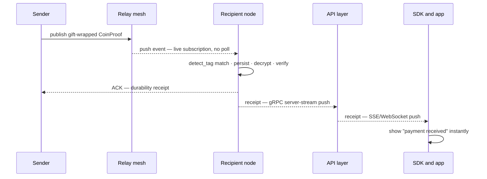
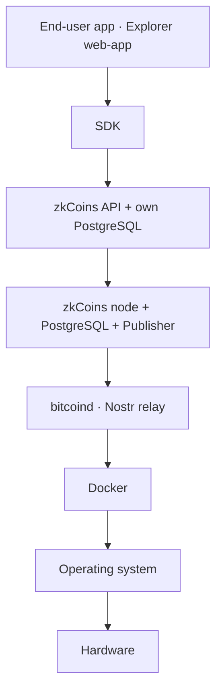
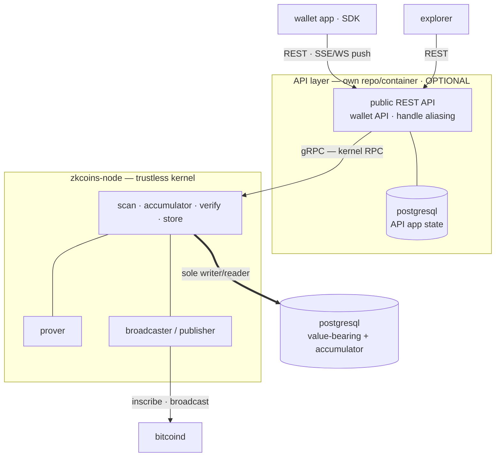
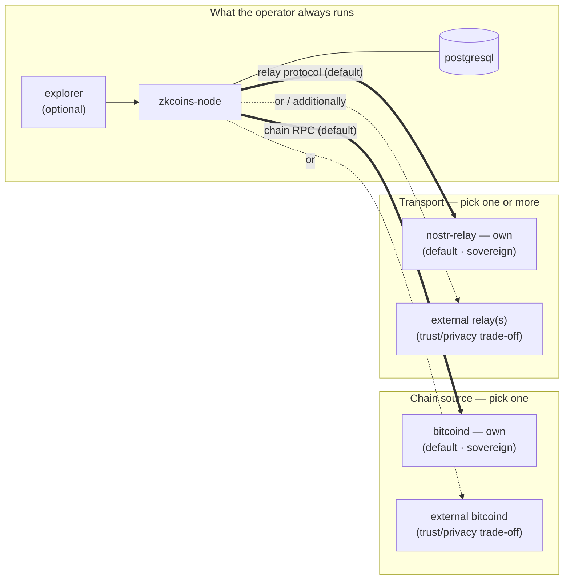

# zkCoins Protocol Specification

This document is **a possible** technical specification of the **zkCoins protocol** — one concrete, buildable realization of the zkCoins concept (Robin Linus) and the **Shielded CSV** construction (Jonas Nick, Liam Eagen, Robin Linus), designed around a single principle: **the full self-sovereignty of every participant, with no central element anywhere in the system.**

> Private payments on Bitcoin — no new chain, no token, no consensus change, no trusted operator. Only Bitcoin, zero-knowledge proofs, and the user's own keys.

:::tip In one paragraph (plain language)
zkCoins lets you send value on Bitcoin without anyone seeing the amount, the asset, who paid, or who received. Bitcoin stores only **opaque markers** that transitions happened — *not* the coin's contents, which travel privately between sender and receiver as a small encrypted bundle. **Double-spend protection** is the chain's job: every state-advancing transition — a send, a receive, and a mint — publishes a one-time, random-looking *nullifier* on Bitcoin — about 64 bytes — that can enter the Bitcoin-anchored global nullifier set only once; a publisher may half-aggregate many transitions' nullifiers into one inscription (or a wallet publishes its own), and any second transition against the same account state is rejected. Your **seed phrase** derives every key, your **wallet** is the only thing that can spend, **any node** can serve you, and your own node checks every figure against Bitcoin on your behalf (the Bitcoin full-node model — trustlessness comes from self-hosting that node, [Requirement 4](/requirements)).
:::

:::info What this is — and what it isn't
This is **one** concrete realization, not the only one possible: wherever the source papers leave a choice open, this specification takes the established, Bitcoin-consistent option and defines it exactly. It follows the whitepapers' construction — registering every load-bearing deviation in the [Paper-Deviation Analysis](/paper-conformance-analysis) ([relationship section](#relationship-to-the-source-papers)) — and carries their philosophy into every layer they did not formalize — delivery, recovery, access, and operation. It describes the **target design** and is intentionally independent of any current implementation.
:::

## One principle, carried all the way

Every decision below follows from one idea — **complete self-sovereignty, zero central elements** — applied without exception:

| Design decision | follows from the principle |
|---|---|
| Settles only on Bitcoin L1 — no own chain, token, or consensus | inherit the most decentralized base; build no new one |
| Client-side validation; constant-size ZK proofs | each participant verifies for themselves, trusting no one |
| Spend key lives only in the wallet | the participant alone holds custody |
| Off-chain delivery over an operator-run relay mesh | no central delivery service |
| Recovery from seed + Bitcoin + the network | no central backup custodian |
| Capability-gated disclosure; self-hostable, verifiable explorer | the owner alone decides who sees what; no trusted authority |
| Any node — switchable, several at once | no lock-in to any operator |
| Permissionless asset creation | anyone can create their own asset; each asset's minter is its creator |

These are not features bolted on. They are the same principle, followed to its conclusion.

## The triad it guarantees

- **Bitcoin-anchored** — settled on Bitcoin L1, exactly as it exists today.
- **Shielded** — amounts, sender, receiver, and the transaction graph are hidden, behind a global anonymity set.
- **Trustless** — correctness is enforced by cryptography and Bitcoin alone.

Each is rare on its own elsewhere; here they hold **together** — see [Comparisons](/comparisons).

## How the data moves

**What lives where.** Bitcoin holds only opaque markers; everything that says *which coin, how much, between whom* lives off-chain and is encrypted to the recipient:

```
    BITCOIN L1 (Public)                  OFF-CHAIN (Private — wallet + node)
    ────────────────────                 ───────────────────────────────────

    ┌──────────────────┐                 ┌───────────────────────────────┐
    │ Nullifier        │  sign-to-       │  AccountState                 │
    │ ────────────     │  contract       │   balances · keys · counters  │
    │ Pkᵢ  (x-only)    │  binds          │   coin_history_root           │
    │ Rᵢ   (S2C nonce) │ ◀ H(ProofData)─ ├───────────────────────────────┤
    │                  │                 │  SpendRecord {Pkᵢ, signature} │
    │ (~64 bytes/tx,   │                 │   per-transition authorization │
    │  half-aggregated │                 │   (96 bytes, off-chain)       │
    │  by a publisher) │                 ├───────────────────────────────┤
    └──────────────────┘                 │  CoinProof bundle  ──▶ to B   │
            ▲                            │   (coin + proof + creating    │
            │ inscribed in a             │    nullifier + nav opening +   │
            │ Taproot reveal-tx          │    encryption envelope) —      │
            │ envelope                   │   relay mesh (k=3 replicated)  │
            │                            │                               │
            └────────────────────────────┴───────────────────────────────┘
```

**A payment, end to end.** A pays B; both run their own wallet+node; only Bitcoin is shared:

```
    Alice                 Nostr relay     Publisher       Bitcoin       Bob
      │                       │              │              │           │
      │ 1. build SpendRecord  │              │              │           │
      │    + recursive proof  │              │              │           │
      │                       │              │              │           │
      │ 2. publish encrypted CoinProof bundle (NIP-44 / NIP-59)         │
      ├──────────────────────▶│              │              │           │
      │                       │              │              │           │
      │ 3. hand nullifier (Pkᵢ,Rᵢ,sᵢ,R') + fee CoinProof to a publisher │
      │    (off-chain; or self-publish)                                 │
      ├─────────────────────────────────────▶│              │           │
      │                       │              │              │           │
      │                       │              │ 4. half-aggregate many   │
      │                       │              │  nullifiers' signatures  │
      │                       │              │              │           │
      │                       │              │ 5. inscribe one          │
      │                       │              │  half-aggregated set     │
      │                       │              │  (~64 B / tx)            │
      │                       │              ├─────────────▶│           │
      │                       │              │              │           │
      │                       │  every node folds each Pkᵢ into the     │
      │                       │  global accumulator by first-occurrence │
      │                       │  — a pure function of Bitcoin           │
      │                       │              │              │           │
      │                       │ 6. scan CoinProof candidates · match    │
      │                       │    detect_tag (1 ECDH+hash/evt)         │
      │                       ◀──────────────────────────────────────────
      │                       │              │              │           │
      │                       │ 7. gift-wrapped bundle blob             │
      │                       ├─────────────────────────────────────────▶
      │                       │              │              │           │
      │                       │            8. decrypt with K_tx         │
      │                       │              verify recursive proof,    │
      │                       │              creating nullifier is      │
      │                       │              first-occurrence anchored, │
      │                       │              and nav is canonical       │
      │                       │              │              │           │
      │                       │            9. receive transition folds  │
      │                       │               the coin in (trustless)   │
      │                       │              │              │           │
      │10. encrypted ACK · A may drop her copy once k replicas confirmed│
      ◀──────────────────────────────────────────────────────────────────
      │                       │              │              │           │
```

## Scope

The specification covers every component that will exist: the **node** (validator · prover · relay · data store), the **wallet** (thin key-holder), and the **explorer** (public and authorised views) — together with the cryptography that binds them. For every key, hash, and identifier it states exactly **how it is derived**; for every requirement, **how it is met**.

## The ten requirements

The whole specification exists to satisfy these (in full on the [Requirements](/requirements) page):

1. Bitcoin L1 as the only base · 2. Private · 3. Trustless · 4. Client-side validation · 5. Custody only in the wallet · 6. Recovery · 7. Self-hostable · 8. Multi-asset · 9. Selective disclosure · 10. Node portability.

## Contents

| # | Section | What it gives you |
|---|---|---|
| 1 | [Foundations](#1--foundations-normative) | The single source of truth: primitives, the full key hierarchy and exact derivations, every identifier, the data structures and the global nullifier accumulator |
| 2 | [Proofs & State Transitions](#2--proofs--state-transitions) | The compliance predicate, recursion, and the mint / send / receive algorithms |
| 3 | [On-chain Layer](#3--on-chain-layer) | The on-chain nullifier `(Pkᵢ, Rᵢ)` (~64 bytes per transition, half-aggregated), transition signing, publisher half-aggregation, and the global nullifier accumulator |
| 4 | [Transport & Recovery](#4--transport--recovery) | Off-chain delivery, note discovery, seed recovery, data availability |
| 5 | [Access & Explorer](#5--access--explorer) | Capability-gated pull, view grants, and the disclosure spectrum: per-transaction links, balance attestations, full-account views |
| 6 | [System Architecture](#6--system-architecture) | Node, wallet, explorer; portability, multi-node, issuance, threat model |
| 7 | [Wire Formats & Node Interfaces](#7--wire-formats--node-interfaces) | Concrete bytes: serialization, Nostr event kinds, Blossom blob store, the versioned `/v1/` REST API, publisher interface |
| — | [Glossary](#glossary) | Every term, identifier, and notation, alphabetical, one line each |
| — | [Test vectors](#test-vectors-conformance-harness) | Worked-example values and a conformance harness for implementations |

New here? Read **Foundations** first — everything else builds on it. Stuck on a term? Jump to the **Glossary**.

## Requirements traceability

Where each requirement is satisfied:

| Requirement | Satisfied by |
|---|---|
| **1 · Bitcoin-only base** | §1 (no native token; secp256k1/BIP-340), §3 (a per-transition ~64-byte nullifier `(Pkᵢ, Rᵢ)`, half-aggregated and inscribed by a publisher; no chain/consensus change) |
| **2 · Private** | §1.3 (per-coin encryption), §1.4 (the on-chain nullifier `(Pkᵢ, Rᵢ)` carries only a rotating key and a sign-to-contract nonce — no amounts, parties, per-coin nullifiers, or account link on chain), §2 (ZK proof hides amounts/parties/graph) |
| **3 · Trustless** | §2 (proof soundness ⇒ no forgery), §3 (nullifier accumulator ⇒ no double-spend), §1.2 (no key a node holds can spend), §6 (threat model); §3.4 + §6.3 (permissionless publish and node portability — freeze resistance) |
| **4 · Client-side validation** | §2 (the receiver — its own node on its behalf, thin-client rule — re-verifies the full recursive proof), §4 (receive flow) |
| **5 · Custody only in wallet** | §1.2 (SPEND branch is wallet-only; hardened separation); §2.1 clause 2 + §7.5 (`npk_commit` makes the rotated key wallet-verifiable, fail-closed) |
| **6 · Recovery** | §1.3 (seed-derived detection/scan keys), §4 (seed reconstruction, replication, data availability) |
| **7 · Self-hostable** | §6 (one `docker compose` stack — node · bitcoind · nostr-relay · PostgreSQL · explorer — each a pluggable, own-or-external building block, no operator-specific dependencies), §4 (paired Nostr relay) |
| **8 · Multi-asset** | §1.4 (`asset_id`), §1.5 (per-asset balances), §2 (per-asset conservation), §6 (issuance) |
| **9 · Selective disclosure** | §5 (three opt-in tiers — per-transaction §5.6, balance attestation §5.7, full-history view grant §5.8; each verifiable against Bitcoin, rendered by a self-hostable explorer) |
| **10 · Node portability** | §1.2 (everything derives from the seed ⇒ no node-specific state), §6 (switch / multi-node) |

## Conventions

Normative keywords (**MUST**, **MUST NOT**, **SHOULD**, **MAY**) follow RFC 2119. All notation, primitives, and domain-separation tags are defined once in [Foundations](#1--foundations-normative) and used unchanged throughout; sizes, encodings, and input orderings are exact.


## 1 · Foundations (normative)

> *In one sentence: every key, hash, identifier, and byte-level rule the rest of the spec uses, defined exactly once here.*

This page is the **single source of truth** for the zkCoins specification. Every other spec page builds on the primitives, keys, identifiers, and structures defined here. It is written against the **target design** (the [Requirements](/requirements)), not against any current implementation.

Normative keywords (**MUST**, **MUST NOT**, **SHOULD**, **MAY**) are used per RFC 2119.

### 1.1 Cryptographic primitives

The protocol fixes one concrete instantiation. Where a choice was open, the established, Bitcoin-consistent option is taken.

| Role | Primitive |
|---|---|
| Signature curve & scheme | **secp256k1**, **BIP-340 Schnorr** (x-only public keys, 32-byte) |
| On-chain / signature hash | **SHA-256** (BIP-340 uses tagged SHA-256 internally) |
| In-circuit hash | **Poseidon** over the proof field `𝔽` (Goldilocks, `p = 2^64 − 2^32 + 1`); reference instance: Plonky2 `PoseidonGoldilocksConfig` — state width 12, rate 8, capacity 4, 8 full + 22 partial rounds, round constants and MDS as in `plonky2/src/hash/poseidon.rs`. Parameters and absorption MUST match this instance (§1.7) |
| General hash (addresses, off-circuit ids) | **SHA-256** |
| Recursive proof system | A **proof-carrying-data (PCD)** scheme via **cyclic recursion**; reference instantiation: a FRI-based recursive proof (Plonky-style) over Goldilocks with Poseidon |
| Key derivation | **BIP-32** (secp256k1) for the key tree; **HKDF-SHA256** for symmetric/derived secrets |
| Transport encryption | **NIP-44 v2** (ECDH-secp256k1 → HKDF-SHA256 → ChaCha20 + HMAC-SHA256) |
| Metadata privacy | **NIP-59** gift-wrap |
| Text encoding | **Bech32m** for the address (HRP `zk`); transport identifiers as `bech32m` with role HRPs |

Notation:

- `H(x)` — SHA-256 of byte string `x`.
- `Hc(tag, a, b, …)` — Poseidon over `𝔽`, **domain-separated** by `tag`, applied to the field-encoded inputs.
- `P = k·G` — secp256k1 scalar multiplication; `G` the generator.
- `ECDH(k, P) = x(k·P)` — the 32-byte big-endian x-coordinate of the shared point. When `P` is given **x-only** (32 bytes — `epk`, `IVPK`), it is lifted to the even-y point (`lift_x`, BIP-340) before the multiplication; the lift's sign ambiguity is immaterial because `x(k·lift_x(P))` is identical for both candidate points.
- `a ‖ b` — byte concatenation. Inside the argument list of an `Hc(tag, …)` call, `‖` instead separates the hash's typed **input list** ([§1.7.2](#172-field-encoding-e-of-hc-inputs)); it never denotes prior byte concatenation there.
- **Secret vs. public.** A lowercase key name (`skᵢ`, `ivk`, `ovk`, `op`, `nk`) denotes the **secret scalar**; its public point is written `<name>·G` or a named pubkey (e.g. `Pkᵢ = skᵢ·G`, `IVPK = ivk·G`, `op_pubkey = op·G`). BIP-340 public keys are **x-only** (32 bytes).

**Domain separation.** Every `Hc`, `HKDF`, and `H` call that takes a literal context string **MUST** use the prefix form `"zkCoins/v1/<context>"`. The contexts reserved by this spec are:

- **Identifiers and per-coin derivations** — `AssetId`, `AssetIdV2` (the token-standard-2 capped-asset id, [§6.5](#token-standard-2--auditable-capped-supply)), `Coin`, `AccountState`, `NkCommit` (account nullifier-key commitment, §1.5/§2.1 clause 4), `Nullifier`, `NoteKey`, `DetectTag`, `OutKey` (outgoing-recovery key, §1.3).
- **Per-transition Merkle roots** — `CoinsRoot`, `CoinsRoot/Leaf`, `CoinsRoot/Node`, `NullifiersRoot`, `NullifiersRoot/Leaf`, `NullifiersRoot/Node`.
- **Nullifier-accumulator Merkle log** — `NfLog/Leaf`, `NfLog/Node`, `NfLog/Root`, `NfLog/Empty` (the global append-only nullifier-accumulator log, RFC 6962 over Poseidon, §1.7.6). **Coin-history SMT** — `CoinHist/Leaf`, `CoinHist/Node` (per-account coin-history sparse Merkle tree, §1.7.6).
- **Conditional NAV** — `NavCommit` (the hiding commitment to a transition's conditional nullifier-accumulator value `nav` that a proof exposes publicly, §1.4/§3.9); `NavRand` (the HKDF context for the per-transition `nav_rand` derivation, §1.4); `NpkCommit` (the wallet-native SHA-256 commitment to the rotated `next_pubkey`, §2.1 clause 2).
- **On-chain / off-chain protocol messages** — `Grant`, `Invoice`, `PullChallenge`, `PullHost` (channel binding, [Access & Explorer §5.1](#51-capability-gated-pull)), `IssuanceTerms`, `IssuanceTermsV2` (the token-standard-2 capped-asset terms hash, [§6.5](#token-standard-2--auditable-capped-supply)), `HalfAgg` (the on-chain half-aggregation transcript, [§3.3](#33-half-aggregation)), `BalanceProof`, `Ack` (delivery acknowledgement, §4.2).
- **Transport** — `BlobKey`, `Blob` (ZBE blob encryption key derivation and per-chunk AAD, [§4.2.1](#421-bundle-blob-encryption-zbe-normative)).
- **Seed derivation** — `PasskeySeed` (HKDF context for deriving the seed from a Passkey PRF output, §1.2).

The fixed strings `zkCoins/v1/genesis` (an `Hc` *input* constant, [§1.4](#14-identifiers-and-hashes)), the network tags `zkCoins/v1/mainnet` / `zkCoins/v1/testnet` / `zkCoins/v1/regtest` (verifier-data parameters, [§2.2 network/chain separation](#22-proof-types)), and the test-vector labels (V.1) reuse the version prefix for namespacing but are **not** domain-separation contexts — they never select an `Hc`/`HKDF`/`H` domain and are therefore not listed above.

Reusing a context for two purposes is forbidden. Where a later section writes shorthand such as `Hc("Coin", …)` or `H("Invoice" ‖ …)`, this is equivalent to the full prefixed form `Hc("zkCoins/v1/Coin", …)` / `H("zkCoins/v1/Invoice" ‖ …)`; **implementations MUST use the full prefixed string**, the shorthand is a notation convenience. The address derivation `address = H(Pk₀ ‖ nk_commit)` ([§1.4](#14-identifiers-and-hashes)) is the one identifier with no context prefix — by design, since its input `Pk₀ ‖ nk_commit` is already SHA-256-collision-bound.

**HKDF parameter mapping (normative).** Every `HKDF(tag, material)` call in this document — `K_tx`, `K_out` ([§1.3](#13-per-coin-keys-note-encryption--detection)), `nav_rand` ([§1.4](#14-identifiers-and-hashes)), the Passkey seed ([§1.2](#12-key-hierarchy)), and the ZBE `kb` ([§4.2.1](#421-bundle-blob-encryption-zbe-normative)) — denotes HKDF-SHA-256 per RFC 5869 with one fixed parameter mapping:

- **`IKM`** = `material` — the raw byte-concatenation of the shorthand's `‖`-joined arguments ([§1.7.2](#172-field-encoding-e-of-hc-inputs)'s note that HKDF preimages absorb raw bytes, not the `Hc` length-prefixed input-list encoding), each argument in its existing fixed-width byte encoding used throughout this document.
- **`salt`** = 32 zero bytes.
- **`info`** = `tag` — the full `"zkCoins/v1/<context>"` string, ASCII bytes, no length prefix or terminator.
- **`L`** (output length) = 32 bytes.

That is, `HKDF(tag, material) = HKDF-Expand(HKDF-Extract(salt = 0x00×32, IKM = material), info = tag, L = 32)`. [§4.2.1](#421-bundle-blob-encryption-zbe-normative)'s `kb = HKDF-SHA256(IKM = K_tx, salt = 32 zero bytes, info = "zkCoins/v1/BlobKey", L = 32)` is this same mapping spelled out for the single-argument case `material = K_tx`; it applies identically to every other `HKDF` call site, so `K_tx`, `K_out`, `nav_rand`, and the ZBE `kb` are bit-reproducible across implementations.

### 1.2 Key hierarchy

All key material descends deterministically from a single 256-bit **seed**. The seed is the only thing a user backs up ([Requirement 6](/requirements)).

```
seed  (256-bit; BIP-39 mnemonic, or Passkey PRF → HKDF)
  └─ BIP-32 ─▶ m  (master)
        └─ m / 1798' / account'                              = A   (per-account root; 1798' = zkCoins purpose)
              ├─ A / 0'        = SPEND branch   (wallet only)
              │     ├─ A/0'/0'            = sk₀   → Pk₀   (initial signing key; fixes the address)
              │     └─ A/0'/i'            = skᵢ   → Pkᵢ   (rotating per-transition signing key)
              ├─ A / 1'        = VIEW branch    (delegable to a node)
              │     ├─ A/1'/0'            = ivk           (incoming viewing key)
              │     └─ A/1'/1'            = ovk           (outgoing viewing key)
              ├─ A / 2'        = op            (operational / Nostr identity key)
              ├─ A / 3'        = nk            (account-level nullifier key; part of the operational bundle)
              └─ A / 4'        = op_secret     (nav-rand secret; keys the nav_rand HKDF, §1.4)
```

`1798'` is the chosen BIP-43 purpose index for zkCoins (hardened). All branch separations are **hardened**: the VIEW, `op`, `nk`, and `op_secret` branches are hardened children of `A`, so a party holding them **cannot** derive the SPEND branch. `op_secret` (`A/4'`) is a dedicated 256-bit secret — separate from `op` so the conditional-NAV randomness derivation never shares key material with the Nostr signature — that keys the deterministic `nav_rand` HKDF (§1.4); like `nk` it is part of the operational bundle the wallet entrusts to its own node.

**Passkey seed source — a custody trade-off ([Requirement 5](/requirements)).** When the seed is taken from a **Passkey PRF** rather than a BIP-39 mnemonic (the two sources above), it is derived as `seed = HKDF("zkCoins/v1/PasskeySeed", prf_output)` — `HKDF-SHA-256` (RFC 5869) under the [§1.1](#11-cryptographic-primitives) domain-tag salt/info mapping, `prf_output` being the passkey PRF's raw output — and the custody of the seed inherits the passkey's storage model. A **platform-synchronised** passkey (e.g. iCloud Keychain or Google Password Manager) replicates the credential material from which the seed is derived to the provider's servers, so whoever controls that account can reconstruct the seed. For strict custody a wallet **SHOULD** back the seed with a **device-bound** (non-syncable) passkey or a BIP-39 mnemonic. This is a deployment trade-off about *where the seed lives*, not a break in the protocol's custody model — the SPEND branch still never leaves the wallet in use ([Requirement 5](/requirements)).

**Who holds what** (this table is the cryptographic basis of the trust model, [§6.6](#66-threat-model-and-trust-configurations)):

| Key | Held by | Can do | Cannot do |
|---|---|---|---|
| `skᵢ` (SPEND branch) | wallet only | authorise spends | — |
| `nk` | wallet, and the wallet's **own** node (operational bundle) | compute nullifiers — required in the proving witness ([§2.1 clause 4](#21-the-compliance-predicate)) | spend; it **can link the account's own spends**, which is why it is entrusted only to the account's own node, never a foreign one |
| `ivk` | wallet, and any node the wallet delegates to | detect & decrypt **incoming** coins | spend |
| `ovk` | same | recover **outgoing** coin plaintext via the per-coin `out_ciphertext` (§1.3) | spend |
| `op` | the node | publish/receive on Nostr, sign view grants & acknowledgements | spend, decrypt others' coins |
| `K_tx` (per-coin note key, §1.3) | derived per coin; shareable | decrypt **exactly one** coin | spend, see any other coin |

The **operational bundle** `{ivk, ovk, op, nk, op_secret}` is what a wallet entrusts to its **own** node so the node can receive, prove, and serve on its behalf 24/7 ([§6.2](#62-wallet--node)). None of it can spend; `nk` additionally lets its holder link the account's own spends, which is why the bundle goes only to the account's own node. A *foreign* node never receives the bundle; the wallet instead issues that node a scoped, `op`-signed **view grant** ([§5.2](#52-view-grant)).

**Spend-key model (account-level).** The keys `skᵢ` are rotating **per-transition** signing keys — there is **no** per-coin signing key. Transition `i` (where `i = send_counter` at entry) is authorised by `skᵢ`, whose public key `Pkᵢ` is the account's `current_pubkey` and is carried in that transition's `SpendRecord` (§1.4); every **state-advancing** transition — send, receive, or mint — publishes `Pkᵢ` as its on-chain nullifier key ([§3.1](#31-the-on-chain-object)), while the account's own recursive proof verifies the transition in-circuit ([§2.2](#22-proof-types)). The transition rotates `current_pubkey` to `Pk_{i+1}`. `Pk₀` and `nk_commit` together fix the address (`address = H(Pk₀ ‖ nk_commit)`, §1.4). `nk` is account-level and is **bound to the account identity itself**: its commitment `nk_commit = Hc("NkCommit", nk)` is both a committed `AccountState` field ([§1.5](#15-core-data-structures), [§2.1 clause 4](#21-the-compliance-predicate)) **and** part of the address preimage, so a coin sent to an address has exactly one valid nullifier and a holder cannot equivocate two accounts (two `nk`) under one address (the soundness role, not a custody change — `nk` stays the secret witness). Coin ownership is by the account (a coin's `recipient = address`); a receiver therefore never needs a per-coin key.

**Accounts and addresses are one-to-one.** An account `A` has **exactly one** address, `address = H(Pk₀ ‖ nk_commit)` (§1.4); the address commits to both the initial spend key **and** the account's nullifier-key commitment, so the correspondence `address ↔ (Pk₀, nk_commit) ↔ account` is genuinely one-to-one — a holder cannot register two accounts (two `nk`) under one address. The protocol defines **no** diversified addresses, sub-addresses, or change addresses: there is no way to derive a second, separately-disclosable or separately-unlinkable receiving address under the same account. The **account is therefore the sole unit** of every isolation boundary in the system — privacy domain, selective disclosure ([Access & Explorer](#5--access--explorer)), recovery ([Transport & Recovery](#4--transport--recovery)), and node portability ([Requirement 10](/requirements)). A wallet derives further accounts at `m/1798'/account'`; it **MUST NOT** present multiple receiving addresses within one account. Consequences a wallet **MUST** surface to the user:

- To keep two activities unlinkable toward the counterparties they are shared with, or to disclose one independently of the other ([Access & Explorer §5.8](#58-address-view-full-history)), each **MUST** live in its **own account**, chosen deliberately — never as an implicit sub-address of a shared account.
- Each additional account is an independent scan and recovery scope (its own `ivk` / `detect_tag` lineage) and adds backup and scanning cost. This cost is the deliberate, accepted price of compartmentalisation; it is the reason the default is **one account reused**, not many accounts.
- Reusing one address toward many counterparties reveals nothing on-chain — [Requirement 2](/requirements) is unaffected — but lets those counterparties correlate one another **off-chain** through the shared address string. Per-relationship unlinkability therefore requires per-relationship accounts, never extra addresses on one account.

### 1.3 Per-coin keys (note encryption & detection)

Each output coin carries an ephemeral key and is individually encrypted, so that a single per-coin capability discloses one coin and nothing else.

```
Per output coin:
  esk           = random scalar                          (sender, fresh per coin)
  epk           = esk·G                                   (published with the coin)
  IVPK          = ivk·G                                   (recipient incoming-view pubkey)
  ss            = ECDH(esk, IVPK)  = ECDH(ivk, epk)       (shared secret; both sides derive it)
  K_tx          = HKDF("zkCoins/v1/NoteKey",  ss ‖ epk)   (per-coin symmetric note key)
  detect_tag    = Hc("zkCoins/v1/DetectTag",  ss ‖ epk)   (per-coin detection tag; same ss as K_tx, distinct tag)
  K_out         = HKDF("zkCoins/v1/OutKey",   ovk ‖ epk)  (sender-side, from the SENDER's own ovk)
  out_ciphertext = NIP44_v2(K_out, K_tx)                  (outgoing-recovery envelope; §4.2 self-delivery)
```

- `K_tx` and `K_out` instantiate the [§1.1](#11-cryptographic-primitives) `HKDF(tag, material)` parameter mapping (`IKM = material` — here `ss ‖ epk` or `ovk ‖ epk` — `salt` = 32 zero bytes, `info = tag`, `L = 32`).
- The coin plaintext — `serialize(Coin)` ([§1.5](#15-core-data-structures), the coin's `{identifier, recipient, amount, asset_id}`) — is encrypted under `K_tx` (NIP-44 v2) as `ciphertext = NIP44_v2(K_tx, serialize(Coin))`; this is the `CoinProof.ciphertext` field ([§1.5](#15-core-data-structures)). It is **distinct** from the bundle-level ZBE output the whole serialised `CoinProof` is wrapped in for transport and content-addressing ([§4.2](#42-bundle-delivery) steps 1–2, [§4.2.1](#421-bundle-blob-encryption-zbe-normative)) — the two are different byte strings under different schemes that happen to share the informal name "ciphertext"; only the bundle-level one is ever hashed for `blob_id`. Only a holder of `ivk` (the recipient, or its node) can re-derive `K_tx` and decrypt either.
- `detect_tag` lets a recipient/node find its own coins **without trial-decrypting every event**. The **sender** computes it from the shared secret `ss = ECDH(esk, IVPK)`; the **recipient**, holding `ivk`, recomputes `ss = ECDH(ivk, epk)` for each candidate's published `epk`, then `Hc("zkCoins/v1/DetectTag", ss ‖ epk)`, and matches against the published `detect_tag` — one ECDH plus one Poseidon hash per scanned event, replacing the full AEAD trial-decryption **and** the (≈100 KB) blob fetch for every non-matching event. Because every coin uses a fresh `epk`, each recipient's events carry **all-distinct** tags: a tag does **not** link two of one recipient's coins, and a relay that holds neither `ivk` nor the sender's `esk` can **neither** pre-filter for the recipient **nor** correlate the recipient's events. Detection does not reduce the *count* of candidates the recipient pulls. `ivk` is **seed-derivable**, so detection doubles as the recovery scan key ([Requirement 6](/requirements)).
- **Why the shared secret, not a recipient-only key (normative rationale).** The tag **MUST** derive from `ss` — not from a value bound to the recipient's secret `ivk` alone — because the **sender** sets the tag at send time and holds only the recipient's public `IVPK`. It can compute `ss = ECDH(esk, IVPK)`, but **cannot** compute any function of the recipient's secret key. A recipient-only detection key (e.g. `HKDF(ivk)`) would shrink the recipient's per-event check to a single hash, but is **unsatisfiable for an open, no-prior-interaction address**: a per-coin tag that is simultaneously (i) sender-computable from a static public key and (ii) unlinkable to outsiders must carry its per-coin entropy through a Diffie–Hellman with the fresh `epk`, so the recipient's check is inherently one ECDH per candidate, never a bare hash. The bandwidth lever would be the future-version (not in v1) Fuzzy message detection below, not a cheaper tag derivation.
- **Key-reuse safety (normative).** The same shared secret `ss` feeds both the **secret** note key `K_tx = HKDF("zkCoins/v1/NoteKey", ss ‖ epk)` and the **public** `detect_tag = Hc("zkCoins/v1/DetectTag", ss ‖ epk)`. The two are domain-separated outputs of `ss ‖ epk` under distinct context strings **and** distinct primitives (HKDF-SHA-256 vs Poseidon); modelling each primitive as an independent random oracle, neither value reveals the other. In particular the on-the-wire `detect_tag` does **not** leak `ss` (Poseidon preimage resistance, [§1.7.1](#171-poseidon-instance-and-digest-encoding)), so publishing the tag does **not** weaken `K_tx` or the coin's confidentiality.
- **Fuzzy message detection (NOT part of v1).** A relay-side probabilistic pre-filter (tunable false-positive rate) reduces the candidate count the recipient downloads, at no linkability cost. It would change only the tag computation and is a possible **future-version** scan-efficiency upgrade — v1 nodes and wallets **MUST** use exactly the detect-tag computation of this section, and no FMD algorithm is specified or permitted in v1 — not a fix for a linkability the deterministic scheme does not have.
- **Outgoing recovery (`out_ciphertext`, normative).** For every outgoing coin the sender **MUST** derive `K_out = HKDF("zkCoins/v1/OutKey", ovk ‖ epk)` from its **own** `ovk` and produce `out_ciphertext` — the NIP-44 v2 payload encryption of `K_tx` under `K_out` as the conversation key. The pair `{epk, out_ciphertext}` accompanies the sender's retained and self-delivered record of the coin ([§4.2](#42-bundle-delivery) self-delivery). A holder of the sender's `ovk` re-derives `K_out` from the stored `epk`, opens `out_ciphertext` to recover `K_tx`, and decrypts the outgoing coin's `ciphertext` — this is the concrete mechanism behind every "recover outgoing-coin plaintext" capability (§1.2, [§5.8](#58-address-view-full-history)). `ivk` alone therefore yields the incoming-only view; `ivk ‖ ovk` yields the full view.
- The **per-coin view capability** placed in an explorer link ([§5.3](#53-per-coin-view-capability), [§5.6](#56-shareable-confirmation-links)) is `K_tx` for that one coin. It decrypts that coin only.

### 1.4 Identifiers and hashes

Exact derivations. Every value here is reproducible from its inputs.

| Identifier | Definition | Size / type |
|---|---|---|
| **Address** | `address = H(Pk₀ ‖ nk_commit)` — SHA-256 of the **initial** spend public key concatenated with the account's nullifier-key commitment `nk_commit = Hc("NkCommit", nk)` (§1.5, §2.1 clause 4); fixed at account creation; the protocol's only identity. Binding `nk_commit` **into the address** makes the account's nullifier key part of its identity, so a coin sent to an address has **exactly one** valid nullifier and a holder cannot equivocate two accounts (two `nk`) under one address (§2.1 clause 4, §2.2) | 32 bytes (Bech32m, HRP `zk`) |
| **nk_commit** | `nk_commit = Hc("NkCommit", nk)` — Poseidon commitment to the account nullifier key `nk` (§1.2); a committed field of `AccountState` (§1.5, §1.7.4) and part of the `address` preimage above; `nk` stays the secret witness | 256-bit digest (32-byte canonical) |
| **AssetId** | `asset_id = Hc("AssetId", genesis_tag ‖ creator_pubkey ‖ name_hash ‖ decimals ‖ issuance_version)` at asset creation, where `creator_pubkey ≜ Pk₀` of the issuing account (its initial spend public key — the key that, together with `nk_commit`, fixes the account `address`; note `asset_id` binds **`Pk₀` alone**, not the full address, so one `Pk₀` may issue under several accounts — see [Architecture §6.5](#65-issuance--token-standards)), `name_hash = H(name)`, `genesis_tag` is the fixed constant ASCII string `zkCoins/v1/genesis`, and `issuance_version` is the **token standard (issuance-schema version)** the asset is created under (a `u8`; `1` or `2`, see [Architecture §6.5](#65-issuance--token-standards)). A **token-standard-2** asset instead derives `asset_id = Hc("AssetIdV2", genesis_tag ‖ creator_pubkey ‖ name_hash ‖ decimals ‖ issuance_version ‖ cap_total ‖ terms_salt)`, additionally binding the supply cap `cap_total` (`u128`) and its secret blind `terms_salt` (32 bytes), with `terms_hash = Hc("IssuanceTermsV2", asset_id ‖ issuance_version ‖ cap_total ‖ terms_salt)` ([Architecture §6.5](#token-standard-2--auditable-capped-supply)). The human-readable `name` is **never** on-chain. Every input is derived from stated values, so `asset_id` is fully reproducible | 256-bit digest (32-byte canonical) |
| **Coin identifier** | `coin.identifier = Hc("Coin", prev_account_state_hash ‖ recipient ‖ asset_id ‖ amount ‖ coin_index)`. The `prev_account_state_hash` is the `ash` of the **prior** account state — the state *before* the transition that creates the coin — so the identifier is a well-defined function of inputs known at creation time and is **not** recursively dependent on the transition's own `new_account_state_hash` (which itself folds in `coin_history_root`, §1.7.4–§1.7.6). `recipient` and `amount` are the coin's `CoinTemplate` fields (§1.5), also fixed at creation, so folding them into the preimage keeps the identifier deterministic while **binding the coin's value and owner into the commitment**: the identifier is the leaf committed to `output_coins_root` (§2.1 clause 6), and it is **recomputed in-circuit from the full tuple** wherever the coin is spent (§2.1 clause 2(c)) or received (§2.1 clause 10(b)), so a receiver cannot credit — nor a spender debit — an `amount` or `recipient` other than the one the creating account committed. This is what makes per-asset conservation hold **across** account boundaries, not only within one transition (§2.4). `recipient` and `amount` stay in the witness — only the identifier and the roots over it are public (§2.1 clause 9) — so this binding adds no disclosure. A coin's identifier is fixed at creation and recomputed with that same `prev_ash` (and the same `recipient`/`asset_id`/`amount`/`coin_index`) when later spent. | 256-bit digest (32-byte canonical) |
| **account_state_hash** (`ash`) | `ash = Hc("AccountState", serialize(AccountState))` | 32-byte canonical |
| **output_coins_root** (`ocr`) | Poseidon Merkle root over the transaction's output `coin.identifier`s, tag `CoinsRoot` | 32-byte canonical |
| **input_nullifiers_root** (`inr`) | Poseidon Merkle root over the transition's spent `nf`s, tag `NullifiersRoot` | 32-byte canonical |
| **Transition message** (`m_state`) | The **fixed** protocol-constant string `m_state = "zkCoins/v1/StateUpdate"` that every account transition signs (§3.2, §2.1 clause 2). The transition's specifics — `inr`, `ocr`, and the rotated spend authority (via `new_account_state_hash`) — are **not** in the message; they are folded into `ProofData` and bound into the signature's nonce by **sign-to-contract** (`H(ProofData)`, below), which is what keeps the on-chain nullifier at ~64 bytes and lets a scanner verify the signature with no off-chain data | fixed ASCII string |
| **On-chain nullifier** | `(Pkᵢ, Rᵢ)` — the transition's account-state nullifier written to Bitcoin ([§3.1](#31-the-on-chain-object)): `Pkᵢ` (x-only) is the state's `current_pubkey`, and `Rᵢ` (x-only) is the sign-to-contract nonce of `txn_sig` that commits `H(ProofData)`. A publisher half-aggregates many transitions' `(Pkᵢ, Rᵢ)` signatures — plus the single shared scalar `s_agg` — into one inscription, the **`AggregateStateNullifierV3`** object ([§3.1](#31-the-on-chain-object), [§3.3](#33-half-aggregation)) whose per-member unit is this pair `(Pkᵢ, Rᵢ)`; the global accumulator (§1.6, §3.7) folds each `Pkᵢ` by **first-occurrence**, **appending** the position-bound leaf `Hc("NfLog/Leaf", p ‖ Pkᵢ ‖ Rᵢ)` to the append-only log (§1.7.6). Rotating and per-transition, so unlinkable to the account | 64 bytes per transition on-chain (before aggregation) |
| **SpendRecord** | `{ public_key: Pkᵢ (32B x-only), signature: BIP-340(skᵢ, m_state) with sign-to-contract binding H(ProofData) (64B) }` — the account's **transition authorization**: one per transition, produced by **every** state-advancing transition alike — a send, a receive, and a mint. Its `(Pkᵢ, Rᵢ)` pair is what a publisher half-aggregates and inscribes on Bitcoin as the on-chain nullifier (above); the wallet's own node MAY self-publish it. Because every state-advancing transition consumes its state's one-time key `Pkᵢ`, **every** SpendRecord — a receive's and a mint's included — publishes its `(Pkᵢ, Rᵢ)` and is arbitrated by first-occurrence exactly like a spend (§2.1 clause 1, §3.10) | 96 bytes |
| **Nullifier** (`nf`, in-circuit) | `nf = Hc("Nullifier", nk ‖ coin.identifier)` — the **per-coin** nullifier, derived in-circuit by the spender and folded into `input_nullifiers_root` and the coin-history SMT (§2.1 clause 4, clause 8). It is the account's **private, in-circuit** bookkeeping and **never** appears on Bitcoin — the on-chain object is the per-transition account-state nullifier `(Pkᵢ, Rᵢ)` above, whose `Rᵢ` commits `H(ProofData)` (hence `inr` over all `nf`). Unlinkable to the coin without `nk` | 256-bit digest (32-byte canonical) |
| **nav / nav_commitment** (conditional NAV) | `nav` is the transition's **conditional nullifier-accumulator value** — the chain-derived accumulator value (§3.7), always `size_final` (the shared ≥6-confirmation-final prefix, §2.3.2 step 5), that contains every nullifier the transition **depends on** (its previous account state's nullifier and each input/received coin's creating-transition nullifier), the dependency-anchoring construct that ties each dependency to its on-chain nullifier (§3.7); reorg handling is bounded by the [§3.9](#39-finality-and-reorg-handling) finality directive. It is exposed only through the **hiding commitment** `nav_commitment = Hc("NavCommit", nav_root ‖ nav_rand)`, the fifth `ProofData` field: carried forward **monotonically** (§2.1 clause 1) and required to be a **canonical** accumulator value on a verifier's own scan (§2.3.3 step 2), so — with the per-hop predecessor-nullifier check (§2.1 clause 1) and clause 10(d) requiring each state-advancing transition's own nullifier to be a canonical member — one check attests the whole lineage's anchoring; a reorg that orphans a dependency makes `nav` non-canonical; within the ≤5-block tolerated window this cannot happen to a final dependency, and a ≥6-block reorg is outside v1's guarantee (§3.9). `nav_rand = HKDF("zkCoins/v1/NavRand", op_secret ‖ u64-be(send_counter))` is derived deterministically (so any prover holding the operational bundle reproduces it, and a fresh node rebuilds any prior opening — [Requirement 10](/requirements)) and **MUST NOT** be derived from `nav`. The opening `{nav, nav_rand}` travels only to a coin's recipient (via the `CoinProof` bundle) or a disclosure verifier | 32-byte digest (rand: 32-byte secret) |
| **ProofData** (public inputs) | `{ new_account_state_hash, output_coins_root, input_nullifiers_root, coin_history_root, nav_commitment, npk_commit }` — the per-account proof's public inputs. Global double-spend is enforced **not** here but by the on-chain nullifier accumulator's first-occurrence rule (§3.6, §3.7). The fifth field, **`nav_commitment`**, is the hiding conditional-NAV commitment defined above. **Canonical serialization** `serialize(ProofData) := new_account_state_hash ‖ output_coins_root ‖ input_nullifiers_root ‖ coin_history_root ‖ nav_commitment ‖ npk_commit` (the six 32-byte digests in that exact order — **192 bytes**), and **`H(ProofData) := SHA-256(serialize(ProofData))`** is the single normative definition the transition's sign-to-contract tweak commits everywhere ([§2.1 clause 2, clause 9](#21-the-compliance-predicate), [§3.2](#32-transition-signing-bip-340--sign-to-contract), [§5.7](#57-balance-attestation-history-private), V.4). **`ProofData` is the v1 realization of the `TransitionEssenceV3`** — the transition essence the signature commits: it binds the new account-state hash (`new_account_state_hash`; the *prior* state is bound through the recursive `prev_proof` check, §2.1 clause 1), the output-coins root (`output_coins_root`), the input-nullifiers root (`input_nullifiers_root`), the coin-history root (`coin_history_root`), and the conditional NAV (`nav_commitment`), and the rotated-key commitment (`npk_commit`, §2.1 clause 2). It realizes the *next-key-hiding commitment* as the sixth field `npk_commit = H("zkCoins/v1/NpkCommit" ‖ next_pubkey ‖ npk_rand)` (SHA-256, §2.1 clause 2), a **hiding** commitment (fresh secret `npk_rand`) to the rotated `current_pubkey = Pkᵢ₊₁`. It is a separate field — rather than being folded only into `new_account_state_hash` — precisely so the **thin wallet can recompute it** (SHA-256, no Poseidon) and confirm the node folded the wallet's own `next_pubkey`, closing the hosted-prover rotation-capture (§2.1 clause 2, [Requirement 5](/requirements)). **Consumed-key output.** Alongside `ProofData` (not within it), `C` exposes **one further public output**, the transition's **consumed key** `Pkᵢ` (= `txn_pubkey`, the `current_pubkey` this transition spends and publishes as its on-chain nullifier key, §3.1), so a verifier can bind each on-chain nullifier to the *specific* key its creating transition consumed ([§2.1 clause 1, clause 9, clause 10(d)](#21-the-compliance-predicate)); it is **not** part of `serialize(ProofData)` and does **not** enter `H(ProofData)`, so the **192-byte** `serialize(ProofData)` (six fields, including `npk_commit`) and every V.4–V.6 vector already account for it. `Pkᵢ` is already public on-chain, so exposing it discloses nothing new (clause 9, [Requirement 2](/requirements)) | hashes/roots + `Pkᵢ` |

The account's BIP-340 transition signature over the fixed `m_state` additionally uses **sign-to-contract**: it embeds the digest of the transition's validity proof (`H(ProofData)`) in the nonce `R`, so the on-chain nullifier `(Pkᵢ, R)` commits **exactly this** transition ([§2.1 clause 2](#21-the-compliance-predicate), [On-chain §3.2](#32-transition-signing-bip-340--sign-to-contract)). This is the **only** Schnorr object of the protocol; there is no separate publisher proof or publisher signature over shared state.

### 1.5 Core data structures

```
AccountState = {
  owner             : address,                 // fixed identity
  nk_commit         : digest,                  // = Hc("NkCommit", nk); binds the account's nullifier
                                               //   key so forks cannot equivocate nullifiers (§2.1
                                               //   clause 4); fixed at genesis, carried forward
                                               //   unchanged like owner
  balances          : map<asset_id, amount>,   // private bookkeeping, multi-asset (≤ MAX_ACCOUNT_ASSETS
                                               //   distinct non-zero entries, §2.5)
  current_pubkey    : Pkᵢ,                      // rotates each state-advancing transition
  send_counter      : i,                        // monotonic
  coin_history_root : root                      // Poseidon SMT root over the account's coin history (§1.6)
}

Coin         = { identifier, recipient: address, amount, asset_id }
CoinTemplate = { recipient: address, amount, asset_id }

CoinProof    = {                            // the value-bearing off-chain bundle (bearer)
  coin,                                      // plaintext coin
  proof,                                     // recursive validity proof
  inclusion_proof,                           // membership of coin in output_coins_root
  creating_prev_ash,                         // PRIOR account_state_hash of the transition that
                                             // created this coin; needed to recompute coin.identifier
                                             // in-circuit — by the spender (clause 2c) and by the
                                             // receiver (clause 10b) (§1.4, §2.1)
  creating_nullifier = { Pk_create,          // the creating transition's on-chain nullifier (§3.1);
                         R_create,            // Pk_create is bound to creating_proof.consumed_pubkey
                         R_prime_create },    // (§2.1 clause 10(d) / clause 9) and R_create S2C-opens to
                                             // H(creating proof's ProofData) via R_prime_create, so a
                                             // receiver or disclosure verifier confirms the creating
                                             // transition's first-occurrence entry — KEY and leaf — in
                                             // the accumulator (§2.3.3 step 4, §5.6). Present for a MINT too:
                                             // a mint publishes (Pk₀, R), so a receiver of a directly-minted
                                             // coin runs the identical first-occurrence key+leaf check
                                             // (§2.3.1, §2.3.3 step 4, clause 10(d))
  nav_opening = { nav,                        // the creating proof's conditional NAV and its commitment
                  nav_rand },                 // randomness (§1.4); lets the recipient open
                                             // creating_proof.nav_commitment and check prefix(nav, own nav)
                                             // in clause 10c
  asset_terms? = { creator_pubkey, name,     // OPTIONAL plaintext IssuanceTerms of coin.asset_id
                   decimals,                 // (§6.5, §2.3.2). v1 ends after issuance_version; a
                   issuance_version,         // token-standard-2 asset additionally carries cap_total and
                   cap_total?, terms_salt? }, // terms_salt (§6.5). The version-dispatched fields
                                             // determine exactly the non-constant asset_id preimage
                                             // inputs of §1.4 (name enters as name_hash = H(name));
                                             // self-authenticating: the receiver recomputes asset_id
                                             // and rejects the bundle on mismatch (§2.3.3 step 6);
                                             // absent ⇒ coin valid, asset carried as opaque asset_id only
  epk, ciphertext, detect_tag                // encryption envelope (§1.3)
}

Invoice      = { amount, recipient: address, asset_id, memo? }     // shareable, off-chain
```

**`serialize(Coin)` (normative).** Wherever `Coin` is carried in a byte layout that is hashed, content-addressed, or read as a wire value — the `coin` field of `CoinProof` above, and the [§1.3](#13-per-coin-keys-note-encryption--detection) `ciphertext = NIP44_v2(K_tx, serialize(Coin))` envelope — it is the fixed **112-byte** concatenation of its four fields, each at its [§1.7.3](#173-fixed-widths) width: `identifier` (32 bytes) ‖ `recipient` (32 bytes, the `address`) ‖ `amount` (16 bytes big-endian, u128) ‖ `asset_id` (32 bytes). There is no length prefix or optional field: every `Coin` serializes to exactly these 112 bytes.

**`asset_terms` — the `IssuanceTerms` transport field (normative).** The optional `asset_terms` field is the protocol's only defined carrier of an asset's plaintext issuance terms to a holder — `asset_id` alone is a hash and reveals none of them ([Foundations §1.4](#14-identifiers-and-hashes)). Its payload is version-dependent: `issuance_version == 1` carries `{creator_pubkey, name, decimals, issuance_version}`; `issuance_version == 2` additionally carries `{cap_total, terms_salt}` (the supply cap and its secret blind, [Architecture §6.5](#token-standard-2--auditable-capped-supply)). No other field or parallel terms carrier exists. It is part of the `CoinProof` bundle plaintext and therefore travels **only** inside the ZBE-encrypted bundle blob under the per-coin `K_tx` ([§4.2.1](#421-bundle-blob-encryption-zbe-normative)); it defines **no** new public object and appears in no delivery event or on-chain byte (its only externally observable trace is the blob-size side channel of [§4.2.1](#421-bundle-blob-encryption-zbe-normative)). It is **self-authenticating**: the fields required by its `issuance_version` determine exactly the non-constant inputs of that version's `asset_id` derivation — `name` enters the preimage as `name_hash = H(name)` ([Foundations §1.4](#14-identifiers-and-hashes)) — so the receiver dispatches on `issuance_version`, recomputes `asset_id`, and compares it against `coin.asset_id` ([§2.3.3 step 6](#233-receive)) — no trust anchor, no registry, no reliance on the sender's honesty. An asset `name` is a raw byte string and **MUST NOT** exceed **255 bytes**; this length bound is normative for every carrier of the plaintext `name` (the [§7.1](#71-serialization-conventions-normative) wire layout relies on it), and an `asset_terms` whose `name` exceeds it is malformed and **MUST** be rejected. `name_hash = H(name)` hashes these raw bytes, so the [§2.3.3 step 6](#233-receive) recompute is defined over bytes, not text. UTF-8 validity of `name` is a **display-only** concern, checked by the receiving wallet, never by the wire format or the recompute: a `name` that fails UTF-8 decoding **MUST** be treated as if it were absent for display purposes — the wallet carries the asset opaquely, without showing a name — while the bundle and the coin it carries remain valid. Sender rules: [§2.3.2](#232-send); receiver rules: [§2.3.3 step 6](#233-receive); transport model and non-goals: [Architecture §6.5](#issuanceterms-transport).

### 1.6 Trees: one global structure, one per-account structure

| Structure | Scope | Contents | Built from |
|---|---|---|---|
| **Coin-history SMT** | per account | coins the account has received/spent (for in-circuit non-inclusion) | the account's own coins; root folded into `ash` lineage (Private) |
| **Nullifier accumulator** | global | an **append-only Merkle log** (RFC 6962, [§1.7.6](#176-nullifier-accumulator-append-only-merkle-log)) over the first-occurrence sequence; leaf `Hc("NfLog/Leaf", p ‖ Pkᵢ ‖ Rᵢ)` binds the position, supporting inclusion + log-consistency proofs | the `(Pkᵢ, Rᵢ)` nullifiers published on Bitcoin, folded by **first-occurrence** in canonical chain order ([§3.6](#36-chain-scanning), [§3.7](#37-the-nullifier-accumulator)) — a pure function of confirmed Bitcoin data |

There is **exactly one** consensus-bearing global structure — the nullifier accumulator — and Bitcoin is the only ordering surface the protocol relies on. zkCoins defines **no** global, account-keyed commitment tree: an account's latest state is carried by its own constant-size recursive proof ([Proofs §2.2](#22-proof-types)), never by a global per-account on-chain index. This is deliberate. A global structure keyed by a stable account identifier would have to be **either** rebuildable from publicly verifiable data **or** privacy-preserving — never both. The protocol keeps privacy ([Requirement 2](/requirements)) and rebuildability ([Requirement 10](/requirements)) at once by removing that structure entirely and anchoring double-spend protection in the **nullifier accumulator** alone.

The accumulator is a **pure function of the on-chain nullifiers**: every node scans Bitcoin in canonical order, verifies each published nullifier's signature (§3.2), and folds each fresh `Pkᵢ` by first-occurrence ([§3.7](#37-the-nullifier-accumulator)). Because the nullifiers are on Bitcoin — not in any off-chain object — two honest nodes at the same tip compute the **identical** accumulator with **no** trust in any peer and **no** data-availability assumption. The receive path's whole-lineage anchoring and the conditional NAV (§2.1 clause 1, clause 10, [§3.9](#39-finality-and-reorg-handling)) are derived from this same accumulator; no separate on-chain or off-chain anchoring structure exists. The per-account coin-history SMT is Private (its leaves are the account's own coins) and never leaves the account's own proving context; only its root appears, hashed, inside `ash`.

### 1.7 Encoding, serialization, and the reference instantiation

Every value defined in §1.4 is reproducible bit-for-bit when the rules below are followed. They pin one concrete, implementable convention for every otherwise-ambiguous detail (sponge layout, byte→field packing, `serialize`, Merkle and SMT constructions). They are **normative for protocol version v1** — a conforming implementation **MUST** match them bit-for-bit. By explicit project decision this reference instantiation is **final for v1**: v1 ships on the conjectured security of the pinned parameters ([§1.7.9](#179-proof-system-parameters-normative)) with no separate pre-mainnet measurement gate, and any parameter refinement is a **version bump** ([§1.7.8](#178-reference-instantiation-status-final-for-v1)), never an in-place v1 change.

#### 1.7.1 Poseidon instance and digest encoding

The reference Poseidon instance is **Plonky2's `PoseidonGoldilocksConfig`** (state width 12, rate `r = 8`, capacity `c = 4`; 8 full + 22 partial rounds; round constants and MDS as in `plonky2/src/hash/poseidon.rs`). All in-circuit Poseidon operations and every use of `Hc` MUST use exactly this instance. `Hc(tag, x₁, …, xₙ)` is computed as

```
Hc(tag, x₁, …, xₙ) := PoseidonSponge( E(tag) ‖ E(x₁) ‖ … ‖ E(xₙ) )
```

where `E(·)` is the field-encoding of §1.7.2, the concatenated sequence of field elements is absorbed by the Plonky2 rate-8/capacity-4 sponge in its standard `hash_n_to_hash` layout, and the result is the first 4 squeezed rate elements.

A **Poseidon digest** is those 4 field elements, canonically encoded as **32 bytes**: each element is reduced mod `p` and emitted as **8 bytes big-endian**, in order. Each digest element is `< p ≤ 2^64`, so 8 bytes always suffice. SHA-256 outputs are 32 bytes as-is.

A single 64-bit Goldilocks element **MUST NOT** be used as a nullifier, identifier, or root: 64-bit collision resistance is insufficient.

#### 1.7.2 Field-encoding `E(·)` of `Hc` inputs

Each input has a categorical type and is encoded as a fixed sequence of field elements; concatenation of those sequences is what the sponge absorbs.

- **Tag.** The literal byte string `"zkCoins/v1/<context>"` (UTF-8, ASCII-only by construction) is encoded by the byte-string rule below. Distinct tags therefore prefix the absorption with distinct element sequences and provide the required domain separation.
- **Byte-string input** (raw bytes, SHA-256 hash, secp256k1 x-only pubkey, secp256k1 scalar, an asset's `name`, a `serialize(...)` output, NIP-44 ciphertext, etc.): encode as
  - **one length element** holding the byte length `L` as an unsigned integer (`L < 2^56`); then
  - the bytes packed into **7-byte big-endian chunks**, each interpreted as a 56-bit unsigned integer and emitted as one field element; the final chunk is right-padded with zero bytes to 7 bytes.

  Total elements: `1 + ⌈L / 7⌉`. Every chunk is `< 2^56 < p`, so every emitted element is a valid reduced Goldilocks element.
- **Digest input** (any 256-bit value already produced by `Hc`): encode as its **4 field elements**, in order, with **no** length prefix — its width is fixed by type.
- **Small numeric input** (a declared-width unsigned integer of `≤ 56` bits): encode as **one field element** equal to the unsigned value. Because the value is `< 2^56 < p`, the element is canonical with no `mod p` ambiguity.
- **Wide numeric input** (`u64`, `u128`): encode as the value's fixed-width **big-endian byte representation** (8 bytes for `u64`, 16 bytes for `u128`) absorbed via the **byte-string** rule above. This avoids the mod-`p` collision that a 64-bit numeric element would have (`p ≈ 2^64 − 2^32`, so distinct `u64` values can reduce to the same field element).

The same `x` always produces the same `E(x)`, regardless of which call uses it. Combined with the **per-tag fixed input schema** (the §1.7.3 widths together with the input list written at every `Hc` call site), no two distinct `Hc` invocations produce the same element sequence: per-input length prefixes on byte strings, fixed widths on digests and small numerics, and the prefix-tag domain together fix an unambiguous absorption per tag.

**`‖` inside `Hc` call sites (normative).** Wherever this document writes `Hc(tag, x₁ ‖ x₂ ‖ … ‖ xₙ)`, the `‖` separates the **input list** of the §1.7.1 signature: each `‖`-separated argument is **one** input, individually encoded by the rules above and the widths of [§1.7.3](#173-fixed-widths) — the arguments **MUST NOT** be byte-concatenated into a single byte-string input first. `Hc(tag, a ‖ b)` and `Hc(tag, a, b)` denote the same invocation. For example, `Hc("Nullifier", nk ‖ coin.identifier)` absorbs `nk` as a byte-string input (length prefix + 5 chunks) followed by `coin.identifier` as a 4-limb digest input. Byte concatenation applies only outside `Hc` input lists — e.g. in `serialize(…)` layouts, `H(…)` and HKDF preimages (`ss ‖ epk`; the sign-to-contract tweak preimage `bytes(R') ‖ H(ProofData)` of [§3.2](#32-transition-signing-bip-340--sign-to-contract); and the `nav_rand = HKDF("zkCoins/v1/NavRand", op_secret ‖ u64-be(send_counter))` derivation of [§1.4](#14-identifiers-and-hashes), whose 32-byte secret and 8-byte big-endian counter are absorbed as raw bytes) and Bech32m payloads (`ivk ‖ ovk`). The canonical `serialize(ProofData) = new_account_state_hash ‖ output_coins_root ‖ input_nullifiers_root ‖ coin_history_root ‖ nav_commitment ‖ npk_commit` ([§1.4](#14-identifiers-and-hashes)) is likewise a byte concatenation of six 32-byte digests, hashed by `H(ProofData) = SHA-256(serialize(ProofData))` — **not** an `Hc` input list.

#### 1.7.3 Fixed widths

| Field | Width (bits) | Notes |
|---|---|---|
| `amount` | 128 (u128) | Encoded as **16-byte big-endian** byte-string input per §1.7.2 (1 length element + 3 limbs of 7 bytes = 4 absorbed elements); same 16 bytes big-endian in `serialize`. Range-checked in-circuit to `[0, 2^128 − 1]` |
| `decimals` | 8 (u8) | One small-numeric element (value `< 2^8`, trivially `< p`) |
| `issuance_version` | 8 (u8) | One small-numeric element; bound into `asset_id` (§1.4) and `IssuanceTerms.terms_hash` ([Architecture §6.5](#65-issuance--token-standards)). The `u8` space suffices: versions start at `1`, so 255 schema versions are available, and each new version costs an in-circuit dispatch branch of the single circuit `C` ([Architecture §6.5](#adding-new-token-standards)) — the space is practically inexhaustible |
| `coin_index` | 32 (u32) | One small-numeric element |
| `send_counter` | 64 (u64) | Encoded as **8-byte big-endian** byte-string input per §1.7.2 (1 length element + 2 limbs of 7 bytes = 3 absorbed elements); same 8 bytes big-endian in `serialize` |
| `unix_seconds` (`not_before`, `not_after`, `expiry`, [§5.1](#51-capability-gated-pull), [§5.2](#52-view-grant)) | 64 (u64) | Encoded as **8-byte big-endian**, identical treatment to `send_counter` above; this is the width used wherever these fields are concatenated in a raw `H(…)` preimage (e.g. `grant_message`, §5.2), not only inside an `Hc` input list |
| `block_anchor.height` | 32 (u32) | One small-numeric element; 4 bytes big-endian on-chain (§3.5) |
| `name_hash`, `address`, `nk`, `epk`, `Pkᵢ` | 256 | Byte-string input, encoded per §1.7.2 (length prefix + 5 chunks) |
| `Hc` digest (`asset_id`, `coin.identifier`, `nf`, `ash`, `nk_commit`, `ocr`, `inr`, any root) | 256 (4 limbs) | Digest input, encoded per §1.7.2 |

`amount` MUST be range-checked in-circuit to `[0, 2^128 − 1]`; an out-of-range amount invalidates the proof. Range-checking a single `amount` bounds each term but does **not** bound a **sum** of amounts: the per-asset conservation of [§2.1 clause 3](#21-the-compliance-predicate) adds up to `MAX_TX_INPUTS`/`MAX_TX_OUTPUTS` such terms (§2.5), so those sums and their comparison are carried in-circuit as **wide multi-limb integers** wide enough that no partial sum can wrap ([§2.1 clause 3](#21-the-compliance-predicate), [§2.6](#26-in-circuit-non-native-cryptography-normative)) — never as a single Goldilocks field element, which cannot hold even one `u128` (`p ≈ 2^64`, §1.1).

**`coin.identifier` preimage (normative order).** The [§1.4](#14-identifiers-and-hashes) `Hc("Coin", …)` call absorbs its five inputs in this exact order, each encoded per [§1.7.2](#172-field-encoding-e-of-hc-inputs) by its type: `prev_account_state_hash` (digest, 4 limbs) ‖ `recipient` (256-bit `address`, byte-string input) ‖ `asset_id` (digest, 4 limbs) ‖ `amount` (u128, 16-byte big-endian byte-string input) ‖ `coin_index` (u32 small-numeric element). The same order is recomputed at every derivation and check site — output construction ([§2.1 clause 5](#21-the-compliance-predicate)), input recompute (clause 2(c)), and received-coin recompute (clause 10(b)); reordering changes the digest and is invalid ([§1.7.7](#177-bech32m-and-bitcoin-conventions)).

#### 1.7.4 `serialize(AccountState)`

`AccountState` (§1.5) is canonically serialized as a fixed-format byte string before being absorbed into `ash = Hc("AccountState", serialize(AccountState))`:

```
serialize(AccountState) :=
   owner                       (32 bytes — the address)
‖ nk_commit                    (32 bytes — Poseidon digest = Hc("NkCommit", nk), §1.2/§2.1 clause 4)
‖ current_pubkey               (32 bytes — Pkᵢ, x-only)
‖ send_counter                 ( 8 bytes — u64 big-endian)
‖ coin_history_root            (32 bytes — Poseidon digest, §1.6)
‖ balances_count               ( 4 bytes — u32 big-endian, the number of non-zero entries)
‖ for each (asset_id, amount) in balances, sorted ASCENDING by asset_id (byte order):
     asset_id                  (32 bytes)
     amount                    (16 bytes — u128 big-endian)
```

Entries with `amount == 0` MUST be omitted; duplicate `asset_id`s MUST NOT appear; the ascending sort is total over the 32-byte canonical encoding; `balances_count` MUST NOT exceed `MAX_ACCOUNT_ASSETS` ([§2.5](#25-circuit-dimensioning-normative)). This fixes a canonical preimage for `ash`. (`nk_commit`, `balances`, and `coin_history_root` are the §1.5 fields; the byte string is then absorbed by `Hc` as one byte-string input per §1.7.2.)

**In-circuit absorption of `balances` (normative).** The out-of-circuit serialization above is **variable-length**: exactly the `balances_count` active `(asset_id, amount)` entries appear, so the absorbed byte-string input has length `L = 140 + 48·balances_count` and its length element ([§1.7.2](#172-field-encoding-e-of-hc-inputs)) reflects that count. A fixed-shape circuit computing `ash` in-circuit ([§2.1 clause 7](#21-the-compliance-predicate)) carries a fixed array of `MAX_ACCOUNT_ASSETS` balance slots, of which only the `balances_count` active slots (ascending `asset_id`, left-aligned) contribute bytes — the remaining slots are **inactive** and contribute **nothing** to the serialized byte string, to `L`, or to the sponge. The circuit therefore reconstructs the **identical** variable-length byte string of `140 + 48·balances_count` bytes and absorbs it as the identical single byte-string input, so the in-circuit `ash` is bit-for-bit equal to the out-of-circuit `Hc("AccountState", serialize(AccountState))`. `MAX_ACCOUNT_ASSETS` is only the circuit's fixed-shape upper bound on the slot count ([§2.5](#25-circuit-dimensioning-normative)); it never appears in the serialized bytes and never changes `ash`.

#### 1.7.5 Poseidon Merkle tree (used for `ocr` and `inr`)

A Poseidon Merkle root with tag `T ∈ { "CoinsRoot", "NullifiersRoot" }` over a list `L = (v₁, …, vₘ)` of 256-bit digest values is computed as:

1. **Leaf hash.** `Lᵢ = Hc("<T>/Leaf", vᵢ)` for each `i` (each `vᵢ` is a digest input, so its 4 elements are absorbed directly).
2. **Pad.** Extend `L` with the **empty-leaf hash** `L_⊥ = Hc("<T>/Leaf", 0₂₅₆)` (the digest of the all-zero 256-bit value) until the list length is a power of two (at least 1). An empty list (`m = 0`) has root `L_⊥`.
3. **Combine.** For each adjacent pair `(L₂ⱼ₋₁, L₂ⱼ)`, compute `Pⱼ = Hc("<T>/Node", L₂ⱼ₋₁, L₂ⱼ)`. Repeat the pairwise combination on the resulting list until one element remains: that is the **root**.

A membership proof (`inclusion_proof`, [§1.5](#15-core-data-structures)) is the sibling path against this construction. Its **canonical byte layout** (the form serialised inside a `CoinProof`, [§7.1](#71-serialization-conventions-normative)) is:

```
inclusion_proof :=
   leaf_index   ( 4 bytes — u32 big-endian; the 0-based position of the proven leaf vᵢ
                            among the m output-coin identifiers, before padding)
‖ depth        ( 1 byte  — u8; the number of sibling levels = log₂(padded leaf count),
                            0 for a single-leaf tree)
‖ for level = 0 (leaf level) up to depth−1, bottom-to-top:
     sibling   (32 bytes — the Poseidon digest of the sibling node at that level)
```

The verifier re-derives the root by hashing `Lᵢ = Hc("<T>/Leaf", vᵢ)` and folding in each `sibling` from the bottom up, choosing left/right order at level `k` from bit `k` of `leaf_index` (bit `0` = least-significant = leaf level; bit `=0` ⇒ the proven node is the left child, sibling on the right; bit `=1` ⇒ proven node is the right child, sibling on the left), then rejects on any mismatch with the committed root. `depth` follows the same `2^⌈log₂ max(m,1)⌉` canonical shape as the tree itself (each `sibling` is supplied explicitly as 32 bytes, whether it is a real node or a padding subtree — a padding sibling at the leaf level is `L_⊥`, at level `k>0` it is the `Hc("<T>/Node", …)` root of an all-padding subtree), so two implementations produce byte-identical `inclusion_proof`s. The distinct `<T>/Leaf` and `<T>/Node` domain tags prevent second-preimage collisions across levels.

#### 1.7.6 Nullifier accumulator (append-only Merkle log)

The global nullifier accumulator (§1.6, [On-chain §3.7](#37-the-nullifier-accumulator)) is an **append-only Merkle log** — a Certificate-Transparency Merkle tree (**RFC 6962 §2.1** / **RFC 9162 §2.1**, instantiated over the [§1.7.1](#171-poseidon-instance-and-digest-encoding) Poseidon hash `Hc` in place of SHA-256) — over the **canonical first-occurrence sequence** of on-chain account-state nullifiers. Every node derives it from Bitcoin alone ([§3.6](#36-chain-scanning)): scanning in the canonical total order (block height ▸ reveal-transaction index ▸ in-payload index), it **appends** each surviving `(Pkₚ, Rₚ)` whose `Pkₚ` is **unseen** as the next entry `eₚ` at position `p` (the first-occurrence **winner**), and **skips** any later occurrence of an already-present `Pkₚ` (a double-spend / fork loser — never appended). Positions are `0`-based; `size` is the number of entries.

- **Leaf hash** (the RFC 6962 `0x00` leaf domain, here the tag `NfLog/Leaf`; **binds the position**): the hash of entry `p = (Pk, R)` is `MTH([eₚ]) = Hc("NfLog/Leaf", p ‖ Pk ‖ R)`, with `p` absorbed as an **8-byte big-endian byte-string** input (a `u64` wide-numeric input per [§1.7.2](#172-field-encoding-e-of-hc-inputs) / [§1.7.3](#173-fixed-widths) — not a single numeric field element, which would collide mod `p`) and `Pk, R` the two 32-byte inputs.
- **Interior node** (the RFC 6962 `0x01` node domain, tag `NfLog/Node`): for a run of `n > 1` leaves `D[0:n]`, let `k` be **the largest power of two strictly less than `n`** (`k = 1 ≪ (bit_length(n − 1) − 1)`); then `MTH(D[0:n]) = Hc("NfLog/Node", MTH(D[0:k]) ‖ MTH(D[k:n]))`. For `n = 1`, `MTH(D[0:1])` is the leaf hash above.
- **Empty log:** `MTH({}) = Hc("NfLog/Empty", 0)`, a protocol constant — the `0` is a **small-numeric** `Hc` input ([§1.7.2](#172-field-encoding-e-of-hc-inputs)), not the all-zero digest `0₂₅₆`; the coin-history empty-leaf `Hc("CoinHist/Leaf", 0)` uses the same small-numeric `0`.
- **Accumulator value.** The accumulator at `size = n` is the pair `(n, mth)`, `mth = MTH(D[0:n])`; its committed 32-byte form is `nav_root = Hc("NfLog/Root", size ‖ mth)`, with `size` absorbed as an **8-byte big-endian byte-string** input (same `u64` wide-numeric rule as `p` above). Binding `size` inside the preimage forecloses length-extension. This is the value opened by `nav_commitment = Hc("NavCommit", nav_root ‖ nav_rand)` ([§1.4](#14-identifiers-and-hashes)).

A node keeps, alongside the log, a **local index** `Pk → (position, R)` — not part of the authenticated tree — that answers first-occurrence / non-membership queries in O(1) for the [§3.6](#36-chain-scanning) scan and the [§3.7](#37-the-nullifier-accumulator) Path-A / Path-B services. The log and index are a **pure function of the on-chain `(Pk, R)` stream** — byte-identical across honest nodes at the same tip — so **no root is ever inscribed**. A reorg is handled by **truncate-and-extend** ([§3.9](#39-finality-and-reorg-handling)): truncate the log to the last entry whose inclusion block survives, roll the index back **in lockstep**, and re-append winners over the new canonical order.

Inclusion proofs and the consistency (`prefix`) relation over this log are defined in [On-chain §3.7](#37-the-nullifier-accumulator); their in-circuit uses are [Proofs §2.1 clause 1 and clause 10](#21-the-compliance-predicate).

**Coin-history SMT (per account).** The per-account coin-history (§1.5, §1.6) is a structurally identical **256-bit-depth sparse Merkle tree** with its own distinct domain tags. It is Private — its leaves are the account's own coins — and is used in-circuit by the compliance predicate ([Proofs §2.1](#21-the-compliance-predicate) clause 2(b) and clause 8); only its 32-byte `coin_history_root` ever leaves the proving context, hashed inside `ash`.

- **Key:** the coin's `coin.identifier` (a 256-bit Poseidon digest, §1.4), used as the bit-string `id₂₅₅ id₂₅₄ … id₀` to walk root → leaf.
**Byte-to-bit rule (normative):** the 32-byte key is read **big-endian** — bit 255 is the most-significant bit of byte 0 and bit 0 the least-significant bit of byte 31; the level-`i` step uses bit `i` (0 = left/low, 1 = right/high), matching the [§1.7.5](#175-poseidon-merkle-tree-used-for-ocr-and-inr) leaf-index convention.
- **Leaf state** `s ∈ {0, 1, 2}`: `0` = the account has never received this coin (key is absent); `1` = received-and-unspent (the coin is in the account's holdings); `2` = spent (the coin was received and has since been nullified by this account). Encoded as one numeric element.
- **Leaf:** `H'_leaf(s) = Hc("CoinHist/Leaf", s)`.
- **Internal node at level `i`** (level 0 = leaf, level 256 = root): `H'_node(i, l, r) = Hc("CoinHist/Node", i, l, r)`, level index as one numeric element and `l, r` as digest inputs.
- **Empty subtree at level `i`** has the precomputed hash `E'ᵢ` defined recursively by `E'₀ = H'_leaf(0)` and `E'ᵢ = H'_node(i, E'_{i-1}, E'_{i-1})`. The 257 values `E'₀, …, E'₂₅₆` are constants of the protocol; `E'₂₅₆` is the **empty coin-history root** (the `coin_history_root` of the canonical empty account, §2.2).

**Operations.** A transition that spends `input_coins[j]` proves in-circuit that `coin.identifier = input_coins[j].identifier` has leaf state `1` against the prior `coin_history_root` (clause 2(b)); the same transition flips that leaf from `1` to `2` (spent) and admits each newly received output template by flipping its key from `0` to `1` (received-unspent). `coin_history_root` after the transition is the recomputed root over these updates and is the value bound into the new `AccountState` (clause 8, §1.7.4). The distinct `CoinHist/Leaf` and `CoinHist/Node` tags — and the per-level domain separation in `H'_node` — make these constants distinct from every other tagged tree. (The global nullifier accumulator is an append-only Merkle log with **no** per-level empty-subtree `E_i` ladder, §1.7.6 — only this per-account coin-history is a 256-bit SMT.)

**`balances` is the state-`1` partition (normative).** `AccountState.balances` ([§1.5](#15-core-data-structures)) is not an independently free field: by the [§2.1 clause 7](#21-the-compliance-predicate) closed relation, `balances(a)` equals, for every `asset_id` `a`, the sum of `amount` over this coin-history SMT's own state-`1` (held, unspent) leaves whose coin carries `asset_id = a` — by induction from the canonical empty account, where both `balances` and the coin-history tree are empty ([§2.2](#22-proof-types)). Every transition debits/credits exactly the same leaves on both sides (spend `1 → 2` debits `In(a)`; admit `0 → 1` credits the matching `output_templates`/`received_coins[]` amount, clause 7, clause 8), so the two structures never diverge (a **v2** mint's self-addressed output is deferred on **both** sides per §6.5 clause (g) — credited to neither `balances` nor the coin-history until a later clause-10 receive — so the invariant still holds).

#### 1.7.7 Bech32m and Bitcoin conventions

- Addresses, view grants, and bearer view capabilities use Bech32m with distinct HRPs so they are never confused: `zk` (address, 32-byte payload), `zkgrant` (view grant, full `ViewGrant` byte serialization), `zkview` (per-coin view capability, 32-byte payload), `zkavk` (bearer account view key, 64-byte `ivk ‖ ovk` payload, or 32-byte `ivk`-only payload — the incoming-only variant; see [Access & Explorer §5.8](#58-address-view-full-history)), `zkbid` (confirmation-link blob locator, 32-byte `blob_id = H(ciphertext)`; see [Access & Explorer §5.6](#56-shareable-confirmation-links)). A node/explorer **MUST** reject a value presented under the wrong HRP.
- **Length.** The 90-character maximum of BIP-173/BIP-350 does **not** apply to these HRPs: a `zkavk` payload (64 bytes) and a `zkgrant` payload (a full `ViewGrant` serialization) exceed it by construction. Encoders and decoders for the HRPs above **MUST NOT** enforce the 90-character limit and **MUST** accept Bech32m strings longer than 90 characters (the same relaxation NIP-19 applies to its bech32 entities). Beyond 90 characters the Bech32m checksum's error-detection guarantee is weaker than the BIP-173 bound; the checksum remains a transcription check, never a security boundary.
- Bitcoin txids are stored internal-order and **displayed** byte-reversed (canonical Bitcoin convention).
- All multi-input hashes fix input order exactly as written in §1.4 and in this section; reordering changes the digest and is invalid.

#### 1.7.8 Reference-instantiation status (final for v1)

This section pins one concrete, implementable convention for everything otherwise underspecified at the cryptographic-engineering level. It is normative for protocol version v1 — a conforming implementation MUST match it bit-for-bit. **By explicit project decision the instantiation is final for v1:** there is no pre-mainnet external review or audit gate, and v1 accepts the conjectured security margins as stated ([§1.7.9](#179-proof-system-parameters-normative)). Any refinement of the Poseidon parameter choice, the byte→field encoding, the sponge variant, the `serialize(AccountState)` field ordering, or the in-circuit/out-of-circuit boundary is a **version bump** (the tag prefix `"zkCoins/v1/…"` reserves the namespace) — never a change to v1.

**v1 freeze (normative).** The v1 protocol surface is **frozen**: the circuit shape of `C` and `C_balance` (public-input layout, the [§2.5](#25-circuit-dimensioning-normative) bounds, the [§2.6](#26-in-circuit-non-native-cryptography-normative) relations), the §1.7 encodings and serializations, and the [§7](#7--wire-formats--node-interfaces) wire formats. `IssuanceTerms_v2` ([§6.5](#65-issuance--token-standards), [§2.1 clause 3](#21-the-compliance-predicate)) is part of the **initial** v1 circuit build, not a later addition. Once the reference implementation generates and pins `circuit_digest(C)` and `circuit_digest(C_balance)` ([§1.7.9](#179-proof-system-parameters-normative), [V.4](#v4-poseidon-derived-values--regen-table)), any change to any frozen element defines a **new protocol version** with new digests and new lineages; v1 artefacts are never edited in place.

**Residual review target (normative note).** v1 ships without an external audit ([Assurance Roadmap](/assurance)). Of the v1 construction, the one element for which independent cryptographic review is explicitly recommended (but is **not** a v1 release gate — v1 discharges it via the mandatory differential-test below, not a human review; no external-audit step, project decision 2026-07-22) is the **in-circuit arithmetization of the RFC-6962 log-consistency verifier** ([§3.7](#37-the-nullifier-accumulator)): its data-dependent recursion (split points driven by the bits of the two log sizes) is unrolled to `≤ 2·H_MAX` slots with select gates, and a subtly wrong split-point or peak-bagging would let it accept a **non-prefix**, collapsing the transitive-anchoring soundness ([§2.1 clause 1](#21-the-compliance-predicate)). The reference implementation **MUST** differential-test the gadget against an independent RFC-6962 reference at the `2ᵏ−1`, `2ᵏ`, `2ᵏ+1` size boundaries ([V.11](#v11-nullifier-accumulator-log-vectors) negative/boundary vectors). The inclusion **PATH** gadget ([§3.7](#37-the-nullifier-accumulator)) shares the same data-dependent split-point arithmetization (driven by the position bits, `≤ H_MAX` audit-path hashes) and is covered by the **same** differential-test discipline and the V.11 inclusion vectors at those boundaries. The abstract relation is peer-reviewed (RFC 6962 / RFC 9162 log consistency); only its Poseidon-over-Goldilocks in-circuit realisation is v1-new.

#### 1.7.9 Proof-system parameters (normative)

§1.1 names the proof system abstractly (a FRI-based PCD scheme over Goldilocks with Poseidon). This section fixes the **one concrete, conforming parameter set** for protocol version v1. Any two conforming implementations that follow it — including the pinned digests, hence the reference circuit shape ([§2.6](#26-in-circuit-non-native-cryptography-normative)) — produce proofs that verify against each other's verifier data (the project itself deliberately maintains a single protocol implementation — the node; conformance is proven by the node↔SDK primitive parity suite and the executable conformance harness — the [test vectors](#test-vectors-conformance-harness) and the A-to-Z suite of the [Implementation Mandate](/implementation-mandate)). Like the rest of §1.7 it is normative-for-v1 and final for v1 ([§1.7.8](#178-reference-instantiation-status-final-for-v1)).

**Transparent setup — no trusted setup ([Requirement 3](/requirements)).** The proof system is **transparent**: FRI commits with a collision-resistant hash (the §1.7.1 Poseidon instance) and needs **no** trusted setup — no ceremony, no structured reference string (SRS/CRS), and no *"toxic waste"* whose leakage would let a party forge proofs. The *"any setup procedure"* party [Requirement 3](/requirements) enumerates therefore does not exist in zkCoins: there is no setup secret to trust, lose, or subvert, and no per-deployment ceremony to coordinate.

**Library and field.** The reference proving system is **Plonky2** at the crates.io release **`plonky2 = "1.1.0"`** (registry source, the published `1.1.0` artefact). The proof field is **Goldilocks** `𝔽`, `p = 2^64 − 2^32 + 1`; the extension degree used for FRI is **`D = 2`** (the quadratic extension). The hash/config is **`PoseidonGoldilocksConfig`** (the §1.7.1 Poseidon instance). A conforming implementation in another library MUST reproduce the same field, the same Poseidon instance, the same FRI parameters below, and the same recursion shape; it MAY use different code.

**Circuit configuration (normative).** The production circuit `C` (§2) is built with Plonky2's **`CircuitConfig::standard_recursion_zk_config()`** — the standard recursion config **with zero-knowledge enabled**. The zero-knowledge variant is mandatory, not optional: a per-account proof travels to the receiver inside the `CoinProof` bundle (§2.3.3), so the proof object itself is held by a party who must not learn its witness. A non-zero-knowledge FRI proof leaks *bounded* information about the witness through its query openings — and the witness here includes amounts, recipients, and the nullifier key `nk` (§2.1) — so any residual leakage is unacceptable. ZK blinding closes this; it is therefore required by [Requirement 2](/requirements). The resulting `FriConfig` is fixed at:

| Parameter | Value |
|---|---|
| `rate_bits` | `3` |
| `cap_height` | `4` |
| `proof_of_work_bits` | `16` |
| `num_query_rounds` | `28` |
| `reduction_strategy` | `ConstantArityBits(arity_bits = 4, final_poly_bits = 5)` |
| `security_bits` | `100` |
| `num_challenges` | `2` |
| `zero_knowledge` | `true` |

These are the Plonky2 `standard_recursion_zk_config()` values and **MUST NOT** be overridden per circuit. The conjectured security level is **100 bits** (FRI), independent of the Poseidon algebraic-attack margin (≈95 bits at the time of writing; both margins are accepted for v1 as conjectured — [§1.7.8](#178-reference-instantiation-status-final-for-v1), final for v1 — and a revised margin is a version bump).

**Recursion shape (normative).** Recursion is **cyclic**: one fixed circuit verifies proofs of itself (§2.2). Each circuit adds its own verifier data to its public inputs and, in-circuit, checks the cyclic relationship (Plonky2's `conditionally_verify_cyclic_proof_or_dummy` against the circuit's own `VerifierCircuitData`). The fixed-point `CommonCircuitData` for a circuit is the deterministic result of building that circuit; it is **not** serialized into any artefact (§1.7.9 "serialization" below), it is rebuilt identically by every implementation at boot. `C` has constant verifier data, parameterised by the network tag of [§2.2](#22-proof-types).

**Circuit digest (normative, pinned constant).** Each circuit's identity is its **circuit digest** — the `verifier_only.circuit_digest` Poseidon `HashOut` produced when the circuit is built — encoded to 32 bytes per [§1.7.1](#171-poseidon-instance-and-digest-encoding). The digest `circuit_digest(C)`, one per network tag, is a **protocol constant**: every node MUST pin it and MUST reject a proof whose embedded verifier-data digest does not match the pinned value for the network it operates on. Because `circuit_digest(C)` is a function of the circuit's full shape — including its **public-input layout** — it reflects the `consumed_pubkey` public output ([§2.1 clause 9](#21-the-compliance-predicate), [§2.5](#25-circuit-dimensioning-normative)); when the v1 circuit is built with that output, the digest changes accordingly, and a proof from a circuit lacking it verifies against a different digest and is rejected. The concrete byte values are produced by the reference implementation (they are Poseidon-dependent, so they are `<REGEN>` in the [test vectors](#test-vectors-conformance-harness) until generated, exactly like every other §1.7 Poseidon value).

**Canonical proof serialization (normative).** The on-chain nullifier binds a transition's proof **not** by its proof bytes but by `H(ProofData) = SHA-256(serialize(ProofData))` — the digest of the proof's **public inputs** over the deterministic 192-byte `serialize(ProofData)` ([§1.4](#14-identifiers-and-hashes)), committed in the sign-to-contract nonce `R` ([§3.2](#32-transition-signing-bip-340--sign-to-contract)). `serialize(ProofData)` is fixed regardless of proof randomness, so every verifier recomputes the same `H(ProofData)`. The **proof bytes** themselves are never hashed on-chain: they travel to the recipient inside the `CoinProof` bundle, which is content-addressed by its ZBE blob `blob_id = H(ciphertext)` ([§4.2.1](#421-bundle-blob-encryption-zbe-normative), [§7.4](#74-blossom-blob-store-normative)). Where an implementation does serialise a Plonky2 proof (for at-rest storage or bundle transport), the canonical form is its **native `ProofWithPublicInputs::to_bytes()`** encoding (the Plonky2 1.1.0 canonical byte layout: public inputs as 8-byte-LE field elements followed by the proof body); it is **not** a serde/`bincode` encoding. Because production proofs are zero-knowledge (randomised), `to_bytes()` differs run-to-run; this never matters on-chain, where only the deterministic `H(ProofData)` is committed.

#### 1.7.10 Half-aggregation with commitments (NISSHAC, normative)

The on-chain nullifier objects of [§3.1](#31-the-on-chain-object) are half-aggregated by the **Non-Interactive Signature Half-Aggregation with Commitments (NISSHAC)** scheme of *Shielded CSV*, instantiated here over BIP-340/secp256k1. This subsection is the single normative source for the half-aggregate relation and the commitment-opening relation that [§2.6](#26-in-circuit-non-native-cryptography-normative), [§3.2](#32-transition-signing-bip-340--sign-to-contract), and [§3.3](#33-half-aggregation) refer to; like the rest of §1.7 it is normative-for-v1 and final for v1 ([§1.7.8](#178-reference-instantiation-status-final-for-v1)). All arithmetic is over secp256k1 with group order `n` and generator `G`; `H` is SHA-256 (§1.1) and `H_BIP340` is the BIP-340 tagged challenge hash (§1.1).

**Algorithms.**

- **`KeyGen() → (sk, pk)`** — `sk ← [1, n)` uniformly; `pk = sk·G`, encoded x-only (BIP-340, 32 bytes). In zkCoins `sk = skᵢ`, `pk = Pkᵢ = current_pubkey` (§1.2), fresh per transition.
- **`Sign(sk, m, m_SC) → (σ, r_SC)`** — a BIP-340 signature on the **fixed** message `m = m_state = "zkCoins/v1/StateUpdate"` that additionally commits the message `m_SC = H(ProofData)` by **sign-to-contract** (§3.2): draw `R' = k'·G` (`k'` a fresh BIP-340 nonce; if `y(R')` is odd, set `k' ← n − k'`), set `t = H(bytes(R') ‖ m_SC)`, `R = R' + t·G` (if `int(t) ≥ n`, `R = ∞`, or `y(R)` is odd, redraw `k'` — [§3.2](#32-transition-signing-bip-340--sign-to-contract) steps 1b/3b), `e = H_BIP340(bytes(R) ‖ bytes(pk) ‖ m)`, and `s = (k' + t + e·sk) mod n`; output `σ = (R, s)` and the opening randomness `r_SC = R'`. The pair `(pk, R)` is the transition's on-chain nullifier `(Pkᵢ, Rᵢ)` (§3.1).
- **`Verify(m, pk, σ) → bool`** — the ordinary BIP-340 check `s·G == R + e·pk` with `e = H_BIP340(bytes(R) ‖ bytes(pk) ‖ m)`. It attests the signature but **not** the commitment `m_SC`.
- **`AggregateSig((m, pkⱼ, σⱼ)_{j=1..k}) → σ_agg`** — publisher-side, no secret keys: with `σⱼ = (Rⱼ, sⱼ)`, derive `z = H("zkCoins/v1/HalfAgg" ‖ bytes(R₁) ‖ Pk₁ ‖ … ‖ bytes(R_k) ‖ Pk_k)` and per-index coefficients `aⱼ = H(z ‖ u32-be(j)) mod n`, then `s_agg = Σⱼ aⱼ·sⱼ mod n`. The output `σ_agg = ((R₁,…,R_k), s_agg)` retains every `Rⱼ` (each `(Pkⱼ, Rⱼ)` pair is kept; only the `sⱼ` collapse into `s_agg`). This is exactly the derivation of [§3.3](#33-half-aggregation), and the object it produces is the **`AggregateStateNullifierV3`** ([§3.1](#31-the-on-chain-object)).
- **`AggregateVerify(σ_agg, (m, pkⱼ)_{j=1..k}) → bool`** — recompute each `eⱼ = H_BIP340(bytes(Rⱼ) ‖ bytes(Pkⱼ) ‖ m)` and each `aⱼ` as above, then check the single multi-scalar relation `s_agg·G == Σⱼ aⱼ·(Rⱼ + eⱼ·Pkⱼ)`. Because `m` is the fixed constant `m_state`, a scanner recomputes every `eⱼ` from on-chain data alone (§3.6).
- **`CommRetrieve(σ_agg, j) → Rⱼ`** — return the `j`-th retained commitment point `Rⱼ` from the aggregate (the sign-to-contract nonce of transition `j`).
- **`CommVerify(Rⱼ, m_SC, r_SC) → bool`** — the opening a recipient runs: with `r_SC = R'ⱼ`, check `Rⱼ == R'ⱼ + H(bytes(R'ⱼ) ‖ m_SC)·G`. This proves the on-chain commitment `Rⱼ` binds **exactly** `m_SC = H(ProofData)` of transition `j` ([§2.3.3 step 4](#233-receive), [§3.2](#32-transition-signing-bip-340--sign-to-contract)).

**Integer interpretation and reduction (normative).** Throughout this subsection, [§3.2](#32-transition-signing-bip-340--sign-to-contract) and [§3.3](#33-half-aggregation): `bytes(P)` of a curve point is its 32-byte x-only BIP-340 encoding; every 32-byte hash output used as a scalar is interpreted as a **big-endian** unsigned integer. The sign-to-contract tweak `t = H(bytes(R') ‖ m_SC)` is used **unreduced**: if `int(t) ≥ n` (probability ≈ 2⁻¹²⁸), the value is invalid — a signer **MUST** draw a fresh `k'` and recompute, and a verifier (`CommVerify`, the in-circuit clause-2 opening, and the publisher's §7.6 check) **MUST** treat the opening as failed. The half-aggregation coefficients are explicitly reduced: `aⱼ = int(H(z ‖ u32-be(j))) mod n`. The BIP-340 challenge `e` follows BIP-340's own `int(·) mod n` rule unchanged.

**Completeness.** If every `σⱼ` was produced by `Sign` under `pkⱼ` on the shared `m`, then `AggregateVerify(AggregateSig(…), (m, pkⱼ)ⱼ)` holds: substituting `sⱼ = k'ⱼ + tⱼ + eⱼ·skⱼ` and `Rⱼ = R'ⱼ + tⱼ·G = k'ⱼ·G + tⱼ·G` gives `sⱼ·G = Rⱼ + eⱼ·Pkⱼ` for each `j`, hence `s_agg·G = Σⱼ aⱼ·sⱼ·G = Σⱼ aⱼ·(Rⱼ + eⱼ·Pkⱼ)`. The commitment openings are independent of aggregation: `CommVerify(CommRetrieve(σ_agg, j), H(ProofData_j), R'ⱼ)` holds for every honest member `j`.

**Ordinary BIP-340 batch verification is NOT a substitute (normative).** The half-aggregate relation and the commitment-opening relation `CommVerify` are **protocol-critical** and distinct from a plain BIP-340 batch check: a batch check that merely confirms `k` signatures are individually valid does **not** verify that each retained `Rⱼ` opens to its transition's `H(ProofData)` (the binding the receive path depends on, [§2.3.3 step 4](#233-receive)), and does not reproduce the coefficient-bound non-malleability of `s_agg` (§3.3). A conforming verifier **MUST** run `AggregateVerify` (the coefficient-derived multi-scalar relation) for on-chain admission and **MUST** run `CommVerify` when opening a commitment — never a generic batch verifier in their place. **Canonical secp256k1 encodings MUST be enforced** on every point and scalar: x-only public keys and nonces as canonical 32-byte BIP-340 encodings, scalars reduced into `[0, n)`, and any point at infinity, off-curve point, or non-canonical encoding **MUST** cause rejection (`AggregateVerify`/`Verify`/`CommVerify` return false), so no member is admitted through a malformed encoding.

**Sizes (normative note).** The **~64 bytes per transition** figure (§3.5) is **asymptotic**: each aggregated member costs one 32-byte public key `Pkⱼ` plus one 32-byte commitment `Rⱼ`, while the single `s_agg` (32 bytes), the payload framing/header (§3.5), and the Bitcoin fee/tx overhead are **amortised** across the whole aggregate and per-member only vanish as `k` grows — at small `k` the per-transition cost is higher. The reference implementation **MUST** publish **measured** on-chain sizes (payload bytes and witness vBytes per transition) at `k = 1, 10, 100, and the standardness-bounded maximum`, recorded in the reference implementation's build report ([Implementation Mandate §4](/implementation-mandate)).


## 2 · Proofs & State Transitions

> *In one sentence: what the zero-knowledge proof actually proves about each transition (mint, send, receive), and how the sender, the recipient, and the recursive proof plug together.*

This page defines the **proof system** and the **three state transitions** (mint, send, receive) of zkCoins. It builds strictly on [Foundations](#1--foundations-normative): every key, identifier, hash, tree, and structure is used exactly as defined there and never redefined here. Normative keywords (**MUST**, **MUST NOT**, **SHOULD**, **MAY**) follow RFC 2119.

The proof system is a **proof-carrying-data (PCD)** scheme realised by **cyclic recursion** (see [Foundations §1.1](#11-cryptographic-primitives)): one circuit verifies a proof of itself. Each transition consumes the account's previous proof and emits a new one, so a coin that changed hands `N` times carries a **single constant-size proof**, verified in **constant time**, regardless of `N`.

### 2.1 The compliance predicate

Every transition is a single execution of one circuit, `C`. The circuit takes a **private witness** `w` and a set of **public inputs** equal to `ProofData` (see [Foundations §1.4](#14-identifiers-and-hashes)). A proof `π` is accepted only if `C(ProofData, w) = 1`, i.e. **all** of the following clauses hold. The clauses are normative: a conforming prover **MUST** enforce every one, and a conforming verifier **MUST** reject any proof for which the public inputs are not bound exactly as below.

Witness (private to the prover; never revealed):

```
w = {
  prev_proof,                 // the account's previous recursive proof (absent for InitialProof)
  prev_account_state,         // AccountState before this transition (Foundations §1.5)
  input_coins[],              // coins being spent (Foundations §1.5); empty for a pure mint
  input_auth[]   = {          // per input coin, membership evidence (NO per-coin key/signature)
    history_path,                                    // inclusion in prior coin-history SMT
    creating_prev_ash,                               // the PRIOR account_state_hash of the transition that
                                                     // created this coin (delivered inside its CoinProof bundle);
                                                     // breaks the would-be coin.identifier ↔ new_ash recursion
    coin_index                                       // the coin's output ordinal in its creating transition
                                                     // (= inclusion_proof.leaf_index of its original CoinProof, §1.5);
                                                     // needed to recompute coin.identifier in clause 2(c)
  },
  txn_sig        = BIP-340(skᵢ, m_state),            // the account's single transition signature over the FIXED
                                                     // message m_state = "zkCoins/v1/StateUpdate", sign-to-contract
                                                     // binding H(ProofData) in its nonce (§1.4, §3.2)
  s2c_nonce      = R' (pre-tweak nonce point),       // the sign-to-contract pre-image R' of txn_sig's nonce R;
                                                     // clause 2 checks R = R' + H(bytes(R') ‖ H(ProofData))·G in-circuit
  txn_pubkey     = Pkᵢ (x-only),                     // current_pubkey, authorises this whole transition
  output_templates[],         // CoinTemplate list (Foundations §1.5)
  received_coins[],           // coins received from other accounts, admitted by this transition (clause 10); empty when none
  received_auth[] = {         // per received coin, provenance evidence (clause 10)
    creating_proof,                                  // the creating transition's recursive proof π (verified in-circuit)
    inclusion_proof,                                 // membership of coin.identifier in creating_proof's output_coins_root
    creating_prev_ash,                               // PRIOR account_state_hash of the creating transition; lets clause 10(b)
                                                     // recompute coin.identifier over the full (recipient, asset_id, amount)
                                                     // tuple (delivered inside the coin's CoinProof bundle, §1.5)
    creating_nullifier = { Pk_create,                // the creating transition's on-chain nullifier and its S2C pre-nonce
                           R_create, R_prime_create }, // (from the coin's CoinProof, §1.5); clause 10(d) binds
                                                     // Pk_create == creating_proof.consumed_pubkey and R_create S2C-opens
                                                     // H(creating ProofData), so the first-occurrence key+leaf check runs
                                                     // for every creating coin — a directly-minted (Pk₀, R) coin included
    creating_nav_inclusion,                          // RFC-6962 audit path of (Pk_create, R_create) at position
                                                     //   pos_create in w.nav — the clause-10(d) inclusion check (§3.7)
    pos_create,                                      // u64 position of the creating nullifier in the accumulator log
    creating_nav_opening,                            // {nav, nav_rand} opening the creating proof's nav_commitment (§1.4 conditional NAV)
    creating_nav_consistency,                        // RFC-6962 consistency proof prefix(r_nav ⊑ w.nav) — the creating
                                                     // account's log is a prefix of this receiver's (clause 10c, §3.7)
    size_r                                           // u64 size of the creating account's committed r_nav
  },
  history_update_paths[],     // one coin-history-SMT sibling path per clause-8 update (spend flips and
                              //   admissions), in clause 8's sequential update order
  nav = (size, mth),          // this transition's CONDITIONAL NAV — the §1.7.6 accumulator-log value (log size + Merkle tree head)
                              // containing all dependencies' nullifiers (§1.4, §3.9); its committed form
                              // nav_root = Hc("NfLog/Root", size ‖ mth) is the value opened behind ProofData.nav_commitment
  nav_rand,                   // deterministic 256-bit commitment randomness (§1.4, keyed by op_secret ‖ send_counter)
  prev_nav_opening,           // {prev nav, prev nav_rand} opening prev_proof.nav_commitment (absent for InitialProof)
  nav_consistency,            // RFC-6962 consistency proof prefix(prev.nav ⊑ w.nav) (§3.7; trivial empty-log proof for InitialProof)
  size_prev,                  // u64 size of prev.nav (0 for an InitialProof)
  prev_state_nullifier = {    // the PREVIOUS transition's on-chain account-state nullifier (absent for InitialProof):
    Pk_prev,                  //   its account-state nullifier public key — bound to prev_proof.consumed_pubkey
                              //   (clause 1 key-binding (iii)) AND to its leaf below, so it is NOT a free witness
    R_prev,                   //   the sign-to-contract nonce in the predecessor's log leaf Hc("NfLog/Leaf", pos_prev ‖ Pk_prev ‖ R_prev) (§3.7)
    R_prime_prev,             //   the pre-tweak nonce opening R_prev to H(prev_proof.ProofData) (§3.2)
    nav_inclusion,            //   RFC-6962 audit path of (Pk_prev, R_prev) at position pos_prev in w.nav (§3.7)
    pos_prev                  //   u64 position of the predecessor nullifier in the accumulator log (clause-1(i) check)
  },                          // clause 1's predecessor-anchoring check: (Pk_prev, R_prev) included in w.nav (canonical) at position pos_prev via RFC-6962 inclusion,
                              //   AND Pk_prev == prev_proof.consumed_pubkey (the predecessor's exposed consumed key)
  nk,                         // nullifier key (Foundations §1.2; held by the wallet and its own node — operational bundle)
  next_pubkey   = Pkᵢ₊₁,      // rotated spend pubkey for the new state (folded into new_account_state by clause 7,
                              // hence into new_account_state_hash and — via sign-to-contract — into txn_sig; §1.2)
  npk_rand,                   // a **fresh, uniform 256-bit** secret drawn from a CSPRNG per proving attempt — **not** an HKDF-derived deterministic value like `nav_rand` — and **never reused** (reuse would make `npk_commit` equal across attempts and re-link the rotation, §7.5); blinds npk_commit (§2.1 clause 2, §7.5);
                              // MUST NOT be reused across two published ProofData (reuse re-links transitions)
  asset_issuance?             // present only for issuance: {asset_id, creator_pubkey = Pk₀, issuance_version, name_hash, amount, decimals, terms_hash,
                              //   cap_total?, terms_salt?} — cap_total and terms_salt are present **iff** issuance_version == 2
                              //   (consumed by the token-standard-2 clauses of §6.5 via clause 3; absent for issuance_version == 1)
}
```

**Predicate `C` — enumerated clauses.**

1. **Recursive verification (PCD) and conditional-NAV carry-forward.** First, the fifth public input binds the witnessed conditional NAV and its randomness: `ProofData.nav_commitment` **MUST** equal `Hc("NavCommit", nav_root ‖ w.nav_rand)`, where `nav_root = Hc("NfLog/Root", size ‖ mth)` is the committed form of the accumulator-log value `w.nav = (size, mth)` ([§1.7.6](#176-nullifier-accumulator-append-only-merkle-log)) ([§1.4](#14-identifiers-and-hashes), [§3.9](#39-finality-and-reorg-handling)). Then either this is an `InitialProof` and `w.prev_proof` is absent and `w.prev_account_state` is the canonical empty account for the account's `owner` ([§2.2](#22-proof-types)), where the InitialProof **MUST** check `owner == H(txn_pubkey ‖ prev_account_state.nk_commit)` (i.e. `owner = H(Pk₀ ‖ nk_commit)`, §1.4) **and** `prev_account_state.nk_commit == Hc("NkCommit", nk)` (clause 4) — so the genesis address commits to **both** the initial spend key `Pk₀` (= `txn_pubkey` at the first transition) and the nullifier key `nk`; two distinct `nk` yield two distinct addresses, so a coin sent to an address has exactly **one** valid nullifier and genesis equivocation is impossible — and `w.nav` satisfies `prefix(nav_empty, w.nav)` via `w.nav_consistency` — the trivial RFC-6962 consistency to the empty log ([§3.7](#37-the-nullifier-accumulator)), `size_prev = 0`; **or** `w.prev_proof` verifies under the circuit's own verifier data (cyclic recursion), its public output `new_account_state_hash` equals the `ash` of `w.prev_account_state`, its `coin_history_root` equals the coin-history root over which clause 2 proves inclusion, its `nav_commitment` equals `Hc("NavCommit", Hc("NfLog/Root", size_prev ‖ mth_prev) ‖ w.prev_nav_opening.nav_rand)`, where `w.prev_nav_opening.nav = (size_prev, mth_prev)` (opening the previous commitment), **and** `w.nav` satisfies `prefix(prev.nav, w.nav)` via `w.nav_consistency` — the **RFC-6962 log-consistency** relation of [§3.7](#37-the-nullifier-accumulator) (`prev.nav`'s Merkle head is exactly the first `size_prev` leaves of `w.nav`, `size_prev ≤ size`, so every leaf is invariant up the chain to the canonical top `w.nav`) — the account's conditional-NAV view is carried forward **monotonically** and can never be replaced or rewound, so it commits to a nullifier-accumulator value that contains every dependency of every transition in the account's own lineage (checked canonical by the [§2.3.3 step 2](#233-receive) receiver scan). Additionally, on **every** `AccountUpdateProof` (this branch), the circuit **MUST** enforce **predecessor-nullifier anchoring**: it witnesses the previous transition's on-chain account-state nullifier `w.prev_state_nullifier = (Pk_prev, R_prev, R'_prev)` and checks **both** (i) **membership** — `(Pk_prev, R_prev)` is a member of `w.nav` by an **RFC-6962 inclusion proof at position `pos_prev < size`** (`w.nav_inclusion`, [§3.7](#37-the-nullifier-accumulator)), the same inclusion gadget clause 10(d) uses, so that because `w.nav` is required **canonical** on the receiver's own chain-derived accumulator ([§2.3.3 step 2](#233-receive)) the predecessor transition is proven **actually anchored on Bitcoin**; and (ii) the **leaf** binding — `R_prev` sign-to-contract-opens `H(w.prev_proof.ProofData)` via `R'_prev` (`R_prev == R'_prev + H(bytes(R'_prev) ‖ H(prev_proof.ProofData))·G`, [§3.2](#32-transition-signing-bip-340--sign-to-contract)), i.e. the accumulator **leaf** at key `Pk_prev` **MUST** be exactly `R_prev`, **not merely** that `Pk_prev` is present; and (iii) the **key** binding — `Pk_prev == w.prev_proof.consumed_pubkey`, the predecessor's own **consumed key** exposed as a public output of `C` (clause 9) and read here in-recursion, so membership is evaluated at the key the predecessor *actually* consumed and published, never an attacker-chosen key. This is the own-lineage counterpart of clause 10(d)'s cross-account edge, and it makes the "account-state nullifier of `prev_account_state`" that `w.nav` is described as carrying (bullet below) an **enforced** requirement rather than a described one. The three checks together close both fork paths: (ii) the **leaf** pins the specific `R_prev` against a **same-key** fork loser (whose stored leaf is the *winner's* `R`, §3.6 step 5), and (iii) the **key** pins `Pk_prev` against a **fresh-key** substitution (a naked nullifier a malicious prover could otherwise mint under a key it controls whose leaf S2C-opens `H(prev_proof.ProofData)`) — so a fork loser can neither reuse the winner's leaf nor escape to a fresh key, and its successor's proof is unsatisfiable. The verifier data **MUST** be fixed and identical in prover and verifier; a proof verified against any other verifier data is invalid.
   - **Conditional NAV — dependencies and reorg safety.** The witnessed `w.nav` is the nullifier-accumulator value (a chain-derived root, [§3.7](#37-the-nullifier-accumulator)) that **contains every nullifier this transition depends on** — the account-state nullifier of `prev_account_state` (the predecessor transition's own `(Pk_prev, R_prev)`, **enforced** in `w.nav` by the predecessor-nullifier check above on every `AccountUpdateProof`; present except for an `InitialProof`, which has no predecessor), the creating-transition nullifier of every `received_coins[j]` (checked directly by clause 10(d)), and — inductively — the creating-transition nullifier of every `input_coins[j]` (each input entered the coin-history by an earlier hop of this same account — a clause-10 receive, whose 10(d) check anchored its creating nullifier, or clause 8 for a self-produced output, whose creating transition is one of the account's own predecessors and is anchored by the clause-1 predecessor chain; the RFC-6962 consistency carry-forward `prefix(prev.nav ⊑ w.nav)` keeps every such nullifier contained ever since). Carrying it forward monotonically (above) means an account's `nav` at any point contains the whole lineage's dependency nullifiers. A verifier accepts the transition's outputs **only if `w.nav` is a canonical accumulator value** on the verifier's own chain-derived history ([§2.3.3 step 2](#233-receive)), and a receiver credits a coin only once its creating nullifier is **final** (6 confirmations — [§3.10](#310-transaction-states), [§3.9](#39-finality-and-reorg-handling)). A reorg of ≤5 blocks touches only non-final nullifiers and resolves by canonical replay; a reorg of ≥6 blocks that displaces a final nullifier is **outside v1's guarantee** and MAY break the account ([§3.9](#39-finality-and-reorg-handling)). There is no in-circuit no-op recovery branch. Because the predecessor's nullifier is one of these dependencies, the same finality applies to it: a successor is **final** only once the predecessor's own nullifier is final, and only a ≥6-block reorg could reverse a final predecessor — the same accepted boundary ([§3.9](#39-finality-and-reorg-handling)).
   - **No global lineage anchor beyond the nullifier accumulator.** An account's latest state is attested **entirely** by its own constant-size recursive proof plus the on-chain nullifier accumulator; the protocol defines no global, account-keyed commitment tree to bind to ([Foundations §1.6](#16-trees-one-global-structure-one-per-account-structure)). Anchoring to Bitcoin comes via the **on-chain nullifier**: **every** state-advancing transition — send, receive, or mint/issuance, including this genesis `InitialProof` under `Pk₀` — takes effect only once its `(Pkᵢ, Rᵢ)` is published and folded by first-occurrence ([§3.6](#36-chain-scanning), [§3.10](#310-transaction-states)). Equivocation between two forks of one account is caught by that **first-occurrence** rule: both forks advance from the same state and so share the identical `current_pubkey = Pkᵢ` (at genesis, `Pk₀`), publish the **same** nullifier key `Pkᵢ`, and the accumulator admits it **only once** — the later fork is the loser (§3.10 `failed`). At **genesis** this on-chain `Pk₀` first-occurrence is what closes genesis-fork equivocation: the `nk_commit` binding above (and clause 4) forces two genesis forks to the identical `nk`/`nf` but does **not** by itself separate two genesis transitions under one `Pk₀` — only Bitcoin first-occurrence on `Pk₀` does. Because the genesis proof exposes `consumed_pubkey = Pk₀` (bound to the address via `owner = H(Pk₀ ‖ nk_commit)`, clause 9), the **first successor's** predecessor-check binds `Pk_prev == Pk₀` (clause 1 key-binding (iii)), so a genesis fork cannot escape that first-occurrence with a fresh-key nullifier either. For a spend it is reinforced by the shared `nf` (clause 4: the `nk` deriving `nf` is committed by `prev_account_state.nk_commit`, so forks cannot equivocate the coin nullifier either).
   - **How the anchoring invariant tiles (soundness).** With the predecessor-nullifier check above, **every** state-advancing transition in a coin's lineage is anchored, by three complementary edges: (a) the coin's **immediate** creating transition is anchored by clause 10(d) at the receiver — the **cross-account** edge; (b) **every earlier hop** in the creating account's own lineage is anchored by its **successor's** predecessor-nullifier check — the **own-lineage** edge, so a pure receive, a self-held mint, or a genesis-receive that only rotates the key can no longer advance state without a verifier-enforced anchor of its **own** `(Pkᵢ, Rᵢ)`; and (c) **genesis** — which has no predecessor to check — is anchored by the **first** `AccountUpdateProof` successor (whose predecessor-check targets the genesis nullifier under the address-bound `Pk₀`) together with the on-chain `Pk₀` first-occurrence just described. Inducting from a delivered coin backwards: the last transition is anchored via 10(d), each earlier hop via its successor's predecessor-check, and the genesis root via the first successor plus `Pk₀` first-occurrence — so a knowledge extractor walking the recursion recovers a lineage anchored **end-to-end**, each hop's `(Pkᵢ, Rᵢ)` bound to the *specific* key it consumed (via the consumed-key output, next bullet), with no unanchored state-advancing hop. The predecessor-check (own-lineage edge) and clause 10(d) (immediate/cross-account edge) are **complementary, not redundant**: neither covers the other's edge.
   - **How the consumed-key binding closes the fork end-to-end.** Each transition exposes its **consumed key** `Pkᵢ` (= `txn_pubkey`, the `current_pubkey` it spends and publishes as its on-chain nullifier key) as a public output of `C` (clause 9). The predecessor-check binds `Pk_prev == prev_proof.consumed_pubkey` (in-recursion) and clause 10(d) binds `Pk_create == creating_proof.consumed_pubkey` — so **every** on-chain-nullifier membership check is evaluated at the key its transition *actually* consumed, not a witness the prover may choose. This is the faithful port of the *Shielded CSV* per-transition union-membership check `ToSAccVVerifyUnionMembership`, which binds **both** the incoming account state's nullifier **public key** and its transaction commitment into the accumulator (the paper authors' feedback); the single circuit `C` cannot commit its **own** `R` before `H(ProofData)`, so it binds the **predecessor's**/creating transition's already-on-chain `(Pkᵢ, Rᵢ)` — key **and** leaf. A fork is now caught two ways at once: a **same-key** fork (both branches reuse `Pkᵢ`) loses on the **leaf** (ii) — first-occurrence stored only the winner's `R`, so the loser's successor cannot open the stored leaf; a **fresh-key** substitution loses on the **key** (iii) — the successor requires `Pk_prev` to equal the predecessor's *exposed consumed key*, which a naked attacker-minted nullifier under a different key does not match. Neither branch can be both a valid successor and a canonical anchored predecessor, so the cross-account double-spend (pure-receive, self-held-mint, and genesis-receive forks alike) is closed. `Pkᵢ` is already public on-chain as the nullifier key, so exposing it discloses nothing new and does not link an account's consecutive transitions (each `Pkᵢ` is a fresh rotating key; the rotation edge `Pkᵢ → Pkᵢ₊₁` stays hidden inside `new_account_state_hash`) — [Requirement 2](/requirements) is preserved (clause 9). Proving cost: the binding is an in-circuit **equality** on an exposed key, not a new membership gadget ([§2.6](#26-in-circuit-non-native-cryptography-normative)).

2. **Input authenticity (transition signature + sign-to-contract binding).** The whole transition is authorised by the account's **single transition signature** — there is no per-coin key and no per-coin signature ([Foundations §1.2](#12-key-hierarchy)). The circuit **MUST** check that `txn_sig` is a valid **BIP-340** signature (see [Foundations §1.1](#11-cryptographic-primitives)) over the **fixed** protocol-constant message `m_state = "zkCoins/v1/StateUpdate"` ([Foundations §1.4](#14-identifiers-and-hashes), [§3.2](#32-transition-signing-bip-340--sign-to-contract)) by `txn_pubkey = Pkᵢ`, and that `Pkᵢ` is `prev_account_state.current_pubkey`. Signing a fixed message keeps the on-chain nullifier at ~64 bytes (§3.5) and lets a scanner verify the signature with no off-chain data (§3.6). The circuit **MUST** additionally check the **sign-to-contract opening**: let `R` be the nonce point of `txn_sig`; then `R == w.s2c_nonce + H(bytes(w.s2c_nonce) ‖ H(ProofData))·G`, i.e. `R = R' + t·G` with `t = H(bytes(R') ‖ H(ProofData))` ([§3.2](#32-transition-signing-bip-340--sign-to-contract)), where `H(ProofData)` is this proof's own public-input digest ([Foundations §1.4](#14-identifiers-and-hashes)). This binds the fixed-message signature to **exactly this** `ProofData` — a signature is unforgeable without `skᵢ` and non-replayable across transitions (each commits a distinct `H(ProofData)`). Because `ProofData.new_account_state_hash` (= `ash` of the new state) is folded into `H(ProofData)`, and `new_account_state.current_pubkey = w.next_pubkey = Pkᵢ₊₁` by clause 7, the custody signature **authorises the key rotation** `Pkᵢ → Pkᵢ₊₁` on **every** transition — send, **receive**, and mint alike, each of which runs this same in-circuit check and publishes its own on-chain nullifier ([§2.3.3](#233-receive), [§3.10](#310-transaction-states)). The circuit **MUST** also bind the rotation into a **wallet-recomputable** sixth `ProofData` field: `ProofData.npk_commit == H("zkCoins/v1/NpkCommit" ‖ w.next_pubkey ‖ w.npk_rand)` (SHA-256, [§1.4](#14-identifiers-and-hashes)), where `w.next_pubkey` is the rotated key folded into `new_account_state_hash` by clause 7 and `w.npk_rand` is a **fresh, uniform 256-bit** secret drawn from a CSPRNG per proving attempt — **not** an HKDF-derived deterministic value like `nav_rand` — and **never reused** (reuse would make `npk_commit` equal across attempts and re-link the rotation, §7.5). Because `H(ProofData)` (which the sign-to-contract nonce commits) now covers `npk_commit`, and because the wallet **computes `npk_commit` itself** from **its own** chosen `next_pubkey` and `npk_rand` and refuses to sign unless the surfaced value matches ([§7.5](#75-node-rest-api-normative) fail-closed), a node holding the operational bundle `{ivk, ovk, op, nk, op_secret}` but **not** the spend key **cannot** rotate `current_pubkey` to a key it controls: folding a different `next_pubkey'` yields an `npk_commit'` the wallet's own recomputation rejects, and forging the custody signature over any `ProofData` requires `skᵢ`. The rotated key `Pkᵢ₊₁` never appears on-chain — it lives only inside the off-chain, hashed `new_account_state_hash` — so the rotation edge `Pkᵢ → Pkᵢ₊₁` stays hidden from every chain observer (the privacy substance of the earlier `next_pubkey_commit` hiding commitment, now carried structurally by `ash` being an off-chain hash rather than by a separate published commitment). Then, for every `input_coins[j]`:
   a. `input_coins[j].recipient` equals `prev_account_state.owner`, i.e. the coin is owned by the spending account (`owner = address = H(Pk₀ ‖ nk_commit)`, [Foundations §1.4](#14-identifiers-and-hashes)) — ownership is by the account, so a receiver never needs a per-coin key index;
   b. `input_coins[j]` is included in the prior **coin-history SMT** (per-account, [Foundations §1.6](#16-trees-one-global-structure-one-per-account-structure)) via `input_auth[j].history_path` against the root referenced in clause 1, and the circuit **MUST** check the authenticated leaf is exactly `H'_leaf(1)` (received-and-unspent, [§1.7.6](#176-nullifier-accumulator-append-only-merkle-log)) — membership of the key with any other leaf state does not satisfy this clause;
   c. `input_coins[j].identifier` is recomputed in-circuit as `Hc("Coin", input_auth[j].creating_prev_ash ‖ input_coins[j].recipient ‖ input_coins[j].asset_id ‖ input_coins[j].amount ‖ input_auth[j].coin_index)` — using the witnessed `creating_prev_ash` (the **prior** `account_state_hash` of the transition that produced this coin, i.e. the `ash` of the creating account *before* its creating transition, delivered to the spender inside the coin's `CoinProof` bundle) — and **MUST** match the supplied identifier. The per-input witness `input_auth[]` **MUST** therefore include each input coin's `creating_prev_ash` and its `coin_index` (the coin's output ordinal in the creating transition, i.e. the `inclusion_proof.leaf_index` of its original `CoinProof`, [§1.5](#15-core-data-structures) — symmetric to clause 10(b)). Because the identifier commits `amount` and `recipient`, this recompute **binds the very `amount` fed to clause 3's conservation sum** to the value the creating account assigned — and `recipient` to `prev_account_state.owner`, cross-checked in clause 2(a) — so a spender cannot overstate the value of a coin it already holds. This matches [Foundations §1.4](#14-identifiers-and-hashes): a coin's identifier binds the creating account's **prior** state, breaking the would-be recursion between `coin.identifier` and `new_account_state_hash`.

3. **Per-asset balance conservation.** Let `In(a) = Σ { input_coins[j].amount : input_coins[j].asset_id = a }` and `Out(a) = Σ { output_templates[k].amount : output_templates[k].asset_id = a }`, plus `Mint(a)` from any `asset_issuance` for asset `a` (zero otherwise). For **every** `asset_id` `a` appearing in inputs or outputs: `In(a) + Mint(a) ≥ Out(a)`. Each `amount` is range-checked to `[0, 2^128 − 1]` (§1.7.3); an amount outside range invalidates the proof. Because each per-asset sum ranges over at most `MAX_TX_INPUTS` inputs or `MAX_TX_OUTPUTS` outputs plus an optional `Mint` (§2.5), `In(a)`, `Out(a)`, and `Mint(a)` are accumulated in-circuit as **exact non-negative integers** in a fixed width of at least `128 + ⌈log₂ max(MAX_TX_INPUTS + 1, MAX_TX_OUTPUTS)⌉` bits (132 bits at the v1 bounds) — wide enough that no term or partial sum can overflow — and `In(a) + Mint(a) ≥ Out(a)` is an **exact wide-integer comparison**, never a modular one over the Goldilocks field (`p ≈ 2^64`, §1.1). Range-checking each `amount` alone bounds each term but **not** their sum: a field- or `u128`-wrapping sum would let outputs whose integer total exceeds the inputs pass conservation whenever their wrapped total does not, minting spendable value from nothing. This wide-integer accumulation and comparison are non-native to Goldilocks and are realised by the multi-limb balance gadgets of [§2.6](#26-in-circuit-non-native-cryptography-normative). Only **no-inflation** is enforced by this clause: `In(a) + Mint(a) ≥ Out(a)` guarantees value is never created except by an explicit, predicate-checked `Mint(a)`. The difference `In(a) + Mint(a) − Out(a)` **SHOULD** be returned to the account as a change coin (whose `amount` is itself range-checked to `[0, 2^128 − 1]` like every amount, §1.7.3), but this return is part of the `output_templates[]` witness the (in v1 trusted) node builds, not a separate in-circuit check — a dishonest self-selected prover can redirect the difference to a recipient of its choosing, or drop it entirely (burn), an accepted v1 boundary registered as **D-17** ([§6.7](#67-security-properties-summary); [Paper-Deviation Analysis](/paper-conformance-analysis)). When `asset_issuance` is present, `asset_issuance.issuance_version` **MUST** equal `1` or `2`; any other value **MUST** make the proof fail (the circuit accepts no undefined issuance version, so `Mint(a)` can never flow into conservation under an unconstrained version). The mint clauses of [Architecture §6.5](#65-issuance--token-standards) for that `issuance_version` **MUST** all hold — they are the normative content of the mint circuit and hook §6.5 into the predicate enumerated here. For `issuance_version == 1`:

   - (a) `asset_issuance.issuance_version == 1` (this branch accepts only v1 mints);
   - (b) `H(asset_issuance.creator_pubkey ‖ prev_account_state.nk_commit) == prev_account_state.owner` (binds the issuance to the asset's creator account, using the account's own committed `nk_commit`, since `owner = H(Pk₀ ‖ nk_commit)`, §1.4; the witness carries `creator_pubkey = Pk₀` because the SPEND key rotates per transition and `Pk₀` is otherwise irrecoverable in-circuit from the address);
   - (c) `asset_issuance.asset_id == Hc("AssetId", genesis_tag ‖ asset_issuance.creator_pubkey ‖ asset_issuance.name_hash ‖ asset_issuance.decimals ‖ asset_issuance.issuance_version)` (the v1 `IssuanceTerms.asset_id` derivation of [Foundations §1.4](#14-identifiers-and-hashes));
   - (d) `terms_hash == Hc("IssuanceTerms", asset_issuance.asset_id ‖ asset_issuance.issuance_version)` (the v1 `IssuanceTerms.terms_hash` recomputation).

   When `asset_issuance.issuance_version == 2` the **token-standard-2** mint clauses (a)–(g) of [Architecture §6.5](#token-standard-2--auditable-capped-supply) **MUST** hold **instead**: the same creator binding as (b); the `AssetIdV2` and `IssuanceTermsV2` derivations (which additionally bind `cap_total`/`terms_salt`); the cap check `asset_issuance.amount ≤ asset_issuance.cap_total` as an exact wide-integer comparison over `[0, 2^128 − 1]` (§2.6); the **genesis binding** `prev_account_state.send_counter == 0` **and** `prev_account_state.current_pubkey == asset_issuance.creator_pubkey` (`= Pk₀`), which forces the mint to consume `Pk₀` so that `Pk₀` first-occurrence (§3.6) admits the asset's single mint at most once **globally** across every account sharing `Pk₀`; and explicit-output emission with no self-credit in the creating transition. Together these make a token-standard-2 asset's total supply provably `≤ cap_total` (§6.5).

   Together with `Mint(asset_issuance.asset_id) = asset_issuance.amount` flowing into the `In(a) + Mint(a) ≥ Out(a)` check above, these complete the issuance discipline for the asset's version.

4. **Nullifier derivation.** The circuit **MUST** first bind the witnessed `nk` to the account: `Hc("NkCommit", nk)` **MUST** equal `prev_account_state.nk_commit` ([§1.5](#15-core-data-structures), [§1.2](#12-key-hierarchy)); a witness whose `nk` does not open the committed `nk_commit` invalidates the proof. Only then, for every `input_coins[j]`, compute `nf_j = Hc("Nullifier", nk ‖ input_coins[j].identifier)` ([Foundations §1.4](#14-identifiers-and-hashes)) in-circuit from that bound `nk`. This binding closes fork double-spend at the coin level: because `nk_commit` is carried forward unchanged from genesis (clause 1, clause 7), two forks of the same `prev_account_state` share the identical `nk_commit`, are forced to the identical `nk`, and therefore derive the **identical** `nf` for any shared input coin. All `nf_j` within one transition **MUST** be pairwise distinct, and they form the leaves whose root is `ProofData.input_nullifiers_root` (`inr`). The `nf_j` are **in-circuit only** — they are the account's private per-coin bookkeeping, folded into `inr` and used to advance the coin-history SMT (clause 8); **no `nf` ever appears on Bitcoin**. What reaches the chain is the transition's **account-state nullifier** `(Pkᵢ, Rᵢ)` (§3.1): `Rᵢ` sign-to-contract-commits `H(ProofData)`, which includes `inr` (clause 9), so the on-chain nullifier binds the exact set of coins this transition spent without revealing them. **Global double-spend protection** is enforced by the on-chain nullifier accumulator's first-occurrence rule ([§3.6](#36-chain-scanning), [§3.7](#37-the-nullifier-accumulator)): the account state's `Pkᵢ` can be folded only once, so two forks of one account — forced to the same `Pkᵢ` (fixed `current_pubkey`) and the same `nf` (fixed `nk`) — collide on a single accumulator key, and the later occurrence is the rejected double-spend (§3.10 `failed`). The per-account proof makes **no** in-circuit claim of global non-membership; a receiver confirms the creating transition's `Pkᵢ` is the first occurrence in the accumulator it rebuilt from Bitcoin ([§2.3.3 step 4](#233-receive)) via its own Path-A accumulator ([§3.7](#37-the-nullifier-accumulator); Path-B answers are display-only and never back a credit, [§2.3.3 step 4](#233-receive)). Within the account, clause 2(b) together with the coin-history update (clause 8) prevent the account from spending the same coin twice along its own lineage.

5. **Output coin construction.** For each `output_templates[k]`, the new `coin.identifier` is computed as `Hc("Coin", prev_account_state_hash ‖ output_templates[k].recipient ‖ output_templates[k].asset_id ‖ output_templates[k].amount ‖ coin_index_k)` ([Foundations §1.4](#14-identifiers-and-hashes)), with `coin_index_k` assigned monotonically within the transition — so each output coin's `recipient` and `amount` are committed into `output_coins_root` (clause 6) and cannot be restated by a later holder. **Canonical output order (normative):** `coin_index` is assigned `0, 1, 2, …` over the outputs in this exact order — (i) the recipient coins in the caller's `output_templates[]` order, then (ii) the per-asset change coins in **ascending `asset_id`** order ([§2.3.2](#232-send) step 4), then (iii) the publisher-fee coin ([§3.8](#38-fees-and-economics)) last, if present. This fixes a single `ocr` for a given logical transaction so test vectors are reproducible and a wallet's own `ocr` is deterministic. Using the **prior** state's `ash` here keeps the identifier non-circular with respect to `new_account_state_hash` (which itself folds in the post-transition `coin_history_root` covering these very output coins). The resulting `Coin` objects (`{identifier, recipient, amount, asset_id}`) are the transition's outputs.

6. **Output coins root.** `ProofData.output_coins_root` (`ocr`) **MUST** equal the Poseidon Merkle root over the output `coin.identifier`s under tag `CoinsRoot` ([Foundations §1.4](#14-identifiers-and-hashes), §1.6).

7. **New account state.** `new_account_state` is `prev_account_state` with: `balances` updated by the **exact per-asset equation**, evaluated with the §2.6 wide-integer gadgets: for every `asset_id` `a`, `new_balances(a) = prev_balances(a) − In(a) + Self(a) + Recv(a)`, where `In(a)` is clause 3's spent-input sum, `Self(a) = Σ { output_templates[k].amount : output_templates[k].recipient = prev_account_state.owner ∧ output_templates[k].asset_id = a }` (the change coin(s) and any self-retained issuance output — **except** a v2 mint's self-addressed output, which §6.5 clause (g) defers to a later clause-10 receive), and `Recv(a) = Σ { received_coins[j].amount : received_coins[j].asset_id = a }` (clause 10). Every term and every resulting map entry is an exact non-negative integer in `[0, 2^128 − 1]`; the subtraction cannot underflow for a valid witness (clause 2(b) admits only state-`1` inputs, which the §1.7.6 invariant counts in `prev_balances(a)`), and a witness for which it would underflow is **invalid**. An entry reaching `0` is removed (the inactive-slot discipline of §1.7.4), `current_pubkey = next_pubkey = Pkᵢ₊₁` (the same `w.next_pubkey` whose folding into `new_account_state_hash` clause 2 binds to the custody signature via sign-to-contract), `send_counter` incremented by one, and `coin_history_root` set to the value produced by clause 8 (the recomputed per-account coin-history SMT root, [Foundations §1.7.6](#176-nullifier-accumulator-append-only-merkle-log)). The updated `balances` **MUST** hold at most `MAX_ACCOUNT_ASSETS` distinct non-zero entries ([§2.5](#25-circuit-dimensioning-normative)); the circuit builds `serialize(new_account_state)` over its fixed `MAX_ACCOUNT_ASSETS` balance slots with the inactive-slot discipline of [§1.7.4](#174-serializeaccountstate), so the in-circuit `ash` equals the out-of-circuit variable-length `Hc("AccountState", serialize(new_account_state))` bit-for-bit. `ProofData.new_account_state_hash` **MUST** equal `ash = Hc("AccountState", serialize(new_account_state))` ([Foundations §1.4, §1.7.4](#14-identifiers-and-hashes)). `new_account_state.owner` **and** `new_account_state.nk_commit` **MUST** be unchanged.

8. **Coin-history update.** The per-account coin-history SMT is updated to mark spent inputs (`1 → 2`), admit every output coin this transition returns to the account itself — `output_templates[k].recipient = prev_account_state.owner`, i.e. `Self(a)` of clause 7's `balances` update (the change coin(s) and any self-retained `asset_issuance` output alike — except a **v2** mint's self-addressed output, which §6.5 clause (g) credits only through clause 10 in a later transition, not here) — (`0 → 1`), and admit every `received_coins[]` entry accepted by clause 10 (`0 → 1`). Each update is a **constrained two-root transition**, proven in-circuit over a witnessed sibling path (`w.history_update_paths[]`, one per update, applied **sequentially** — spends in `input_coins[]` order, then self-output admissions in clause 5's canonical output order, then `received_coins[]` admissions in their clause-10 order — each against the intermediate root left by the previous update, starting from the clause-1 prior root): for a **spend**, the old leaf at key `coin.identifier` **MUST** be `H'_leaf(1)` and the new root is recomputed with `H'_leaf(2)` over the same siblings; for an **admission**, the old leaf **MUST** be `H'_leaf(0)` (the key absent) and the new root is recomputed with `H'_leaf(1)` over the same siblings — so re-admitting a coin already in state `1` or `2` is **unsatisfiable** (the [§2.3.3 step 5](#233-receive) replay guard, enforced in-circuit). `ProofData.coin_history_root` **MUST** equal the final root.

9. **Public-input binding.** All six `ProofData` fields — `new_account_state_hash`, `output_coins_root`, `input_nullifiers_root`, `coin_history_root`, `nav_commitment`, `npk_commit` — **MUST** be the in-circuit-computed values above and are the proof's public inputs (`npk_commit` per clause 2); **and** the circuit **MUST** additionally expose **one** public output, the transition's **consumed key** `consumed_pubkey = Pkᵢ` (the `txn_pubkey` of clause 2, checked `== prev_account_state.current_pubkey`), so a successor (clause 1 key-binding (iii)) and a receiver (clause 10(d)) bind each on-chain nullifier's key to the *specific* key its transition consumed. `Pkᵢ` is **already** the public on-chain nullifier key (§3.1), so exposing it leaks nothing not already on Bitcoin; and it does **not** link an account's consecutive transitions — each `Pkᵢ` is a **fresh rotating** key and the rotation edge `Pkᵢ → Pkᵢ₊₁` stays hidden inside `new_account_state_hash` (clause 2/7), so a **chain observer** sees only unlinkable one-time keys; a counterparty holding this transition's `CoinProof` additionally sees `creating_prev_ash` and the public `new_account_state_hash`, whose cross-transition linkage potential is the bounded, accepted boundary D-19 ([§6.7](#67-security-properties-summary)) ([Requirement 2](/requirements) preserved). Nothing **else** is public: amounts, asset ids, recipients, the other keys (`nk`; the rotated `next_pubkey` hidden inside `new_account_state_hash`, clause 2/7), counts, and the underlying conditional NAV `nav` (hidden inside `nav_commitment`, clause 1) remain in the witness (zero-knowledge).

10. **Received-coin admission (receive path).** For every `received_coins[j]` (empty for a transition that receives nothing), the circuit **MUST** check, using `received_auth[j]`:
    a. **Provenance proof.** `creating_proof` verifies under the circuit's **own** verifier data (cyclic recursion, exactly as clause 1's `prev_proof` check) — this transitively attests the creating account's entire lineage;
    b. **Coin binding (value- and owner-committing).** The coin's identifier is **recomputed in-circuit** as `Hc("Coin", received_auth[j].creating_prev_ash ‖ received_coins[j].recipient ‖ received_coins[j].asset_id ‖ received_coins[j].amount ‖ coin_index)` — where `coin_index` is the `inclusion_proof.leaf_index` ([§1.7.5](#175-poseidon-merkle-tree-used-for-ocr-and-inr): the leaf's 0-based position in `output_coins_root`, which clause 5's canonical order fixes equal to the creating `coin_index_k`) — and **MUST** equal `received_coins[j].identifier`; that identifier is then proven a member of `creating_proof.ProofData.output_coins_root` via `inclusion_proof`; and `received_coins[j].recipient == prev_account_state.owner`. Because the recomputed identifier commits `amount` and `recipient`, membership can hold **only** for the exact `(recipient, asset_id, amount)` the creating account assigned — so the `amount` clause 7 credits and the `recipient` this account claims are both bound to the creating transition: a receiver can neither inflate the credited value nor redirect a coin addressed to someone else. The per-received witness `received_auth[]` **MUST** therefore include each received coin's `creating_prev_ash` (delivered in the coin's `CoinProof` bundle, [§1.5](#15-core-data-structures));
    c. **Cross-account conditional-NAV binding (transitivity — always).** The witnessed `creating_nav_opening = {r_nav, r_rand}` opens the creating proof's commitment: `creating_proof.ProofData.nav_commitment == Hc("NavCommit", Hc("NfLog/Root", size_r ‖ mth_r) ‖ r_rand)`, where `r_nav = (size_r, mth_r)`; **and** `prefix(r_nav, w.nav)` holds via `creating_nav_consistency` (the **RFC-6962 log-consistency** relation of [§3.7](#37-the-nullifier-accumulator), so the creating account's log is exactly a prefix of the receiver's canonical `w.nav`, `size_r ≤ size` — the sender selects `size = size_final` per [§2.3.2 step 5](#232-send)) — the creating account's conditional-NAV view **MUST** be contained in this receiver's own. This is the binding that makes anchoring **transitive**: the receiver's own `w.nav` is checked canonical against a real scan just once ([§2.3.3 step 2](#233-receive)), and because the creating account's `r_nav` must be a prefix of it, every dependency in the creating account's entire lineage is transitively contained in `w.nav`. Without this clause a colluding intermediary could hide an unanchored ancestor by exposing its own clean NAV; with it, any lineage whose dependency nullifier is not on Bitcoin makes `w.nav` non-canonical, and the first honest downstream verifier rejects it.
    d. **Admission binding — the creating transition's on-chain nullifier (every state-advancing transition).** The transition that created this coin advanced an account state and therefore published an on-chain account-state nullifier — **whether it was a spend or a mint/issuance** ([§2.3.1](#231-mint--issuance), [§3.10](#310-transaction-states)): there is no non-anchored creating transition. That nullifier is a **dependency of this receive** and **MUST** be contained in `w.nav`: the circuit binds, via `received_auth[j]`, that the creating transition's on-chain nullifier `(Pk_create, R_create)` — where `R_create` sign-to-contract-opens to `H(creating_proof.ProofData)` (§3.2), so it commits **exactly this** creating transition against any competing transition on the same account state, **and** `Pk_create == creating_proof.consumed_pubkey`, the creating proof's exposed consumed key (clause 9), so the anchored **key** is the one that transition *actually* consumed rather than a fresh key a malicious sender minted a naked nullifier under — is a member of `w.nav` by an **RFC-6962 inclusion proof at position `pos_create < size`** (`creating_nav_inclusion`, [§3.7](#37-the-nullifier-accumulator)). Because `w.nav` is checked **canonical** against the receiver's own chain-derived accumulator ([§2.3.3 step 2 & step 4](#233-receive)), and the accumulator folds `Pk_create` **only** on first occurrence ([§3.6](#36-chain-scanning)), this proves the creating transition was actually anchored on Bitcoin — and was the *first* (valid) transition on that state, not a fork loser: the `R_create` **leaf** pins a **same-key** competitor (its stored leaf is the winner's `R`) and the `consumed_pubkey` **key** binding pins against a **fresh-key** substitution, the same two-way closure as clause 1's predecessor-check. In the paper model **every** state-advancing transition publishes its nullifier, so there is no off-chain-only "self-spend hop" and no non-anchored mint: an unanchored creating transition has no on-chain `Pk_create == creating_proof.consumed_pubkey` to be a member of any canonical `w.nav`, closing the cross-account double-spend — and the mint-fork — that a hidden or fresh-key transition would otherwise allow. (Clause (c) carries the creating account's whole-lineage *dependency* view via `prefix(r_nav, w.nav)`; (d) anchors the creating transition itself, key and leaf.)
    A coin admitted here becomes spendable in a **later** transition (clause 2(b) requires membership in the *prior* coin-history root); received coins never feed clause 3's conservation sums of the same transition. The out-of-circuit receive gates — the creating nullifier's `completed` state, the `w.nav`-canonical check, decryption — remain the receiver's node-side checks of [§2.3.3](#233-receive); clause 10 is what folds a verified receipt into the account's own recursive lineage, so that a single current proof transitively attests every coin the account holds ([§2.2](#22-proof-types)).

The transition's **on-chain nullifier** `(Pkᵢ, Rᵢ)` ([Foundations §1.4](#14-identifiers-and-hashes), [§3.1](#31-the-on-chain-object)) is the account-state nullifier this transition publishes: `Pkᵢ = current_pubkey` and `Rᵢ` sign-to-contract-commits `H(ProofData)`, which folds in `input_nullifiers_root` (the spent coins), `output_coins_root` (the produced coins), and `new_account_state_hash` (hence the rotated spend authority). A publisher half-aggregates many transitions' nullifiers and inscribes them on Bitcoin ([On-chain §3.3](#33-half-aggregation)); the wallet's own node MAY instead self-publish its nullifier. Construction and publishing are specified in [On-chain Layer](#3--on-chain-layer).

### 2.2 Proof types

There is **one** PCD circuit: the **per-account compliance circuit** `C`, which produces both `InitialProof` and `AccountUpdateProof`. There is **no** publisher-side aggregation circuit — in the paper model a publisher only half-aggregates BIP-340 signatures ([On-chain §3.3](#33-half-aggregation), no recursive proof, no secret keys) and inscribes the resulting nullifiers; the double-spend accumulator is rebuilt by every node from those on-chain nullifiers by first-occurrence ([On-chain §3.6](#36-chain-scanning)), so nothing recursive needs to be proved about a batch.

| Type | Circuit | When | Clause 1 behaviour |
|---|---|---|---|
| `InitialProof` | `C` | first transition of an account (creation; optionally an issuance) | `prev_proof` absent; `prev_account_state` is the canonical empty account for `owner = H(Pk₀ ‖ nk_commit)` (defined below) |
| `AccountUpdateProof` | `C` | every subsequent transition | `prev_proof` present and verified recursively against the circuit's own verifier data |

**Canonical empty account (normative).** For any `address`, the **canonical empty `AccountState`** has these exact field values and **MUST** be reproducible bit-for-bit:

- `owner = address = H(Pk₀ ‖ nk_commit)` ([§1.4](#14-identifiers-and-hashes))
- `nk_commit = Hc("NkCommit", nk)` — the Poseidon commitment to the account's nullifier key `nk` ([§1.2](#12-key-hierarchy)), fixed at account creation from the `nk` the wallet chose; every later transition carries it forward **unchanged** ([§2.1 clause 1, clause 7](#21-the-compliance-predicate)), exactly like `owner`. Because `nk_commit` is part of the `owner` (address) preimage, the empty account is canonical **per address** — the address already binds `nk_commit`, so two distinct `nk` are two distinct addresses (two distinct accounts), which forbids both genesis and fork equivocation on nullifiers (clause 4, clause 1 InitialProof check)
- `balances = {}` (the empty map; `balances_count = 0` in `serialize`, [§1.7.4](#174-serializeaccountstate))
- `current_pubkey = Pk₀` (the x-only initial spend pubkey; with `nk_commit` it fixes `owner = H(Pk₀ ‖ nk_commit)`)
- `send_counter = 0`
- `coin_history_root = E'₂₅₆` (the empty coin-history SMT root, [§1.7.6](#176-nullifier-accumulator-append-only-merkle-log))

The InitialProof's `prev_account_state` is exactly this state; its `ash` (call it `ash_empty(address)`) is `Hc("AccountState", serialize(canonical_empty_account))`.

Because recursion is **cyclic** — one fixed circuit that verifies proofs of itself — the verifier data of `C` is constant, so **per-account proof size and verification time are constant** and independent of an account's or a coin's history length. A conforming verifier **MUST NOT** require, fetch, or re-execute any prior transition: verifying the latest proof transitively attests every predecessor.

**On-chain anchoring (normative).** The per-account proof `C` is the **only** recursive proof in the system. A transition's public `ProofData` — `{ new_account_state_hash, output_coins_root, input_nullifiers_root, coin_history_root, nav_commitment, npk_commit }` (six 32-byte fields, 192-byte `serialize`, [§1.4](#14-identifiers-and-hashes)) — is bound to Bitcoin **not** by a second circuit but by the transition's own **sign-to-contract nullifier**:

- The transition signs the fixed message `m_state` with sign-to-contract committing `H(ProofData)` in its nonce `R` ([§2.1 clause 2](#21-the-compliance-predicate), [On-chain §3.2](#32-transition-signing-bip-340--sign-to-contract)). The on-chain nullifier is the pair `(Pkᵢ, Rᵢ)` ([§3.1](#31-the-on-chain-object)); `Rᵢ` therefore commits **exactly this** `ProofData`, and the account key `Pkᵢ` proves the poster owns the account state being nullified. The same `Pkᵢ` is exposed as the proof's `consumed_pubkey` public output ([§2.1 clause 9](#21-the-compliance-predicate)), so a successor (clause 1) and a receiver (clause 10(d)) bind the on-chain nullifier's **key** to the *specific* key the transition consumed — not a witness the prover may pick.
- Every node folds `Pkᵢ` into the global accumulator by **first-occurrence** ([§3.6](#36-chain-scanning)); the accumulator is a **pure function of the on-chain nullifiers**, identical on every honest node, so admission is objective and availability-independent — no off-chain object, no publisher-asserted root, and no recursive batch proof gate it.
- **Conditional NAV.** The fifth public input `nav_commitment` hides the transition's conditional nullifier-accumulator value `nav` ([§2.1 clause 1](#21-the-compliance-predicate)) — the chain-derived accumulator value that contains all the transition's dependency nullifiers. A receiver opens it from the `CoinProof` bundle and checks `nav` is a **canonical** value on its own chain-derived accumulator ([§2.3.3 step 2](#233-receive)); the in-circuit prefix chain (clause 1, clause 10c) carries every **dependency** nullifier into `nav`, while the per-hop **predecessor-nullifier check** (clause 1) and clause 10(d) require each state-advancing transition's **own** `(Pkᵢ, Rᵢ)` to be a canonical member too — bound, key and leaf, to the *specific* key the transition consumed (clause 1 (iii), clause 10(d)) — so that single check attests the **whole lineage's** anchoring. A reorg of ≤5 blocks touches only non-final nullifiers and resolves by canonical replay; a reorg of ≥6 blocks that displaces a final dependency is outside v1's guarantee and MAY break the account ([§3.9](#39-finality-and-reorg-handling)), which v1 accepts in place of the paper's no-op recovery.

**Network/chain separation (normative).** The verifier data of `C` is parameterised by a fixed network tag (`zkCoins/v1/mainnet`, `zkCoins/v1/testnet`, `zkCoins/v1/regtest`), so a proof valid against one network's verifier data is unsatisfiable against another's. Each network additionally fixes a consensus-critical **`activation_height`** — the first Bitcoin block height at which nullifiers are recognised ([§3.6](#36-chain-scanning)) — pinned as part of the same per-network parameter set (mainnet at deployment; fixed for testnet/regtest). This is the **closed** set of network tags; `/v1/info.network` and `kernel.v1 Info.network` advertise the short names `mainnet` | `testnet` | `regtest`, which map 1:1 to these tags. A conforming verifier MUST refuse a proof whose verifier data does not match the network it is operating on ([§1.7.9](#179-proof-system-parameters-normative)).

**`C_balance` (normative, cross-reference).** The [§5.7](#57-balance-attestation-history-private) `BalanceAttestation` is produced by a second, **non-cyclic** circuit `C_balance` — unlike the compliance circuit `C` it never verifies a proof of itself, so it carries no cyclic-recursion machinery. It verifies exactly one `C`-proof `π` under `C`'s pinned verifier data (a non-cyclic foreign-verifier-data check), plus the balance-disclosure checks the §5.7 statement lists. Because a `BalanceAttestation` proof is handed to a disclosure verifier and its witness is the subject's **full** `AccountState` (every asset's balance, not only the one attested), `C_balance` **MUST** likewise be built with zero-knowledge enabled ([§1.7 circuit configuration](#179-proof-system-parameters-normative), [Requirement 2](/requirements)); its circuit configuration and pinned circuit digest are fixed by [§1.7.9](#179-proof-system-parameters-normative), exactly as for `C`.

### 2.3 State transitions

The three operations are the only ways state changes. Each is one execution of `C`. **Every** state-advancing transition — a **send**, a **receive**, and a **mint** — consumes its state's one-time key `Pkᵢ` and hands its on-chain nullifier `(Pkᵢ, Rᵢ)` — extracted from that transition's `SpendRecord` authorization ([Foundations §1.4](#14-identifiers-and-hashes)) — to a publisher, or has the wallet's own node self-publish it ([§3.3](#33-half-aggregation)–[§3.4](#34-the-publisher)); a mint and a pure receive anchor on Bitcoin by first-occurrence exactly like a spend ([§2.1 clause 1](#21-the-compliance-predicate), [§3.10](#310-transaction-states)). For value delivered to a counterparty the transition additionally produces one or more `CoinProof` bundles (off-chain, [Foundations §1.5](#15-core-data-structures)). The **wallet** holds the SPEND branch and signs; the **node/prover** holds the operational bundle `{ivk, ovk, op, nk, op_secret}`, builds the witness, and runs the prover ([Foundations §1.2](#12-key-hierarchy)). The spend key **MUST NOT** leave the wallet.

#### 2.3.1 Mint / issuance

Creates an account and/or issues coins of a newly-created asset. Issuance is **creator-bound and governed by a mandatory token standard**: each asset is created under exactly one token standard (its `issuance_version`, [System Architecture §6.5](#65-issuance--token-standards)), and the asset's identity binds to its creator's `Pk₀` *and* its `issuance_version` by construction ([Foundations §1.4](#14-identifiers-and-hashes)). *"Permissionless"* means anyone can create their own asset, not that anyone can mint someone else's: only the holder of `sk₀` of the issuing account can sign mint transitions for it. **Token standard 1 imposes no protocol-level supply cap, per-mint quantum, or time window** — within their own asset, the creator MAY mint any amount at any time; supply discipline is a creator's commitment, not a protocol guarantee. A **token-standard-2** asset instead carries a protocol-enforced maximum supply `cap_total`, minted once in the issuing account's genesis transition (see [Architecture §6.5](#token-standard-2--auditable-capped-supply)).

```
Inputs (wallet → node):
  owner          = H(Pk₀ ‖ nk_commit)   // account identity, from the initial spend key and
                                        //   the nullifier-key commitment nk_commit = Hc("NkCommit", nk) (§1.4)
  name, decimals                        // human-readable; name is NEVER on-chain
  amount                                 // initial supply to emit to self

Wallet:
  1. derive Pk₀ = sk₀·G and the rotated next_pubkey Pk₁ (both SPEND branch); derive
     name_hash = H(name); asset_id = Hc("AssetId", genesis_tag ‖ Pk₀ ‖ name_hash ‖ decimals ‖ issuance_version=1)   (Foundations §1.4);
     provide next_pubkey Pk₁ (SPEND branch) so the node folds it into the new state
     (the node already holds nk — operational bundle, Foundations §1.2); post the transition
     intent (`TransitionRequest` — §7.5)
     (a mint is a STATE-ADVANCING transition: it consumes the genesis one-time key Pk₀ and MUST
      publish (Pk₀, R) on Bitcoin, arbitrated by first-occurrence exactly like a spend — this is
      what closes the mint-fork, §3.10; current_pubkey rotates to Pk₁, folded into
      new_account_state_hash — hence into H(ProofData) — so the sign-to-contract nonce authorises
      the rotation, §2.1 clause 2)

Node / prover:
  2. build the witness with empty inputs, asset_issuance = {asset_id, creator_pubkey = Pk₀,
     issuance_version = 1, name_hash, amount, decimals, terms_hash}, and one output coin
     {recipient = owner, amount, asset_id}; derive nav_rand (§1.4) and set nav to `size_final` (§2.3.2 step 5) — the shared ≥6-confirmation-final prefix, which is `nav_empty = (0, nflog_empty)` on a fresh network where `size_final = 0` and the current final prefix on an active network — for **every** mint (a fresh network's first mint, a new account's first mint on an active network, and a follow-up mint alike); nav_commitment =
     Hc("NavCommit", nav_root ‖ nav_rand) (§1.4); determine the six ProofData fields and surface them
     plus `proof_data_hash` (`awaiting_signature`)

Wallet:
  3. recompute H(ProofData) itself (fail-closed, §7.5) and sign the single
     transition signature BIP-340(sk₀, m_state) over the FIXED message
     m_state = "zkCoins/v1/StateUpdate", applying the sign-to-contract tweak that binds this
     transition's H(ProofData) in the nonce R = R' + H(bytes(R') ‖ H(ProofData))·G (§1.4, §3.2);
     POST `{ signature, s2c_nonce }`

Node / prover:
  4. verify the signature and finalise the recursive proof: run C as an InitialProof (clause 1, InitialProof path) when this is the account's first
     transition, or as an AccountUpdateProof with asset_issuance present when the creator
     mints on an account that already has a prior transition (clause 3 admits asset_issuance in any transition;
     step 1 then uses the current skᵢ/Pkᵢ, rotating to Pkᵢ₊₁, instead of sk₀/Pk₀ → Pk₁, and step 3 signs with skᵢ;
     the asset_id derivation in step 1 is unchanged — it always binds Pk₀, and
     asset_issuance.creator_pubkey remains Pk₀). Either way the token-standard-1 issuance circuit
     checks the four §6.5 mint clauses — issuance_version == 1, H(creator_pubkey ‖ nk_commit) == owner,
     asset_id derivation, and terms_hash recomputation; Mint(asset_id) = amount,
     In(asset_id) = 0, so balance clause 3 admits exactly `amount` of the new asset
  5. obtain π, new ash, ocr, and ProofData; assemble SpendRecord/CoinProofs, deliver, and hand the
     nullifier to the publisher / self-publish

Produces the transition authorization (canonical §1.4 SpendRecord layout) and its on-chain nullifier:
  { public_key: Pk₀ (x-only), signature: BIP-340(sk₀, m_state) with S2C over H(ProofData) }
  (for a mint on an account with a prior transition, the current Pkᵢ/skᵢ take the place of Pk₀/sk₀)
  The mint's on-chain nullifier (Pk₀, R) is handed to a publisher — or self-published (§3.3–§3.4) —
  and MUST reach state `completed` (§3.10) before any recipient credits a coin whose lineage
  includes this mint. There is no non-anchored mint shortcut: a mint is anchored on Bitcoin by
  first-occurrence exactly like a spend, so two mints against the same state collide on Pk₀ and only
  the first is admitted (§6.5). The receiver of any subsequent CoinProof still re-verifies the mint's
  recursive proof transitively (cyclic recursion, §2.2) AND checks this on-chain nullifier's
  first-occurrence (§2.3.3 step 4).

CoinProof produced:  for self-held supply, none is delivered; the node retains the coin,
  proof, and inclusion proof locally as spend credential, together with the asset's plaintext
  terms {creator_pubkey, name, decimals, issuance_version} — the asset_terms of §1.5, which no
  chain data can reproduce. When the issuer later delivers the asset's coins, the first hop
  to each new recipient MUST carry asset_terms (§2.3.2, §2.3.3 step 6).
```

`asset_id` is globally unique because it commits to the creator pubkey, `name_hash = H(name)`, `decimals`, and the `issuance_version`; two creators cannot collide, the same creator distinguishes assets by `name_hash`/`decimals`, and two assets created under different `IssuanceTerms` versions are also distinct. The human-readable `name` travels only inside bundles, never on-chain ([Foundations §1.4](#14-identifiers-and-hashes)) — concretely, in the optional `asset_terms` field of the `CoinProof` bundle ([Foundations §1.5](#15-core-data-structures)).

#### 2.3.2 Send

Spends owned input coins and produces output coins (recipient coins plus a change coin), the corresponding nullifiers, a new account state, and a proof.

```
Inputs (wallet → node):
  input_coins[]                          // coins the account owns and will spend
  output_templates[] = CoinTemplate[]    // {recipient, amount, asset_id} per payee

Wallet:
  1. supply the rotated next_pubkey Pkᵢ₊₁ (SPEND branch, Foundations §1.2) so the node folds it
     into new_account_state_hash — hence into H(ProofData), so the sign-to-contract nonce
     authorises the rotation Pkᵢ → Pkᵢ₊₁ (§2.1 clause 2); the node already holds nk (operational
     bundle) and derives the nullifiers; post the transition intent (`TransitionRequest` — §7.5)

Node / prover:
  2. for each input coin, derive nf = Hc("Nullifier", nk ‖ coin.identifier)
  3. assemble the witness; per asset, add a change CoinTemplate {recipient = owner,
     amount = In(a) + Mint(a) − Out(a), asset_id = a} so clause 3 holds with equality
  4. for each output coin (Foundations §1.3): draw esk, compute epk = esk·G,
     ss = ECDH(esk, IVPK_recipient), K_tx = HKDF("zkCoins/v1/NoteKey", ss ‖ epk),
     detect_tag = Hc("zkCoins/v1/DetectTag", ss ‖ epk); encrypt the coin plaintext under
     K_tx; derive K_out = HKDF("zkCoins/v1/OutKey", ovk ‖ epk) and
     out_ciphertext = NIP44_v2(K_out, K_tx) for the sender's own outgoing record (§1.3)
  5. set nav to **`size_final`** — the ≥6-confirmation-final prefix (§3.9), the **shared** canonical
     accumulator value at the current tip (committed form `nav_root = Hc("NfLog/Root", size_final ‖
     mth_final)`). Every dependency (the previous account-state nullifier and each input/received
     coin's creating-transition nullifier) is final, hence at a position `< size_final`, so `nav`
     anchors them all. Because `size_final` is **identical for every prover at a given tip**, the
     fee-coin `nav_opening` reveals only that shared global ordinal, not the account's activity —
     this is the **MUST** default. If any dependency is still **pending** (position `≥ size_final`)
     the **wallet** waits for it to finalize before building the transition (§2.3.3, §3.9). v1 has **no** proving-pipelining: every
     transition's `nav` is exactly `size_final`, so a not-yet-final dependency is simply not yet
     spendable. This keeps `nav` a **shared**, node-enforced value (§3.9) — the wallet does not independently verify it, an accepted thin-client boundary (D-17) and forecloses the
     account-brick a published-but-non-final `nav` would cause under a tolerated reorg — and
     derive nav_rand; compute nav_commitment = Hc("NavCommit", nav_root ‖ nav_rand) (§1.4); determine
     the six ProofData fields
     and surface them plus `proof_data_hash` (`awaiting_signature`)

Wallet:
  6. recompute H(ProofData) itself (fail-closed, §7.5) and sign the single transition signature
     BIP-340(skᵢ, m_state) over the FIXED message m_state = "zkCoins/v1/StateUpdate" with the
     current per-transition signing key skᵢ (whose Pkᵢ is current_pubkey; no per-coin key),
     applying the sign-to-contract tweak that binds this transition's H(ProofData) in the nonce
     R = R' + H(bytes(R') ‖ H(ProofData))·G (§1.4, §3.2); POST `{ signature, s2c_nonce }`

Node / prover:
  7. verify the signature and finalise the recursive proof: run C as an AccountUpdateProof:
     recursive verify of prev_proof + conditional-NAV carry-forward
     (clause 1), input authenticity (2), per-asset conservation (3), nullifier derivation (4),
     output construction (5–6), new state/ash (7), coin-history update (8), binding (9),
     received-coin admission (10, empty here unless receipts are folded into the same transition)
  8. obtain π, ash, ocr, ProofData; assemble SpendRecord/CoinProofs, deliver, and hand the
     nullifier to the publisher / self-publish

Produces the SpendRecord (off-chain; the account's transition authorization, canonical §1.4 layout):
  { public_key: Pkᵢ (x-only), signature: BIP-340(skᵢ, m_state) with S2C over H(ProofData) }
  Its on-chain nullifier (Pkᵢ, Rᵢ) — where Rᵢ is the sign-to-contract nonce that commits
  H(ProofData) — is handed to a publisher together with the wallet's pre-tweak nonce R' and the
  scalar sᵢ (§7.6), or self-published (§3.4). The publisher half-aggregates it with others' and
  inscribes one nullifier set on Bitcoin (On-chain §3.3, §3.5); every node then folds Pkᵢ into the
  global accumulator by first-occurrence (§3.6).

CoinProof produced (per recipient coin, delivered off-chain):
  { coin, proof = π, inclusion_proof (membership in ocr), creating_prev_ash (= the ash of
    this transition's prev_account_state, §1.4),
    creating_nullifier = {Pk_create, R_create, R_prime_create} (this transition's own on-chain
    nullifier and its S2C pre-nonce, so the recipient confirms first-occurrence and that R_create
    opens H(ProofData); §1.5, §2.3.3 step 4),
    nav_opening = {nav, nav_rand} (lets the recipient open this proof's nav_commitment and check
    prefix(nav, own nav) in clause 10(c), §1.4),
    asset_terms? = {creator_pubkey, name, decimals, issuance_version} (§1.5, §6.5),
    epk, ciphertext, detect_tag }
  (Foundations §1.5). The sender SHOULD attach asset_terms, and MUST attach it when it holds
  terms passing the §2.3.3 step-6 recompute for this asset_id and has not previously delivered
  asset_terms passing that recompute for this asset_id to this recipient (the terms' first hop
  to that recipient): without the terms the recipient cannot run the §2.3.3 step-6 terms
  check, and its wallet can carry the asset only as an opaque asset_id. A holder that itself
  received the asset without verified terms (§2.3.3 step 6 permits exactly that state) MAY
  nevertheless spend it onward; the recipient then carries the asset as an opaque asset_id as
  well. The change coin's bundle is retained locally, not delivered; the sender's
  self-delivered record additionally carries {epk, out_ciphertext} per outgoing coin (§1.3,
  §4.2).
```

When the transition's nullifier `(Pkᵢ, Rᵢ)` is inscribed and every node folds `Pkᵢ` into the global accumulator by **first-occurrence** ([On-chain §3.6](#36-chain-scanning)), the spent account state can never be spent again ([§3.7](#37-the-nullifier-accumulator)). The rotated spend key `next_pubkey = Pkᵢ₊₁` **never appears on Bitcoin** — it lives only inside the off-chain, hashed `new_account_state_hash` ([§1.4](#14-identifiers-and-hashes), [§2.1 clause 2](#21-the-compliance-predicate)) — so the rotation edge `Pkᵢ → Pkᵢ₊₁` that would otherwise chain an account's consecutive transitions stays hidden from every chain observer; the on-chain nullifier reveals only a fresh rotating `Pkᵢ`, unlinkable to the account or to the account's other nullifiers. The proof's fifth public input is a **hiding** `nav_commitment` with fresh randomness per transition ([§1.4](#14-identifiers-and-hashes)) rather than a decodable accumulator value. The publisher does receive the fee coin's `nav_opening` (it must, to later spend the fee coin, [§3.8](#38-fees-and-economics)) — but because the spender sets `nav` to the shared `size_final` prefix (step 5, [§2.3.3](#233-receive), [§3.9](#39-finality-and-reorg-handling)) — identical for every prover at that tip — that opening reveals only that shared global ordinal, not the account's activity, and distinct transitions carry distinct commitments, so **this opening** gives the publisher no link between the transition and the account's prior ones, and a chain-only observer learns nothing about the spender. (A *repeatedly reused* publisher retains a bounded linkage channel through the fee coin's own `CoinProof` fields — an accepted v1 boundary, registered as D-19 and catalogued in [Risks](/risks); publisher rotation or self-publish removes it at no protocol cost.) Delivery of the per-recipient `CoinProof` over Nostr is specified in [Transport & Recovery](#4--transport--recovery); hand-off of the spender's nullifier `(Pkᵢ, Rᵢ, sᵢ, R')` and the fee `CoinProof` to a publisher is specified in [§7.6](#76-publisher-interface-normative).

#### 2.3.3 Receive

The receiver (or its node, on its behalf) credits a coin **only after independent verification** — the trustless-receive norm ([Requirement 4](/requirements)). A conforming receiver **MUST NOT** credit a coin on the sender's or any third party's assertion.

```
Inputs:
  CoinProof bundle (off-chain, delivered to the recipient)   (Foundations §1.5)
  the receiver's own view of Bitcoin and the global roots

Receiver / node:
  1. discovery & decrypt: re-derive ss = ECDH(ivk, epk), match detect_tag against
     Hc("zkCoins/v1/DetectTag", ss ‖ epk); then K_tx = HKDF("zkCoins/v1/NoteKey", ss ‖ epk); decrypt the coin
     (only a holder of ivk can; Foundations §1.3)
  2. RE-VERIFY THE FULL RECURSIVE PROOF: C.verify(proof) under the canonical verifier data.
     This transitively attests the entire provenance in constant time (§2.2). MUST pass.
     ADDITIONALLY: open proof.ProofData.nav_commitment with the nav_opening the sender placed in
     the CoinProof bundle (§1.5) — check it commits (Hc("NavCommit", nav_root ‖ nav_rand),
     short tag, nav_root = Hc("NfLog/Root", size ‖ mth); §1.7.6) —
     and verify that nav is a CANONICAL nullifier-accumulator value on the receiver's OWN scan
     (§3.7, §3.9) (§3.7 Canonical value: mth = MTH(D[0:size]) on the receiver's own scan, and —
     for crediting — size ≤ size_final). This one check is what makes the provenance's whole lineage trustworthy: the
     in-circuit prefix chain (clause 1, clause 10(c)) forces every DEPENDENCY nullifier — and the
     per-hop predecessor-nullifier check (clause 1) together with clause 10(d) force every
     state-advancing transition's OWN account-state nullifier — of every transition in the coin's
     past to be contained in this top-level nav, so a single canonical check validates all of them
     at once — each hop's own nullifier bound key-and-leaf to the specific key its transition
     consumed (clause 1 key-binding (iii), clause 10(d)). A reorg that orphaned any dependency
     makes nav non-canonical, so the receiver MUST re-evaluate rather than credit; within
     the ≤5-block window this resolves by canonical replay, and a ≥6-block reorg that leaves
     it non-canonical is the accepted break boundary (§3.9), not a no-op. The receiver **MUST**
     additionally require `w.nav.size ≤ size_final` (§3.9) — every position `w.nav` authenticates
     lies in the ≥6-confirmation-final prefix of the log, so no authenticated leaf can be
     reshuffled by a ≤5-block reorg after a coin is credited.
  3. inclusion: verify inclusion_proof places coin.identifier in the committed output_coins_root.
  4. anchoring: verify the creating transition's on-chain nullifier (Pk_create, R_create) from the
     bundle's creating_nullifier (§1.5) is the FIRST OCCURRENCE of Pk_create in the accumulator the
     receiver rebuilt from Bitcoin (Onchain §3.6, §3.7), with R_create opening — via R_prime_create —
     to H(creating proof's ProofData) (§3.2). In-circuit, clause 10(d) additionally binds
     Pk_create == creating_proof.consumed_pubkey (§2.1 clause 9), so the KEY checked here is the one
     the creating transition ACTUALLY consumed — a malicious sender cannot substitute a fresh-key
     naked nullifier it minted under a key it controls. This proves the creating transition was
     actually anchored on Bitcoin, and was the first (valid) transition on that account state, not a
     double-spend loser. Any other classification of Pk_create (present with a different R, or a
     later occurrence) MUST be treated as not anchored (§3.10). Because EVERY state-advancing
     transition publishes its nullifier, there is no off-chain-only "self-spend hop": an unanchored
     creating transition has no on-chain Pk_create to be a first occurrence. Crediting is **Path-A-only**: the `completed` classification behind a credit ([§3.10](#310-transaction-states)) **MUST** come from the receiver's own node's Path-A accumulator (its own §3.6 scan of Bitcoin — [Requirement 4](/requirements)). A Path-B answer (a delegated RFC-6962 log-inclusion proof from a foreign node, §3.7) **MUST NOT** be the basis for crediting — neither a single answer nor any combination of answers; it MAY back non-crediting display, marked unverified. (A mint coin is NOT a special case: the
     creating transition is the mint itself, which is state-advancing and anchors its own
     (Pk_create, R_create) on Bitcoin — §2.3.1, §3.10 — so this same first-occurrence check applies
     to it unchanged.)
  5. replay guard: the receiver MUST NOT re-credit a coin it already holds or has already spent.
     This is its OWN per-account coin-history SMT (§1.6, §1.7.6): a coin already present in the
     account's coin-history (leaf state 1 received-unspent, or 2 spent) is not admitted again by
     clause 8. No global-accumulator lookup by the receiver's own nf is possible — the account's
     private per-coin nf never appears on Bitcoin (the global accumulator is keyed by account-state
     Pkᵢ, not by nf, §3.7) — so this replay case is a purely per-account check. Sender-side
     equivocation is caught by step 4's first-occurrence check, not here.
  6. amount/asset sanity & issuance terms: confirm coin.recipient = receiver's address and
     asset_id is well-formed. If the bundle carries asset_terms (§1.5), the receiver MUST
     dispatch on issuance_version and recompute the matching asset_id from the supplied
     terms: for version 1, asset_id == Hc("AssetId", genesis_tag ‖ creator_pubkey ‖ H(name)
     ‖ decimals ‖ issuance_version); for version 2, asset_id == Hc("AssetIdV2", genesis_tag
     ‖ creator_pubkey ‖ H(name) ‖ decimals ‖ issuance_version ‖ cap_total ‖ terms_salt)
     (§1.4, §6.5) — then compare against coin.asset_id; a mismatch MUST reject the whole
     bundle — never credit the coin while silently discarding the terms. An `asset_terms` whose `issuance_version` is neither `1` nor `2` is **malformed**: the receiver **MUST** reject the whole bundle (fail-closed — no dispatch branch exists for it, §7.1). For a token-standard-2 asset the
     verified terms carry cap_total, so the recompute is also what assures the holder of the
     asset's provable supply cap (§6.5). If asset_terms is absent the coin remains valid and creditable,
     but the wallet MUST carry the asset as an opaque asset_id — no name, no decimals-scaled
     display — until terms passing this recompute arrive (§6.5); a name that has not passed
     it MUST NOT be shown to the user.
     (This is an out-of-circuit early reject; the binding that actually secures the credited amount
     and recipient is IN-CIRCUIT — clause 10(b) recomputes coin.identifier over
     creating_prev_ash ‖ recipient ‖ asset_id ‖ amount ‖ coin_index and requires it to be the
     output_coins_root member — so a malicious receiver running its own prover cannot evade it, §2.1.)

On all of 2–6 passing:
  7. RUN THE RECEIVE TRANSITION: execute C — as an InitialProof if this is the account's first
     transition (clause 1 InitialProof path: prev_proof absent, prev_account_state = the canonical
     empty account, nav satisfying prefix(nav_empty, nav)), otherwise as an AccountUpdateProof —
     whose received_coins[] contains the verified coin (clause 10). The node takes each creating
     transition's on-chain nullifier and the creating proof's nav_opening from the CoinProof bundle
     (§1.5), and sets its own nav to `size_final` (the shared ≥6-confirmation-final prefix, [§2.3.2 step 5](#232-send), [§3.9](#39-finality-and-reorg-handling)) — a canonical value that is a
     superset of every received coin's creating nav (clause 1 + clause 10(c)) and contains each
     creating transition's nullifier (clause 10(d)); it credits balances (clause 7) and admits the
     coin to the coin-history SMT (clause 8). Several verified receipts MAY be folded into one
     transition (bounded by MAX_RX_COINS, §2.5), and a receive MAY be combined with a send in a
     single transition. The wallet signs the transition signature exactly as for a send (§7.5
     proving handshake); a receive is itself a state-advancing transition, so it too consumes its
     state's one-time key Pkᵢ, and its on-chain nullifier (Pkᵢ, Rᵢ) MUST be handed to a publisher or
     self-published (§3.3–§3.4) and reach state `completed` (§3.10) — the account's newly-folded
     coins become creditable and spendable by others only after that. Receiving therefore now costs
     a ~64-byte on-chain nullifier, the accepted trade-off: an UNanchored receive would let a coin be
     double-spent across an account fork (the two branches' later spends rotate to different keys, so
     only anchoring the fork-point receive's Pkᵢ by first-occurrence catches it).

The resulting proof — not the raw incoming bundle alone — is the receiver's spend credential
for a future Send (clause 2(b) requires the coin in the PRIOR coin-history root). The receiver
MUST retain the incoming CoinProof bundle per §4.8 and, after this verification and durable
persist (§4.8), MUST return the encrypted acknowledgement of §4.2 so the sender can drop its
copy (Transport & Recovery).
```

Steps 2 (recursive re-verification of the spender's per-account proof plus the canonical-`nav` check), 4 (chain anchoring: the creating transition's on-chain nullifier is the first occurrence in the accumulator the receiver rebuilt from Bitcoin) and 5 (the receiver's own coin-history replay guard) are the checks that make receipt fully trustless: the receiver depends on **Bitcoin and the spender's recursive proof, never on the courier or any node's bare claim**. A failed or malicious transport can **withhold** a bundle but can never make an invalid one verify; a dishonest node can refuse to serve a Path-B RFC-6962 proof but cannot forge one, because the accumulator is a pure function of the on-chain nullifiers the receiver can rebuild itself.

### 2.4 Soundness summary

Each predicate property delivers a specific [Requirement](/requirements):

| Property (clause) | Guarantees | Requirement |
|---|---|---|
| Recursive verification + input authenticity (1, 2) | **No forgery** — a coin exists only as the signed, proven output of a valid prior transition; no party can fabricate a coin it was not entitled to | 3 · Trustless |
| Per-asset balance conservation (3) + coin-value binding (§1.4; clauses 2(c)/5/10(b)) | **No inflation of others' assets** — for every `asset_id`, outputs never exceed inputs plus an explicit, creator-bound `Mint`; conservation holds **across** account boundaries, not only within one transition, because a coin's `amount` is folded into its `coin.identifier` (committed to `output_coins_root`) and **recomputed in-circuit** wherever the coin is spent (clause 2(c)) or received (clause 10(b)) — so a receiver cannot credit, nor a spender debit, an `amount` other than the one the creating account assigned (token standard 1 sets no protocol-level issuance cap, and over-issuance by the creator itself is not publicly detectable, [§6.5](#65-issuance--token-standards)) | 3, 8 |
| Nullifier derivation (4) + on-chain first-occurrence + receive check 4 | **No double-spend** — a transition's account-state nullifier `Pkᵢ` is published on Bitcoin and folded into the global accumulator by **first-occurrence** ([§3.6](#36-chain-scanning)), so it enters the set only once; a later transition re-using the same account state must re-use the same `Pkᵢ` and is the rejected double-spend loser (§3.10 `failed`). Because every state-advancing transition publishes its nullifier on-chain, admission is a pure function of Bitcoin — two honest nodes never diverge. The **fork** case is closed twice over: two forks of one account share the identical `current_pubkey = Pkᵢ` (fixed) and the identical `nf` for any shared coin (the `nk` deriving `nf` is committed by `nk_commit`, clause 4), so they collide on one accumulator key. Clause 1's **predecessor-nullifier check** closes the collision even for a pure-**receive** fork — which spends no shared coin, hence has no `nf` to collide — by forcing each fork's successor to prove the fork's own `Pkᵢ` was anchored, bound **both** to the winner's leaf `R` (a **same-key** loser cannot open the stored leaf, §3.6 step 5) **and** to the predecessor's **exposed consumed key** (a **fresh-key** substitution fails the `Pk_prev == prev_proof.consumed_pubkey` binding, [§2.1 clause 1](#21-the-compliance-predicate) (iii) / clause 9), so neither fork branch can evade. Receive check 4 (§2.3.3) confirms the creating transition's `Pkᵢ` is the first occurrence bound to its `H(ProofData)`; the coin-history SMT (clause 8) prevents an account re-spending a coin along its own lineage | 3 |
| Received-coin admission (10) + conditional-NAV carry-forward (1) | **No fabricated receipts, transitively** — a coin enters an account's provable holdings only with its creating proof verified in-circuit, its `(recipient, asset_id, amount)` bound by recomputing `coin.identifier` against the creating `output_coins_root` (clause 10(b) — so a coin can be credited **only** by its committed `recipient` and **only** for its committed `amount`, closing both cross-account duplication and receive-time inflation), and (for every state-advancing creating transition, mints included) its creating transition's on-chain nullifier required to be a member of the receiver's conditional NAV (clause 10(d)); clause 10(c) forces the creating account's `nav` to be a **prefix** of the receiver's own, clause 1's **predecessor-nullifier check** requires **each** state-advancing hop in the lineage to anchor its **own** `(Pkᵢ, Rᵢ)` (so a pure receive, self-held mint, or genesis-receive cannot advance state off-chain), and clause 1 forbids any rewind, so a colluding chain of holders cannot hide an unanchored ancestor — any lineage with an off-chain-only state advance makes the top-level `nav` non-canonical, which the single §2.3.3 step 2 scan check exposes. Because **every** state-advancing transition's nullifier is on Bitcoin — each bound key-and-leaf to the *specific* key it consumed (clause 1 (iii), clause 10(d)) — the unbatched off-chain hop that a hidden spend or receive would need, and the fresh-key substitution a malicious prover might otherwise mint, both cannot exist | 3 |
| Full re-verification on receipt (§2.3.3) | **Client-side validation** — correctness never depends on the sender, a foreign node, or any third party (the receiver's own node re-verifies on its behalf, [Requirement 4](/requirements)) | 4 |
| Public-input binding + ZK witness (9) | **Privacy** — against the public-chain observer ([Requirement 2](/requirements)'s adversary) nothing but the nullifier pair `(Pkᵢ, Rᵢ)` reaches Bitcoin, and off-chain only the proof's public inputs (roots/hashes) leave the circuit: amounts, assets, parties, and the transaction graph stay hidden. The bounded counterparty-scope residuals (co-output holders of one transition, a repeatedly reused publisher, a self-selected hosted prover) are outside this row's claim — accepted v1 boundaries D-17–D-19, catalogued in [Risks](/risks) and stated precisely in [§6.7](#67-security-properties-summary) | 2 |
| Constant-size cyclic recursion (§2.2) | **Scalable trustlessness** — history of any length verifies in constant time, so re-verification is always feasible | 4 |

### 2.5 Circuit dimensioning (normative)

A ZK circuit has a **fixed shape**: the number of inputs, outputs, and inner-proof verifications it can carry is wired in at build time and cannot vary per execution. This section fixes those bounds for v1. They are normative protocol constants — a proof built against different bounds verifies against different verifier data and is rejected ([§2.2 network/chain separation](#22-proof-types), [§1.7.9](#179-proof-system-parameters-normative)).

**Per-account circuit `C`** — the only circuit ([§2.2](#22-proof-types)).

| Constant | Value | Meaning |
|---|---|---|
| `MAX_TX_INPUTS` | **8** | maximum `input_coins[]` spent in one transition |
| `MAX_TX_OUTPUTS` | **8** | maximum output coins produced in one transition, **counting** every recipient coin, the per-asset change coin, and the publisher-fee coin ([§3.8](#38-fees-and-economics)) |
| `MAX_RX_COINS` | **4** | maximum `received_coins[]` admitted in one transition ([§2.1 clause 10](#21-the-compliance-predicate)); each active slot costs one cyclic proof verification, so this bound dominates the receive path's proving cost — a node with more verified receipts folds them into sequential transitions |
| `MAX_ACCOUNT_ASSETS` | **32** | maximum distinct non-zero `(asset_id, amount)` entries an account's `balances` may hold — the fixed slot count the in-circuit `serialize(AccountState)` absorption pads to ([§1.7.4](#174-serializeaccountstate), [§2.1 clause 7](#21-the-compliance-predicate)); inactive slots contribute nothing to `ash`. An account that would need more than `MAX_ACCOUNT_ASSETS` distinct assets with non-zero balance cannot be formed (practically never relevant at 32) |
| `MAX_NAV_DEPTH` (`H_MAX`) | **64** | the maximum height of the [§1.7.6](#176-nullifier-accumulator-append-only-merkle-log) accumulator Merkle log = `⌈log₂(max entry count)⌉`. Each in-circuit inclusion proof is `≤ H_MAX` node hashes and each consistency proof `≤ 2·H_MAX` ([§2.1 clause 1, clause 10](#21-the-compliance-predicate), [§3.7](#37-the-nullifier-accumulator)). `H_MAX = 64` supports up to `2⁶⁴ − 1` first-occurrence entries (a `u64` position), far beyond any realistic lifetime (≈ 5.8 billion years at the [§3.8](#38-fees-and-economics) throughput bound). In a position-indexed log the depth is `log₂(count)` — there is no separate key length to reconcile |
| `MAX_HISTORY_UPDATES` | **20** | `MAX_TX_INPUTS + MAX_TX_OUTPUTS + MAX_RX_COINS` — fixed number of clause-8 two-root coin-history-SMT update gadgets ([§2.1 clause 8](#21-the-compliance-predicate)) |
| coin-history SMT depth | **256** | [§1.7.6](#176-nullifier-accumulator-append-only-merkle-log) |
| nullifier-accumulator log height `H_MAX` | **64** | [§1.7.6](#176-nullifier-accumulator-append-only-merkle-log), [§2.5 `MAX_NAV_DEPTH`](#25-circuit-dimensioning-normative) |

- `MAX_HISTORY_UPDATES = MAX_TX_INPUTS + MAX_TX_OUTPUTS + MAX_RX_COINS` (= `20` at the v1 bounds) — the fixed number of clause-8 two-root coin-history-SMT update gadgets in `C` ([§2.1 clause 8](#21-the-compliance-predicate)). Unused slots are **no-ops**: an inactive slot MUST leave the intermediate root unchanged (the circuit enforces old-root == new-root for it), so the fixed shape covers every transition ≤ the bounds.

Unused input/output slots are filled with a canonical **inactive** sentinel (an `active` BoolTarget per slot, gated so an inactive slot contributes `0` to every balance sum, no nullifier, and no output-coin leaf). The `MAX_ACCOUNT_ASSETS` balance slots of `serialize(AccountState)` follow the **same** inactive-sentinel discipline ([§1.7.4](#174-serializeaccountstate)): only the active `balances_count` slots (ascending `asset_id`, left-aligned) contribute bytes to the absorbed byte string, and inactive slots contribute nothing to `ash` — so the in-circuit, `MAX`-padded absorption yields the identical `Hc` value as the out-of-circuit variable-length serialization. The recipient coins, **one change coin per distinct asset** moved (§2.3.2 step 3), and — unless the wallet's own node self-publishes (§3.4) — **one publisher-fee coin** (§3.8) all draw from the same `MAX_TX_OUTPUTS` slots. A wallet that needs more output slots than are available (or more than `MAX_TX_INPUTS` input coins) **MUST** split the payment across several sequential transitions; each is an ordinary `AccountUpdateProof` extending the previous one. (For the common single-asset, externally-published case this leaves `MAX_TX_OUTPUTS − 2 = 6` recipient slots: one reserved for change, one for the fee.) These bounds are an implementation parameter of the reference instantiation (§1.7.8) and MAY be revised by a version bump; they are **not** a privacy or correctness boundary (the anonymity set is global regardless of slot count).

`C`'s public inputs are the six `ProofData` fields (§2.1 clause 9) — five Poseidon digests (**20 field elements**) plus the SHA-256 `npk_commit` (**8 × u32 limbs**) — **plus the transition's consumed key `consumed_pubkey = Pkᵢ`** (§2.1 clause 1 / clause 9: the x-only `current_pubkey` it spends, exposed so a verifier binds each on-chain nullifier to the key its creating transition consumed), encoded as the reference `plonky2-ecdsa` secp256k1 base-field element — **8 Goldilocks field elements**, one 32-bit limb each (the same `NonNativeTarget` / `[U32Target; 8]` layout the in-circuit BIP-340 check already uses for `txn_pubkey`, [§2.6](#26-in-circuit-non-native-cryptography-normative)) — so `C` exposes **20 + 8 + 8 = 36** application public-input elements — plus the cyclic verifier-data public inputs Plonky2 appends (`add_verifier_data_public_inputs`: the circuit digest, 4 elements, and the `constants_sigmas_cap`, `num_cap_elements()` digests at `cap_height = 4`). A conforming verifier reads `ProofData` from the first **28** public-input elements (20 Poseidon + 8 for `npk_commit`), `consumed_pubkey` from the final **8** — total 36 — and checks the appended verifier-data elements against the pinned `circuit_digest(C)` (§1.7.9). Unused `received_coins[]` slots follow the same inactive-sentinel discipline as the input/output slots above (an inactive receive slot verifies a canonical dummy proof via Plonky2's `conditionally_verify_cyclic_proof_or_dummy` and contributes nothing to balances or the coin-history update).

**Public-input limb encoding (normative).** Poseidon digests among the public inputs are native `HashOut`s — 4 Goldilocks field elements each ([§1.7.1](#171-poseidon-instance-and-digest-encoding)). Every non-Poseidon 32-byte value (`consumed_pubkey`, `npk_commit`, and in `C_balance`: `subject`, `txid`, `block_hash`, `Pk_anchor`, `R_anchor`) is interpreted as a **big-endian integer** and carried as **8 × u32 limbs in little-endian limb order** (limb 0 = bits 0–31); `u128` amounts are 4 × u32 limbs, `u64` heights 2 × u32 limbs, same order. This layout is part of the circuit shape frozen by the digest pin ([§1.7.8](#178-reference-instantiation-status-final-for-v1)).

**No publisher-side circuit.** The retired batched design carried a second, publisher-side aggregation circuit that proved a batched accumulator transition over many members. The paper model removes it entirely: a publisher performs only **non-interactive Schnorr half-aggregation** of the members' BIP-340 signatures ([On-chain §3.3](#33-half-aggregation)) — arithmetic over collected signatures, no circuit, no secret keys, no recursive proof — and every node rebuilds the accumulator by first-occurrence from the on-chain nullifiers ([On-chain §3.6](#36-chain-scanning), [§3.7](#37-the-nullifier-accumulator)). There is therefore **no** batch-member dimensioning at all: a publisher may half-aggregate an arbitrary number of nullifiers into one inscription (bounded only by Bitcoin standardness, [§3.5](#35-inscription-format)), and the number of nullifiers per inscription is not a circuit parameter.

**`C_balance` shape (normative).** The balance-attestation circuit `C_balance` ([§2.2](#22-proof-types), [§5.7](#57-balance-attestation-history-private)) is dimensioned and pinned by the same discipline as `C`: its public inputs are exactly the §5.7 public values in declaration order — `subject` (32B), `asset_id` (32B), `balance` (`u128`, §2.6 limb encoding), `nav_ceiling` (32B), `size_ceiling` (`u64`, 2 × u32 limbs), `anchor.txid` (32B, internal order), `anchor.block_hash` (32B, internal order), `anchor.height` (`u64`), `anchor.Pk_anchor` (32B), `anchor.R_anchor` (32B) — encoded per the public-input limb rules above; one verifying key per network tag; `circuit_digest(C_balance)` is a function of this layout and is pinned in [V.4](#v4-poseidon-derived-values--regen-table). Any change to this layout is a version bump ([§1.7.8](#178-reference-instantiation-status-final-for-v1)).

### 2.6 In-circuit non-native cryptography (normative)

Several operations the predicate mandates are **not** native to the proof field (Goldilocks, §1.1). Two of them — secp256k1/BIP-340 Schnorr verification and in-circuit SHA-256 — are the **dominant proving cost** of the whole system; a third, wide-integer balance arithmetic, is non-native but comparatively cheap. This section fixes how they are realised so two implementations agree on feasibility and semantics; like §1.7, it is normative-for-v1 and final for v1 ([§1.7.8](#178-reference-instantiation-status-final-for-v1)).

**secp256k1 / BIP-340 Schnorr, in-circuit (foreign-field).** The compliance predicate verifies the account's BIP-340 transition signature in-circuit ([§2.1 clause 2](#21-the-compliance-predicate)) — one signature over the fixed message `m_state`, plus the sign-to-contract opening `R = R' + H(bytes(R') ‖ H(ProofData))·G` that binds it to this proof. secp256k1's base and scalar fields are **not** Goldilocks, so this requires **non-native (foreign-field) arithmetic**: ~256-bit modular arithmetic and secp256k1 point operations emulated over Goldilocks. The reference instantiation uses the Plonky2 secp256k1/ECDSA gadget stack (the `plonky2-ecdsa`-style `nonnative` field + `curve` gadgets from the Plonky2 ecosystem, adapted to BIP-340 x-only keys and the §1.1 tagged-SHA-256 challenge). The *relation* is fixed normatively; the *gadget realising it* is a design-time freedom of the **reference implementation only** — because `circuit_digest(C)` is a function of the concrete gadget selection ([§1.7.9](#179-proof-system-parameters-normative)), once the reference build pins the digests ([V.4](#v4-poseidon-derived-values--regen-table), [§1.7.8 v1 freeze](#178-reference-instantiation-status-final-for-v1)) network conformance requires reproducing the reference circuit **exactly**; a different gadget yields a different digest and is a different network. **Half-aggregation** — the **NISSHAC** scheme defined normatively in [§1.7.10](#1710-half-aggregation-with-commitments-nisshac-normative) ([§3.3](#33-half-aggregation)) — is a separate, **out-of-circuit** operation: a publisher folds the `m` on-chain nullifier signatures into one multi-scalar relation `s_agg·G == Σⱼ aⱼ·(Rⱼ + eⱼ·Pkⱼ)` (the `AggregateVerify` relation of [§1.7.10](#1710-half-aggregation-with-commitments-nisshac-normative)) that every **scanner** checks against the chain (§3.6) — it is not part of the ZK circuit at all, so it imposes no in-circuit cost and remains an on-chain-space optimisation. The commitment-opening relation `CommVerify` (§1.7.10) is likewise host-side, run by a receiver ([§2.3.3 step 4](#233-receive)).

**SHA-256, in-circuit.** SHA-256 (`H`, §1.1) appears in-circuit in these places: (a) **inside the BIP-340 verification itself** — BIP-340 uses tagged SHA-256 for its challenge `e = H_BIP340(R ‖ Pk ‖ m_state)` (§1.1), so the in-circuit transition-signature check computes a tagged-SHA-256 once per transition; (b) the **sign-to-contract opening** `t = H(bytes(R') ‖ H(ProofData))` ([§2.1 clause 2](#21-the-compliance-predicate), [§3.2](#32-transition-signing-bip-340--sign-to-contract)) — one `H(ProofData)` over the 192-byte `serialize(ProofData)` ([§1.4](#14-identifiers-and-hashes)) plus the tweak hash, once per transition; (b2) the **foreign-nullifier S2C openings** — clause 1(ii)'s predecessor leaf binding `R_prev == R'_prev + H(bytes(R'_prev) ‖ H(prev_proof.ProofData))·G` (one instance per `AccountUpdateProof`) and clause 10(d)'s creating-nullifier binding (one instance per active `received_coins[]` slot, ≤ `MAX_RX_COINS`) — each instance is one SHA-256 tweak hash plus one secp256k1 point multiplication/addition in the foreign-field gadget ([§2.1](#21-the-compliance-predicate)); (c) the mint-path binding `H(creator_pubkey ‖ nk_commit) == owner` ([§2.1 clause 3(b)](#21-the-compliance-predicate), [§6.5](#65-issuance--token-standards)) — one SHA-256 per mint; and (d) the genesis owner-binding `H(txn_pubkey ‖ nk_commit) == owner` ([§2.1 clause 1](#21-the-compliance-predicate), InitialProof branch) — one SHA-256 per account at genesis; and (e) the **rotated-key commitment** `npk_commit = H("zkCoins/v1/NpkCommit" ‖ next_pubkey ‖ npk_rand)` ([§2.1 clause 2](#21-the-compliance-predicate)) — one SHA-256 over a 64-byte-plus-tag preimage per transition, the wallet-verifiable rotation binding. This binding forces two genesis forks to the identical `nf`/`nk`, but genesis-fork equivocation **itself** is closed by the on-chain `Pk₀` **first-occurrence** ([§2.1 clause 1](#21-the-compliance-predicate), [§3.10](#310-transaction-states)), not by the hash binding alone (§1.4) — the first successor's predecessor-check binds `Pk_prev == Pk₀` (the genesis proof's exposed `consumed_pubkey`, [§2.1 clause 1](#21-the-compliance-predicate) (iii) / clause 9), so a fresh-key genesis nullifier cannot escape it. For a **mint** InitialProof this coincides with (c) (`txn_pubkey = creator_pubkey = Pk₀`); for a **non-mint** InitialProof (an account that receives before it ever mints — the common case) it is a **standalone** check, so an implementer **MUST NOT** optimise it away with (c). The reference instantiation uses a standard Plonky2 SHA-256 gadget; (a), (b), and (e) run once per transition, the second-largest cost after the foreign-field EC arithmetic. **Every other hash in the protocol is Poseidon** (`Hc`), which is field-native and cheap; SHA-256-in-circuit is confined to these signature/identity checks where Bitcoin-key compatibility (§1.1) requires it. (ECDH, NIP-44, and `K_tx`/`detect_tag` derivation are **host-side** in the node, never in-circuit — [§1.3](#13-per-coin-keys-note-encryption--detection), §4 — so they impose no circuit cost.)

**Wide-integer balance arithmetic (multi-limb).** `amount` is a `u128` (§1.7.3), which the Goldilocks base field (`p ≈ 2^64`, §1.1) cannot hold in a single element, so amounts are carried in-circuit as fixed multi-limb integers. The per-asset conservation of [§2.1 clause 3](#21-the-compliance-predicate) accumulates `In(a)`, `Out(a)`, and `Mint(a)` over up to `MAX_TX_INPUTS`/`MAX_TX_OUTPUTS` terms (§2.5), so those sums and the `In(a) + Mint(a) ≥ Out(a)` comparison are computed by **wide multi-limb integer gadgets** over a fixed width of at least `128 + ⌈log₂ max(MAX_TX_INPUTS + 1, MAX_TX_OUTPUTS)⌉` bits (132 bits at the v1 bounds), with each limb range-checked and carries propagated so no term or partial sum wraps. The *relation* (exact non-negative-integer accumulation and an exact `≥` comparison) is fixed normatively; the *gadget* is the reference implementation's design-time choice, frozen with the digest pin — the same discipline as the two operations above. This arithmetic is cheap next to the foreign-field Schnorr and SHA-256 (a handful of range-checked limb additions per transition), but it is normative: a field-native or `u128`-modular sum would let conservation be satisfied by a **wrapped** total, creating spendable value from nothing, and is non-conforming ([§2.1 clause 3](#21-the-compliance-predicate)).

**Cost, feasibility, and build-report measurements (normative note).** The foreign-field Schnorr verification and the in-circuit SHA-256 dominate `C` proving time; the recursion overhead (§1.7.9), the Poseidon SMT updates, the conditional-NAV prefix/membership gadgets ([§2.1 clause 1, clause 10](#21-the-compliance-predicate)), and the multi-limb balance arithmetic are comparatively cheap. Each active `received_coins[]` slot ([§2.1 clause 10](#21-the-compliance-predicate)) adds one cyclic proof verification (recursion-overhead class) plus cheap Poseidon paths (conditional-NAV prefix + membership); `MAX_RX_COINS` (§2.5) bounds that cost. The clause 1 **predecessor-nullifier check** ([§2.1 clause 1](#21-the-compliance-predicate)) adds, per `AccountUpdateProof`, **one** conditional-NAV membership gadget (the leaf/S2C check (ii); an **RFC-6962 inclusion path of `≤ H_MAX = 64` Poseidon hashes** over the [§1.7.6](#176-nullifier-accumulator-append-only-merkle-log) log, plus the per-hop **consistency proof of `≤ 2·H_MAX`** hashes, [§2.5](#25-circuit-dimensioning-normative), [§3.7](#37-the-nullifier-accumulator)) — a cheap Poseidon path in the same class as clause 10(d)'s — **plus** the consumed-key binding (iii), which is a single in-circuit **equality** comparing the witnessed `Pk_prev` to `prev_proof.consumed_pubkey` (an exposed public output), **not** a new gadget; clause 10(d) adds the symmetric equality per received coin, and exposing `consumed_pubkey` adds only a handful of public-input elements ([§2.5](#25-circuit-dimensioning-normative)), not proving work. The clause-1(ii)/10(d) S2C openings add up to `1 + MAX_RX_COINS` foreign-field tweak verifications per proof (item (b2) above) — they are part of the pinned circuit shape. The membership gadget's exact contribution at the §2.5 bounds is **not yet quantified**; the reference implementation measures it and records it in the build report ([Implementation Mandate §4](/implementation-mandate)), and it does **not** move the in-circuit/out-of-circuit boundary. Concrete gate counts and proving times at the §2.5 bounds (`MAX_TX_INPUTS/OUTPUTS = 8`, `MAX_RX_COINS = 4`) **MUST** be measured by the reference implementation and recorded in its build report ([Implementation Mandate §4](/implementation-mandate)); the in-circuit/out-of-circuit boundary fixed here is final for v1 ([§1.7.8](#178-reference-instantiation-status-final-for-v1)). Should foreign-field Schnorr prove impractical at these bounds, the resolution is a **version bump** (e.g. a Goldilocks-native signature scheme) — never a silent change; v1 fixes secp256k1/BIP-340 because address and key compatibility with Bitcoin ([Requirement 1](/requirements), §1.1) is a hard protocol requirement.

### Reading guide

- On-chain nullifier construction, transition signing, half-aggregation, chain scanning, and the global nullifier accumulator: [On-chain Layer](#3--on-chain-layer).
- `CoinProof` delivery, paired-relay transport, note discovery, and recovery/data-availability: [Transport & Recovery](#4--transport--recovery).
- Viewing keys, view grants, and the public/authorised explorer: [Access & Explorer](#5--access--explorer).
- Node/wallet/explorer components, portability, and the open-mint issuance terms: [System Architecture](#6--system-architecture).


## 3 · On-chain Layer

> *In one sentence: the per-transition object zkCoins writes to Bitcoin (a half-aggregated nullifier), how a publisher aggregates many of them into one inscription, and how every node rebuilds the global nullifier accumulator by first-occurrence from the chain alone.*

This page specifies the Bitcoin-facing layer of zkCoins: how a transition's on-chain **nullifier** ([Foundations §1.4](#14-identifiers-and-hashes)) is signed and embedded, how many nullifiers are half-aggregated and inscribed together, how any node rebuilds the global **nullifier accumulator** from the chain by first-occurrence ([Foundations §1.6](#16-trees-one-global-structure-one-per-account-structure)), and how that accumulator provides trustless double-spend protection. It introduces **no** change to Bitcoin consensus and **no** native token ([Requirement 1](/requirements)).

Normative keywords (**MUST**, **MUST NOT**, **SHOULD**, **MAY**) are used per RFC 2119. All primitives, identifiers, and domain-separation tags are those defined in [Foundations](#1--foundations-normative) and are used unchanged.

### 3.1 The on-chain object

The **only** object zkCoins writes to Bitcoin is the transition **nullifier** — the account-state nullifier of one state-advancing transition (send, receive, or mint), published on-chain so every node can rebuild the global double-spend set from Bitcoin alone. A nullifier is the pair:

```
Nullifier = {
  public_key : Pkᵢ                    // 32 bytes, BIP-340 x-only — the transition's account-state
                                       //   nullifier public key (= current_pubkey, rotated per transition, §1.2)
  R          : nonce point            // 32 bytes, x-only — the sign-to-contract commitment to the
                                       //   transition's validity proof H(ProofData) (§3.2)
}                                      // 64 bytes per transition on-chain (before aggregation)
```

Each state-advancing transition nullifies the account state it consumes: `Pkᵢ` is that state's `current_pubkey` (a fresh rotating key, §1.2), and the sign-to-contract nonce `R` **commits** the transition's off-chain validity-proof digest `H(ProofData)` (§3.2). The transition's spent-nullifier root `inr`, its output-coins root `ocr`, and its rotated spend authority are all folded into `ProofData` (§1.4, §2.1 clause 9), so `R` binds the whole transition **without** any of those values appearing on Bitcoin. A nullifier reveals no amount, asset, sender, or receiver, and its rotating `Pkᵢ` ties it to no account ([Requirement 2](/requirements)). Only the pair `(Pkᵢ, R)` is inscribed; the **message** the signature covers is the fixed protocol constant `m_state = "zkCoins/v1/StateUpdate"` ([§3.2](#32-transition-signing-bip-340--sign-to-contract)), so a scanner needs nothing off-chain to verify the signature and fold the nullifier.

**Per-transition, keyed by `Pkᵢ`.** Following the account model of *Shielded CSV*, a transition nullifies its **account state** once, regardless of how many coins it spends — there is **exactly one** `(Pkᵢ, R)` per state-advancing transition, not one per input coin. This is what makes the on-chain footprint per transition constant (~64 bytes half-aggregated, [§3.5](#35-inscription-format)) and independent of the input count. The per-coin `nf = Hc("Nullifier", nk ‖ coin.identifier)` and the `input_nullifiers_root` remain the **in-circuit** per-account bookkeeping ([§2.1 clause 4](#21-the-compliance-predicate)); they never appear on Bitcoin.

The proof that a nullifier corresponds to a valid state transition is **off-chain** ([Proofs & State Transitions](#2--proofs--state-transitions)) and travels to the recipient in the `CoinProof` bundle ([Foundations §1.5](#15-core-data-structures)); Bitcoin attests only that the nullifier was **published** and **ordered**. The published `(Pkᵢ, R)` pairs — half-aggregated with their shared scalar `s_agg` into one inscription, the **`AggregateStateNullifierV3`** object ([§3.3](#33-half-aggregation), [§3.5](#35-inscription-format)) whose per-member unit is the pair `(Pkᵢ, Rᵢ)` — are exactly what every node folds into the global nullifier accumulator by first-occurrence (§3.6) — so the one global structure zkCoins relies on is rebuilt from the chain alone, with no off-chain data and no trust in any publisher.

### 3.2 Transition signing (BIP-340 + sign-to-contract)

Every state-advancing transition is authorised by **one** BIP-340 Schnorr signature by the account's current spend key `skᵢ` ([Foundations §1.2](#12-key-hierarchy)). To keep the on-chain footprint at ~64 bytes, the signature covers the **fixed** protocol-constant message `m_state = "zkCoins/v1/StateUpdate"` and carries the transition's binding **in its nonce** via **sign-to-contract**, so no per-transition message ever reaches Bitcoin.

Let `H(ProofData) = SHA-256(serialize(ProofData))` be the 32-byte digest of the transition's **off-chain** validity-proof public inputs (`H` = SHA-256, [Foundations §1.1, §1.4](#14-identifiers-and-hashes)). Because `ProofData` is **not** on-chain, committing it in the nonce is a real, non-redundant binding. The signer MUST construct the nonce as:

```
1. R'  = k'·G                          // k' a fresh BIP-340 nonce scalar
1b. if y(R') is odd: k' ← n − k'       // normalise R' to even-y, so bytes(R') (x-only) lifts back
                                       //   to the exact point the verifier reconstructs
2. t   = H( bytes(R') ‖ H(ProofData) ) // sign-to-contract tweak, SHA-256, 32 bytes, big-endian int
3. R   = R' + t·G                      // committed nonce point
3b. if int(t) ≥ n, or R = ∞, or y(R) is odd:
                                       //   discard k' and redraw a fresh nonce (restart at step 1)
4. e   = H_BIP340( bytes(R) ‖ bytes(Pkᵢ) ‖ m_state )   // BIP-340 challenge over the FIXED message
5. s   = (k' + t + e·skᵢ) mod n        // n = secp256k1 group order; skᵢ BIP-340-normalised (even-y key)
6. signature = bytes(R) ‖ bytes(s)     // 64 bytes; the on-chain nullifier keeps only (Pkᵢ, R), §3.3
```

**Why steps 1b/3b are required (normative).** BIP-340 verification and the `CommVerify` opening ([§1.7.10](#1710-half-aggregation-with-commitments-nisshac-normative)) reconstruct points from **x-only** encodings by lifting to the **even-y** candidate. Without step 1b, a signer whose `R'` has odd y would produce an `s` that no verifier can open (`lift_x(bytes(R'))` is a different point); without the step-3b redraw, roughly half of all signing attempts would yield an odd-y `R` whose signature fails plain BIP-340 verification. The redraw terminates in an expected ~2 attempts. Nonce choice is signer-private and never consensus-relevant, so any fresh-nonce redraw strategy conforms; the [V.8](#v8-signing--half-aggregation-fixture-synthetic-fully-pinned) fixture pins one deterministic counter-based strategy solely so the vector is reproducible.

The signature is an ordinary, standalone BIP-340 signature: any scanner checks `s·G == R + e·Pkᵢ` from the on-chain `(Pkᵢ, R)`, the shared aggregate scalar (§3.3), and the fixed `m_state` — with no knowledge of `t` and no off-chain data. A **receiver** who holds the `CoinProof` bundle — hence `ProofData` (so it can compute `H(ProofData)`) and the pre-tweak nonce `R'` — additionally recomputes `t = H(bytes(R') ‖ H(ProofData))` and confirms `R = R' + t·G`, proving the on-chain nullifier commits to **exactly that** off-chain transition ([§2.3.3 step 4](#233-receive)). The signer MUST follow BIP-340 nonce hygiene (deterministic-plus-auxiliary-randomness derivation of `k'`) and MUST NOT reuse a nonce across two distinct commitments. `Pkᵢ` MUST be the x-only `current_pubkey` under which the spend is authorised; reusing `Pk₀` for a non-initial spend is forbidden (keys rotate per transition, [Foundations §1.2](#12-key-hierarchy)).

**Why the on-chain object carries this signature (normative).** A bare nullifier public key would let anyone who obtains it post a nullifier on someone else's behalf. The BIP-340 signature under `Pkᵢ` proves the poster knows `skᵢ`, so **only the account owner can occupy its own nullifier-key slot** in the accumulator — a scanner folds `(Pkᵢ, R)` **only** if the signature verifies (§3.6). This is the account-model equivalent of *Shielded CSV*'s nullifier signature; a hash-only nullifier is forgeable and is insufficient. The same signature check runs **in-circuit** for every transition ([§2.1 clause 2](#21-the-compliance-predicate)) — including a pure receive, which likewise publishes its own on-chain state nullifier ([§2.3.3](#233-receive), [§3.10](#310-transaction-states)) — so the rotated spend key is bound by custody on every state-advancing transition.

### 3.3 Half-aggregation

Many independent transition signatures are compressed into one **half-aggregate** before inscription. This is the **NISSHAC** scheme (Non-Interactive Signature Half-Aggregation with Commitments) of *Shielded CSV*; its algorithms (`AggregateSig`/`AggregateVerify`/`CommRetrieve`/`CommVerify`) and both the half-aggregate and the commitment-opening relations are defined normatively in [§1.7.10](#1710-half-aggregation-with-commitments-nisshac-normative), and the on-chain object it produces is the **`AggregateStateNullifierV3`** (§3.1). The derivation below is that scheme's concrete instantiation. Half-aggregation is **non-interactive**: it requires no coordination among signers and no secret keys — a publisher (§3.4) performs it on signatures it has merely collected. Each nullifier public key `Pkⱼ` and its sign-to-contract nonce `Rⱼ` are retained; only the per-signature scalar `sⱼ` is aggregated.

Given transitions `1 … m` with signatures `(Rⱼ, sⱼ)`, keys `Pkⱼ`, over the shared fixed message `m_state`:

```
1. For each j:  eⱼ = H_BIP340( bytes(Rⱼ) ‖ bytes(Pkⱼ) ‖ m_state )
2. Derive aggregation coefficients:
      z  = H( "zkCoins/v1/HalfAgg" ‖ bytes(R₁) ‖ Pk₁ ‖ … ‖ bytes(R_m) ‖ Pk_m )
      aⱼ = H( z ‖ u32-be(j) )  mod n         // distinct per index, binds the whole batch
3. s_agg = Σⱼ ( aⱼ · sⱼ )  mod n             // single 32-byte aggregate scalar
4. AggregateNullifier = ( (Pk₁,R₁) … (Pk_m,R_m) , s_agg )    // m pairs (64B each) + one s_agg (32B)
```

The aggregate verifies with a single multi-scalar check:

```
s_agg·G  ==  Σⱼ aⱼ·( Rⱼ + eⱼ·Pkⱼ )
```

This replaces `m` independent `s` values (32 bytes each) with one, while each `(Pkⱼ, Rⱼ)` is retained — and each `Rⱼ` remains the sign-to-contract commitment to its transition's off-chain proof (§3.2). Because the signed message is the fixed constant `m_state`, a scanner recomputes every `eⱼ` from on-chain data alone and needs no per-transition message. The coefficients `aⱼ` MUST be derived as above so the batch is non-malleable: a verifier MUST reject an aggregate whose multi-scalar check fails, and MUST treat every constituent nullifier of a failing aggregate as **unpublished** (§3.6). The blockchain space to nullify `m` transitions is therefore `m` public keys, `m` nonces, and one shared scalar plus a constant header — approaching **64 bytes per transition** for a 256-bit curve, independent of each transition's input count (*Shielded CSV*, Table 1).

A publisher (§3.4) MAY also inscribe a single nullifier **without** aggregation (`m = 1`, the raw pair `(Pkᵢ, Rᵢ)` plus its own `sᵢ`) — the wallet's own node self-publishing one of its transitions ([§3.4](#34-the-publisher)) does exactly this at trivial cost. The half-aggregate and the raw single-member forms fold to the identical accumulator entry.

### 3.4 The publisher

A **publisher** is the permissionless agent that moves nullifiers from off-chain to Bitcoin. Its mapping is **many-to-one**: it collects transition nullifiers from many distinct zkCoins transitions — typically from many users — half-aggregates their signatures (§3.3), and inscribes them **together in a single Bitcoin transaction**.

- Running a publisher MUST be permissionless; any participant MAY run one, and a wallet's own node MAY act as its publisher.
- A publisher MUST NOT be trusted for **correctness**: it cannot forge, alter, reorder-to-steal, or drop-without-detection any nullifier, because (a) each signature is verified by every scanning node (§3.6), and (b) the value-bearing proof and coin plaintext travel off-chain ([Transport & Recovery](#4--transport--recovery)), never through the publisher.
- A publisher MUST NOT be trusted for **custody**: it never holds a spend key and never holds any customer coin or proof — the one object it receives is its **own fee coin's** `CoinProof` ([§3.8](#38-fees-and-economics) step 3, [§7.6](#76-publisher-interface-normative)); the worst a faulty or malicious publisher can do is **censor** (refuse to inscribe) or **delay** — both mitigated because anyone else can publish the same nullifier, and the censored spender can submit to a different publisher.
- **Contention-free self-publish (normative).** A nullifier references **no shared global state** — no accumulator root, no other transition — so **any** node can inscribe its own transitions independently, at any time, with no ordering slot to win and no risk of going stale ([Requirement: every node publishes its own transactions without competitive pressure](/requirements)). There is no single sequential writer: two publishers inscribing in the same block never conflict, because each nullifier is folded into the accumulator by first-occurrence on its own key `Pkⱼ` (§3.6). Redundant publication is idempotent — a scanner folds each unique `Pkⱼ` once, and a second inscription of an already-folded `Pkⱼ` is a no-op (§3.6).
- A publisher SHOULD batch over a bounded interval (e.g. once per Bitcoin block) and SHOULD half-aggregate (§3.3) to minimise per-transition cost. Larger aggregates amortise the constant per-inscription header more aggressively (§3.8), but the marginal per-transition footprint is already ~64 bytes and never depends on shared state.

A publisher is only marginally heavier than a plain broadcaster: it half-aggregates collected signatures (§3.3, no secret keys, cheap) and broadcasts one inscription. It holds **no** recursive proof, **no** off-chain bundle, and **no** consensus-critical data — every value-bearing artefact travels sender→receiver off-chain, never through the publisher. A publisher's "right to publish" rests entirely on its ability to reach the bitcoind-broadcast surface; it need not prove anything.

### 3.5 Inscription format

Nullifiers are carried in a Taproot **commit/reveal** inscription. The commit transaction pays to a Taproot output whose internal key is tweaked by a script-path leaf; the reveal transaction spends it, exposing the leaf script, whose witness contains the payload inside an `OP_FALSE OP_IF … OP_ENDIF` envelope (so the data is dropped by Bitcoin script and costs only witness weight). The payload of one inscription is the **`AggregateStateNullifierV3`** object ([§3.1](#31-the-on-chain-object), [§3.3](#33-half-aggregation)): the half-aggregated set of per-transition pairs `(Pkⱼ, Rⱼ)` plus the single shared scalar `s_agg`, framed by the header below.

Every zkCoins payload MUST begin with the fixed 2-byte **marker prefix** `0x42 0x42` (`"BB"`), which identifies the envelope as a zkCoins inscription and lets scanners skip all other inscriptions cheaply. The payload layout is:

```
offset  size  field
------  ----  -----------------------------------------------------------
  0       2   marker                    = 0x42 0x42                   (zkCoins prefix)
  2       1   version                   = 0x03                        (half-aggregated nullifier payload;
                                                                       0x01/0x02 are retired earlier-draft
                                                                       payloads and MUST be rejected)
  3       1   format                    0x00 = raw single nullifier
                                        0x01 = half-aggregated (§3.3)
  4       2   count m                   big-endian u16, number of nullifiers
  6      32   block_anchor.block_hash   Bitcoin block hash of the tip this batch is anchored to (§3.9)
 38       4   block_anchor.height       big-endian u32, height of that block (§3.9); cross-checked on acceptance
 42       …   body                      m nullifiers, depends on `format` (below)

format 0x00 — raw, one nullifier:
   32      Pkᵢ          (x-only)
   32      Rᵢ           (x-only sign-to-contract nonce, §3.2)
   32      sᵢ           (BIP-340 scalar)

format 0x01 — half-aggregated, m nullifiers then one shared scalar:
   per nullifier j:
      32      Pkⱼ       (x-only)
      32      Rⱼ        (x-only sign-to-contract nonce, §3.2)
      32      s_agg     (single shared aggregate scalar, §3.3 — appended once, after all m pairs)
```

The inscription carries **no** transition message, **no** per-coin nullifier list, and **no** global accumulator root — only the `(Pkⱼ, Rⱼ)` pairs and the aggregate scalar. The double-spend state is therefore not *asserted* by a root the publisher chose — it is *rebuilt* by every node directly from the published nullifiers by first-occurrence (§3.6), so no off-chain data and no trust in the publisher is involved. The signed message is the fixed constant `m_state` (§3.2), so a scanner verifies every signature from on-chain data alone.

The `block_anchor` is the pair `{ block_hash, height }` identifying the tip the batch's proofs were built against — the freshness anchor for the whole batch. Members are built independently and MAY each have been proved against a slightly different recent tip; the publisher chooses one `block_anchor` that **MUST be an ancestor of, or equal to, the oldest member's own build tip** and MUST satisfy the bound below against the inclusion block. An issuance validity-window height check ([System Architecture §6.5](#65-issuance--token-standards)) would be evaluated **in-circuit against the issuing member's own proof-time height** carried in that member's per-account proof — not against the batch `block_anchor`; v1 imposes no issuance window ([§6.5](#65-issuance--token-standards)), so `block_anchor` serves only the freshness/gap bound. A scanner cross-checks on acceptance that `block_anchor.block_hash` is at `block_anchor.height` in its own Bitcoin chain view.

**`block_anchor` bound (normative).** Let `inclusion_height` be the height of the Bitcoin block that includes this batch's reveal transaction. A scanner MUST reject the batch unless **both**: (1) `block_anchor.height` is strictly less than `inclusion_height` and `block_anchor.block_hash` is a strict ancestor of the inclusion block (the anchor MUST NOT be the inclusion block itself, a forward block, or off the inclusion block's chain), and (2) the gap is bounded by `N = 100` blocks: `inclusion_height − block_anchor.height ≤ 100`. The first condition rejects forward anchoring; the second rejects stale anchoring. A batch whose `block_anchor` is not a strict ancestor of its inclusion block, or whose gap exceeds `N = 100`, MUST be treated as carrying **zero** valid nullifiers.

> Note on sizes. The fixed payload header is `2+1+1+2+32+4 = 42` bytes (marker, version, format, count, `block_anchor.block_hash`, `block_anchor.height`), amortised across the whole batch. A raw nullifier (`format 0x00`) adds `96` bytes of body (`Pkᵢ ‖ Rᵢ ‖ sᵢ`); the half-aggregated form (`format 0x01`) drops the per-nullifier `s` and shares one 32-byte `s_agg`, so the marginal cost of an additional nullifier falls to **64 bytes** (`Pkⱼ ‖ Rⱼ`). By Bitcoin's 1/4 witness-weighting that is **~16 vBytes per transition** (~$0.16 at 10 sat/vB and BTC at $100 000), plus the amortised commit + reveal overhead; a payload larger than the standardness limit MUST be split across multiple reveal inputs/transactions, each carrying its own marker and header. For reference, a realistic Bitcoin SegWit payment (1-in / 2-out P2WPKH) is ~140 vBytes, so the per-transition footprint is roughly an order of magnitude smaller — and, unlike the paper's per-transaction on-chain nullifier, it stays ~64 bytes regardless of how many coins the transition spends (one account-state nullifier per transition, §3.1). The per-block ceiling is therefore on the order of **~100 transitions per second** at Bitcoin's block-space budget — the *Shielded CSV* throughput envelope, block-space-bound rather than gated by any single writer.

Because nullifiers are fixed-length, a scanner MUST parse the body sequentially: read exactly `m` records by consuming `Pkⱼ`, then `Rⱼ`, then (`format 0x00`) `sⱼ`; for `format 0x01` a single 32-byte `s_agg` follows the last pair. The parse MUST consume the body **exactly**: a payload that ends mid-record, declares a `count` that overruns the body, or leaves trailing bytes (other than the `s_agg` of `format 0x01`) is malformed. The §3.6 structural check (step 2) verifies that exactly `count == m` nullifiers parse with no bytes left over; a scanner MUST reject a malformed or truncated payload as carrying **zero** valid nullifiers. The same applies to the header itself: a payload whose `version` byte is not `0x03` or whose `format` byte is not `0x00`/`0x01` is **malformed** and carries **zero** valid nullifiers — there is no dispatch branch for unknown values (fail-closed). For `format 0x00` the header's `count` MUST equal `1`; any other value is malformed (zero valid nullifiers).

**Metadata (normative note).** A zkCoins inscription reveals the number of transition nullifiers in the batch (its `count m`), the publisher's Bitcoin identity (the reveal transaction's own key — a publisher who values privacy MAY use a fresh key per batch), and the anchoring Bitcoin tip — nothing more. Because a transition nullifies its **account state once**, the on-chain `count` is the per-block *transaction* count, **not** an input count: how many coins each transition spent, and every amount, asset, party, and the transaction graph, remain hidden, so [Requirement 2](/requirements) holds for all of them. That the per-block transaction count becomes public is the deliberate, bounded price of a chain-rebuildable nullifier set (§3.6–§3.7) — the same disclosure *Shielded CSV* accepts; a wallet that wants to blunt it MAY spread its transitions across blocks, at no protocol-level requirement. The rotating `Pkⱼ` is fresh per transition, so two of an account's on-chain nullifiers are unlinkable, and the rotation edge `Pkᵢ → Pkᵢ₊₁` never appears on Bitcoin (the successor key lives only inside the account's off-chain, hashed `AccountState`, §1.4/§2.1).

### 3.6 Chain scanning

Any node rebuilds the global **nullifier accumulator** from Bitcoin alone, trusting no peer ([Foundations §1.6](#16-trees-one-global-structure-one-per-account-structure), [Requirement 3](/requirements)). For each new Bitcoin block, in canonical order, a node MUST:

1. **Discover.** Beginning at the network's pinned **`activation_height`** (the consensus-critical first Bitcoin block height at which zkCoins nullifiers are recognised — see *Scan origin* below), identify reveal transactions whose witness contains an inscription envelope beginning with the marker `0x42 0x42` (§3.5). Any inscription in a block **below `activation_height`**, and every non-marker inscription, is ignored and contributes no nullifier.
2. **Parse and bound-check.** Decode header and body sequentially (§3.5). Reject any payload failing the structural checks of §3.5, and reject any inscription violating the §3.5 `block_anchor` bound (strict ancestor of the inclusion block; gap ≤ `N = 100`).
3. **Verify signatures.** For `format 0x00`, verify the BIP-340 signature `(Rᵢ, sᵢ)` against `(Pkᵢ, m_state)` (§3.2). For `format 0x01`, verify the single multi-scalar aggregate check of §3.3 against the `m` pairs and the fixed message `m_state`. A nullifier whose signature does not verify (or whose aggregate check fails, discarding the whole aggregate) MUST be treated as unpublished.
4. **Order.** Establish a total order over surviving nullifiers: primary key = Bitcoin block height; secondary = index of the reveal transaction within the block; tertiary = the nullifier's position `j` within its payload. This order is a deterministic function of the public chain, so every node processes nullifiers in the same sequence.
5. **Fold by first occurrence (first-spend-wins).** In that order, for each nullifier, **append** the entry `(Pkⱼ, Rⱼ)` to the global nullifier-accumulator log ([Foundations §1.6](#16-trees-one-global-structure-one-per-account-structure)) as the next position-bound leaf `Hc("NfLog/Leaf", p ‖ Pkⱼ ‖ Rⱼ)` (`Rⱼ` its sign-to-contract commitment) **if `Pkⱼ` is not already present**. If `Pkⱼ` **is** already present, this nullifier is a **fork or double-spend attempt** — a second state-advancing transition on the same account state — and the scanner MUST treat it as **invalid**: its `Rⱼ` is not stored, and any transition or output that opens against it is treated as never anchored. The **first** on-chain occurrence of `Pkⱼ`, in this canonical order, is the one and only valid transition on that account state.

Because steps 1–5 are a pure function of confirmed Bitcoin data, two honest nodes scanning the same chain MUST arrive at the **identical** nullifier accumulator — no node-supplied root, and no off-chain data, is ever consulted. A wallet or explorer therefore computes the accumulator itself, or checks any served (non-)membership answer against its own copy, never by trusting the server ([Requirement 4](/requirements), [Requirement 10](/requirements)). This is the property the retired batched design could not offer: with the nullifiers on Bitcoin, admission is objective and availability-independent, so two honest nodes at the same tip can never diverge on the accumulator.

**Scan origin (normative, consensus-critical).** Because the log is **position-bound** (`Hc("NfLog/Leaf", p ‖ Pk ‖ R)`, [§1.7.6](#176-nullifier-accumulator-append-only-merkle-log)), the height at which the scan begins is a **consensus parameter**: two nodes that start at different heights fold different first-occurrence sequences and assign **different positions** to the same nullifier, so every inclusion proof, every `prefix` chain, and every `nav` diverges between them. zkCoins therefore pins one **`activation_height` per network** as part of the frozen network parameter set (alongside the network tag and `circuit_digest`, [§1.7.9](#179-proof-system-parameters-normative)): position `0` is the first surviving nullifier in a block at height `≥ activation_height`, and any inscription below it is **not** part of the accumulator. For **mainnet** the `activation_height` is pinned at deployment (the genesis/deployment runbook step) and is identical across all nodes; for **testnet** and **regtest** it is a fixed constant of the network definition. A node **MUST** reject a configured `activation_height` that does not match the pinned network value. **Values (normative).** `regtest` fixes `activation_height = 0` (scan from the regtest genesis; regtest chains are ephemeral). `testnet` (on **Bitcoin Signet**) fixes `activation_height` to **exactly the Signet block height of the testnet's genesis inscription**, observed when the public testnet is stood up (runbook step 7) and published in its network parameter set — the same observed-genesis rule as mainnet. For **mainnet** the operator first broadcasts the network's genesis inscription (runbook step 9); once it confirms, `activation_height` is set to **exactly the Bitcoin block height of the block that carries it** — a unique value the operator **observes** (it is not chosen ahead of time), then publishes in the network parameter set, thereafter **immutable**. The genesis inscription is therefore the **only** zkCoins inscription at `activation_height` with no earlier one possible, so no node can diverge on position 0. Every node **MUST** load the published per-network value and a node whose configured value differs **MUST** refuse to become ready (`/health/ready` stays `503`). This forecloses a pre-deployment-inscription split: an adversary who writes valid `0x42 0x42` payloads before `activation_height` cannot shift any node's positions, because those blocks are below the pinned origin. The **network parameter set** is the pinned tuple `{ network_tag, circuit_digest(C), circuit_digest(C_balance), activation_height, finality_confirmations = 6 }`, published as a content-addressed `network-params.json` in the deployment and echoed by `GET /v1/info` (§7.5); it is byte-identical across all nodes of a network. Its **canonical encoding** (what "content-addressed" is over) is the byte string `network_tag_len (u8) ‖ network_tag (UTF-8) ‖ circuit_digest(C) (32B) ‖ circuit_digest(C_balance) (32B) ‖ activation_height (8B big-endian) ‖ finality_confirmations (1B = 0x06)`; the artefact's identifier is `SHA-256` of that byte string, and `GET /v1/info` echoes the same fields. Two nodes agree iff this byte string is identical.

The operative double-spend check is **per-transition** (§3.7): a verifier confirms a coin's **creating** transition is anchored by checking that transition's `(Pkᵢ, Rᵢ)` is the first occurrence of `Pkᵢ` in the accumulator it rebuilt from the chain, with `Rᵢ` opening to the creating transition's `H(ProofData)` (§3.2, [§2.3.3 step 4](#233-receive)). There is no global root to fetch and no per-coin membership path needs to travel inside a `CoinProof` bundle, because the verifier holds the whole published nullifier set itself.

### 3.7 The nullifier accumulator

Double-spend protection is enforced **on-chain and trustlessly** by the global **nullifier accumulator** ([Foundations §1.6](#16-trees-one-global-structure-one-per-account-structure)): an append-only Merkle log ([§1.7.6](#176-nullifier-accumulator-append-only-merkle-log)) over the first-occurrence sequence of `(Pkᵢ, Rᵢ)` — every account-state nullifier public key `Pkᵢ` ([Foundations §1.4](#14-identifiers-and-hashes)) ever **published in an on-chain nullifier**, paired with the transition's sign-to-contract commitment `Rᵢ` ([§3.2](#32-transition-signing-bip-340--sign-to-contract)). It supports both **inclusion** and **log-consistency** proofs (and a local-index non-inclusion answer).

**Insertion.** When a transition advances an account state, its `(Pkᵢ, Rᵢ)` is published on-chain as that transition's nullifier (§3.1, §3.5). Every node folds the published keys into the accumulator in the §3.6 canonical order (step 5, first-occurrence). There is **no** inscribed accumulator root and **no** off-chain attestation of one: the accumulator is a deterministic function of the published nullifiers, so every honest node computes the same one directly from the chain. The **set** of first-occurrence winners is order-independent (idempotent), but the **log** is **order-sensitive**: the canonical chain order (§3.6) fixes each winner's **position**, so a different interleaving of distinct winners yields different leaf preimages `Hc("NfLog/Leaf", p ‖ Pkᵢ ‖ Rᵢ)`, a different `mth`, and a different `nav_root`. The canonical order therefore both decides, between two nullifiers publishing the **same** `Pkᵢ`, which is the valid transition (the earlier) and which the rejected fork or double-spend (the later), **and** assigns every winner its immutable position. Because that order is a deterministic function of confirmed Bitcoin data (from the pinned `activation_height`, §3.6), every honest node at the same tip computes the identical log.

**Anchored value.** A membership answer is meaningful only **relative to a Bitcoin chain tip**: the canonical value is `NAV(tip) = (accumulator, tip_block_hash, tip_height)`. The `block_anchor = { block_hash, height }` field of every inscription (§3.5) records the tip the proof was built against. A verifier MUST evaluate any membership/non-membership claim **relative to a stated tip**; an answer quoted without its anchoring tip MUST be rejected as ambiguous. A transition that commits to a **conditional NAV** ([§2.1 clause 1](#21-the-compliance-predicate)) is valid only against a tip whose accumulator still contains all the nullifiers that NAV depends on (reorg safety, §3.9).

**Canonical value (normative).** An accumulator value `(size, mth)` is **canonical** on a verifier's scan **iff** `mth = MTH(D[0:size])` over that verifier's own log rebuilt from Bitcoin (§3.6) — i.e. `(size, mth)` is a true prefix of `NAV(tip)`. Every `nav` (§2.3.2) and every `nav_ceiling` (§5.7) MUST be canonical in this sense. A **creditable** result additionally requires `size ≤ size_final` (§3.9) — the whole covered prefix is ≥6-confirmation-final. Since v1 has no pipelining (§2.3.2 step 5), `nav` is exactly `size_final`, so every authenticated position is `< size_final` and immediately creditable.

**Inclusion and consistency over the accumulator log (normative).** Membership and the `prefix` relation the conditional NAV uses ([§2.1 clause 1, clause 10c](#21-the-compliance-predicate), [§5.7](#57-balance-attestation-history-private)) are the standard **RFC 6962 / RFC 9162** Merkle-log proofs over the [§1.7.6](#176-nullifier-accumulator-append-only-merkle-log) log, instantiated with Poseidon. Notation: `MTH`, the split point `k` (the largest power of two strictly less than the run length), the leaf/node hashes, and the empty root are exactly as [§1.7.6](#176-nullifier-accumulator-append-only-merkle-log).

**Inclusion** (RFC 6962 §2.1.1). `(Pk, R)` is a member at position `p` of an accumulator value `(size, mth)` **iff** `p < size` **and** the audit path `PATH(p, D[0:size])` recomputes `mth` from the leaf `Hc("NfLog/Leaf", p ‖ Pk ‖ R)`, with `p` absorbed as an **8-byte big-endian byte-string** input ([§1.7.2](#172-field-encoding-e-of-hc-inputs) / [§1.7.6](#176-nullifier-accumulator-append-only-merkle-log)). `PATH(m, D[0:n])` is: for `n = 1`, the empty list `{}`; for `n > 1`, split at `k`: if `m < k`, `PATH(m, D[0:k]) ‖ MTH(D[k:n])`; else `PATH(m − k, D[k:n]) ‖ MTH(D[0:k])`. Binding `p` into the leaf makes an audit path valid at **exactly one** position — a leaf cannot be replayed at another position.

**Consistency** — the relation `prefix(a, b)` for `a = (m, mth_a)`, `b = (n, mth_b)`, `m ≤ n`, holds **iff** the RFC 6962 §2.1.2 consistency proof `PROOF(m, D[0:n])` recomputes **both** `mth_a` (over the first `m` entries) **and** `mth_b` (over all `n`). `PROOF(m, D[0:n]) = SUBPROOF(m, D[0:n], true)`, where `SUBPROOF(m, D[0:n], b)` is: if `m = n`, the empty list `{}` when `b` is **true**, else the single node `MTH(D[0:n])`; otherwise split at `k` — if `m ≤ k`, `SUBPROOF(m, D[0:k], b) ‖ MTH(D[k:n])`; else `SUBPROOF(m − k, D[k:n], false) ‖ MTH(D[0:k])`. Edge cases: `m = 0` (consistency to the empty log `Hc("NfLog/Empty", 0)`) is the **trivial** witness — the empty log is a prefix of every log (the genesis `prefix(nav_empty, w.nav)` of [§2.1 clause 1](#21-the-compliance-predicate), satisfiable, and **not** a no-op recovery branch, cf. [§3.9](#39-finality-and-reorg-handling)); `m = n` is identity. The proof is at most `2·H_MAX` node hashes ([§2.5](#25-circuit-dimensioning-normative)) and is **independent of `n − m`** — this is what makes the in-circuit prefix **constant-size** ([§2.6](#26-in-circuit-non-native-cryptography-normative)); the retired 256-bit-SMT submap relation was linear in the intervening foreign insertions.

**Why this closes fork-burial (soundness).** A consistency proof forces `mth_a` to commit **exactly** the first `m` leaves of `mth_b`, so any leaf authenticated at a position `p < m` under `a` is the **identical** leaf at `p` under `b`; this composes **transitively** along the recursion's prefix chain up to the top `w.nav`, which the receiver checks **canonical** against its own `NAV(tip)` scan ([§2.3.3 step 2](#233-receive)). Because the first-occurrence fold appends each `Pkᵢ` **at most once**, carrying the **winner** `Rᵢ` ([§3.6](#36-chain-scanning)), a fork loser `(Pkᵢ, R_loser ≠ R_winner)` sits at **no** canonical position; a proof that buries it at a deep internal hop and lifts it to a canonical top is **unsatisfiable** without a Poseidon collision (canonical position `p` would have to equal both the genuine winner leaf and the forged loser leaf). Leaf-preservation is therefore a **theorem** here, not a per-leaf relation to enforce. The consistency recursion's exact behaviour is pinned above and reference-tested at the `2ᵏ−1, 2ᵏ, 2ᵏ+1` size boundaries ([V.11](#v11-nullifier-accumulator-log-vectors)); its in-circuit arithmetization is the one element flagged for cryptographic review at [§1.7.8](#178-reference-instantiation-status-final-for-v1).

**Double-spend check (per-transition, `Pkᵢ`-keyed).** To confirm a coin's creating transition is a valid, non-double-spent state update as of `tip`, a verifier checks that transition's `Pkᵢ` against the accumulator it **rebuilt itself** from the chain at `NAV(tip)` (§3.6) — never against a root supplied by a node:

- `Pkᵢ` **present with the matching `Rᵢ`** (opening to the creating transition's `H(ProofData)`, §3.2) ⇒ the transition is the **first, valid** spend of that account state — anchored;
- `Pkᵢ` **present with a different `Rᵢ`** ⇒ a competing transition on the same account state was anchored first; **this** one is the rejected double-spend and its outputs MUST NOT be credited;
- `Pkᵢ` **absent** ⇒ the transition is not yet anchored (still `pending`, §3.10).

Because `Pkᵢ` is a fresh rotating key unlinkable to the account without the account's secrets ([Foundations §1.2](#12-key-hierarchy)), the published nullifiers reveal that *some* account transacted without revealing which account, coin, or amount ([Requirement 2](/requirements)). The whole-lineage anchoring predicate — clause 10(d) for a coin's **immediate** creating transition, plus clause 1's per-hop **predecessor-nullifier check** for **every earlier** state-advancing transition in the account's own lineage ([§2.1 clause 1, clause 10](#21-the-compliance-predicate), [§2.3.3](#233-receive)) — requires **every** state-advancing transition in a coin's lineage to be anchored this way; because every such transition (spend, receive, or mint) publishes its nullifier on Bitcoin, an unanchored self-spend, receive, or mint hop is impossible; and because each nullifier is bound **key and leaf** to the *specific* key its transition consumed (the `consumed_pubkey` public output, [§2.1 clause 1](#21-the-compliance-predicate) (iii) / clause 10(d)), a malicious prover cannot substitute a fresh-key nullifier either — the successor (clause 1 (iii)), the receiver (clause 10(d)), **and every out-of-circuit disclosure verifier** ([§5.6](#56-shareable-confirmation-links)–[§5.8](#58-address-view-full-history)) pin `Pkᵢ` to the proof's own consumed key, not a witness the prover may choose.

**Light clients (cost of trustless non-membership).** Non-membership is checked against the accumulator, so a verifier that does not hold it has **no free shortcut** — this is the standing cost of nullifier-based double-spend protection, shared with the *Shielded CSV* paper and with Zcash, not specific to zkCoins. Two honest options remain:

- **Path A — maintain the accumulator itself**, by scanning only the marker inscriptions (§3.5) — far cheaper than full Bitcoin validation (on the order of ~64 bytes per transition) but its state grows with the total number of spends ever made. The verifier then answers any query by direct local lookup, and reveals nothing.
- **Path B — delegate the lookup.** Hold nothing but ask any Path-A node for a self-verifying **RFC-6962 proof** for `Pkᵢ`: either an **inclusion** proof of `(Pkᵢ, Rᵢ)` at its position `p` (`≤ H_MAX = 64` audit-path hashes, [§3.7](#37-the-nullifier-accumulator)) — answered from the node's local `Pk → (pos, R)` index — or a **non-inclusion** answer (the index has no entry for `Pkᵢ`). Delegation has a sharp edge a membership check lacks: a dishonest node can falsely answer *absent* for an already-spent state and so trick a receiver into accepting a double-spend. Because there is no on-chain root to check the path against (nullifiers are the on-chain data, not a root), Path B therefore serves **display and delegation only**: for any **crediting** decision ([§2.3.3 step 4](#233-receive), [§3.10](#310-transaction-states) `completed`) the verifier **MUST** use its own Path-A accumulator — a Path-B answer, from however many nodes, **MUST NOT** be the basis for a credit (one mechanism, no quorum variant; project decision 2026-07-22). A wallet whose own node is temporarily without a synced accumulator simply waits for its scan to catch up before crediting. A node MAY serve a **checkpoint accumulator root** to help a Path-A client cross-check its own scan; because that root is a deterministic function of the on-chain nullifiers, anyone who reconstructs the set recomputes and rejects a wrong one, so it carries no authority and the protocol inscribes none.

**Reorg handling.** Because the accumulator is a **pure function of the on-chain nullifiers**, a reorg within the tolerated window is handled by deterministic **canonical replay** — remove every `Pkᵢ` published only in orphaned blocks, then re-fold first-occurrence over the new canonical order (§3.6), yielding a fresh `NAV(tip')`. Finality is bounded: at 6 confirmations a nullifier's position is final and a reorg of ≥6 blocks that displaces it MAY break zkCoins (the [§3.9](#39-finality-and-reorg-handling) finality directive). Because `NAV` is explicitly tied to a tip, a stale one is self-identifying: a verifier MUST recompute or re-fetch `NAV` for the current canonical tip before acting on a result, and SHOULD wait for the [§3.9](#39-finality-and-reorg-handling) 6-confirmation threshold so that the anchoring tip is final.

**Storage.** The accumulator log grows by **append**. A Path-A node stores the log (or its Merkle peaks) plus the local `Pk → (pos, R)` index; there is no 256-bit sparse key space and no default-subtree pruning (those belonged to the retired SMT). The accumulator **cannot** prune by age: every position must remain to answer inclusion and log-consistency proofs against the current tip, so "old" entries are never discardable.

### 3.8 Fees and economics

Publishing costs ordinary Bitcoin transaction fees, paid in BTC by the publisher; zkCoins has no native token ([Requirement 1](/requirements)).

- **Per-transition on-chain cost is ~64 bytes.** A half-aggregated nullifier adds `Pkⱼ ‖ Rⱼ` = 64 bytes of witness data per transition (~16 vBytes by Bitcoin's 1/4 witness-weighting), plus an amortised share of the fixed 42-byte header and the commit + reveal transaction overhead (§3.5). At 10 sat/vB and BTC at $100 000 the marginal per-transition cost is on the order of **$0.16–0.19**, independent of how many coins the transition spends. For reference, a realistic Bitcoin SegWit payment (1-in / 2-out P2WPKH) is ~140 vBytes (~$1.40), so a zkCoins transition lands roughly an **order of magnitude cheaper per spend** while adding full privacy — the *Shielded CSV* Table 1 figure (asymptotic to 64 bytes / ~16–19 vB per transaction).
- **Throughput.** Because the marginal on-chain footprint is ~16 vB per transition and there is no single sequential writer, the block-space ceiling is on the order of **~100 transitions per second** at Bitcoin's block-space budget — the *Shielded CSV* envelope, bounded by block space rather than by any publisher's ordering slot.
- The **publisher** pays the Bitcoin fee for the inscription it broadcasts (§3.4). It is reimbursed **in zkCoins**, not in BTC, by the **fee-coin mechanism** below — so the spender never signs or exposes a Bitcoin UTXO and the spender's on-chain footprint stays limited to the opaque nullifier.
- Fee policy is **not** consensus: a publisher **MAY** set any fee, and a wallet that finds a publisher's fee unacceptable **MAY** use another publisher or direct its own node to self-publish (§3.4). No publisher can extract rent, because publishing is permissionless and contention-free ([Requirement 7](/requirements), §3.4).

**Fee-coin mechanism (normative, v1).** A spender compensates a publisher by adding one ordinary output coin to the very transition the publisher will anchor — no new on-chain field, no protocol-level fee output, no UTXO exposure. The mechanism's safety rests on one structural fact: a transition has **exactly one** on-chain nullifier binding (via sign-to-contract, §3.2) **exactly one** `output_coins_root` (`ocr`, §1.4), and the fee coin is one of the outputs under that `ocr`. The fee coin and the recipient payment are therefore **atomically bound** — anchoring the transition's nullifier commits *all* of its outputs at once, or none. The mechanism reuses the coin model exactly:

1. **Publisher discovery.** A publisher advertises a signed **publisher profile** (a Nostr addressable event, [§7.3](#73-nostr-event-kinds-normative)) carrying `{ publisher_pubkey, fee_address, fee_asset_id, fee, relays }`, where `fee_address` is a normal zkCoins `address` the publisher controls and `fee` is the flat price **per transition** quoted in `fee_asset_id` (any asset the publisher chooses to accept — there is no native token, [Requirement 1](/requirements)). The profile is `op`-signed by the publisher's node identity; the signature covers the whole content, so a wallet that authenticates `op_pubkey` binds the advertised `fee_address` to the same operator.
2. **Spender includes a fee coin.** When building the transition (§2.3.2) the spender adds one extra output `CoinTemplate { recipient = fee_address, amount ≥ fee, asset_id = fee_asset_id }`. This fee coin occupies one of the `MAX_TX_OUTPUTS` slots ([§2.5](#25-circuit-dimensioning-normative)) and is conserved by the balance predicate ([§2.1 clause 3](#21-the-compliance-predicate)) like any other output — it is indistinguishable on-chain from a payment, and it shares the transition's single `ocr`.
3. **Hand-off.** The spender hands the publisher its transition's `{Pkᵢ, Rᵢ, sᵢ, R'ᵢ}` (nullifier plus the pre-tweak sign-to-contract nonce, §7.6) **and** the fee coin's `CoinProof` bundle (encrypted to `fee_address`'s `IVPK`, §4.2) — the publisher is just another recipient for that one coin. The publisher verifies, before inscribing, that the fee coin (a) is addressed to its `fee_address`, (b) is of `fee_asset_id`, (c) meets its quoted `fee`, and (d) is an output under the **same `ocr`** the nullifier's `Rᵢ` commits (opened via `R'ᵢ`, §3.2); only then does it inscribe the nullifier.
4. **Settlement is atomic with anchoring.** Because the fee coin and the recipient payment are outputs under the one `ocr` bound by the one nullifier, the publisher cannot anchor the fee while omitting the payment, and the fee coin only becomes a spendable (`completed`) coin once *this* transition's nullifier reaches `completed` ([§3.10](#310-transaction-states)) — the same event that finalises the spender's payment. A publisher thus **cannot** collect a fee without delivering the anchoring it was paid for.
5. **Censorship / non-anchoring.** If the chosen publisher never anchors the transition within a reasonable window, the spender re-builds the transition against a different publisher (a fresh fee coin to the new `fee_address`) — or directs its own node to **self-publish** (§3.4). This is safe: the account-state nullifier is idempotent (§3.7 first-occurrence), so at most one of the competing transitions can ever be anchored, and the **fee coin of an un-anchored transition never reaches `completed`**, so a censoring publisher collects **nothing** — the spender pays exactly one fee, to whichever publisher actually anchors. The risk is duplicate proving effort, never a lost or double-paid fee. The wallet **MUST** treat the first transition as abandoned only after confirming its `Pkᵢ` is not yet present at `NAV(tip)` (a late-anchoring first publisher simply wins the race, which is equally acceptable — the payment still goes through exactly once).

A publisher **MUST NOT** be trusted for correctness of this exchange: it cannot collect the fee without anchoring the spender's payment (they share one `ocr`, bound by one nullifier), and cannot forge the transition's proof (which travels off-chain to the recipient, §4.2). **v1 adopts** the spender-picks-publisher fee coin above **and** permissionless, contention-free self-publish (§3.4) — a wallet that dislikes every publisher's fee can use its own node as the escape hatch. **v1 defers** the paper's *first-to-publish-wins* fee design (a fee bound to "whichever publisher first inscribes this nullifier", removing the spender's need to pick a publisher up front); it is a forward-compatible privacy upgrade that would let a gossip network of publishers compete for each nullifier, but it needs a two-step payment structure this spec does not yet fix.

### 3.9 Finality and reorg handling

A transition nullifier is **published** the instant its reveal transaction enters a Bitcoin block, and **final** under the same assumptions as any Bitcoin payment of comparable value. zkCoins fixes the receive-side threshold at **6 confirmations**: a nullifier at fewer than 6 confirmations is in state `pending` (§3.10), and a receiver **MUST NOT** treat the coins whose anchoring depends on it as spendable-final.

- zkCoins adds no separate consensus, validator set, or checkpoint beyond Bitcoin ([Requirement 1](/requirements), [Requirement 3](/requirements)); the confirmation **floor** for receiving is fixed at 6 (§3.10 — a receiver **MUST NOT** credit earlier); a receiver **MAY** require more than 6 for extreme value, never fewer. It does, however, cap **recoverable reorg depth**: unlike a native Bitcoin payment (which a deep reorg cleanly reverses), a reorg of **≥6 blocks** MAY break a zkCoins account with no recovery path, because v1 does not adopt the paper's arbitrary-depth conditional-NAV recovery (the finality directive below).
- A membership result (§3.7) is only as final as the tip it is anchored to; a verifier **MUST** re-evaluate any **not-yet-final** result whose tip a reorg displaces below the required confirmation depth. A result already final at 6 confirmations is treated as fixed; a ≥6-block reorg that displaces it is the accepted break (below), not a re-evaluation this recovers.
- Threat-model implications: see [Architecture §6.6](#66-threat-model-and-trust-configurations).

**Finality bound (hard project directive).** zkCoins v1 fixes finality at **6 confirmations**: once a nullifier's inclusion block has 6 confirmations, its position in the accumulator is treated as **final** and is never revisited. **`size_final` (normative).** `size_final` is the accumulator size at the highest block height `≤ tip_height − 5` — equivalently, the log prefix every entry of which has ≥6 confirmations; `size_final = 0` when `tip_height < 5`. `nav = size_final` is the **creditable default** ([§2.3.2 step 5](#232-send)). Define `size_final` as the number of first-occurrence log entries ([§1.7.6](#176-nullifier-accumulator-append-only-merkle-log)) whose inclusion block has **at least 6 confirmations** — i.e. the log prefix through block height `tip_height − 5` (from the [§5.6](#56-shareable-confirmation-links) confirmation count `tip_height − height + 1`, so 6 confirmations ⇔ height `≤ tip_height − 5`). A conditional NAV a transition commits ([§2.1 clause 1](#21-the-compliance-predicate)) and every balance attestation ([§5.7](#57-balance-attestation-history-private)) **MUST** authenticate only positions `< size_final` (there is no exception — v1 has no pipelining, §2.3.2 step 5). Because the accumulator is an **ordered** Merkle log (order-sensitive, unlike the retired order-independent SMT, [§1.7.6](#176-nullifier-accumulator-append-only-merkle-log)), this confines every authenticated position to the never-reshuffled final region: a ≤5-block reorg touches only positions `≥ size_final`, and a ≥6-block reorg displacing a final position is the accepted break above. The order-sensitivity is a **liveness** cost only (the non-final suffix of `NAV(tip)` beyond `size_final` may reshuffle, but a committed `nav` — always `size_final` — never does after a reshuffle), never a double-spend lever. This is a deliberate, load-bearing project directive, not merely a UX default:

1. **Reorgs of up to 5 blocks are tolerated.** They only ever touch **non-final** nullifiers (fewer than 6 confirmations). Every node handles them by **canonical replay** — remove every nullifier `Pkᵢ` published only in orphaned blocks and re-fold first-occurrence over the new canonical order (§3.6). The accumulator at the new tip is the deterministic replay of publications in the new canonical order — no re-batching, no publisher coordination, no stranded shared root.
2. **Nothing final is reversed by a tolerated reorg.** A receiver **MUST NOT** credit a coin until its creating nullifier is final (§3.10 `completed`). Because a ≤5-block reorg touches only **non-final** nullifiers, it cannot reverse a credited (final) coin or a final account state; a wallet simply re-publishes any orphaned not-yet-final transition after canonical replay. No final value is lost within the tolerated window. (Because `nav` is always `size_final` (§2.3.2 step 5), a transition is never built against a not-yet-final dependency — the wallet waits until the dependency finalizes; this is what forecloses the account-brick a non-final `nav` would otherwise cause under a tolerated reorg.)
3. **A reorg of 6 or more blocks MAY break zkCoins.** Displacing a final nullifier is **outside v1's guarantee**: such a reorg can orphan a dependency a completed transition relied on, or reverse a credited coin, and v1 provides **no** recovery path for it. This is an **explicit, accepted limitation** of v1 — the stated boundary of the protocol's safety, so that integrators size their confirmation policy accordingly. Deployments handling extreme value **MAY** adopt additional out-of-band confirmation policies on top of the 6-confirmation floor. A node that detects such a displacement of a final nullifier **MUST** surface the condition — its `/health/ready` **MUST** stop reporting ready — and **MUST NOT** continue crediting against the broken state.

This is a deliberate deviation from *Shielded CSV*, which uses a tuple-of-sets accumulator with an `IsPrefix`/`DistinctElement` **exactly-one-of** relation to make reorgs of arbitrary depth defined and survivable (a conditional-NAV no-op branch). zkCoins v1 uses an **append-only Merkle-log accumulator with RFC-6962 log-consistency** with no `DistinctElement` no-op branch ([§3.7](#37-the-nullifier-accumulator)), and therefore does **not** inherit the paper's arbitrary-depth recovery; it replaces it with this hard 6-confirmation finality bound. The deviation and its rationale are registered in the [paper-deviation analysis](/paper-conformance-analysis); the Bitcoin-industry 6-confirmation default makes it the established, Bitcoin-consistent choice.

### 3.10 Transaction states

Every transition nullifier a verifier observes is classified into **exactly one** of three states. The state is a function of the verifier's own §3.5+§3.6 scan and the inclusion block's confirmation depth — **never** of any assertion by a node, publisher, courier, or sender. Two honest verifiers at the same canonical Bitcoin tip **MUST** classify every nullifier identically.

| State | Defined as | Receiver MAY credit |
|---|---|---|
| **`completed`** | the nullifier is **anchored** under §3.5+§3.6 by the verifier's own scan — its signature verifies (§3.2) and its `Pkᵢ` is the **first occurrence** of that key in the accumulator (§3.6 step 5) — **AND** its inclusion block has **at least 6 confirmations** (§3.9) | **yes** |
| **`failed`** | the nullifier is **rejected** by the verifier's scan — a structural/`block_anchor` violation (§3.5), a signature failure (§3.2), or a **later** occurrence of a `Pkᵢ` already folded (a double-spend loser, §3.6 step 5) | **no** (never) |
| **`pending`** | the nullifier is in neither state — its bytes are inscribed but its inclusion block has fewer than 6 confirmations | **no** |

There is no `pending`-due-to-data-availability sub-state anymore: the nullifier is entirely on Bitcoin, so a verifier that can read the chain can always classify it. The batched design's dependence on fetching an off-chain `BatchBundle` before admission — and the resulting "inscribed but unverifiable" limbo — is gone.

**Relationship to the nullifier accumulator.** The accumulator (§3.7) folds a nullifier the moment its signature verifies and its inclusion block is on the canonical chain — i.e. from state `pending` onward, before the 6-confirmation threshold. Double-spend protection therefore takes effect **at publication**: a coin whose creating transition's `Pkᵢ` has been folded is immediately anchored against any competing spend of the same state, even while still `pending` on confirmation depth. What the 6-confirmation threshold gates is only *receive-side finality*, not the first-occurrence ordering.

**`completed` and reorg finality.** Because the accumulator is a pure function of the on-chain nullifiers (§3.7), a reorg within the tolerated window is handled by canonical replay (§3.6). Finality is bounded at 6 confirmations (the [§3.9](#39-finality-and-reorg-handling) hard project directive): a nullifier classified `completed` at 6 confirmations is treated as final, and a reorg of ≥6 blocks that displaces its inclusion block **MAY** break zkCoins — an accepted v1 limitation, not a recovery case. A verifier **MUST** re-evaluate any not-yet-final result whose anchoring tip a reorg displaces.

**`failed` is forward-sticky within a chain.** A rejection cannot become an anchoring by waiting. A reorg **MAY** change *which* of two nullifiers racing to publish the same `Pkᵢ` is the first occurrence (if canonical order shifts under §3.6), but on a fixed canonical chain the property of being the later occurrence cannot be undone by passage of time alone.

**Every state-advancing transition anchors — there is no non-anchored path.** Every transition that advances an account state — a send, a **receive**, and a **mint** (issuance), including the genesis `InitialProof` — consumes the state's one-time key `Pkᵢ` and **MUST** publish its nullifier `(Pkᵢ, Rᵢ)` on Bitcoin, arbitrated by first-occurrence exactly like any spend ([§2.3.1](#231-mint--issuance), [§2.3.3](#233-receive), [§3.1](#31-the-on-chain-object)). There is **no** non-anchored-mint whitelist and **no** off-chain-only acceptance: a coin is creditable only once **every** state-advancing transition in its lineage is in state `completed` ([Proofs §2.3.3 step 4](#233-receive), [§2.1 clause 10](#21-the-compliance-predicate)). The anchor / receive checks in [Proofs §2.3.3](#233-receive), [Transport & Recovery §4.5](#45-recovery), and [Access & Explorer §5.6 / §5.7 / §5.8](#56-shareable-confirmation-links) all require the relevant nullifier to be in state `completed`; a nullifier in any other state **MUST NOT** be treated as anchored. The user-facing **status** rendered by an explorer (e.g. Access & Explorer §5.6 step 3) **MUST** be the §3.10 state (one of `completed`, `failed`, `pending`), not a node-asserted classification.

**Why a mint must anchor (normative).** A mint is a state update whose consumed one-time key `Pkᵢ` must win first-occurrence just like a spend; anchoring it is what makes the mint-fork exclusion hold ([§6.5](#65-issuance--token-standards)). A genesis mint publishes `Pk₀` itself as the first-occurrence nullifier of the genesis (the `nk_commit` binding of [§2.1 clause 1](#21-the-compliance-predicate) alone does **not** close genesis-fork equivocation — two genesis transitions under the same `Pk₀` are only separated by Bitcoin first-occurrence). Anchoring every mint makes issuance **frequency and timing chain-visible** — an accepted privacy/on-chain-bytes trade-off, consistent with the paper's on-chain state-nullifier model; amounts, assets, parties, and the graph remain hidden ([Requirement 2](/requirements)).


## 4 · Transport & Recovery

> *In one sentence: how the encrypted coin bundle gets from sender to recipient over Nostr, how the recipient finds its own coins on a relay, and how a wallet that lost everything rebuilds its state from seed + Bitcoin + the network.*

This page specifies the **off-chain layer**: how the value-bearing `CoinProof` bundle ([Foundations §1.5](#15-core-data-structures)) travels from sender to recipient, how the spender's on-chain nullifier `(Pkᵢ, Rᵢ)` reaches a publisher, how a recipient discovers its own incoming coins, how a node recovers its entire state from the **seed** plus Bitcoin, and the data-availability guarantees that make recovery possible. The on-chain layer carries only the opaque per-transition nullifier ([Foundations §1.4](#14-identifiers-and-hashes)); the one value-bearing off-chain object — the per-coin `CoinProof` bundle — lives here and **MUST** be delivered with `k`-fold replication (§4.6).

Normative keywords (**MUST**, **MUST NOT**, **SHOULD**, **MAY**) are used per RFC 2119. All primitives, keys, and identifiers are defined in [Foundations](#1--foundations-normative) and used unchanged.

### 4.1 Roles and transport

Every zkCoins **node is paired with a full Nostr relay** for transport. In the reference deployment that relay runs as its **own container** (`nostr-relay`), reached over the relay protocol; it **MAY** be the operator's own (the default) or an external relay ([§6.1](#61-components-and-responsibilities)). The node performs Bitcoin validation, proof verification, state storage, and the capability-gated pull endpoint ([Access & Explorer](#5--access--explorer)); the paired relay performs the encrypted bundle relay/store. There is no separate, mandatory third-party courier — by default transport is part of the operator's own stack.

The transport key is `op`, the operational / Nostr identity key ([Foundations §1.2](#12-key-hierarchy)). It is a secp256k1 / BIP-340 key — the same family Nostr uses — so it doubles as the wallet's Nostr key with no separate keypair. The node holds `op` and drives transport on the wallet's behalf, publishing to and reading from its relay; `op` **MUST NOT** be able to spend (it is a hardened sibling of the SPEND branch).

The transport is trusted only for **availability** and for **metadata minimisation** — never for correctness. A relay can **withhold** a bundle but can neither **forge** nor **alter** one, because the recipient verifies every bundle cryptographically (§4.5). This is the same trust spectrum as the node model: a compromised relay is a privacy/availability problem, never theft.

### 4.2 Bundle delivery

A bundle is delivered as a small Nostr control event that **references** the encrypted bundle, plus the bundle blob itself in content-addressed storage.

**Why split.** A recursive proof is large (on the order of 100 KB or more) — too big for an ordinary relay event. Therefore:

1. The sender encrypts the serialised `CoinProof` bundle under the per-coin note key `K_tx` ([Foundations §1.3](#13-per-coin-keys-note-encryption--detection)) using the **zkCoins Bundle Encryption (ZBE)** scheme of [§4.2.1](#421-bundle-blob-encryption-zbe-normative), producing `ciphertext`. (`K_tx` is re-derivable by the recipient from `ivk` and the coin's `epk`; no relay can derive it.) NIP-44 v2 itself caps plaintext at 65 535 bytes and so cannot carry a ~100 KB proof bundle directly — ZBE is a thin, same-primitive chunked framing over it (§4.2.1); the small control event in step 3 *is* a plain NIP-44 v2 message.
2. The sender stores `ciphertext` in a content-addressed blob store (a Blossom store, [§7.4](#74-blossom-blob-store-normative), co-located with each node's relay). The store key is the content hash `blob_id = H(ciphertext)` (Blossom serves blobs by their SHA-256, matching [§5.6](#56-shareable-confirmation-links)).
3. The sender constructs a **delivery event**, an application-specific Nostr event whose plaintext payload is:

   ```
   DeliveryEvent.payload = {
     blob_id,                    // content hash of the encrypted bundle
     blob_locators,              // ordered hints to nodes/stores holding the blob
     ack_nonce                   // 32 random bytes, sender-chosen; binds the ACK to this
                                 //   delivery attempt (§4.2 ACK rule). Fresh per retry.
   }
   ```

   The payload carries **no** amount, asset, recipient address, or sender — those live only inside `ciphertext`. Note that `K_tx` itself is **never** placed in the delivery event; the recipient re-derives it from `ivk` and `epk`. The `ack_nonce` is generated fresh per delivery attempt and is what the recipient signs in the ACK (below); the sender therefore knows that a returned ACK corresponds to **this** delivery, not a captured-and-replayed ACK from an earlier round.

4. The sender encrypts the delivery event to the recipient's **incoming-view public key** `IVPK = ivk·G` ([Foundations §1.3](#13-per-coin-keys-note-encryption--detection)) with **NIP-44 v2**, then **NIP-59** gift-wraps the result under a fresh ephemeral key. The **outer** kind-1059 event carries exactly two **cleartext tags** — `["zkdt", detect_tag]` and `["zkepk", epk]` ([Foundations §1.3](#13-per-coin-keys-note-encryption--detection), [§7.3](#73-nostr-event-kinds-normative)) — so a recipient runs the [§4.4](#44-note-discovery) scan without unwrapping anything; both values are fresh and random-looking per coin, so they identify no party and link no two events. Beyond those two tags the outer event is addressed to the fresh ephemeral key, so a relay sees neither sender nor recipient — only an opaque blob stored at some time.
5. The sender publishes the gift-wrapped event to the recipient's advertised relay set (§4.3) and replicates per §4.6.

**Store-and-forward.** The recipient **MAY** be offline. Relays **MUST** retain a delivery event and its blob until either an explicit deletion is authorised or a relay's retention policy expires it; retention **MUST** be at least long enough to satisfy the acknowledgement rule below. Receiving therefore requires only that **one** holding relay is reachable when the recipient comes online — hence the multi-relay advertisement of §4.3.

**ACK + retry (normative).** Delivery is reliable, not best-effort:

- The sender **MUST** retain its own copy of the bundle (and `K_tx`) until it receives a valid acknowledgement.
- On successful receipt and verification (§4.5), the recipient's node **MUST** return an **acknowledgement**: a NIP-44-encrypted, NIP-59 gift-wrapped event addressed back to the sender, carrying `{detect_tag, blob_id, ack_nonce}` (echoing the `ack_nonce` from the delivery event's plaintext payload) and a BIP-340 signature by the recipient's `op` over `ack_message = H("zkCoins/v1/Ack" ‖ detect_tag ‖ blob_id ‖ ack_nonce)`. The sender verifies (i) the `op` signature against the recipient's published `op` pubkey **and** (ii) that the echoed `ack_nonce` matches the nonce the sender chose for this delivery attempt. The nonce binding ensures a captured ACK cannot be replayed against a later retry (a fresh attempt uses a fresh `ack_nonce`, so a stale ACK fails verification (ii)).
- Until a valid ACK arrives, the sender **MUST** re-publish the delivery event on an exponential-backoff schedule (RECOMMENDED: initial 30 s, doubling, capped at 1 h) to every relay in the recipient's set.
- After a valid ACK the sender **MAY** drop its retained copy. The sender **MUST NOT** drop the copy before a valid ACK and the §4.6 drop conditions — the replication target `k`, including the §4.8-bound-holder hand-off where the sender's node is the only such holder — are confirmed.

**Self-delivery of change and account state (normative).** Every transition — a spend with its change coin, a mint, or a receive transition ([§2.3.3 step 7](#233-receive)) — advances the account to a new state whose recursive proof is the credential the **next** transition must extend. The account's node **MUST** deliver this self-addressed bundle to its **own** advertised relay set under the identical rules above — encrypted to the account's own `IVPK`, carrying its own `detect_tag` (§4.2), ACK-tracked where applicable, and replicated to `k` independent holders (§4.6). For every **outgoing** coin the self-addressed record additionally carries the pair `{epk, out_ciphertext}` ([§1.3](#13-per-coin-keys-note-encryption--detection)), so that a holder of the account's `ovk` can recover the outgoing plaintext. Self-delivery is not optional bookkeeping; it is what makes two situations work, and **without it neither does**:

- **Multiple devices / nodes on one seed.** The Bitcoin chain reveals only the opaque per-transition nullifiers `(Pkᵢ, Rᵢ)` — a fresh rotating key and an S2C nonce — never anything per-account; the rotating `Pkᵢ` only privately ties back to its own account via the owner's seed. The chain reveals nothing about the resulting state of any individual account: not the new `ash`, not the **balance** (`AccountState.balances` is off-chain), and not the **recursive proof** the next spend must extend. A second device therefore learns of a spend made elsewhere **only** by discovering this self-addressed bundle on a shared relay (§4.4) and pulling its blob. Consequently, devices that must stay in sync **MUST** share at least one advertised relay, or one node **MUST** be reachable through the other's pull endpoint ([Access & Explorer §5.1](#51-capability-gated-pull)); otherwise a second device can detect that an accumulator transition occurred but **cannot reconstruct the spendable state**, and must fall back to emergency reconstruction (§4.5).
- **Emergency recovery.** Step 5 of §4.5 rebuilds `balances`, `current_pubkey`, and `send_counter` from exactly these self-addressed change/outgoing bundles; they are retrievable only because they were self-delivered and replicated here.

The chain guarantees the **integrity** of the head; self-delivery is what guarantees the **availability** of the content behind it. As with all transport, a relay can withhold this bundle but can never forge or alter it (§4.1) — so self-delivery is a liveness precondition, never a trust assumption.

#### 4.2.1 Bundle blob encryption (ZBE, normative)

The control event (step 3) and the acknowledgement are small and use **NIP-44 v2** directly. The **`CoinProof` bundle blob** (typically ~100 KB) exceeds NIP-44 v2's 65 535-byte plaintext limit, so it is encrypted with **zkCoins Bundle Encryption (ZBE)** — a chunked AEAD framing over **ChaCha20-Poly1305** (an IETF-standard AEAD; NIP-44 v2 uses the same ChaCha20 stream cipher but pairs it with HMAC-SHA-256 rather than Poly1305, so ZBE adds Poly1305 as its only new primitive — a standard, conservative choice). ZBE is its own on-wire format, **not** a sequence of NIP-44 v2 messages. ZBE applies to the value-bearing, recipient-encrypted `CoinProof` bundles — the only off-chain blob class in the paper model. (The nullifier accumulator is rebuilt from the on-chain nullifiers alone, [§3.6](#36-chain-scanning), so there is no public, consensus-bearing off-chain blob that would have to be stored in plaintext for every scanner to read.)

The key derivation `kb` below is the fully spelled-out, single-argument instance of the general `HKDF(tag, material)` parameter mapping fixed in [§1.1](#11-cryptographic-primitives) (`material = K_tx`).

```
Inputs:  K_tx  (32-byte per-coin note key, §1.3)
         P     (plaintext blob = serialize(CoinProof bundle))

1. kb   = HKDF-SHA256(IKM = K_tx, salt = 32 zero bytes,     // 32-byte AEAD key
                      info = "zkCoins/v1/BlobKey", L = 32)   //   (RFC 5869; empty salt = 32 zero bytes)
2. split P into chunks P_0 .. P_{N-1} of CHUNK = 65536 bytes each
   (the final chunk P_{N-1} MAY be shorter; N = ceil(len(P)/CHUNK), N >= 1;
    an empty blob has N = 1 with a zero-length final chunk)
3. for each i in 0 .. N−1:
     nonce_i = 0x00000000 ‖ u64_be(i)                         // 12 bytes (4 zero ‖ 8-byte BE counter)
     aad_i   = "zkCoins/v1/Blob" ‖ u32_be(N) ‖ u32_be(i)      // binds total count and index
     C_i     = ChaCha20Poly1305_Seal(key = kb, nonce = nonce_i, aad = aad_i, plaintext = P_i)
              // C_i is P_i length + 16-byte Poly1305 tag
4. ciphertext = ZBE_MAGIC ‖ u32_be(N) ‖ (u32_be(len C_0) ‖ C_0) ‖ … ‖ (u32_be(len C_{N-1}) ‖ C_{N-1})
   where ZBE_MAGIC = ASCII "ZBE1" (4 bytes)
5. blob_id = H(ciphertext)                                    // SHA-256, the Blossom content address
```

Decryption reverses this: re-derive `kb`, parse `N` and the length-prefixed chunks, and `Open` each with the matching `nonce_i`/`aad_i`; **any** authentication-tag failure, a chunk count mismatch, or a missing magic **MUST** abort decryption (the blob is rejected, not partially accepted). The per-chunk AAD binds both the chunk's position and the total count, so a truncated or reordered ciphertext fails to authenticate. Because the same `kb` is used across a blob's chunks with a strictly increasing counter nonce, no `(key, nonce)` pair repeats within a blob; `K_tx` (hence `kb`) is unique per coin (fresh `epk`, §1.3), so it never repeats across blobs either. `kb` **MUST** encrypt at most one plaintext: a per-coin `K_tx` **MUST NOT** be reused to ZBE-encrypt a second, different `CoinProof` bundle plaintext, since that repeats `(kb, nonce_i)` against different data. ZBE is deterministic given `(K_tx, P)`, so two honest senders of the identical bundle under the identical key produce the identical `blob_id` (content-addressing is stable).

**Blob-size side channel (normative note).** ZBE adds framing and per-chunk tags but **no padding**: `len(ciphertext)` is a fixed function of `len(P)`. Every blob holder — the Blossom stores and the ≥ `k` untrusted replicas of [§4.6](#46-data-availability--replication-factor-k) — therefore learns the exact plaintext bundle length, and under the [§7.1](#71-serialization-conventions-normative) layout that length reflects the presence of the optional fields and the byte length of a carried `asset_terms.name`. Blob size can thus weakly distinguish bundles carrying issuance terms (typically an asset's first hop to a recipient, [§2.3.2](#232-send)) and, for an observer who knows candidate assets' name lengths, narrow down the asset — while still revealing no party, amount, `asset_id`, or plaintext byte. This is an accepted **residual leak** of the same class as the [§4.4](#44-note-discovery) privacy-tradeoff note: v1 mandates no bundle padding.

### 4.3 Addressing for delivery

A sender starts from the recipient's `address` ([Foundations §1.4](#14-identifiers-and-hashes)) — the protocol's only public identity — and must obtain two things: the recipient's `IVPK` and a relay set to post to.

Addresses are minimal by design and carry no network routing, so resolution is explicit. The supported source, in order of preference, is the **`Invoice`** ([Foundations §1.5](#15-core-data-structures)), extended for transport with the recipient-published, `op`-signed fields:

```
Invoice = {
  amount, recipient: address, asset_id, memo?,   // Foundations §1.5
  pk0           : Pk₀,                             // recipient initial spend pubkey (x-only, 32B)
  nk_commit     : digest,                          // recipient nullifier-key commitment (32B); with pk0
                                                   //   forms the `recipient` preimage: H(pk0 ‖ nk_commit) == recipient (§1.4)
  ivpk          : IVPK,                            // recipient incoming-view pubkey = ivk·G
  op_pubkey     : op·G,                            // recipient operational/Nostr identity
  relays        : [relay_url, …],                  // recipient's advertised relay set (≥ 1)
  addr_sig      : BIP-340(sk₀, invoice_message),   // 64B; chains the address-holder to every field below
  sig           : BIP-340(op,  invoice_message)    // 64B; carries the per-issuance op authorisation
}

invoice_message = H( "zkCoins/v1/Invoice" ‖ amount ‖ recipient ‖ pk0 ‖ nk_commit ‖ asset_id ‖ memo
                   ‖ ivpk ‖ op_pubkey ‖ relays )
```

**Preimage framing (normative):** `amount` is 16-byte big-endian `u128`; `memo` is `u32-be length ‖ UTF-8 bytes` (length 0 when absent); `relays` is `u16-be count ‖` for each relay `u32-be length ‖ UTF-8 bytes`, in the listed order; all fixed-width fields use their §1.7.3 widths; the concatenation order is exactly as written above. Two invoices differing in any field yield different digests; no unframed variable-length field exists.

The two signatures' preimage is a **fixed concatenation** in exactly the order written in the `invoice_message` formula above — note that `pk0 ‖ nk_commit` precede `asset_id` there, deliberately diverging from the struct's field order; the formula, not the struct layout, is normative (the same fixed-concatenation discipline as `grant_message`, [Access & Explorer §5.2](#52-view-grant)); `H` and the input ordering are per [Foundations §1.4, §1.7](#14-identifiers-and-hashes). The optional `memo` contributes the empty byte string when absent, and `relays` is concatenated in its listed order. Reordering any field changes the digest and **MUST** be rejected. `serialize(fields)` is **not** used; only this explicit order is signed and verified.

The sender **MUST** verify, in order: (i) `H(pk0 ‖ nk_commit) == recipient` (so the named `pk0` and `nk_commit` are the actual address preimage, §1.4); (ii) `addr_sig` valid under `pk0` over `invoice_message` (proves the address-holder authorised these exact contents — `ivpk`, `op_pubkey`, `relays`, amount, asset, memo); (iii) `sig` valid under `op_pubkey` over `invoice_message` (carries the per-issuance authorisation by the recipient's online `op`). Any of these checks failing **MUST** reject the `Invoice`. Check (ii) is the **address ↔ rest binding**: without it, a party that observes the recipient's public `pk0` and `nk_commit` (both are published in the clear in any legitimate `Invoice` or profile) could publish a malicious `Invoice` claiming the legitimate `recipient`/`pk0` but with **their own** `ivpk`/`op_pubkey`, and the sender would encrypt the bundle to the attacker. `addr_sig` makes that forgery infeasible under BIP-340 EUF-CMA. The operational consequence is that **issuing an `Invoice` requires the wallet** (`sk₀` is SPEND-branch, wallet-only) — the same custody boundary that already governs sending. The per-issuance `sig` remains because the recipient's `op` is the online actor that signs the wire-format event the relay sees; it is not redundant with `addr_sig` operationally (one offline, one online).

When no `Invoice` is available, a recipient **MAY** publish the same `{pk0, nk_commit, ivpk, op_pubkey, relays}` tuple as a **profile** event (a replaceable Nostr event) carrying the same `addr_sig` over an `invoice_message` computed with the **profile-fixed values** `amount = 0`, `asset_id` = the all-zero 32-byte value, and `memo` = empty — so the sender and recipient derive a **bit-identical** preimage and the signature verifies; any other values for these three fields **MUST NOT** be used in a profile event — discoverable on well-known relays by `op_pubkey`. The sender verifies the profile by the same three-check rule above, with check (iii) adapted to the profile's wire form ([§7.3](#73-nostr-event-kinds-normative)): the profile content carries no separate `sig` field; the kind-30420 event itself is signed by the recipient's `op` key over the Nostr event serialization, and the sender **MUST** verify that event signature against `op_pubkey` — this satisfies check (iii) for a profile. Resolution by `address` alone, with **no** recipient-published record carrying `addr_sig`, is **not** supported.

Each published delivery event carries the per-coin `detect_tag` and `epk` as cleartext tags on the **outer** gift-wrap event (§4.2 step 4, [Foundations §1.3](#13-per-coin-keys-note-encryption--detection)) so the recipient can locate it by scan rather than by trial-decrypting every event.

#### End-user addressing — `user@domain` handles

The protocol identity is `address = H(Pk₀ ‖ nk_commit)` (a Bech32m `zk1…` string), and the deliverable target is the signed `Invoice`/profile above. That raw form is correct but is **not** what an end user sees: the end-user app presents the receive identity as a **handle** `<user>@<domain>` — email-style, in the manner of a Lightning Address — and **never** a raw `zk1…`/`0x…` string and **never** a bare `lnurl1…` string.

**Handle syntax.** Handle inputs are lowercased before validation and comparison, so `Alice@Example.com` normalises to `alice@example.com`. The canonical form — stored, displayed, resolved — is lowercase: the local part `<user>` is `a-z0-9-_.`, `<domain>` is a DNS hostname. The local part **MUST NOT** be empty, **MUST NOT** begin or end with `.`, and **MUST NOT** contain consecutive dots — otherwise a `.`/`..` segment would RFC-3986-normalise the resolution URL out of the `/.well-known/zkcoins/` path; the constraint stays LUD-16-compatible. The syntax is deliberately LUD-16-compatible (see *One handle for Lightning and zkCoins* below).

**Resolution.** `<user>@<domain>` resolves to `https://<domain>/.well-known/zkcoins/<user>` by an HTTPS `GET`. The response body is either the recipient's `addr_sig`-signed `Invoice` ([Foundations §1.5](#15-core-data-structures)), or the recipient's **complete signed kind-30420 profile event** — the Nostr event JSON including `pubkey`, `sig`, and the `d` tag ([§7.3](#73-nostr-event-kinds-normative)) — carrying the profile-fixed values (`amount = 0`, the all-zero `asset_id`, empty `memo`) exactly as defined above in §4.3. Both forms are JSON ([§7.1](#71-serialization-conventions-normative)), discriminated by shape: a body that is a Nostr event with `kind = 30420` is the profile event; any other body is an `Invoice` object carrying exactly the §4.3 `Invoice` fields under the [§7.3](#73-nostr-event-kinds-normative) content conventions — addresses Bech32m, keys and signatures lowercase hex per §7.1, `amount` as a decimal string (the kind-30421 convention), `relays` as a string array, `memo` omitted when absent. The sender then **MUST** run the same three-check verification of §4.3 — `H(pk0 ‖ nk_commit) == recipient`, `addr_sig` under `pk0`, and `sig` under `op_pubkey` for an `Invoice`; when a profile event is returned, check (iii) is satisfied per the profile adaptation defined above, the kind-30420 event signature under `op_pubkey` — before encrypting anything, and proceeds with delivery (§4.2) and real-time push (§4.9). Registering a handle is the existing **optional aliasing role** of the API layer ([§6.1](#61-components-and-responsibilities)); a sovereign node without that role hands out the raw `Invoice`/profile directly, or the user fronts their **own** domain — the handle is an opt-in convenience, not part of the trustless core.

**Trust is unchanged.** The handle is a resolution/UX layer only; the trust anchor remains the `addr_sig` binding (§4.3). A malicious or lying resolver can at most refuse, or return an `Invoice` whose `addr_sig` the sender **rejects**. Because `addr_sig` binds the delivered tuple to the delivered `address` and the sender encrypts only to an `addr_sig`-verified `ivpk`, a resolver can **never** tamper with a resolved `Invoice` or redirect funds addressed to a known `address`; the handle → `address` mapping itself is protected by *Handle pinning* below. Resolving a handle discloses the handle → `Invoice` mapping to the serving domain, the same disclosure as publishing a profile.

**Handle pinning.** On the **first** successful resolution the client **MUST** pin the mapping `<user>@<domain>` → `{address, op_pubkey, relays}` (trust-on-first-use). If a later resolution of the same handle yields a **different** `address` or `op_pubkey`, the client **MUST** warn the user and **MUST NOT** proceed silently; the pinned `address` and `op_pubkey` change only on explicit user confirmation. The client **SHOULD** cross-check every subsequent resolution against the recipient's kind-30420 profile fetched from the **pinned** relay set (`#d = <pinned address>`, [§7.3](#73-nostr-event-kinds-normative)): the cross-check passes when that event verifies under the **pinned** `op_pubkey`, passes the three checks of §4.3, and its `{pk0, nk_commit, ivpk, op_pubkey, relays}` fields match the same fields of the HTTPS response (`addr_sig` is not compared — its preimage differs between an `Invoice` and the profile-fixed event) — for an established handle, the serving HTTPS domain and the pinned Nostr relay set then have to agree, and the domain alone can no longer silently re-map the handle. After a passing cross-check the client updates the pinned `relays` from the verified event, so a legitimate `op`-signed relay migration flows through; if the pinned relay set returns no matching event, the client **MUST** warn the user and **MUST NOT** silently accept the resolution. The first resolution remains trust-on-first-use.

**Portability.** The handle appears in **no** value-bearing structure; funds live on the `address`. Loss of the domain (or of the aliasing operator) loses **reachability**, never funds — the same `address` can be re-fronted by a new handle at any time.

**One handle for Lightning and zkCoins.** The handle syntax is LUD-16-compatible precisely so one handle **MAY** serve **both rails from the same QR code**: a Lightning wallet resolves `https://<domain>/.well-known/lnurlp/<user>` per LNURL-pay (LUD-16), a zkCoins wallet resolves `https://<domain>/.well-known/zkcoins/<user>` as above. One handle, one QR, two rails; the wallet selects the rail — a standard LNURL-pay response for Lightning, the `addr_sig`-signed `Invoice` or kind-30420 profile event for zkCoins. QR codes encode the **handle**, never a raw `zk1…` string, so a user shares **one** receive identity and can be paid on either rail. The two resolutions are independent; the zkCoins resolution defined here stands on its own.

### 4.4 Note discovery

A recipient (or its always-on node, holding `ivk`) finds its own incoming bundles as follows:

1. The recipient (or its always-on node) holds `ivk` ([Foundations §1.2](#12-key-hierarchy)); `ivk` itself is the detection capability — there is no separate detection key.
2. Pull candidate delivery events from its relay set. The relay **cannot** pre-filter for the recipient (it holds neither `ivk` nor the sender's `esk`), so the recipient — holding `ivk` — performs the match itself: for each candidate's outer `zkepk` tag ([§4.2 step 4](#42-bundle-delivery)) it computes `ss = ECDH(ivk, epk)`, then `Hc("zkCoins/v1/DetectTag", ss ‖ epk)`, and checks it against the outer `zkdt` tag. A match selects the event as the recipient's; a non-match is discarded after one ECDH and one Poseidon hash, with no unwrap attempt, no AEAD work, and no blob fetch.
3. For each matched candidate, unwrap the gift wrap and seal (two NIP-44 decryptions — incurred **only** on a match) to read `blob_id`, derive `K_tx = HKDF("zkCoins/v1/NoteKey", ss ‖ epk)` ([Foundations §1.3](#13-per-coin-keys-note-encryption--detection)), fetch the blob by `blob_id`, and **decrypt** with `K_tx` under ZBE ([§4.2.1](#421-bundle-blob-encryption-zbe-normative)). Successful ZBE authentication confirms the coin is the recipient's.
4. Verify the decrypted bundle against Bitcoin (§4.5) before accepting it.

**Privacy tradeoff (normative note).** Because every coin uses a fresh `epk`, each recipient's events carry **all-distinct** `detect_tag`s ([Foundations §1.3](#13-per-coin-keys-note-encryption--detection)): a tag does not link two of one recipient's coins, and a relay that holds neither `ivk` nor the sender's `esk` can **neither** filter for the recipient **nor** correlate the recipient's events. The residual cost is therefore not linkability but **bandwidth and per-event work**: detection is not server-side filterable, so the recipient pulls the candidate set in full and pays one ECDH plus one Poseidon hash per scanned event (the full AEAD decryption and the blob fetch are incurred only on a match). **Fuzzy message detection** (probabilistic per-coin tags with tunable false-positive rate) is a **future-version (not in v1) scan-efficiency upgrade** that lets a relay return a smaller candidate set without learning who the recipient is; it changes only the tag computation and the scan filter and **MUST** leave every other interface in this page unchanged. It does **not** repair a linkability the deterministic scheme does not introduce.

### 4.5 Recovery

The seed is the **only** required backup ([Requirement 6](/requirements)). Recovery has two paths, in strict priority order:

- **Primary — the node operator's own backup.** A node **SHOULD** maintain its own durable backup of its local state and bundle store; restoring from it is the normal path and requires no network and no re-verification beyond integrity checks.
- **Emergency fallback — network reconstruction.** After total loss of local data, the complete spendable state is rebuilt from the seed, the public Bitcoin chain, and the bundles replicated across other nodes (§4.6).

The fallback procedure is fully deterministic and trustless:

1. **Re-derive keys.** From the seed, re-derive the account root `A` and thereby `ivk`, `ovk`, `op`, the nullifier key `nk`, `op_secret` (the conditional-NAV randomness key, §1.4), and the spend keys ([Foundations §1.2](#12-key-hierarchy)). This alone restores the address/identity (`address = H(Pk₀ ‖ nk_commit)` with `nk_commit = Hc("NkCommit", nk)`, both re-derived here — §1.4), decryption ability, the deterministic detection tags, and — via `op_secret` — the deterministic `nav_rand` needed to rebuild prior conditional-NAV openings.
2. **Rebuild the nullifier accumulator from Bitcoin alone.** Scan Bitcoin for zkCoins nullifier inscriptions (marker `0x42 0x42`, [§3.5](#35-inscription-format)), verify each nullifier's signature over the fixed `m_state` ([§3.2](#32-transition-signing-bip-340--sign-to-contract)), and fold each fresh `Pkᵢ` into the global **nullifier accumulator** by **first-occurrence** in canonical order ([Foundations §1.6](#16-trees-one-global-structure-one-per-account-structure), [§3.6](#36-chain-scanning)). The accumulator is a **pure function of the on-chain nullifiers** — no off-chain object and no trust in any peer is involved — so this step needs **only** Bitcoin and reconstructs the identical accumulator every honest node holds. The operator can privately recognise its **own** transitions' rotating keys `Pkᵢ` (re-derived from the seed) among the published nullifiers, while the publisher and any third party cannot link them.
3. **Pull candidate bundles.** Query the network's capability-gated pull endpoints ([Access & Explorer](#5--access--explorer)) by proving ownership (sign a challenge with the identity key). A `detect_tag` set **cannot** be presented instead: tags are not precomputable from the seed — each `detect_tag` depends on its delivery event's fresh `epk` ([Foundations §1.3](#13-per-coin-keys-note-encryption--detection)) — so tag-based discovery is always the [§4.4](#44-note-discovery) scan: pull the candidate delivery events from the relay mesh and match each one locally with `ivk`. Cooperating nodes return every bundle matching the ownership proof. The network here is an **untrusted blob cache**.
4. **Verify each bundle against Bitcoin.** For every returned bundle, the node **MUST** independently run the [§2.3.3](#233-receive) receive checks: verify the recursive per-account proof and open its `nav_commitment` (checking `nav` is a **canonical** accumulator value on the node's own scan, [§2.3.3 step 2](#233-receive), [§3.9](#39-finality-and-reorg-handling)); verify the coin's inclusion in the committed `output_coins_root`; and verify the creating transition's on-chain nullifier `(Pk_create, R_create)` is the **first occurrence** in the rebuilt accumulator with `R_create` opening `H(creating ProofData)` **and `Pk_create == creating_proof.consumed_pubkey`** (the in-circuit clause 10(d) key binding, [§2.1 clause 9](#21-the-compliance-predicate), inherited here via the re-run [§2.3.3 step 4](#233-receive) receive checks) — a mint coin is no exception: its creating transition is the mint, which anchors its own nullifier on Bitcoin and is checked by the same first-occurrence rule ([§2.3.1](#231-mint--issuance), [§3.10](#310-transaction-states)). A bundle failing any check **MUST** be discarded. A node can only **withhold**, never forge — correctness is guaranteed by the chain and the per-account recursive proofs.
5. **Rebuild `AccountState` and balances.** From the accepted incoming and outgoing coins and the recovered self-delivered state bundles, reconstruct the per-asset `balances`, the coin-history SMT, `current_pubkey`, and `send_counter` ([Foundations §1.5](#15-core-data-structures), [Foundations §1.6](#16-trees-one-global-structure-one-per-account-structure)); the latest recovered recursive proof is the lineage head the next transition extends, and any incoming coin verified but not yet folded in is admitted by re-running the receive transition ([§2.3.3 step 7](#233-receive)) against the nullifier accumulator rebuilt in step 2.

The coin **values** of incoming coins are choices others made; they exist only in the `CoinProof` bundles and cannot be derived from the seed or a hash. They come back solely through step 3 — which is why the data-availability guarantee of §4.6 is a precondition for the emergency path. The **nullifier accumulator**, by contrast, needs only Bitcoin (step 2): it is a pure function of the on-chain nullifiers, so its reconstruction has **no** off-chain DA dependency at all. Asset ids fall out of the coins themselves; only the human-readable asset `name` is external and never recoverable from the chain — it comes back only inside recovered bundles whose sender attached `asset_terms` ([Foundations §1.5](#15-core-data-structures)), or from the issuer.

**Custody during recovery ([Requirement 5](/requirements)).** Rebuilding a node never relocates custody. The wallet re-derives the full key tree from the seed (step 1), but hands the freshly-rebuilt node only the **operational bundle** `{ivk, ovk, op, nk, op_secret}` ([Foundations §1.2](#12-key-hierarchy), [§6.2](#62-wallet--node)); the **seed** and the **SPEND branch** (`skᵢ`) are re-derived and retained **wallet-side** and never leave the wallet — exactly as in normal operation. The emergency path restores the node's *view-and-serve* capability, not spend authority, so [Requirement 5](/requirements) holds unchanged through recovery.

### 4.6 Data availability — replication factor `k`

There is **one** off-chain object class carrying value in the paper model — the `CoinProof` bundle (per coin, value-bearing) — protected by the replication discipline below. The nullifier accumulator is **not** an off-chain object: it is a pure function of the on-chain nullifiers ([§3.6](#36-chain-scanning)–[§3.7](#37-the-nullifier-accumulator)), rebuilt by every node from Bitcoin alone with no data-availability assumption at all.

#### CoinProof bundles

A `CoinProof` bundle is custody. If every holder drops it before the recipient (or a recovering owner) fetches it, the coin becomes unspendable.

#### Replication factor `k` (normative)

- Before a delivery is considered **complete**, the relevant blob (the encrypted `CoinProof` bundle and its delivery event) **MUST** be replicated to at least `k` **independent** nodes/relays. "Independent" means distinct operators/hosts; `k` copies on one operator do not count.
- The default is **`k = 3`**. Rationale: `k = 3` survives the simultaneous loss of any two replicas — covering single-disk failure plus one node being offline during recovery — without imposing the storage and bandwidth cost of higher fan-out. It mirrors the de-facto three-way replication used by durable distributed stores. Deployments **MAY** raise `k` for higher durability; `k` **MUST NOT** be less than 2.
- The recommended replica set is: the recipient's own node, the sender's own node (retained until the §4.2/§4.6 drop conditions are met), and at least one additional relay from the recipient's advertised set — yielding `k = 3` from parties that each have an incentive to retain. A sender **MUST NOT** drop its retained copy until **both** a valid ACK (§4.2) and confirmation that the blob is held by at least `k` independent replicas. At least one of the `k` replicas — the blob **and** its delivery event — **MUST** be held by a zkCoins node bound by the store-everything invariant of [§4.8](#48-durability--the-store-everything-invariant) (a generic Nostr relay retains only per its own policy, §4.2); the recipient's or the sender's own node satisfies this. A sender whose node is the **only** §4.8-bound holder **MUST** additionally confirm, before dropping its retained copy, that another §4.8-bound node holds the blob **and** the delivery event — so one indefinitely-retained replica survives the drop and the emergency-recovery path (§4.5) never depends on a generic relay's retention policy.

#### Safety invariant (normative)

Custody safety **MUST NOT** depend on availability. Losing availability impairs **recovery** (a bundle may be unrecoverable) but can **never** cause **theft**: an unavailable `CoinProof` bundle cannot be spent by anyone else, and a returned bundle is only accepted after verification against Bitcoin (§4.5, [On-chain §3.6](#36-chain-scanning)). Availability is a liveness property, never a safety property.

### 4.7 Metadata and privacy tradeoffs

- **What a relay learns.** That a zkCoins delivery event was stored at some time — the outer event carries the two per-coin cleartext scan tags `zkdt`/`zkepk` (§4.2 step 4), which are fresh and random-looking per coin, so the relay learns *that* an event is a zkCoins delivery (and its timing/volume) but **not** the sender, recipient, amount, asset, proof, or any link between two events (§4.1–§4.2). The tags identify no party and correlate no coins; the residual exposure is that the protocol itself is recognisable on the wire, not the parties or contents.
- **Detection scan vs. linkability.** Per-coin `detect_tag`s are all-distinct (fresh `epk` per coin, §4.4), so a relay cannot link or filter for the recipient. The genuine residual cost is **bandwidth**: detection runs recipient-side over the candidate set. The future-version (not in v1) fuzzy-message-detection upgrade reduces that bandwidth.
- **Blob-fetch pattern.** A relay or Blossom store observes which `blob_id`s one client session fetches; since a blob is fetched only on a `detect_tag` match (§4.4), this groups several of one recipient's deliveries by network session — a correlation the per-coin tags themselves do not create. Mitigations: fetch over the operator's own store (the sovereign default), fetch through Tor, or batch/decoy fetches; the metadata never reveals amounts, parties, or contents (the blob stays encrypted; blob **size** is the one residual content signal, [§4.2.1](#421-bundle-blob-encryption-zbe-normative)).
- **Network presence.** Operating a relay exposes the operator's network address (IP) to peers. Operators that require location privacy **SHOULD** run the relay behind an anonymity network (e.g. a Tor hidden service).
- **Recovery disclosure.** Pulling by ownership proof reveals the requester's identity to the serving node; scanning candidate delivery events for tag matches ([§4.4](#44-note-discovery)) reveals nothing beyond ordinary relay reads. Both are consensual, scoped to the requester's own data, and never expose spend authority.

### 4.8 Durability — the store-everything invariant

zkCoins is client-side-validated: a coin's spendability lives **entirely** in off-chain artefacts — the `CoinProof` bundle and the recursive proof it carries. Bitcoin holds only the opaque per-transition nullifier ([§3.1](#31-the-on-chain-object)), which **cannot** reconstruct a lost proof. **Losing the off-chain data is losing the funds, permanently** (§4.6: a `CoinProof` bundle *is* custody). Durability is therefore a hard safety requirement of every node, not best-effort caching.

- **Store everything (MUST).** A node **MUST** durably persist **every** value-bearing artefact the moment it receives it — every `CoinProof` bundle, every delivery event, and every self-delivered change/state bundle (§4.2) — to its durable store (the kernel's value-bearing PostgreSQL plus blob store; [§6.1](#61-components-and-responsibilities)). It **MUST NOT** treat any such artefact as ephemeral, in-memory-only, or droppable under load. The standing rule is *store everything you can get*: when in doubt, persist.
- **Persist before acting (MUST).** The durable write **MUST** precede every externally-visible effect — returning the §4.2 ACK, crediting a coin, or serving the artefact to a peer. A node **MUST** order its work so that a crash at any point can never leave it having acted on data it did not first persist.
- **The ACK is a durability receipt.** A node **MUST NOT** return the §4.2 acknowledgement until the artefact is committed to stable storage (fsync / write-ahead log). A sender that receives a valid ACK — and has additionally confirmed the §4.6 drop conditions (the `k`-replication target, including its §4.8-bound-holder hand-off where the sender's node is the only such holder) — may therefore drop its retained copy (§4.2) knowing the data survived a crash on the receiving side — the ACK means *durably stored*, not merely *received over the wire*.
- **No expiry for value-bearing data.** Unlike a generic Nostr relay's retention policy, a zkCoins node **MUST** retain value-bearing artefacts **indefinitely**. A node **MAY** prune an artefact only when it is provably **superseded** *and* still held by at least `k` independent replicas (§4.6) — e.g. an older account-state bundle once the newer state is durably stored and replicated — and even then conservatively.

It **MUST NEVER** happen that a node received an artefact bearing on spendability and failed to store it. This local-durability invariant is the per-node half of data availability; the cross-node replication of §4.6 is the other half. Together they are what makes recovery (§4.5) possible.

### 4.9 Real-time push delivery

Delivery is **push end-to-end**, with **no polling anywhere** on the path: a payment surfaces in the recipient's app the moment it is verified. Every hop is a live subscription or a server push.

The pipeline is normative:

1. **Sender → mesh.** The sender publishes the gift-wrapped `CoinProof` delivery event to the recipient's advertised relay set (§4.2) and replicates to `k` (§4.6).
2. **Relay → node (push).** The recipient's node holds a **live subscription** (a standing Nostr `REQ`, which streams matching events as they arrive — a subscription, not a poll loop) to its relay set; the relay **pushes** the matching delivery event the instant it lands, and the node still runs the recipient-side `detect_tag` match on each pushed candidate (§4.4). The node is the always-on component ([§6.1](#61-components-and-responsibilities)) and **MUST** keep this subscription open; it **MUST NOT** poll.
3. **Node verifies (and persists).** The node `detect_tag`-matches (§4.4), fetches the blob, **persists it** (§4.8), decrypts with `K_tx` (re-derived from `ivk`, [§1.3](#13-per-coin-keys-note-encryption--detection)), and **verifies** the recursive proof, its canonical `nav`, and the creating nullifier's first-occurrence anchoring against the accumulator it rebuilt from Bitcoin (§2.3.3), then folds the coin in via the receive transition ([§2.3.3 step 7](#233-receive)). Only a verified coin is credited.
4. **Node → API (push).** On a verified receipt the kernel **pushes** a receipt up its RPC to the API layer over a **server-stream** (e.g. a gRPC stream; [§6.1](#61-components-and-responsibilities)) — never a polled endpoint.
5. **API → wallet (push).** The API layer holds an open **SSE or WebSocket** channel to each subscribed wallet (the SDK keeps the stream open) and **pushes** the receipt. The SDK fires the app's callback and the app shows *payment received* **instantly**.
6. **Backgrounded app (optional).** When the app is closed and cannot hold a live stream, the wallet **MAY** additionally register for an OS push (APNs / FCM). This delivery-of-last-resort sits **outside** the trustless core (it traverses Apple/Google) and **MUST** carry **no** plaintext — only an opaque wake signal; on wake the app re-pulls and re-verifies (steps 3–5) before showing anything.
7. **ACK.** After step 3's verification and durable persist (§4.8), the node returns the §4.2 ACK to the sender, closing the loop.

**Latency.** The only inherent waits are network propagation and the **constant-time** proof verification ([§2.2](#22-proof-types)); there is **no poll interval** on the path. End-to-end receipt is bounded by verification plus propagation, not by any polling cadence.



**Substrate vs fast path (normative).** Nostr is the **durable, global, decentralised substrate**: every delivery **MUST** land on the recipient's advertised relay(s) and be `k`-replicated (§4.6) — it is the source of truth and the only recovery path. But global mesh propagation plus blob fetch can add latency, so Nostr is not necessarily the fastest *notification* channel. The two concerns are therefore separated:

- **Canonical delivery (durable, MUST):** the gift-wrapped `CoinProof` over Nostr, `k`-replicated (§4.6). Source of truth; the only recovery path.
- **Low-latency notification ping (optional overlay, MAY):** to surface a payment with minimal latency, the sender's node **MAY** additionally send a **direct, out-of-band hint** to the recipient's node/API — e.g. "a coin tagged `detect_tag` is waiting at `blob_id`" — or use a dedicated fast channel, triggering an immediate fetch-and-verify without waiting for mesh propagation.

The fast ping is purely a **wake/accelerate** signal and carries **no trust**: the recipient still fetches the durable artefact, **verifies** it (§2.3.3), and persists it (§4.8) before crediting. A missing, delayed, or lying ping can **never** cause loss, double-credit, or a false receipt — **verification gates trust, Nostr + DA gate recovery, and the fast path gates only latency.** A deployment **MAY** therefore optimise the ping channel freely (a direct WebSocket hint, a fast relay, a push fan-out) without weakening any guarantee. When the recipient runs its own node and relay, local relay delivery already *is* the fast push; the overlay matters mainly across operators.

Continue to [Access & Explorer](#5--access--explorer) for the capability-gated pull endpoint, view grants, and the shareable confirmation links that build on this transport layer.


## 5 · Access & Explorer

> *In one sentence: the three ways an account can disclose its data on purpose — one transaction, a balance, or the whole history — and the self-hostable explorer that renders each, always cryptographically verifiable against Bitcoin, never trust-based.*

This page specifies how Private data ([Foundations §1.6](#16-trees-one-global-structure-one-per-account-structure)) is released by a node, the structure of viewing capabilities, and the explorer that renders them. All primitives, keys, identifiers, and tags are defined in [Foundations](#1--foundations-normative) and used here unchanged. Normative keywords follow RFC 2119.

Recall the relevant key material from [Foundations §1.2](#12-key-hierarchy): a subject's identity is its `address = H(Pk₀ ‖ nk_commit)` ([§1.4](#14-identifiers-and-hashes)); the **operational key** `op` is the node-held Nostr/identity key that signs grants and acknowledgements but cannot spend; `ivk`/`ovk` are the viewing keys; and `K_tx` ([§1.3](#13-per-coin-keys-note-encryption--detection)) is the per-coin note key that decrypts exactly one coin. The on-chain nullifier `(Pkᵢ, Rᵢ)` ([§1.4](#14-identifiers-and-hashes), [§3.1](#31-the-on-chain-object)) is the only object written to Bitcoin and the integrity anchor for everything below; the account's transition authorization — its `SpendRecord` ([§1.4](#14-identifiers-and-hashes)) — stays off-chain, its `(Pkᵢ, Rᵢ)` being what a publisher half-aggregates and inscribes ([§3.3](#33-half-aggregation)).

**Disclosure is holder-initiated and account-granular.** All disclosure is opt-in: absent one, [Requirement 2](/requirements) holds in full. Because accounts and addresses are one-to-one ([Foundations §1.2](#12-key-hierarchy)), every account-level disclosure covers the **whole** account; there is no "one address out of many." To keep some activity outside a disclosure, it must live in a **separate account**. This page specifies the disclosure spectrum, narrowest first ([Requirement 9](/requirements)):

| Tier | Reveals | Mechanism | Section |
|---|---|---|---|
| One transaction | exactly 1 payment | bearer per-coin capability `zkview` | [§5.3](#53-per-coin-view-capability), [§5.6](#56-shareable-confirmation-links) |
| Balance (history-private) | one asset's balance, no history | ZK balance attestation (a proof, no key) | [§5.7](#57-balance-attestation-history-private) |
| Full account history | every transaction of the account | view grant `zkgrant` (revocable) **or** bearer account view key `zkavk` | [§5.8](#58-address-view-full-history) |

Every disclosure is **read-only** (never the spend branch) and every disclosed fact is **verifiable against Bitcoin**, never asserted by a node or explorer.

### 5.1 Capability-gated pull

Every node exposes exactly one endpoint for Private data — the **pull endpoint** — and it serves a record only after the requester demonstrates a cryptographic capability. The endpoint **MUST NOT** release any Private payload (coin plaintext, amounts, parties, balances, proofs, ciphertext) on an unauthenticated request, and **MUST** restrict the response to the data covered by the presented capability. The pull endpoint recognises exactly two **authorisation** capabilities — the **ownership proof** and the **view grant** — and **no others**.

The bearer view capabilities (`zkview`, [§5.3](#53-per-coin-view-capability); `zkavk`, [§5.8](#58-address-view-full-history)) and the balance attestation ([§5.7](#57-balance-attestation-history-private)) are **not** server authorisations: they are client-side decryption secrets, or a self-contained proof, that an explorer applies to bundles it obtains from the relay mesh ([Transport & Recovery](#4--transport--recovery)) or by self-hosted scanning. They never cause a node to release a Private record it would not otherwise serve; they widen what the *holder of the secret* can read from already-public, encrypted material.

The endpoint **MUST** be unauthenticated only for the Public projection of [§5.5](#55-two-explorer-modes) (on-chain nullifier inscriptions with their half-aggregated `(Pkⱼ, Rⱼ)` sets and publisher identities), which carry no Private data by construction.

A request proceeds as a challenge–response so that captured transcripts cannot be replayed:

```
1. Requester → Node :  PullRequest { subject: address, scope }
2. Node → Requester :  Challenge   { nonce: 32 random bytes,
                                     expiry: unix_seconds, // node MUST reject after expiry
                                     domain: "zkCoins/v1/PullChallenge" }
3. Requester → Node :  PullProof   { one of (a) OwnershipProof | (b) GrantProof }
4. Node → Requester :  the Private records matching `subject` within `scope`,
                       or an error (capability invalid / scope exceeded / challenge expired).
```

The signed challenge message is `chal = H(domain ‖ nonce ‖ chan_bind ‖ subject ‖ expiry)` (`H` and input ordering per [Foundations §1.4, §1.7](#14-identifiers-and-hashes)). `nonce`, `chan_bind`, and `subject` are **32 bytes** each, `expiry` is an **8-byte big-endian** Unix timestamp, and `domain` is the constant tag above — so the concatenation is unambiguous. The node sets `expiry` to a short window after issuance (**RECOMMENDED 60 seconds**); it **MUST** reject a `PullProof` whose `nonce` it did not issue or has already consumed, whose `expiry` has passed, or whose recomputed `chal` does not match, and it **MUST** compare `chal` in **constant time**.

**`scope` (normative).** `scope` has the same shape as a `ViewGrant.scope` ([§5.2](#52-view-grant)) minus the grant-only `expiry`: `{ asset_ids: [asset_id] | "*", not_before: unix_seconds, not_after: unix_seconds }` (`asset_ids = "*"` and `not_before = 0` / `not_after = 2⁶³−1` mean "unbounded"). A requester states the scope it wants; the node returns the **intersection** of that requested scope with what the presented capability authorises:

- **(a) OwnershipProof** authorises the subject's full account, so the node returns exactly the requested `scope` (the requester MAY narrow its own view; an omitted/`"*"` scope means the whole account).
- **(b) GrantProof** authorises only `grant.scope`; the node clamps the request to `requested_scope ∩ grant.scope` and answers within that intersection — a broader-or-equal or partially overlapping time range, and an `asset_ids = "*"` request against a narrower grant, are silently clamped to the grant, never widened or rejected. The node **MUST** reject (scope-exceeded) only if the resolved intersection is empty, or if the request explicitly names an `asset_id` that is not in `grant.scope.asset_ids`.

A node **MUST NOT** release any record outside the resolved (intersected) scope.

**`chan_bind` — binding the proof to one server (normative).** `chan_bind` records *which server the requester authenticated*, so a captured proof cannot be replayed against a different node. It is a **fixed 32-byte** value the requester derives from the connection **it** established — **never** a value the node sends:

- **Clearnet (TLS):** `chan_bind = H("zkCoins/v1/PullHost" ‖ host)`. `host` is the **canonical authority** the requester connected to and whose TLS certificate it validated: lowercase ASCII, an internationalised name in its **A-label (punycode)** form, any trailing dot removed, and `":"port` appended **only** when the port is not the default 443. Requester and node **MUST** canonicalise identically.
- **Tor:** `chan_bind` is the **32-byte Ed25519 public key** of the node's **v3** onion service (the key the `.onion` address encodes, **not** the Base32 string). v2 onion services are insecure and **MUST NOT** be used.

To accept a proof, the node recomputes `chan_bind` for **each hostname it authoritatively serves** on that endpoint — the public names under which requesters reach it (and its onion key, if any) — and accepts only if the requester's `chan_bind` matches one of them. It **MUST NOT** derive `host` from attacker-influenceable request metadata such as a forwarded `Host` header. Because the binding is the **host the requester already verifies**, the protocol needs **no** node-specific key material and no node identity beyond the URL itself; node portability ([Requirement 10](/requirements)) is unaffected.

This is what lets a requester safely query a **foreign or public** node: a malicious node `X` cannot relay a requester's `OwnershipProof` to another node `Y` (a proof-forwarding / man-in-the-middle attack), because the requester binds to the host it dialed (`X`) and `Y` recomputes a different `chan_bind`. The only residual case — `X` and `Y` behind **one** hostname and certificate — is a single TLS terminator already serving both and already seeing their plaintext; a finer binding would not change that trust boundary.

**Transport (normative).** The pull endpoint **MUST** be served only over **TLS 1.3 or TLS 1.2** on a hostname the requester can verify, **or** as a **Tor v3 onion service**. Plain HTTP, and any transport that does not authenticate the host, **MUST NOT** be accepted, because `chan_bind` would then bind to nothing.

**Deployment note (non-normative).** Binding to the host rather than to a TLS session secret is deliberate: it survives **TLS-terminating reverse proxies and CDNs** — the node recomputes `chan_bind` from its own hostname regardless of who terminates TLS — and it is computable by **browser-based wallets**, which cannot read TLS session material such as an RFC 9266 `tls-exporter` value. A node that terminates TLS itself **MAY** additionally bind to the `tls-exporter` value (RFC 9266; TLS exporter label `EXPORTER-Channel-Binding`, empty context, 32 bytes) for a tighter, per-session binding; over TLS 1.2 it **MUST** negotiate the Extended Master Secret extension (RFC 7627), without which `tls-exporter` is unsound. This binding is an **optional** hardening and **MUST NOT** be required, because it is unavailable behind a TLS-terminating intermediary or to a browser client.

#### (a) Ownership proof

The requester proves it controls the subject's identity by signing the challenge with the subject's **initial spend key** `sk₀` (the key that fixes `address`, [Foundations §1.4](#14-identifiers-and-hashes)):

```
OwnershipProof = {
  subject    : address,
  public_key : Pk₀,                          // x-only, 32B
  nk_commit  : digest,                       // 32B; the account's nullifier-key commitment — the
                                             //   second half of the address preimage (§1.4). Public,
                                             //   not secret; `nk` is never revealed
  signature  : BIP-340(sk₀, chal)            // 64B
}
```

The node **MUST** verify both `H(Pk₀ ‖ nk_commit) == subject` ([§1.4](#14-identifiers-and-hashes)) and the BIP-340 signature over `chal`, and only then release every Private record whose recipient is `subject`. This is also the **recovery** path. There is **no** tag-based alternative at this endpoint: `detect_tag`s are not enumerable in advance — each depends on its delivery event's fresh `epk` ([Foundations §1.3](#13-per-coin-keys-note-encryption--detection)) — so a requester unwilling to reveal `Pk₀` to a foreign node instead pulls candidate delivery events from the relay mesh and runs the [§4.4](#44-note-discovery) scan locally (see [Transport & Recovery](#4--transport--recovery)). Ownership grants the **subject's full** Private view; it is the one self-disclosure that requires the spend branch.

#### (b) Delegated view grant

The requester presents an `op`-signed grant (the **view grant** of [§5.2](#52-view-grant)) authorising some grantee key `D`, and signs the challenge with `D`:

```
GrantProof = {
  grant      : ViewGrant,                     // Bech32m `zkgrant`, see §5.2
  grantee_pk : D,                             // x-only, 32B; equals grant.grantee
  signature  : BIP-340(d, chal)              // proves possession of D's secret d
}
```

The node **MUST** (1) verify the grant's `op` signature against the subject's published `op` pubkey, (2) verify `grantee_pk == grant.grantee` and the BIP-340 signature over `chal`, (3) confirm the grant has not expired and is not revoked, and (4) release **only** records inside the grant's scope. The node makes **no** policy decision: it enforces the subject's signed grant, which it verifies cryptographically, and **MUST NOT** broaden the disclosure beyond `scope`.

#### Pull session (normative)

The challenge–response above authorises a **single** `POST /v1/pull` ([§7.5](#75-node-rest-api-normative)): the `nonce` is consumed on use, so it cannot authorise the follow-up `GET /v1/proof/<coin_id>` fetches a client makes after seeing the record list. To bridge those without re-running the challenge per coin, a successful `POST /v1/pull` **also** issues a short-lived **pull session**:

- **Credential.** The node returns an **opaque, node-generated** session token (a bearer secret with no client-parseable structure) alongside the record list. The client presents it on every subsequent `GET /v1/proof/<coin_id>` in an `Authorization: Bearer <token>` header. The token is **not** a capability the client can mint, narrow, or forge — it only references server-side session state.
- **Expiry.** The session carries its **own** expiry, **independent of** the 60-second challenge `nonce` window (§5.1) — RECOMMENDED a few minutes. The node **MUST** reject a token past its session expiry (`410`).
- **Binding (fail-closed).** The session state records the `chan_bind` ([§5.1](#51-capability-gated-pull)), the authenticated `subject`, and the **resolved (intersected) `scope`** of the `POST /v1/pull` that created it. A follow-up request is served **only** if it arrives over a channel whose recomputed `chan_bind` matches the session's (the same host/onion binding as the original proof — a token captured and replayed against a **different** node fails, exactly as a replayed proof does), and it releases a `CoinProof` **only** for a coin whose recipient is `subject` **and** which falls inside the session's resolved `scope`. A token whose `chan_bind` does not match, whose `subject`/`scope` would be exceeded, or which is expired or unknown **MUST** be rejected — the node never widens disclosure beyond what the originating `POST /v1/pull` authorised.

The pull session is a transport convenience over the **same** authorisation the challenge–response already established; it grants no access the `OwnershipProof`/`GrantProof` did not, and it is the "still-valid pull session" referenced by `GET /v1/proof/<coin_id>` ([§7.5](#75-node-rest-api-normative)) and the `GetCoinProof` kernel procedure ([§7.8](#78-kernel-rpc--the-internal-interface-normative)).

### 5.2 View grant

A view grant is a **delegated viewing key**: it permits *seeing, not spending*. It binds a grantee key to a scope and is signed by the subject's operational key `op`. The grant **MUST NOT** contain, and a node **MUST NOT** accept it as authority over, any spend key.

```
ViewGrant = {
  version    : 1,
  subject    : address,                       // whose data is disclosed
  grantee    : D,                             // x-only pubkey authorised to view (32B)
  scope      : {
    asset_ids  : [asset_id] | "*",            // exact AssetId set ([Foundations §1.4]); "*" = all assets
    not_before : unix_seconds,                // 0 = no lower bound
    not_after  : unix_seconds,                // inclusive upper bound on the data window
    expiry     : unix_seconds                 // grant unusable after this instant
  },
  nonce      : 16 random bytes,               // makes grant_id unique
  signature  : BIP-340(op, grant_message)     // 64B; binds all fields above
}

grant_message = H( "zkCoins/v1/Grant" ‖ version ‖ subject ‖ grantee
                 ‖ asset_ids ‖ not_before ‖ not_after ‖ expiry ‖ nonce )
grant_id      = H( grant_message )            // stable handle for revocation
```

The signing tag `"zkCoins/v1/Grant"` is the reserved `Grant` context from [Foundations §1.1](#11-cryptographic-primitives); `H` and the input ordering are per [Foundations §1.4, §1.7](#14-identifiers-and-hashes).

**Byte-level encoding of `grant_message` (normative).** As with `invoice_message` ([§4.3](#43-addressing-for-delivery)), `H(…)` is plain SHA-256 concatenation, not the `Hc` field-encoding of [§1.7.2](#172-field-encoding-e-of-hc-inputs). In declaration order: `version` (1 byte, u8; currently always `0x01`); `subject` (32 bytes, the address digest); `grantee` (32 bytes, x-only); `asset_ids` — one **discriminator byte**, `0x00` for the wildcard `"*"` (no further bytes), or `0x01` followed by a **u32-be count** and that many 32-byte `asset_id` digests in **ascending** order; `not_before`, `not_after`, `expiry` (8 bytes big-endian each, u64, §1.7.3); `nonce` (its 16 raw bytes). Without the `asset_ids` discriminator and count, a wildcard grant and an explicit-list grant — or two explicit lists of different length — could not be distinguished from the concatenated bytes alone; this closes that ambiguity the same way the `invoice_message` fix above closes it for `memo`/`relays`.

**Encoding.** A `ViewGrant` is serialised in the field order above and encoded as **Bech32m** with HRP **`zkgrant`** ([Foundations §1.7](#17-encoding-serialization-and-the-reference-instantiation)), so it is never confused with an `address` (`zk`) or a per-coin capability (`zkview`). A node **MUST** reject a grant under any other HRP. **Payload layout (normative):** `version (1B = 0x01) ‖ subject (32B) ‖ grantee (32B) ‖ asset_ids (**the same discriminator as `grant_message`**: `0x00` = "*", else `0x01` ‖ u32-be count ‖ count × 32B ids ascending) ‖ not_before (8B be) ‖ not_after (8B be) ‖ expiry (8B be) ‖ nonce (16B) ‖ op_signature (64B)`. The `version … nonce` prefix is **byte-identical** to the `grant_message` preimage above, so a node recomputes `grant_message = H("zkCoins/v1/Grant" ‖ version ‖ subject ‖ grantee ‖ asset_ids ‖ not_before ‖ not_after ‖ expiry ‖ nonce)` directly from the decoded payload and verifies `BIP-340(op, grant_message)` against `op_signature`. A decoder MUST reject an unknown version byte, a non-ascending id list, or trailing bytes.

**Revocation is forward-only.** A subject revokes a grant by instructing the node(s) it controls to refuse any `GrantProof` carrying that `grant_id`. Each node **MUST** maintain a revocation set and **MUST** reject a revoked grant at step (3) of [§5.1(b)](#b-delegated-view-grant). Revocation **MUST NOT** be claimed to undo prior disclosure: data already released under the grant, and any independent copy the grantee retained, is permanently outside the subject's control — **already-disclosed data cannot be un-seen**. A node a subject does not control cannot be compelled to honour a revocation; therefore grants **SHOULD** carry a short `expiry` rather than relying on revocation.

### 5.3 Per-coin view capability

The narrowest capability discloses a single coin. It is the per-coin note key `K_tx` from [Foundations §1.3](#13-per-coin-keys-note-encryption--detection), scoped to exactly one coin: it decrypts that coin's `ciphertext` and **nothing else**, and confers no spend authority and no view of any other coin, balance, or transaction.

A per-coin view capability is encoded as **Bech32m** with HRP **`zkview`** ([Foundations §1.7](#17-encoding-serialization-and-the-reference-instantiation)):

```
zkview = Bech32m( HRP = "zkview", data = K_tx )      // 32-byte symmetric note key
```

Unlike a `ViewGrant`, a `zkview` carries no signature: it is a **bearer** secret whose mere possession authorises decryption of its one coin. It is the capability embedded in a shareable confirmation link ([§5.6](#56-shareable-confirmation-links)).

### 5.4 Capabilities at a glance

| Capability | Encoding (HRP) | Authorises | Scope | Bearer? | Revocable |
|---|---|---|---|---|---|
| Ownership proof | — (signed challenge) | full Private view of the subject | whole account | no — needs `sk₀` | n/a |
| View grant | Bech32m `zkgrant` | delegated viewing | `asset_ids` × time window | no — needs grantee key `D` | forward-only |
| Per-coin capability | Bech32m `zkview` | decrypt one coin | exactly one coin | **yes** — `K_tx` is the secret | no (forward-only by nature) |
| Account view key | Bech32m `zkavk` | read full history (or incoming-only) | whole account | **yes** — `ivk‖ovk` (64 B, full) or `ivk` alone (32 B, incoming-only) | no (forward-only by nature) |
| Balance attestation | — (self-contained proof) | confirm one balance | one asset, point-in-time | n/a — a proof, not a key | n/a |

The two **account-wide** capabilities — ownership proof and account view key — cover the whole account by construction ([Foundations §1.2](#12-key-hierarchy)); there is no narrower address-level form. For an account-wide disclosure that is **retractable**, use a scoped `zkgrant` ([§5.2](#52-view-grant)) rather than the irrevocable bearer `zkavk`.

### 5.5 Two explorer modes

The same node data ([Foundations §1.6](#16-trees-one-global-structure-one-per-account-structure): plaintext leaves Private, roots Public) is presented in two modes that differ **only** in the capability supplied.

**Public mode.** No capability is presented. The explorer renders **only** Public on-chain data: the stream of nullifier inscriptions with their half-aggregated `(Pkⱼ, Rⱼ)` sets and publisher identities, the global nullifier accumulator folded from them by first-occurrence ([Foundations §1.6](#16-trees-one-global-structure-one-per-account-structure), [On-chain §3.7](#37-the-nullifier-accumulator)), and aggregate counts (number of inscriptions, per-block transition count, accumulator size), with every nullifier signature checked against Bitcoin. It **MUST NOT** display amounts, `asset_id`s or asset names, balances, addresses, senders, recipients, or anything sourced from a `CoinProof` bundle — none of which are derivable from Public data. (A publisher's identity is the only on-chain link; the rotating per-transition `Pkⱼ` is fresh, so two of an account's nullifiers are unlinkable and the rotation edge `Pkᵢ → Pkᵢ₊₁` never appears on Bitcoin ([Foundations §1.4](#14-identifiers-and-hashes)).)

**Authorised mode.** The viewer supplies the subject's signed **view grant** ([§5.2](#52-view-grant)) (or, for self-view, an ownership proof). The explorer then drives the pull endpoint of [§5.1](#51-capability-gated-pull) on the viewer's behalf and renders that subject's real transactions **within the grant's scope** — and nothing beyond it. Disclosure stays under the subject's control: the subject chooses the grantee, the asset set, and the time window. The explorer is a client of the capability model; it gains **no** privilege the presented capability does not already confer.

**Account model vs. on-chain nullifiers (normative).** zkCoins is an **account model** — each account is a balance and a recursive lineage ([Foundations §1.2](#12-key-hierarchy), [§1.6](#16-trees-one-global-structure-one-per-account-structure)), **not** a UTXO set — so there is no output-graph to walk and an explorer **MUST NOT** render one. The **only object on Bitcoin L1 is the per-transition nullifier `(Pkᵢ, Rᵢ)`** ([On-chain §3.1](#31-the-on-chain-object)), half-aggregated by a publisher into one Taproot reveal ([§3.3](#33-half-aggregation)). The settled on-chain unit is therefore the **transition nullifier**, and an explorer presents **two layers**: the **L1-anchor layer** — the public stream of nullifier inscriptions, the global accumulator folded from them by first-occurrence, and publisher identities (the whole of Public mode) — and the **account layer** — per-account balances and individual transactions, which appear **only** in Authorised and bearer views. A single transaction is tied to its anchor by the *anchoring trail* below; because a publisher inscribes many transitions' nullifiers in one reveal, the same `txid` carries many accounts' nullifiers, and in Public mode the explorer **MUST** present only the half-aggregated `(Pkⱼ, Rⱼ)` set and the publisher, and **MUST NOT** expose which account or transaction any `Pkⱼ` belongs to.

**Data sources (normative).** The explorer is a presentation client over a node's **normal API**; it runs no validator and keeps no index of its own. Public mode is fed **only** by the node's unauthenticated endpoints ([§7.5](#75-node-rest-api-normative): `/v1/chain/inscriptions`, `/v1/chain/accumulator`, `/v1/info`). Authorised mode additionally drives the capability-gated pull endpoint ([§5.1](#51-capability-gated-pull)). Bearer views ([§5.6](#56-shareable-confirmation-links)–[§5.8](#58-address-view-full-history)) additionally fetch the encrypted bundle from the relay mesh the node is paired with ([Transport & Recovery §4.6](#46-data-availability--replication-factor-k)) and decrypt it **client-side**.

**The anchoring trail.** For any one disclosed transaction the explorer renders the ordered chain that ties the account-layer payment to its Bitcoin anchor: the account-level transaction (amount, asset, time) → its recursive validity proof (`ocr`; [Proofs §2.2](#22-proof-types), [Foundations §1.5](#15-core-data-structures)) → the transition's **on-chain nullifier `(Pkᵢ, Rᵢ)`** ([On-chain §3.1](#31-the-on-chain-object)), shown as a real Bitcoin **`txid`** (the reveal that half-aggregated and inscribed it) at block **`height`** with **confirmations = `tip_height − height + 1`** against the `finality_confirmations` of [§7.5](#75-node-rest-api-normative) `/v1/info` ([On-chain §3.9](#39-finality-and-reorg-handling)) → the resulting **state** ([On-chain §3.10](#310-transaction-states)): `completed` (the nullifier is the **first occurrence** of `Pkᵢ` in the accumulator, with `Pkᵢ` bound to the proof's own `consumed_pubkey` — [§2.1 clause 9](#21-the-compliance-predicate), the disclosure-verifier binding of [§5.6](#56-shareable-confirmation-links)/[§5.7](#57-balance-attestation-history-private)/[§5.8](#58-address-view-full-history) — and its inclusion block is final), `pending`, or `failed`. A mint is no exception — it anchors its own nullifier on Bitcoin and is rendered with the **same three states** as any other transition ([§2.3.1](#231-mint--issuance), [§3.10](#310-transaction-states)). The trail's terminal fact — a real, clickable Bitcoin `txid` and its confirmation count — is what makes *"settled on Bitcoin L1"* concrete; every step is **independently verifiable against Bitcoin and the proofs, never an explorer assertion** ([Requirement 9](/requirements)), and the trustless way to view it is to **self-host** the node and explorer ([§6.6](#66-threat-model-and-trust-configurations)).

### 5.6 Shareable confirmation links

This is the case of [Requirement 9](/requirements): a sender (A) who paid a recipient (B) hands B — or a third party — a link that confirms exactly that one payment, *"here is verifiable proof I sent it."* The link carries just two things: **where to fetch** the one coin's bundle, and **the key to read it**. Everything else — which on-chain record, the amount, the proof — is recovered from the bundle and verified against Bitcoin.

**Carrying the link secret (normative — governs the shareable links of §5.6–§5.8).** Each shareable link carries a **bearer secret** (a `zkview` `K_tx`, a `zkavk`, or a balance proof). It **MUST** be transported so the secret never reaches a server:

- **Custom-scheme form (canonical, preferred):** a `zkcoins:…` URI is dispatched **locally** by a registered handler (wallet/explorer app); the secret never enters a network request. Carrying it in the URI path is therefore safe.
- **HTTPS fallback:** the secret — and **every** other link component after the app route (in §5.6 the bundle locator; in §5.7 the address, `asset_id` and proof; in §5.8 the address; plus any optional holder hint) — **MUST** be placed in the URL **fragment** (`#…`); the HTTPS path is only the app route (e.g. `/tx`) and the link **MUST** carry **no query string**. A browser never transmits the fragment to the server, so the secret appears in **no** server log, **no** proxy — including a TLS-terminating one — and **no** `Referer` header. The explorer **MUST** be a **client-side** application that reads the fragment, fetches the bundle from the relay mesh, and **decrypts and verifies entirely on the client**. The routes that serve shareable links **MUST NOT** be server-rendered from the link's contents; static assets plus client-side hydration is the conforming shape (the server cannot receive the fragment in any case). A conforming explorer **MUST NOT** transmit a `K_tx`, `zkavk`, or balance proof to any server. A conforming explorer **MUST** apply `Referrer-Policy: no-referrer` — via the HTTP response header, or the `<meta name="referrer" content="no-referrer">` fallback where header control is unavailable. Because the secret travels in the fragment — which is never included in a `Referer` regardless — this is defense-in-depth, not the primary protection.
- **Holder-hint parse rule (normative).** An optional holder hint, if present, is the **final** fragment component, written `;h=<locator>`; its `<locator>` value **MUST** be percent-encoded so it contains no `/`, `:`, or `;`. A parser splits the fragment on the first literal `;h=`: everything before is the link's components, everything after is the percent-encoded locator. The hint is an optimisation only and carries no secret.
- **Scope of "never reaches a server" (normative).** The fragment keeps the secret and all link components from the **explorer (app) host** and every HTTP intermediary (server logs, proxies, `Referer`). It does **not** hide (a) that the **relay serving the bundle learns `blob_id`** when the bundle is fetched, nor (b) the **DNS/SNI metadata** revealing which explorer host was contacted. Both are addressed only by self-hosting the explorer/relay or using Tor — so the "never reaches a server" guarantee is scoped to the **explorer/app host and HTTP intermediaries**, not the relay.
- An explorer **MUST** be self-hostable ([Requirement 9](/requirements), consistent with [§6.1](#61-components-and-responsibilities)) and **MAY** be served as a Tor onion service, so even the host metadata (DNS/SNI) is the operator's own.

**Residual (non-normative).** On an untrusted device the fragment still persists in local browser history and memory; no link scheme protects a compromised endpoint. A bearer link **SHOULD NOT** be opened on a device the holder does not trust; if unavoidable, use a private/ephemeral session and clear history afterward.

**Link grammar.** A confirmation link is two Bech32m values — a content **locator** and a per-coin **view capability** — under a host-independent URI:

```
zkcoins:tx/<bundle>/<view>

  <bundle> = Bech32m( HRP "zkbid",  blob_id )    ; blob_id = H(ciphertext) of the CoinProof bundle
                                                 ; ([Transport & Recovery §4.2](#42-bundle-delivery));
                                                 ; content-addressed, so ANY relay holding the blob
                                                 ; serves it — no node-specific locator is needed
  <view>   = Bech32m( HRP "zkview", K_tx )       ; the per-coin note key ([§5.3](#53-per-coin-view-capability));
                                                 ; decrypts exactly one coin; the bearer secret of the link
```

The `/` delimiter is unambiguous: a Bech32m string contains neither `/` nor `:`. The two HRPs `zkbid` and `zkview` ([Foundations §1.7.7](#177-bech32m-and-bitcoin-conventions)) are distinct, so a viewer **MUST** reject a value presented under the wrong HRP and can never confuse the locator for the key.

An explorer **MAY** render the same pair as a clickable web URL — `https://<explorer-host>/tx#<bundle>/<view>` — where `/tx` is only the app route and the `<bundle>`/`<view>` pair lives in the URL **fragment** (per the link-transport rules above, so the secret never reaches the server). The host is only a renderer: any instance is equivalent and self-hostable, and a viewer **MUST** treat the `<bundle>`/`<view>` pair, not the host, as authoritative. A holder hint **MAY** be appended **inside the fragment** as `…#<bundle>/<view>;h=<locator>` (`op:<op-pubkey>` or `@<relay-url>`) to speed resolution, parsed per the holder-hint parse rule above; it travels in the fragment, **never** as a query or path component, so it is never sent to any server. It is an optimisation only and is never required.

**Flow.** The viewer (an explorer that is neither A nor B, or one the viewer self-hosts):

1. **Fetch** the `CoinProof` bundle by `blob_id` from the relay mesh ([Transport & Recovery §4.2, §4.6](#42-bundle-delivery)) — any of the `k` replicas holding the blob answers — and verify `H(ciphertext) == blob_id` (content-addressed self-check).
2. **Decrypt** the coin with `<view>` (`K_tx`); render the single transaction — **amount, asset, time, status** (the [On-chain §3.10](#310-transaction-states) transaction state).
3. **Verify against Bitcoin.** Check the coin's inclusion in `output_coins_root`; verify the spender's recursive validity proof and open its `nav_commitment` with the bundle's `nav_opening`, checking `nav` is a canonical accumulator value on the viewer's own scan ([Foundations §1.4, §1.5](#14-identifiers-and-hashes), [§3.9](#39-finality-and-reorg-handling)); and confirm the coin's **creating transition's on-chain nullifier `(Pk_create, R_create)`** (from the bundle's `creating_nullifier`) is the **first occurrence** of `Pk_create` in the accumulator the viewer rebuilt from Bitcoin, with `R_create` opening `H(creating ProofData)` **and `Pk_create == creating_proof.consumed_pubkey`** (the creating proof's exposed consumed key, [§2.1 clause 9](#21-the-compliance-predicate)) — i.e. state **`completed`** ([On-chain §3.6](#36-chain-scanning), [§3.10](#310-transaction-states)). The `Pk_create == creating_proof.consumed_pubkey` binding is **normative for this disclosure verifier** (the viewer is a third party, not the account's successor or receiver): without it a malicious **subject** could prove a valid `C`-proof of a fork-loser or never-anchored state and point the link at a **fresh-key naked nullifier** it published (`R_create` S2C-opening `H(creating ProofData)`, permissionless per [§3.3](#33-half-aggregation)/[§3.4](#34-the-publisher)) to make an unanchored state read `completed`; binding the anchored **key** to the proof's own consumed key closes that fresh-key substitution here exactly as clause 10(d) does in-circuit. A coin produced by a **mint** ([§2.3.1](#231-mint--issuance)) is verified the same way: its creating transition is the mint, which anchors its own on-chain nullifier, so the explorer checks that nullifier's **first-occurrence `completed`** state exactly as for any other coin — in addition to re-verifying the mint's recursive proof (an `InitialProof`, or an `AccountUpdateProof` carrying `asset_issuance` for a follow-up mint). The viewer trusts **Bitcoin and the proofs — never the explorer's assertion**.

Steps 1–3 are the single-transaction form of the *anchoring trail* ([§5.5](#55-two-explorer-modes)): the explorer renders the payment together with the anchoring nullifier inscription's `txid`, its confirmation count, and the [§3.10](#310-transaction-states) state.

**Properties.**

- **Bearer.** Whoever holds the link can view that one transaction; `K_tx` is the secret. `blob_id` is a public locator that reveals nothing without `K_tx`. The link **MUST** travel over a channel the sender trusts.
- **Scoped.** It discloses that single transaction in full and **nothing else** — no other transactions, no balances, no counterparties beyond that payment, and no spend authority. It does reveal `coin.recipient` (B's address) for *this* payment, and — through the bundle's `nav_opening` — the sender's proving-time accumulator value (`nav` is always `size_final`, the shared final ordinal with no account link); per-relationship unlinkability is an account choice ([Foundations §1.2](#12-key-hierarchy)). A link holder also holds the coin's `CoinProof` and is therefore a co-output holder in the D-18 sense — it learns that other outputs of the same transition exist (and the output-count bucket), nothing more ([§6.7](#67-security-properties-summary)).
- **Availability.** Because the locator is `blob_id = H(ciphertext)`, **every** replica that holds the blob can serve it ([Transport & Recovery §4.6](#46-data-availability--replication-factor-k)); confirmation never hinges on A — or any specific node — being online.
- **On-chain privacy intact.** Neither `blob_id` nor `K_tx` ever appears on Bitcoin; [Requirement 2](/requirements) is unaffected.
- **Length.** Two 32-byte values in Bech32m make a fixed, compact link; the floor is the 256-bit `K_tx`, which is the access secret and cannot be shortened.

The explorer is a **self-hostable presentation layer** and **MUST NOT** be a trusted authority: every figure it shows is independently verifiable against Bitcoin and the proof by the viewer.

### 5.7 Balance attestation (history-private)

The narrowest *account-level* disclosure proves a balance **without exposing the account's transaction history**. The subject produces a zero-knowledge proof that its on-chain-committed account state holds a given balance of one asset, and hands over only that proof. It reveals the address, the asset, the number, and the public `anchor` below — never any coin plaintext, counterparty, or amount-flow, and **not** the account's receive-recency (the conditional NAV stays hidden behind its commitment; the attestation exposes only a **global** accumulator ceiling, not the subject's own prefix length). The anchor is a genuine metadata disclosure and a documented limit of this design; see *Properties* below.

It re-uses the account's own recursive validity proof ([Proofs §2.2](#22-proof-types)) as the anchor — there is no global account-keyed tree to point at ([Foundations §1.6](#16-trees-one-global-structure-one-per-account-structure)). That proof's public input `new_account_state_hash` is the hash of the very `AccountState` being attested. The proof was bound — by the transition's sign-to-contract nonce — into the on-chain nullifier `(Pk_anchor, R_anchor)` of the account's most-recent anchored spend, which is on Bitcoin as the **first occurrence** of `Pk_anchor` in the accumulator (state `completed`). The attestation therefore stands on the **real, Bitcoin-anchored** state via that nullifier — and because the statement binds `Pk_anchor == pi.consumed_pubkey` (statement 5 below), the anchored key is the proof's **own consumed key**, so a subject cannot substitute a fresh-key naked nullifier for a fork-loser or never-anchored state; it cannot assert a false one.

```
BalanceAttestation:
  public inputs (revealed):
    { subject : address,
      asset_id,
      balance : B,
      nav_ceiling,                                   // a GLOBAL nullifier-accumulator value (the ≥6-confirmation-final prefix `size_final` at attestation time) — NOT the
                                                     //   subject's own nav; verifier checks it is
                                                     //   canonical on its own scan (§3.7, §3.9)
      size_ceiling,                                  // u64 size of nav_ceiling; public so a verifier can check size_ceiling ≤ size_final and rebuild mth_ceiling
      anchor  : { txid, block_hash, height,
                  Pk_anchor, R_anchor } }            // the on-chain nullifier of the account's
                                                     //   most-recent anchored transition (§3.1);
                                                     //   Pk_anchor is bound to pi.consumed_pubkey
                                                     //   (statement 5), not a free witness

  witness (hidden):
    { AccountState S,
      pi,                                             // the account's recursive validity proof for S
      nav_opening = { nav, nav_rand },                // opens pi.ProofData.nav_commitment
      nav_consistency,                                // RFC-6962 consistency proof prefix(nav ⊑ nav_ceiling) (§3.7)
      size,                                           // u64 sizes (and tree-heads mth, mth_ceiling) of the attested nav and the disclosed nav_ceiling
      spend_record,                                   // the account's transition authorization
                                                     //   {Pk_anchor, signature} for this state (§1.4)
      R_prime }                                       // sign-to-contract opening of spend_record.signature

  statement (domain tag "zkCoins/v1/BalanceProof"):
    1. S.owner == subject
    2. S.balances[asset_id] == B
    3. pi verifies under the canonical verifier data, and pi.ProofData.new_account_state_hash == ash(S)
    4. spend_record.signature opens, with R_prime, to t = H(bytes(R_prime) ‖ H(pi.ProofData))
                                                                    (sign-to-contract, On-chain §3.2),
       so the on-chain nullifier (Pk_anchor, R_anchor) commits exactly this pi; `R_anchor` **equals** `spend_record.signature`'s nonce `R` — the anchor pair is the signature's own `(Pk_anchor, R)`, not a free public input
    5. Pk_anchor == pi.consumed_pubkey (the proof's exposed consumed key, §2.1 clause 9), so the
       anchored KEY is the one this state's transition actually consumed — NOT a free witness. The
       key binding is REQUIRED: without it a malicious subject could attest a fork-loser or
       never-anchored balance by pointing at a fresh-key naked nullifier whose R_anchor S2C-opens
       H(pi.ProofData) (permissionless, §3.3/§3.4) — see §5.6 step 3
    6. pi.ProofData.nav_commitment == Hc("NavCommit", nav_root ‖ nav_rand),
       nav_root == Hc("NfLog/Root", size ‖ mth),
       nav_ceiling == Hc("NfLog/Root", size_ceiling ‖ mth_ceiling),
                                                     (the DISCLOSED ceiling is itself a committed log
                                                      root — its size_ceiling/mth_ceiling are NOT free
                                                      witnesses, so nav_consistency proves a prefix
                                                      between two committed roots)
       AND prefix(nav ⊑ nav_ceiling) via nav_consistency, size ≤ size_ceiling
                                                     (the RFC-6962 log-consistency relation of §3.7:
                                                      the attested state's hidden nav is a prefix of the
                                                      disclosed global ceiling — proving its whole lineage
                                                      is anchored, WITHOUT revealing the subject's own nav)
```

**Host-side anchor checks (normative, outside the circuit).** The circuit cannot prove Bitcoin inclusion. The verifier **MUST** itself check, against its own scan: that `(Pk_anchor, R_anchor)` is inscribed at the disclosed `(txid, block_hash, height)`; that it is the **first occurrence** of `Pk_anchor` ([§3.6](#36-chain-scanning)); and that its state is `completed` ([§3.10](#310-transaction-states)). These are verifier-side preconditions of accepting the attestation, exactly like the `nav_ceiling` canonicality check.

The verifier checks the proof, that `nav_ceiling` is a **canonical** nullifier-accumulator value per its **own** scan ([§3.7](#37-the-nullifier-accumulator), [§3.9](#39-finality-and-reorg-handling), with `size_ceiling ≤ size_final` (the verifier recomputes `mth_ceiling = MTH(D[0:size_ceiling])` on its own scan and checks `nav_ceiling == Hc("NfLog/Root", size_ceiling ‖ mth_ceiling)`, statement 6's binding) so every authenticated position is in the ≥6-confirmation-final prefix (§3.9) — since the subject's own `nav` is proven a prefix of it, every dependency folded into the attested state is anchored), and that the on-chain nullifier `(Pk_anchor, R_anchor)` at `anchor` (`txid`) is the **first occurrence** of `Pk_anchor` in the accumulator it rebuilt from Bitcoin — i.e. state `completed` ([On-chain §3.6](#36-chain-scanning), [§3.10](#310-transaction-states)) at `{block_hash, height}`. No node, relay, or explorer is trusted. Because `nav_ceiling` is a **global** accumulator value shared by every account, it discloses nothing account-specific; the subject **MUST** set it to a recent global value chosen independently of its own view — RECOMMENDED the ≥6-confirmation-final prefix `size_final` at attestation time — and **MUST NOT** set it to (or derive it from) its own `nav`, which would leak the subject's prefix length. A verifier that wants a freshness bound **MAY** prescribe the `nav_ceiling` it will accept (e.g. its own current `size_final`); the subject then proves `prefix(nav, that ceiling)`, and the verifier learns only that the state is no fresher than a value it already holds. Because the anchor is the account's most-recent **anchored transition** (the transition whose nullifier is on Bitcoin), the attestation binds the balance **as of that transition**. Since **every** state-advancing transition now anchors — a receive included ([§2.1 clause 1](#21-the-compliance-predicate), [§3.10](#310-transaction-states)) — a receive that credits new coins is itself an anchored transition, so the attestation can bind the newer balance as soon as that receive reaches `completed`, with no need to wait for a subsequent spend.

**Reference link** (any self-hostable instance is equivalent):

```
zkcoins:balance/<address>/<asset_id>?proof=<attestation>
  — an explorer MAY render it as https://<explorer-host>/balance#<address>/<asset_id>/<proof>
  — the <proof> (attestation) MAY instead be referenced by a content handle when too large for a URL
```

The secret/proof travels in the fragment per the link-transport rules in [§5.6](#56-shareable-confirmation-links).

**Properties.**

- **Reveals the number, plus its anchor.** No balance-changing transaction, coin amount, counterparty, history, or receive-recency leaks — the witness never leaves the proof, and `nav_ceiling` is a global accumulator value, not the subject's own prefix. The public `anchor = {txid, Pk_anchor, R_anchor, …}` does identify the **one** anchoring nullifier (its inscription and on-chain time) so the verifier can check `completed`; this is inherent to standing on a Bitcoin anchor, and `Pk_anchor` is the same rotating key a payee of that transition already sees. This is a documented **v1 limit**: a future protocol version **MAY** replace the public `anchor` with a zero-knowledge **set-membership proof** over the inscribed nullifiers — proving the attested state stands on *some* first-occurrence `completed` nullifier without naming which — closing this disclosure; a version that does so is the planned upgrade referenced by [Requirement 9(b)](/requirements). v1 documents the disclosure instead.
- **Point-in-time.** It attests to the balance *as of `anchor`*. A later spend does not make the proof false (it remains true about that anchor) but no longer reflects the current balance; a fresh proof re-attests.
- **Unforgeable for a third party.** Producing it requires the account's Private `AccountState` (hence its view data); no one can attest a balance for an address whose state they cannot see, and the statement can only ever prove the true committed value.
- **Read-only.** It carries no key and no spend authority.

### 5.8 Address view (full history)

The broadest disclosure renders an account's **entire** transaction history. Because accounts and addresses are one-to-one ([Foundations §1.2](#12-key-hierarchy)), this *is* an account-wide view — there is no "one address out of many." To keep some activity out of such a view, it must live in a separate account.

There are two forms, with the **same result** but different control. A subject **SHOULD** prefer (a) when the disclosure should be retractable or time-boxed, and use (b) only when a simple paste-able link outweighs irrevocability.

**(a) Revocable — view grant.** The subject issues a `ViewGrant` ([§5.2](#52-view-grant)) with `scope.asset_ids = "*"` and the desired time window to a grantee key `D`, and the viewer drives the Authorised explorer mode ([§5.5](#55-two-explorer-modes)). It is **non-bearer** (the viewer must hold `D`'s secret), scoped, and **forward-only revocable**.

**(b) Bearer — account view key.** The subject hands over a bearer link carrying the account viewing keys themselves:

```
zkavk = Bech32m( HRP = "zkavk", data = ivk ‖ ovk )    // 64B; ivk = incoming, ovk = outgoing
                                                       ; ivk alone (32B) = incoming-only variant

zkcoins:addr/<address>/<zkavk>
  <address> = Bech32m( HRP "zk", H(Pk₀ ‖ nk_commit) )   ; the account whose full history is disclosed
  — an explorer MAY render it as https://<explorer-host>/addr#<address>/<zkavk>
  — a holder hint MAY be appended INSIDE the fragment as …#<address>/<zkavk>;h=<locator>, parsed
    per the holder-hint parse rule in §5.6; it travels in the fragment, never as a query or path
    component, so it is never sent to any server. It is an optimisation only. The account's coins
    are found by deriving detect_tags from ivk and scanning the mesh, so no locator is required.
```

The secret travels in the fragment per the link-transport rules in [§5.6](#56-shareable-confirmation-links).

**Flow.** The explorer holds `ivk` ([Foundations §1.3](#13-per-coin-keys-note-encryption--detection)), finds the account's coins by scanning the relay mesh ([Transport & Recovery](#4--transport--recovery)) and recomputing each candidate's `detect_tag` from `ss = ECDH(ivk, epk)` (a `;h=<locator>` fragment hint, if present, only speeds resolution), decrypts incoming coins with `ivk` and recovers outgoing-coin plaintext with `ovk` — opening each self-delivered record's `out_ciphertext` via `K_out = HKDF("zkCoins/v1/OutKey", ovk ‖ epk)` ([§1.3](#13-per-coin-keys-note-encryption--detection)) — and renders the full history (under the 32-byte `ivk`-only form no `ovk` is present: outgoing-coin recovery is skipped and only the incoming side of the history is rendered) — checking every transaction against Bitcoin (coin inclusion → the creating transition's on-chain nullifier is the **first occurrence** `completed` ([On-chain §3.6](#36-chain-scanning), [§3.10](#310-transaction-states)), with `Pk_create == creating_proof.consumed_pubkey` (the [§5.6](#56-shareable-confirmation-links) disclosure-verifier key binding, [§2.1 clause 9](#21-the-compliance-predicate)) → recursive proof and canonical `nav`, as in [§5.6](#56-shareable-confirmation-links)). Mint coins are no exception: the mint is itself a state-advancing transition that anchors its own nullifier, so its entry is checked and rendered with the same `completed`/`pending`/`failed` states (alongside re-verifying the mint's recursive proof — an `InitialProof`, or an `AccountUpdateProof` carrying `asset_issuance` for a follow-up mint), as in §5.6. The explorer is never trusted.

**Properties.**

- **Bearer & irrevocable.** Whoever holds the link sees everything `ivk`/`ovk` unlock — under the `ivk`-only form, only what `ivk` unlocks — past **and future** — until the account is abandoned. The viewing keys cannot be rotated without moving to a new account; there is no revocation. Use form (a) when retractability matters.
- **Account-granular.** It reveals the whole account, never a subset ([Foundations §1.2](#12-key-hierarchy)). Compartmentalisation = separate accounts.
- **Read-only.** It carries no spend authority: the SPEND branch is a hardened sibling of the VIEW branch ([Foundations §1.2](#12-key-hierarchy)) and cannot be derived from `ivk`/`ovk`.
- **Verifiable.** Every figure is independently checked against Bitcoin and the proof.


## 6 · System Architecture

> *In one sentence: how node, wallet, and explorer fit together, why running your own node is the trustless default, and how permissionless asset creation and node portability come out of the same design.*

This page specifies **how the parts fit together**: the three components (node, wallet, explorer), the wallet↔node relationship, node portability and multi-node operation ([Requirement 10](/requirements)), the node's external interfaces, versioned issuance ([Requirement 8](/requirements)), and the threat model. It builds strictly on [Foundations](#1--foundations-normative) — the key hierarchy (§1.2), per-coin keys (§1.3), identifiers (§1.4), and the nullifier accumulator (§1.6) — and references the sibling sections for the mechanisms they own rather than re-specifying them.

Normative keywords (**MUST**, **MUST NOT**, **SHOULD**, **MAY**) are used per RFC 2119.

### 6.1 Components and responsibilities

zkCoins is exactly three components. The split between them is **packaging, not a trust boundary**: it mirrors the Bitcoin full-node model (a validator plus a thin key-holder). The one line never crossed is the SPEND branch — it lives only in the wallet.

#### The full system stack — hardware to app

Those three trustless components do not run in a vacuum: they sit inside a larger operational stack. **This specification covers the whole of it — hardware to app — not only the trustless core.** Because the system is split across several repositories, the docs repository is the single place that describes the system end to end. The layers, top to bottom, and their owning repos:



| Layer | What runs there | Repo | Role / trust |
|---|---|---|---|
| **App · Explorer** | end-user wallet UI (handle receive §4.3, push receipts §4.9) · public explorer web-app | `zk-coins/app` · `zk-coins/explorer` | presentation; the app holds keys on-device, the explorer holds none |
| **SDK** | thin client — on-device client-side primitives (key derivation, hashing, signing), node/API calls | `zk-coins/sdk` | custody stays on the device; REST + stream client |
| **zkCoins API** (+ own PostgreSQL) | public REST and handle aliasing; hosted-wallet service | the API-layer repo | **optional**, off by default; owns a **non-value-bearing** database |
| **zkCoins node** (+ PostgreSQL + Publisher) | the trustless **kernel**: scan · accumulator · verify · prove · store · publisher/broadcaster | `zk-coins/node` | the trustless core; owns the **value-bearing** database (§4.8) |
| **bitcoind · Nostr relay** | Bitcoin L1 settlement and ordering · off-chain transport and data availability | upstream (own or external) | inherits Bitcoin's trust; transport trusted only for availability (§4.1) |
| **Docker · OS · Hardware** | container runtime, host operating system, physical machine | — | the operational substrate the operator provides |

Every layer above the substrate is the operator's own in the sovereign deployment (*Running a node*, below); the SPEND branch never leaves the top layer — the app/wallet on the user's own device ([Foundations §1.2](#12-key-hierarchy)).

#### The node — validator, prover, transport, store

The node is the always-on workhorse. It **MUST** be runnable as a single self-contained container with no operator-specific dependencies ([Requirement 7](/requirements)). Its responsibilities:

- **Bitcoin scanner.** Reads Bitcoin L1, extracts inscribed nullifiers (marker `0x42 0x42`, Foundations §1.4), verifies each nullifier's signature over the fixed `m_state`, and folds each fresh `Pkᵢ` into the global nullifier accumulator by **first-occurrence** (Foundations §1.6). The accumulator is a **pure function of the on-chain nullifiers** — rebuilt from Bitcoin alone, with no off-chain data-availability dependency. See [On-chain Layer](#3--on-chain-layer).
- **Prover** (optional — see *Node roles* below). Builds the per-account recursive validity proofs for transactions it is asked to construct. A node that *also* acts as a publisher additionally **half-aggregates** collected transition signatures (§3.3, no proof, no secret keys). See [Proofs & State Transitions](#2--proofs--state-transitions).
- **Transport via a Nostr relay.** Serves and fetches the off-chain `CoinProof` bundles, performs `detect_tag` discovery for coin bundles, and carries gift-wrapped transport — through a paired Nostr relay that runs as its **own container** (the operator's own by default, or an external relay; [§6.6](#66-threat-model-and-trust-configurations)). See [Transport & Recovery](#4--transport--recovery).
- **Data store.** Durably persists **every** value-bearing and accumulator artefact it receives — the *store-everything* invariant ([§4.8](#48-durability--the-store-everything-invariant)) — plus rebuilt tree state; provides the operator's own backup ([Requirement 6](/requirements)).
- **Capability-gated API.** Answers reads only against a valid ownership proof or view grant, and accepts transaction submissions. See [Access & Explorer](#5--access--explorer) and §6.4 below.

**Keys it holds.** For accounts that delegate to it, the node holds the **operational bundle** `{ivk, ovk, op, nk, op_secret}` (Foundations §1.2): `ivk` to detect and decrypt incoming coins, `ovk` to recover outgoing-coin plaintext, `op` to act as the account's Nostr identity and to sign view grants and acknowledgements, and `nk` to derive nullifiers when building proving witnesses ([§2.1 clause 4](#21-the-compliance-predicate)). For a *foreign* account it holds only an `op`-signed **view grant**, never the bundle directly.

**What it cannot do.** A node **MUST NOT** be able to spend, forge, or double-spend: it never holds any SPEND-branch key (the rotating `skᵢ`), and value integrity is enforced by proof soundness and the nullifier accumulator, not by the node's honesty. `nk` (held for the node's own accounts only) enables nullifier derivation and therefore linkage of *that account's own* spends — a privacy consideration internal to the operator, never spend authority. A foreign node **MAY** lie or withhold data, but it cannot make the account's own node accept an unverifiable answer (§6.3).

#### Node roles — core vs optional

The node is **one program**, but not every operator runs all of it. A small **core** is mandatory for any node that is to be trustless at all; several **operator roles** are optional and **off by default**. The **kernel roles** among these (scanner · accumulator · verification · state store, prover, publisher) are roles *within* the single node component above — not separate components, and not separate programs: they share the whole [Foundations](#1--foundations-normative) layer (identifiers, proof system, accumulator), so they ship in **one codebase** and are selected per deployment by **configuration**, never by running a different binary. The **public wallet API** (and the aliasing/handle conveniences) splits along the kernel/API seam (see *Kernel and API — two boundaries* below): its kernel share — hosted proving and submission — is such a configured role of the node program, while its public REST front is the optional **API layer**, a separate component with its own repository and container. A node **MUST** advertise which optional roles it offers so a client can adapt and treat an unadvertised role as absent (fail-closed). The SPEND branch is never any of these roles (Foundations §1.2).

| Role | Core or optional | Default |
|---|---|---|
| Bitcoin scanner · nullifier-accumulator · proof **verification** · state store | **Core** — every real node | always on |
| `submit.tx` and the read interfaces for the operator's **own** wallet ([§6.4](#64-external-interfaces-abstract)) | **Core** | always on |
| **Prover** for the operator's **own** transitions | **Core** *if* the operator proves locally | on / off |
| **Public wallet API** — proving and submission on behalf of **hosted** accounts (the multi-tenant service a public provider runs) | optional operator role | **off** |
| **Publisher** — half-aggregate collected transition nullifiers and inscribe them ([§3.4](#34-the-publisher)) | optional operator role | **off** |
| Aliasing / `user@domain` handles and similar wallet-app conveniences | application features, not core | **off** |
| Lightning bridge — Lightning ⇄ zkCoins swaps at the operator edge ([extension](/lightning-bridge)) | application features, not core | **off** |
| Mail bridge — SMTP interop for handles ([extension](/mail-bridge)) | application features, not core | **off** |

A few standard **deployment profiles** follow:

- **Sovereign personal node** — core plus own-account proving; no public API, no publisher, no aliasing. This is the private default.
- **Public service node** — adds the public wallet API and, optionally, the publisher. Proving for someone else means receiving that account's plaintext witness, so this is the role that carries the privacy trade-off for *its users* ([§6.6](#66-threat-model-and-trust-configurations)); being a public wallet API is **opt-in**, never forced on a node operator.
- **Validating-only node** — core verification and accumulator, no local prover, no publisher: it follows and checks the chain without producing anything.
- **Explorer** — not a node profile at all, but a separate stateless **frontend** (its own repository and its own container; see *Running a node* below) that only reads a node's public endpoints; it offers no publisher and no wallet API.

#### Kernel and API — two boundaries (RPC inward, REST outward)

The optional roles split from the core along **one clean seam**, which fixes where the broadcaster, the prover, and the databases live:

- **Inward — the kernel RPC.** The trustless **kernel** (`zkcoins-node`) exposes a typed, server-to-server **RPC** (gRPC recommended: a `.proto` contract with codegen for Rust and clients). Its procedures are verb-shaped — `scanChain`, `accumulatorPath`, `prove(witness)`, `submitTransition`, and a `subscribe` server-stream of receipts (§4.9). This RPC is the **stable contract** everything else builds on; an alternative API layer, an indexer, or a power user can build against it — exactly as the Bitcoin ecosystem builds on `bitcoind`'s RPC. The full procedure set, its transport, and the boundary's trust model are fixed in §7.8.
- **Outward — the public REST API.** The optional **API layer** (its own repository and container; the *public service node* of the role table) consumes the kernel RPC and exposes the **public, browser- and integrator-friendly REST** surface ([§6.4](#64-external-interfaces-abstract)) to wallets, the SDK, the app, and the explorer — REST outward, not gRPC, so any browser or mobile client can consume it without a special transport.

This seam answers three placement questions normatively:

- **The broadcaster (publisher) is a kernel role**, never an API role. It needs the accumulator state, the proving stack, and `bitcoind` — all kernel-side. The API layer **MUST NOT** touch Bitcoin; it only **forwards** submitted nullifiers down the kernel RPC, and the kernel's publisher/broadcaster role ([§3.4](#34-the-publisher)) half-aggregates them and inscribes via `bitcoind`. The **prover** is kernel-side for the same reason (it needs accumulator state); the API forwards transition intents and wallet signatures ([§7.8](#78-kernel-rpc--the-internal-interface-normative)), it never proves itself.
- **Two databases, two owners.** The kernel is the **sole writer and reader** of the **value-bearing / accumulator** PostgreSQL — the store-everything database ([§4.8](#48-durability--the-store-everything-invariant)). The API layer **MUST NOT** read or write it directly; it obtains and submits all zkCoins state through the kernel RPC. Purely operational API state — handle/aliasing mappings (`user@domain` claims), rate-limit counters, API keys, push-subscription registrations — is **not** value-bearing (losing it loses a convenience, never funds, since address and keys are seed-derivable) and lives in a **separate** database owned by the API layer (its own PostgreSQL in a public-service deployment). Neither owner touches the other's store. A **sovereign personal node** that runs no public API has **only** the kernel database.
- **Packaging and deployment.** In the **sovereign personal** deployment the kernel serves the owner's own wallet directly — the five-container stack of *Running a node* below, with no separate API container; a **public-service** deployment adds the API-layer container and its own database on top of that stack. Kernel and API **MAY** ship as one repo/binary while the RPC is still maturing (an internal crate boundary) and split into separate repos once the contract stabilises; either way the boundary above holds.



#### The wallet — thin key-holder

The wallet holds the **seed** and is the sole custodian of the SPEND branch (`A/0'`, i.e. the rotating `skᵢ`; Foundations §1.2). It also derives `nk`, but delegates `nk` to its own node as part of the operational bundle (§1.2, §6.2) — the node needs it to build proving witnesses. Its responsibilities:

- Derive all keys deterministically from the seed (Foundations §1.2); hold **no** node-specific state.
- Sign each transition — produce `BIP-340(skᵢ, m_state)` over the fixed `m_state = "zkCoins/v1/StateUpdate"` (Foundations §1.4) with the sign-to-contract tweak that binds the transition's off-chain `H(ProofData)` in the nonce. The node derives the nullifiers `nf = Hc("Nullifier", nk ‖ coin.identifier)` from the operational bundle's `nk` while building the witness ([§2.1 clause 4](#21-the-compliance-predicate)). The resulting transition's on-chain nullifier `(Pkᵢ, Rᵢ)` is handed to a publisher off-chain ([§7.6](#76-publisher-interface-normative)); the wallet does **not** itself touch Bitcoin.
- Delegate the operational bundle to its **own** node, or issue a scoped view grant to a **foreign** node (§6.2).
- Fetch authoritative state from its node(s), which **verify** it against Bitcoin on the wallet's behalf (§6.2; [Requirement 4](/requirements): "the receiver, or its own node acting on its behalf"), before signing or accepting a received coin.

**What it cannot do.** The wallet **MUST NOT** be required to be online continuously: detection, decryption, and serving are delegated to the node so that liveness does not depend on the wallet. The wallet performs no relay duty itself.

#### The explorer — stateless presentation

The explorer is a **stateless** read surface over one or more nodes. It holds **no keys** and no private state of its own. Given a per-coin view capability `K_tx` (Foundations §1.3) — carried in a shareable link — it decrypts and presents exactly one transaction and verifies that confirmation against Bitcoin ([Requirement 9](/requirements)). It **MUST** be self-hostable and **MUST NOT** assert any fact it cannot derive verifiably from a node's data and the chain. It is a separate **frontend** — its own repository and its own container, a sibling of the wallet app, **not** part of the node program — and offers no publisher or wallet-hosting role; it reads a node's public endpoints. See [Access & Explorer](#5--access--explorer).

#### Running a node — what an operator deploys

The logical roles above map onto a small `docker compose` stack of **five distinct containers** — `bitcoind`, `nostr-relay`, `zkcoins-node`, `postgresql`, and `explorer` — each an independently deployable building block. The **sovereign default** is that every container is the operator's own: that is the trustless, private path the system is designed around, and the one a serious user should choose. But the blocks are **composable**, not welded together — the `zkcoins-node` reaches its `bitcoind` and its `nostr-relay` over defined interfaces ([§6.4](#64-external-interfaces-abstract)), so each **MAY** instead be pointed at an **external** instance, and a minimal deployment **MAY** run the node against an external `bitcoind` and external relay(s) without operating either itself. Relying on an external block is a deliberate **trust/privacy trade-off** — the same spectrum as pointing a Bitcoin wallet at someone else's Electrum server ([§6.6](#66-threat-model-and-trust-configurations)) — and **never** a custody risk: the account's own node re-verifies every result against Bitcoin on the wallet's behalf before it acts ([Requirement 4](/requirements), [§6.2](#62-wallet--node)).


The five containers, each shipped and run independently:

- **`bitcoind` — Bitcoin full node.** The source of truth for **reading** the chain (the scanner) and for **broadcasting** the publisher's Taproot reveal transactions. The operator's own `bitcoind` is the default and the only fully trustless option; the node **MAY** instead be configured against an **external** `bitcoind` (one the operator trusts, or a shared instance), trading some privacy and eclipse-resistance for operational simplicity ([§6.6](#66-threat-model-and-trust-configurations)).
- **`nostr-relay` — transport.** A full Nostr relay that stores and serves the off-chain `CoinProof` bundles and carries gift-wrapped delivery ([Transport & Recovery](#4--transport--recovery)). It runs as its **own container**; the node connects to it over the relay protocol. The operator's own relay is the default; the node **MAY** additionally, or instead, use **external** relay(s).
- **`zkcoins-node` — the core software.** Bitcoin scanner, prover, data store, and capability-gated API ([§6.4](#64-external-interfaces-abstract)). It is one self-contained container that connects out to `bitcoind` and `nostr-relay` and persists to PostgreSQL; it never holds a SPEND key.
- **`postgresql` — node database.** Persists the rebuilt nullifier set and the off-chain bundles (the concrete backing of the data-store role). Its own container.
- **`explorer` — stateless presentation.** The read surface ([Access & Explorer](#5--access--explorer)), its own container reading the node; it holds no keys. It is **optional** — a headless deployment **MAY** omit it.
- **Reachability** (not a container) — an internet domain with TLS, or a Tor onion service for IP privacy, so wallets, explorers, and peer nodes can reach the node's API and its relay.

The two outward-facing blocks — the **chain source** and the **transport relay** — are the pluggable slots. Each is the operator's own by default (sovereign) or an external instance (a trust/privacy trade-off); everything else the operator always runs:



The only thing that is **never** part of a node deployment is the SPEND branch — those keys live solely in the wallet, on the user's device ([Foundations §1.2](#12-key-hierarchy)).

### 6.2 Wallet ↔ node

The wallet is a **thin client**. It never delegates spend authority; it delegates only viewing and serving:

- **Own node.** The wallet entrusts its node with the full operational bundle `{ivk, ovk, op, nk, op_secret}` (Foundations §1.2) over an authenticated channel — concretely, the ownership-proof-gated entrust/revoke endpoints and canonical bundle encoding of [§7.7](#77-wallet--node-bootstrapping-normative), carried over the node's already-mandatory TLS/Tor transport ([§7.5](#75-node-rest-api-normative)). The node can then receive, decrypt, discover, prove, and serve on the account's behalf 24/7. None of the bundle can spend.
- **Foreign node.** The wallet **MUST NOT** hand a foreign operator the bundle. Instead it issues that node a scoped, `op`-signed **view grant** (Bech32m HRP `zkgrant`, Foundations §1.7) that authorises a bounded read — defined in [Access & Explorer](#5--access--explorer).

Before it signs, the wallet fetches the current authoritative state (the account's latest `AccountState`, the relevant nullifier-set state, and the input bundles) from its node. Verifying that state against Bitcoin is the **node's** job, performed on the wallet's behalf — the Bitcoin full-node model ([Requirement 4](/requirements) is always "the receiver, **or its node on its behalf**"): the wallet trusts **its own** node exactly as a Bitcoin wallet trusts its own `bitcoind`, and trust is reduced by **self-hosting**, never by bolting verification onto the thin client. Relying on a *foreign* node instead is the deliberate trade-off of §6.6.

### 6.3 Node portability and multi-node operation

[Requirement 10](/requirements) is met structurally: **a wallet depends on no node-specific state.** Every key, identifier, nullifier, and detection tag is derived from the seed (Foundations §1.2–§1.4), and the one global structure — the nullifier accumulator — is reconstructable by any node from the on-chain nullifiers alone (Foundations §1.6, [On-chain §3.6–§3.7](#36-chain-scanning)). Because the accumulator is a **pure function of the on-chain nullifiers**, the requirement carries **no** data-availability dependency at all: any node at the same Bitcoin tip computes the identical accumulator, trusting no peer.

- A wallet **MAY** switch nodes at any time, by configuration alone, with no migration step. No node can lock a wallet in.
- A wallet **MAY** use **multiple nodes simultaneously** — querying several, submitting through one or more.

**Why multi-node is safe.** Every node answer is proof-carrying and verifiable against Bitcoin ([Requirement 4](/requirements)); an honest node returns verifiable truth, and a dishonest one cannot forge a valid recursive proof or a valid on-chain nullifier signature ([§3.2](#32-transition-signing-bip-340--sign-to-contract)). In the node model (§6.2), verification lives node-side: a wallet that operates **its own node** (the sovereign default) has that node check every foreign answer, keeps the answer that verifies, and ignores the rest — the **"at least one honest node"** property: correctness holds as long as ≥1 queried node is honest. A wallet configured **only** with foreign nodes gets *discrepancy detection* from fan-out rather than proof: on **any** disagreement between its configured nodes it **MUST** fail closed and surface the conflict instead of picking a side. The configurations this yields are summarised in [§6.6](#66-threat-model-and-trust-configurations).

**Selecting the latest state under multiple verifying answers.** Multi-node fan-out can return **more than one** answer that verifies — typically because the queried nodes are at different sync states (each holds a valid snapshot of the lineage at a different `send_counter`). The wallet **MUST** select as authoritative "latest" the answer with the **highest `send_counter`** among those that qualify, before signing the next transition: a candidate **qualifies** when every **state-advancing** transition in its lineage — sends, receives, and mints included — is anchored, its on-chain nullifier in state `completed` ([§3.10](#310-transaction-states)), each nullifier's key bound to its transition's `consumed_pubkey` (the in-circuit clause 1 (iii) / clause 10(d) binding, [§2.1 clause 9](#21-the-compliance-predicate), re-run by the candidate's own recursive proof, so no fresh-key substitution qualifies). A mint transition ([§2.3.1](#231-mint--issuance)) is **not** exempt: it publishes its own `(Pkᵢ, Rᵢ)` and must reach `completed` like any other transition before the candidate qualifies; its validity is additionally attested by the candidate's own recursive proof. Two verifying answers with the **same** `send_counter` but **different** `new_account_state_hash` are an account-level fork — the SPEND-key holder signed two parallel transitions at the same counter. A wallet that detects this **MUST NOT** sign a further transition until the user resolves it, because sole legitimate control of `sk₀` and `skᵢ` never produces equivocation; detection here means either operator error (the same seed driven from two wallet instances against stale state) or a custody breach of the SPEND branch. The protocol does **not** automatically pick a fork-winner; the choice is the holder's. When **no** candidate qualifies (e.g. every recent spend is still within finality), the wallet builds the next transition against the highest-counter candidate whose state-advancing transitions are **final** (`nav = size_final`, §2.3.2 step 5); a not-yet-final candidate is simply not yet spendable, so the wallet waits; deployments handling extreme value **SHOULD** wait for `completed` before extending.

**Two portability residuals — the honest scope of "no node-specific state".** [Requirement 10](/requirements)'s *"no node-specific state"* is about the **value-bearing** state a wallet needs to keep transacting — keys, coins, accumulator — all of which are seed- or chain-derived and therefore node-independent, so the switch and multi-node paths above carry **no** migration step. Two **non-value-bearing** residuals are worth naming; neither is a lock-in nor a custody break:

- **Grant revocation is node-local and best-effort.** A view-grant revocation set lives on the node(s) the subject instructs ([§5.2](#52-view-grant)): "a node a subject does not control cannot be compelled … grants **SHOULD** carry a short `expiry`" (§5.2). On a node switch or in multi-node operation the subject **MUST** re-issue each still-active revocation to the new or additional nodes — a property of the best-effort revocation channel, not of node-specific *value* state; the coins and their spendability port regardless.
- **An abandoned node keeps its view.** A node that held the account's **operational bundle** `{ivk, ovk, op, nk, op_secret}` retains a permanent incoming-receive-and-decrypt view of the account after the wallet switches away, because the account's viewing keys cannot be rotated without moving to a **new account** ([§5.8](#58-address-view-full-history)). This is a **privacy** residual ([Requirement 2](/requirements)) — the old operator can still decrypt coins later sent to that address — not a custody break or a lock-in: the switch itself is complete, spend authority never left the wallet ([Requirement 5](/requirements)), and the new node serves the account fully.

### 6.4 External interfaces (abstract)

The node exposes five interface families, specified here at an implementation-neutral level; the owning sections define their exact payloads.

| Interface | Direction | Capability required | Purpose | Specified in |
|---|---|---|---|---|
| **read.account** | wallet/node → node (pull) | an **ownership proof** (sign the challenge with `sk₀`) **or** an `op`-signed **view grant** | fetch `AccountState`, balances, owned coins, and their bundles | [Access & Explorer](#5--access--explorer) |
| **read.proof** | wallet → node (pull) | an **ownership proof** **or** an `op`-signed **view grant** (within its scope) | fetch a `CoinProof` and its `inclusion_proof` for re-verification | [Access & Explorer](#5--access--explorer) · [Proofs](#2--proofs--state-transitions) |
| **submit.tx** | wallet → node (push) | none (proof is self-authenticating) | submit a transition for proving and on-chain publication | [On-chain Layer](#3--on-chain-layer) |
| **relay.\*** | any ↔ node (Nostr) | NIP-44 / NIP-59 envelope; `detect_tag` for `CoinProof` discovery; Blossom `blob_id` for `CoinProof` blob fetch | publish/fetch off-chain `CoinProof` bundles, gift-wrapped delivery, note discovery, k-replication | [Transport & Recovery](#4--transport--recovery) |
| **explorer.read** | explorer → mesh / node | a bearer view secret (`zkview` per coin, `zkavk` for full history) or a balance attestation, applied **client-side** | render a disclosed view: one transaction, full account history, or a balance | [Access & Explorer](#5--access--explorer) |

The `read.account` path is **capability-gated**: a node **MUST** reject a request that does not present a valid ownership proof or `op`-signed view grant. Bearer view secrets (`zkview`/`zkavk`) and balance attestations are **not** node authorisations — the explorer applies them client-side to bundles obtained from the relay mesh or a holder, so `explorer.read` widens only what the secret-holder can decrypt from already-public material ([Access & Explorer §5.1](#51-capability-gated-pull)). The `submit.tx` path needs no capability because the submitted transition carries its own validity proof and self-authenticating `SpendRecord`; a node **MUST** verify that proof before publishing.

**Core surface vs optional roles.** The families above are the node **core** surface — every node serves them, for the accounts it is responsible for. The optional operator roles ([§6.1](#61-components-and-responsibilities)) layer **on top** of the same surface rather than adding new wire protocols: the **public wallet API** is `read.account` + `submit.tx` (with proving) offered for **hosted** accounts (those that have delegated their operational bundle to this provider) instead of only the operator's own; the **publisher** consumes already-submitted transitions to half-aggregate and inscribe their nullifiers ([§3.4](#34-the-publisher)); application conveniences (aliasing / `user@domain` handles, the [Lightning bridge](/lightning-bridge), and the [mail bridge](/mail-bridge)) are additional, separately-gated endpoints **outside** this core set. A node advertises which optional surfaces it exposes so clients gate fail-closed ([§6.1](#61-components-and-responsibilities)).

### 6.5 Issuance — token standards

A new asset is created by fixing its `asset_id` ([Foundations §1.4](#14-identifiers-and-hashes)) under exactly one **token standard** — a numbered issuance schema, its `issuance_version`, that fixes the rules governing the asset's supply and minting (analogous to a token standard such as ERC-20 or ERC-721). The choice of standard is **mandatory and unambiguous**: every asset declares exactly one, its `issuance_version` is bound into the `asset_id` itself, and every coin of the asset carries that standard by construction — so a holder can always tell which standard, and therefore which rules, an asset follows, and a coin minted under one standard can never be reinterpreted under another. There is **no default standard and no unversioned asset**: the mint circuit accepts a coin only under a defined standard, and an `issuance_version` outside the catalog below makes the proof fail ([Proofs §2.1 clause 3](#21-the-compliance-predicate)). The defined token standards are:

- **[Token standard 1 — single-issuer, uncapped](#token-standard-1--single-issuer-uncapped)** (`issuance_version == 1`) — creator-bound issuance with no protocol-enforced supply cap; the creator **MAY** mint any amount at any time, and supply discipline is the creator's commitment rather than a protocol guarantee.
- **[Token standard 2 — auditable capped supply](#token-standard-2--auditable-capped-supply)** (`issuance_version == 2`) — creator-bound issuance with a protocol-enforced maximum supply `cap_total` that any holder can verify from the asset's terms alone.

Both are equal, first-class standards; a creator chooses the one whose guarantees the asset needs. Further standards are added over time (see [Adding new token standards](#adding-new-token-standards) below).

**Single-issuer model (both standards).** The asset's `asset_id` commits to `creator_pubkey = Pk₀` (Foundations §1.4) — it binds the **initial spend key alone**, **not** the full account address `H(Pk₀ ‖ nk_commit)` (§1.4). Mint authority therefore rests with the **holder of `sk₀` for that `Pk₀`**: only that party can sign a mint (the circuit's clause-3(b) check `H(creator_pubkey ‖ nk_commit) == owner` still requires `sk₀`, using whichever account's own `nk_commit` is minting), so mint authority is **monopolised on the creator's spend key** by construction. Because a single `Pk₀` can back **several** accounts (same `Pk₀`, different `nk_commit`, hence different addresses, §1.2), the correspondence `asset_id ↔ issuing account` is **one-to-many** across those accounts — benign for token standard 1 (every such account is controlled by the same `sk₀`-holder, and token standard 1 permits undetectable creator over-issuance below); **token standard 2** ([auditable capped supply](#token-standard-2--auditable-capped-supply)) below bounds total emission across **all** accounts sharing the asset's `creator_pubkey` by binding the mint to the account's **genesis** transition, so the single `Pk₀` those accounts share is admitted at most once by first-occurrence (§3.6) and the asset is minted at most once globally. *"Permissionless issuance"* in this spec means **anyone can create their own asset** — not that anyone can mint someone else's. Within their own asset, the creator **MAY** mint any amount at any time; token standard 1 imposes no protocol-level cap. Supply discipline is a **creator's commitment**, not a protocol guarantee — holders trust the creator the way they would any single-issuer asset. Over-issuance **amount** is **not** detectable at the protocol level under token standard 1: a creator over-mints by appending further valid sequential mint transitions, each at a freshly incremented `send_counter` with a distinct rotated `Pkᵢ` (§2.1) — a single linear lineage, not a fork. Because every mint is now a **state-advancing transition that anchors on Bitcoin** ([§2.3.1](#231-mint--issuance), [§3.10](#310-transaction-states)), each such over-mint **does** leave a public on-chain artefact — its nullifier `(Pkᵢ, Rᵢ)` — so issuance **frequency and timing** are chain-visible, but the minted **amount** stays hidden (zero-knowledge), so a creator can still inflate supply undetectably as to quantity. What the anchoring **does** close is the mint-**fork**: two mints (or a mint and any other transition) that advance from the **same** prior state share the identical `current_pubkey = Pkᵢ`, publish the **same** nullifier key `Pkᵢ`, and the global accumulator admits each `Pkᵢ` **at most once** by first-occurrence (§3.6), so the later fork is the rejected loser (§3.10 `failed`); and because a mint's successor or receiver binds `Pk_prev`/`Pk_create` to the mint's **exposed consumed key** ([§2.1 clause 1](#21-the-compliance-predicate) (iii) / clause 10(d)), the fork cannot evade that collision with a fresh-key naked nullifier — so **a creator cannot issue two conflicting coins against one state**. The fork is additionally forced onto the same input-coin `nf` where inputs exist (the `nk` deriving `nf` is committed to the account by `nk_commit`, [§2.1 clause 4](#21-the-compliance-predicate)). Protocol-enforced, auditable supply is [token standard 2](#token-standard-2--auditable-capped-supply) below.

#### Token standard 1 — single-issuer, uncapped

```
IssuanceTerms_v1 = {
  asset_id          : field,        // = Hc("AssetId", genesis_tag ‖ creator_pubkey
                                    //         ‖ H(name) ‖ decimals ‖ issuance_version)
                                    //   (Foundations §1.4)
  creator_pubkey    : 32 bytes,     // = Pk₀ of the issuing account (x-only); the circuit
                                    //   verifies H(creator_pubkey ‖ nk_commit) == prev_account_state.owner
                                    //   because the SPEND key rotates per transition and Pk₀
                                    //   is otherwise irrecoverable in-circuit from owner = H(Pk₀ ‖ nk_commit)
  issuance_version  : u8 = 1,       // the schema version this asset is created under
  name_hash         : digest,       // = H(name); the human-readable name is NEVER on-chain
  decimals          : u8,           // display precision; bound into asset_id, no in-circuit effect
  terms_hash        : field         // = Hc("IssuanceTerms", asset_id ‖ issuance_version)
                                    //   (v1 has no fields beyond what asset_id already binds;
                                    //   issuance_version is re-absorbed here as belt-and-
                                    //   suspenders explicit version-binding — redundant with
                                    //   asset_id but harmless; later versions extend this list)
}
```

The v1 mint proof (see [Proofs & State Transitions](#2--proofs--state-transitions)) **MUST** verify, in-circuit, that:

- (a) `issuance_version == 1` — this branch accepts only v1 mints;
- (b) `H(creator_pubkey ‖ prev_account_state.nk_commit) == prev_account_state.owner` — binds the issuance to the asset's creator account (only the holder of `sk₀` can produce a witnessed `creator_pubkey` that, with the account's committed `nk_commit`, has the SHA-256 image `owner = H(Pk₀ ‖ nk_commit)`, since SHA-256 is preimage-resistant in-circuit);
- (c) `asset_id == Hc("AssetId", genesis_tag ‖ creator_pubkey ‖ name_hash ‖ decimals ‖ issuance_version)` — the v1 `asset_id` derivation of [Foundations §1.4](#14-identifiers-and-hashes);
- (d) `terms_hash == Hc("IssuanceTerms", asset_id ‖ issuance_version)` — the `terms_hash` recomputation.

Mint clauses (a)–(d) are the entire token-standard-1 mint circuit: it defines no protocol-enforced cap, no per-mint quantum, no time window, and no signer set beyond the creator — that is the standard, not a limitation to be lifted later; token standard 2 (below) is the standard that adds a protocol-enforced cap. The `Mint(asset_id) = amount` flow into [Proofs §2.1 clause 3](#21-the-compliance-predicate) (per-asset balance conservation) is the only other constraint a token-standard-1 mint participates in.

#### Token standard 2 — auditable capped supply

**Token standard 2** gives an asset a **protocol-enforced maximum supply**: of a token-standard-2 asset there are provably at most `cap_total` units, and any holder can verify that bound from the asset's `asset_terms` alone. Where token standard 1 leaves over-issuance undetectable as to quantity, token standard 2 makes the cap a protocol guarantee.

The mechanism reuses the accumulator's first-occurrence rule rather than adding any new on-chain object. Because a genuinely capped supply must bound mints **across every account that shares the asset's `creator_pubkey`** (§6.5, single-issuer model), and the only globally-unique, on-chain, once-admitted value tied to `creator_pubkey = Pk₀` is `Pk₀` itself under the accumulator's first-occurrence rule (§3.6), a token-standard-2 asset is minted in **exactly one** transition: the issuing account's **genesis** transition, which consumes `Pk₀` and publishes the on-chain nullifier `(Pk₀, R)`. Every account that shares `Pk₀` competes for the **same** `Pk₀` accumulator key, which is admitted **at most once** globally, so at most one genesis mint of that asset can ever settle — even across accounts. That single mint emits exactly `amount ≤ cap_total`, so the total supply is provably `≤ cap_total`. No per-coin `nf` is placed on Bitcoin and no supply-specific accumulator is introduced: `Pk₀` first-occurrence is the uniqueness anchor.

```
IssuanceTerms_v2 = {
  asset_id          : field,        // = Hc("AssetIdV2", genesis_tag ‖ creator_pubkey
                                    //         ‖ H(name) ‖ decimals ‖ issuance_version
                                    //         ‖ cap_total ‖ terms_salt)   (Foundations §1.4)
  creator_pubkey    : 32 bytes,     // = Pk₀ of the issuing account (x-only)
  issuance_version  : u8 = 2,       // the schema version this asset is created under
  name_hash         : digest,       // = H(name); the human-readable name is NEVER on-chain
  decimals          : u8,           // display precision; bound into asset_id
  cap_total         : u128,         // the provable maximum total supply, in base units
  terms_salt        : 32 bytes,     // secret blind so cap_total is not brute-forceable from the
                                    //   public asset_id; travels to holders only inside asset_terms
  terms_hash        : field         // = Hc("IssuanceTermsV2", asset_id ‖ issuance_version
                                    //         ‖ cap_total ‖ terms_salt)
}
```

The v2 mint proof **MUST** verify, in-circuit, that:

- (a) `issuance_version == 2` — this branch accepts only v2 mints;
- (b) `H(creator_pubkey ‖ prev_account_state.nk_commit) == prev_account_state.owner` — the same creator binding as v1: only the holder of `sk₀` can supply a witnessed `creator_pubkey` whose SHA-256 image with the account's committed `nk_commit` equals `owner`;
- (c) `asset_id == Hc("AssetIdV2", genesis_tag ‖ creator_pubkey ‖ name_hash ‖ decimals ‖ issuance_version ‖ cap_total ‖ terms_salt)` — the v2 `asset_id` derivation of [Foundations §1.4](#14-identifiers-and-hashes), including `cap_total` and `terms_salt` in the committed preimage;
- (d) `terms_hash == Hc("IssuanceTermsV2", asset_id ‖ issuance_version ‖ cap_total ‖ terms_salt)` — the `terms_hash` recomputation;
- (e) **cap enforcement.** `amount ≤ cap_total`, with both values range-checked to `[0, 2^128 − 1]` and compared as exact non-negative integers via the wide-integer gadgets of [§2.6](#26-in-circuit-non-native-cryptography-normative), never as field elements or by a modular comparison;
- (f) **genesis binding (the uniqueness anchor).** `prev_account_state.send_counter == 0` **and** `prev_account_state.current_pubkey == creator_pubkey` (`= Pk₀`) — the v2 mint **MUST** be the issuing account's genesis transition, so it consumes `Pk₀` and publishes `(Pk₀, R)` as its on-chain nullifier (§3.1). Because `asset_id` binds `creator_pubkey = Pk₀` and `Pk₀` is admitted to the global accumulator **at most once** by first-occurrence (§3.6) across **all** accounts sharing `Pk₀`, this makes a second settled v2 mint of the same `asset_id` impossible;
- (g) **emission.** For the minted asset `a`, `Out(a) == Mint(a) == amount` and `In(a) == 0`; the emission **MUST** leave this transition as explicit output coins built by [§2.1 clauses 5–6](#21-the-compliance-predicate) and folded into `output_coins_root`. The mint **MUST NOT** self-credit its freshly created coin — neither into `balances` ([§2.1 clause 7](#21-the-compliance-predicate)), nor through the `received_coins[]` admission path ([§2.1 clause 10](#21-the-compliance-predicate)), nor into this transition's own coin-history (clause 8); the creator credits any self-addressed minted output only through clause 10 in a **later** transition, exactly like any other received coin — closing a self-receive/replay shortcut.

A token-standard-2 mint is otherwise an ordinary state-advancing transition: it anchors its `(Pk₀, R)` nullifier on Bitcoin and reaches `completed` under the same first-occurrence rule as every send, receive, and token-standard-1 mint (§3.10) — there is no separate batching or anchoring path, and no `nf_mint`. Consequence: an account may issue **one** capped asset, in its genesis transition; a creator who wants several capped assets uses several accounts (several `Pk₀`s). After the genesis mint the account rotates to `Pk₁` and operates normally, but can never mint that asset again because `Pk₀` is spent.

**Auditability.** The public `asset_id` commits to `cap_total`, and `asset_terms` (§1.5) carries the `cap_total`/`terms_salt` preimage to every holder, who recomputes `asset_id` and thereby confirms the cap the issuer is bound to ([§2.3.3 step 6](#233-receive)). Combined with the at-most-one-mint guarantee of (f), any holder is assured that no more than `cap_total` units of the asset can exist.

#### Adding new token standards

`IssuanceTerms_v2` (above) adds a protocol-enforced supply cap. Later token standards — standard 3, … — **MAY** introduce further supply rules (per-mint quantum, time windows, multi-signer mint authority, redemption mechanisms, etc.). Each new version is a separate `IssuanceTerms` schema with its own circuit-enforced rules; the version-binding through `asset_id` ([Foundations §1.4](#14-identifiers-and-hashes)) guarantees that a coin minted under one version cannot be misinterpreted under another.

The dispatch model is **fixed by the cyclic-recursion constraint** of [Proofs §2.1 clause 1](#21-the-compliance-predicate): the verifier data **MUST** be fixed and identical in prover and verifier, so a single account's recursive lineage cannot cross verifier-data boundaries. Adding token standard 2 therefore **MUST** take the form of an **in-circuit version branch within the same circuit** `C` — extending `C` to accept both `issuance_version == 1` and `issuance_version == 2` mints — *not* a separate per-version circuit, which would break cyclic recursion the moment an account that minted v1 attempts to mint v2 in the same lineage. The single-circuit-with-version-branching dispatch is therefore the only PCD-compatible option; `IssuanceTerms_v2`'s rule set (above) lives inside that `issuance_version == 2` branch of `C`.

The human-readable `name` and the display `decimals` are the asset's `IssuanceTerms` display metadata (above); they are **never** placed on-chain — only `name_hash = H(name)` and `decimals` are bound into `asset_id`, so the `name` itself is **never reconstructable from on-chain data** (Foundations §1.4) — a holder obtains them through the `asset_terms` transport below.

#### IssuanceTerms transport

`asset_id` is a hash: a holder cannot invert it into the asset's `name`, `decimals`, `creator_pubkey`, or `issuance_version`, and no chain data helps ([Foundations §1.4](#14-identifiers-and-hashes)). The terms therefore reach holders **only** along the value's own path: inside `CoinProof` bundles, as the optional `asset_terms` field of the bundle plaintext ([Foundations §1.5](#15-core-data-structures)), attached by the sender under the SHOULD/first-hop-MUST rule of [§2.3.2](#232-send) (the MUST fires on the terms' own first hop to a given recipient, not the coin's, and binds only a sender that itself holds terms passing the [§2.3.3 step-6](#233-receive) recompute — a holder without them MAY still spend the asset onward, opaquely) — or directly from the issuer out-of-band (e.g. alongside an `Invoice`). Either way the receiver trusts no one: it recomputes `asset_id` from the presented terms and rejects a mismatch ([§2.3.3 step 6](#233-receive)), so accepted terms are exactly as trustworthy as the `asset_id` itself. The `issuance_version` carried in `asset_terms` tells the receiver which schema's `asset_id` derivation to recompute (v1 and v2: [Foundations §1.4](#14-identifiers-and-hashes)).

**Non-goal: a global asset registry.** The protocol deliberately defines **no** registry mapping names to `asset_id`s, no on-chain name record, and no name-resolution service: `name` is never on-chain by design ([Requirement 2](/requirements) — a registry would be a public, linkable index of exactly the metadata the protocol keeps private). Nothing enforces name uniqueness either — two creators MAY issue assets with the same `name`; only the `asset_id` is the asset's identity. A wallet MUST key assets by `asset_id`, never by `name`, and MUST NOT present a verified `name` as unique or as endorsed by anyone other than its creator.

### 6.6 Threat model and trust configurations

Custody is **cryptographically safe in every configuration**: no node holds a SPEND-branch key (Foundations §1.2), value integrity is enforced by proof soundness and the nullifier accumulator, and every state-advancing transition's nullifier reaches the accumulator only as an immutable on-chain publication folded by first-occurrence (§3.6). The three wallet–node configurations differ only in **privacy** and in **whom you trust for correctness and availability** — never in custody:

- **Own wallet + own node.** Full privacy, trustless correctness, safe custody. The node sees your plaintext, but you are the operator, so nothing leaks.
- **Own wallet + multiple foreign nodes.** Plaintext is disclosed to all of them; the wallet gets fail-closed discrepancy detection (§6.3): with ≥1 honest node it never *accepts* a false answer, but any single dishonest node can stall it (it halts on disagreement), and consistent collusion of all configured nodes defeats it; custody safe. Running your own node removes this trade-off.
- **Own wallet + a single foreign node.** Plaintext disclosed to it; you trust it for correctness and liveness (it can lie or omit — including, for a send, proposing outputs that redirect the payment or drop the change output entirely (burn), since the thin wallet cannot independently check `ocr` against the outputs it posted before signing, see below); it **cannot** forge a signature, double-spend, or spend without your key — custody (key theft) safe.

**Send-intent integrity is a correctness property, not custody.** "Cannot forge a signature, double-spend, or spend without your key" above is precise about **custody**: a node without the SPEND key can never produce a valid `txn_sig`, so it can never move a coin unilaterally, in every configuration. It does not mean every field a node proposes for the wallet's cooperative signature is independently checked by the wallet. For a send, the sole prover — in both the **own node** and **single foreign node** rows above — chooses the witness, including which `output_templates[]` (hence which `output_coins_root`) it builds the proof from, before the wallet ever sees it ([§7.5](#75-node-rest-api-normative)). Because the thin wallet runs no Poseidon (the thin-client rule), it cannot recompute `output_coins_root` from the templates it posted and so signs the node-reported `ocr` on trust that the node proved the templates it was given, not others ([§7.5](#75-node-rest-api-normative)). A dishonest or compromised single foreign node can therefore redirect a send's outputs to a party of its choosing, or drop an output — including the per-asset change coin — entirely (burn), within one cooperative signature — a correctness failure of the same kind this section already asks a foreign operator to be trusted for, not a break of the custody guarantee (no signature is forged, no coin moves without the wallet's key), but its effect on the sender is the same as theft. Self-hosting, or using only a node vetted for correctness and not merely liveness, is the only mitigation this design offers; see [Risks](/risks).

**Node building blocks — own vs external.** Independently of the wallet↔node choice above, a node operator also chooses where its `bitcoind` and its `nostr-relay` come from ([§6.1](#61-components-and-responsibilities)). Running both yourself is the sovereign default. Pointing the node at an **external `bitcoind`** trades privacy (that node sees your chain queries) and raises eclipse exposure (the inherited assumption below), but **cannot** affect custody or correctness beyond that eclipse exposure — the node still re-verifies every inscription, bundle, and proof against its Bitcoin chain view ([Requirement 4](/requirements) via §6.2), and an external `bitcoind` can distort only that chain view, which the inherited ≥1-honest-peer assumption bounds. Using **external relay(s)** for transport sits on the same spectrum as any foreign relay: trusted only for availability and metadata-minimisation, never for correctness or custody (§4.1). Both are deliberate trade-offs, not new trust roots.

**Inherited assumption.** zkCoins anchors on Bitcoin and therefore inherits Bitcoin's network-liveness assumption: if **all** of a node's peers lie (an eclipse attack), even a self-hosted node can be fed a false view of the chain. zkCoins adds no new consensus and so neither weakens nor strengthens this "≥1 honest peer" assumption.

**Bitcoin reorg handling.** zkCoins v1 fixes finality at **6 confirmations** (the [§3.9](#39-finality-and-reorg-handling) hard project directive). A reorg of up to 5 blocks touches only non-final nullifiers and is absorbed by deterministic **canonical replay** ([§3.9](#39-finality-and-reorg-handling), [§3.10](#310-transaction-states)); because nothing final depends on a non-final nullifier, no account is stranded within that window. A reorg of **6 or more blocks** can displace a final nullifier and **MAY break zkCoins** — an explicit, accepted v1 limitation, not a recovery case. A nullifier classified `completed` at 6 confirmations is treated as final; deployments **MAY** surface **6 confirmations** as the finality threshold (the Bitcoin-industry default) and deployments handling extreme value **MAY** add out-of-band confirmation policies on top of it.

**Freeze-resistance ([Requirement 3](/requirements)).** No **third-party** node or publisher can **freeze** — indefinitely block the spending of — coins it does not own; publishing is permissionless. (A compromised **own** node is the separate thin-client trust boundary — it can strand your own key — registered as D-17, [Risks](/risks).) Publishing is **permissionless and contention-free** ([§3.4](#34-the-publisher)): a nullifier references **no shared global state**, so any participant MAY run a publisher and a wallet MAY direct its own node to act as its publisher with **no** ordering slot to win and no single sequential writer — a publisher that censors a nullifier or sits on it collects nothing and is simply **bypassed** (the censored spender re-submits to another publisher or has its own node self-publish, and first-occurrence makes redundant publication idempotent). On the read side, symmetrically, **no node can lock a wallet in** ([§6.3](#63-node-portability-and-multi-node-operation)): a wallet switches nodes by configuration alone. Freeze-resistance therefore reduces to the same permissionless-publishing and node-portability properties that give custody safety; no party — node, publisher, or federation — holds the authority to withhold a holder's own coins. The one honest limit is **liveness under data availability**: if every replica of a needed `CoinProof` bundle is lost the affected coin cannot be reconstructed ([§4.6](#46-data-availability--replication-factor-k)), but that is a documented `k`-replication availability bound, not a freeze exercised by any party.

**Trust base ([Requirement 3](/requirements)).** The trust base is **software, keys, and Bitcoin** alone: no **trusted hardware**, secure enclave, HSM, or TEE is part of it. A spend is authorised by a BIP-340 signature under a software-derived key ([§1.2](#12-key-hierarchy)) and validated by proof soundness plus the on-chain nullifier accumulator ([§6.1](#61-components-and-responsibilities)), so the *"trusted hardware"* party [Requirement 3](/requirements) enumerates has no role in the system to compromise.

### 6.7 Security-properties summary

How this architecture maps to the [Requirements](/requirements) at a glance:

| Requirement | How the architecture meets it |
|---|---|
| **1 · Bitcoin-only base** | One node component scans and inscribes to Bitcoin L1; no separate chain, token, or consensus. |
| **2 · Private** | Only opaque, rotating per-transition nullifiers `(Pkᵢ, Rᵢ)` are public on-chain; per-coin encryption (Foundations §1.3) gates all plaintext to capability holders. |
| **3 · Trustless** | No node, server, publisher, or other third party holds a spending key; only the wallet does (§6.1); integrity from proofs + nullifier accumulator, not node honesty (§6.6). |
| **4 · Client-side validation** | The receiver's own node re-verifies every incoming coin and every foreign answer against Bitcoin before the account acts on it (§6.2–§6.3; [Requirement 4](/requirements) is "the receiver, or its node on its behalf"). |
| **5 · Custody only in wallet** | SPEND branch never leaves the wallet; only the operational bundle / view grants are delegated (§6.2); the rotated key is wallet-verifiable via `npk_commit` (§2.1 clause 2, D-21). |
| **6 · Recovery** | Node store is the normal backup; seed + chain + replicated bundles are the emergency fallback (§6.1). |
| **7 · Self-hostable** | The node is one self-contained container; a deployment is a single `docker compose` stack (node · bitcoind · nostr-relay · PostgreSQL · explorer), each block pluggable as own-or-external, with no operator-specific dependencies (§6.1). |
| **8 · Multi-asset** | `asset_id` plus the version-bound token standards — `IssuanceTerms_v1` (uncapped) and `IssuanceTerms_v2` (auditable capped supply, `cap_total`) — let anyone create their own asset; the creator is the sole minter (§6.5). |
| **9 · Selective disclosure** | Three opt-in disclosure tiers, each verifiable against Bitcoin: a single transaction via a per-coin `K_tx` (§5.6), a history-private balance attestation (§5.7), and a full-history account view grant (§5.8); rendered by a self-hostable, stateless explorer (§6.1). |
| **10 · Node portability** | No node-specific wallet state; switch and multi-node by configuration alone (§6.3). |

*(This table is the architecture summary; the [Requirements traceability](#requirements-traceability) table at the top of this page is the canonical requirement→mechanism map.)*

**Precise v1 privacy statement (normative).** zkCoins v1 guarantees unlinkability against the **public-chain observer**: from Bitcoin data alone, no observer can determine any payment's amount, asset, sender, or receiver, or attribute two on-chain nullifiers to the same account, coin, or user ([Requirement 2](/requirements); [§2.1 clause 9](#21-the-compliance-predicate), [§3.1](#31-the-on-chain-object)). Against **protocol counterparties** the guarantee is bounded, and the bounds are final for v1: a co-output holder of one transition learns that other outputs of that same transition exist — including the power-of-two output-count bucket its `inclusion_proof.depth` reveals ([§1.7.5](#175-poseidon-merkle-tree-used-for-ocr-and-inr)) — without identifying them (D-18); any party holding `CoinProof`s of two **consecutive** transitions of one account can link them (the earlier proof's public `new_account_state_hash` equals the later coin's `creating_prev_ash`) — the repeatedly reused publisher is the automatic instance of this (D-19) — rotation or self-publish removes the edge; a wallet-selected hosted prover sees the transition's plaintext intent, and the account's own node — holding the operational bundle — has a standing capability to decrypt and link the account's own activity (D-17; the own node's standing operational-bundle visibility is the §6.6 trust model, [Risks](/risks) 'Node plaintext visibility'); and issuance frequency/timing are chain-visible ([§3.10](#310-transaction-states)). Each boundary is registered in the [Paper-Deviation Analysis](/paper-conformance-analysis) and catalogued with its mitigation in [Risks](/risks); none extends to the public-chain observer.

## 7 · Wire Formats & Node Interfaces

> *In one sentence: the concrete bytes on the wire — how every object defined abstractly above is serialised, the exact Nostr event kinds and Blossom endpoints that move bundles, and the versioned HTTP API a node exposes — so any conforming implementations interoperate without further negotiation.*

[§6.4](#64-external-interfaces-abstract) lists the node's interface families abstractly; this section fixes them concretely. It is normative for protocol version v1. All primitives, identifiers, and tags are from [Foundations](#1--foundations-normative). The HTTP surface is versioned under `/v1/`; a breaking change is a new version prefix, never a silent change to `/v1/`. Normative keywords follow RFC 2119.

### 7.1 Serialization conventions (normative)

Two encodings are used, each for a fixed purpose:

- **Canonical binary** — for every object that is hashed, signed, content-addressed, or fed in-circuit: `serialize(AccountState)` ([§1.7.4](#174-serializeaccountstate)), the 96-byte `SpendRecord` (`Pkᵢ (32B) ‖ signature (64B)`, [§1.4](#14-identifiers-and-hashes)), the on-chain **nullifier inscription** payload (`format 0x00` raw / `0x01` half-aggregated, [§3.5](#35-inscription-format)), and proofs (`ProofWithPublicInputs::to_bytes()`, [§1.7.9](#179-proof-system-parameters-normative)). These layouts are byte-exact and **MUST NOT** be re-encoded as JSON when hashed. A `CoinProof` bundle is serialised as the **length-prefixed concatenation** of its fields in declaration order ([§1.5](#15-core-data-structures)): each variable-length field (`proof`, `inclusion_proof`, `asset_terms.name`, `ciphertext`) is prefixed with a `u32-be` byte length; each fixed field uses its §1.7.3 width. The **optional** `asset_terms?` field contributes exactly one **presence byte** — `0x00` = absent, `0x01` = present — followed by its encoding only when present; any other presence value makes the bundle malformed and **MUST** be rejected. A present `asset_terms` is encoded as `creator_pubkey` (32 bytes) ‖ `decimals` (1 byte, u8) ‖ `issuance_version` (1 byte, u8) ‖ `u32-be len(name)` ‖ `name` (a raw byte string, UTF-8 validity is display-only per [§1.5](#15-core-data-structures); at most **255 bytes** per [§1.5](#15-core-data-structures) — a longer `name` is likewise malformed); when `issuance_version == 2` the `name` field is followed by `cap_total` (16 bytes, `u128` big-endian) ‖ `terms_salt` (32 bytes), and these two trailing fields **MUST** be absent for `issuance_version == 1` (a bundle that includes or omits them against its version is malformed and **MUST** be rejected); an `asset_terms` whose `issuance_version` byte is neither `0x01` nor `0x02` is malformed and **MUST** be rejected. The nested fixed-width fields serialize in declaration order with no extra framing: `creating_nullifier` as `Pk_create (32B) ‖ R_create (32B) ‖ R'_create (32B)` and `nav_opening` as `size (8B, u64 big-endian) ‖ mth (32B) ‖ nav_rand (32B)` — the conditional-NAV value is the log pair `(size, mth)` ([§1.7.6](#176-nullifier-accumulator-append-only-merkle-log)), and `nav_root = Hc("NfLog/Root", size ‖ mth)` is its committed form ([§1.5](#15-core-data-structures)). A bundle is **malformed** — and **MUST** be rejected without further processing — if any fixed-width field has the wrong length, any `u32-be` length prefix exceeds the remaining bytes, the presence byte is not `0x00`/`0x01`, the `asset_terms` version/trailing-field rules above are violated, or decoding leaves trailing bytes. These rules fix exactly one byte string per bundle, preserving the `blob_id` determinism of §4.2.1. This is the byte string ZBE encrypts (§4.2.1) and Blossom content-addresses. The half-aggregated nullifier body is the `(Pkⱼ, Rⱼ)` pairs plus one shared `s_agg` of [§3.5](#35-inscription-format) `format 0x01`; a raw single nullifier is `Pkᵢ ‖ Rᵢ ‖ sᵢ` (`format 0x00`).
- **JSON (UTF-8)** — for REST control payloads only (requests, job status, info, challenges). Binary values inside JSON are **lowercase hex** unless a field is explicitly Bech32m (addresses, grants, view caps, link locators per [§1.7.7](#177-bech32m-and-bitcoin-conventions)). JSON objects are parsed in **strict** mode: unknown fields are ignored on read but a conforming producer emits exactly the fields specified; missing required fields are a hard error. Numeric amounts that may exceed 2⁵³ (`u64`/`u128`) are encoded as **decimal strings**, never JSON numbers, to avoid float coercion.

**`serialize(BalanceAttestation)` (normative).** `subject (32B) ‖ asset_id (32B) ‖ balance (16B, u128 big-endian) ‖ nav_ceiling (32B root) ‖ size_ceiling (8B, u64 big-endian) ‖ txid (32B, internal order §1.7.7) ‖ block_hash (32B, internal order) ‖ height (8B, u64 big-endian) ‖ Pk_anchor (32B) ‖ R_anchor (32B) ‖ u32-be len(proof) ‖ proof` — the C_balance public inputs (§2.5, §5.7) in this fixed order as their **raw** 32-byte / width-pinned values (**not** the in-circuit limb stream), followed by the length-prefixed Plonky2 proof bytes (§1.7.9). This is the "canonical §7.1 binary" the §7.5 `attestation` field and the job `result.attestation` carry (hex-encoded); a decoder MUST reject wrong-width fields, a length prefix exceeding the remaining bytes, or trailing bytes.

**Self-delivery-record wire layout (normative).** The account's self-addressed record ([§4.2](#42-bundle-delivery), "Self-delivery of change and account state") is encoded as `serialize(CoinProof)` (above) followed by a `u16-be` count `M` of outgoing `{epk, out_ciphertext}` pairs, then, for each of the `M` pairs in the transition's [§2.1 clause 5](#21-the-compliance-predicate) canonical output order: `epk` (32 bytes, x-only, [§1.3](#13-per-coin-keys-note-encryption--detection)) ‖ a `u16-be` length prefix ‖ that many bytes of `out_ciphertext` (the NIP-44 v2 raw payload bytes, [§1.3](#13-per-coin-keys-note-encryption--detection)). `M = 0` for a self-delivered record with no outgoing coins (e.g. a pure receive, [§2.3.3](#233-receive)). A trailing byte after the `M`th pair, or a length prefix exceeding the remaining bytes, makes the record malformed and **MUST** be rejected — the same discipline [§7.1](#71-serialization-conventions-normative) already applies to the `CoinProof` bundle above. This is the concrete framing behind every "recover outgoing-coin plaintext" capability of [§1.3](#13-per-coin-keys-note-encryption--detection) and [§5.8](#58-address-view-full-history).

### 7.2 Transport map (normative)

| Plane | Carries | Mechanism | Section |
|---|---|---|---|
| **Bitcoin L1** | half-aggregated nullifier `(Pkⱼ, Rⱼ)` (~64 B/tx) | Taproot commit/reveal, witness-payload marker prefix `0x42 0x42` | [§3.5](#35-inscription-format) |
| **Nostr relay** (WebSocket) | gift-wrapped delivery events, ACKs, recipient & publisher profiles | NIP-01 relay, NIP-44 v2, NIP-59 (§7.3) | [§4.2](#42-bundle-delivery) |
| **Blossom** (HTTP) | encrypted `CoinProof` blobs | content-addressed blob store (§7.4) | [§4.6](#46-data-availability--replication-factor-k) |
| **Node REST** (HTTPS/Tor) | submit, proving jobs, capability-gated pull, public chain projection | versioned `/v1/` API (§7.5) | [§5.1](#51-capability-gated-pull), [§6.4](#64-external-interfaces-abstract) |
| **Kernel RPC** (internal) | proving · state reads · capability-gated pull · receipts · publish (server-to-server) | gRPC, private channel, `kernel.v1` (§7.8) | §7.8 |

A node deployment exposes the **four externally-visible planes** above ([§6.1](#61-components-and-responsibilities)): a bitcoind-backed scanner/inscriber, a Nostr relay, a Blossom store, and the public REST API. The REST plane is served by the **API layer** on top of the internal **kernel RPC** (§7.8), or by the node directly in a single-process deployment — the kernel RPC is never public. A wallet needs only the node's base URL and relay URL (both discoverable from the node's `/v1/info`).

### 7.3 Nostr event kinds (normative)

zkCoins uses Nostr only as an authenticated, metadata-minimising transport ([§4.1](#41-roles-and-transport)). The relay sees only gift-wrapped (kind `1059`) events for private traffic — bearing nothing identifying beyond the two per-coin cleartext scan tags `zkdt`/`zkepk` of [§4.2 step 4](#42-bundle-delivery) — and the inner kinds below are visible only after a recipient unwraps. All zkCoins events that are not gift-wrapped (the two profile kinds) are signed by the publishing party's `op` key.

| Kind | Name | Class | Purpose |
|---|---|---|---|
| `1059` | NIP-59 gift wrap | regular | outer envelope (ephemeral key), as NIP-59 |
| `13` | NIP-59 seal | regular | inner seal, as NIP-59 |
| `1420` | zkCoins delivery rumor | (rumor — unsigned, inside the seal) | the `DeliveryEvent.payload` of [§4.2](#42-bundle-delivery) |
| `1421` | zkCoins ACK rumor | (rumor — inside the seal) | the acknowledgement of [§4.2](#42-bundle-delivery) ACK rule |
| `30420` | zkCoins recipient profile | addressable | the `{pk0, ivpk, op_pubkey, relays, addr_sig}` tuple of [§4.3](#43-addressing-for-delivery); `d` tag = Bech32m `address` |
| `30421` | zkCoins publisher profile | addressable | the `{fee_address, fee_asset_id, fee, relays}` of [§3.8](#38-fees-and-economics), `op`-signed; `d` tag = hex `op_pubkey` |

**Delivery rumor (kind 1420).** Built per NIP-59: the rumor (unsigned event) has `kind = 1420` and `content` = the JSON of the [§4.2](#42-bundle-delivery) `DeliveryEvent.payload` (`blob_id` as hex; `blob_locators` as a string array; `ack_nonce` as hex). It is sealed (kind 13, NIP-44-encrypted to the recipient's `IVPK`) and gift-wrapped (kind 1059, fresh ephemeral key) so the relay learns neither party; the **outer** kind-1059 event carries the two cleartext scan tags `["zkdt", <detect_tag hex>]` and `["zkepk", <epk hex>]` ([§4.2 step 4](#42-bundle-delivery)). The recipient finds candidates by the [§4.4](#44-note-discovery) scan: the relay cannot pre-filter, so the recipient pulls kind-1059 events and matches the outer tags with one ECDH and one Poseidon hash per event, unwrapping only matches.

**ACK rumor (kind 1421).** `content` = JSON `{detect_tag, blob_id, ack_nonce}` (all hex) plus `op_sig` = the BIP-340 signature over `ack_message = H("zkCoins/v1/Ack" ‖ detect_tag ‖ blob_id ‖ ack_nonce)` ([§4.2](#42-bundle-delivery)). Sealed and gift-wrapped back to the sender.

**Recipient profile (kind 30420).** A replaceable addressable event; `content` = JSON of the [§4.3](#43-addressing-for-delivery) profile tuple with `addr_sig` over the profile-fixed `invoice_message`. A sender resolving an `address` queries the recipient's known relays for `kind:30420` with `#d = <address>` and verifies the three checks of §4.3 (check (iii) is satisfied by the kind-30420 event signature under `op_pubkey`, [§4.3](#43-addressing-for-delivery)). It is **not** gift-wrapped — it is intentionally public so any sender can discover it — but it discloses only what an `Invoice` would.

**Publisher profile (kind 30421).** A replaceable addressable event a publisher publishes so wallets can discover and rate it ([§3.8](#38-fees-and-economics) step 1); `content` = JSON `{fee_address, fee_asset_id, fee, relays}` (`fee` as a decimal string, `fee_address` Bech32m, keys hex per §7.1), signed by the publisher's `op` key over the whole content (so authenticating `op_pubkey` binds the advertised `fee_address` to the operator). A wallet authenticates it before sending a fee coin. The publisher's Bitcoin identity is just the reveal-transaction key ([§3.4](#34-the-publisher)) — there is **no** on-chain publisher protocol key.

### 7.4 Blossom blob store (normative)

Bundle blobs — ZBE-encrypted `CoinProof` blobs ([§4.2.1](#421-bundle-blob-encryption-zbe-normative)) — are stored and fetched by SHA-256 content address using **Blossom** (BUD-01/02). A node MUST expose, under its base URL, the path prefix `/blossom`:

| Method | Path | Purpose | Auth |
|---|---|---|---|
| `GET` | `/blossom/<sha256>` | fetch a blob by its lowercase-hex SHA-256 (`= blob_id`) | none (a `CoinProof` blob is already encrypted) |
| `HEAD` | `/blossom/<sha256>` | existence / size probe (used to confirm `k`-replication, §4.6) | none |
| `PUT` | `/blossom/upload` | store a blob; the server computes `blob_id = H(body)` and returns it | authorization event (below) so only known peers fill storage |
| `DELETE` | `/blossom/<sha256>` | request deletion (subject to the §4.6 retention rules) | authorization event (below) by the original uploader |

**Authorization event (normative).** `PUT /blossom/upload` and `DELETE /blossom/<blob_id>` carry the header `Authorization: Nostr <base64(event JSON)>` with a Nostr event of **kind `24242`** signed by the account's `op` key ([§1.2](#12-key-hierarchy)):

- `kind`: `24242`; `pubkey`: the `op` x-only key (hex).
- tags: `["t", "upload"]` for PUT, `["t", "delete"]` for DELETE; `["x", <lowercase-hex SHA-256 of the exact request body bytes>]` (PUT — this equals the resulting `blob_id`) or `["x", <blob_id hex>]` (DELETE); `["expiration", <unix seconds, decimal string>]`.
- `created_at` ≤ now; `content` empty.

The server **MUST** reject (`401`) an event whose signature, `kind`, `t` tag (mismatched method), or `x` tag (mismatching the body hash / target blob) fails; reject (`401`) an expired or future-dated event (`expiration` past, or `created_at` in the future beyond 60 s skew); reject (`403`) a PUT whose `op` key is not the paired account's or a configured replication peer's ([§4.6](#46-data-availability--replication-factor-k)); reject (`403`) a DELETE whose `op` key is not the blob's original uploader; and reject (`413`) a body over the advertised size limit. A successful PUT returns `200 { "blob_id": <hex32> }` where `blob_id = H(body)` — the content address of [§4.2.1](#421-bundle-blob-encryption-zbe-normative); uploading bytes already present is idempotent and returns the same `blob_id`. `GET /blossom/<blob_id>` returns the raw bytes and is unauthenticated (ciphertext is self-protecting, §4.2.1). A successful `DELETE` returns `200` with an empty body; a `DELETE` refused under the [§4.6](#46-data-availability--replication-factor-k) retention rules — the blob is still a required replica — returns `409` with `machine_code` `retention_hold`, and the blob **MUST** be retained.

`GET /blossom/<sha256>` MUST return the exact bytes whose SHA-256 equals `<sha256>` or `404`; a client MUST verify `H(body) == <sha256>` on receipt (content-addressed self-check) and reject a mismatch. Replication (§4.6) is performed by `PUT`-ing the same blob to ≥ `k` independent nodes' `/blossom/upload`; the `blob_locators` in a delivery event (§4.2) are base URLs of nodes expected to hold the blob.

### 7.5 Node REST API (normative)

This is the node's **public, outward** surface — what a wallet, SDK, or explorer speaks. It is served by the **API layer** on top of the kernel RPC (§7.8), or by the node directly in a single-process deployment; each Private, submit, and chain endpoint below maps to a kernel-RPC procedure (§7.8), while the trivial `GET /` (listing) and `GET /health` (liveness) endpoints are API-layer-local and need no kernel call.

All paths are relative to the node base URL and MUST be served over TLS 1.3/1.2 or a Tor v3 onion service ([§5.1](#51-capability-gated-pull)). Errors use HTTP status + a JSON `{ "error": "<machine_code>", "message": "<human>" }` body. Idempotent mutating requests (`submit`) MUST honour an `Idempotency-Key` request header. The key is an opaque client string of at most 64 bytes; a node MUST retain the mapping key → `job_id` for at least 24 hours; a repeat of the same key with a byte-identical body returns the original `202 { job_id }`; the same key with a different body is rejected `409 idempotency_conflict`.

**Public (unauthenticated) — the Public projection of [§5.5](#55-two-explorer-modes); no Private data:**

| Method | Path | Returns |
|---|---|---|
| `GET` | `/` | `{ name, version, endpoints }` |
| `GET` | `/health` | `200 "ok"` once the process is up |
| `GET` | `/health/ready` | `{ ready, bitcoin_tip_height, root, size, scanner_lag }` where `root = nav_root = Hc("NfLog/Root", size ‖ mth)` (§3.7) — the byte-unique committed accumulator value, not an ambiguous bare root; `503` until synced |
| `GET` | `/v1/info` | `{ network, bitcoin_network, protocol_version: "v1", circuit_digests: { C, C_balance }, relay_url, blossom_url, max_blob_bytes, finality_confirmations: 6, activation_height: <u64>, max_tx_inputs: 8, max_tx_outputs: 8, max_rx_coins: 4, max_account_assets: 32 }` |
| `GET` | `/v1/chain/accumulator` | `{ size, root, tip_block_hash, tip_height }` — the current `NAV(tip)` as `(size, root)` with `root = nav_root = Hc("NfLog/Root", size ‖ mth)` (§3.7) ([§3.7](#37-the-nullifier-accumulator); NAV(tip) is `(size, mth)` now) |
| `GET` | `/v1/chain/inscriptions?from_height=&limit=` | list of zkCoins nullifier inscriptions (`{ txid, height, count, format, nullifiers: [{ pubkey, r }], state }`) — the half-aggregated `(Pkⱼ, Rⱼ)` set of each inscription ([§3.5](#35-inscription-format)), whose signatures the node has verified against Bitcoin; `state` is the inclusion block's confirmation state ([§3.10](#310-transaction-states)) |
| `GET` | `/v1/chain/nullifier/<pubkey>` | a self-verifying RFC-6962 inclusion proof for the account-state key `<pubkey> = Pkᵢ` against the current accumulator log (the Path-B service of [§3.7](#37-the-nullifier-accumulator)): `{ present, position?: <u64>, leaf?: <Rᵢ hex>, audit_path: [hex] (≤ 64), tree_size: <u64>, root, tip_block_hash, tip_height }` — a log inclusion proof of `Pkᵢ` at its position, or `present: false` for non-inclusion (`tip_block_hash` 32B, internal order) |

**Accumulator `root` (normative).** In **every** §7 surface — `GET /v1/chain/accumulator`, `GET /health/ready`, `GET /v1/chain/nullifier/<pubkey>`, and the kernel `AccumulatorTip` / `NullifierPath` — the field `root` denotes the **byte-unique** committed value `nav_root = Hc("NfLog/Root", size ‖ mth)` (§3.7), always paired with its `size`; it is **never** the bare Merkle-tree-head `mth`.

**Submit & proving (no capability — the proof is self-authenticating, [§6.4](#64-external-interfaces-abstract)):**

| Method | Path | Body / Returns |
|---|---|---|
| `POST` | `/v1/tx` | body = a transition request (see below) → `202 { job_id, status: "accepted" }` |
| `GET` | `/v1/jobs/<job_id>` | `{ job_id, kind, status, phase, progress, result?, error? }`; `status ∈ {accepted, proving, awaiting_signature, publishing, completed, failed, cancelled}`; honours `Retry-After` on non-terminal polls |
| `GET` | `/v1/jobs/<job_id>/stream` | Server-Sent Events: one `phase` event per phase change, a terminal `complete`/`error` event |
| `POST` | `/v1/jobs/<job_id>/sign` | body = `{ signature: <hex64 — bytes(R) ‖ bytes(s), §3.2>, s2c_nonce: <hex32 — x-only R'> }` — the wallet returns the BIP-340 transition signature over the **fixed** message `m_state = "zkCoins/v1/StateUpdate"` (with the sign-to-contract tweak binding the witness-determined `H(ProofData)` in its nonce) and `s2c_nonce = R'`, the pre-tweak sign-to-contract nonce point — a **non-secret** curve point the node forwards to the publisher for the fee-`ocr` check ([§3.8](#38-fees-and-economics), [§7.6](#76-publisher-interface-normative)). The wallet signs only after the node surfaces `H(ProofData)` in the `awaiting_signature` phase; it never blind-signs a node-supplied message — the message is the fixed constant, and the SPEND key never leaves the wallet ([§2.3](#23-state-transitions)) |
| `POST` | `/v1/jobs/<job_id>/cancel` | cancels a not-yet-published job |
| `POST` | `/v1/attest/balance` | body = `{ subject: <zk-address>, asset_id: <hex32>, nav_ceiling?: <hex32>, size_ceiling?: <u64> }` (omit both ⇒ node uses its current `size_final`; if `nav_ceiling` is given, `size_ceiling` **MUST** accompany it so the node can rebuild `mth_ceiling` and enforce `size_ceiling ≤ size_final`, §5.7) → `202 { job_id }` — a `C_balance` proving job under the same job model; `nav_ceiling` is the 32-byte `nav_root` of the requested ceiling and, when **omitted**, defaults to the node's current `size_final` prefix, with the node recovering `(size_ceiling, mth_ceiling)` from its own scan; result carries the [§5.7](#57-balance-attestation-history-private) `BalanceAttestation` (public inputs + proof, canonical §7.1 binary as hex). Requires the operational bundle (own-node API, [§7.7](#77-wallet--node-bootstrapping-normative)) |
| `POST` | `/v1/grants` | body = `{ subject: <zk-address>, grantee_pk: <hex32>, scope: { asset_ids: [<hex32>] \| "*", not_before?: <u64>, not_after?: <u64> }, expiry: <u64> }` → `{ grant: <Bech32m zkgrant string> }` — the node signs the [§5.2](#52-view-grant) grant with the account's `op` key (own-node API) |

**`TransitionRequest` (normative).** The `POST /v1/tx` body is exactly this JSON object (encodings per [§7.1](#71-serialization-conventions-normative): 32-byte values lowercase hex, addresses Bech32m, `u128` amounts decimal strings):

```
TransitionRequest = {
  kind             : "mint" | "send" | "receive",   // required; any other value is malformed
  subject          : <zk-address, Bech32m>,          // required; the account — the node MUST hold its
                                                     //   operational bundle (§7.7), else reject
  next_pubkey      : <hex32, x-only>,                // required; the rotated spend key Pkᵢ₊₁ (§1.2)
  npk_rand         : <hex32>,                        // required; fresh per attempt, blinds npk_commit (§2.1 clause 2); never reused
  input_coins      : [ <hex32 coin.identifier> ],    // kind == "send": required, 1..max_tx_inputs;
                                                     //   MUST be absent otherwise
  output_templates : [ OutputTemplate ],             // kind ∈ {"send","mint"}: required,
                                                     //   1..max_tx_outputs (incl. change + fee coin);
                                                     //   MUST be absent for kind == "receive"
  publisher_pubkey : <hex32>,                        // optional; absent ⇒ self-publish (§3.4)
  fee_address      : <zk-address>,                   // present iff publisher_pubkey is present; MUST
                                                     //   equal the recipient of exactly one
                                                     //   output_template — the publisher-fee coin (§3.8)
  fold_coin_ids    : [ <hex32 coin.identifier> ],    // kind == "receive": required, 1..max_rx_coins
                                                     //   (§2.1 clause 10); MUST be absent otherwise
  issuance         : {                               // kind == "mint": required; MUST be absent otherwise
    name             : <UTF-8 string, ≤ 255 bytes>,  //   (§1.5; name_hash = H(name), §1.4)
    decimals         : <u8>,
    issuance_version : 1 | 2,                        //   any other value is malformed (§2.1 clause 3)
    amount           : <decimal-string u128>,
    cap_total        : <decimal-string u128>,        //   present iff issuance_version == 2 (§6.5)
    terms_salt       : <hex32>                       //   present iff issuance_version == 2
  },
}

OutputTemplate = {
  recipient : <zk-address>,
  asset_id  : <hex32>,
  amount    : <decimal-string u128>                  // range-checked to [0, 2^128 − 1] (§1.7.3)
}
```

A request violating any presence rule above (a field present for the wrong `kind`, a missing required field, a count outside its bound, `fee_address` matching zero or more than one template) is **malformed**: the node **MUST** reject it with `400 malformed_request` and MUST NOT start a job. A `kind == "receive"` transition produces no outputs ([§2.3.3](#233-receive)) and therefore carries no fee coin: its nullifier is **self-published** by default, or handed to a publisher that accepts fee-less hand-offs by its own policy ([§7.6](#76-publisher-interface-normative) — fee policy is not consensus, [§3.8](#38-fees-and-economics)); the same applies to a mint whose creator pays no publisher.

The **proving handshake** keeps custody in the wallet: the wallet posts the transition intent (input coin references, output `CoinTemplate`s including the publisher-fee coin, the chosen publisher's `fee_address`, and the rotated `next_pubkey`); the node (prover) builds the witness — from which the six `ProofData` fields, hence `H(ProofData)`, are fully determined before any proving — folds `next_pubkey` into `new_account_state_hash`, transitions the job to `awaiting_signature`, and exposes the six `ProofData` fields plus `H(ProofData)` (the `awaiting_signature` shape below, [§1.4](#14-identifiers-and-hashes)); the wallet signs the **fixed** message `m_state = "zkCoins/v1/StateUpdate"` with `skᵢ`, applying the sign-to-contract tweak that binds the witness-determined `H(ProofData)` into the nonce `R = R' + H(bytes(R') ‖ H(ProofData))·G` ([§2.1 clause 2](#21-the-compliance-predicate), [§3.2](#32-transition-signing-bip-340--sign-to-contract)), and `POST`s `{ signature, s2c_nonce }` (where `s2c_nonce` carries `R'`, x-only hex) to `/sign` (the node needs `R'` — the non-secret pre-tweak nonce — to forward to a publisher for the fee-`ocr` check); the node then finalises the recursive proof (which verifies `txn_sig` over `m_state` in-circuit and opens the S2C tweak against this `H(ProofData)`, and because `new_account_state.current_pubkey = next_pubkey` is folded into `H(ProofData)`, the custody signature authorises the rotation `Pkᵢ → Pkᵢ₊₁` on **every** transition, [§2.1 clause 2](#21-the-compliance-predicate)); it finalises the `SpendRecord` + `CoinProof`s, delivers recipient `CoinProof`s over Nostr (§4.2), hands the nullifier `(Pkᵢ, Rᵢ, sᵢ, R')` + fee `CoinProof` to the chosen publisher (§7.6), and self-delivers change/state (§4.2). A pure mint ([§2.3.1](#231-mint--issuance)) and a receive transition ([§2.3.3 step 7](#233-receive)) follow the **same** flow — including publication: each is a state-advancing transition, so its nullifier `(Pkᵢ, Rᵢ, sᵢ, R')` is handed to a publisher or self-published by the wallet's own node (§3.3–§3.4, §7.6) just like a send, and its `next_pubkey` is authorised by the same in-circuit signature check.

**Job polling and streaming (normative).** On a `GET /v1/jobs/<job_id>` while the job is non-terminal (`status ∉ {completed, failed, cancelled}`), the node returns `200` with the status JSON and a **`Retry-After` header in seconds** (RECOMMENDED: `2` while `proving`/`publishing`, `0` while `awaiting_signature` since the client must act). `progress` is a float in `[0,1]`. The `GET /v1/jobs/<job_id>/stream` endpoint is **Server-Sent Events** (`Content-Type: text/event-stream`); each frame is `event: <name>\ndata: <json>\n\n` where `<name>` is one of:

- `phase` — `data` = `{ "status": "...", "phase": "...", "progress": 0.0–1.0 }`, emitted on each phase change;
- `complete` — `data` = the terminal job JSON (`{ job_id, kind, status: "completed", result }`), emitted once, then the stream closes;
- `error` — `data` = `{ job_id, status: "failed"|"cancelled", error }`, emitted once, then the stream closes.

`status` and `phase` use the literal strings of the `/v1/jobs/<job_id>` object above; a client that cannot hold an SSE connection falls back to polling with `Retry-After`.

**Receipts stream — auth and transport (normative).** `GET /v1/receipts/stream` ([§7.8](#78-kernel-rpc--the-internal-interface-normative) `SubscribeReceipts`, [§4.9](#49-real-time-push-delivery) push source) carries Private data (`coin_id`, `asset_id`, `amount`) and so is capability-gated exactly like the pull endpoint: the client **MUST** first open a pull session ([§5.1](#51-capability-gated-pull) challenge → `OwnershipProof`, [pull session](#pull-session-normative)) and call `/v1/receipts/stream` presenting the pull session's bearer token (`Authorization: Bearer <token>`) over the same `chan_bind`-bound channel the session was issued on; a call without a valid, unexpired, matching-`chan_bind` session token **MUST** be rejected `401 unauthorized`. The scope/subject of the stream is the ownership-proven account — the session's authenticated `subject` — and a node **MUST NOT** emit a receipt for any other subject on that connection.

**Transport.** `Content-Type: text/event-stream`; each frame is `event: receipt\ndata: <json>\n\n` where `data` is the [§7.8](#78-kernel-rpc--the-internal-interface-normative) `Receipt` object (`{ coin_id, asset_id, amount, state, credited_at }`, all hex/decimal per [§7.1](#71-serialization-conventions-normative)). Reconnect is client-driven: on disconnect the client reconnects and recovers any missed receipts via the ordinary pull endpoint ([§5.1](#51-capability-gated-pull)) — the stream is a latency accelerator, never the sole source of truth, matching the [§4.9](#49-real-time-push-delivery) substrate-vs-fast-path split. A WebSocket transport carrying the identical `Receipt` event body is an allowed alternative.

**Job result, `awaiting_signature`, and error shapes (normative).** The `/v1/jobs/<job_id>` object carries phase- and outcome-specific payloads in three additional fields; `kind` echoes the `TransitionRequest.kind` (`"mint"|"send"|"receive"`, above) that started the job, or `"attest_balance"` for jobs started by `POST /v1/attest/balance`:

```
// present only while status == "awaiting_signature":
awaiting_signature = {                     // all lowercase hex (§7.1)
    new_account_state_hash,                   // ash (§1.4)
    output_coins_root,                        // ocr
    input_nullifiers_root,                    // inr
    coin_history_root,
    nav_commitment,
    npk_commit,                               // H("zkCoins/v1/NpkCommit" ‖ next_pubkey ‖ npk_rand), §2.1 clause 2
    proof_data_hash                           // H(ProofData) = SHA-256(serialize(ProofData)), §1.4
  }

// present only once status == "completed":
result = {
  new_account_state_hash : hex,              // ash; ProofData.new_account_state_hash (§1.4)
  output_coins_root      : hex,
  input_nullifiers_root  : hex,
  output_coin_ids        : [hex],             // coin.identifier of every output coin produced;
                                              //   empty for kind == "receive" (§2.3.3, which
                                              //   spends and outputs nothing)
  publisher_pubkey?      : hex,               // present only when kind == "send"; echoes the
                                              //   SpendRecord's publisher hand-off target (§7.6)
  attestation?           : hex                // present only for kind == "attest_balance": the §5.7
                                              //   BalanceAttestation (public inputs + proof, canonical §7.1 binary)
}

// present only once status ∈ {failed, cancelled}:
error = { error: machine_code, message: string }   // the §7.5 generic error-body shape, above
```

An `attest_balance` job (kind `"attest_balance"`) uses the **same** phase strings except it has **no** `awaiting_signature` phase (C_balance needs no wallet signature) — it goes `proving` → `completed` with `result.attestation`, or `failed`.

**Wallet-side recomputation (normative, fail-closed).** The six surfaced fields are the complete `ProofData` ([§1.4](#14-identifiers-and-hashes)). Before signing, the wallet **MUST** (a) verify the surfaced `npk_commit` equals `H("zkCoins/v1/NpkCommit" ‖ next_pubkey ‖ npk_rand)` recomputed from **its own** chosen `next_pubkey` and the **fresh** `npk_rand` it supplied — a mismatch means the node folded a different rotation key, and the wallet **MUST** refuse to sign (this is what makes the key rotation wallet-verifiable, [Requirement 5](/requirements)); and (b) rebuild the 192-byte `serialize(ProofData)` from the six fields (the §1.4 field order), recompute `H(ProofData) = SHA-256(serialize(ProofData))` itself — SHA-256 is wallet-native; no Poseidon is involved — and verify it equals the surfaced `proof_data_hash`. On any mismatch the wallet **MUST** refuse to sign. The wallet therefore never signs a hash it did not recompute from field values it has seen.

`machine_code` is a **closed** enumeration (normative): a node **MUST** use exactly the codes below for the conditions below, and `internal_error` for any condition not listed — it **MUST NOT** invent additional codes (clients dispatch on them). For the `/v1/tx` and `/v1/jobs/*` family:

| `machine_code` | Meaning |
|---|---|
| `invalid_input_coin` | an `input_coins` entry is unknown to the node, already spent locally, or fails ownership/history/identifier binding ([§2.1 clause 2](#21-the-compliance-predicate)) |
| `insufficient_balance` | the requested `output_templates` exceed the input value for some asset ([§2.1 clause 3](#21-the-compliance-predicate)) |
| `bounds_exceeded` | `input_coins`, `output_templates`, or `fold_coin_ids` exceeds `max_tx_inputs`/`max_tx_outputs`/`max_rx_coins` (above, [§2.5](#25-circuit-dimensioning-normative)) |
| `unknown_publisher` | `publisher_pubkey` does not resolve to a reachable, authenticated publisher profile ([§3.8](#38-fees-and-economics), kind `30421`) |
| `stale_message` | the `/sign` body's sign-to-contract nonce does not open the `H(ProofData)` this job surfaced in its `awaiting_signature` phase (§3.2) |
| `invalid_signature` | the `/sign` body's BIP-340 signature or sign-to-contract tweak does not verify against `txn_pubkey` ([§2.1 clause 2](#21-the-compliance-predicate)) |
| `job_not_found` | the `job_id` is unknown to this node |
| `wrong_phase` | `/sign` or `/cancel` was called while the job is not in the phase that accepts it |
| `proving_failed` | witness assembly or proof generation failed |
| `publish_rejected` | the chosen publisher rejected the finalised `SpendRecord` ([§7.6](#76-publisher-interface-normative)); `message` carries the publisher's `reason` |
| `circuit_digest_mismatch` | the node's own build does not match the `circuit_digests` it advertises at `/v1/info` ([§1.7.9](#179-proof-system-parameters-normative)) |

Additional codes (closing the enumeration across §7.4–§7.7 surfaces):

| `machine_code` | HTTP | Meaning |
|---|---|---|
| `malformed_request` | 400 | body violates a normative shape of this section (`TransitionRequest` presence rules, §7.1 JSON rules, wrong-HRP Bech32m, non-hex where hex is required) |
| `idempotency_conflict` | 409 | the same `Idempotency-Key` was replayed with a different body |
| `unauthorized` | 401 | §5.1 capability invalid (bad signature/`chal`/grant), Blossom auth-event rejected, or missing/invalid pull-session bearer token |
| `scope_exceeded` | 403 | §5.1 resolved-scope violation, foreign-uploader DELETE, non-peer replication PUT |
| `challenge_expired` | 410 | pull/bootstrap `nonce` expired, already consumed, or unknown |
| `session_expired` | 410 | pull-session token expired, unknown, or presented over a channel whose `chan_bind` does not match |
| `not_found` | 404 | unknown `blob_id`, `coin_id` outside the session's scope-visible set, unknown job (`job_not_found` stays canonical for the jobs family) |
| `payload_too_large` | 413 | Blossom body over the advertised limit |
| `retention_hold` | 409 | Blossom `DELETE` refused — the blob is still a required §4.6 replica; the blob MUST be retained |
| `rate_limited` | 429 | API-layer rate limit (operator policy, [§7.8](#78-kernel-rpc--the-internal-interface-normative)) |
| `dependency_not_final` | 409 | a submitted transition depends on a nullifier position `≥ size_final` (not yet 6-confirmation-final) or on a fork-loser that can never finalize; the wallet must wait for finality (or abandon a fork-loser dependency) and resubmit |
| `internal_error` | 500 | any condition not covered by a listed code |

HTTP status for the earlier jobs-family table: `invalid_input_coin`, `insufficient_balance`, `bounds_exceeded`, `unknown_publisher` → `400` (rejected at submit) or, when detected only during proving, they appear as the terminal job `error`; `stale_message`, `invalid_signature`, `wrong_phase` → `409`; `job_not_found` → `404`; `proving_failed`, `publish_rejected` → terminal job `error` objects (the job poll itself returns `200`); `circuit_digest_mismatch` → `503`. `202` is the only success status for `POST /v1/tx`; `200` for every other success.

The `GET /v1/jobs/<job_id>/stream` `complete`/`error` frames (above) carry the same `result`/`error` objects; the `phase` frame carries `awaiting_signature` inline in its `data` once `phase == "awaiting_signature"`.

**Capability-gated pull — the [§5.1](#51-capability-gated-pull) challenge–response, made concrete:**

| Method | Path | Body / Returns |
|---|---|---|
| `POST` | `/v1/pull/challenge` | body = `{ subject: <zk-address>, scope?: { asset_ids: [<hex32>] \| "*", not_before?: <u64>, not_after?: <u64> } }` ([§5.1](#51-capability-gated-pull) shape; omitted scope = `"*"`/unbounded) → `{ nonce: <hex32>, expiry: <u64>, domain: "zkCoins/v1/PullChallenge" }`. The node stores `(nonce → subject, requested scope, expiry)`; the later proof is bound to exactly that tuple |
| `POST` | `/v1/pull` | body = `{ nonce: <hex32>, proof: OwnershipProofJson \| GrantProofJson }` where `OwnershipProofJson = { type: "ownership", subject: <zk-address>, public_key: <hex32>, nk_commit: <hex32>, signature: <hex64> }` and `GrantProofJson = { type: "grant", grant: <Bech32m zkgrant string>, grantee_pk: <hex32>, signature: <hex64> }` — the [§5.1(a)/(b)](#a-ownership-proof) objects verbatim; `signature` covers `chal = H(domain ‖ nonce ‖ chan_bind ‖ subject ‖ expiry)` ([§5.1](#51-capability-gated-pull)) → `{ records: [ { coin_id: <hex32>, blob_id: <hex32> } ], session: <opaque string>, session_expiry: <u64> }` — `blob_id = H(ciphertext)` of the coin's ZBE blob ([§4.2.1](#421-bundle-blob-encryption-zbe-normative)); or `401`/`403`/`410` on capability-invalid / scope-exceeded / challenge-expired |
| `GET` | `/v1/proof/<coin_id>` | the `CoinProof` for `coin_id`, served **only** within a still-valid [pull session](#pull-session-normative) (presented as `Authorization: Bearer <token>`) for an authorised subject and within its resolved `scope`; binary (canonical §7.1); `410` on an expired/foreign-channel token |
| `GET` | `/v1/receipts/stream` | Server-Sent Events: one receipt event per credited coin for the authenticated subject — the public front of `kernel.v1` `SubscribeReceipts` ([§7.8](#78-kernel-rpc--the-internal-interface-normative)) and the [§4.9](#49-real-time-push-delivery) push source |

The node computes `chan_bind` from **its own** authoritative hostname/onion key and accepts a proof only if the requester's `chan_bind` matches ([§5.1](#51-capability-gated-pull)); it MUST compare `chal` in constant time, reject a reused or expired `nonce`, and never broaden disclosure beyond `scope`. Bearer view secrets (`zkview`, `zkavk`) and balance attestations are **not** sent to this API — they are applied client-side to blobs fetched from Blossom ([§5.1](#51-capability-gated-pull), [§6.4](#64-external-interfaces-abstract)).

### 7.6 Publisher interface (normative)

A publisher exposes one additional endpoint so spenders can hand it nullifiers to inscribe (§3.4, §3.8):

| Method | Path | Body / Returns |
|---|---|---|
| `POST` | `/v1/publish/spendrecord` | body = `{ public_key: <hex32 x-only>, r: <hex32 x-only>, s: <hex32 scalar>, r_prime: <hex32 x-only>, fee_coinproof?: <hex — the §7.1 canonical CoinProof bundle bytes>, block_anchor: { block_hash: <hex32, internal order §1.7.7>, height: <u32> } }` → `{ accepted: bool, reason?: "fee_too_low" \| "unknown_fee_asset" \| "policy" \| "anchor_stale", batch_eta?: <u64> }` — the transition's on-chain nullifier `(public_key = Pkᵢ, r = Rᵢ)` and its BIP-340 scalar `s = sᵢ`, plus `r_prime = R'`, the spender's **non-secret** pre-tweak sign-to-contract nonce point (symmetric to the `/sign` body of [§7.5](#75-node-rest-api-normative)) that opens the S2C tweak `Rᵢ = R' + H(bytes(R') ‖ H(ProofData))·G`, the fee `CoinProof`, and the freshness `block_anchor`. The publisher receives **only** these — no payment- or change-coin plaintext, no spend key, and no visibility into the account's rotation edge (the rotated `next_pubkey` lives only inside the off-chain, hashed account state, [§1.4](#14-identifiers-and-hashes)); the necessary exception is the fee `CoinProof` itself, addressed to the publisher's own `fee_address`, whose recursive proof and plaintext the publisher decrypts and verifies as part of accepting the hand-off ([Risks](/risks)) |

`reason` is a **closed** enumeration (normative, same closed-enumeration discipline as the [§7.5](#75-node-rest-api-normative) `machine_code` set): a publisher **MUST** use exactly one of `"fee_too_low"`, `"unknown_fee_asset"`, `"policy"`, `"anchor_stale"` and **MUST NOT** invent additional values; it is present **only** when `accepted == false`. `batch_eta` is the number of seconds, as a `u64`, until the publisher's next expected inscription; it is present **only** when `accepted == true`. The publisher MUST verify, before accepting: the nullifier's BIP-340 signature `(Rᵢ, sᵢ)` over the **fixed** message `m_state` under `Pkᵢ` ([§3.2](#32-transition-signing-bip-340--sign-to-contract)); that the supplied `r_prime = R'` satisfies the sign-to-contract binding `Rᵢ = R' + t·G` with `t = H(bytes(R') ‖ H(ProofData))` ([§3.2](#32-transition-signing-bip-340--sign-to-contract)) — which proves the nullifier commits the fee coin's own transition, so a nullifier whose `R'` does not open the S2C tweak MUST be rejected; that `fee_coinproof` is a valid `CoinProof` addressed to the publisher's `fee_address`, of `fee_asset_id`, meeting the quoted `fee`, and an output under the **same `ocr`** the nullifier's `R'` opens ([§3.8](#38-fees-and-economics)); and that `block_anchor` is within the §3.5 bound (a strict ancestor of the intended inclusion block within the gap rule, [§3.5](#35-inscription-format)); `block_anchor.height` values outside the on-chain `u32` range (`> 2^32−1`) MUST also be rejected ([§1.7.3](#173-fixed-widths)). When `fee_coinproof` is **absent**, the fee checks above do not apply and the publisher accepts or declines the fee-less hand-off purely by its own policy (fee policy is not consensus, [§3.8](#38-fees-and-economics)) — the signature and `block_anchor` checks remain mandatory, while the sign-to-contract opening cannot be checked publisher-side (no `fee_coinproof` means no `H(ProofData)` source) and is verified downstream by every receiver ([§2.3.3 step 4](#233-receive)); this is the hand-off shape of a pure receive or an unpaid mint ([§7.5 `TransitionRequest`](#75-node-rest-api-normative)), and self-publish ([§3.4](#34-the-publisher)) needs no fee at all. `H(ProofData)` for the S2C check is recomputed by the publisher from the fee `CoinProof`'s embedded proof public inputs when present; for a fee-less hand-off the submitting node supplies nothing beyond the four points/scalars and the publisher checks only signature validity and anchor freshness (the S2C opening is then verified downstream by receivers, [§2.3.3 step 4](#233-receive)). It then **half-aggregates** the nullifier's signature with others it has collected ([§3.3](#33-half-aggregation)) — no recursive proof, no secret keys — and inscribes the resulting **`AggregateStateNullifierV3`** ([§3.3](#33-half-aggregation), [§3.5](#35-inscription-format)) on Bitcoin; every node then folds each `Pkⱼ` into the accumulator by first-occurrence ([§3.6](#36-chain-scanning)). A publisher is permissionless and contention-free: any node MAY run this endpoint, and a wallet MAY point at its own node as publisher (self-publish, §3.4).

### 7.7 Wallet ↔ node bootstrapping (normative)

A wallet is configured with **one** node base URL (and MAY hold several for the multi-node fan-out of [§6.3](#63-node-portability-and-multi-node-operation)). From `/v1/info` it learns the network, the pinned `circuit_digests` (which it MUST check against its own pinned constants before trusting any proof the node returns), the relay and Blossom URLs, and the protocol bounds. The wallet derives all keys from the seed ([§1.2](#12-key-hierarchy)); it entrusts its **own** node with the operational bundle `{ivk, ovk, op, nk, op_secret}` over the authenticated channel defined below and issues a scoped `zkgrant` to any **foreign** node ([§5.2](#52-view-grant)). Switching nodes is a configuration change with no migration ([§6.3](#63-node-portability-and-multi-node-operation)): every value-bearing object is either seed-derivable or fetchable, content-addressed and verifiable, from any node.

**Operational bundle wire encoding (normative).** The entrusted bundle is a fixed 161-byte string, in the [§1.2](#12-key-hierarchy) field order:

```
serialize(OperationalBundle) := version (1 byte, = 0x01) ‖ ivk (32B) ‖ ovk (32B) ‖ op (32B) ‖ nk (32B) ‖ op_secret (32B)
```

Each of the five secrets is a 256-bit scalar ([§1.7.3](#173-fixed-widths)); a node MUST reject an unrecognised `version` byte.

**Bootstrap endpoints (normative).** A wallet entrusts and revokes the bundle at its own node's base URL, gated by proof of the account's `sk₀` — the same **ownership proof** already defined for the [§5.1](#51-capability-gated-pull) pull endpoint, so no new authentication primitive is introduced:

| Method | Path | Body / Returns |
|---|---|---|
| `POST` | `/v1/bootstrap/challenge` | body = `{ subject: address, action: "entrust" \| "revoke" }` → `{ nonce, expiry, domain }` (§5.1 `Challenge` shape) — `domain = "zkCoins/v1/EntrustChallenge"` or `"zkCoins/v1/RevokeChallenge"` per `action`, distinct from the [§5.1](#51-capability-gated-pull) `"zkCoins/v1/PullChallenge"` domain so a proof issued for one purpose cannot be replayed for another |
| `POST` | `/v1/bootstrap/entrust` | body = `{ challenge: { nonce: <hex32> }, ownership_proof: OwnershipProofJson, bundle: <hex322> }` → `{ accepted: bool }` — `challenge` is `{ nonce: <hex32> }` (the node looks up subject/action/expiry it stored at issuance); `ownership_proof` is the [§7.5](#75-node-rest-api-normative) `OwnershipProofJson` shape verbatim (the [§5.1(a)](#a-ownership-proof) `OwnershipProof` over `chal = H(domain ‖ nonce ‖ chan_bind ‖ subject ‖ expiry)` under the `"zkCoins/v1/EntrustChallenge"` domain); `bundle` is the 161-byte `serialize(OperationalBundle)` as lowercase hex (`<hex322>`, §7.1), carried over the transport already mandatory for this API (TLS 1.3/1.2 or Tor v3, [§7.5](#75-node-rest-api-normative)) — no additional application-layer encryption is layered on top, matching every other sensitive body this API already carries under that same transport guarantee |
| `POST` | `/v1/bootstrap/revoke` | body = `{ challenge: { nonce: <hex32> }, ownership_proof: OwnershipProofJson }` → `{ revoked: bool }` — `challenge` is `{ nonce: <hex32> }` (the node looks up subject/action/expiry it stored at issuance); `ownership_proof` is the [§7.5](#75-node-rest-api-normative) `OwnershipProofJson` shape verbatim, under the `"zkCoins/v1/RevokeChallenge"` domain |

A node MUST verify `chan_bind` and `chal` for these two endpoints exactly as [§5.1](#51-capability-gated-pull) requires for a pull `OwnershipProof` — constant-time comparison, single-use `nonce`, `expiry` enforced — before accepting an entrust or revoke request.

**Fail-closed revocation.** On a verified `/v1/bootstrap/revoke`, a node MUST (1) immediately stop using the bundle for any further proving, discovery, decryption, or serving on the subject's behalf, and (2) irrecoverably erase its stored copy of `{ivk, ovk, op, nk, op_secret}`. As with view-grant revocation ([§5.2](#52-view-grant)), this binds only a node the subject still controls and can still reach: it stops *that* node's future use, but — like any already-disclosed secret — it **cannot** compel a node that has gone rogue, been compromised, or already exfiltrated the bundle to actually delete its copy, and it does **not** undo any plaintext that node already observed. None of `ivk`/`ovk`/`op`/`nk`/`op_secret` can be rotated independently of the account `A` they are derived under ([§1.2](#12-key-hierarchy)); a subject who suspects the bundle itself is compromised, rather than merely switching operators, MUST move to a new account to regain confidentiality of future activity.

### 7.8 Kernel RPC — the internal interface (normative)

[§6.1](#61-components-and-responsibilities) splits the node along one seam: a trustless **kernel** that exposes a typed **RPC inward**, and an optional **API layer** that exposes the public REST surface of §7.5 **outward** on top of it. This section fixes the inward boundary. Where §7.5 is the *public* contract a wallet, SDK, or explorer speaks, the kernel RPC is the *internal* contract the API layer consumes; in a single-process (monolith) deployment the node implements §7.5 directly on these same procedures and the boundary is an in-process call.

**Transport.** The kernel RPC is **gRPC** over a versioned Protocol-Buffers contract (package `kernel.v1`), with generated clients for the kernel (Rust) and any API-layer language. It is reached over a **private, operator-internal** channel only — loopback, a private container network, or mTLS between the API and kernel containers — and is **never** exposed to the public internet; only the §7.5 REST surface is public. A breaking change is a new package version (`kernel.v2`), never a silent change to `kernel.v1` (mirroring the §7.5 `/v1/` rule). The contract is parameterised by the same network tag as the circuits (§2.5, [§1.7.9](#179-proof-system-parameters-normative)), so a client and kernel on different networks cannot interoperate.

**Trust at this boundary.** The kernel RPC is a **trusted, server-to-server** channel *inside one operator's deployment*; it is deliberately **not** capability-gated the way §7.5 is. Public authorisation — ownership-proof challenges, `zkgrant` view grants, rate-limiting, idempotency, handle/aliasing — is the **API layer's** responsibility (§7.5, [§5.1](#51-capability-gated-pull)); the kernel trusts its caller for *access*, never for *correctness*. The custody and soundness invariants of [§6.1](#61-components-and-responsibilities) and [§6.6](#66-threat-model-and-trust-configurations) hold regardless of the caller: the kernel never holds a SPEND-branch key, never accepts a proof it has not verified, and is the **sole writer and reader** of the value-bearing store ([§4.8](#48-durability--the-store-everything-invariant)). A faulty or malicious API layer can refuse or lie to *its own users* — a liveness/privacy failure for them, identical to relying on a dishonest foreign node ([§6.6](#66-threat-model-and-trust-configurations)) — but **cannot** make the kernel forge, steal, or double-spend.

**Who enforces the capability gate.** The "a node **MUST** reject a request without a valid ownership proof or view grant" rule of [§5.1](#51-capability-gated-pull)/[§6.4](#64-external-interfaces-abstract) binds to whichever component **terminates the public endpoint** — the API layer in a split deployment, the node itself in the monolith. That component performs the §5.1 challenge–response, **including the `chan_bind` host/onion-key binding, which MUST be computed from the public host it authoritatively serves and MUST NOT be re-derived by the kernel from forwarded request metadata** (a forwarded `Host` header is attacker-influenceable, the §5.1 footgun). It then invokes the `OpenPullChallenge`/`Pull`/`GetCoinProof` procedures only for an **already-authorised** caller; the kernel's pull procedures release records to that caller and do not re-run the capability gate (in the monolith the same code path runs both).

**Procedures.** `service Kernel` (package `kernel.v1`); each procedure backs the §7.5/§7.6 REST endpoint in the last column (in the monolith, the REST handler is a thin wrapper over the procedure). The complete normative contract follows the table.

| Procedure | Kind | Purpose | Backs |
|---|---|---|---|
| `GetInfo` | unary | network, `protocol_version`, `circuit_digests`, finality + bounds, sync state | `GET /v1/info`, `/health/ready` |
| `GetAccumulator` | unary | current `{ size, root, tip_block_hash, tip_height }` | `GET /v1/chain/accumulator` |
| `ListInscriptions` | server-stream | zkCoins nullifier inscriptions from a height | `GET /v1/chain/inscriptions` |
| `GetNullifierPath` | unary | self-verifying RFC-6962 inclusion proof for an account-state key `Pkᵢ` (Path-B, [§3.7](#37-the-nullifier-accumulator)) | `GET /v1/chain/nullifier/<pubkey>` |
| `SubmitTransition` | unary | accept a transition intent, start a proving job → `job_id` | `POST /v1/tx` |
| `GetJob` | unary | job-status snapshot | `GET /v1/jobs/<id>` |
| `StreamJob` | server-stream | one event per phase change, terminal `complete`/`error` | `GET /v1/jobs/<id>/stream` |
| `SignTransition` | unary | deliver the wallet's BIP-340 transition signature for the `awaiting_signature` phase | `POST /v1/jobs/<id>/sign` |
| `CancelJob` | unary | cancel a not-yet-published job | `POST /v1/jobs/<id>/cancel` |
| `OpenPullChallenge` | unary | issue a pull nonce for a subject + scope | `POST /v1/pull/challenge` |
| `Pull` | unary | release Private records for a verified ownership proof / grant | `POST /v1/pull` |
| `GetCoinProof` | unary | one `CoinProof` within a valid [pull session](#pull-session-normative) ([§5.1](#51-capability-gated-pull)) | `GET /v1/proof/<coin_id>` |
| `SubscribeReceipts` | server-stream | verified-receipt events for a subject as coins are credited — the §4.9 push source | `GET /v1/receipts/stream` (§7.5); the §4.9 push source |
| `Publish` | unary | hand a nullifier `(Pkᵢ, Rᵢ, sᵢ, R')` + fee `CoinProof` to the publisher role, if enabled | `POST /v1/publish/spendrecord` (§7.6) |
| `EntrustOperationalBundle` | unary | store the §7.7 operational bundle for an already-authorised subject (the API layer runs the §5.1 gate) | `POST /v1/bootstrap/entrust` |
| `RevokeOperationalBundle` | unary | fail-closed revocation + erasure for an already-authorised subject | `POST /v1/bootstrap/revoke` |
| `AttestBalance` | unary | start a `C_balance` proving job for a balance attestation | `POST /v1/attest/balance` |
| `IssueViewGrant` | unary | sign a [§5.2](#52-view-grant) grant with the account's `op` key | `POST /v1/grants` |

**`kernel.v1` message contract (normative).** The following Protocol-Buffers definition is the complete, normative `kernel.v1` contract. Conventions: every 32-byte protocol value is `bytes` and its length **MUST** be exactly 32 (a violation is `INVALID_ARGUMENT`); `block_anchor.height` is `uint32`, matching the on-chain 4-byte field ([§1.7.3](#173-fixed-widths)) — a value outside `[0, 2^32−1]` is `INVALID_ARGUMENT`; `u128` amounts are decimal strings (mirroring [§7.1](#71-serialization-conventions-normative)); timestamps are `uint64` Unix seconds; enumerated states use the literal §7.5 strings. The API layer performs the entire §5.1 capability gate ([§7.8 *Who enforces the capability gate*](#78-kernel-rpc--the-internal-interface-normative)); the kernel receives `chan_bind` only as an **opaque 32-byte equality token** to bind sessions — it never derives or interprets it.

```proto
syntax = "proto3";
package kernel.v1;

service Kernel {
  rpc GetInfo(GetInfoRequest) returns (Info);
  rpc GetAccumulator(GetAccumulatorRequest) returns (AccumulatorTip);
  rpc ListInscriptions(ListInscriptionsRequest) returns (stream Inscription);
  rpc GetNullifierPath(NullifierPathRequest) returns (NullifierPath);
  rpc SubmitTransition(TransitionRequest) returns (JobHandle);
  rpc GetJob(JobRequest) returns (Job);
  rpc StreamJob(JobRequest) returns (stream JobEvent);
  rpc SignTransition(SignRequest) returns (Job);
  rpc CancelJob(JobRequest) returns (Job);
  rpc OpenPullChallenge(PullChallengeRequest) returns (Challenge);
  rpc Pull(PullRequest) returns (PullResult);
  rpc GetCoinProof(CoinProofRequest) returns (CoinProofBlob);
  rpc SubscribeReceipts(SubscribeReceiptsRequest) returns (stream Receipt);
  rpc Publish(PublishRequest) returns (PublishResult);
  rpc EntrustOperationalBundle(EntrustRequest) returns (EntrustResult);
  rpc RevokeOperationalBundle(RevokeRequest) returns (RevokeResult);
  rpc AttestBalance(AttestRequest) returns (JobHandle);
  rpc IssueViewGrant(GrantRequest) returns (GrantResult);
}

message GetInfoRequest {}
message Info {
  string network = 1;                      // exactly one of "mainnet" | "testnet" | "regtest" — 1:1 to the §2.2 tags
  string bitcoin_network = 2;
  string protocol_version = 3;             // "v1"
  map<string, bytes> circuit_digests = 4;  // {"C": 32B, "C_balance": 32B} (§1.7.9)
  string relay_url = 5;
  string blossom_url = 6;
  uint32 finality_confirmations = 7;       // 6 (§3.9)
  uint32 max_tx_inputs = 8;                // §2.5 bounds
  uint32 max_tx_outputs = 9;
  uint32 max_rx_coins = 10;
  uint32 max_account_assets = 11;
  bool ready = 12;                         // backs /health/ready
  uint64 bitcoin_tip_height = 13;
  bytes accumulator_root = 14; // = nav_root (§3.7)
  uint64 scanner_lag = 15;
  uint64 max_blob_bytes = 16;              // §7.4 Blossom advertised size limit
  uint64 activation_height = 17;           // pinned per-network scan origin (§3.6)
}

message GetAccumulatorRequest {}
message AccumulatorTip { bytes root = 1; bytes tip_block_hash = 2; uint64 tip_height = 3; uint64 size = 4; } // root = nav_root = Hc("NfLog/Root", size ‖ mth) (§3.7)

message ListInscriptionsRequest { uint64 from_height = 1; uint32 limit = 2; }
message Nullifier { bytes pubkey = 1; bytes r = 2; }               // (Pkⱼ, Rⱼ), §3.1
message Inscription {
  bytes txid = 1;                          // internal byte order (§1.7.7)
  uint64 height = 2;
  uint32 count = 3;
  uint32 format = 4;                       // 0x00 raw | 0x01 half-aggregated (§3.5)
  repeated Nullifier nullifiers = 5;
  string state = 6;                        // §3.10: "completed" | "pending" | "failed"
}

message NullifierPathRequest { bytes pubkey = 1; }
message NullifierPath {
  bytes root = 1; uint64 tip_height = 2; bool present = 3;
  bytes leaf = 4;                          // Rᵢ when present, else empty
  uint64 position = 5;                     // log position p when present
  repeated bytes audit_path = 6;           // ≤ 64 × 32B RFC-6962 audit path (§1.7.6, §3.7)
  uint64 tree_size = 7;                    // log size against which the proof is stated
  bytes tip_block_hash = 8;                // 32B, internal order (§1.7.7)
}

message OutputTemplate { string recipient = 1; bytes asset_id = 2; string amount = 3; }
message Issuance {
  string name = 1; uint32 decimals = 2; uint32 issuance_version = 3;
  string amount = 4;
  string cap_total = 5;                    // set iff issuance_version == 2
  bytes terms_salt = 6;                    // set iff issuance_version == 2
}
message TransitionRequest {
  string kind = 1;                         // "mint" | "send" | "receive"
  string subject = 2;                      // zk-address (Bech32m string)
  bytes next_pubkey = 3;
  bytes npk_rand = 11;                     // fresh per attempt, blinds npk_commit (§2.1 clause 2)
  repeated bytes input_coins = 4;
  repeated OutputTemplate output_templates = 5;
  bytes publisher_pubkey = 6;              // empty ⇒ self-publish
  string fee_address = 7;
  repeated bytes fold_coin_ids = 8;
  Issuance issuance = 9;
  string idempotency_key = 10;             // §7.5 Idempotency-Key pass-through
}

message JobHandle { string job_id = 1; string status = 2; }
message JobRequest { string job_id = 1; }
message AwaitingSignature {
  bytes new_account_state_hash = 1; bytes output_coins_root = 2;
  bytes input_nullifiers_root = 3; bytes coin_history_root = 4;
  bytes nav_commitment = 5; bytes npk_commit = 6;
  bytes proof_data_hash = 7;    // §7.5 awaiting_signature shape
}
message JobResult {
  bytes new_account_state_hash = 1; bytes output_coins_root = 2;
  bytes input_nullifiers_root = 3; repeated bytes output_coin_ids = 4;
  bytes publisher_pubkey = 5;
  bytes attestation = 6;                   // set only for attest jobs (§5.7 BalanceAttestation bytes)
}
message JobError { string error = 1; string message = 2; }          // §7.5 machine_code shape
message Job {
  string job_id = 1; string kind = 2; string status = 3; string phase = 4;
  float progress = 5;
  AwaitingSignature awaiting_signature = 6;   // set only while status == "awaiting_signature"
  JobResult result = 7;                       // set only once status == "completed"
  JobError error = 8;                         // set only once status ∈ {"failed","cancelled"}
}
message JobEvent { string event = 1; Job job = 2; }                 // event: "phase"|"complete"|"error"
message SignRequest { string job_id = 1; bytes signature = 2; bytes s2c_nonce = 3; }  // signature length MUST be 64, s2c_nonce length MUST be 32 (INVALID_ARGUMENT otherwise)

message Scope {                              // §5.1 scope; all_assets=true ⇔ asset_ids "*"
  repeated bytes asset_ids = 1; bool all_assets = 2;
  uint64 not_before = 3; uint64 not_after = 4;
  // INVARIANT: exactly one of all_assets == true (⇔ asset_ids empty) or a non-empty asset_ids
  //   MUST hold; all_assets == false with empty asset_ids is INVALID_ARGUMENT. not_before /
  //   not_after default 0 mean unbounded (identical to the §5.1 JSON scope).
}
message PullChallengeRequest {
  string subject = 1; Scope requested_scope = 2;
  string action = 3;                        // "" (pull) | "entrust" | "revoke" (§7.7 domains)
}
message Challenge { bytes nonce = 1; uint64 expiry = 2; string domain = 3; }
message PullRequest {
  bytes nonce = 1;                          // consumes the §5.1 challenge (single use)
  string subject = 2;                       // the subject the API layer authenticated
  Scope resolved_scope = 3;                 // the already-intersected scope (§5.1) — the kernel
                                            //   trusts the API layer for ACCESS, never widens
  bytes chan_bind = 4;                      // opaque 32B equality token for session binding (§5.1)
}
message RecordRef { bytes coin_id = 1; bytes blob_id = 2; }         // blob_id = H(ciphertext), §4.2.1
message PullResult { repeated RecordRef records = 1; string session = 2; uint64 session_expiry = 3; }
message CoinProofRequest { bytes coin_id = 1; string session = 2; bytes chan_bind = 3; }
message CoinProofBlob { bytes canonical = 1; }                      // the §7.1 canonical bundle bytes

message SubscribeReceiptsRequest { string subject = 1; }
message Receipt {
  bytes coin_id = 1; bytes asset_id = 2; string amount = 3;
  string state = 4;                         // §3.10 state at emission
  uint64 credited_at = 5;
}

message BlockAnchor { bytes block_hash = 1; uint32 height = 2; }    // hash internal order (§1.7.7); height matches the on-chain u32 (§1.7.3)
message PublishRequest {
  bytes public_key = 1; bytes r = 2; bytes s = 3; bytes r_prime = 4;
  bytes fee_coinproof = 5;                  // §7.1 canonical CoinProof bytes; empty ⇒ fee-less (§7.6)
  BlockAnchor block_anchor = 6;
}
message PublishResult { bool accepted = 1; string reason = 2; uint64 batch_eta = 3; }  // reason in {"fee_too_low","unknown_fee_asset","policy","anchor_stale"}, set iff !accepted (§7.6); batch_eta = seconds to next inscription, set iff accepted
message EntrustRequest { bytes nonce = 1; string subject = 2; bytes bundle = 3; bytes chan_bind = 4; }   // bundle = the 161-byte §7.7 serialization
message EntrustResult { bool accepted = 1; }
message RevokeRequest { bytes nonce = 1; string subject = 2; bytes chan_bind = 3; }
message RevokeResult { bool revoked = 1; }  // §7.7 fail-closed revocation: irrecoverably erase {ivk, ovk, op, nk, op_secret}
message AttestRequest {
  string subject = 1; bytes asset_id = 2;
  bytes nav_ceiling = 3;                    // 32B nav_root; empty ⇒ node's current size_final
  uint64 size_ceiling = 4;                  // 0 ⇒ derive from size_final
}
message GrantRequest { string subject = 1; bytes grantee_pk = 2; Scope scope = 3; uint64 expiry = 4; }
message GrantResult { string grant = 1; }
```

A breaking change to any message or procedure is a new package (`kernel.v2`), never an in-place edit ([§1.7.8 v1 freeze](#178-reference-instantiation-status-final-for-v1)).

**Proving handshake across the boundary.** Proving is kernel-side — it needs the accumulator state and the proving stack ([§6.1](#61-components-and-responsibilities)). The API layer **forwards** the wallet's transition intent to `SubmitTransition` and the wallet's signature to `SignTransition`; the witness is built and the recursive proof produced **inside the kernel**; the SPEND signature is produced **only** in the wallet and passes through the API layer and the kernel RPC verbatim (§7.5 proving handshake, [§2.3](#23-state-transitions)). The kernel RPC therefore never carries a SPEND-branch secret — only a finished BIP-340 signature over the **fixed** message `m_state` (with the sign-to-contract tweak binding the witness-determined `H(ProofData)`) and the non-secret pre-tweak S2C nonce point `R'` the kernel forwards to the publisher for the fee-`ocr` check ([§3.8](#38-fees-and-economics), [§7.6](#76-publisher-interface-normative)). (`nk` and `op_secret` are part of the operational bundle, [§1.2](#12-key-hierarchy)/[§6.2](#62-wallet--node), and live kernel-side for witness construction — `nk` for nullifiers, `op_secret` for the `nav_rand` derivation — but neither can spend.) Proof construction and chain scanning are **internal** kernel work driven by `SubmitTransition` and the chain scanner ([§3.6](#36-chain-scanning)) — not separately-callable procedures (the illustrative `prove`/`scanChain` verbs of [§6.1](#61-components-and-responsibilities) are these internal steps, not RPC entry points).

**Real-time receipts.** `SubscribeReceipts` is the gRPC server-stream the API layer relays to its public SSE/WebSocket channel ([§4.9](#49-real-time-push-delivery) steps 4–5); the kernel emits a receipt the instant it has verified and durably persisted ([§4.8](#48-durability--the-store-everything-invariant)) an incoming coin, so the push pipeline carries no trust the recipient does not re-derive.

**Stores and transport planes.** The value-bearing store ([§4.8](#48-durability--the-store-everything-invariant)) and the Blossom blob store (§7.4) are owned by the kernel; the API layer reaches blobs through the kernel or the public `/blossom` path (§7.4), **never** by touching the kernel's database directly ([§6.1](#61-components-and-responsibilities)). The Nostr relay plane (§7.3) is the paired `nostr-relay` ([§4.1](#41-roles-and-transport)), driven by the kernel with the account's `op` key. Any API-layer-only state — handle/aliasing (`user@domain`), rate-limits, push-subscription registrations — lives in the API layer's **own** database ([§6.1](#61-components-and-responsibilities)), never in the kernel store.


## Relationship to the source papers

zkCoins v1 implements the *Shielded CSV* construction — on-chain half-aggregated account-state nullifiers, NISSHAC commitments ([§1.7.10](#1710-half-aggregation-with-commitments-nisshac-normative)), Bitcoin first-occurrence arbitration ([§3.6](#36-chain-scanning)), and the conditional-NAV **dependency discipline**, realised over the [§3.7](#37-the-nullifier-accumulator) **RFC-6962 log-consistency** relation — a Certificate-Transparency consistency port registered as **D-05** that replaces the paper's ToS `IsPrefix` history relation (whose `DistinctElement` no-op branch is out under **D-16**) — with every load-bearing deviation **registered**, per the project's [contribution rule](https://github.com/zk-coins/docs/blob/develop/CONTRIBUTING.md), in the [Paper-Deviation Analysis](/paper-conformance-analysis). The load-bearing v1 deviations are: **D-05** the RFC-6962 append-only-log accumulator (a Certificate-Transparency consistency port replacing the paper's ToS history relation, [§3.7](#37-the-nullifier-accumulator)); **D-16** bounded 6-confirmation finality in place of the paper's arbitrary-depth conditional-NAV no-op ([§3.9](#39-finality-and-reorg-handling)); **D-09** the spender-picks-publisher fee coin, deferring the paper's first-to-publish-wins design ([§3.8](#38-fees-and-economics)); **D-13** the multi-asset token-standard layer ([§6.5](#65-issuance--token-standards)); and the accepted privacy boundaries **D-17–D-20** ([§6.7](#67-security-properties-summary)). The delivery, recovery, access, and operations layers ([§4](#4--transport--recovery)–[§7](#7--wire-formats--node-interfaces)) formalize what the papers leave open and are extensions, not deviations.

## Glossary

A short, scannable reference for the jargon, notation, and identifier names used throughout the specification. Each entry links back to its defining section. For the full reading order start at the [Contents](#contents).

### Notation

- **`H(x)`** — SHA-256 of the byte string `x`. ([§1.1](#11-cryptographic-primitives))
- **`Hc(tag, x₁, …)`** — Poseidon-over-Goldilocks hash, domain-separated by `tag`, of the field-encoded inputs. ([§1.1](#11-cryptographic-primitives), [§1.7](#17-encoding-serialization-and-the-reference-instantiation))
- **`a ‖ b`** — byte concatenation.
- **`P = k·G`** — secp256k1 scalar multiplication; `G` is the generator.
- **`ECDH(k, P) = x(k·P)`** — x-coordinate of the shared secp256k1 point.
- **Lowercase keys (`skᵢ`, `nk`, `ivk`, `ovk`, `op`)** — secret scalars; their public points are written `<name>·G` or as named pubkeys (`Pkᵢ`, `IVPK`, `op_pubkey`). BIP-340 public keys are x-only (32 bytes). ([§1.2](#12-key-hierarchy))

### A–Z

- **AccountState** — `{owner, nk_commit, balances, current_pubkey, send_counter, coin_history_root}`; private bookkeeping, never on-chain in plaintext. `nk_commit = Hc("NkCommit", nk)` binds the account's nullifier key to its identity ([§2.1](#21-the-compliance-predicate) clause 4). Its hash `ash` is bound by every transition's proof. ([§1.5](#15-core-data-structures))
- **AccountUpdateProof** — the proof type for any transition after the first; consumes the account's previous proof and emits a new one (PCD). ([§2.2](#22-proof-types))
- **`address`** — `H(Pk₀ ‖ nk_commit)`; the protocol's only identity, fixed at account creation, encoded as Bech32m `zk`; commits to both the initial spend key and the account's nullifier-key commitment. ([§1.4](#14-identifiers-and-hashes))
- **`AggregateStateNullifierV3`** — the on-chain object: a half-aggregated set of per-transition account-state nullifiers `(Pkⱼ, Rⱼ)` plus one shared aggregate scalar `s_agg`, inscribed in one Bitcoin reveal (NISSHAC, [§3.3](#33-half-aggregation)); each node folds each fresh `Pkⱼ` into the accumulator by first-occurrence. Per-transition unit is the pair `(Pkᵢ, Rᵢ)`. ([§1.4](#14-identifiers-and-hashes), [§3.1](#31-the-on-chain-object), [§3.5](#35-inscription-format))
- **anchoring trail** — the ordered chain an explorer renders to tie one account-layer transaction to its Bitcoin anchor: transaction → recursive proof → the transition's on-chain nullifier `(Pkᵢ, Rᵢ)`, shown as a real Bitcoin `txid` with confirmations and the [§3.10](#310-transaction-states) state (`completed` = first occurrence + final). ([§5.5](#55-two-explorer-modes))
- **`ash` (account_state_hash)** — `Hc("AccountState", serialize(AccountState))`. ([§1.4](#14-identifiers-and-hashes), [§1.7.4](#174-serializeaccountstate))
- **`asset_id`** — `Hc("AssetId", genesis_tag ‖ Pk₀ ‖ H(name) ‖ decimals ‖ issuance_version)` for a token-standard-1 asset, or `Hc("AssetIdV2", genesis_tag ‖ Pk₀ ‖ H(name) ‖ decimals ‖ issuance_version ‖ cap_total ‖ terms_salt)` for a token-standard-2 asset; globally unique per asset, binds the creator's `Pk₀` and the token standard (issuance-schema version) (and, for v2, the supply cap), never carries the human-readable name on-chain. ([§1.4](#14-identifiers-and-hashes), [§6.5](#65-issuance--token-standards))
- **`asset_terms`** — optional `CoinProof`-bundle field: the plaintext `IssuanceTerms` of `coin.asset_id` (token standard 1 carries `{creator_pubkey, name, decimals, issuance_version}`; token standard 2 also carries `cap_total`, `terms_salt`), travelling only inside the ZBE-encrypted bundle blob. Self-authenticating — the receiver recomputes `asset_id` from it and rejects the bundle on mismatch; if absent, the coin stays valid but the wallet carries the asset as an opaque `asset_id`. ([§1.5](#15-core-data-structures), [§2.3.3](#233-receive), [§6.5](#65-issuance--token-standards))
- **`balances`** — `map<asset_id, amount>` in `AccountState`; the account's multi-asset bookkeeping. ([§1.5](#15-core-data-structures))
- **Bech32m** — text encoding used for addresses (`zk`), view grants (`zkgrant`), per-coin view caps (`zkview`), bearer account view keys (`zkavk`), and confirmation-link blob locators (`zkbid`). ([§1.7.7](#177-bech32m-and-bitcoin-conventions))
- **Blossom** — content-addressed HTTP blob store (one per node) holding ZBE-encrypted `CoinProof` blobs (`blob_id = H(ciphertext)`). ([§7.4](#74-blossom-blob-store-normative))
- **`block_anchor`** — `{block_hash, height}` of the Bitcoin tip an inscription's proofs are built against; bounded by `N = 100` blocks behind the inclusion block. ([§3.5](#35-inscription-format))
- **Bundle (CoinProof)** — `{coin, proof, inclusion_proof, creating_prev_ash, creating_nullifier, nav_opening, asset_terms?, epk, ciphertext, detect_tag}`; the off-chain object that is the recipient's receipt and — once folded into the recipient's own lineage by a receive transition ([§2.3.3 step 7](#233-receive)) — the basis of its spend credential. ([§1.5](#15-core-data-structures))
- **Cap (per coin)** — see *capability*; the smallest is `zkview` per-coin. ([§5.3](#53-per-coin-view-capability))
- **`cap_total`** — a token-standard-2 asset's provable maximum total supply, a `u128` bound into `asset_id` via `AssetIdV2` and enforced in-circuit (`amount ≤ cap_total` at the single genesis mint). Carried to holders inside `asset_terms`. ([§6.5](#token-standard-2--auditable-capped-supply))
- **Capability** — a cryptographic permission to view some Private record (ownership proof, view grant, bearer view key, per-coin view cap, balance attestation). ([§5.4](#54-capabilities-at-a-glance))
- **Capability-gated pull** — the node API serves Private records only after the requester presents a valid capability. ([§5.1](#51-capability-gated-pull), [§7.5](#75-node-rest-api-normative))
- **Circuit digest** — a circuit's `verifier_only.circuit_digest` (Poseidon `HashOut`, 32 bytes); both `circuit_digest(C)` and `circuit_digest(C_balance)`, one each per network tag, are pinned protocol constants advertised in `/v1/info.circuit_digests`; a node rejects any proof whose verifier-data digest does not match the pinned constant for the network it operates on. ([§1.7.9](#179-proof-system-parameters-normative), [§2.5](#25-circuit-dimensioning-normative), [V.4](#v4-poseidon-derived-values--regen-table))
- **`Coin`** — `{identifier, recipient, amount, asset_id}`; the off-chain value-carrying unit. ([§1.5](#15-core-data-structures))
- **Coin-history SMT** — per-account, Private; sparse Merkle tree keyed by `coin.identifier`, leaf state `{0=absent, 1=received-unspent, 2=spent}`; root folded into `ash`. ([§1.6](#16-trees-one-global-structure-one-per-account-structure), [§1.7.6](#176-nullifier-accumulator-append-only-merkle-log))
- **`coin.identifier`** — `Hc("Coin", prev_account_state_hash ‖ recipient ‖ asset_id ‖ amount ‖ coin_index)`; the `prev_account_state_hash` is the **prior** `ash` of the transition that creates the coin (breaks the would-be recursion with `new_ash`, see [§1.4](#14-identifiers-and-hashes)). Binds the coin's `recipient` and `amount` into the commitment so value and ownership are conserved across account boundaries — recomputed in-circuit at [§2.1 clauses 2(c)/5/10](#21-the-compliance-predicate). Fixed at creation. ([§1.4](#14-identifiers-and-hashes))
- **CoinProof** — see *Bundle*.
- **CoinTemplate** — `{recipient, amount, asset_id}`; the sender's per-payee instruction inside a `Send`. ([§1.5](#15-core-data-structures))
- **`completed` (transaction state)** — the on-chain nullifier's signature verifies (§3.2) and its `Pkᵢ` is the **first occurrence** of that key in the accumulator (§3.6) **AND** its inclusion block has ≥ 6 confirmations, at which point it is **final**; the only state in which a receiver MAY credit; a reorg of ≥6 blocks MAY reverse it — an accepted v1 limitation, not a recovery case (§3.9). ([§3.10](#310-transaction-states))
- **conditional NAV** — a transition's chain-derived nullifier-accumulator value `nav` that contains every nullifier it depends on (its prior account state's nullifier and each input/received coin's creating-transition nullifier); exposed only through the hiding `nav_commitment` (the fifth `ProofData` field), carried forward monotonically by `prefix`, and required canonical on a verifier's own scan. Reorg handling is bounded by the 6-confirmation finality directive (§3.9), not by a no-op branch. ([§1.4](#14-identifiers-and-hashes), [§2.1 clause 1](#21-the-compliance-predicate), [§3.9](#39-finality-and-reorg-handling))
- **Cyclic recursion** — one fixed circuit verifies proofs of itself; verifier data is constant, so proof size and verification time are constant. ([§2.2](#22-proof-types))
- **DeliveryEvent** — Nostr delivery: rumor payload `{blob_id, blob_locators, ack_nonce}`, NIP-44 encrypted to `IVPK` and NIP-59 gift-wrapped under an ephemeral key; the **outer** kind-1059 event carries the per-coin scan tags `zkdt`/`zkepk` in cleartext. The `ack_nonce` is a fresh sender-chosen 32-byte value the recipient echoes in the ACK signature, binding the ACK to this delivery attempt. ([§4.2](#42-bundle-delivery), [§7.3](#73-nostr-event-kinds-normative))
- **`detect_tag`** — `Hc("DetectTag", ss ‖ epk)`, where `ss = ECDH(esk, IVPK) = ECDH(ivk, epk)`; per-coin, all-distinct, recipient-side scan only (one ECDH + one hash per candidate) — no relay filter and no cross-coin linkability. ([§1.3](#13-per-coin-keys-note-encryption--detection), [§4.4](#44-note-discovery))
- **`epk` (ephemeral pubkey)** — `esk·G`, drawn fresh per output coin; the recipient's `K_tx` and `detect_tag` are derived from it. ([§1.3](#13-per-coin-keys-note-encryption--detection))
- **`failed` (transaction state)** — the nullifier is rejected by the scan (structural/`block_anchor` violation §3.5, signature failure §3.2, or a **later** occurrence of an already-folded `Pkᵢ` — a double-spend loser §3.6); receiver MUST NOT credit; forward-sticky on a fixed canonical chain, can only change which of two racing nullifiers wins via reorg. ([§3.10](#310-transaction-states))
- **Fee coin** — an ordinary output coin a spender adds to its transition, addressed to a chosen publisher's `fee_address`, that reimburses the publisher in zkCoins (never a Bitcoin UTXO); occupies one `MAX_TX_OUTPUTS` slot. ([§3.8](#38-fees-and-economics))
- **Field, field element** — a value in 𝔽 (Goldilocks, `p = 2^64 − 2^32 + 1`); a Poseidon digest is **four** field elements (32 bytes). ([§1.1](#11-cryptographic-primitives), [§1.7.1](#171-poseidon-instance-and-digest-encoding))
- **Fuzzy message detection (FMD)** — future-version (not in v1) probabilistic relay-side pre-filter; reduces the recipient's download volume, not its linkability (the per-coin scheme already has none). ([§1.3](#13-per-coin-keys-note-encryption--detection), [§4.7](#47-metadata-and-privacy-tradeoffs))
- **Goldilocks** — the proof field `𝔽` with prime `p = 2^64 − 2^32 + 1`; pinned for Poseidon. ([§1.1](#11-cryptographic-primitives))
- **Half-aggregation** — non-interactive compression of many transitions' BIP-340 nullifier signatures into one shared aggregate scalar `s_agg`, retaining each `(Pkⱼ, Rⱼ)`; publisher-side, **off-chain before inscription** ([§3.3](#33-half-aggregation)); only the aggregated result is inscribed (no secret keys, no proof) so `m` nullifiers cost ~64 bytes each.
- **`Hc`** — see *Notation*.
- **HKDF** — HKDF-SHA-256 (RFC 5869), used for symmetric/derived secrets (`K_tx`, `K_out`, `nav_rand`, ZBE's `kb`); the `HKDF(tag, material)` shorthand's `IKM`/`salt`/`info`/`L` parameter mapping is fixed once, normatively, in [§1.1](#11-cryptographic-primitives). ([§1.1](#11-cryptographic-primitives))
- **InitialProof** — the first transition of an account; `prev_proof` is absent and `prev_account_state` is the canonical empty account. ([§2.2](#22-proof-types))
- **`inr` (input_nullifiers_root)** — Poseidon Merkle root over a transition's spent `nf`s under tag `NullifiersRoot`. ([§1.4](#14-identifiers-and-hashes), [§1.7.5](#175-poseidon-merkle-tree-used-for-ocr-and-inr))
- **Inscription** — Taproot commit/reveal envelope whose witness payload starts with the 2-byte marker `0x42 0x42` and carries a half-aggregated nullifier set `(Pkⱼ, Rⱼ)` + `s_agg` (~64 B per transition). ([§3.5](#35-inscription-format))
- **Invoice** — `{amount, recipient, asset_id, memo?, pk0, ivpk, op_pubkey, relays, addr_sig, sig}`; the off-chain payer-facing addressing object. `addr_sig` is a BIP-340 signature by `sk₀` that chains the address-holder to every field, including the choice of `ivpk` and `op_pubkey`; `sig` is the per-issuance BIP-340 signature by `op` that the recipient's online relay applies. Both are required. ([§1.5](#15-core-data-structures), [§4.3](#43-addressing-for-delivery))
- **`IssuanceTerms`** — the versioned record bound to an `asset_id` that fixes its mint rules. Token standard 1 is creator-only with no protocol-enforced cap, quantum, or time window — `{asset_id, creator_pubkey, issuance_version=1, name_hash, decimals, terms_hash}`. Later token standards MAY add protocol-enforced supply rules. Terms reach holders only inside `CoinProof` bundles (the `asset_terms` field, [§1.5](#15-core-data-structures)) or directly from the issuer, verified by recomputing `asset_id` — there is no asset registry. ([§6.5](#65-issuance--token-standards))
- **`issuance_version`** — the asset's token-standard selector: `1` (uncapped) or `2` (auditable capped supply) — [§6.5](#65-issuance--token-standards); bound into `asset_id` so coins minted under different versions are distinct. ([§1.4](#14-identifiers-and-hashes), [§6.5](#65-issuance--token-standards))
- **`ivk`** — incoming viewing key (VIEW branch); detects and decrypts incoming coins; cannot spend. ([§1.2](#12-key-hierarchy))
- **`IVPK`** — `ivk·G`; the recipient's incoming-view pubkey, used to encrypt delivery events and as the ECDH counterpart. ([§1.3](#13-per-coin-keys-note-encryption--detection))
- **`K_tx`** — `HKDF("NoteKey", ss ‖ epk)`; per-coin symmetric note key; decrypts exactly one coin's ciphertext. ([§1.3](#13-per-coin-keys-note-encryption--detection))
- **Lineage (account)** — the account's chain of recursive proofs, each consuming its predecessor; carried in constant size by PCD. ([§2.2](#22-proof-types))
- **`m_state`** — the fixed protocol-constant message `"zkCoins/v1/StateUpdate"` every account transition signs; the transition's specifics are bound into the signature's nonce by sign-to-contract (`H(ProofData)`), not into the message, which keeps the on-chain nullifier at ~64 bytes and lets a scanner verify with no off-chain data. ([§1.4](#14-identifiers-and-hashes), [§3.2](#32-transition-signing-bip-340--sign-to-contract))
- **Mint** — the issuance transition; produces a creator-owned coin under the asset's token standard — `IssuanceTerms_v1` (uncapped) or `IssuanceTerms_v2` (auditable capped supply via `cap_total`, §6.5) (the creator of the asset is its sole minter; anyone can create their own asset, no one can mint someone else's); spends no input coin but is a **state-advancing** transition that consumes its state's one-time key `Pkᵢ` and **publishes its on-chain nullifier `(Pkᵢ, Rᵢ)`**, arbitrated by first-occurrence exactly like a spend — its receiver both re-verifies the mint's recursive proof (an `InitialProof`, or an `AccountUpdateProof` carrying `asset_issuance` for a follow-up mint) and checks that nullifier's `completed` state. ([§2.3.1](#231-mint--issuance), [§3.10](#310-transaction-states), [§6.5](#65-issuance--token-standards))
- **`NAV(tip)`** — `(accumulator, tip_block_hash, tip_height)`; the accumulator's value at a stated Bitcoin tip; a non-membership answer is meaningful only relative to a `NAV`. ([§3.7](#37-the-nullifier-accumulator))
- **`nav_commitment`** / **`nav_opening`** — the fifth `ProofData` field, `Hc("NavCommit", nav_root ‖ nav_rand)`: the **hiding** commitment to a transition's conditional NAV that a proof exposes publicly, so chain observers learn nothing of the account's receive-recency. Opened (`nav_opening = {nav, nav_rand}`) to a coin's recipient (via the `CoinProof` bundle) or a disclosure verifier, who checks `nav` is canonical on their own scan; the fee coin's `nav_opening` **is** handed to the publisher ([§2.3.2](#232-send)), but by default it opens the shared `size_final` ordinal (identical for every prover at a given tip), so it reveals no receive-recency. ([§1.4](#14-identifiers-and-hashes), [§2.1](#21-the-compliance-predicate), [§2.3.2](#232-send), [§2.3.3](#233-receive))
- **`nav_rand`** — `HKDF("zkCoins/v1/NavRand", op_secret ‖ u64-be(send_counter))`; the deterministic 256-bit randomness that makes `nav_commitment` hiding; reproducible by any holder of the operational bundle (so a fresh node rebuilds any prior opening) and MUST NOT be derived from `nav`. ([§1.4](#14-identifiers-and-hashes))
- **`npk_commit`** — the sixth `ProofData` field, `H("zkCoins/v1/NpkCommit" ‖ next_pubkey ‖ npk_rand)` (SHA-256): a **hiding** commitment to the rotated `next_pubkey`, computed by the wallet so it can verify the node folded its own rotation key (§2.1 clause 2, §7.5 fail-closed); `npk_rand` is a fresh per-attempt secret, never reused. ([§1.4](#14-identifiers-and-hashes), [§2.1](#21-the-compliance-predicate))
- **`nf` (nullifier)** — `Hc("Nullifier", nk ‖ coin.identifier)`; **in-circuit bookkeeping only** — folded into `input_nullifiers_root`, never published; **no `nf` ever appears on Bitcoin** (the on-chain object is the account-state nullifier `(Pkᵢ, Rᵢ)`, [§3.1](#31-the-on-chain-object)); unlinkable to the coin without `nk`. ([§1.4](#14-identifiers-and-hashes))
- **NIP-44 v2** — encrypted message format (ECDH-secp256k1 → HKDF-SHA-256 → ChaCha20 + HMAC-SHA-256); used for the delivery payload and acknowledgements. ([§1.1](#11-cryptographic-primitives), [§4.2](#42-bundle-delivery))
- **NIP-59** — Nostr gift-wrap; outer envelope under a fresh ephemeral key so a relay sees neither sender nor recipient. ([§1.1](#11-cryptographic-primitives), [§4.2](#42-bundle-delivery))
- **NISSHAC** — Non-Interactive Signature Half-Aggregation with Commitments: the *Shielded CSV* scheme that half-aggregates `n` BIP-340 signatures into `(R₁ … Rₙ, s_agg)` while each `Rᵢ` sign-to-contract-commits that transition's `H(ProofData)`; the source of the half-aggregate verification equation and the commitment-opening relation the on-chain nullifiers rely on. ([§1.7.10](#1710-half-aggregation-with-commitments-nisshac-normative), [§3.3](#33-half-aggregation))
- **`nk`** — nullifier key (own hardened branch `A/3'`, account-level; part of the operational bundle held by the wallet **and** its own node); used only in-circuit to compute `nf`s — it cannot spend, but links the account's own spends, so it never goes to a foreign node. ([§1.2](#12-key-hierarchy))
- **`op_secret`** — hardened `A/4'` secret in the operational bundle; keys the deterministic `nav_rand = HKDF("zkCoins/v1/NavRand", op_secret ‖ u64-be(send_counter))` derivation (§1.4); separate from `op` so the conditional-NAV randomness never shares key material with the Nostr signature; cannot spend. ([§1.2](#12-key-hierarchy))
- **Nullifier accumulator** — global **append-only Merkle log** (RFC 6962 over Poseidon, §1.7.6) over the first-occurrence sequence of on-chain `(Pkᵢ, Rᵢ)`; supports inclusion + log-consistency proofs; rebuilt from Bitcoin alone. ([§1.6](#16-trees-one-global-structure-one-per-account-structure), [§3.7](#37-the-nullifier-accumulator), [§1.7.6](#176-nullifier-accumulator-append-only-merkle-log))
- **Nullifier-accumulator log / consistency proof** — the RFC-6962 append-only Merkle log and its inclusion/log-consistency proofs (§1.7.6, §3.7).
- **`ocr` (output_coins_root)** — Poseidon Merkle root over a transition's output `coin.identifier`s under tag `CoinsRoot`. ([§1.4](#14-identifiers-and-hashes), [§1.7.5](#175-poseidon-merkle-tree-used-for-ocr-and-inr))
- **on-chain nullifier `(Pkᵢ, Rᵢ)`** — the **only** object zkCoins writes to Bitcoin: the account-state nullifier of one state-advancing transition — `Pkᵢ` the rotating `current_pubkey`, `Rᵢ` the sign-to-contract nonce committing `H(ProofData)`. A publisher half-aggregates many into one inscription; every node folds each `Pkᵢ` into the accumulator by first-occurrence. ~64 B/tx before aggregation. ([§1.4](#14-identifiers-and-hashes), [§3.1](#31-the-on-chain-object))
- **`op`** — operational/Nostr identity key; held by the node; signs view grants and acknowledgements; cannot spend. ([§1.2](#12-key-hierarchy))
- **`out_ciphertext`** — per-outgoing-coin NIP-44 v2 encryption of `K_tx` under `K_out = HKDF("zkCoins/v1/OutKey", ovk ‖ epk)`; carried in the sender's self-delivered record so an `ovk` holder can recover outgoing plaintext. ([§1.3](#13-per-coin-keys-note-encryption--detection), [§4.2](#42-bundle-delivery))
- **`ovk`** — outgoing viewing key (VIEW branch); recovers outgoing-coin plaintext via the per-coin `out_ciphertext`; cannot spend. ([§1.2](#12-key-hierarchy), [§1.3](#13-per-coin-keys-note-encryption--detection))
- **Ownership proof** — a BIP-340 signature by `sk₀` over a node-issued challenge; grants the subject's full Private view. ([§5.1(a)](#a-ownership-proof))
- **Path A (verifier path)** — a verifier that maintains the full nullifier accumulator itself by scanning the marker inscriptions (§3.5–§3.6), verifying each nullifier's signature, and folding each fresh `Pkᵢ` by first-occurrence. Answers `(non-)membership` queries on the `Pkᵢ`-keyed accumulator by direct local lookup, revealing nothing. Storage grows with admitted nullifiers. ([§3.7](#37-the-nullifier-accumulator))
- **Path B (verifier path)** — a light-client verifier that holds no accumulator and asks any Path-A node for a self-verifying **RFC-6962 proof** for `Pkᵢ` (inclusion of `(Pkᵢ, Rᵢ)` at position `p`, or non-inclusion). display/delegation only — crediting is Path-A-only ([§2.3.3 step 4](#233-receive)); a Path-B answer, single or combined, MUST NOT back a credit. ([§3.7](#37-the-nullifier-accumulator))
- **PCD (Proof-Carrying Data)** — a recursion-based proof system: each transition consumes a previous proof and emits a new one; one constant-size proof attests the entire history. ([§2](#2--proofs--state-transitions))
- **`pending` (transaction state)** — the nullifier is inscribed and its signature verifies, but its inclusion block has < 6 confirmations; receiver MUST NOT credit. There is no data-availability sub-state — the nullifier is entirely on Bitcoin — and its `Pkᵢ` is already folded into the accumulator from `pending` onward, so double-spend protection takes effect at publication. ([§3.10](#310-transaction-states))
- **`Pkᵢ`** — `skᵢ·G`; the rotating per-transition signing pubkey (x-only); `Pk₀` fixes the address. Also the on-chain nullifier key of a state-advancing transition. ([§1.2](#12-key-hierarchy))
- **Poseidon** — algebraic hash over Goldilocks used inside the proof circuit; reference instance is Plonky2's `PoseidonGoldilocksConfig`. ([§1.1](#11-cryptographic-primitives), [§1.7.1](#171-poseidon-instance-and-digest-encoding))
- **`ProofData`** — `{new_account_state_hash, output_coins_root, input_nullifiers_root, coin_history_root, nav_commitment, npk_commit}`; the proof's public inputs (six 32-byte digests, 192-byte `serialize`). ([§1.4](#14-identifiers-and-hashes), [§2.1 clause 9](#21-the-compliance-predicate))
- **Publisher** — permissionless, contention-free agent that collects transition nullifiers, **half-aggregates** their BIP-340 signatures (§3.3, no proof, no secret keys), and inscribes the resulting `(Pkⱼ, Rⱼ)` set on Bitcoin; never holds any customer coin or proof — the one object it receives is its **own fee coin's** `CoinProof` ([§3.8](#38-fees-and-economics) step 3, [§7.6](#76-publisher-interface-normative)); cannot forge (every signature is re-checked by each scanner), only censor or delay — and is trivially bypassed by another publisher or self-publish. ([§3.4](#34-the-publisher))
- **Receive (transition)** — the `C` execution that folds verified incoming coins into the account's own lineage: in-circuit verification of each creating proof, admission binding to the creating transition's on-chain nullifier as a member of the receiver's conditional NAV, balance credit, and coin-history admission; a **state-advancing** transition that consumes its state's one-time key `Pkᵢ` and **publishes its own on-chain nullifier `(Pkᵢ, Rᵢ)`** (~64 bytes), which MUST reach `completed` before its newly-folded coins are creditable by others. ([§2.1 clause 10](#21-the-compliance-predicate), [§2.3.3 step 7](#233-receive), [§3.10](#310-transaction-states))
- **Recursive verification** — see *PCD*; clause 1 of the predicate. ([§2.1](#21-the-compliance-predicate))
- **`send_counter`** — monotonic counter inside `AccountState`; increments per transition. ([§1.5](#15-core-data-structures))
- **`serialize(AccountState)`** — canonical byte serialization; preimage for `ash`. ([§1.7.4](#174-serializeaccountstate))
- **`serialize(ProofData)` / `H(ProofData)`** — canonical `new_account_state_hash ‖ output_coins_root ‖ input_nullifiers_root ‖ coin_history_root ‖ nav_commitment ‖ npk_commit` (192 bytes); `H(ProofData) = SHA-256(serialize(ProofData))` is the transition's sign-to-contract tweak digest. ([§1.4](#14-identifiers-and-hashes), [§3.2](#32-transition-signing-bip-340--sign-to-contract))
- **Sign-to-contract (S2C)** — a BIP-340 signature's nonce is tweaked by `t = H(bytes(R') ‖ H(ProofData))` (even-y normalisation and redraw per [§3.2](#32-transition-signing-bip-340--sign-to-contract) steps 1b/3b), anchoring an off-chain object to that signature with no extra on-chain bytes. zkCoins uses it **once**: each transition binds its off-chain `H(ProofData)` into the nonce `Rᵢ` of the single transition signature over the fixed `m_state`, so the on-chain nullifier `(Pkᵢ, Rᵢ)` commits exactly that transition and is verified in-circuit ([§2.1 clause 2](#21-the-compliance-predicate)). ([§3.2](#32-transition-signing-bip-340--sign-to-contract))
- **`skᵢ`** — rotating per-transition signing key (SPEND branch); `sk₀` is the initial key that fixes the address. ([§1.2](#12-key-hierarchy))
- **SMT (Sparse Merkle Tree)** — 256-bit-depth Merkle tree with default-hashed empty subtrees; used for the **per-account coin-history** root (the global nullifier accumulator is now an append-only Merkle log, §1.7.6). ([§1.6](#16-trees-one-global-structure-one-per-account-structure), [§1.7.6](#176-nullifier-accumulator-append-only-merkle-log))
- **SpendRecord** — `{public_key: Pkᵢ (32B), signature (64B)}` = 96 bytes (the normative byte order of [§1.4](#14-identifiers-and-hashes)); the account's **off-chain transition authorization** — one per transition, a BIP-340 signature over the fixed `m_state` with S2C over `H(ProofData)`. Its on-chain nullifier `(Pkᵢ, Rᵢ)` is what a publisher half-aggregates and inscribes; **every** state-advancing transition produces one and publishes it — a mint's and a pure receive's included. ([§1.4](#14-identifiers-and-hashes), [§3.4](#34-the-publisher))
- **`ss` (shared secret)** — `ECDH(esk, IVPK) = ECDH(ivk, epk)`; the input to both `K_tx` and `detect_tag`, under distinct domain tags. ([§1.3](#13-per-coin-keys-note-encryption--detection))
- **Tag (domain-separation tag)** — the string `"zkCoins/v1/<context>"` prefixed to every `Hc`/`HKDF` call; reusing a tag for two purposes is forbidden. ([§1.1](#11-cryptographic-primitives))
- **`terms_salt`** — a token-standard-2 asset's secret 32-byte blind, bound into `asset_id` via `AssetIdV2` so `cap_total` is not brute-forceable from the public `asset_id`; travels to holders only inside `asset_terms`. ([§6.5](#token-standard-2--auditable-capped-supply))
- **Transaction state** — see `completed`, `failed`, and `pending` ([§3.10](#310-transaction-states)).
- **Transition** — one execution of the compliance predicate `C` (mint, send, or receive). ([§2.3](#23-state-transitions))
- **View grant** — `op`-signed delegated viewing key (Bech32m `zkgrant`), scoped by `asset_ids` and time. ([§5.2](#52-view-grant))
- **ZBE (zkCoins Bundle Encryption)** — chunked ChaCha20-Poly1305 AEAD framing for `CoinProof` bundle blobs, which exceed NIP-44 v2's 65 535-byte limit; key `HKDF("zkCoins/v1/BlobKey", K_tx)`, 64 KiB chunks, per-chunk counter nonce + index-binding AAD. It is the only off-chain blob class — the nullifier accumulator is rebuilt from Bitcoin, not from any off-chain object. ([§4.2.1](#421-bundle-blob-encryption-zbe-normative))
- **`zkavk`** — bearer account view key (Bech32m), payload `ivk ‖ ovk` (64 B; full history) or `ivk` alone (32 B; incoming-only variant); non-revocable. ([§1.7.7](#177-bech32m-and-bitcoin-conventions), [§5.8](#58-address-view-full-history))
- **`zkbid`** — bearer confirmation-link locator (Bech32m), payload `blob_id = H(ciphertext)`; content-addresses the one coin's bundle so any replica can serve it. ([§5.6](#56-shareable-confirmation-links))
- **`zkgrant`** — see *View grant*.
- **`zkview`** — bearer per-coin view capability (Bech32m), payload `K_tx`; decrypts exactly one coin. ([§5.3](#53-per-coin-view-capability))

### See also

- [Contents](#contents) — the order to read the spec sections in.
- [Requirements](/requirements) — the ten non-negotiable properties this glossary's identifiers exist to satisfy.
- [Test vectors](#test-vectors-conformance-harness) — worked-example values for the identifiers above.


## Test vectors (conformance harness)

> *In one sentence: a fixed worked example with concrete hex values for every identifier defined by SHA-256/Bech32m (computed and pinned here) and an explicit conformance harness for the Poseidon-derived values, to be filled in by the reference implementation once §1.7 is implemented.*

This page exists so that the node, the SDK's independent primitive-level re-implementation, and any future implementation can **bit-for-bit verify** they implement the spec's derivations identically. Where a value depends only on SHA-256 / Bech32m / byte serialization (per [§1.4](#14-identifiers-and-hashes) and [§1.7](#17-encoding-serialization-and-the-reference-instantiation)), it is pinned here. Where a value depends on Poseidon over Goldilocks ([§1.1](#11-cryptographic-primitives), [§1.7.1](#171-poseidon-instance-and-digest-encoding)) — and therefore on the reference instantiation, final for v1 ([§1.7.8](#178-reference-instantiation-status-final-for-v1)) — its **formula** is pinned but its **bytes** are marked **`<REGEN>`** and MUST be filled in by the reference implementation. No Poseidon byte values are guessed or fabricated here.

### V.1 Sample inputs

The sample keys are **illustrative**, not derived from a real BIP-32 path. Real wallets derive `Pk₀`, `Pk₁`, `nk` from the seed via [§1.2](#12-key-hierarchy); for the purpose of exercising the byte-level identifier derivations on this page, they are fixed deterministically as `SHA-256` of fixed ASCII strings:

| Symbol | Definition | Hex (32 bytes) |
|---|---|---|
| `Pk₀_sample` | `H("zkCoins/v1/test-vector/Pk0")` | `5dcffebb708081e3cc78b22f54d260467022c095a67da835f50713a36ee40746` |
| `Pk₁_sample` | `H("zkCoins/v1/test-vector/Pk1")` | `fba3ea150382de6f39a07348d327b1efa8c120da1ee599148ff6fed7803465fb` |
| `nk_sample` | `H("zkCoins/v1/test-vector/nk")` | `2dc00b27c0d2991514b1b997af97b0e12c5da159b5726481124032c1578115b2` |
| `npk_rand@0` | `H("zkCoins/v1/test-vector/npk_rand")` (fixture blind for `npk_commit@0`, §2.1 clause 2) | `a04b10a7ac57db9e12b2cac644653f97ffdfc4911935f21f027936f60c543b98` |
| `npk_commit@0` | `H("zkCoins/v1/NpkCommit" ‖ Pk₁_sample ‖ npk_rand@0)` (SHA-256; the sixth ProofData field, §1.4) | `7d014dfd4b58080f7a68124ef28936c8da039135a8b7e0b25ce14e287e6d7026` |

Asset definition:

| Field | Value |
|---|---|
| `name` (UTF-8) | `USD-Demo` |
| `H(name)` | `aff024cf2705e0450bfb51b461a1ed90c125efe0e43554191380b69a6a6be313` |
| `decimals` | `0x02` (2) |
| `genesis_tag` | ASCII `zkCoins/v1/genesis` (18 bytes: `7a6b436f696e732f76312f67656e65736973`) |

`Pk₀_sample` is treated as an x-only 32-byte string for the purpose of `address = H(Pk₀ ‖ nk_commit)`; a real BIP-340 key must be a valid x-coordinate on secp256k1. This caveat does not affect the `address`/Bech32m derivation, which depends only on the byte inputs (the 32-byte `Pk₀` concatenated with the 32-byte `nk_commit`), not on curve validity.

### V.2 Address derivation (SHA-256 + Bech32m — pinned)

```
Pk₀_sample      (32B) = 5dcffebb708081e3cc78b22f54d260467022c095a67da835f50713a36ee40746
nk_commit_sample(32B) = <REGEN — = Hc("NkCommit", nk_sample), Poseidon, see V.4>
address               = H(Pk₀_sample ‖ nk_commit_sample)     ; 64-byte preimage (§1.4)
                      = <REGEN — SHA-256 of the 64-byte preimage>
zk-bech32m            = <REGEN — Bech32m(HRP "zk", address)>
```

A conforming implementation **MUST** produce, from the inputs above, exactly the `address` bytes that `H(Pk₀_sample ‖ nk_commit_sample)` yields and its Bech32m string; both are `<REGEN>` because `nk_commit_sample` is Poseidon-dependent (V.4). The address preimage is the **64-byte** concatenation `Pk₀_sample ‖ nk_commit_sample`. The Bech32m HRP is `zk`; the encoding is per [§1.7.7](#177-bech32m-and-bitcoin-conventions). The Bech32m checksum constant is the BIP-350 value `0x2BC830A3`.

**V.2-ext — real derivation chain (pinned).** Unlike the illustrative V.1 samples, this chain exercises the real [§1.2](#12-key-hierarchy) derivation end to end (BIP-39 → BIP-32 all-hardened → HKDF). Mnemonic (the BIP-39 reference test mnemonic): `abandon abandon abandon abandon abandon abandon abandon abandon abandon abandon abandon about`, passphrase empty; account index `0'`. All values SHA-256/HMAC/secp256k1-derived and therefore pinned (node + SDK byte-equal per the V.7 parity matrix):

| Symbol | Path / formula | Hex (32B unless noted) |
|---|---|---|
| `seed64` | BIP-39 PBKDF2-HMAC-SHA512, 2048 iters (64B) | `5eb00bbddcf069084889a8ab9155568165f5c453ccb85e70811aaed6f6da5fc19a5ac40b389cd370d086206dec8aa6c43daea6690f20ad3d8d48b2d2ce9e38e4` |
| `sk₀` | `m/1798'/0'/0'/0'` | `4a8e3a83404f1aa99e89af57179dcf033820b816c0d78ac94fcb322d6ee85649` |
| `Pk₀` | x-only(`sk₀·G`) | `7c9cdde9b8cb1e33a48a5c2b6ab1fa6fd753fa1762f56c0b3e8169e4f2d54630` |
| `sk₁` | `m/1798'/0'/0'/1'` | `c09b2a6301bdc0fef9adb1bd9de4ff77e5a30a28fb11a0dd7a76831708cea7ee` |
| `Pk₁` | x-only(`sk₁·G`) | `3b471e208d280506b20476e64c1478741bc3a71244d4a3099501f639d54afa6c` |
| `ivk` | `m/1798'/0'/1'/0'` | `ae3da9f4b07a7b6af81b549011126c39f0070a58fdedf60c5bd9591d096ba1f0` |
| `ovk` | `m/1798'/0'/1'/1'` | `f5d3205dcb3ec239f396dd120f0c71d6551465b33f5cbdb92b1946c415665d5d` |
| `op` | `m/1798'/0'/2'` | `6516c985b442d51f1e91760c9327a593ddcb7fe06b363aa5b2b8547cc61d7395` |
| `nk` | `m/1798'/0'/3'` | `4b75d4ded533cdee8d4757811bd3de1f3400008dd22b0e541cbca81423fd9f74` |
| `op_secret` | `m/1798'/0'/4'` | `4d00fd0017fe8b9741eb194b1ed393b6d5120de12ce11035f695705a9c06cd1e` |
| `nav_rand@0` | `HKDF("zkCoins/v1/NavRand", op_secret ‖ u64-be(0))` ([§1.4](#14-identifiers-and-hashes) mapping) | `a6f0057caecb75293d7c40781e244576df63fbc0ddf553897775fd4d1a6de2e8` |
| `nav_rand@1` | same, counter `1` | `93a8e7860a8b77c4b03d4b1c734489f7cf88b0ab62f26c7039d9b1f87748756d` |

(BIP-32 hardened-only derivation: `I = HMAC-SHA512(c_par, 0x00 ‖ ser256(k_par) ‖ ser32(i + 2³¹))`, child `k = (int(I[:32]) + k_par) mod n`, chain `c = I[32:]`; the `nk_commit`, `address`, and every other Poseidon-dependent continuation of this chain remain `<REGEN>` in V.4.)

### V.3 `serialize(AccountState)` byte layout (pinned for the SHA-256 parts)

A worked example: an account holding 1 000 000 000 base units of `USD-Demo` after its first transition (the V.1 mint) — its coin-history SMT now holds `coin.identifier@0` at state `1`.

```
Fixed fields  (pinned bytes):
   owner               (32B): <REGEN — = address = H(Pk₀_sample ‖ nk_commit_sample), see V.2>
   nk_commit           (32B): <REGEN — = Hc("NkCommit", nk_sample), the account nullifier-key
                               commitment (§2.1 clause 4), see V.4>
   current_pubkey      (32B): fba3ea150382de6f39a07348d327b1efa8c120da1ee599148ff6fed7803465fb
   send_counter        ( 8B): 0000000000000001
   coin_history_root   (32B): <REGEN — equals coin_history_root@0, the SMT root after admitting coin.identifier@0 at state 1 (V.4); NOT the empty root E'₂₅₆>
   balances_count      ( 4B): 00000001   ← ≤ MAX_ACCOUNT_ASSETS = 32 (§2.5); one active entry here
   [balances entry, sorted ascending by asset_id]:
       asset_id        (32B): <REGEN — see V.4>
       amount          (16B): 0000000000000000000000003b9aca00   ← u128 big-endian, 1 000 000 000

Sizes:
   prefix (without asset_id+amount): 140 bytes
   with one balance entry:           188 bytes
```

The conformance harness MUST construct the byte string in exactly this order and re-derive `ash = Hc("AccountState", <these bytes as a byte-string input>)` per [§1.7.2](#172-field-encoding-e-of-hc-inputs) and [§1.7.4](#174-serializeaccountstate).

`coin_history_root` for an empty account equals **`E'₂₅₆`**, the empty-tree root of the per-account coin-history SMT (distinct from the nullifier-accumulator log's empty root `nflog_empty = Hc("NfLog/Empty", 0)` (§1.7.6) because the coin-history SMT uses different domain tags `CoinHist/Leaf`, `CoinHist/Node`; see [§1.7.6](#176-nullifier-accumulator-append-only-merkle-log)). Both values are Poseidon-dependent and listed in V.4 as `<REGEN>`.

### V.4 Poseidon-derived values — `<REGEN>` table

For each value below, the formula is fixed; the bytes MUST be produced by the reference implementation conforming to [§1.7.1](#171-poseidon-instance-and-digest-encoding) and [§1.7.2](#172-field-encoding-e-of-hc-inputs), then pasted into the rightmost column.

| Symbol | Formula | Bytes (`<REGEN>`) |
|---|---|---|
| `nflog_empty` (nullifier-accumulator empty-log root) | `Hc("NfLog/Empty", 0)` — the empty append-only Merkle log ([§1.7.6](#176-nullifier-accumulator-append-only-merkle-log)); the retired 256-bit-SMT empty root `E₂₅₆` no longer exists | `<REGEN>` |
| `E'₂₅₆` (coin-history-SMT empty root) | same structure with the per-account tags: `E'₀ = Hc("CoinHist/Leaf", 0)` and `E'ᵢ = Hc("CoinHist/Node", i, E'_{i-1}, E'_{i-1})`; empty root `E'₂₅₆ = Hc("CoinHist/Node", 256, E'₂₅₅, E'₂₅₅)` — [§1.7.6](#176-nullifier-accumulator-append-only-merkle-log) | `<REGEN>` |
| `asset_id` | `Hc("AssetId", "zkCoins/v1/genesis" ‖ Pk₀_sample ‖ H("USD-Demo") ‖ decimals=0x02 ‖ issuance_version=0x01)` | `<REGEN>` |
| `nk_commit_sample` | `Hc("NkCommit", nk_sample)` — the account nullifier-key commitment ([§2.1 clause 4](#21-the-compliance-predicate)), a fixed field of `serialize(AccountState)` (V.3) | `<REGEN>` |
| `ash_empty` | `Hc("AccountState", serialize(canonical_empty_account_for(address)))` per [§2.2](#22-proof-types) — the InitialProof's `prev_account_state` digest; uses `nk_commit = nk_commit_sample` and `coin_history_root = E'₂₅₆` | `<REGEN>` |
| `coin.identifier@0` | a coin minted to `address`, first output of the InitialProof: `Hc("Coin", ash_empty ‖ recipient=address ‖ asset_id ‖ amount=1000000000 ‖ coin_index=0)` (the mint's `recipient` is the issuing `address`, V.2, and `amount` is the V.3 supply, 1 000 000 000) | `<REGEN>` |
| `coin_history_root@0` | the per-account coin-history SMT root after admitting `coin.identifier@0` as leaf state `1` (received-unspent), starting from `E'₂₅₆`; the result is a single populated path through 256 levels | `<REGEN>` |
| `ash@0` | `Hc("AccountState", serialize(<V.3 byte string with the regenerated nk_commit_sample, asset_id, coin_history_root@0, and owner (= H(Pk₀_sample ‖ nk_commit_sample), §1.4) substituted>))` | `<REGEN>` |
| `nf_sample` | `Hc("Nullifier", nk_sample ‖ coin.identifier@0)` | `<REGEN>` |
| `ocr@0` | Poseidon Merkle root over `[coin.identifier@0]`, tag `CoinsRoot` (one leaf, padded to one) per [§1.7.5](#175-poseidon-merkle-tree-used-for-ocr-and-inr) | `<REGEN>` |
| `inr@0` | Poseidon Merkle root over the empty list of nullifiers (a mint), tag `NullifiersRoot` — equals the `L_⊥` leaf-hash | `<REGEN>` |
| `nav_empty` | the empty accumulator log value `(size = 0, mth = nflog_empty)`; `nav_root(nav_empty) = Hc("NfLog/Root", 0 ‖ nflog_empty)`, `nflog_empty = Hc("NfLog/Empty", 0)` (§1.7.6) | `<REGEN>` |
| `nav_rand_sample@0` | `H("zkCoins/v1/test-vector/nav_rand")` = `e3b0e624bff8dbe486dd0761c14dcb84b4ccaf026fc60c58b69d653e6f656560` — a fixed illustrative commitment blind (real wallets derive it as `HKDF("zkCoins/v1/NavRand", op_secret ‖ u64-be(send_counter))`, §1.4) | fixed |
| `nav_commitment@0` | `Hc("NavCommit", nav_root(nav_empty) ‖ nav_rand_sample@0)` (a fresh-network **genesis** mint, where `size_final = 0`, commits the empty conditional NAV `nav_empty`; a mint on an already-active network uses `nav = size_final`, §2.3.1) | `<REGEN>` |
| `H(ProofData@0)` | `SHA-256(serialize(ProofData@0))` = `SHA-256(ash@0 ‖ ocr@0 ‖ inr@0 ‖ coin_history_root@0 ‖ nav_commitment@0 ‖ npk_commit@0)`, `npk_commit@0 = H("zkCoins/v1/NpkCommit" ‖ Pk₁_sample ‖ npk_rand@0)` (canonical 192-byte `serialize(ProofData)`, [§1.4](#14-identifiers-and-hashes)) | derived from the six above |
| `circuit_digest(C)` | the `verifier_only.circuit_digest` of the per-account circuit `C` built per [§1.7.9](#179-proof-system-parameters-normative) (`standard_recursion_zk_config`, one per network tag (`zkCoins/v1/mainnet`, `zkCoins/v1/testnet`, `zkCoins/v1/regtest`)), encoded per [§1.7.1](#171-poseidon-instance-and-digest-encoding). A pinned protocol constant ([§1.7.9](#179-proof-system-parameters-normative)) | `<REGEN>` (per network) |
| `circuit_digest(C_balance)` | the [§2.2](#22-proof-types) balance-attestation circuit's `verifier_only.circuit_digest`, one per network tag (`zkCoins/v1/mainnet`, `zkCoins/v1/testnet`, `zkCoins/v1/regtest`), produced by the same deterministic §1.7.9 build discipline as `C` | `<REGEN>` |
| `detect_tag@fixture` | `Hc("zkCoins/v1/DetectTag", ss ‖ epk)` over the pinned V.10 `ss`/`epk` | `<REGEN>` |
| `asset_id_v2` | `Hc("AssetIdV2", genesis_tag ‖ Pk₀_sample ‖ H("EUR-Demo") ‖ decimals=0x02 ‖ issuance_version=0x02 ‖ cap_total=500000000 (16B be) ‖ terms_salt_fixture)` — `terms_salt_fixture = H("zkCoins/v1/test-vector/terms_salt")` (SHA-256, pinned: compute and inline it at the vectors PR) | `<REGEN>` |
| `terms_hash_v1` / `terms_hash_v2` | `Hc("IssuanceTerms", asset_id ‖ issuance_version)` and the v2 analogue per [§6.5](#65-issuance--token-standards) | `<REGEN>` |

### V.5 `SpendRecord` byte layout (pinned for the SHA-256 / structural parts)

The `SpendRecord` is an **off-chain** object: the account's transition authorization (see [§1.4](#14-identifiers-and-hashes), [§3.4](#34-the-publisher)). It is **96 bytes** — its `(Pkᵢ, Rᵢ)` pair is what a publisher half-aggregates and inscribes on Bitcoin as the on-chain nullifier.

The `SpendRecord` byte layout is:

```
Pkᵢ          (32B): <Pkᵢ — spender's current per-transition signing pubkey, x-only>
signature    (64B): <REGEN — BIP-340(sk, m_state) with S2C tweak t = H(bytes(R') ‖ H(ProofData@0)); produced at runbook step 2 with the V.2-ext keys (curve-valid); **verification-locked** (BIP-340 + S2C verify against the pinned H(ProofData@0)), never byte-pinned>
                     where m_state = "zkCoins/v1/StateUpdate" (the FIXED message) and
                     H(ProofData) = H(ProofData@0) from V.4

Record size: 96 bytes (32 + 64) — the same for a send, a mint, or a pure receive; there is no
message, k, or nullifier list. The on-chain nullifier keeps only (Pkᵢ, Rᵢ), where Rᵢ is the
signature's sign-to-contract nonce (§3.5).
```

A send, a mint, and a pure receive all produce the identical 96-byte `SpendRecord` authorization, and **every** one publishes its `(Pkᵢ, Rᵢ)` on Bitcoin: each is a state-advancing transition arbitrated by first-occurrence ([§2.1 clause 1](#21-the-compliance-predicate), [§3.10](#310-transaction-states)). A mint's receiver additionally re-verifies the mint's recursive proof — an `InitialProof`, or an `AccountUpdateProof` carrying `asset_issuance` for a follow-up mint ([§2.3.1](#231-mint--issuance)) — on top of the first-occurrence check on that on-chain nullifier.

### V.6 Nullifier inscription byte layout (pinned for the structural parts)

A nullifier inscription carries a fixed 42-byte header plus one body per format ([§3.5](#35-inscription-format)). Sample nullifier values are illustrative; the signatures are produced by the signers and `<REGEN>`. The half-aggregated form (`format 0x01`, shown here for `m = 2`) drops each per-nullifier `s` and shares one `s_agg`:

```
Payload header (42 bytes):
   marker                    ( 2B): 4242                              ← zkCoins prefix
   version                   ( 1B): 03                                ← half-aggregated nullifier payload
   format                    ( 1B): 01                                ← 0x00 = raw single, 0x01 = half-aggregated
   count m                   ( 2B): 0002                              ← big-endian u16, here m = 2
   block_anchor.block_hash   (32B): <REGEN — Bitcoin chain-specific; pinned per deployment, not by this spec>
   block_anchor.height       ( 4B): <REGEN — illustrative u32 big-endian Bitcoin block height>

Body (format 0x01 — m pairs then one shared scalar):
   Pk₁                       (32B): <Pkᵢ of transition 1, x-only>
   R₁                        (32B): <R₁ — its sign-to-contract nonce, §3.2>
   Pk₂                       (32B): <Pkⱼ of transition 2, x-only>
   R₂                        (32B): <R₂ — its sign-to-contract nonce, §3.2>
   s_agg                     (32B): <REGEN — Σⱼ aⱼ·sⱼ mod n, the single shared aggregate scalar, §3.3>

Payload size: 42 (header) + 2·64 (pairs) + 32 (s_agg) = 202 bytes for m = 2, ENTIRELY in witness data;
the marginal cost of one more transition is 64 bytes (Pkⱼ ‖ Rⱼ) — ~16 vBytes by Bitcoin's 1/4
witness-weighting. A raw single nullifier (format 0x00) instead carries Pkᵢ ‖ Rᵢ ‖ sᵢ = 96 body bytes.
```

Every constituent signature covers the **fixed** message `m_state = "zkCoins/v1/StateUpdate"` (§3.2), so a scanner recomputes every challenge `eⱼ = H_BIP340(Rⱼ ‖ Pkⱼ ‖ m_state)` from on-chain data alone and checks the single aggregate relation `s_agg·G == Σⱼ aⱼ·(Rⱼ + eⱼ·Pkⱼ)` (§3.3). Each `Rⱼ` remains the sign-to-contract commitment to transition `j`'s `H(ProofData)`. This matches the size note in [§3.5](#35-inscription-format).

### V.7 How to use these vectors

1. Implement [§1.7.1](#171-poseidon-instance-and-digest-encoding) (Poseidon over Goldilocks, Plonky2 `PoseidonGoldilocksConfig`) and [§1.7.2](#172-field-encoding-e-of-hc-inputs) (`E(·)` byte-to-field encoding).
2. Compute each `<REGEN>` row of V.4, in order (later rows depend on earlier).
3. Substitute the regenerated values into V.3 (`asset_id`, `coin_history_root@0`, `nk_commit`, and `owner` — never `E'₂₅₆`) and V.4's `H(ProofData@0)` (which the V.5 signature commits via sign-to-contract); `ash@0` is built from that substituted V.3 byte string and therefore uses `coin_history_root@0`, never the empty-tree constant `E'₂₅₆`.
4. Compute `ash@0` from the resulting `serialize(AccountState)` per [§1.7.4](#174-serializeaccountstate) and verify it matches the V.4 entry.
5. Compute the BIP-340 signature over the **fixed** message `m_state = "zkCoins/v1/StateUpdate"` with the sign-to-contract tweak `t = H(bytes(R') ‖ H(ProofData@0))` (per [§3.2](#32-transition-signing-bip-340--sign-to-contract)) and fill in V.5's `signature`; the on-chain nullifier is then `(Pk₀_ext, R)` — `Pk₀_ext` being the V.2-ext `Pk₀` actually signing — with `R = R' + t·G`. Use the **V.2-ext** keys (curve-valid by construction) for the signature vectors (V.8 is a separate, fully pinned fixture); the V.1 samples are NOT curve-valid and MUST NOT be used for signing. The rotated `next_pubkey@0 = Pk₁_sample` (V.1) is **not** in the message — it is folded into `new_account_state_hash` (hence `ash@0`, hence `H(ProofData@0)`), so the sign-to-contract tweak is what authorises the rotation (clause-2/clause-7 invariant).
6. Submit the completed vectors back to the spec as a PR; the reference is locked once the SDK's independent primitive-level re-implementation reproduces the hash- and derivation-level values bit-for-bit — the `circuit_digest(C)` is locked by the node's deterministic §1.7.9 build alone, and the `signature` (V.5) and `s_agg` (V.6) values are locked by BIP-340 / half-aggregate verification including the sign-to-contract tweak check (per [§3.2](#32-transition-signing-bip-340--sign-to-contract), [§3.3](#33-half-aggregation)), not byte equality.

Until V.4 is filled in by a reference implementation, no `<REGEN>` row should be treated as authoritative. **Do not invent Poseidon digests.** A wrong vector is worse than no vector: it would lead two implementations to validate against each other's mistakes.

**Parity matrix (normative).** Who must produce which vector, and the acceptance criterion:

| Vector group | node (Rust) | SDK (TypeScript) | Criterion |
|---|---|---|---|
| V.2 address / Bech32m, V.2-ext key chain & `nav_rand` | MUST produce | MUST reproduce | **byte-equal** |
| V.3 `serialize(AccountState)` byte layout (SHA-256 parts) | MUST produce | MUST reproduce | **byte-equal** |
| V.4 Poseidon values (`E'₂₅₆`, `nflog_empty`, `nk_commit`, `asset_id`, `ash`, `coin.identifier`, `nf`, roots, …) | MUST produce | MUST reproduce | **byte-equal** (SDK implements the §1.7.1 Poseidon primitive) |
| V.1 `npk_commit@0` / V.4 `H(ProofData@0)` (wallet-native SHA-256 surfaces, §7.5 N-16/N-17) | MUST produce | MUST reproduce | **byte-equal** |
| `circuit_digest(C)` / `circuit_digest(C_balance)` | MUST produce (deterministic §1.7.9 build) | consumes only | node-only pin |
| V.5 / V.6 structural layouts (protocol objects, Poseidon fields `<REGEN>`) | MUST produce | MUST **verify** (BIP-340 + S2C opening + `AggregateVerify`) | verification, not byte equality (production nonces are random) |
| V.8 synthetic signing fixture | MUST reproduce | MUST reproduce | **byte-equal** (the fixture's nonce rule is deterministic) |
| V.11 nullifier-accumulator log vectors (`nflog_empty`, `mth@n`, inclusion/consistency proofs over the pinned sample-leaf sequence) | MUST produce | MUST reproduce | **byte-equal** (once the `<REGEN>` bytes are filled; both sides implement the [§1.7.6](#176-nullifier-accumulator-append-only-merkle-log) Poseidon log) |
| V.10 note-encryption fixture | MUST reproduce | MUST reproduce | **byte-equal** |
| V.9 negative controls | MUST reject every case | MUST reject every case within its scope (signing/encoding cases) | each case rejects with the named reason |

### V.8 Signing & half-aggregation fixture (synthetic, fully pinned)

This fixture pins the **signing and aggregation layer in isolation** — [§3.2](#32-transition-signing-bip-340--sign-to-contract) transition signing (including the steps 1b/3b even-y rules), the sign-to-contract opening, and the [§1.7.10](#1710-half-aggregation-with-commitments-nisshac-normative) NISSHAC half-aggregation — using **synthetic** `ProofData` whose six fields are SHA-256 digests of fixed labels. The values are deliberately **not protocol-consistent** (no Poseidon value exists for them); they exercise only the SHA-256/secp256k1 layer, so every byte below is pinned (computed twice independently, byte-identical). A conforming implementation **MUST** reproduce every value bit-for-bit (node + SDK byte-equal, V.7 parity matrix).

**Fixture nonce rule (test-vector only, not normative for production).** Production nonce choice is signer-private ([§3.2](#32-transition-signing-bip-340--sign-to-contract)); this fixture pins one deterministic rule so the vector is reproducible: `masked = d XOR int(tagged_hash("BIP0340/aux", 0x00×32))`, `rand_ctr = tagged_hash("BIP0340/nonce", masked ‖ Pk ‖ m_state ‖ u32-be(ctr))`, `k' = int(rand_ctr) mod n`, starting at `ctr = 0` and incrementing `ctr` on every [§3.2](#32-transition-signing-bip-340--sign-to-contract) step-3b redraw (and on `k' = 0`). The message is the fixed `m_state = "zkCoins/v1/StateUpdate"`.

**Signer 1.** `sk_sig_1 = int(H("zkCoins/v1/test-vector/sk_sig1")) mod n` = `22f508c0a93b29fa87ca8d9abcec996f01620656cd7a7e4ab5418b2e76beccf4`; BIP-340-normalised key `d_1` = `22f508c0a93b29fa87ca8d9abcec996f01620656cd7a7e4ab5418b2e76beccf4`; `Pk_1` = `e7f2a98e7b45e9424e3e0cb1d937a1698ebd339c6d8344906db979642cf20474`.

Synthetic `ProofData_1` — the six fields are `H` of the six **short labels** `zkCoins/v1/test-vector/pd1/ash`, `…/pd1/ocr`, `…/pd1/inr`, `…/pd1/chr`, `…/pd1/navc`, `…/pd1/npkc`, mapping in that order to the §1.4 `ProofData` fields:

| Field | Hex |
|---|---|
| `new_account_state_hash` | `f882df3ef57d11032e01c2214525060766250b110b09586cd6cecbed8e3ed4f7` |
| `output_coins_root` | `0852ae9e41b56cb6320977d06df0b11463919fda0364a5b1cfd3d22358211f24` |
| `input_nullifiers_root` | `25af2581385ea1e3688958c7e915c2b46b426daf62536945caaeecc8e3c3a6c6` |
| `coin_history_root` | `7014c090cbf7eeb37519e4ff815a747384f46943a2b0cc3f4a0094e62cdfaaba` |
| `nav_commitment` | `4dcf2ab90710006a8fe0c9fb0363e5465100858fc0d69155f69db53468e6af7c` |
| `npk_commit` | `23461051f1c23cf0660eab775049d51ea90bd08c31dabe5cc3d1a0e4767fe259` |
| `m_SC = H(serialize(ProofData_1))` | `bf50cc59a665bcdc2b5f0754dd754a73e37552a6b1b69eb9e42c07ddd1ae73e2` |

Signature per [§3.2](#32-transition-signing-bip-340--sign-to-contract) (deterministic fixture nonce, `ctr = 0`):

| Value | Hex |
|---|---|
| `R'_1` (pre-tweak nonce, x-only) | `4ed3bf332ee8f6b2cd5fd2e51608ab7894210a2647cb65b78641f135effba1e6` |
| `t_1` (tweak, `< n`) | `b03be0eb2d06c5bf79d22357ff40817467370828d3fa159a0b3e85ae372f73d4` |
| `R_1` (committed nonce, x-only) | `80714f0c6d5b0457bf065e19d3c1de15066f91289f64686e8ff042d99fece38b` |
| `e_1` (BIP-340 challenge) | `bb4f537c95b5b186a780d78ca9b936812d963d4c80b397cea1b6dafad9fb7d07` |
| `s_1` | `2f4949a1dd6cf5270b60913d3efa0d5b5f40e1f396eabc5234b78d64c4382324` |

**Signer 2.** `sk_sig_2 = int(H("zkCoins/v1/test-vector/sk_sig2")) mod n` = `86b75c297fd9a0af472d06fbf889f7e4667c9e42b7d7efc8b1ca7e66b95462c0`; BIP-340-normalised key `d_2` = `7948a3d680265f50b8d2f9040776081a54323ea3f770b0730e07e02616e1de81` (negated — odd-y key, exercising the normalisation branch); `Pk_2` = `21799353e64a65ee4b1f414998c44878c56270cf8a81046cb3636e5ec31a3341`.

Synthetic `ProofData_2` — the six fields are `H` of the six **short labels** `zkCoins/v1/test-vector/pd2/ash`, `…/pd2/ocr`, `…/pd2/inr`, `…/pd2/chr`, `…/pd2/navc`, `…/pd2/npkc`, mapping in that order to the §1.4 `ProofData` fields:

| Field | Hex |
|---|---|
| `new_account_state_hash` | `1713c51edabaa2a6e64ef24d084d4f88e776e135514ae04ad3780c5cd154f660` |
| `output_coins_root` | `7791a68e5387e0a22f90bc7c7347a5712fe42bc82f7559333d7c578b79fd0022` |
| `input_nullifiers_root` | `8fa4a67faf24c981a64328ec227207a06a066e9ac0444621f5d3066b8f405bca` |
| `coin_history_root` | `23027099bb0e04dadb0ae9cb76208e377270c6d4dd761962b98c9db793e109be` |
| `nav_commitment` | `69266372d1705851901e48dd1e40e6cde4bda048fb04e622b97cf4346f90632f` |
| `npk_commit` | `bdae5bcf45668f6f6b2670bdce70882c3211334c78248cdf9d4aa5639074d154` |
| `m_SC = H(serialize(ProofData_2))` | `85d06ebe2f0f5173af9ff8bdd2d4d594303a640d7b2f1c8819d5a48abfa4773d` |

Signature per [§3.2](#32-transition-signing-bip-340--sign-to-contract) (deterministic fixture nonce, `ctr = 0`):

| Value | Hex |
|---|---|
| `R'_2` (pre-tweak nonce, x-only) | `77693723775f599cfb75f4aeea14b87ba16ba246f865247febb95db72cc1a023` |
| `t_2` (tweak, `< n`) | `50acb7d4e2bdc8eb90c99d10fc2a2075ff1935c5f3c5343b672da8b5052330a5` |
| `R_2` (committed nonce, x-only) | `02540223883cced1d918e227904c2f0b85ed8bfd4867bf0f5dd2f618946eb328` |
| `e_2` (BIP-340 challenge) | `7144d1fe1dbdb815f17fad949bc64c7df2ff0292457e8343f71cc0b5db21df56` |
| `s_2` | `e4fcc0c4d3c95ab8c65d8dbec1da664e7e3f4b6b5cea350532b1dcb4b9dcd0b4` |

**Half-aggregation (`k = 2`,** [§1.7.10](#1710-half-aggregation-with-commitments-nisshac-normative)**):**

| Value | Hex |
|---|---|
| `z = H("zkCoins/v1/HalfAgg" ‖ R₁ ‖ Pk₁ ‖ R₂ ‖ Pk₂)` | `f3301704ec6912aedebaec2816fffbf36d0940c456da3296d376556e75880d20` |
| `a₁ = int(H(z ‖ u32-be(1))) mod n` | `c66e673694653322400a65d5046dba7a47b519257428ceebf0060319648e50b8` |
| `a₂ = int(H(z ‖ u32-be(2))) mod n` | `29a24fbf77c6bf7b1d70f20d727898d19170ac62696d887cbd63753e1a3911e8` |
| `s_agg = (a₁·s₁ + a₂·s₂) mod n` | `f8b50d28ff2b3b390aeff5a827bde403fab09eeb61e53cd0fb4d33510c6b2104` |

**Acceptance:** an implementation passes V.8 iff it reproduces every table above bit-for-bit **and** its own `Verify`, `CommVerify` (both signers), and `AggregateVerify` ([§1.7.10](#1710-half-aggregation-with-commitments-nisshac-normative)) accept the pinned values.

### V.9 Negative controls (normative)

A conforming implementation **MUST** reject every case below with the named outcome; a single accept is a conformance failure. Cases N-01–N-07 are executable immediately against the pinned V.8 values; N-08–N-10 become executable at the runbook steps that pin digests and stand up regtest ([Implementation Mandate](/implementation-mandate)).

| # | Mutation | Expected outcome |
|---|---|---|
| N-01 | Flip byte 0 (the first byte of `ash₁`) — the canonical case; implementations SHOULD additionally fuzz all 192 positions of signer 1's 192-byte synthetic `serialize(ProofData)` and re-run the opening | `CommVerify` returns false ([§1.7.10](#1710-half-aggregation-with-commitments-nisshac-normative)) |
| N-02 | Swap `R₁` and `R₂` inside the V.8 aggregate (keys unchanged) | `AggregateVerify` returns false |
| N-03 | Add `1` to `s_agg` (mod `n`) | `AggregateVerify` returns false |
| N-04 | Present `(Pk₁, R₁)` twice in one scan sequence | second occurrence is the double-spend loser: **not** inserted, classified `failed` ([§3.6](#36-chain-scanning), [§3.10](#310-transaction-states)) |
| N-05 | A `CoinProof` whose `asset_terms.issuance_version` byte is `0x03` | bundle malformed, rejected ([§7.1](#71-serialization-conventions-normative), [§2.3.3 step 6](#233-receive)) |
| N-06 | A `CoinProof` whose `asset_terms` presence byte is `0x02` | bundle malformed, rejected ([§7.1](#71-serialization-conventions-normative)) |
| N-07 | Truncate any fixed-width `CoinProof` field by one byte / leave one trailing byte | bundle malformed, rejected ([§7.1](#71-serialization-conventions-normative)) |
| N-08 | Verify a proof built for network tag `zkCoins/v1/testnet` against the `zkCoins/v1/mainnet` pinned digests | rejected — `circuit_digest` mismatch ([§1.7.9](#179-proof-system-parameters-normative)) |
| N-09 | Force a ≤5-block regtest reorg across a `pending` nullifier | canonical replay converges: the accumulator value `(size, mth)` and `nav_root = Hc("NfLog/Root", size ‖ mth)` equal a fresh full rescan's ([§3.9](#39-finality-and-reorg-handling)) |
| N-10 | Force a ≥6-block regtest reorg displacing a `completed` nullifier | the node **detects** the displacement, its `/health/ready` stops reporting ready, and it does not credit against the broken state (the suite asserts detection and fail-stop, not recovery — [§3.9](#39-finality-and-reorg-handling)) |
| N-11 | A payload with `version = 0x04` or `format = 0x02` | malformed header — zero valid nullifiers ([§3.5](#35-inscription-format)) |
| N-12 | Substitute a different (valid) proof's `H(ProofData)` into a CommVerify opening | `CommVerify` returns false (executable against V.8) |
| N-13 | A transition whose per-asset outputs exceed inputs+mint only modulo 2¹²⁸ (conservation wrap) | proof unsatisfiable — wide-integer comparison ([§2.1 clause 3](#21-the-compliance-predicate)); executable at runbook step ≥ 5 |
| N-14 | A second token-standard-2 genesis mint consuming the same `Pk₀` | second occurrence loses first-occurrence — asset supply cap holds ([§6.5](#65-issuance--token-standards)); executable at runbook step ≥ 6 |
| N-15 | A successor whose witnessed `Pk_prev` ≠ the predecessor's exposed `consumed_pubkey` | proof unsatisfiable (clause 1 key binding (iii)); executable at runbook step ≥ 5 |
| N-16 | The node surfaces (in `awaiting_signature`) an `npk_commit` computed over a `next_pubkey` **different** from the wallet's own choice — a hosted-prover rotation-capture attempt — or any otherwise-mutated `npk_commit`; the wallet recomputes `npk_commit = H("zkCoins/v1/NpkCommit" ‖ next_pubkey ‖ npk_rand)` from **its own** `next_pubkey` and the fresh `npk_rand` it supplied and finds a mismatch | wallet **MUST refuse to sign** (never calls `/sign`); the job stays in `awaiting_signature` ([§7.5](#75-node-rest-api-normative) (a), fail-closed — this is what makes key rotation wallet-verifiable, [Requirement 5](/requirements)) |
| N-17 | The node surfaces a `proof_data_hash` that is **not** `SHA-256(serialize(ProofData))` over the six surfaced fields in the [§1.4](#14-identifiers-and-hashes) order | wallet recomputes `H(ProofData)` itself and **MUST refuse to sign** ([§7.5](#75-node-rest-api-normative) (b), fail-closed) |

### V.10 Note-encryption fixture (SHA-256/HKDF/secp256k1, fully pinned)

This fixture pins the [§1.3](#13-per-coin-keys-note-encryption--detection) note-key derivations end to end — ECDH under the [§1.1](#11-cryptographic-primitives) x-only lift convention, and the §1.1 HKDF mapping — reusing the V.2-ext recipient keys (`ivk`, `ovk`). All values below are SHA-256/HKDF/secp256k1-derived and pinned (computed twice independently, byte-identical; node + SDK byte-equal per the V.7 parity matrix). `detect_tag = Hc("zkCoins/v1/DetectTag", ss ‖ epk)` is Poseidon-dependent and stays `<REGEN>` (V.4 discipline); the NIP-44 `out_ciphertext` layer is covered by NIP-44's own published test vectors and is not re-pinned here.

| Symbol | Formula | Hex (32B) |
|---|---|---|
| `esk` | `int(H("zkCoins/v1/test-vector/esk")) mod n` | `e577ff9c7f7bda9d942561e81df3ccb1dc7b9b2f354ccf82a9352eb5f7beb889` |
| `epk` | x-only(`esk·G`) | `e15129c95c4e7528810d91bdc9312389a1c6466bee0237147540c426926af154` |
| `IVPK` | x-only(`ivk·G`) (V.2-ext `ivk`) | `cf8c205c48c67816489375cb1c03f09cee718999b4a97a90e8aef80c72fb6c17` |
| `ss` | `ECDH(esk, IVPK) = x(esk·lift_x(IVPK))` ([§1.1](#11-cryptographic-primitives)) | `842f5821fa577c0374ae48e4c5afa887e3e0900df7245370e5675d88466fa05f` |
| `K_tx` | `HKDF("zkCoins/v1/NoteKey", ss ‖ epk)` | `8a8874f758261a3f48cff62810e5dd4941d3252f44873313bc3f235e73ba8c48` |
| `K_out` | `HKDF("zkCoins/v1/OutKey", ovk ‖ epk)` (V.2-ext `ovk`) | `f18500b7726bcbce23959db535de50a6c742a74f4a04397add7371e19e0426ef` |
| `kb` | `HKDF("zkCoins/v1/BlobKey", K_tx)` ([§4.2.1](#421-bundle-blob-encryption-zbe-normative)) | `fe0533b9cf0eb97a5aa20b080bf70b9be33bed4cb4bf11f58d96718ed659cd86` |

**Acceptance:** reproduce every row bit-for-bit, **and** confirm the receiver side derives the identical `ss` from (`ivk`, `epk`) — `x(ivk·lift_x(epk))` equals the pinned `ss` (the x-only lift's sign ambiguity cancels, §1.1).

### V.11 Nullifier-accumulator log vectors

Conformance vectors for the [§1.7.6](#176-nullifier-accumulator-append-only-merkle-log) append-only Merkle log and the [§3.7](#37-the-nullifier-accumulator) inclusion / consistency proofs. All values are Poseidon-over-Goldilocks (`<REGEN>`, produced by the reference implementation — never hand-authored); the **construction structure** (split point `k` = largest power of two `< n`, the `MTH` / `PATH` / `SUBPROOF` recursions of [§1.7.6](#176-nullifier-accumulator-append-only-merkle-log) / [§3.7](#37-the-nullifier-accumulator)) is fixed here. That structure was validated **during specification** by differential-testing two independent RFC-6962 reference constructions against each other (byte-structure identical across every boundary and negative control); the reference implementation **MUST** reproduce exactly this structure when it produces the Poseidon `<REGEN>` bytes below, which remain unproduced until then.

**Sample leaf sequence (normative, pinned).** `mth@n`, `inclusion@(p,n)`, and `consistency@(m,n)` below are computed over a pinned sequence of `(Pkₚ, Rₚ)` leaves: reuse the V.8 fixture's `(Pk_j, R_j)` as the first two leaves, and for positions `p ≥ 2` define `Pkₚ = H("zkCoins/v1/test-vector/nflog/pk" ‖ u8(p))` and `Rₚ = H("zkCoins/v1/test-vector/nflog/r" ‖ u8(p))` (SHA-256, so the sample leaves are pinnable). The leaf hash is `Hc("NfLog/Leaf", p ‖ Pkₚ ‖ Rₚ)` (Poseidon, hence the roots stay `<REGEN>`). The reference implementation **MUST** use exactly this sample sequence when producing the `<REGEN>` bytes.

**Positive (formulas pinned; bytes `<REGEN>`).**

| Value | Formula |
|---|---|
| `nflog_empty` | `Hc("NfLog/Empty", 0)` |
| `mth@n` for `n ∈ {1,2,3,4,5,7,8,9}` | the [§1.7.6](#176-nullifier-accumulator-append-only-merkle-log) `MTH(D[0:n])` over the pinned sample-leaf sequence above (leaf `Hc("NfLog/Leaf", p ‖ Pkₚ ‖ Rₚ)`) |
| `nav_root@n` for the same `n` | `Hc("NfLog/Root", n ‖ mth@n)` (`n` as an 8-byte big-endian byte string, §1.7.6); value `<REGEN>` |
| `inclusion@(p,n)` | the RFC-6962 audit path `PATH(p, D[0:n])` recomputing `mth@n`, for exactly the closed finite set `(p, n) ∈ {(0,3),(1,3),(2,3),(0,4),(1,4),(3,4),(0,5),(2,5),(4,5),(0,8),(3,8),(7,8)}` (positions `p` encoded as 8-byte big-endian, [§1.7.6](#176-nullifier-accumulator-append-only-merkle-log)); the reference implementation MUST emit an inclusion vector for exactly these pairs |
| `consistency@(m,n)` for `(m,n) ∈ {(1,2),(3,4),(5,8),(7,8),(8,9)}` | the RFC-6962 `PROOF(m, D[0:n])` recomputing both `mth@m` and `mth@n` |

**Negative controls (normative — each MUST be rejected).**

| # | Case | Expected |
|---|---|---|
| NL-1 | a consistency proof between `(m, mth_a)` and `(n, mth_b)` where `mth_a` is **not** the head of the first `m` leaves of the canonical `mth_b` (one interior node flipped) | consistency **fails** |
| NL-2 | an inclusion proof for `(Pk, R')` at position `p` whose canonical content at position `p` is `(Pk, R)` with `R' ≠ R` | inclusion **fails** (the audit path recomputes a different `mth`) |
| NL-3 | an inclusion proof replayed at a position `p' ≠ p` | fails (position is bound in the leaf) |
| NL-4 | a claimed `size' > size` with a fabricated tail | consistency to the canonical root fails |
| NL-5 | an inclusion at `p ≥ size` | rejected |
| NL-6 | a fork-loser `(Pk, R_loser)` (`Pk` first-occurs at position `q` with winner `R_winner ≠ R_loser`) authenticated at any position + lifted to canonical | unsatisfiable (no canonical position holds `(Pk, R_loser)`) |
| NL-7 | a `nav` authenticating a position `≥ size_final` (not-yet-final) presented for crediting | **rejected** — no valid `nav` exceeds `size_final` (§2.3.2 step 5, §3.9); the credit MUST be refused |

