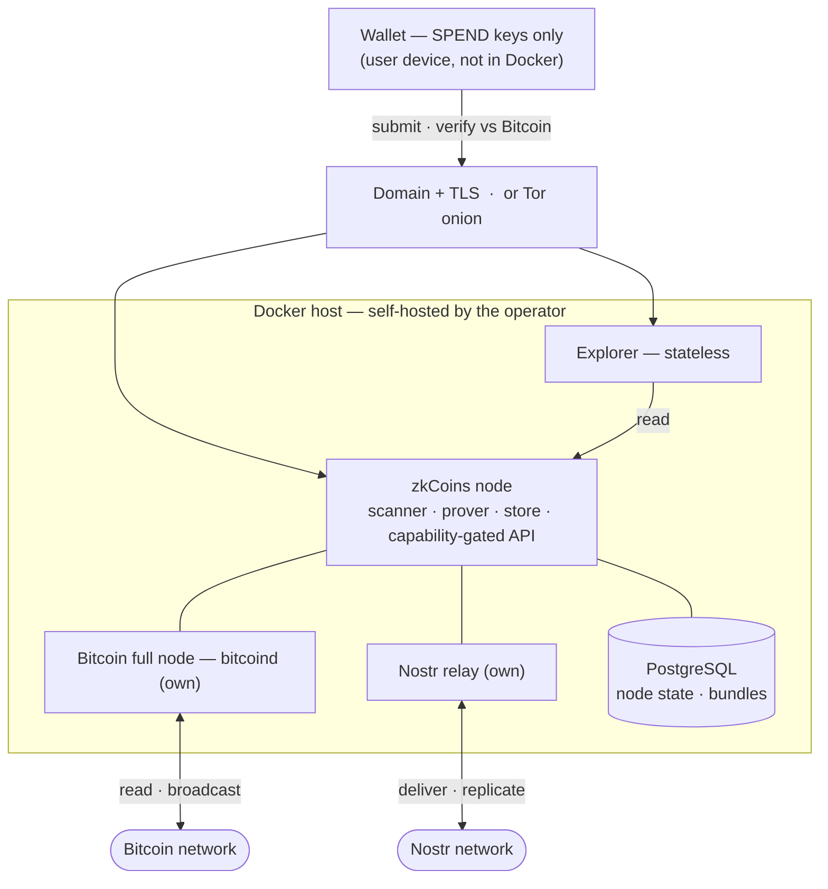

# 6 · System Architecture

> *In one sentence: how node, wallet, and explorer fit together, why running your own node is the trustless default, and how permissionless asset creation and node portability come out of the same design.*

This page specifies **how the parts fit together**: the three components (node, wallet, explorer), the wallet↔node relationship, node portability and multi-node operation ([Requirement 10](/requirements)), the node's external interfaces, versioned issuance ([Requirement 8](/requirements)), and the threat model. It builds strictly on [Foundations](foundations) — the key hierarchy (§1.2), per-coin keys (§1.3), identifiers (§1.4), and the nullifier accumulator (§1.6) — and references the sibling sections for the mechanisms they own rather than re-specifying them.

Normative keywords (**MUST**, **MUST NOT**, **SHOULD**, **MAY**) are used per RFC 2119.

## 6.1 Components and responsibilities

zkCoins is exactly three components. The split between them is **packaging, not a trust boundary**: it mirrors the Bitcoin full-node model (a validator plus a thin key-holder). The one line never crossed is the SPEND branch — it lives only in the wallet.

### The node — validator, prover, relay, store

The node is the always-on workhorse. It **MUST** be runnable as a single self-contained container with no operator-specific dependencies ([Requirement 7](/requirements)). Its responsibilities:

- **Bitcoin scanner.** Reads Bitcoin L1, extracts inscribed `SpendRecord`s (Foundations §1.4), and rebuilds the global nullifier accumulator (Foundations §1.6) from the public chain **alone** — the spent nullifiers are published in the clear, so no off-chain data is needed. See [On-chain Layer](onchain).
- **Prover.** Builds the recursive validity proofs for transactions it is asked to construct. See [Proofs & State Transitions](proofs).
- **Nostr relay.** Stores and serves the off-chain `CoinProof` bundles, performs `detect_tag` discovery, and carries gift-wrapped transport. See [Transport & Recovery](transport-recovery).
- **Data store.** Persists bundles and rebuilt tree state; provides the operator's own backup ([Requirement 6](/requirements)).
- **Capability-gated API.** Answers reads only against a valid ownership proof or view grant, and accepts transaction submissions. See [Access & Explorer](access-explorer) and §6.4 below.

**Keys it holds.** For accounts that delegate to it, the node holds the **operational bundle** `{ivk, ovk, op}` (Foundations §1.2): `ivk` to detect and decrypt incoming coins, `ovk` to recover outgoing-coin plaintext, and `op` to act as the account's Nostr identity and to sign view grants and acknowledgements. For a *foreign* account it holds only an `op`-signed **view grant**, never the bundle directly.

**What it cannot do.** A node **MUST NOT** be able to spend, forge, or double-spend: it never holds any SPEND-branch key (`skᵢ`, `nk`), and value integrity is enforced by proof soundness and the nullifier accumulator, not by the node's honesty. A node **MAY** lie or withhold data, but it cannot make the wallet accept an unverifiable answer (§6.3).

### The wallet — thin key-holder

The wallet holds the **seed** and is the sole custodian of the SPEND branch (`A/0'`, i.e. `skᵢ` and `nk`; Foundations §1.2). Its responsibilities:

- Derive all keys deterministically from the seed (Foundations §1.2); hold **no** node-specific state.
- Sign each transition — produce `BIP-340(skᵢ, message)` over `message = inr ‖ ocr` (Foundations §1.4) — and compute nullifiers `nf = Hc("Nullifier", nk ‖ coin.identifier)`.
- Delegate the operational bundle to its **own** node, or issue a scoped view grant to a **foreign** node (§6.2).
- Fetch authoritative state from its node(s) and **independently verify** it against Bitcoin before signing or accepting a received coin ([Requirement 4](/requirements)).

**What it cannot do.** The wallet **MUST NOT** be required to be online continuously: detection, decryption, and serving are delegated to the node so that liveness does not depend on the wallet. The wallet performs no relay duty itself.

### The explorer — stateless presentation

The explorer is a **stateless** read surface over one or more nodes. It holds **no keys** and no private state of its own. Given a per-coin view capability `K_tx` (Foundations §1.3) — carried in a shareable link — it decrypts and presents exactly one transaction and verifies that confirmation against Bitcoin ([Requirement 9](/requirements)). It **MUST** be self-hostable and **MUST NOT** assert any fact it cannot derive verifiably from a node's data and the chain. See [Access & Explorer](access-explorer).

### Running a node — what an operator deploys

The logical roles above map onto a small, fully **self-hosted** stack. Every part is the operator's own; using a third party for any of them would reintroduce a central element and is therefore out of scope for a sovereign node.



- **Container runtime** (Docker or compatible) — the base; each part ships as a container.
- **Bitcoin full node** (`bitcoind`, the operator's own) — the source of truth for **reading** the chain (the scanner) and for **broadcasting** the publisher's Taproot reveal transactions. A third-party chain source (Electrum/Esplora/etc.) would reintroduce a trusted dependency and eclipse risk, and is not used.
- **Nostr relay** — stores and serves the off-chain `CoinProof` bundles and carries gift-wrapped transport. It **MAY** be embedded in the zkCoins-node image or run as a separate relay container; either way it is the operator's **own** relay.
- **Reachable address** — an internet domain with TLS so wallets, explorers, and peer nodes can reach the node's API and relay. A Tor onion service **MAY** be used instead for IP privacy.
- **zkCoins node** — the core software: Bitcoin scanner, prover, data store, and capability-gated API (and the relay role, if embedded).
- **PostgreSQL** — the node's database; persists the rebuilt nullifier set and the off-chain `CoinProof` bundles (the concrete backing of the data-store role).
- **Explorer** — the stateless presentation surface ([Access & Explorer](access-explorer)), typically co-hosted as its own container reading the node; it holds no keys.

The only thing that is **never** part of a node deployment is the SPEND branch — those keys live solely in the wallet, on the user's device ([Foundations §1.2](foundations)).

## 6.2 Wallet ↔ node

The wallet is a **thin client**. It never delegates spend authority; it delegates only viewing and serving:

- **Own node.** The wallet entrusts its node with the full operational bundle `{ivk, ovk, op}` (Foundations §1.2) over an authenticated, encrypted channel. The node can then receive, decrypt, discover, and serve on the account's behalf 24/7. None of the bundle can spend.
- **Foreign node.** The wallet **MUST NOT** hand a foreign operator the bundle. Instead it issues that node a scoped, `op`-signed **view grant** (Bech32m HRP `zkgrant`, Foundations §1.7) that authorises a bounded read — defined in [Access & Explorer](access-explorer).

Before it signs, the wallet **MUST** fetch the current authoritative state (the account's latest `AccountState`, the relevant nullifier-set state, and the input bundles) from its node(s) and verify it against Bitcoin. The wallet treats node-supplied data as *claims to be checked*, never as trusted truth.

## 6.3 Node portability and multi-node operation

[Requirement 10](/requirements) is met structurally: **a wallet depends on no node-specific state.** Every key, identifier, nullifier, and detection tag is derived from the seed (Foundations §1.2–§1.4), and the one global structure — the nullifier accumulator — is rebuildable by any node from the public chain alone (Foundations §1.6). Therefore:

- A wallet **MAY** switch nodes at any time, by configuration alone, with no migration step. No node can lock a wallet in.
- A wallet **MAY** use **multiple nodes simultaneously** — querying several, submitting through one or more.

**Why multi-node is safe.** The wallet verifies every answer against Bitcoin (§6.2, [Requirement 4](/requirements)). An honest node returns verifiable truth; a dishonest one cannot forge a valid proof or a valid on-chain `SpendRecord`. So when the wallet fans a query out to several nodes, it **MUST** keep the answer that verifies and **MAY** ignore all others. This is the **"at least one honest node"** property: correctness holds as long as ≥1 queried node is honest. It depends on client-side verification — without it, more nodes would not help. The configurations this yields are tabulated in the [Trust Model](/architecture/trust-model).

## 6.4 External interfaces (abstract)

The node exposes four interface families, specified here at an implementation-neutral level; the owning sections define their exact payloads.

| Interface | Direction | Capability required | Purpose | Specified in |
|---|---|---|---|---|
| **read.account** | wallet/node → node (pull) | an **ownership proof** (sign the challenge with `sk₀`) **or** an `op`-signed **view grant** | fetch `AccountState`, balances, owned coins, and their bundles | [Access & Explorer](access-explorer) |
| **read.proof** | wallet → node (pull) | ownership proof | fetch a `CoinProof` and its `inclusion_proof` for re-verification | [Access & Explorer](access-explorer) · [Proofs](proofs) |
| **submit.tx** | wallet → node (push) | none (proof is self-authenticating) | submit a transition for proving and on-chain publication | [On-chain Layer](onchain) |
| **relay.\*** | any ↔ node (Nostr) | NIP-44 / NIP-59 envelope; `detect_tag` for discovery | publish/fetch off-chain bundles, gift-wrapped delivery, note discovery | [Transport & Recovery](transport-recovery) |
| **explorer.read** | explorer → mesh / node | a bearer view secret (`zkview` per coin, `zkavk` for full history) or a balance attestation, applied **client-side** | render a disclosed view: one transaction, full account history, or a balance | [Access & Explorer](access-explorer) |

The `read.account` path is **capability-gated**: a node **MUST** reject a request that does not present a valid ownership proof or `op`-signed view grant. Bearer view secrets (`zkview`/`zkavk`) and balance attestations are **not** node authorisations — the explorer applies them client-side to bundles obtained from the relay mesh or a holder, so `explorer.read` widens only what the secret-holder can decrypt from already-public material ([Access & Explorer §5.1](access-explorer)). The `submit.tx` path needs no capability because the submitted transition carries its own validity proof and self-authenticating `SpendRecord`; a node **MUST** verify that proof before publishing.

## 6.5 Issuance — versioned schemas, v1 (minimal)

A new asset is created by fixing its `asset_id` ([Foundations §1.4](foundations)) and binding **versioned issuance terms** into the mint circuit. Issuance is **schema-versioned**: each asset is created under one `IssuanceTerms` version, the version is bound into `asset_id` itself, and every coin minted under that asset inherits its version through `asset_id`. Versions are added over time; a coin's version determines which rule set governs its mints, and a coin minted under one version can never be misinterpreted under another.

**Single-issuer model (v1).** The asset's `asset_id` commits to `creator_pubkey = Pk₀` of the issuing account (Foundations §1.4). Only the holder of `sk₀` of that account can sign a transition for it; mint authority is therefore **monopolised on the creator** by construction. *"Permissionless issuance"* in this spec means **anyone can create their own asset** — not that anyone can mint someone else's. Within their own asset, the creator **MAY** mint any amount at any time; v1 imposes no protocol-level cap. Supply discipline is a **creator's commitment**, not a protocol guarantee — holders trust the creator the way they would any single-issuer asset. Account-level forks (a creator signing two parallel histories with the same `Pk₀`) are publicly observable on Bitcoin because the rotating per-transition pubkey `Pkᵢ` would appear in two distinct `SpendRecord`s, and that observability is the holders' detection point if a creator over-issues against an off-chain promise.

### v1 issuance terms

```
IssuanceTerms_v1 = {
  asset_id          : field,        // = Hc("AssetId", genesis_tag ‖ creator_pubkey
                                    //         ‖ H(name) ‖ decimals ‖ issuance_version)
                                    //   (Foundations §1.4)
  issuance_version  : u8 = 1,       // the schema version this asset is created under
  name_hash         : digest,       // = H(name); the human-readable name is NEVER on-chain
  decimals          : u8,           // display precision; bound into asset_id, no in-circuit effect
  terms_hash        : field         // = Hc("IssuanceTerms", asset_id ‖ issuance_version)
                                    //   (v1 has no fields beyond what asset_id already binds;
                                    //   issuance_version is re-absorbed here as belt-and-
                                    //   suspenders explicit version-binding — redundant with
                                    //   asset_id but harmless; later versions extend this list)
}
```

The v1 mint proof (see [Proofs & State Transitions](proofs)) **MUST** verify, in-circuit, that:

- (a) `IssuanceTerms.issuance_version == 1` — this circuit accepts only v1 mints;
- (b) the coin's `asset_id` equals `IssuanceTerms.asset_id`;
- (c) `terms_hash` recomputes from `asset_id ‖ issuance_version` per the formula above.

There is no clause (d), (e), or beyond in v1: no protocol-enforced cap, no per-mint quantum, no time window, no signer set beyond the creator. Those are deliberately deferred to later versions.

### Forward compatibility: future versions

Later issuance schemas — `IssuanceTerms_v2`, `v3`, … — **MAY** introduce protocol-enforced supply rules (cap_total, per-mint quantum, time windows, multi-signer mint authority, redemption mechanisms, etc.). Each new version is a separate `IssuanceTerms` schema with its own circuit-enforced rules; the version-binding through `asset_id` ([Foundations §1.4](foundations#14-identifiers-and-hashes)) guarantees that a coin minted under one version cannot be misinterpreted under another.

The dispatch model is **fixed by the cyclic-recursion constraint** of [Proofs §2.1 clause 1](proofs#21-the-compliance-predicate): the verifier data **MUST** be fixed and identical in prover and verifier, so a single account's recursive lineage cannot cross verifier-data boundaries. Adding a v2 schema therefore **MUST** take the form of an **in-circuit version branch within the same circuit** `C` — extending `C` to accept both `issuance_version == 1` and `issuance_version == 2` mints — *not* a separate per-version circuit, which would break cyclic recursion the moment an account that minted v1 attempts to mint v2 in the same lineage. The single-circuit-with-version-branching dispatch is therefore the only PCD-compatible option; the open question for v2 is the *contents* of the version branch (which protocol-enforced rules to add), not the dispatch.

The human-readable `name` is **never** placed on-chain (Foundations §1.4).

## 6.6 Threat model and trust configurations

Custody is **cryptographically safe in every configuration**: no node holds a SPEND-branch key (Foundations §1.2), value integrity is enforced by proof soundness and the nullifier accumulator, and every spend publishes its nullifier in an immutable on-chain `SpendRecord`. The three wallet–node configurations differ only in **privacy** and in **whom you trust for correctness and availability** — never in custody. The authoritative matrix lives in the [Trust Model](/architecture/trust-model); summarised:

- **Own wallet + own node.** Full privacy, trustless correctness, safe custody. The node sees your plaintext, but you are the operator, so nothing leaks.
- **Own wallet + multiple foreign nodes.** Plaintext is disclosed to all of them; correctness is safe **as long as ≥1 is honest** (§6.3); custody safe.
- **Own wallet + a single foreign node.** Plaintext disclosed to it; you trust it for correctness and liveness (it can lie or omit), but it **cannot** steal, forge, or double-spend; custody safe.

**Inherited assumption.** zkCoins anchors on Bitcoin and therefore inherits Bitcoin's network-liveness assumption: if **all** of a node's peers lie (an eclipse attack), even a self-hosted node can be fed a false view of the chain. zkCoins adds no new consensus and so neither weakens nor strengthens this "≥1 honest peer" assumption.

**Bitcoin reorg bound.** zkCoins assumes Bitcoin produces no canonical reorganisations deeper than **5 blocks** ([On-chain §3.9](onchain#39-finality), [§3.10](onchain#310-transaction-states)). A reorg of 6 blocks or more is treated as a **protocol-failure event** — outside the spec's guaranteed state machine. Under this assumption, a `SpendRecord` once classified `completed` stays `completed`. This is consistent with the Bitcoin-industry default of treating 6 confirmations as practical finality; deployments handling extreme value **MAY** adopt additional out-of-band confirmation policies, but the on-chain `completed` state remains defined at 6 confirmations.

## 6.7 Security-properties summary

How this architecture maps to the [Requirements](/requirements) at a glance:

| Requirement | How the architecture meets it |
|---|---|
| **1 · Bitcoin-only base** | One node component scans and inscribes to Bitcoin L1; no separate chain, token, or consensus. |
| **2 · Private** | Node serves only opaque `SpendRecord`s publicly; per-coin encryption (Foundations §1.3) gates plaintext to capability holders. |
| **3 · Trustless** | No component holds a spending key (§6.1); integrity from proofs + nullifier accumulator, not node honesty (§6.6). |
| **4 · Client-side validation** | Wallet re-verifies every node answer against Bitcoin before accepting (§6.2–§6.3). |
| **5 · Custody only in wallet** | SPEND branch never leaves the wallet; only the operational bundle / view grants are delegated (§6.2). |
| **6 · Recovery** | Node store is the normal backup; seed + chain + replicated bundles are the emergency fallback (§6.1). |
| **7 · Self-hostable** | Node ships as one self-contained container with no operator-specific dependencies (§6.1). |
| **8 · Multi-asset** | `asset_id` plus `issuance_version`-bound `IssuanceTerms_v1` lets anyone create their own asset; the creator is the sole minter of their asset (§6.5). |
| **9 · Explorer** | Stateless explorer resolves one transaction from a per-coin `K_tx`, verified against Bitcoin (§6.1). |
| **10 · Node portability** | No node-specific wallet state; switch and multi-node by configuration alone (§6.3). |
